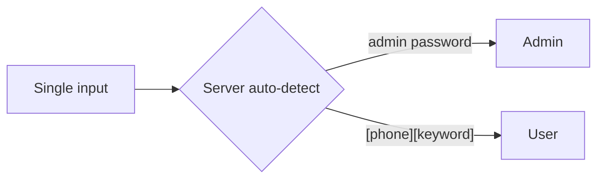
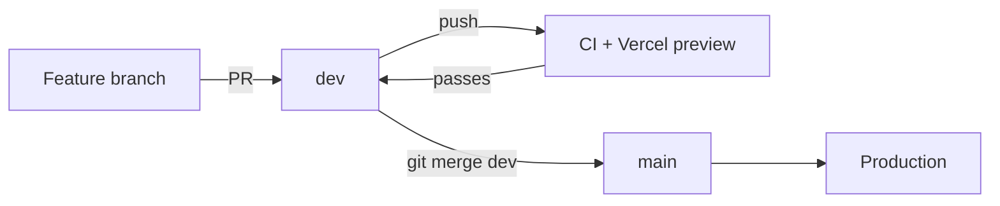

# 1. Cloudy

Cloud Calendar Movement — an internal tool for managing company personnel, leave/event
records, and Key Appointment Holder (KAH) constraints, with Google Calendar as the
event/visibility layer.

## Table of contents

- [1.1 Tech stack](#11-tech-stack)
- [1.2 Getting started](#12-getting-started)
- [1.3 Scripts](#13-scripts)
- [1.4 Environment](#14-environment)
- [1.5 Login](#15-login)
- [1.6 Project structure](#16-project-structure)
- [1.7 CI](#17-ci)
- [1.8 Git workflow](#18-git-workflow)
- [1.9 Deployment (Vercel)](#19-deployment-vercel)
- [1.10 Google integration](#110-google-integration)
- [1.11 Database migrations](#111-database-migrations)

## 1.1 Tech stack

- **Framework:** Next.js 16 (App Router) + TypeScript
- **UI:** Mantine v9
- **Hosting:** Vercel (dev previews from `dev` branch, prod from `main`)
- **Database:** Neon Postgres + Drizzle ORM
- **Auth:** NextAuth v4 (Credentials provider, JWT sessions)
- **Google:** Service account for Calendar v3 + Gmail v1 (currently stubbed)

## 1.2 Getting started

```bash
pnpm install
cp .env.example .env.local
# fill in .env.local (see Environment below)
pnpm db:push          # create/update schema in Neon (needs DATABASE_URL in the shell — see 1.11)
pnpm dev
```

## 1.3 Scripts

| Command            | Description                              |
| ------------------ | ---------------------------------------- |
| `pnpm dev`         | Start the dev server (Turbopack)         |
| `pnpm build`       | Production build                          |
| `pnpm lint`        | ESLint                                    |
| `pnpm typecheck`   | TypeScript check                          |
| `pnpm test`        | Vitest (run once)                         |
| `pnpm test:watch`  | Vitest in watch mode                      |
| `pnpm db:generate` | Generate Drizzle migrations               |
| `pnpm db:push`     | Push schema directly to the database      |
| `pnpm db:migrate`  | Apply generated migrations                |

## 1.4 Environment

| Variable                          | Purpose                                        |
| --------------------------------- | ---------------------------------------------- |
| `DATABASE_URL`                    | Neon Postgres connection string                |
| `NEXTAUTH_SECRET`                 | Session signing secret (`openssl rand -base64 32`) |
| `NEXTAUTH_URL`                    | App URL (default `http://localhost:3000`)      |
| `GOOGLE_SERVICE_ACCOUNT_BASE64`   | Base64-encoded GCP service account JSON key    |
| `GOOGLE_CLIENT_EMAIL`             | Fallback service account email                 |
| `GOOGLE_PRIVATE_KEY`              | Fallback service account private key           |
| `GOOGLE_DELEGATE_EMAIL`           | Workspace delegate for Gmail send-as / ACL     |

## 1.5 Login

Single input field. The server auto-detects:



- **Admin** — enter the admin password.
- **User** — enter `[phone][keyword]`, e.g. `91234567leave`.

## 1.6 Project structure

```
src/
  app/
    (protected)/          # authenticated routes (AppShell + nav)
    api/auth/[...nextauth] # NextAuth handler
    login/                 # login page
  components/              # reusable UI (LoginForm, AppShellShell, CalendarSelect, ...)
  db/                      # Drizzle schema + client
  lib/
    auth.ts                # NextAuth config
    session.ts             # session/role guards
    login.ts               # pure login parsing (unit tested)
    google/                # Google integration interface + stub
  types/                   # NextAuth type augmentation
```

## 1.7 CI

GitHub Actions runs lint, typecheck, test, and a schema-drift check on every push/PR.
Quality gates only — Vercel handles deployments from `dev` and `main`.

## 1.8 Git workflow

`dev` is the working branch; `main` is production. All day-to-day work happens on `dev`
(or short-lived feature branches off it), and `main` only moves forward when `dev` is
ready to ship.



1. **Work on `dev`.** Commit directly, or branch off `dev` for anything risky and merge
   back with a PR. Every push to `dev` triggers CI + a Vercel preview build.
2. **Keep `dev` deployable.** CI must pass before pushing. Preview builds serve as the
   integration check.
3. **Ship with a merge, never a cherry-pick.** When `dev` is production-ready:

   ```bash
   git checkout main
   git merge dev
   git push origin main
   ```

   Always move changes between `dev` and `main` with `git merge` — cherry-picking the
   same commits across branches creates duplicate commits with different SHAs (as happened
   early in this repo). Merge keeps history linear and each commit existing once.
4. **Finish or stash before switching branches.** Commit or stash your working tree before
   `git checkout`, or files left untracked/uncommitted get stranded on whichever branch you
   happened to land on.
5. **Optionally protect `main`** with branch rules (require a PR + passing CI) so nothing
   reaches production unreviewed.

## 1.9 Deployment (Vercel)

Vercel auto-builds on every push: `main` → production, `dev` → preview.

Required configuration:

1. **Environment variables** (Project → Settings → Environment Variables):
   - `ENABLE_EXPERIMENTAL_COREPACK` = `1` — makes Vercel honor the
     `packageManager` field (pnpm `11.18.0`). Without it, Vercel falls back to pnpm 10
     (detected from `lockfileVersion: 9.0`), which ignores `allowBuilds` and emits the
     "Ignored build scripts" warning for `esbuild`, `sharp`, and `unrs-resolver`.
   - `DATABASE_URL` — Neon Postgres connection string.
   - `NEXTAUTH_SECRET` — session signing secret (`openssl rand -base64 32`).
   - Leave `NEXTAUTH_URL` **unset** — Vercel injects `VERCEL_URL` and NextAuth falls
     back to it automatically. Do not add it as an empty value, or the build fails with
     `TypeError: Invalid URL` during prerender.

2. Native build scripts for `esbuild`, `sharp`, and `unrs-resolver` are approved via
   `allowBuilds` in `pnpm-workspace.yaml` (pnpm 11 format).

## 1.10 Google integration

Google Calendar/Gmail calls go through `getGoogleIntegration()`. When service-account
credentials (`GOOGLE_SERVICE_ACCOUNT_BASE64`, or `GOOGLE_CLIENT_EMAIL` + `GOOGLE_PRIVATE_KEY`)
are present it returns the real Calendar v3 client (calendar + event read/write, ACL
sharing); otherwise it falls back to a no-op stub so the app runs without GCP credentials.
Gmail send-as is still stubbed until Workspace domain-wide delegation is provisioned.

## 1.11 Database migrations

Schema lives in `src/db/schema.ts`. The workflow for changing it:

```bash
pnpm db:generate   # no DB needed — writes drizzle/*.sql + drizzle/meta/ from the schema
# commit both the generated drizzle/*.sql migration and the drizzle/meta/ files
pnpm db:migrate    # apply pending migrations to Neon
```

`db:generate` needs no database. `db:migrate` and `db:push` connect to Neon and **require
`DATABASE_URL` in the shell environment** — `drizzle-kit` does **not** read `.env.local`, so
running them directly fails with `Please provide required params for Postgres driver: url: ''`.

On Windows PowerShell, load the variable from `.env.local` first:

```powershell
$line = Get-Content .env.local | Where-Object { $_ -match '^DATABASE_URL=' } | Select-Object -First 1
$env:DATABASE_URL = $line.Substring(13).Trim()
pnpm db:migrate
```

Command roles:

| Command            | Needs DB | Notes                                                        |
| ------------------ | -------- | ------------------------------------------------------------ |
| `pnpm db:generate` | no       | Generate migrations from the schema (offline)                |
| `pnpm db:migrate`  | yes      | Apply generated `drizzle/*.sql` migrations (the real path)   |
| `pnpm db:push`     | yes      | Push the schema directly — dev convenience only              |
| `pnpm db:seed`     | yes      | Dev seed; **reads `.env.local` itself**, no shell step needed |

In CI, the `migrate` job applies pending migrations on `main` pushes via the `DATABASE_URL`
repo secret, and the schema-drift check runs `pnpm db:generate` then fails on any diff to
`drizzle/` — so committed migrations stay in sync with the schema.
