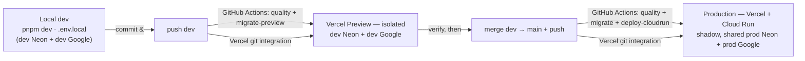
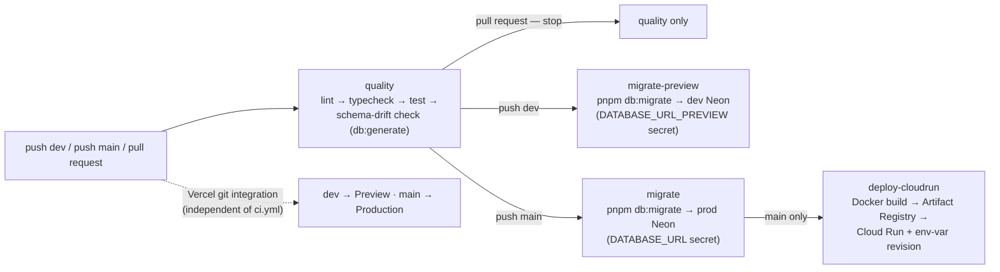

# 1. Cloudy2

Cloud Calendar Movement — an internal tool for managing company personnel,
leave/event records, and Key Appointment Holder (KAH) constraints, with Google
Calendar as the event/visibility layer. Single Next.js 16 (App Router) app, no
monorepo.

## Table of contents

- [1.1 Features](#11-features)
- [1.2 Tech stack](#12-tech-stack)
- [1.3 Quick start](#13-quick-start)
- [1.4 Development & deployment (at a glance)](#14-development--deployment-at-a-glance)
  - [1.4.1 The moving parts](#141-the-moving-parts)
  - [1.4.2 The pipeline](#142-the-pipeline)
  - [1.4.3 Hosting environments](#143-hosting-environments)
- [1.5 Documentation](#15-documentation)

## 1.1 Features

- **Calendar across departments** — Month / Week (H) / Week (D) / Day / Agenda /
  Month & Agenda views over every department's Google Calendar, with
  user/department/type filters, pinned view tabs, and a fullscreen wall-display mode.
- **Events** — staged wizard (type → time → location → invitees → remarks → review)
  writing one copy per involved department calendar, with cross-department copy
  reconciliation, duplicate/edit/delete, location policy per event type, and
  round-tripped edit deep links in the Google event notes.
- **Pinned events** — an agenda of explicitly-pinned upcoming events with a live
  count badge, deep-linking into the calendar.
- **Parade state** — today's roll call by (nested) department with an attendance
  mode and a copyable report.
- **KAH constraints** — per-group in-country percentage requirements, a notify-only
  breach check after every event mutation, breach emails (Workspace or SMTP), and a
  read-only KAH Status page for members.
- **Admin surface** — users, department hierarchy + Google ACL sharing, event types,
  title/display-name templates, quick links, announcement banner, audit log with
  retention + CSV export, outbound webhooks with HMAC signatures.
- **PWA** — installable, instant open, offline read-only with saved-view fallback.
- **Mobile-first** — bottom nav and touch layouts on phones; sidebar shell and dense
  tables at the desktop breakpoint.

## 1.2 Tech stack

Next.js 16 (App Router, Turbopack) + TypeScript · Mantine v9 · Neon Postgres +
Drizzle ORM · NextAuth v4 (Credentials, JWT sessions) · Serwist PWA · Vitest ·
Hosting: Vercel (`dev` → preview, `main` → production) + a Cloud Run **shadow**
(`main`-only) mirroring prod from the same commit · Google service account
(Calendar v3 + Gmail v1, no-op stub when unconfigured).

## 1.3 Quick start

```bash
pnpm install
cp .env.example .env.local   # fill in DATABASE_URL, NEXTAUTH_SECRET, ADMIN_INITIAL_PASSWORD, ADMIN_PIN
pnpm db:migrate              # needs DATABASE_URL in the shell — see the developer guide §1.11
pnpm dev                     # sign in: [phone][keyword], or the phone-less emergency password
```

Full setup, environment, CI, deployment, and migration workflows:
[`docs/developer-guide.md`](docs/developer-guide.md).

## 1.4 Development & deployment (at a glance)

One codebase ships to three tiers: your laptop, an isolated **dev** preview on every
`dev` push, and **production** (`main` only) served from **two** hosts — Vercel
Production and a Cloud Run **shadow** — that share the same data. The full mechanics
(env-var tables, exact commands, Cloud Run setup, migrations) live in
[`docs/developer-guide.md`](docs/developer-guide.md) §1.7–§1.11; what follows is the
plain-English map of the moving parts.

### 1.4.1 The moving parts

- **Vercel** — the live host for preview and production. Its **git integration**
  builds on every push on its own: `dev` → a Preview deployment, `main` → the
  Production deployment. Each Vercel environment gets its own copy of every
  environment variable (Project → Settings → Environment Variables).
- **GitHub Actions** (`.github/workflows/ci.yml`) — the quality gate + database
  migration runner + Cloud Run deployer. Runs independently of Vercel on the same
  pushes.
- **Neon Postgres × 2** — a dedicated **dev** project and a dedicated **prod**
  project (separate accounts). Schema changes are committed Drizzle migrations
  (`drizzle/*.sql` + `drizzle/meta/`) that CI auto-applies to the right database.
- **Google service accounts × 2** — a dev and a prod service account (separate
  accounts). Departments are real Google calendars, so each environment must use its
  own calendar set.
- **Cloud Run shadow** — a `main`-only deployment (`cloudy2`, region
  `asia-southeast1`) of the same Docker image that runs Vercel's production build,
  pointed at the same prod Neon + prod Google account. Its job is to validate the
  Cloud Run migration path against real prod data — read-only checks are safe;
  anything that writes prod data writes it twice.


```mermaid
flowchart LR
    LOCAL["Local dev<br/>pnpm dev · .env.local<br/>(dev Neon + dev Google)"]
    PUSH1["push dev"]
    PREV["Vercel Preview — isolated<br/>dev Neon + dev Google"]
    MAIN["merge dev → main + push"]
    PROD["Production — Vercel + Cloud Run<br/>shadow, shared prod Neon + prod Google"]
    LOCAL -->|"commit &"| PUSH1
    PUSH1 -->|"GitHub Actions: quality + migrate-preview"| PREV
    PUSH1 -->|"Vercel git integration"| PREV
    PREV -->|"verify, then"| MAIN
    MAIN -->|"GitHub Actions: quality + migrate + deploy-cloudrun"| PROD
    MAIN -->|"Vercel git integration"| PROD
```

All day-to-day work lands on `dev`; `main` only ever advances by merging `dev`. The
two environments are fully isolated, so dev activity — events, calendars, ACLs,
emails — never touches prod data.

### 1.4.2 The pipeline

GitHub Actions runs this pipeline on every push/PR; Vercel's own builds happen in
parallel on the same pushes.


```mermaid
flowchart LR
    TRIG["push dev / push main / pull request"] --> Q["quality<br/>lint → typecheck → test →<br/>schema-drift check (db:generate)"]
    Q -->|"pull request — stop"| PR["quality only"]
    Q -->|"push dev"| MP["migrate-preview<br/>pnpm db:migrate → dev Neon<br/>(DATABASE_URL_PREVIEW secret)"]
    Q -->|"push main"| MIG["migrate<br/>pnpm db:migrate → prod Neon<br/>(DATABASE_URL secret)"]
    MIG -->|"main only"| CR["deploy-cloudrun<br/>Docker build → Artifact Registry →<br/>Cloud Run + env-var revision"]
    TRIG -. "Vercel git integration<br/>(independent of ci.yml)" .-> VER["dev → Preview · main → Production"]
```

- **`quality`** runs on every push and PR: `pnpm lint` → `pnpm typecheck` → `pnpm
  test` → a schema-drift check (`pnpm db:generate`, then fail on any diff to
  `drizzle/`) so committed migrations always match `src/db/schema.ts`.
- **Migrations auto-apply per environment**: a `dev` push runs `migrate-preview`
  against the dev Neon DB; a `main` push runs `migrate` against the prod Neon DB,
  then `deploy-cloudrun` ships the shadow after migrations land. Both migrate jobs
  are branch-gated with their own concurrency group so they never run at once.
- Vercel deploys **independently** of `ci.yml` via its git integration — a `dev`
  push also builds the preview and a `main` push also builds production.

### 1.4.3 Hosting environments

| Tier      | Host                                                                         | Deploy trigger                                      | Database / Google accounts |
| --------- | ---------------------------------------------------------------------------- | --------------------------------------------------- | -------------------------- |
| **Local** | `pnpm dev` on your machine (`.env.local`)                                    | —                                                   | dev Neon + dev Google (from `.env.local`) |
| **Dev**   | Vercel **Preview** (branch `dev`)                                            | Vercel git integration; CI runs quality + `migrate-preview` | isolated dev Neon + dev Google (separate accounts from prod) |
| **Prod**  | Vercel **Production** (branch `main`) + Cloud Run **shadow** `cloudy2`       | Vercel git integration; CI runs `migrate` → `deploy-cloudrun` | shared prod Neon + prod Google — same commit on both hosts |

Per-tier values for every environment variable (`DATABASE_URL`, the Google
service-account key, `NEXTAUTH_SECRET`, `ADMIN_INITIAL_PASSWORD`, `ADMIN_PIN`,
`SMTP_URL`…) and the Cloud Run shadow's setup (env-var mirrors, `NEXTAUTH_URL`
behavior, resource limits, one-time GCP provisioning) are in
[`docs/developer-guide.md`](docs/developer-guide.md) §1.9–§1.9.1. Two gotchas to
remember:

- Leave `NEXTAUTH_URL` **unset on Vercel** (it injects `VERCEL_URL`); on the Cloud
  Run shadow it **must** be set to the service's `*.run.app` URL — no `VERCEL_URL`
  fallback exists there.
- The dev database is migrations-only — departments and users are created in-app, so
  dev gets its own real calendars under the dev service account.

## 1.5 Documentation

| Document | For | Covers |
| -------- | --- | ------ |
| [`docs/user-guide.md`](docs/user-guide.md) | End users | Signing in, calendar views, events, pinned events, parade state, contacts, KAH status, PWA/offline |
| [`docs/admin-guide.md`](docs/admin-guide.md) | Admins | Acting on behalf, every Settings tab, sharing, KAH, audit log |
| [`docs/developer-guide.md`](docs/developer-guide.md) | Developers | Setup, scripts, env, CI, git workflow, hosting (Vercel + Cloud Run shadow), Google setup, migrations — and the full index of design deep-dives |
| [`AGENTS.md`](AGENTS.md) | AI agents / contributors | Hard rules + entry points for every subsystem |
| [`docs/agents/`](docs/agents/) | AI agents | Issue tracker, triage labels, and domain-doc consumer rules |
| [`progress.md`](progress.md) | Everyone | Current status, locked-in decisions, phase changelog, open items |

Design deep-dives for each subsystem live under [`docs/`](docs/) — the complete
annotated index is [`developer-guide.md` §1.12](docs/developer-guide.md#112-related-docs).
