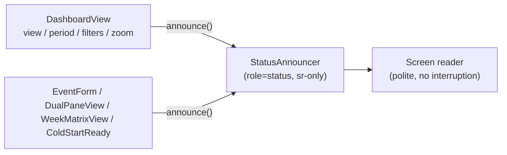

# 1. Accessibility

The app is a touch-first mobile PWA, but keyboard and screen-reader users get
first-class support too. This doc collects the assistive-tech machinery: the
skip link, the polite live region and what feeds it, the skeleton loading
announcements, and the text alternatives on count badges.

## Table of contents

- [1.1 Skip-to-content link](#11-skip-to-content-link)
- [1.2 Status announcements (live region)](#12-status-announcements-live-region)
- [1.3 Loading announcements](#13-loading-announcements)
- [1.4 Count badges & text alternatives](#14-count-badges--text-alternatives)
- [1.5 File index & related docs](#15-file-index--related-docs)

## 1.1 Skip-to-content link

`AppShellShell` renders a `.c2-skip-link` anchor as the **first focusable
element** in the app, before the AppShell root. It is visually hidden
(transformed above the viewport) until keyboard-focused
(`:focus-visible`), then appears as a chip pinned over the header; activating
it moves focus to `AppShell.Main`, which carries `id="main-content"` and
`tabIndex={-1}` so the programmatic focus lands. The styling lives in
`globals.css` (`.c2-skip-link`). The link stays functional in immersive mode —
jumping to the content is still valid when the chrome is hidden.

## 1.2 Status announcements (live region)

State changes that have **no toast** (view/date navigation, filter counts,
zoom level) are invisible to screen readers, so the shell mounts one
persistent polite live region — `StatusAnnouncer` (`src/lib/ui/announcer.tsx`)
— inside `AppShell.Main`. It survives navigations (the shell stays mounted),
and module-level `announce(message)` pushes text into it from anywhere on the
client.

Mechanics:

- The region is `role="status"` (implicit `aria-live="polite"`) +
  `aria-atomic="true"`, rendered with the `.c2-sr-only` class.
- Identical consecutive messages would be ignored by live regions, so the
  announcer clears the text and re-sets it after a short timeout.
- `announce()` is a no-op until the announcer mounts (e.g. on `/login`).

Current call sites (mostly `DashboardView`, plus a few others noted below):

| Trigger | Message |
| ------- | ------- |
| View tab / chevron / Today / date picker / agenda day change | `"Month view, March 2026"` — one watcher on the optimistic chrome (`shownView` + `periodLabel`) covers every path; the first render only records a baseline (no page-load noise) |
| More Filters apply / Myself toggle / Clear | `"2 filters active"` / `"Filters cleared"` (`filterCountMessage` mirrors `activeFilterCount`'s group semantics) |
| Timeline zoom in/out | `"Zoom 125%"` |
| Pinch-to-zoom (touch; also `DashboardView` + `DualPaneView`) | the same zoom string, announced once on release (`"Columns 150%"` for the Week (Grid)'s axis) — the discrete zoom buttons remain the keyboard/screen-reader path |
| Wizard step change (`EventForm`) | `"Step N of M: <name>"` |
| Cold-start readiness (`ColdStartReady`) | `"Calendar up to date"` |

The one-time **"Pinch to zoom"** caption beside the zoom cluster is decorative
(`aria-hidden`, `pointer-events: none`) — the zoom buttons already carry the
accessible names, and the caption is pure touch guidance.

## 1.3 Loading announcements

Skeletons are visual-only, so every skeleton block includes a
**`LoadingStatus`** (`src/components/LoadingStatus.tsx`): a sr-only
`role="status"` element with a label like "Loading calendar…". It is
server-safe (no hooks), so the same component serves:

- every route `loading.tsx` (16 segments), and
- the client-side skeleton swaps — the dashboard's `gridLoading` branch,
  Parade State's `contentLoading` branch, the Audit Log's `listLoading`
  branch, and the Pinned Events panel's fetch skeleton.

New skeleton sites must include it (see [`loading-transitions.md`](loading-transitions.md) §1.4).

## 1.4 Count badges & text alternatives

Visual count badges pair with a text alternative so the number reaches the
accessible name exactly once:

- **Filter buttons** (`FilterButton`, used by Audit Log and Users): the
  `ActionIcon` aria-label becomes `"Filters (2 active)"` when filters are
  applied; the visual `Badge` is `aria-hidden`.
- **Pinned events** header ticker: the count rides the button's aria-label
  (`"Pinned events (3)"`); the inline count chip, the days-remaining countdown
  chip and the rotating titles are `aria-hidden` so the number is read once and
  the 5s title rotation never spams the screen reader. The full list stays
  reachable in the panel it opens.
- The dashboard kebab's filter badge sits inside a `Menu.Target` whose
  `"More options"` name stays static — the filter state is announced via the
  live region instead (§1.2).

Icon-only controls across the app already carry `aria-label`s (the
`FloatingActionButton` contract requires one); active nav items carry
`aria-current="page"`; toggle-style pickers use `aria-pressed`.

## 1.5 File index & related docs

| File | Role |
| ---- | ---- |
| `src/lib/ui/announcer.tsx` | `StatusAnnouncer` live region + `announce()` singleton |
| `src/components/LoadingStatus.tsx` | Sr-only loading announcement for skeleton blocks |
| `src/components/AppShellShell.tsx` | Skip link, `#main-content` target, announcer mount |
| `src/components/PinnedEventsTicker.tsx` | Pinned-count aria-label; `aria-hidden` chip + rotating titles |
| `src/components/FilterButton.tsx` | Dynamic filter-count aria-label |
| `src/app/globals.css` | `.c2-sr-only` + `.c2-skip-link` styles |
| `src/app/(protected)/dashboard/DashboardView.tsx` | View/period/filter/zoom announcements |
| `src/app/(protected)/dashboard/EventForm.tsx` | Wizard step announcements |
| `src/components/ColdStartReady.tsx` | Cold-start readiness announcement |

Related docs:

- [`loading-transitions.md`](loading-transitions.md) — the skeleton convention
  `LoadingStatus` plugs into.
- [`dashboard-views.md`](dashboard-views.md) — the view/filter/zoom mechanics
  the announcements mirror.
- [`announcement-banner.md`](announcement-banner.md) — the admin banner also
  carries `role="status"`.
