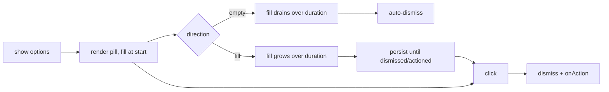

# 1. Action Pill

The **action pill** is the app's bespoke actionable toast: a pill-shaped button that
floats at the bottom of the screen, replacing the ad-hoc Mantine
`notifications.show({ message: <Button/> })` "View event" notification. It is a
reusable, themeable control for any "something happened — here's the one thing to do
next" moment (e.g. **View event** after a save, or an undo action).

## Table of contents

- [1.1 Shape & behavior](#11-shape--behavior)
- [1.2 The two-tone progress fill](#12-the-two-tone-progress-fill)
- [1.3 API](#13-api)
- [1.4 Lifecycle](#14-lifecycle)
- [1.5 File index](#15-file-index)

## 1.1 Shape & behavior

- A single `<button type="button">` that floats fixed at the bottom of the viewport.
  The `default` variant sits centered at the bottom edge. On mobile it sits above
  the bottom nav (via `--app-floating-bottom-offset`), on desktop 16px from the
  edge. The `toast` variant instead nests into the notification corners
  (top-center on mobile, bottom-right on desktop — see §1.3). It is rendered
  from the app root, so it survives route navigations.
- Clicking the pill dismisses it and runs the configured `onAction`.
- Only one pill shows at a time; a new `show(...)` replaces the current one.
- The pill **stores** `onAction` in provider state, so the callback must not read
  React state captured at `show(...)` time — a pill shown from inside an async
  handler keeps the *pre-mutation* closure (the "View event" create/edit bug:
  the just-saved id was absent from the stale event list). Resolve such state at
  click time instead, e.g. through a latest-value ref
  (`optimistic-mutations.md` §1.7).



## 1.2 The two-tone progress fill

The pill body is a **darker** color with white text; a **lighter** color fills it from
the leading edge as a progress indicator.

- **`empty`** (default) — countdown: the fill starts full and drains to nothing over
  `duration`, then the pill auto-dismisses.
- **`fill`** — the fill starts empty and grows to full over `duration`, then persists
  until dismissed/actioned.

Legibility is kept on both tones by rendering the label twice: white over the dark body,
and a dark copy clipped to the light fill (the fill is a full-size layer whose
`clip-path` reveals its leading edge, so both copies stay perfectly aligned). Colors
default to the project brand blue — light `--mantine-color-brand-3` (#8ca8e2) over dark
`--mantine-color-brand-7` (#0D47A1) — and are per-call overridable. The fill's
`clip-path` transition runs the full `duration`, so a countdown drains in step with its
auto-dismiss timer. Under `prefers-reduced-motion: reduce` the pop-in/fade and the sweep
are disabled (the fill snaps; the countdown timer still runs).

## 1.3 API

```ts
import { useActionPill } from "@/components/ActionPill";

const { show, dismiss } = useActionPill();

const id = show({
  label: "View event",        // action verb on the pill
  title: "Event created",     // optional context line above the label
  onAction: () => openDetail(),// runs on click (pill dismisses first)
  duration: 5000,             // ms; default 5000
  direction: "empty",         // "empty" | "fill"; default "empty"
  variant: "default",         // "default" | "toast"; default "default"
  lightColor: "var(--mantine-color-brand-3)", // optional override
  darkColor: "var(--mantine-color-brand-7)",  // optional override
});

dismiss(id); // or dismiss() to dismiss the current pill
```

The `variant` is the presentation, independent of the sweep and the timer:

- **`"default"`** — the classic two-tone pill: dark body, white copy, light
  sweep (§1.2). Right for *timed/auto* actions where the sweep reads as a
  countdown (the SW-update "Reload", which auto-applies when the fill fills).
- **`"toast"`** — a confirmation, not a countdown: light surface + border,
  a green success rail, no sweep fill, single-line copy (title + the action
  verb as plain text in the pill's dark color). The host relocates to the
  notification corners (top-center on mobile, bottom-right on desktop) so it
  nests where the app already shows toasts (§ [globals.css](src/app/globals.css)
  `.c2-action-pill-host--toast` / `.c2-action-pill--toast`). The `"empty"`
  auto-dismiss timer still runs, just without the visible drain.

## 1.4 Lifecycle

- `show` stores one active pill and returns its id; the previous pill (if any) is
  replaced.
- `"empty"` schedules an auto-dismiss timer equal to `duration`, raced with the fill
  transition so the pill is gone exactly when the fill drains.
- `dismiss` (manual, or the auto timer) marks the pill closing — a short fade/slide — and
  unmounts it ~200ms later. Clicking the pill dismisses it and then invokes `onAction`.
- All timers are cleared on unmount; the provider mounts once in `AppProviders` so the
  hook is usable app-wide.

## 1.5 File index

| File | Role |
| ---- | ---- |
| `src/components/ActionPill.tsx` | `ActionPillProvider`, `useActionPill()`, the pill host + view (`variant: "default" \| "toast"`) |
| `src/components/AppProviders.tsx` | Mounts `ActionPillProvider` at the app root |
| `src/app/globals.css` | `.c2-action-pill*` styles, fill clip + motion, `--toast` variant + corner placement |
| `src/app/(protected)/dashboard/EventForm.tsx` | Post-save confirmation dispatch (`savedEventToastVariant`) |
| `src/lib/settings/featureFlags.ts` | `savedEventToastVariantFlag` — classic pill / restyled pill / toast + action / plain toast |

Related docs:

- [`feature-flags.md`](feature-flags.md) — the `savedEventToastVariant` flag
  behind the four post-save confirmation variants.
- [`event-lifecycle.md`](event-lifecycle.md) — the save flow that surfaces the pill.
- [`loading-transitions.md`](loading-transitions.md) — the app's motion cadence the pill
  reuses (`--c2-dur-*`).
