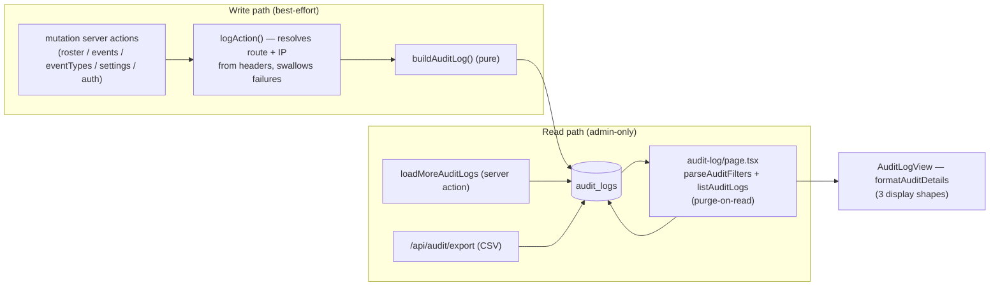

# 1. Audit log

Every state-changing action in the app — logins, user/calendar/event-type
changes, event create/update/delete, access grants, settings updates — writes a
row to `audit_logs`. This document describes the subsystem end to end: the table,
the best-effort write path, the human-readable `details` design, the read side
(filter parsing, keyset pagination, rotation-on-read), the three display
shapes, and the CSV export.

## Table of contents

- [1.1 Problem](#11-problem)
- [1.2 Goals & non-goals](#12-goals--non-goals)
- [1.3 Architecture overview](#13-architecture-overview)
- [1.4 Data model](#14-data-model)
- [1.5 Writing a row](#15-writing-a-row)
- [1.6 The `details` payloads](#16-the-details-payloads)
- [1.7 Reading: filters, pagination, retention](#17-reading-filters-pagination-retention)
- [1.8 Display formatting](#18-display-formatting)
- [1.9 CSV export](#19-csv-export)
- [1.10 The UI](#110-the-ui)
- [1.11 Pure helpers & testing](#111-pure-helpers--testing)
- [1.12 File index & related docs](#112-file-index--related-docs)

## 1.1 Problem

This is an internal tool where admins edit other people's data (roster, events,
access). When something looks wrong — "who changed Bob's department?", "who
deleted that event?" — the answer has to be findable without database access.
The constraints:

- **Logging must never break the action it is auditing**: a failed audit insert
  can't roll back or fail a user edit.
- **Rows must outlive the entities they reference**: users get deactivated and
  renamed; audit rows must still say who did what.
- **Rows must be human-readable**: an admin opening the log should never have to
  interpret raw UUIDs, raw enums, or machine timestamps.
- **The log must be bounded**: an unbounded table would slow the filter queries;
  retention is configurable, with no cron job to run.

## 1.2 Goals & non-goals

**Goals**

- Every mutation writes one row: actor, action, entity, method, route, IP, and a
  human-readable `details` payload.
- Actor identity is **snapshotted** (name + role) — it survives user deletion
  (`actor_id` is `ON DELETE SET NULL`).
- `details` carries display names, not ids; event rows carry the rendered Google
  title and a pre-formatted time string.
- Retention: rows older than the configured window (default 90 days, clamped
  7–365) are purged **on read** — every page render — plus a manual purge button
  that audit-logs itself.
- Export: the current filtered view can be downloaded as CSV, capped at 10,000
  rows per request.

**Non-goals**

- No real-time feed, no webhooks, no per-entity history view (the log is a flat
  stream filtered by entity).
- No PII beyond what the actor/entity snapshots already require; login-failure
  rows store the *derived* phone, never the raw input.
- Not a change-data-capture log: rows are written by the application code at the
  mutation site, not by database triggers.

## 1.3 Architecture overview



## 1.4 Data model

`audit_logs` (`src/db/schema.ts:127`, migration `drizzle/0004_married_sleeper.sql`):

```mermaid
erDiagram
    audit_logs {
        uuid id PK "gen_random_uuid()"
        uuid actor_id "FK users.id, ON DELETE SET NULL (null for Admin)"
        text actor_name "snapshot — survives user deletion"
        text actor_role "snapshot (admin/user)"
        text action NOT NULL "dotted action key"
        text entity_type "user / calendar / eventType / settings / auditLog"
        uuid entity_id "plain column, no FK"
        text entity_name
        text route "from referer header"
        text method "server action name, e.g. createEvent"
        jsonb details "opaque, human-readable by design"
        text ip
        timestamptz created_at NOT NULL "default now()"
    }
    users ||o--o{ audit_logs : "actor_id (set null)"
```

Indexes: `audit_logs_actor_idx (actor_id)`, `audit_logs_action_idx (action)`,
`audit_logs_created_idx (created_at)` — used by the retention purge — and
`audit_logs_entity_idx (entity_type, entity_id)`.

**Retention setting**: `settings.audit_log_retention_days` (`schema.ts:121`,
`integer NOT NULL DEFAULT 90`), edited on the General settings tab.
`normalizeRetentionDays` (`src/lib/settings/validate.ts:68`) rounds, falls back to
90 on non-finite input, and clamps to `AUDIT_RETENTION_MIN` (7) ..
`AUDIT_RETENTION_MAX` (365).

## 1.5 Writing a row

**`logAction(input)`** (`src/lib/audit/log.ts:12`) is the single entry point, used by
every mutation site:

- **Best-effort by construction**: the whole body is in a try/catch; any failure is
  `console.error`'d and swallowed, so logging can never break the primary action.
- **Route**: from the `referer` header via the pure `pathFromReferer`
  (`build.ts:73`, null on garbage), falling back to `input.route`.
- **IP**: first `x-forwarded-for` entry → `x-real-ip` → `input.ip`.
- **Insert**: `db.insert(auditLogs).values(buildAuditLog(...))`.

**Row construction** is the pure `build.ts`:

- `AUDIT_ACTIONS` (`build.ts:6`) — the 19 known dotted action keys:
  `auth.login.success`, `auth.login.failure`, `user.create`, `user.update`,
  `user.status.change`, `calendar.create`, `calendar.rename`, `calendar.delete`,
  `eventType.create`, `eventType.rename`, `eventType.delete`, `event.create`,
  `event.update`, `event.delete`, `access.grant`, `access.update`,
  `access.revoke`, `settings.update`, `audit.purge`. `listAuditActions()` (`:31`)
  feeds the filter dropdown.
- `actorFromUser(user)` (`build.ts:60`) maps a session user to the actor columns;
  the **admin pseudo-account** (`id === "admin"`, which has no users row) stores
  `actor_id: null` with `actor_name: "Admin"`, `actor_role: "admin"`.
- `buildAuditLog(input)` (`build.ts:86`) maps input → insert values, all optional
  fields defaulting to null.
- `entity_type` values actually written: `user`, `calendar`, `eventType`,
  `settings`, `auditLog`. Note: *event* mutations use `entityType: "calendar"` —
  the entity is the department calendar the event lives in
  (`events/actions.ts:431, 600, 678`).

Call sites: `auth.ts` (login success/failure), `roster/actions.ts` (users,
calendars, access), `events/actions.ts` (create/update/delete),
`eventTypes/actions.ts`, `settings/actions.ts`, and `audit/actions.ts` (the purge
itself, §1.7).

## 1.6 The `details` payloads

`details` is a `jsonb` column that is **human-readable by design** — no UUIDs, no
raw enums, no machine datetimes. The shape is one of two things:

- a **flat field object** (label/value lines on display), or
- a **`FieldDiff`** from `diffFields` (`src/lib/audit/diff.ts:17`):
  `{ before, after, changes }` where `changes[key] = [beforeValue, afterValue]` for
  each changed field. `diffFields` iterates the **union of keys** (added/removed
  fields are detected), compares with `JSON.stringify` (deep), and omits
  unchanged fields.

| Action(s) | `details` |
| --------- | --------- |
| `user.create` | flat: name, shortname, phone, email, birthday, role, status, department (**name**, not id) |
| `user.update` | `diffFields(userSnapshot(before), after)` — the snapshot is sanitized (never the password hash) |
| `user.status.change` | `diffFields({ status: old }, { status })` |
| `calendar.create` | `{ googleCalendarId }` |
| `calendar.rename` | name diff |
| `calendar.delete` | `{ googleCalendarId }` |
| `event.create` | flat `EventAuditSnapshot` + `eventId` + `googleEventIds[]` |
| `event.update` | `diffFields(before, after)` + `eventId` |
| `event.delete` | flat `EventAuditSnapshot` + `eventId` + `googleEventIds[]` |
| `access.grant` / `access.update` / `access.revoke` | role diff (previous role read from the ACLs before the mutation) |
| `eventType.create` / `eventType.rename` / `eventType.delete` | field objects; time options / location policy as display labels |
| `settings.update` | single-field diffs (e.g. `auditLogRetentionDays` before/after) |
| `auth.login.failure` | `{ reason: "invalid_credentials" \| "unknown_input" }`; the derived phone (never the raw input) is the `actor_name` |
| `audit.purge` | `{ retentionDays, deleted }` |

The **event snapshots** (`EventAuditSnapshot`, `src/lib/events/eventAudit.ts:23`)
are the richest payload: `{ title, description, type, time, outOfCamp, location,
departments, invitees, creator }` where `title` is the **rendered Google Calendar
title** (the same string written to Google — see
[`event-mutations.md` §1.8](event-mutations.md#18-audit-integration)), `time` is
pre-formatted in the app's UTC+8 wall clock (`2026-08-21 14:00 – 15:30`,
`2026-08-21 (AM) – 2026-08-23 (PM)`), and people/departments are display names.
The *before* snapshot for update/delete is built from the first existing Google
copy found (`snapshotFromCopy`, `eventAudit.ts:150`), so legacy/external/
blank-description events still show their visible title, and fields the notes can't
supply render as the empty marker `—`.

New `details` payloads should stay flat and human-readable: the display layer
renders them as label/value lines with no code changes.

## 1.7 Reading: filters, pagination, retention

### 1.7.1 Filters

`parseAuditFilters(params)` (`src/lib/audit/queries.ts:81`, pure) maps URL params
to `AuditFilters`, trimming and dropping empty values:

| URL param | Filter | Matching |
| --------- | ------ | -------- |
| `actor` | `actor` | `eq(actor_name)` — the snapshot, so it survives deletion |
| `action` | `action` | `eq(action)` |
| `entity` | `entityType` | `eq(entity_type)` |
| `q` | `query` | `ilike` OR across `actor_name, entity_name, route, method, action` |
| `from` / `to` | `from` / `to` | inclusive UTC day bounds — `T00:00:00.000Z` / `T23:59:59.999Z` (`dayBounds`, `:124`) |
| `cursor` | `cursor` | keyset cursor (below) |

Dates pass a **round-trip calendar check** (`validDate`, `:61-75`): `2026-13-45`
and `2026-02-31` are dropped, not just pattern-rejected. The cursor is kept only
if it decodes. `auditFilterConditions` (`:132`) builds the Drizzle `where`
expressions.

### 1.7.2 Keyset pagination

- **Cursor**: `encodeAuditCursor(row)` (`:97`) = base64url of
  `JSON.stringify([createdAtMs, id])` — URL-safe, no padding. `decodeAuditCursor`
  (`:103`) validates the shape (finite number + string) and returns null on any
  malformation.
- **Ordering**: `desc(created_at), desc(id)` — the `id` tiebreaker makes the keyset
  stable for rows sharing a timestamp.
- **`listAuditLogs(filters, opts)`** (`:191`): applies the cursor condition
  `or(created_at < cursorTs, and(created_at = cursorTs, id < cursorId))` (`:202-209`),
  fetches `pageSize + 1`, and returns `{ rows, nextCursor }` — `nextCursor` is the
  encoded last row, or `null` when exhausted. Page size defaults to
  `AUDIT_PAGE_SIZE` (30).

### 1.7.3 Retention: rotation on read + manual purge

- **On read**: `listAuditLogs` purges first when `retentionDays` is given
  (`:195-197`) — the page render passes
  `settings.auditLogRetentionDays`, so **every page render** deletes rows older
  than the window via `purgeExpiredAuditLogs` (`:172`, indexed `DELETE` on
  `created_at`). No cron job is needed: the log rotates whenever anyone looks at
  it.
- **Load more**: `loadMoreAuditLogs` (`audit/actions.ts:25`, admin-gated, page size
  clamped 1–50) deliberately **skips** the purge — it already ran on the preceding
  page render.
- **Manual**: `purgeAuditLogs(days)` (`audit/actions.ts:38`) clamps via
  `normalizeRetentionDays`, purges, and **audit-logs the purge itself**
  (`audit.purge`, `entityType: "auditLog"`, `details: { retentionDays, deleted }`)
  so admins can see it happened. Returns `{ ok, deleted }` without throwing.
- The **export route** passes `retentionDays: null` — exporting must not mutate
  the log.

## 1.8 Display formatting

`src/lib/audit/format.ts` (pure) turns rows into display strings.

**`formatAuditDetails(details)`** (`format.ts:179`) renders three shapes:

| Kind | Recognized as | Rendered as |
| ---- | ------------- | ----------- |
| `changes` | a record whose `changes` is a record (a `FieldDiff`) | one **before → after line** per changed field (missing side = `—`); other flat top-level keys (e.g. `eventId`) as **context value lines**; the full `after` record as a **"Resulting state"** section |
| `fields` | a non-empty record where **every** value is flat (null/scalar/string-or-number array) | one **label/value line** per key — this is also how legacy pre-diff rows and create/grant/purge payloads render |
| `json` | anything else (incl. `null` details) | pretty-printed `JSON.stringify(details, null, 2)` |

Supporting helpers:

- `actionLabel(action)` (`:42`) — all 19 known actions map to labels ("User
  created", "Login failed", …); unknown actions are prettified per segment
  (`"report.generate"` → "Report Generate").
- `fieldLabel(key)` (`:96`) — a ~39-entry key→label map (`departmentId` →
  "Department", `userKeyword` → "Login keyword", `googleEventIds` → "Google event
  IDs"); unknown keys render verbatim.
- `valueString(key, value)` (`:127`) — null/undefined → `EMPTY_VALUE` (`—`,
  `:123`); domain enums mapped by key (`timeOption`/`timeOptions` → "Start &
  End"/"Full Day", `locationPolicy` → "In camp only"/…); booleans → "Yes"/"No";
  strings as-is; arrays joined with `", "`; anything else JSON-stringified.
- `actorLabel(row)` (`:206`) — `"{name} ({role})"`, "Unknown" for a null name.
- `formatLogTimestamp(createdAt)` (`:212`) — `YYYY-MM-DD HH:MM` in
  Asia/Singapore (UTC+8, no DST), computed with a fixed offset.

The client renders these in `AuditLogView` (row cards + a detail modal with the
change lines in before-red/after-teal, the context values, and the "Resulting
state" section; `json` kind in a `pre` inside a scroll area).

## 1.9 CSV export

`/api/audit/export` (`src/app/api/audit/export/route.ts`):

- `GET`, `dynamic = "force-dynamic"`; `requireAdmin()` → redirect to `/login` on
  failure.
- `parseAuditFilters` over the query string — the export respects the current
  filters (the UI builds the URL from the active filter state).
- **Paginates** `listAuditLogs` in pages of up to 500 (with `retentionDays: null`)
  until `EXPORT_MAX_ROWS = 10_000`, so a single request never dumps unbounded
  data.
- Responds `Content-Type: text/csv; charset=utf-8`, `Content-Disposition:
  attachment; filename="audit-log-YYYY-MM-DD.csv"` (UTC date), `Cache-Control:
  no-store`.

The body is built by the pure `buildAuditLogCsv(rows)` (`src/lib/audit/export.ts:38`):
header `created_at,actor,actor_role,action,entity_type,entity_id,entity_name,route,
method,ip,details` plus one line per row; `createdAt` as ISO string; `details`
embedded as a stringified-JSON field so nothing is lost. `csvField` (`:9`)
double-quotes fields containing `"`, `,`, `\r`, or `\n` and doubles inner quotes.

## 1.10 The UI

`/settings/audit-log` (admin-only, one of the settings sub-tabs):

- **Server page** (`settings/audit-log/page.tsx`): `parseAuditFilters` on the URL
  params, then in parallel `getSettings()` + `listAuditActors()` +
  `listAuditEntityTypes()` (the filter dropdown options), then
  `listAuditLogs(filters, { retentionDays })` — **this is where rotation-on-read
  fires** — rendered into `AuditLogView` with the first page, the next cursor,
  the parsed filters, the option lists, and the retention window.
- **Client view** (`AuditLogView.tsx`): a search box (`?q=` on submit), a 3-dot
  filter menu (Actor/Action/Entity type via `NoKeyboardSelect` — the actor options
  come from the distinct DB values, the action options from `listAuditActions()` —
  plus From/To date pickers and a reset), card rows (action label, UTC+8
  timestamp, actor, entity badge, route/method badges, Details button), a
  "Load more" button (server action, re-entry guarded, `loading` +
  `BUTTON_LOADER_PROPS`), a retention card with a red "Delete older than N days"
  confirm button, and a download `FloatingActionButton` (confirm modal →
  `window.location.href` to the export URL built from the current filters).
  Loading follows the standard skeleton-only pattern (`useMinSkeletonHold` +
  `useContentEnter`, see [`loading-transitions.md`](loading-transitions.md)).
- **Detail modal** (`LogDetailModal`): action label + raw action badge, actor ·
  timestamp, entity, route · method, then the `formatAuditDetails` output.

## 1.11 Pure helpers & testing

| Helper | Module | Tests |
| ------ | ------ | ----- |
| `buildAuditLog`, `actorFromUser` (incl. admin → null id), `pathFromReferer`, `listAuditActions` | `audit/build.ts` | `audit/build.test.ts` |
| `diffFields` (union keys, JSON-equality, added/removed, null vs `""`) | `audit/diff.ts` | `audit/diff.test.ts` |
| `parseAuditFilters` (all params, trimming, malformed dates/cursors dropped), `encodeAuditCursor`/`decodeAuditCursor` (round-trip + rejection), `dayBounds` | `audit/queries.ts` | `audit/queries.test.ts` |
| `actionLabel`, `fieldLabel`, `valueString`, `formatAuditDetails` (all three shapes, incl. legacy flat rows and empty diffs), `actorLabel`, `formatLogTimestamp` | `audit/format.ts` | `audit/format.test.ts` |
| `csvField` (escaping), `buildAuditLogCsv`, `auditCsvFilename` | `audit/export.ts` | `audit/export.test.ts` |
| `normalizeRetentionDays` (clamp 7–365, default 90), `validateRetentionForm` | `settings/validate.ts` | `settings/validate.test.ts` |

I/O-bound (not unit-tested, per the repo convention): `logAction` (`log.ts`), the
DB functions in `queries.ts` (`listAuditLogs`, `purgeExpiredAuditLogs`,
`listAuditActors`, `listAuditEntityTypes`, `auditFilterConditions`), the two server
actions in `actions.ts`, the export route, and the page/client components.

## 1.12 File index & related docs

| File | Role |
| ---- | ---- |
| `src/db/schema.ts:127` | `audit_logs` table + indexes |
| `drizzle/0004_married_sleeper.sql` | Migration creating the table |
| `src/lib/audit/build.ts` | Action keys, actor mapping, row builder (pure) |
| `src/lib/audit/log.ts` | `logAction` — best-effort write |
| `src/lib/audit/diff.ts` | `diffFields` before/after diff (pure) |
| `src/lib/audit/queries.ts` | Filter parsing, cursor codec, pagination, purge |
| `src/lib/audit/actions.ts` | `loadMoreAuditLogs`, `purgeAuditLogs` server actions |
| `src/lib/audit/format.ts` | Display formatting, three detail shapes (pure) |
| `src/lib/audit/export.ts` | CSV builder (pure) |
| `src/app/api/audit/export/route.ts` | CSV export route |
| `src/app/(protected)/settings/audit-log/` | Page + `AuditLogView` + `LogDetailModal` + `loading.tsx` |
| `src/lib/settings/validate.ts` | Retention bounds + normalization |
| `src/lib/events/eventAudit.ts` | Event snapshot builders used by the event rows |

Related docs:

- [`event-mutations.md`](event-mutations.md) — the event create/update/delete rows
  and their snapshots.
- [`roster-sharing.md`](roster-sharing.md) — the user/calendar/access rows.
- [`loading-transitions.md`](loading-transitions.md) — the loading pattern the
  audit view follows.
- [`README.md`](../README.md#112-documentation) — documentation index.
- `progress.md` — phase write-ups: 1.57 (viewer + retention + export), 1.73
  (legible details).
