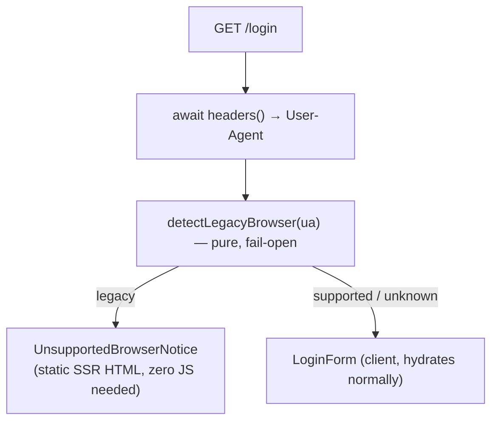

# 1. Browser support

Cloudy2 runs on modern browsers only. The stack — Next.js 16 (App Router) + React
19 + Mantine v9 — compiles the client bundle for the "baseline widely available"
floor, and below that floor the page paints but **no client JavaScript runs**: the
hydration bundle throws during parse/execute, so forms look alive but do nothing
(buttons inert, no spinners, no requests). Legacy browsers are documented as
**unsupported**, not downleveled — React 19 / Next 16 internals cannot be
reliably transpiled to older engines.

## Table of contents

- [1.1 Supported floor](#11-supported-floor)
- [1.2 Why the login form appears dead on old devices](#12-why-the-login-form-appears-dead-on-old-devices)
- [1.3 Unsupported-browser notice (server-rendered gate)](#13-unsupported-browser-notice-server-rendered-gate)
- [1.4 Detection rules (pure, fail-open)](#14-detection-rules-pure-fail-open)
- [1.5 Android: gate on the browser, not the OS](#15-android-gate-on-the-browser-not-the-os)
- [1.6 File index](#16-file-index)

## 1.1 Supported floor

Next.js 16's default `browserslist` is unchanged — there is deliberately **no**
`.browserslistrc` in the repo, so this floor is what the build compiles for:

| Engine | Minimum version | Released |
| ------ | --------------- | -------- |
| Chrome (incl. Android WebView) | 111 | Mar 2023 |
| Edge (Chromium) | 111 | Mar 2023 |
| Firefox | 111 | Mar 2023 |
| Safari / WebKit | 16.4 | Mar 2023 |

## 1.2 Why the login form appears dead on old devices

Reported on an iPhone SE (1st gen, iOS 15.8.8 = Safari 15.8, the last OS for that
device): typing worked, but tapping **Sign in** did nothing (no spinner, no request)
and the password mask toggle gave no feedback. That combination is the exact
signature of **React never hydrating**:

- The login page's server HTML paints (brand pill, title, input, button) — no JS needed.
- The input is a native form field, so typing and `autoFocus` work without JS.
- Every interaction (submit handler, `loading` spinner, mask state) is React — dead
  once the client bundle throws before hydration completes.

iOS Safari freezes the WebKit build string at `AppleWebKit/605.1.15` across all
modern iOS, so the engine is ~14 versions below the floor with no visible
"old WebKit" marker — the only reliable signals are the OS token
(`CPU iPhone OS 15_8`) and Safari's `Version/` token, both of which update with the OS.

## 1.3 Unsupported-browser notice (server-rendered gate)

Instead of a dead-looking form, `/login` serves a static notice on legacy engines.
The check **must** be server-side: a client-side banner would itself need the very
JS that never runs.

Design constraints:

- `login/page.tsx` is an **async Server Component**; the gate runs before any client
  code, so the notice works even when **no JS executes at all**.
- **Scoped to `/login` on purpose.** Reading `headers()` in the root layout (or other
  shared routes) would force dynamic rendering there and break the PWA invariant that
  the start URL `/` answers with the precached shell unconditionally
  ([docs/pwa-offline.md](pwa-offline.md) §1.5.1). `/login` becoming dynamic (it was
  static) is acceptable — it is a public, unauthenticated page outside the
  precached-shell contract.
- The notice replaces the form (not decorates it): a form that can never respond is
  worse than no form.

## 1.4 Detection rules (pure, fail-open)

`detectLegacyBrowser(ua)` in `src/lib/browserSupport.ts` is pure (no I/O) and
unit-tested against real UA fixtures. It **fails open**: empty, missing,
unparseable, or unrecognised UAs are treated as *supported*, so a parsing quirk can
never show a false "unsupported" banner to a real user.

1. **Chromium engines** — `Chrome/`, `Chromium/`, `Edg/`, `EdgiOS/`, `CriOS/`
   tokens: major < **111** → legacy. The **engine token is the signal, never the OS**
   (Chrome on Android self-updates independently of the OS). `Chrome/` is checked as
   it appears first in Edge/WebView/OPR UAs and is the true engine version there.
2. **Firefox** — `Firefox/` major < **111** → legacy.
3. **Non-Chromium WebKit** (Safari, Apple in-app WebViews) — the frozen
   `AppleWebKit/605.1.15` / `Safari/605.1.15` build strings carry no version signal;
   use the OS token (`CPU iPhone OS 15_8` / `CPU OS 15_7_8`) first, falling back to
   the Safari `Version/` token where no OS token exists (desktop Safari). Below
   **16.4** → legacy.
4. **Anything else** → supported (fail open). Bots included.

## 1.5 Android: gate on the browser, not the OS

Because Chrome is a self-updating app, the Android OS version is **not** a reliable
gate. A device is below the floor only when its browser cannot (or does not) reach
111:

| Android | Highest Chrome reachable | Below 111? |
| ------- | ------------------------ | ---------- |
| 5.x Lollipop | 95 | yes (hard cap) |
| 6.x Marshmallow | 106 | yes (hard cap) |
| 7.x Nougat | 119 (updates ended Nov 2023) | only on old installs |
| 8.x / 9.x Oreo/Pie | 138 (updates ended Aug 2025) | no |
| 10+ | current | no |

So the practical legacy cohort is Android ≤ 6 (and 7 with old installs), disabled
Chrome updates, and frozen in-app WebViews. Android 8/9 on their last supported
Chrome (138) remain **above** the floor — they show the normal form.

## 1.6 File index

| File | Role |
| ---- | ---- |
| `src/lib/browserSupport.ts` | Pure detection (`detectLegacyBrowser` + version floor constants) |
| `src/lib/browserSupport.test.ts` | UA fixtures: legacy / supported / fail-open cases |
| `src/app/login/page.tsx` | Async server component; `User-Agent` gate |
| `src/app/login/UnsupportedBrowserNotice.tsx` | Server-rendered notice (static HTML, no client code) |
