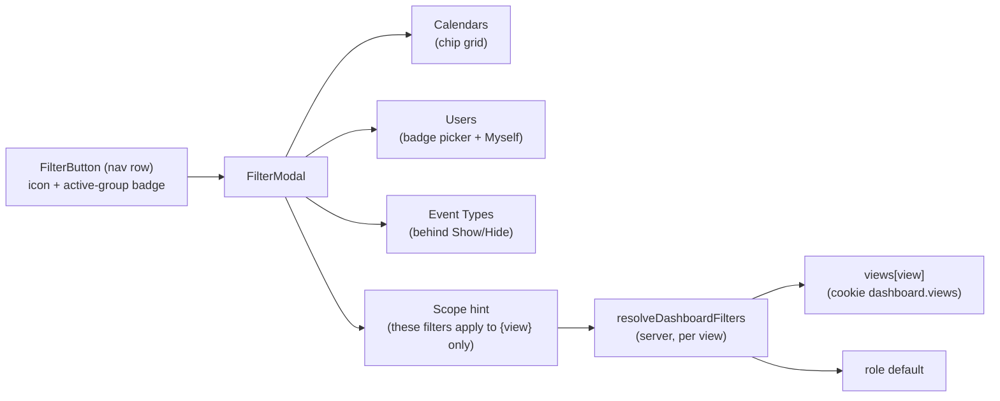
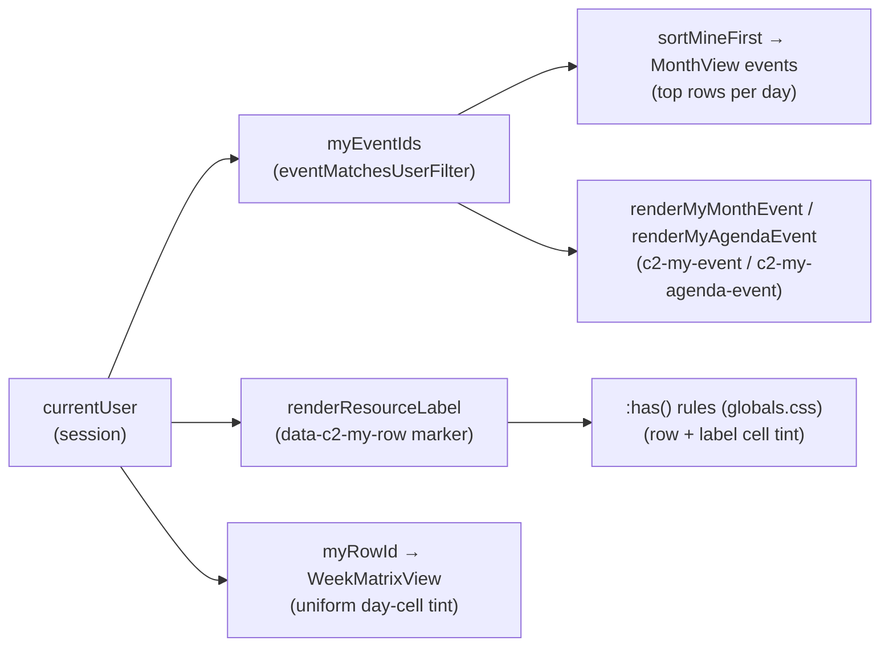
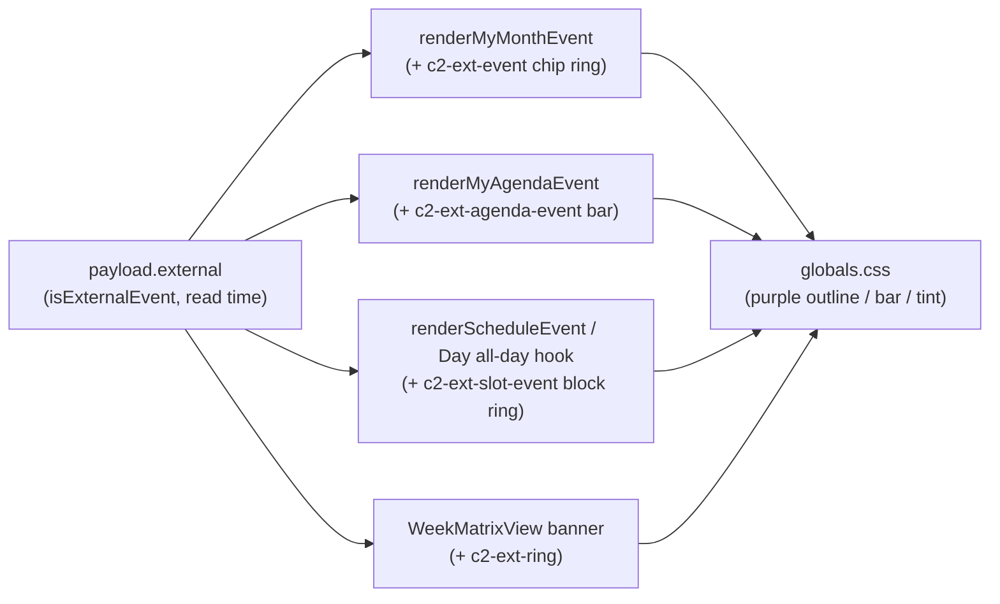

# 1. Dashboard views & filters

The Calendar dashboard (`/dashboard`) renders one of six event views over the shared
server-side events cache ([`events-cache.md`](events-cache.md)) and a per-view
filter state. This document covers the view inventory, the filters (one
button + modal, scoped per view), the custom Week (D) matrix — the one view no
Mantine Schedule component can render — the per-view "mine" and external-entry
highlights, and the Day / Week (H) timeline zoom.

## Table of contents

- [1.1 View inventory](#11-view-inventory)
- [1.2 Filters](#12-filters)
- [1.3 Week (D): the custom week matrix](#13-week-d-the-custom-week-matrix)
- [1.4 Data flow shared by all views](#14-data-flow-shared-by-all-views)
- [1.5 My-entry highlight](#15-my-entry-highlight)
- [1.6 External-event highlight](#16-external-event-highlight)
- [1.7 Timeline zoom (Day and Week (H))](#17-timeline-zoom-day-and-week-h)
- [1.8 File index & related docs](#18-file-index--related-docs)

## 1.1 View inventory

The dashboard's view keys (`DASHBOARD_VIEW_VALUES`, `src/lib/ui/uiState.ts:70`):

| Key | Label | Renderer |
| --- | ----- | -------- |
| `month` | Month | Mantine calendar month grid (six fixed weeks — see [`events-cache.md`](events-cache.md)) |
| `week` | Week (H) | Mantine Schedule, hour columns per resource row |
| `weekv2` | Week (D) | custom week matrix (§1.3) |
| `schedule` | Day | Mantine Schedule, single day per resource row |
| `agenda` | Agenda | list view |

Mobile-month is the sub-`lg` rendering of the `month` view. The remembered view +
pinned view tabs ride the `cloudy2.ui` cookie ([`ui-state.md`](ui-state.md)).

## 1.2 Filters

Filtering has **one primary affordance**: a dedicated filter button (funnel icon
+ active-group-count badge, `FilterButton`) beside the ⋮ menu in the nav row
opens `FilterModal` (`src/components/FilterModal.tsx`). The ⋮ menu no longer
carries filter actions — it keeps **Today / Select date / Pin tab / Force
refresh** only. Dashboards' "Myself" quick action lives inside the filter modal
beside the Users group; "Reset" clears (role defaults).

The modal promotes the filters most people reach — **Calendars** (chip grid) and
**Users** (badge-dialog picker, `variant: "search"`) — and tucks **Event Types**
behind a "Show"/"Hide" disclosure (`collapsedGroupLabels`; audit-log/user-table
callers keep all groups expanded). A footer scope hint notes *"These filters
apply to {view} only."* — filter scoping is **per view only** (the old
"Same for all views"/shared-set mode is removed): every view remembers its own
Calendars/Users/Event Types selection, and clearing one view's filters never
resets the others.

Filter semantics:

- On the dashboard an active **Users** filter also narrows the rows of
  Day/Week (H)/Week (D) — `buildScheduleResources` takes a `userFilter`
  (`src/lib/events/schedule.ts:120`) and the Week (D) matrix reuses the same rows.
- **Access is unrelated to filters.** A user's department membership — or any
  extra department calendars granted to them — has nothing to do with which
  departments they can filter: every user can always select *every* department
  in the Calendars filter (the reads are not access-gated). Cross-department
  grants affect only Google Calendar sharing/roles
  ([`roster-sharing.md`](roster-sharing.md) §1.5), and a non-admin's **role
  default** stays their own department — extra grants never expand it.
- The per-view model, its resolution order (URL → view memory → **role default** —
  the removed shared set is never consulted, so configuring one view can't leak
  into another's untouched views), the explicit-empty "cleared" state, and the
  `_fresh` current-view-only scoping live in the remembered-state system:
  [`ui-state.md`](ui-state.md) §1.5.1 / §1.9. Switching views writes the target
  view's filters into the URL, so the URL always describes the rendered view.
- The per-view writer (`buildDashboardPersist`) records **only views the user
  configured or cleared** — never the full resolved set — so a view that was
  never touched keeps absent keys and resolves to role defaults, and a large
  roster cannot blow the remembered-state cookie past its size guard (the v1
  materialize-then-drain bug that lost per-view Users filters is fixed by this;
  see `ui-state.md` §1.4/§1.5.1).

## 1.3 Week (D): the custom week matrix

`?view=weekv2` renders a custom week matrix — **7 day-columns × the same resource
rows as Day/Week (H)** — in `WeekMatrixView.tsx`
(`src/app/(protected)/dashboard/WeekMatrixView.tsx`). No Mantine Schedule component
fits this shape, so the view is hand-built.

Cell binning is pure and unit-tested in `src/lib/events/weekMatrix.ts`:

- **`coveredDays(event, week)`** (`:40`) — the week days an event's naive start/end
  range occupies; all-day events carry an *exclusive* end date, so the final covered
  day is the end date minus one.
- **`buildWeekLanes(events, week)`** (`:56`) — one `WeekSpan` per event per row,
  merged into non-overlapping lanes by greedy interval partitioning (sorted by
  startDay → start time → title). Lane `n` renders on grid row `n + 1` of the
  resource row's nested grid. Row semantics (`rowsForEvent`, `departmentRowId`)
  match the schedule views exactly: events with no row still appear when they are
  **external** (pinned to their calendar's department row); unlinked non-external
  events are dropped. A multi-day event is a single span across its covered columns.

## 1.4 Data flow shared by all views

All views read through the same range/month helpers — never `integration.listEvents`
directly ([`events-cache.md`](events-cache.md)):

- Week (H) and Week (D) both use the same `fetchRangeEvents` 2-month read, so the
  cache, the dashboard filters and the force-refresh nonce are inherited unchanged
  by Week (D).
- The Month view range-reads the months its 6-week grid displays
  (`monthGridMonths()`, `src/lib/events/datetime.ts`).
- Wide grids (Day/Week (H)/Week (D)) pan horizontally through `useGridPan` +
  `GridPanControls` ([`grid-pan.md`](grid-pan.md)); the dashboard chrome can go
  fullscreen through immersive mode ([`immersive-mode.md`](immersive-mode.md)).

## 1.5 My-entry highlight

The logged-in user's entries are visually distinguished in every view, so a
roster member can spot their own rows/chips without reaching for the Users
filter. "Mine" means the event was **created by, or tagged on, the current
user** — exactly the Myself quick-filter's semantics
(`eventMatchesUserFilter`, `src/lib/events/userFilter.ts`). The highlight is
unconditional (it stays on when the Myself filter is already active) and only
exists for roster members: an admin without a roster row gets the event-level
highlights but no row tint (the same boundary as `onlyMeAvailable`).

Per-view mechanics (all client-side — no cache or server impact):

- **Week (H) / Day / Week (D) — whole-row tint.** `renderResourceLabel`
  (DashboardView) renders the current user's label as a `data-c2-my-row`
  marker span (amber dot + semibold shortname). Structural CSS `:has()` rules
  in `globals.css` — the label cell is the only element containing the marker
  directly, and the row the only element containing it through a direct child
  — tint exactly those two elements (label cell: accent-1 + inset accent-6
  bar; row: accent-0). Mantine rows/slots are transparent by default, so the
  row background shows through and events sit above it. The Week (D) matrix
  additionally tints its day cells uniformly (the row tint wins over the
  today tint there).
- **Month — top rows + chip ring.** `MonthView` assigns each day's rows
  greedily in input order, so the events array is pre-sorted with
  `sortMineFirst()` (`src/lib/events/mineFirst.ts`, pure and unit-tested):
  the user's events first, each block time-sorted — they claim the top rows
  of every day (the topmost *non-conflicting* row: an earlier-placed multi-day
  event can still hold row 1). With `maxEventsPerDay` this pushes more of
  *other* events behind "+N more" on dense days — the intended trade-off.
  The user's chips (and their copies in the "+N more" popup) get an amber
  ring via the `renderEvent` hook (`c2-my-event`, `globals.css`).
- **Agenda — row highlight, time order kept.** The Agenda tab and the month
  day modal pass a `renderEvent` that adds `c2-my-agenda-event` to the
  user's rows: amber left bar + light tint + semibold title. The
  chronological order is intentionally not changed.

Colors: the brand amber `accent` family (secondary `#FBC02D`) — distinct from
the event-type colors and the blue `brand` accents used for today/primary. The
tint backgrounds switch on color scheme via the `--c2-my-row-tint` /
`--c2-my-label-tint` custom properties (defined in `globals.css`, consumed by
the `:has()`/agenda rules and — inline — by the Week (D) matrix): light mode
uses the near-white accent-0/1 creams; in dark mode those would glow on the
dark body, so both go to the darker olive amber (row `#3d3200`, label
`#4a3c00` — the same `#3d3200` Parade State uses for its dark-mode amber card).
The accent-6 bars, dot and chip ring are unchanged across schemes.

## 1.6 External-event highlight

Events created directly in Google Calendar (no `Created in cloudy2` marker and no
notes block — `isExternalEvent`, [`event-lifecycle.md`](event-lifecycle.md)) carry
`payload.external === true` at read time (`mapCalendarItem`,
`src/lib/events/queries.ts`). Every dashboard view marks them with a **purple**
treatment, in parallel with the amber "mine" language above: amber says "yours",
purple says "created outside the app". An external event can never be *mine*
(it has no recorded creator), so the two highlight classes never collide on one
event.

Per-view mechanics (all client-side over the same `renderEvent` / render-hook
pattern as §1.5 — no cache or server impact):

- **Month — purple chip ring.** `renderMyMonthEvent` (DashboardView) also adds
  `c2-ext-event` to external events; `globals.css` outlines the inner chip
  element (the child carrying the rounded background, exactly like the amber
  `c2-my-event` ring) — including the copies in the "+N more" popup, which
  share the `renderEvent` path.
- **Agenda — purple row bar.** The Agenda tab and the month day modal both pass
  `renderMyAgendaEvent`, which adds `c2-ext-agenda-event` to external rows:
  purple left bar + tint + semibold title. Chronological order is kept, as with
  §1.5.
- **Day / Week (H) — purple block ring.** A shared `renderScheduleEvent` hook
  (new on Week (H); Day folds it into its existing all-day sticky-title hook)
  appends `c2-ext-slot-event` to the event root for external events. The root's
  single child is the chip in every shape — the ScheduleEvent inner box for
  timed events and Week (H) all-day bars, and Day's custom all-day Box — so one
  `> *` outline rule covers all of them.
- **Week (D) — purple banner ring.** The matrix banner's inner Box carries the
  rounded background (and the event's 1px border) itself, so it gets the
  self-ring class `c2-ext-ring` instead of the `> *` variant.

Colors: Mantine's built-in `purple` family — deliberately distinct from the
brand amber (`accent`, mine), the brand blue (`brand`, today/primary) and red
(errors / KAH warnings), so the highlight can't be misread as any of those.
`purple-6` holds on both light and dark bodies for the ring and bar; the agenda
tint switches on color scheme via `--c2-ext-row-tint` (light: near-white
`purple-0`; dark: deep purple `#241a45`, mirroring the mine row's olive-dark
pattern) next to the `--c2-my-*` properties in `globals.css`. Event body colors
are untouched — the highlight is purely additive (ring / bar / tint), so the
department-calendar colors of untyped events keep their meaning.

## 1.7 Timeline zoom (Day and Week (H))

The Day and Week (H) schedule views can zoom their hour columns in and out, so the
user can fit more of the day/week in view (overview) or expand it for detail. One
**shared** zoom level scales the width of every hour slot; it does not change the
slot granularity (still 60-minute columns) or the row height.

- **Levels**: discrete `0.5, 0.75, 1, 1.25, 1.5, 2` (`ZOOM_LEVELS`,
  `src/lib/ui/slotZoom.ts`); `1` is the default (today's fixed widths). The buttons
  step one level at a time and clamp at the extremes (disabled there).
- **Controls**: `GridNavControls` (`src/components/GridNavControls.tsx`) — the zoom
  in/out pair lives in the **same right-edge control cluster** as the right pan
  arrow (zoom +/− on top, a divider, then the pan arrow), with the left pan arrow
  edge-anchored on the left; the pair is the familiar map-controls layout and can
  never overlap the pan arrow, and the cluster hangs from its bottom edge so both
  pan arrows align vertically at the visible-slice center ([`grid-pan.md`](grid-pan.md)).
  Rendered whenever the schedule grid is shown (skeleton/empty excluded) — unlike
  the pan arrows it shows even when the grid fits without overflowing.
- **Mechanism**: each view reads its slot width from a CSS variable on the view root
  (`--resources-week-view-slot-width` / `--resources-day-view-slot-width`). Mantine
  sizes the day container from that var and lays every event out as a **percentage**
  of it, so changing the var re-lays out slots *and* events with no JS geometry work.
  `DashboardView` computes the zoomed width (`weekSlotWidth` / `daySlotWidth`) and
  writes it to the var through the view's `style` prop (the Schedule CSS-var gotcha —
  [`desktop-responsive.md`](desktop-responsive.md)).
- **Rulers follow**: the pinned hour ruler and the Week (H) day-label strip follow the
  slot width through a `useLayoutEffect` that probes the var from the DOM and publishes
  it as `--ruler-slot`. Both are a **viewport-width wrapper**, translated by `-scrollLeft`
  via a direct DOM transform on the scroll frame — no re-renders — with only the cells
  that can intersect the viewport rendered (absolutely positioned at their global day /
  slot offsets). The wrapper itself must NOT clip (`overflow: visible`; the parent box
  clips to the viewport): an `overflow: hidden` on the wrapper would keep every cell
  beyond its own (viewport-width) box out of the layer's paint, so translating it could
  never reveal them. The day
  window follows the leftmost visible day; the ruler window advances in 8-slot batches.
  Rendering just the visible window (instead of a full 168-slot / 7-day track) keeps the
  composited layer small, so the labels track the pan smoothly instead of re-rastering
  tiles on the fly. A window update re-renders only the small strip (each registers a
  one-shot advance callback), never the whole dashboard. `zoom` is in that effect's
  dependency list, so both strips re-measure on every zoom change.
  - **Ruler height is explicit** (`1.15rem`): every ruler cell is absolutely positioned,
    so without a set height the sticky strip would collapse to 0px and hide the hour
    markers.
  - **Day labels are anchored, not column-fixed.** A day column (24 slots) is far wider
    than the viewport, so a label fixed at a column's left edge is only visible near
    that edge and "scrolls away" while panning. Instead each label's `left` is clamped
    against the per-frame `--c2-scroll-x` (published alongside the wrapper transform):
    the leftmost visible day's label stays pinned at the strip's left edge while its
    column pans through the viewport, handing off at the day boundary — so a date label
    is always visible during a horizontal pan, on any viewport width.
- **Persistence**: the level is remembered per device in the `cloudy2.ui` cookie as
  `dashboard.zoom` — not URL-backed (zooming never navigates), so it is read from the
  raw cookie and seeded into the client state before first paint (no width jump on
  relaunch). See [`ui-state.md`](ui-state.md).
- **Scope**: shared by Day and Week (H) only. Week (D) — its columns are
  day-granularity, not hour slots — and Month and Agenda are unaffected.
- **Re-anchoring**: zooming keeps the time that was at the viewport's _center_
  centered — a `useLayoutEffect` (declared before the ruler measurement effect)
  re-anchors `scrollLeft` from the previous/next slot-width ratio via the pure
  `reanchorScrollLeft` helper, subtracting the zoom-invariant label-column width
  before scaling and re-adding it after. See `src/lib/ui/slotZoom.ts`.

## 1.8 File index & related docs

| File | Role |
| ---- | ---- |
| `src/app/(protected)/dashboard/DashboardView.tsx` | View switch, date-nav chrome, filter state, zoom state + slot widths |
| `src/app/(protected)/dashboard/WeekMatrixView.tsx` | Week (D) matrix renderer |
| `src/lib/events/weekMatrix.ts` | Pure Week (D) lane binning (`coveredDays`, `buildWeekLanes`) |
| `src/lib/events/mineFirst.ts` | Pure "mine first" sort for the month view's greedy row assignment |
| `src/lib/events/schedule.ts` | Resource rows (`buildScheduleResources`, `userFilter`) |
| `src/lib/ui/slotZoom.ts` | Pure zoom levels + slot-width math (`clampZoom`, `stepZoom`, `weekSlotWidth`, `daySlotWidth`) |
| `src/components/GridNavControls.tsx` | Day/Week (H) right-edge cluster: zoom +/− + right pan, plus left-edge pan |
| `src/components/FilterButton.tsx` | Dedicated filter button (icon + active-group badge) replacing the kebab's filter menu |
| `src/components/FilterModal.tsx` | Filters dialog (collapsible groups, per-view scope hint) |

Related docs:

- [`events-cache.md`](events-cache.md) — the read path every view uses.
- [`grid-pan.md`](grid-pan.md) — horizontal pan for the wide grids.
- [`immersive-mode.md`](immersive-mode.md) — fullscreen calendar chrome.
- [`user-picker.md`](user-picker.md) — the Users filter's badge-dialog picker.
- [`desktop-responsive.md`](desktop-responsive.md) — the slot/label width table and the Schedule CSS-var gotcha zoom builds on.
- [`ui-state.md`](ui-state.md) — remembered view + pinned view tabs + the `zoom` level.
