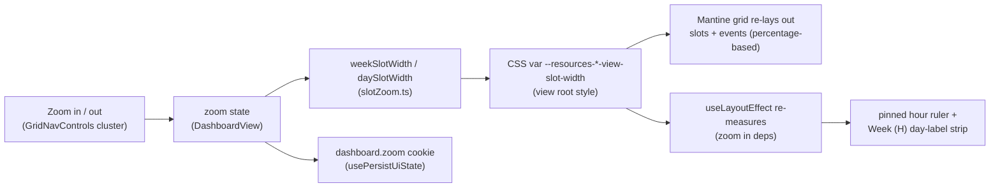

# 1. Dashboard views & filters

The Calendar dashboard (`/dashboard`) renders one of six event views over the shared
server-side events cache ([`events-cache.md`](events-cache.md)) and a shared filter
state. This document covers the view inventory, the quick-filter ⋮ menus, the custom
Week (D) matrix — the one view no Mantine Schedule component can render — and the
Day / Week (H) timeline zoom.

## Table of contents

- [1.1 View inventory](#11-view-inventory)
- [1.2 Quick-filter menus](#12-quick-filter-menus)
- [1.3 Week (D): the custom week matrix](#13-week-d-the-custom-week-matrix)
- [1.4 Data flow shared by all views](#14-data-flow-shared-by-all-views)
- [1.5 Timeline zoom (Day and Week (H))](#15-timeline-zoom-day-and-week-h)
- [1.6 File index & related docs](#16-file-index--related-docs)

## 1.1 View inventory

The dashboard's view keys (`DASHBOARD_VIEW_VALUES`, `src/lib/ui/uiState.ts:70`):

| Key | Label | Renderer |
| --- | ----- | -------- |
| `month` | Month | Mantine calendar month grid (six fixed weeks — see [`events-cache.md`](events-cache.md)) |
| `week` | Week (H) | Mantine Schedule, hour columns per resource row |
| `weekv2` | Week (D) | custom week matrix (§1.3) |
| `schedule` | Day | Mantine Schedule, single day per resource row |
| `agenda` | Agenda | list view |

Mobile-month is the sub-`lg` rendering of the `month` view. The remembered view +
pinned view tabs ride the `cloudy2.ui` cookie ([`ui-state.md`](ui-state.md)).

## 1.2 Quick-filter menus

The dashboard and parade-state ⋮ menus hold quick filter actions:

- **Myself** — checkbox item; sets the Users filter to the current user.
- **Clear** — resets the filters.
- **More Filters** — opens `FilterModal` (`src/components/FilterModal.tsx`): Calendars
  / Users / Event Types groups on the dashboard (Users is a badge-dialog picker
  carrying a draft-scoped **Myself** quick action beside the group label).

Filter semantics:

- On the dashboard an active **Users** filter also narrows the rows of
  Day/Week (H)/Week (D) — `buildScheduleResources` takes a `userFilter`
  (`src/lib/events/schedule.ts:120`) and the Week (D) matrix reuses the same rows.
- Non-admins default to their own department but may filter to any department.
- FilterModal's Users picker uses the badge-dialog pattern with
  `variant: "search"` groups ([`user-picker.md`](user-picker.md)).

## 1.3 Week (D): the custom week matrix

`?view=weekv2` renders a custom week matrix — **7 day-columns × the same resource
rows as Day/Week (H)** — in `WeekMatrixView.tsx`
(`src/app/(protected)/dashboard/WeekMatrixView.tsx`). No Mantine Schedule component
fits this shape, so the view is hand-built.

Cell binning is pure and unit-tested in `src/lib/events/weekMatrix.ts`:

- **`coveredDays(event, week)`** (`:40`) — the week days an event's naive start/end
  range occupies; all-day events carry an *exclusive* end date, so the final covered
  day is the end date minus one.
- **`buildWeekLanes(events, week)`** (`:56`) — one `WeekSpan` per event per row,
  merged into non-overlapping lanes by greedy interval partitioning (sorted by
  startDay → start time → title). Lane `n` renders on grid row `n + 1` of the
  resource row's nested grid. Row semantics (`rowsForEvent`, `departmentRowId`)
  match the schedule views exactly: events with no row still appear when they are
  **external** (pinned to their calendar's department row); unlinked non-external
  events are dropped. A multi-day event is a single span across its covered columns.

## 1.4 Data flow shared by all views

All views read through the same range/month helpers — never `integration.listEvents`
directly ([`events-cache.md`](events-cache.md)):

- Week (H) and Week (D) both use the same `fetchRangeEvents` 2-month read, so the
  cache, the dashboard filters and the force-refresh nonce are inherited unchanged
  by Week (D).
- The Month view range-reads the months its 6-week grid displays
  (`monthGridMonths()`, `src/lib/events/datetime.ts`).
- Wide grids (Day/Week (H)/Week (D)) pan horizontally through `useGridPan` +
  `GridPanControls` ([`grid-pan.md`](grid-pan.md)); the dashboard chrome can go
  fullscreen through immersive mode ([`immersive-mode.md`](immersive-mode.md)).

## 1.5 Timeline zoom (Day and Week (H))

The Day and Week (H) schedule views can zoom their hour columns in and out, so the
user can fit more of the day/week in view (overview) or expand it for detail. One
**shared** zoom level scales the width of every hour slot; it does not change the
slot granularity (still 60-minute columns) or the row height.

- **Levels**: discrete `0.5, 0.75, 1, 1.25, 1.5, 2` (`ZOOM_LEVELS`,
  `src/lib/ui/slotZoom.ts`); `1` is the default (today's fixed widths). The buttons
  step one level at a time and clamp at the extremes (disabled there).
- **Controls**: `GridNavControls` (`src/components/GridNavControls.tsx`) — the zoom
  in/out pair lives in the **same right-edge control cluster** as the right pan
  arrow (zoom +/− on top, a divider, then the pan arrow), with the left pan arrow
  edge-anchored on the left; the pair is the familiar map-controls layout and can
  never overlap the pan arrow, and the cluster hangs from its bottom edge so both
  pan arrows align vertically at the visible-slice center ([`grid-pan.md`](grid-pan.md)).
  Rendered whenever the schedule grid is shown (skeleton/empty excluded) — unlike
  the pan arrows it shows even when the grid fits without overflowing.
- **Mechanism**: each view reads its slot width from a CSS variable on the view root
  (`--resources-week-view-slot-width` / `--resources-day-view-slot-width`). Mantine
  sizes the day container from that var and lays every event out as a **percentage**
  of it, so changing the var re-lays out slots *and* events with no JS geometry work.
  `DashboardView` computes the zoomed width (`weekSlotWidth` / `daySlotWidth`) and
  writes it to the var through the view's `style` prop (the Schedule CSS-var gotcha —
  [`desktop-responsive.md`](desktop-responsive.md)).
- **Rulers follow**: the pinned hour ruler and the Week (H) day-label strip track the
  slot width through a `useLayoutEffect` that probes the var from the DOM and
  publishes it as `--ruler-slot` / a 24-slot day width. `zoom` is in that effect's
  dependency list, so both strips re-measure on every zoom change.
- **Persistence**: the level is remembered per device in the `cloudy2.ui` cookie as
  `dashboard.zoom` — not URL-backed (zooming never navigates), so it is read from the
  raw cookie and seeded into the client state before first paint (no width jump on
  relaunch). See [`ui-state.md`](ui-state.md).
- **Scope**: shared by Day and Week (H) only. Week (D) — its columns are
  day-granularity, not hour slots — and Month and Agenda are unaffected. Zooming keeps
  the grid's horizontal `scrollLeft` in px (no time re-anchoring).

## 1.6 File index & related docs

| File | Role |
| ---- | ---- |
| `src/app/(protected)/dashboard/DashboardView.tsx` | View switch, date-nav chrome, filter state, zoom state + slot widths |
| `src/app/(protected)/dashboard/WeekMatrixView.tsx` | Week (D) matrix renderer |
| `src/lib/events/weekMatrix.ts` | Pure Week (D) lane binning (`coveredDays`, `buildWeekLanes`) |
| `src/lib/events/schedule.ts` | Resource rows (`buildScheduleResources`, `userFilter`) |
| `src/lib/ui/slotZoom.ts` | Pure zoom levels + slot-width math (`clampZoom`, `stepZoom`, `weekSlotWidth`, `daySlotWidth`) |
| `src/components/GridNavControls.tsx` | Day/Week (H) right-edge cluster: zoom +/− + right pan, plus left-edge pan |
| `src/components/FilterModal.tsx` | More Filters dialog |

Related docs:

- [`events-cache.md`](events-cache.md) — the read path every view uses.
- [`grid-pan.md`](grid-pan.md) — horizontal pan for the wide grids.
- [`immersive-mode.md`](immersive-mode.md) — fullscreen calendar chrome.
- [`user-picker.md`](user-picker.md) — the Users filter's badge-dialog picker.
- [`desktop-responsive.md`](desktop-responsive.md) — the slot/label width table and the Schedule CSS-var gotcha zoom builds on.
- [`ui-state.md`](ui-state.md) — remembered view + pinned view tabs + the `zoom` level.
