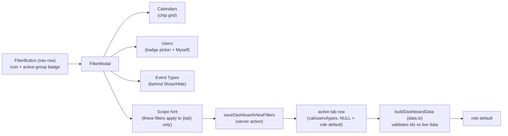
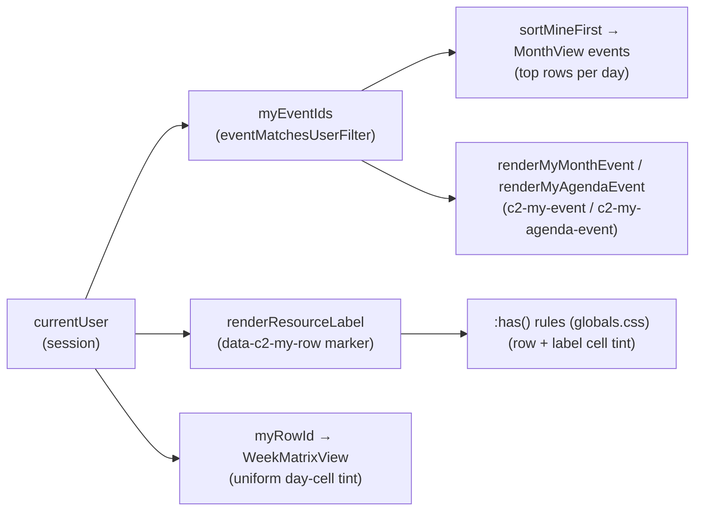
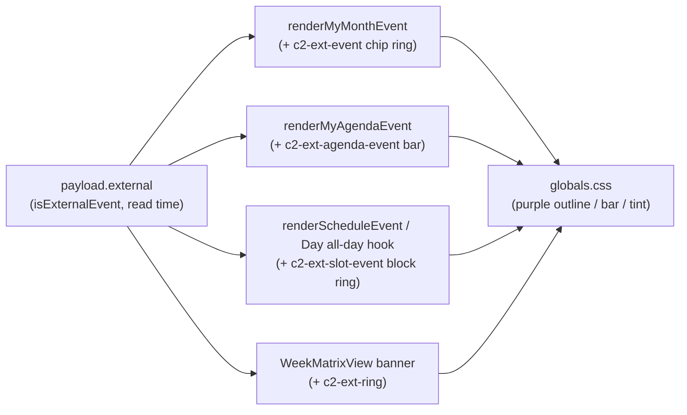
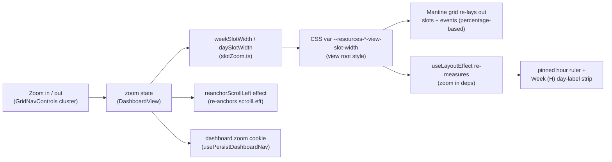
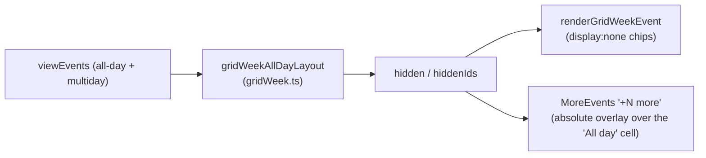
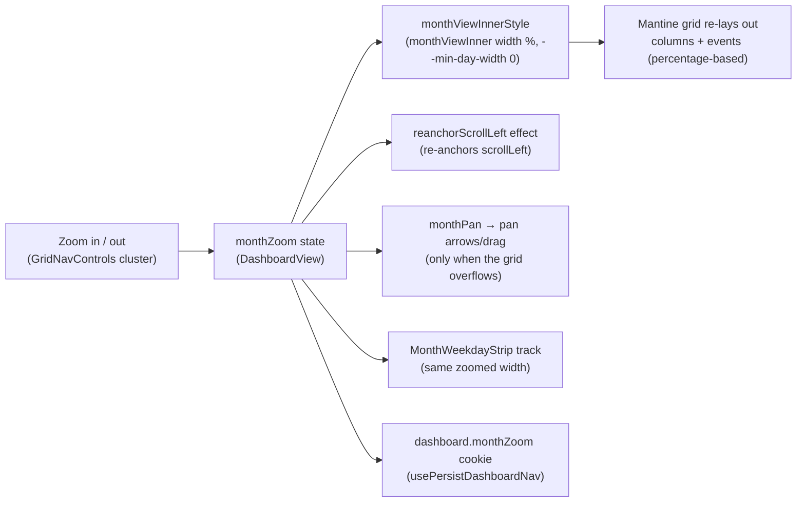
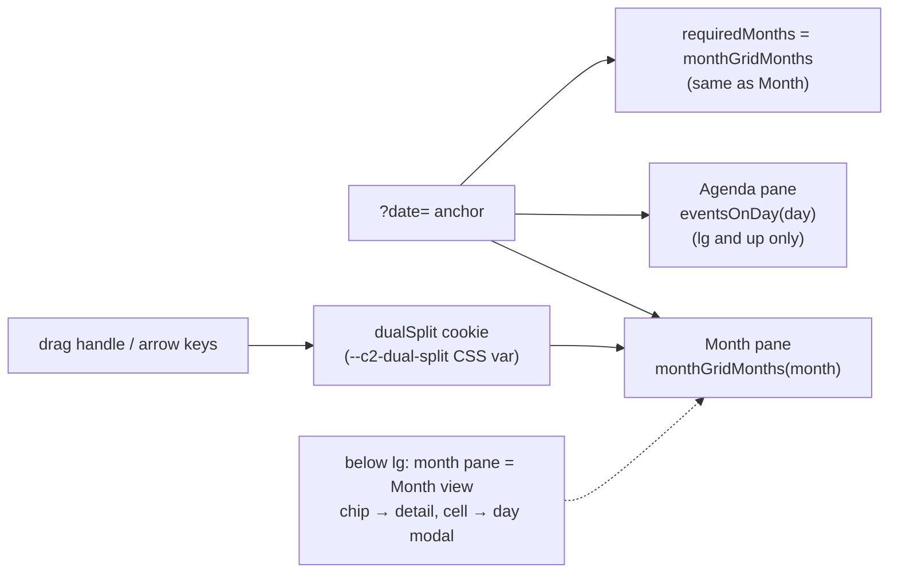

# 1. Dashboard views & filters

The Calendar dashboard (`/dashboard`) renders one of the seven event-view
**kinds** (Month / Week (H) / Week (D) / Week (Grid) / Day / Agenda /
Month & Agenda) over the
shared server-side events cache ([`events-cache.md`](events-cache.md)). The
dashboard does **not** show one fixed instance of each kind: the user builds an
on-demand set of **views (tabs)** — one per-account row per tab (kind + user
name + strip order + that tab's own filter state), stored server-side in
`user_dashboard_views` (`src/lib/dashboardViews`). This document covers the tab
inventory & management, the filters (one button + modal, scoped per tab), the
custom Week (D) matrix — the one view no Mantine Schedule component can render —
the Month & Agenda split (side by side), the per-view "mine" and
external-entry highlights, and the Day / Week (H) timeline zoom plus the Month
grid's fit-to-width zoom.

## Table of contents

- [1.1 View inventory & tab management](#11-view-inventory--tab-management)
- [1.2 Filters](#12-filters)
- [1.3 Week (D): the custom week matrix](#13-week-d-the-custom-week-matrix)
- [1.4 Data flow shared by all views](#14-data-flow-shared-by-all-views)
- [1.5 My-entry highlight](#15-my-entry-highlight)
- [1.6 External-event highlight](#16-external-event-highlight)
- [1.7 Timeline zoom (Day, Week (H) and Week (Grid))](#17-timeline-zoom-day-week-h-and-week-grid)
- [1.7.1 Week (Grid) all-day overflow](#171-week-grid-all-day-overflow)
- [1.8 Month-grid zoom (fit-to-width)](#18-month-grid-zoom-fit-to-width)
- [1.9 Month & Agenda](#19-month--agenda)
- [1.10 File index & related docs](#110-file-index--related-docs)

## 1.1 View inventory & tab management

The renderer kinds (`DASHBOARD_VIEW_KINDS`, `src/lib/dashboardViews/views.ts`):

| Kind | Label | Renderer |
| ---------- | -------- | ---------------------------------------------------------------------------------------- |
| `dual` | Month & Agenda | Month grid + Agenda list side by side, resizable (§1.9) |
| `month` | Month | Mantine calendar month grid (six fixed weeks — see [`events-cache.md`](events-cache.md)) |
| `week` | Week (H) | Mantine Schedule, hour columns per resource row |
| `weekv2` | Week (D) | custom week matrix (§1.3) |
| `weekgrid` | Week (Grid) | Mantine Schedule `WeekView`, conventional 7-day grid (time on the vertical axis; §1.7) |
| `schedule` | Day | Mantine Schedule, single day per resource row |
| `agenda` | Agenda | list view |

The `DASHBOARD_VIEW_KINDS` array's order is the **type-picker display order**
(Month & Agenda first, then Month, …); it is not a default — a new account is
seeded with a single "Month" tab.

Mobile-month is the sub-`lg` rendering of the `month` kind. Tabs are **not**
the kinds themselves: each `user_dashboard_views` row binds one of these kinds
to a user-chosen **name**, a per-user `sortOrder`, and that tab's own filter
overrides (see `src/db/schema.ts`). **Duplicates of the same kind are allowed**
(two "Agenda" tabs with different names/filters), so a tab's **UUID is its
identity** — carried in the URL as `?view=<tab id>`; a legacy `?view=<kind>`
string maps to the first tab of that kind.

- **Seed**: `getDashboardViews` reads the account's tabs first and only when
  that read is empty calls `ensureDefaultDashboardView` to create one "Month"
  tab (mutex-guarded on the `user_preferences` row so racing requests can't
  double-insert), then re-reads. The read-first order keeps the common path
  free of the seed transaction.
- **Add view** has two entry points, both opening the same quick **Add-view
   dialog** (the shared **seven-kind picker** `ViewTypePicker.tsx` rendered in
  its **thumbnail-grid** variant — one wireframe SVG preview per kind, from
  `viewThumbnails.tsx` — plus a name; the default name follows the chosen kind
  until edited):
  - the strip's **`+` button at the end of the scrolling tab strip** (the
    strip's last item, shown for accounts that own stored views; tooltip "Add
    view"). Because it scrolls with the strip it can sit off-screen on a long
    strip;
  - the **Manage-views modal**'s compact **Add view** button at the top, so
    creation is reachable from the always-pinned gear too.
  Creating appends the tab and navigates to it; the new id is unknown to the
  held tab list (the request key `viewId|months` is definition-blind), so the
  switch forces a server re-read and the tab appears without a Force refresh.
- **Manage views** (a settings **gear** to the RIGHT of the strip, outside the
  horizontal scroll area — so the scroll set ends before it; tooltip "Manage
  views") opens a **centered modal** (`EditViewsModal.tsx`, sharing the app's
  **touch-friendly manage-row recipe** — see `src/components/reorderUpDown.tsx`)
  listing the created tabs as a **vertical list**. Each row shows the view's
  **kind icon + name**, with a dimmed **kind label** underneath **only when
  the name is custom** (a default-named tab already reads as its kind, so the
  label would just repeat the name). The active tab is marked with a thin
  **accent left border** on the row (quiet — no badge). Row actions:
  - **↑/↓** arrows reorder (commits `reorderDashboardViews`, which renumbers
    every row in a transaction — the clicked arrow shows an inline spinner while
    it works; the row's outward arrow is disabled at the list's ends). They use
    `ReorderUpDown`'s `variant="subtle"` here, so the dense row isn't a wall of
    bordered boxes;
  - a **pen** (Edit, subtle) opens a single **Edit view** dialog with the name
    and the seven-kind picker — one place for both, replacing the old separate
    inline rename field and Change-type modal. The tab keeps its id, strip order
    and stored filters; a name that is still the old kind's default label follows
    to the new kind's default (a custom name is kept; the rule is applied
    server-side by `changeDashboardViewKind`, and a custom name typed in the
  dialog is applied after the kind so it always wins). Changing the **active**
  tab's type re-navigates to the same id under its new kind, so the tab-switch
  period rules below apply (Month → anchored starts today; anchored → Month
  keeps the month) — and because the request key (`viewId|months`) is
  definition-blind, the same id would otherwise look already covered, so the
  switch also forces a server re-read with the target period (the grid reloads
  in place instead of waiting for a Force refresh); editing an inactive tab
    just refreshes the list. This dialog's picker uses the same **thumbnail-grid**
    variant as the Add-view dialog — choosing a type is the same decision in both
    places (the row being edited's own kind is shown dimmed with "(current)").
    The edit is applied **optimistically**: the action returns the updated tab and
    `applyViewTab` patches the held snapshot, so the strip and this list repaint
    in the same frame, then the usual re-read reconciles against the server;
  - a **trash** (subtle red) deletes behind a nested `size="sm"` confirm (the
    last tab can't be deleted — its trash is disabled; deleting the active tab
    navigates to the first remaining and forces a re-read, so the deleted row
    can't linger behind a data-equivalent local swap).
  Two ~40px actions plus the chevron pair
  lead each row, so **below `lg` each row reflows to two lines**: the kind icon +
  name lead on the first, and the controls sit together on a second left-aligned
  line; at `lg`+ the row keeps its single line. The Edit dialog also carries the per-view
  **Filters** entry point: an **Edit
  filters…** button closes the modal, switches to that view and opens its filter
  dialog (the dashboard's one per-view filter UI — see §1.2). Filters resolve
  server-side per tab, so the dialog opens once the target tab is the active view
  (a preloaded tab resolves immediately). The old **pin/unpin** affordance
  and its star UI are gone — ordering is fully user-controlled. Tabs themselves
  are **content-sized** — each shrink-wraps its label (so the active underline
  hugs the text), they never stretch to fill the row, and a long set overflows
  into natural horizontal scrolling.
- **All-views jump list** (a chevron button between the Add-view button and the
  Manage-views gear, only when the account has more than one tab): for users with many tabs
  the overflowed strip is a long horizontal scroll to reach a specific view, so
  the chevron opens a `Menu` popover listing **every** tab in strip order —
  kind icon + name, the active tab ticked — for a one-tap `switchTab` without
  scrolling the strip.
- **Period preservation on switch** (`switchTab` in `DashboardView.tsx`): a
  tab switch is a _filter/context_ change, so switching between two tabs of the
  same kind (or any two day-anchored kinds) keeps the current date; leaving
  Month for an anchored kind starts on today; leaving an anchored kind for
  Month keeps the anchor's month. The last-active tab is **not** remembered —
  the tap only updates `?view=`.
- **The active tab resolves** (`buildDashboardData`, `src/lib/dashboard/data.ts`)
  as URL `?view=` → the first tab in strip order. Title-template assignments (§ of
  [`event-lifecycle.md`](event-lifecycle.md)) stay keyed by **kind**, so all
  tabs of a kind share that kind's display template.

`/?view=` is now an id, the last-active tab is not remembered (a bare load
defaults to the first tab), and the device cookie no longer carries a view, so
**route/cold-start loading cannot shape its skeleton to the arriving kind**:
`loading.tsx` and the PWA launch shell (`public/loading.html`) show one plain
full-page loading box; the in-page transition skeletons inside `DashboardView`
still shape to the active tab's kind. The break-glass admin session
(`id="admin"`, no `users` row) renders a static single Month tab with view
management hidden.

## 1.2 Filters

Filtering has **one primary affordance**: a dedicated filter button (funnel icon

- active-group-count badge, `FilterButton`) beside the ⋮ menu in the nav row
  opens `FilterModal` (`src/components/FilterModal.tsx`). The ⋮ menu keeps
  **Today / Select date / Enter fullscreen** only (Force refresh
  is a header button; view management lives on the strip's right settings
  button). Dashboards'
  "Myself" quick action lives inside the filter modal
  beside the Users group; "Reset" clears (role defaults).

The modal promotes the filters most people reach — **Calendars** (chip grid) and
**Users** (badge-dialog picker, `variant: "search"`) — and tucks **Event Types**
behind a "Show"/"Hide" disclosure (`collapsedGroupLabels`; audit-log/user-table
callers keep all groups expanded). A footer scope hint notes _"These filters
apply to {view name} only."_ — filter scoping is **per tab**: each tab stores
its own Calendars/Users/Event Types selection, and clearing one tab's filters
never touches the others.

Filter storage & resolution:

- On the dashboard an active **Users** filter also narrows the rows of
  Day/Week (H)/Week (D) — `buildScheduleResources` takes a `userFilter`
  (`src/lib/events/schedule.ts`) and the Week (D) matrix reuses the same rows.
  An event matches a selected user when it is tagged on them **or** on a
  department they are an active member of (`eventMatchesUserFilter`, with the
  dept→active-member map from the roster), mirroring the clash occupancy model.
- A tab's filter state lives **on the tab row** (`user_dashboard_views.cal_filter`
  / `users_filter` / `types_filter`), each JSON array or SQL `NULL`. `NULL`
  means **role default** (admin: all calendars; non-admin: their own department;
  Users/Event Types: none) and is re-resolved on every render — a department
  added later shows up without touching the tab. An **explicit array** (including
  `[]` = a genuine "cleared" selection) is stored verbatim.
- **Applying or clearing is a server action**, not a URL navigation: the client
  calls `saveDashboardViewFilters` (empty/role-default selections are stored as
  `NULL`), then re-renders from the server so the events refetch under the new
  filter set. Filters never travel in `cal/users/types` URL params. The modal's
  **Clear** button (then Apply) restores the role defaults (`NULL`); a per-group
  **Deselect All** stores the explicit empty array (an empty grid), which is the
  only path that resolves to "no events". Applying is covered end-to-end: the
  dialog's **Apply** button spins through the server write, then the active tab's
  loading bar sweeps through the follow-up read
  ([`loading-transitions.md`](loading-transitions.md) §1.13.2).
- Stored ids/names are re-validated against live calendars/users/types on every
  dashboard read (stale entries drop out; an all-stale list degrades to the role
  default), exactly like the URL params they replaced.
- **Access is unrelated to filters.** A user's department membership — or any
  extra department calendars granted to them — has nothing to do with which
  departments they can filter: every user can always select _every_ department
  in the Calendars filter (the reads are not access-gated). Cross-department
  grants affect only Google Calendar sharing/roles
  ([`roster-sharing.md`](roster-sharing.md) §1.5), and a non-admin's **role
  default** stays their own department — extra grants never expand it.
- The Parade State page mirrors the same split: its filters live on the
  `user_preferences.parade_cal` / `parade_users` row (empty = all), applied via
  `saveParadeFilters` ([`ui-state.md`](ui-state.md)).

## 1.3 Week (D): the custom week matrix

A tab whose kind is `weekv2` renders a custom week matrix — **7 day-columns × the same resource
rows as Day/Week (H)** — in `WeekMatrixView.tsx`
(`src/app/(protected)/dashboard/WeekMatrixView.tsx`). No Mantine Schedule component
fits this shape, so the view is hand-built.

Cell binning is pure and unit-tested in `src/lib/events/weekMatrix.ts`:

- **`coveredDays(event, week)`** — the week days an event's naive start/end
  range occupies; all-day events carry an _exclusive_ end date, so the final covered
  day is the end date minus one.
- **`buildWeekLanes(events, week, memberships)`** — one `WeekSpan` per event per row,
  merged into non-overlapping lanes by greedy interval partitioning (sorted by
  startDay → start time → title). Lane `n` renders on grid row `n + 1` of the
  resource row's nested grid. Row semantics (`rowsForEvent`, `departmentRowId`)
  match the schedule views exactly: events with no row still appear when they are
  **external** (pinned to their calendar's department row); unlinked non-external
  events are dropped. A multi-day event is a single span across its covered columns.
  A `memberships` map (department id → active member user ids) expands each tagged
  department to its active members' rows, so a department-level event shows in
  every member's cell, not just the department row — matching the clash occupancy
  model ([`event-clashes.md`](event-clashes.md) §1.2).

## 1.4 Data flow shared by all views

All views read through the same range/month helpers — never `integration.listEvents`
directly ([`events-cache.md`](events-cache.md)):

- Week (H) and Week (D) both use the same `fetchRangeEvents` 2-month read, so the
  cache, the dashboard filters and the force-refresh nonce are inherited unchanged
  by Week (D).
- The Month view range-reads the months its 6-week grid displays
  (`monthGridMonths()`, `src/lib/events/datetime.ts`).
- Every tab is **preloaded for instant switches**: after the active context is
  fresh, `DashboardScreen` calls `preloadDashboardTabs` once per anchor, which
  reads the union of every tab's calendars/months in one pass and projects each
  tab's delta (see [`pwa-offline.md`](pwa-offline.md) §1.18). Switching tabs then
  paints from the device cache with no server round-trip.
- **Tab switches are optimistic, decoupled from the router.** A tap sets a
  `previewView` in `DashboardDataContext`; `DashboardScreen` resolves the
  displayed context from `previewView ?? searchParams.view`, so a warm tab paints
  immediately instead of waiting for the RSC round-trip that updates
  `useSearchParams` (a warm tab's data is already local — the route payload was
  the only lag). The `router.push` still runs for persistence/back-forward; the
  preview clears once `?view=` catches up, or after a 6 s revert window
  (`PREVIEW_REVERT_MS`) if the push never lands. `DashboardView` also
  `router.prefetch`es each tab's target URL so the URL catches up promptly.
  (`docs/loading-transitions.md` §1.10/§1.13.2.)
- Wide grids (Day/Week (H)/Week (D), plus Month once its fit-width zoom makes it
  overflow) pan horizontally through `useGridPan` + `GridPanControls`
  ([`grid-pan.md`](grid-pan.md)); the dashboard chrome can go fullscreen
  through immersive mode ([`immersive-mode.md`](immersive-mode.md)).

## 1.5 My-entry highlight

The logged-in user's entries are visually distinguished in every view, so a
roster member can spot their own rows/chips without reaching for the Users
filter. "Mine" means the event was **tagged on the current user or on a
department the current user is an active member of** — exactly the Myself
quick-filter's semantics (`eventMatchesUserFilter`,
`src/lib/events/userFilter.ts`; the organizer counts only when self-invited, and
a tagged department matches every active member, matching the schedule rows and
the clash occupancy model). The highlight is
unconditional (it stays on when the Myself filter is already active) and only
exists for roster members: an admin without a roster row gets the event-level
highlights but no row tint (the same boundary as `onlyMeAvailable`).

Per-view mechanics (all client-side — no cache or server impact):

- **Week (H) / Day / Week (D) — whole-row tint.** `renderResourceLabel`
  (DashboardView) renders the current user's label as a `data-c2-my-row`
  marker span (amber dot + semibold shortname). Structural CSS `:has()` rules
  in `globals.css` — the label cell is the only element containing the marker
  directly, and the row the only element containing it through a direct child
 — tint exactly those two elements (label cell: accent-1 + inset accent-6
  bar; row: accent-0). Mantine rows/slots are transparent by default, so the
  row background shows through and events sit above it. The Week (D) matrix
  additionally tints its day cells uniformly (the row tint wins over the
  today tint there).
- **Month — top rows + chip ring.** `MonthView` assigns each day's rows
  greedily in input order, so the events array is pre-sorted with
  `sortMineFirst()` (`src/lib/events/mineFirst.ts`, pure and unit-tested):
  the user's events first, each block time-sorted — they claim the top rows
  of every day (the topmost _non-conflicting_ row: an earlier-placed multi-day
  event can still hold row 1). With `maxEventsPerDay` this pushes more of
  _other_ events behind "+N more" on dense days — the intended trade-off.
  The user's chips (and their copies in the "+N more" popup) get an amber
  ring via the `renderEvent` hook (`c2-my-event`, `globals.css`).
- **Agenda — row highlight, time order kept.** The Agenda tab and the month
  day modal pass a `renderEvent` that adds `c2-my-agenda-event` to the
  user's rows: amber left bar + light tint + semibold title. The
  chronological order is intentionally not changed.
- **Agenda — swipe hint.** Both agenda listings (the tab and the day modal)
  support a horizontal swipe to change day (`useDrag`, `DAY_SWIPE_THRESHOLD`).
  On touch-first devices only (`(pointer: coarse)`,
  `COARSE_POINTER_MEDIA_QUERY` in `src/lib/theme.ts`) a small centered caption
  — "Swipe left or right to change day" — sits beneath the list, styled like
  the wizard's "Tap outside to minimize" hint (xs, dimmed, `pointer-events:
  none`). It is shown at most **once per browser session**: a `sessionStorage`
  flag (`cloudy2.agenda-swipe-hint`) is set on the first successful swipe, so
  the caption never returns once the gesture is discovered. A swipe arms a
  one-shot click-suppression flag (`swipedRef`) so the synthesized click a mouse
  drag emits on release can't open the row it ended over; the wrappers clear it
  on every `pointerdown`, so a touch swipe (which emits no trailing click) can
  never swallow the next event tap.

Colors: the brand amber `accent` family (secondary `#FBC02D`) — distinct from
the event-type colors and the blue `brand` accents used for today/primary. The
tint backgrounds switch on color scheme via the `--c2-my-row-tint` /
`--c2-my-label-tint` custom properties (defined in `globals.css`, consumed by
the `:has()`/agenda rules and — inline — by the Week (D) matrix): light mode
uses the near-white accent-0/1 creams; in dark mode those would glow on the
dark body, so both go to the darker olive amber (row `#3d3200`, label
`#4a3c00` — the same `#3d3200` Parade State uses for its dark-mode amber card).
The accent-6 bars, dot and chip ring are unchanged across schemes.

## 1.6 External-event highlight

Events created directly in Google Calendar (no `Created in cloudy2` marker and no
notes block — `isExternalEvent`, [`event-lifecycle.md`](event-lifecycle.md)) carry
`payload.external === true` at read time (`mapCalendarItem`,
`src/lib/events/queries.ts`). Every dashboard view marks them with a **purple**
treatment, in parallel with the amber "mine" language above: amber says "yours",
purple says "created outside the app". An external event can never be _mine_
(it has no recorded creator), so the two highlight classes never collide on one
event.

Per-view mechanics (all client-side over the same `renderEvent` / render-hook
pattern as §1.5 — no cache or server impact):

- **Month — purple chip ring.** `renderMyMonthEvent` (DashboardView) also adds
  `c2-ext-event` to external events; `globals.css` outlines the inner chip
  element (the child carrying the rounded background, exactly like the amber
  `c2-my-event` ring) — including the copies in the "+N more" popup, which
  share the `renderEvent` path.
- **Agenda — purple row bar.** The Agenda tab and the month day modal both pass
  `renderMyAgendaEvent`, which adds `c2-ext-agenda-event` to external rows:
  purple left bar + tint + semibold title. Chronological order is kept, as with
  §1.5.
- **Day / Week (H) — purple block ring.** A shared `renderScheduleEvent` hook
  (new on Week (H); Day folds it into its existing all-day sticky-title hook)
  appends `c2-ext-slot-event` to the event root for external events. The root's
  single child is the chip in every shape — the ScheduleEvent inner box for
  timed events and Week (H) all-day bars, and Day's custom all-day Box — so one
  `> *` outline rule covers all of them.
- **Week (D) — purple banner ring.** The matrix banner's inner Box carries the
  rounded background (and the event's 1px border) itself, so it gets the
  self-ring class `c2-ext-ring` instead of the `> *` variant.

Colors: Mantine's built-in `purple` family — deliberately distinct from the
brand amber (`accent`, mine), the brand blue (`brand`, today/primary) and red
(errors / KAH warnings), so the highlight can't be misread as any of those.
`purple-6` holds on both light and dark bodies for the ring and bar; the agenda
tint switches on color scheme via `--c2-ext-row-tint` (light: near-white
`purple-0`; dark: deep purple `#241a45`, mirroring the mine row's olive-dark
pattern) next to the `--c2-my-*` properties in `globals.css`. Event body colors
are untouched — the highlight is purely additive (ring / bar / tint), so the
department-calendar colors of untyped events keep their meaning.

## 1.7 Timeline zoom (Day, Week (H) and Week (Grid))

The Day and Week (H) schedule views can zoom their hour columns in and out, so the
user can fit more of the day/week in view (overview) or expand it for detail. One
**shared** zoom level scales the width of every hour slot; it does not change the
slot granularity (still 60-minute columns) or the row height.

**Gutter reclamation (canvas only).** The dashboard's content sits inside the
shell's `md` gutter (16px each side, `--app-shell-padding`). At fit the grids fill
that padded width, but any zoomed-in grid overflows into a horizontal pan — so the
gutters become dead space. Whenever the shown view's horizontal zoom is above its
fit/base level (`reclaimGutter` in DashboardView: Month/Dual `monthZoom > 1`,
Day/Week (H) `zoom > 1`, Week (D) `weekMatrixZoom > 1`, Week (Grid) columns
`gridWeekColZoom > 1`), an **inner canvas wrapper** inside the padded
`weekBoxRef` is flushed to the shell edges (`margin-inline: calc(-1 *
var(--app-shell-padding))`, `overflow: clip`), reclaiming ~16px of visible content
per side. The pinned strips and grid live inside that wrapper and widen together,
so weekday/ruler/column alignment is preserved; the tabs, date-nav and their
buttons (and the floating zoom/pan + fullscreen controls, which anchor to the
padded `weekBoxRef`) never move. Returning to fit restores the gutter. Week
(Grid)'s default 2× column zoom means that tab reclaims immediately unless the
user zooms out; Agenda has no zoom and never reclaims.

**Animated zoom.** The zoom is eased rather than snapped: the schedule views'
hour-slot width is published as the registered `--c2-slot` custom property on the
canvas wrapper (`.c2-zoom-anim` transitions it; the grid root consumes it via
`--resources-*-view-slot-width` and the ruler strips via `--ruler-slot`), Month /
Week (Grid) transition their percentage `width` (`.c2-zoom-width`), the Week (D)
matrix transitions its `grid-template-columns`/`min-width` (`.c2-zoom-cols`), and
the gutter `margin-inline` morphs on the same cadence. Because the CSS width
interpolation and the JS scroll re-anchor must stay in step, the re-anchor offset
is tweened by `animateScroll` (`src/lib/ui/scrollTween.ts`, `MOTION.zoom` / the
house easing) instead of assigned in one frame, and the grid viewports set
`overflow-anchor: none` so the browser's own scroll anchoring can't fight it
(the previous one-frame snap was the "flash of the old zoom"). All of it is under
`prefers-reduced-motion: no-preference`; reduced motion snaps as before. The Week
(Grid) row-height zoom stays instant.

Week (Grid) is different: it is a conventional 7-day grid whose right-edge
cluster carries **two independent zoom pairs split around the right pan arrow**
— **columns** above it and **rows** below (each side behind its own divider),
each with its **own** remembered level
(`dashboard.gridWeekColZoom` / `dashboard.gridWeekRowZoom`, so neither affects
the Day / Week (H) column widths):

- **Columns** (`gridWeekColumnWidth`, `width = max(1, zoom) × 100%`): scales the
  day-column width. **Defaults to 2× fit** (`GRID_WEEK_COL_ZOOM_DEFAULT` — a
  fresh device opens the grid zoomed in and panning); floored at the fit level
  (its pair disables zoom-out there), so columns never shrink below the
  viewport width (which would leave empty space beside the grid). The
  day-header, all-day and column rows all take the same multiplier, so they
  stay aligned while the grid overflows; at that point the full pan controls
  (drag + edge arrows, `useGridPan`) appear, exactly like Week (H)/Day. A
  layout effect re-anchors the horizontal scroll (`reanchorScrollLeft`,
  accounting for the fixed slot-label column) so the day under the viewport's
  center stays put.
- **Rows** (`gridWeekSlotHeight`, base 3.5rem/56px): scales the hour-slot height
  across the full `0.5–3` range (default 1); a layout effect re-anchors the
  vertical scroll (`reanchorScrollTop`).
- **Internal scroll (pinned header + all-day row + left column).** The grid's
  `ScrollArea` is **viewport-bounded** (`scrollAreaProps.style.maxHeight` — the
  viewport minus the shell offsets, the chrome, and
  `--c2-weekgrid-bottom-budget`: **0 on mobile**, so the grid runs flush to the
  bottom nav with the floating FABs allowed to overlay its bottom-right (the
  page drops their clearance via `.weekgrid-page-pad`); shell padding + xl at
  lg), so it scrolls **internally** rather than growing the page: the library's
  day header (sticky, `top: 0`) and the app's sticky all-day
  row (`weekViewAllDaySlots`, `top: calc(var(--week-view-week-day-height) - 1px)`)
  stay pinned while the hour rows scroll. The sticky chrome is stacked above
  both the library's timed-event root (`z-index: 3`) **and** the app's highlight
  classes (`.c2-my-event` / `.c2-ext-event`, `z-index: 4` in globals.css):
  **regular events (3) < highlighted events (4) < hour labels (5) < all-day row
  (6) < day header (7)**. Without that headroom the in-day chips paint over the
  all-day row / pinned column once the grid scrolls. The **left label column**
  (week-number corner, "All day", hour labels) is `position: sticky; left: 0`
  too, so it stays put while the columns pan (they overflow by default at the 2×
  zoom); the hour labels need `weekViewInner { overflow: visible }` to escape the
  library's `overflow: hidden`, which would otherwise trap the sticky in a
  scrollport that never scrolls. Once scrolled (the library sets `data-scrolled`
  on the day header), a globals.css rule
  (`c2-weekgrid-head[data-scrolled] + c2-weekgrid-allday`) puts a 1px bottom line
  + drop shadow under the all-day row so events visibly pass beneath the block.
  That bound is also why `startScrollTime` (open at the current time) and the
  row-zoom re-anchor — both read the viewport's `scrollTop` — work here. Unlike
  Month / Day / Week (H) / Week (D), which page-scroll with pinned strips
  rendered outside their scrollers.
- The cluster anchors to the grid's **visible-slice center** like every other
  view — the right pan arrow slot's center lands on it — with the columns pair
  above and the rows pair below; the arrow slot (and its dividers) is reserved
  even when the grid fits without overflowing, so the pairs never shift while
  panning. (Anchoring to the visible slice, not the raw viewport center, keeps
  the cluster below the sticky chrome; a viewport-centered cluster reached the
  floating fullscreen toggle at the top-right on short viewports. The row zoom
  changes the grid's height, but on a grid taller than the viewport the visible
  slice — and so the anchor — is stable, the same contract as the other views.)
  The row pair is passed as the cluster's `secondaryZoom` group.

The rest of this section describes the shared horizontal mechanism.

- **Levels**: discrete `0.25, 0.5, 0.75, 1, 1.25, 1.5, 2, 2.5, 3, 4, 5, 6` (`ZOOM_LEVELS`,
  `src/lib/ui/slotZoom.ts`); `1` is the default (today's fixed widths) for the
  Day / Week (H) timeline zoom and the Week (Grid) rows — the Week (Grid)
  columns default to `2` (2× fit, see above). The buttons
  step one level at a time and clamp at the extremes (disabled there).
- **Controls**: `GridNavControls` (`src/components/GridNavControls.tsx`) — the zoom
  in/out pair lives in the **same right-edge control cluster** as the right pan
  arrow (zoom +/− on top, a divider, then the pan arrow), with the left pan arrow
  edge-anchored on the left; the pair is the familiar map-controls layout and can
  never overlap the pan arrow, and the cluster hangs from its bottom edge so both
  pan arrows align vertically at the visible-slice center ([`grid-pan.md`](grid-pan.md)).
  Rendered whenever the schedule grid is shown (skeleton/empty excluded) — unlike
  the pan arrows it shows even when the grid fits without overflowing.
- **Pinch-to-zoom (touch).** Every zoom site is also pinchable: a two-finger spread
  drives the **same discrete levels** (the `clampZoom` / `clampGridWeekColZoom` /
  `clampMonthZoom` helpers snap the raw scale, so persistence and the re-anchor
  effects need no special casing). `usePinchZoom` (`src/lib/ui/pinchZoom.ts`)
  attaches **native, non-passive** touch listeners to the ScrollArea viewport
  (React's touch handlers are passive at the root, and `preventDefault` is what
  stops the browser's own page pinch); the grids pass `touch-action: pan-x pan-y`
  through `useGridPan` so native panning keeps working. The Week (Grid)'s initial
  finger spread picks the axis (side by side → columns, stacked → rows) and locks
  it for the gesture; Month / Day / Week (H) have a single axis. The zoom
  re-anchors on the **pinch midpoint** — both re-anchor helpers take an optional
  focal offset (default: the viewport centre, the button contract) — so the
  content stays under the fingers, and the level is announced once on release.
  The Month & Agenda pane wires the same hook to its Month pane.
- **Mechanism**: each view reads its slot width from a CSS variable on the view root
  (`--resources-week-view-slot-width` / `--resources-day-view-slot-width`). Mantine
  sizes the day container from that var and lays every event out as a **percentage**
  of it, so changing the var re-lays out slots _and_ events with no JS geometry work.
  `DashboardView` computes the zoomed width (`weekSlotWidth` / `daySlotWidth`) and
  writes it to the var through the view's `style` prop (the Schedule CSS-var gotcha —
  [`desktop-responsive.md`](desktop-responsive.md)).
- **Rulers follow**: the pinned hour ruler and the Week (H) day-label strip follow the
  slot width through a `useLayoutEffect` that probes the var from the DOM and publishes
  it as `--ruler-slot`. Both are a **viewport-width wrapper**, translated by `-scrollLeft`
  via a direct DOM transform on the scroll frame — no re-renders — with only the cells
  that can intersect the viewport rendered (absolutely positioned at their global day /
  slot offsets). The wrapper itself must NOT clip (`overflow: visible`; the parent box
  clips to the viewport): an `overflow: hidden` on the wrapper would keep every cell
  beyond its own (viewport-width) box out of the layer's paint, so translating it could
  never reveal them. The day
  window follows the leftmost visible day; the ruler window advances in 8-slot batches.
  Rendering just the visible window (instead of a full 168-slot / 7-day track) keeps the
  composited layer small, so the labels track the pan smoothly instead of re-rastering
  tiles on the fly. A window update re-renders only the small strip (each registers a
  one-shot advance callback), never the whole dashboard. `zoom` is in that effect's
  dependency list, so both strips re-measure on every zoom change.
  - **Ruler height is explicit** (`1.15rem`): every ruler cell is absolutely positioned,
 so without a set height the sticky strip would collapse to 0px and hide the hour
 markers.
  - **Day labels are anchored, not column-fixed.** A day column (24 slots) is far wider
 than the viewport, so a label fixed at a column's left edge is only visible near
 that edge and "scrolls away" while panning. Instead each label's `left` is clamped
 against the per-frame `--c2-scroll-x` (published alongside the wrapper transform):
 the leftmost visible day's label stays pinned at the strip's left edge while its
 column pans through the viewport, handing off at the day boundary — so a date label
 is always visible during a horizontal pan, on any viewport width.
- **Persistence**: the level is remembered per device in the `cloudy2.ui` cookie as
  `dashboard.zoom` — not URL-backed (zooming never navigates), so it is read from the
  raw cookie and seeded into the client state before first paint (no width jump on
  relaunch). See [`ui-state.md`](ui-state.md).
- **Scope**: the shared horizontal level covers Day and Week (H). Week (D) — its
  columns are day-granularity, not hour slots — and Month and Agenda are
  unaffected. (Month & Agenda's Month pane uses the separate fit-width zoom of
  §1.8; Week (Grid) uses the vertical variant with its own level, above.)
- **Re-anchoring**: zooming keeps the time that was at the viewport's _center_
  centered — a `useLayoutEffect` (declared before the ruler measurement effect)
  re-anchors `scrollLeft` from the previous/next slot-width ratio via the pure
  `reanchorScrollLeft` helper, subtracting the zoom-invariant label-column width
  before scaling and re-adding it after. See `src/lib/ui/slotZoom.ts`.

## 1.7.1 Week (Grid) all-day overflow

Mantine's `WeekView` renders all-day events in a **fixed-height strip** whose
chips are half the strip tall (`top: row * 50%`, `height: 50%` of
`--week-view-all-day-slots-height`, default `3rem`), and clips the events layer
with `overflow: hidden`. Only the **first two lanes** are therefore ever
visible; a third and beyond are clipped and only revealed transiently on
hover/focus-within — never on touch. The app does not fight that layout: the
strip keeps its two lanes, and the events in the hidden lanes are surfaced
behind an **inline `+N more`** trigger that replaces the stock "All day" label
in the strip's sticky-left cell.

- **Pure binning** (`src/lib/events/gridWeek.ts`):
  `gridWeekAllDayLayout(events, days, visibleLanes = 2)` mirrors the library's
  classification (`allDay = isMultiday || isActuallyAllDay` — a multi-day timed
  event shares the strip, a half-day `00:00–12:00` / `12:00–24:00` event stays
  on the timed grid, out-of-week events are dropped) and its `sortEvents` +
  greedy `assignEventRows` lane assignment, returning `{ laneCount, hidden,
  hiddenIds }`. Because the assignment is replicated exactly, `hidden` matches
  precisely what the library clips.
- **Grid suppression** (`renderGridWeekEvent`, the Week (Grid) `renderEvent`):
  the Month renderer's amber/purple highlight classes, plus a `display: none`
  placeholder for every all-day chip whose id is in `hiddenIds` — so the hidden
  lanes no longer bleed out on hover and leave the a11y tree. They stay
  reachable from the popover.
- **`+N more` trigger**: Mantine's own `MoreEvents` component (the same one the
  Month view's built-in overflow uses) overlaid on the strip's sticky-left
  "All day" cell, rendered only while the view is Week (Grid) and
  `hidden.length > 0`. The library owns that cell, so the trigger is an
  absolutely-positioned overlay anchored to `gridSlideRef` (which is
  `position: relative`); its geometry mirrors the library's
  `--week-view-week-day-height` / `--week-view-slots-label-width` /
  `--week-view-all-day-slots-height` defaults because the overlay sits outside
  the `WeekView` subtree and can't inherit those vars. While the trigger shows,
  the stock "All day" text is hidden (`fontSize: 0` on `weekViewAllDaySlotsLabel`)
  so the cell reads as the trigger alone; it fills the cell for a full-cell tap
  target and opens `bottom-start` so its popover drops to the right. The popover
  lists the hidden all-day events (day-prefixed via `renderEventBody`) and opens
  the shared `EventDetail` on tap. One week-level trigger — the strip height,
  chip geometry, sticky behaviour and zoom/pan are untouched.

## 1.8 Month-grid zoom (fit-to-width)

The Month view can zoom its day columns in and out. The **default (zoom 100%) is
"fit to viewport"**: all seven columns are sized to exactly 1/7 of the grid's
width, so the whole week is visible on any screen with no horizontal scroll.
Zooming in widens every day column from there (columns only — `maxEventsPerDay`,
cell height and the "+N more" day modal are unchanged), overflowing the grid into
the same horizontal pan the other views use. As with the other zooms, a zoomed-in
grid reclaims the shell's side gutters for content (see the gutter-reclamation
note in §1.7).

- **Mechanism**: Mantine's MonthView lays each day column out as a percentage of
  its week row (`flex: 0 0 calc(100% / 7)`), which fills the ScrollArea content
  (`monthViewInner`). `DashboardView` therefore sizes that content by the zoom
  multiplier — `width: ${zoom × 100}%` via the MonthView `styles` API — so every
  column, chip and "+N" popup scales together with no JS geometry. The library's
  84px `--min-day-width` floor is zeroed on the same element (`monthViewInnerStyle`)
  so the fit width can squeeze all seven columns into a phone (~50px each).
- **Levels**: discrete `1, 1.25, 1.5, 2, 2.5, 3, 4, 5, 6` (`MONTH_ZOOM_LEVELS`,
  `src/lib/ui/monthZoom.ts`). `1` (fit) is the **floor** — the grid can never be
  narrower than the viewport, so zoom-out is disabled there — and the buttons step
  one level at a time and clamp at the extremes.
- **Controls**: the same right-edge `GridNavControls` cluster as the timeline zoom
  (zoom +/− over the right pan arrow, plus the left pan arrow), fed by the Month
  view's own `useGridPan` instance (`monthPan`). The zoom pair always shows; the pan
  arrows and drag-to-pan appear only once a zoom level overflows the viewport.
  `GridNavControls` takes the month's level range via `zoomMin`/`zoomMax` (the
  component's defaults remain the timeline zoom's 0.25–6). **Pinch-to-zoom** drives
  the same level (§1.7).
- **Pinned weekday strip**: the `MonthWeekdayStrip` track is sized to the same
  zoomed content width (`width: ${zoom × 100}%`, cells `flex: 0 0 100%/7` — no
  84px floor), so the initials stay exactly over their day columns at every zoom
  level while the strip translates by `-scrollLeft`.
- **Re-anchoring**: zooming keeps the day at the viewport's _center_ centered. A
  `useLayoutEffect` re-anchors `scrollLeft` from the previous/next zoom ratio via
  the pure `reanchorScrollLeft` helper (no label column — the ratio is just
  oldZoom→newZoom, since per-day width = viewportWidth × zoom / 7).
- **Persistence**: the level is remembered per device in the `cloudy2.ui` cookie as
  `dashboard.monthZoom` — a key separate from the Day/Week (H) `zoom` so each view
  keeps its own level — read from the raw cookie and seeded before first paint.
  See [`ui-state.md`](ui-state.md).

## 1.9 Month & Agenda

A tab whose kind is `dual` renders the Month grid and the Agenda list in one
view — side by side at `lg` and up; below `lg` the Agenda pane is hidden and
the Month pane behaves exactly like the standalone Month view — in
`DualPaneView.tsx` (`src/app/(protected)/dashboard/DualPaneView.tsx`).

**It is a day-anchored kind**, like Day/Week/Agenda: one shared `?date=` anchor
drives both panes. The Month pane shows the anchor day's month and the Agenda
pane shows that day's list, so the two always agree. The nav row's chevrons
move **±1 month** (keeping the day-of-month — dayjs clamps overflow, so Jan 31 →
Feb 28), the Agenda pane's own ‹ › header moves **±1 day** (a step across a
month edge moves the grid too), and the date picker opens in day mode.
At `lg` and up, **tapping a day cell in the grid selects that day in the
Agenda pane** — this view has no day modal there, the pane *is* the day detail
(the chips are pass-through, see the Month-pane bullet). Below `lg` the grid
is the standalone Month view: chips open the event detail and a cell tap opens
the shared agenda day modal. Data needs are therefore
identical to Month's (`requiredMonths` returns `monthGridMonths` for `dual`),
and `tabSwitchTarget` needs no dual-specific rule: the anchored branches already
cover it (Month → Month & Agenda starts today, anchored → Month & Agenda keeps
the anchor day, Month & Agenda → Month keeps the anchor month).

- **Layout & independent scroll.** At `lg` and up the whole view is **bounded to
  the viewport's remaining height** (the same `--app-shell-vh`/header/footer/
  padding recipe as `DashboardShellSkeleton`, minus the measured chrome and the
  Stack gap) and each pane is a fixed-header column with its **own vertical
  scroll** (`overflow-y: auto` + `overscroll-behavior: contain`), so scrolling
  one never moves the other. **Both panes' content fills that bounded height**
  so no blank strip is left at the bottom on a tall desktop: the Agenda card
  stretches to the pane (a long day list scrolls inside the card, not the pane)
  and the Month grid's six week rows grow to fill the pane. The layout key is
  the `lg` breakpoint, not the device: a large phone (e.g. an unfolded Fold)
  gets the side-by-side bounded layout too. Below `lg` the Agenda pane is hidden
  — the full-width month grid scrolls with the document and the handle is absent.
- **Split & resize.** The Month pane takes the remembered `dualSplit` fraction
  (device-local cookie, [`ui-state.md`](ui-state.md); default 0.6, clamped
  0.25–0.75 by `src/lib/ui/dualSplit.ts`). A drag handle between the panes
  resizes them: a pointer-capture drag writes the live fraction straight to a
  `--c2-dual-split` CSS variable on the container (no React work per frame) and
  commits once on release; the handle is a focusable `separator` whose
  Left/Right arrows step 5% and whose double-click resets to the default.
- **Month pane.** The standalone Month view's grid: the fit-to-width zoom of
  §1.8 including its **pinch-to-zoom** (its own `useGridPan` instance,
  `MonthWeekdayStrip`, and a
  `GridNavControls` cluster portaled to `<body>` so the transient slide
  transform can't jitter the fixed controls), the same `monthEvents` ordering
  and `renderMyMonthEvent` highlights. At `lg` the strip is the pane's fixed
  header (`sticky={false}` — the pane is the scroll container, so a
  chrome-relative `top` would push it down). Also at `lg`, the six week rows
  grow to fill the bounded pane: the pane's scroll box is measured and Mantine's
  `--month-view-max-events` gets a fractional override (`52px + N * 24px` per
  row), so the event chips scale with the row while the rendered count stays at
  four; a 4-event floor keeps the natural row height — and the pane's own scroll
  — on shorter viewports. At `lg` and up the event chips
  are deliberately **pass-through** (`c2-inert-event` in `globals.css` disables
  the chip's whole subtree + `tabIndex: -1`, no `onEventClick`): Mantine
  re-enables `pointer-events` on the inner chip, so the root-only override was
  not enough — the class kills the inner chip too, so every tap falls through
  to the day-cell button beneath and chip and empty-cell taps alike select the
  day (day cells keep their roving tabindex for keyboard). Below `lg` (where
  the Agenda pane is hidden) the grid is the standalone Month view's wiring:
  the chips render live and open the event detail, a cell tap opens the shared
  agenda day modal (`onDayOpen` → the same helper the Month view's cell tap
  uses), and the `+N more` popover works too.
- **Agenda pane** (at `lg` and up — not rendered below `lg`). The Agenda tab's
  list under a day header (day label + ‹ › chevrons): `eventsOnDay`,
  `renderMyAgendaEvent`, the directional slide on a day change, and the touch
  swipe-to-change-day gesture with its once-per-session hint. The header is
  the pane's fixed header (bounded layout), and the bordered card fills the pane
  below it — a long day list scrolls inside the card (`agendaViewBody`), so a
  short day never leaves a blank strip under the card.
- **Chrome.** The nav row labels the period with the **month** (the pane header
  carries the day); the screen-reader announcement appends the agenda day so a
  day move is announced too. The agenda header reserves the floating fullscreen
  toggle's box on its right (desktop only — the toggle floats over that corner),
  so the day chevrons stay tappable under it. The loading skeleton is
  `DualPaneSkeleton` — the two view skeletons in the same responsive layout at
  the same split.

## 1.10 File index & related docs

| File | Role |
| -------------------------------------------------- | ---------------------------------------------------------------------------------------------------------------------------------------------------------- |
| `src/lib/dashboardViews/views.ts` | Kind vocabulary + labels, tab DTO, filter-override normalizers, `resolveActiveTab`, `tabSwitchTarget` (pure) |
| `src/lib/dashboardViews/queries.ts` | Tab reads + the mutex-guarded default "Month" seed |
| `src/lib/dashboardViews/actions.ts` | Tab CRUD: `create/rename/delete/reorderDashboardViews`, `saveDashboardViewFilters` |
| `src/lib/userPrefs/queries.ts` + `actions.ts` | `user_preferences` row: parade filters (incl. `saveParadeFilters`) |
| `src/app/(protected)/dashboard/DashboardView.tsx`  | Tab strip (+ trailing Add-view button, right-side Manage-views gear and All-views jump popover), optimistic tab switch + period rules + tab-URL prefetch, filter state, schedule zoom + month zoom state & widths |
| `src/app/(protected)/dashboard/DashboardScreen.tsx` | Snapshot/warm-cache/preload owner; resolves the displayed context from `previewView ?? ?view=` so warm tab switches paint without waiting on the RSC |
| `src/app/(protected)/dashboard/EditViewsModal.tsx` | Manage-views dialog: Add-view button + card manage list (subtle ↑/↓ reorder, per-row Edit dialog for name+type+filters, nested delete confirm) |
| `src/app/(protected)/dashboard/ViewTypePicker.tsx` | Shared seven-kind picker (Month & Agenda/Month/Week (H)/Week (D)/Week (Grid)/Day/Agenda): a **thumbnail grid** in the Add-view dialog and the Edit-view dialog's type chooser, a compact text list for other uses |
| `src/app/(protected)/dashboard/DualPaneView.tsx` | Month & Agenda renderer: resizable Month + Agenda panes (§1.9) |
| `src/app/(protected)/dashboard/MonthWeekdayStrip.tsx` | Pinned weekday-initials strip, shared by the Month view and the Month & Agenda view's Month pane |
| `src/components/AgendaSwipeHint.tsx` | Touch-only agenda swipe caption, shared by the Agenda tab, day modal, Month & Agenda and Parade State |
| `src/lib/ui/dualSplit.ts` | Pure Month & Agenda split levels + clamping (`clampDualSplit`, `stepDualSplit`) |
| `src/app/(protected)/dashboard/viewMeta.tsx` | Kind → icon/label/thumbnail map shared by the strip, the type picker, the Manage-views rows |
| `src/app/(protected)/dashboard/viewThumbnails.tsx` | Hand-drawn SVG wireframe previews (120×80, `currentColor` strokes + amber event chips) for each of the seven kinds |
| `src/components/reorderUpDown.tsx` | Shared touch-friendly manage-row recipe: ~40px ↑/↓ chevron pair (`ReorderUpDown`) + row-action sizes |
| `src/app/(protected)/dashboard/page.tsx` | Resolves tabs + active tab (`?view=` → remembered → first), validates per-tab filters |
| `src/app/(protected)/dashboard/WeekMatrixView.tsx` | Week (D) matrix renderer |
| `src/lib/events/weekMatrix.ts` | Pure Week (D) lane binning (`coveredDays`, `buildWeekLanes`) |
| `src/lib/events/gridWeek.ts` | Pure Week (Grid) all-day lane binning (`gridWeekAllDayLayout`) for the `+N more` overflow (§1.7.1) |
| `src/lib/events/mineFirst.ts` | Pure "mine first" sort for the month view's greedy row assignment |
| `src/lib/events/schedule.ts` | Resource rows (`buildScheduleResources`, `userFilter`) |
| `src/lib/ui/slotZoom.ts` | Pure zoom levels + slot-width math (`clampZoom`, `stepZoom`, `weekSlotWidth`, `daySlotWidth`) |
| `src/lib/ui/monthZoom.ts` | Pure Month fit-width zoom levels + stepping (`clampMonthZoom`, `stepMonthZoom`) |
| `src/components/GridNavControls.tsx` | Day/Week (H) + Month right-edge cluster: zoom +/− + right pan, plus left-edge pan |
| `src/components/FilterButton.tsx` | Dedicated filter button (icon + active-group badge) replacing the kebab's filter menu |
| `src/components/FilterModal.tsx` | Filters dialog (collapsible groups, per-tab scope hint) |

Related docs:

- [`events-cache.md`](events-cache.md) — the read path every view uses.
- [`grid-pan.md`](grid-pan.md) — horizontal pan for the wide grids.
- [`immersive-mode.md`](immersive-mode.md) — fullscreen calendar chrome.
- [`user-picker.md`](user-picker.md) — the Users filter's badge-dialog picker.
- [`desktop-responsive.md`](desktop-responsive.md) — the slot/label width table and the Schedule CSS-var gotcha zoom builds on.
- [`ui-state.md`](ui-state.md) — server-side prefs (tabs + filters) vs the device-local cookie (`zoom`, date/month, sidebar).
