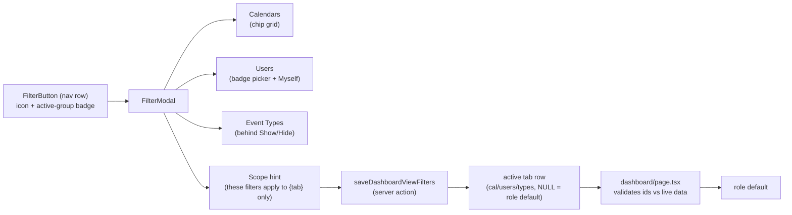
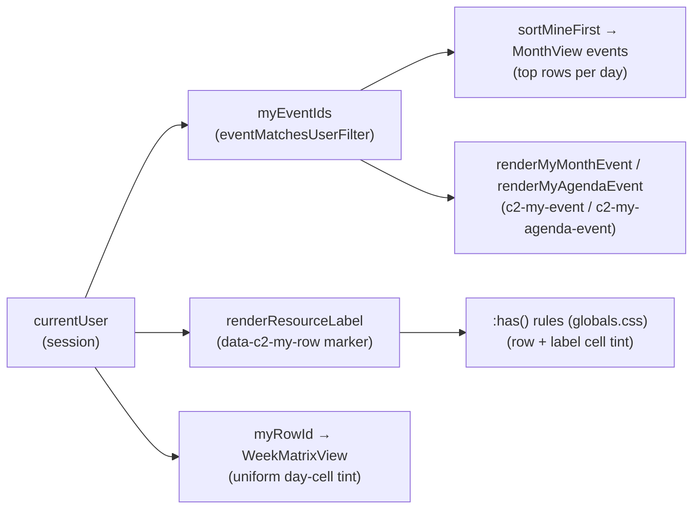
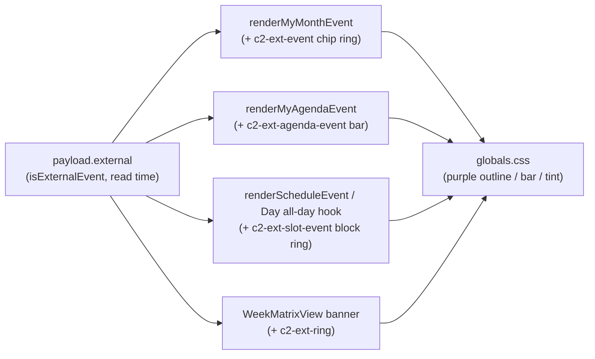
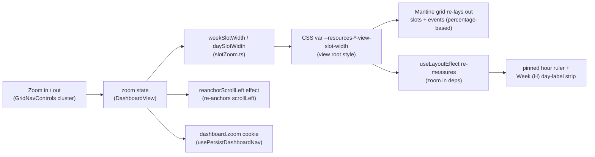
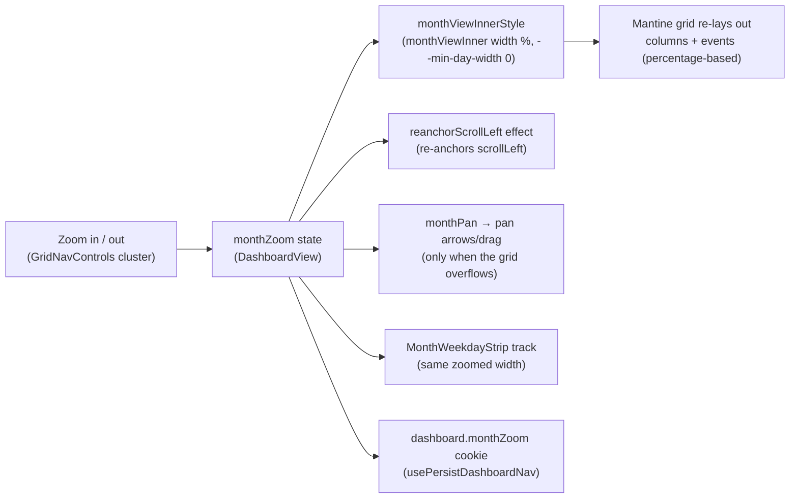

# 1. Dashboard views & filters

The Calendar dashboard (`/dashboard`) renders one of the five event-view
**kinds** (Month / Week (H) / Week (D) / Day / Agenda) over the shared
server-side events cache ([`events-cache.md`](events-cache.md)). The dashboard
does **not** show one fixed instance of each kind: the user builds an on-demand
set of **views (tabs)** — one per-account row per tab (kind + user name + strip
order + that tab's own filter state), stored server-side in
`user_dashboard_views` (`src/lib/dashboardViews`). This document covers the tab
inventory & management, the filters (one button + modal, scoped per tab), the
custom Week (D) matrix — the one view no Mantine Schedule component can render —
the per-view "mine" and external-entry highlights, and the Day / Week (H)
timeline zoom plus the Month grid's fit-to-width zoom.

## Table of contents

- [1.1 View inventory & tab management](#11-view-inventory--tab-management)
- [1.2 Filters](#12-filters)
- [1.3 Week (D): the custom week matrix](#13-week-d-the-custom-week-matrix)
- [1.4 Data flow shared by all views](#14-data-flow-shared-by-all-views)
- [1.5 My-entry highlight](#15-my-entry-highlight)
- [1.6 External-event highlight](#16-external-event-highlight)
- [1.7 Timeline zoom (Day and Week (H))](#17-timeline-zoom-day-and-week-h)
- [1.8 Month-grid zoom (fit-to-width)](#18-month-grid-zoom-fit-to-width)
- [1.9 File index & related docs](#19-file-index--related-docs)

## 1.1 View inventory & tab management

The renderer kinds (`DASHBOARD_VIEW_KINDS`, `src/lib/dashboardViews/views.ts`):

| Kind | Label | Renderer |
| ---------- | -------- | ---------------------------------------------------------------------------------------- |
| `month` | Month | Mantine calendar month grid (six fixed weeks — see [`events-cache.md`](events-cache.md)) |
| `week` | Week (H) | Mantine Schedule, hour columns per resource row |
| `weekv2` | Week (D) | custom week matrix (§1.3) |
| `schedule` | Day | Mantine Schedule, single day per resource row |
| `agenda` | Agenda | list view |

Mobile-month is the sub-`lg` rendering of the `month` kind. Tabs are **not**
the kinds themselves: each `user_dashboard_views` row binds one of these kinds
to a user-chosen **name**, a per-user `sortOrder`, and that tab's own filter
overrides (see `src/db/schema.ts`). **Duplicates of the same kind are allowed**
(two "Agenda" tabs with different names/filters), so a tab's **UUID is its
identity** — carried in the URL as `?view=<tab id>`; a legacy `?view=<kind>`
string maps to the first tab of that kind.

- **Seed**: the first dashboard read per account lazily creates one "Month"
  tab (`ensureDefaultDashboardView`, mutex-guarded on the
  `user_preferences` row so racing requests can't double-insert) and points
  the remembered last-active tab at it.
- **Add view** is the strip's primary affordance: a **`+` button at the end of
  the scrolling tab strip** (the strip's last item, shown for accounts that own
  stored views; tooltip "Add view") opens the **Add-view dialog** directly —
  kind rows with icons + a name (the default name follows the chosen kind until
  edited) — and creating appends the tab and navigates to it. Because it scrolls
  with the strip it can sit off-screen on a long strip; the Manage-views modal's
  **Add view** button is the always-pinned fallback. The dialog and the
  Change-type flow share the **five-kind picker** component
  `ViewTypePicker.tsx`.
- **Manage views** (a settings **gear** to the RIGHT of the strip, outside the
  horizontal scroll area — so the scroll set ends before it; tooltip "Manage
  views") opens a **centered modal** (`EditViewsModal.tsx`, sharing the app's
  **touch-friendly manage-row recipe** — see `src/components/reorderUpDown.tsx`: each row is a bordered
  card with a ~40px chevron pair leading, actions trailing) listing the created
  tabs as a **vertical list**: each row shows the view's kind icon + name with
  **↑/↓** arrows to reorder (commits `reorderDashboardViews`, which
  renumbers every row in a transaction — the clicked arrow shows an inline
  spinner while it works; the row's outward arrow is disabled at the list's
  ends), a **type** button (swap icon) that opens the shared five-kind picker
  (`ViewTypePicker`, below) so a tab's renderer kind can be changed after
  creation — the tab keeps its id, strip order and stored filters, and a name
  that is still the old kind's default label follows to the new kind's default
  (a custom name is kept; the rule is applied server-side by
  `changeDashboardViewKind`), a **pen** button that swaps the row into an
  inline rename field (Enter saves, Escape cancels), and a **trash** button
  that deletes behind a nested `size="sm"` confirm (the last tab can't be
  deleted — its trash is disabled; deleting the active tab navigates to the
  first remaining). Five fixed ~40px controls on one line squeeze the tab name
  out of a phone-width modal, so **below `lg` each row reflows to two lines**:
  the kind icon + name lead on the first (inline rename replaces the name there),
  and **all five controls — the chevron pair plus type/pen/trash — sit together
  on a second left-aligned line**;
  at `lg`+ the row keeps its single line. Changing the **active** tab's type
  re-navigates to the same id under its new kind, so the tab-switch period rules
  below apply (Month → anchored starts today; anchored → Month keeps the month);
  changing an inactive tab just refreshes the list. The old **pin/unpin**
  affordance and its star UI are gone — ordering is fully user-controlled. Tabs
  themselves are
  **content-sized** — each shrink-wraps its label (so the active underline hugs
  the text), they never stretch to fill the row, and a long set overflows into
  natural horizontal scrolling.
- **All-views jump list** (a chevron button between the Add-view button and the
  Manage-views gear, only when the account has more than one tab): for users with many tabs
  the overflowed strip is a long horizontal scroll to reach a specific view, so
  the chevron opens a `Menu` popover listing **every** tab in strip order —
  kind icon + name, the active tab ticked — for a one-tap `switchTab` without
  scrolling the strip.
- **Period preservation on switch** (`switchTab` in `DashboardView.tsx`): a
  tab switch is a _filter/context_ change, so switching between two tabs of the
  same kind (or any two day-anchored kinds) keeps the current date; leaving
  Month for an anchored kind starts on today; leaving an anchored kind for
  Month keeps the anchor's month. Each switch also fire-and-forgets
  `setActiveDashboardView` so the account resumes the last tab across devices.
- **The active tab resolves** (`dashboard/page.tsx`) as URL `?view=` → the
  remembered last-active tab (`user_preferences.dashboardActiveViewId`) → the
  first tab in strip order. Title-template assignments (§ of
  [`event-lifecycle.md`](event-lifecycle.md)) stay keyed by **kind**, so all
  tabs of a kind share that kind's display template.

`/?view=` is now an id, and the remembered cookie no longer carries a view, so
**route/cold-start loading cannot shape its skeleton to the arriving kind**:
`loading.tsx` and the PWA launch shell (`public/loading.html`) show one plain
full-page loading box; the in-page transition skeletons inside `DashboardView`
still shape to the active tab's kind. The break-glass admin session
(`id="admin"`, no `users` row) renders a static single Month tab with view
management hidden.

## 1.2 Filters

Filtering has **one primary affordance**: a dedicated filter button (funnel icon

- active-group-count badge, `FilterButton`) beside the ⋮ menu in the nav row
  opens `FilterModal` (`src/components/FilterModal.tsx`). The ⋮ menu keeps
  **Today / Select date / Enter fullscreen** only (Force refresh
  is a header button; view management lives on the strip's right settings
  button). Dashboards'
  "Myself" quick action lives inside the filter modal
  beside the Users group; "Reset" clears (role defaults).

The modal promotes the filters most people reach — **Calendars** (chip grid) and
**Users** (badge-dialog picker, `variant: "search"`) — and tucks **Event Types**
behind a "Show"/"Hide" disclosure (`collapsedGroupLabels`; audit-log/user-table
callers keep all groups expanded). A footer scope hint notes _"These filters
apply to {view name} only."_ — filter scoping is **per tab**: each tab stores
its own Calendars/Users/Event Types selection, and clearing one tab's filters
never touches the others.

Filter storage & resolution:

- On the dashboard an active **Users** filter also narrows the rows of
  Day/Week (H)/Week (D) — `buildScheduleResources` takes a `userFilter`
  (`src/lib/events/schedule.ts`) and the Week (D) matrix reuses the same rows.
- A tab's filter state lives **on the tab row** (`user_dashboard_views.cal_filter`
  / `users_filter` / `types_filter`), each JSON array or SQL `NULL`. `NULL`
  means **role default** (admin: all calendars; non-admin: their own department;
  Users/Event Types: none) and is re-resolved on every render — a department
  added later shows up without touching the tab. An **explicit array** (including
  `[]` = a genuine "cleared" selection) is stored verbatim.
- **Applying or clearing is a server action**, not a URL navigation: the client
  calls `saveDashboardViewFilters` (empty/role-default selections are stored as
  `NULL`), then re-renders from the server so the events refetch under the new
  filter set. Filters never travel in `cal/users/types` URL params. The modal's
  **Clear** button (then Apply) restores the role defaults (`NULL`); a per-group
  **Deselect All** stores the explicit empty array (an empty grid), which is the
  only path that resolves to "no events".
- Stored ids/names are re-validated against live calendars/users/types on every
  dashboard read (stale entries drop out; an all-stale list degrades to the role
  default), exactly like the URL params they replaced.
- **Access is unrelated to filters.** A user's department membership — or any
  extra department calendars granted to them — has nothing to do with which
  departments they can filter: every user can always select _every_ department
  in the Calendars filter (the reads are not access-gated). Cross-department
  grants affect only Google Calendar sharing/roles
  ([`roster-sharing.md`](roster-sharing.md) §1.5), and a non-admin's **role
  default** stays their own department — extra grants never expand it.
- The Parade State page mirrors the same split: its filters live on the
  `user_preferences.parade_cal` / `parade_users` row (empty = all), applied via
  `saveParadeFilters` ([`ui-state.md`](ui-state.md)).

## 1.3 Week (D): the custom week matrix

A tab whose kind is `weekv2` renders a custom week matrix — **7 day-columns × the same resource
rows as Day/Week (H)** — in `WeekMatrixView.tsx`
(`src/app/(protected)/dashboard/WeekMatrixView.tsx`). No Mantine Schedule component
fits this shape, so the view is hand-built.

Cell binning is pure and unit-tested in `src/lib/events/weekMatrix.ts`:

- **`coveredDays(event, week)`** — the week days an event's naive start/end
  range occupies; all-day events carry an _exclusive_ end date, so the final covered
  day is the end date minus one.
- **`buildWeekLanes(events, week, memberships)`** — one `WeekSpan` per event per row,
  merged into non-overlapping lanes by greedy interval partitioning (sorted by
  startDay → start time → title). Lane `n` renders on grid row `n + 1` of the
  resource row's nested grid. Row semantics (`rowsForEvent`, `departmentRowId`)
  match the schedule views exactly: events with no row still appear when they are
  **external** (pinned to their calendar's department row); unlinked non-external
  events are dropped. A multi-day event is a single span across its covered columns.
  A `memberships` map (department id → active member user ids) expands each tagged
  department to its active members' rows, so a department-level event shows in
  every member's cell, not just the department row — matching the clash occupancy
  model ([`event-clashes.md`](event-clashes.md) §1.2).

## 1.4 Data flow shared by all views

All views read through the same range/month helpers — never `integration.listEvents`
directly ([`events-cache.md`](events-cache.md)):

- Week (H) and Week (D) both use the same `fetchRangeEvents` 2-month read, so the
  cache, the dashboard filters and the force-refresh nonce are inherited unchanged
  by Week (D).
- The Month view range-reads the months its 6-week grid displays
  (`monthGridMonths()`, `src/lib/events/datetime.ts`).
- Every tab is **preloaded for instant switches**: after the active context is
  fresh, `DashboardScreen` calls `preloadDashboardTabs` once per anchor, which
  reads the union of every tab's calendars/months in one pass and projects each
  tab's delta (see [`pwa-offline.md`](pwa-offline.md) §1.18). Switching tabs then
  paints from the device cache with no server round-trip.
- **Tab switches are optimistic, decoupled from the router.** A tap sets a
  `previewView` in `DashboardDataContext`; `DashboardScreen` resolves the
  displayed context from `previewView ?? searchParams.view`, so a warm tab paints
  immediately instead of waiting for the RSC round-trip that updates
  `useSearchParams` (a warm tab's data is already local — the route payload was
  the only lag). The `router.push` still runs for persistence/back-forward; the
  preview clears once `?view=` catches up, or after a 6 s revert window
  (`PREVIEW_REVERT_MS`) if the push never lands. `DashboardView` also
  `router.prefetch`es each tab's target URL so the URL catches up promptly.
  (`docs/loading-transitions.md` §1.10/§1.13.2.)
- Wide grids (Day/Week (H)/Week (D), plus Month once its fit-width zoom makes it
  overflow) pan horizontally through `useGridPan` + `GridPanControls`
  ([`grid-pan.md`](grid-pan.md)); the dashboard chrome can go fullscreen
  through immersive mode ([`immersive-mode.md`](immersive-mode.md)).

## 1.5 My-entry highlight

The logged-in user's entries are visually distinguished in every view, so a
roster member can spot their own rows/chips without reaching for the Users
filter. "Mine" means the event was **tagged on the current user** — exactly the
Myself quick-filter's semantics (`eventMatchesUserFilter`,
`src/lib/events/userFilter.ts`; the organizer counts only when self-invited).
The highlight is
unconditional (it stays on when the Myself filter is already active) and only
exists for roster members: an admin without a roster row gets the event-level
highlights but no row tint (the same boundary as `onlyMeAvailable`).

Per-view mechanics (all client-side — no cache or server impact):

- **Week (H) / Day / Week (D) — whole-row tint.** `renderResourceLabel`
  (DashboardView) renders the current user's label as a `data-c2-my-row`
  marker span (amber dot + semibold shortname). Structural CSS `:has()` rules
  in `globals.css` — the label cell is the only element containing the marker
  directly, and the row the only element containing it through a direct child
 — tint exactly those two elements (label cell: accent-1 + inset accent-6
  bar; row: accent-0). Mantine rows/slots are transparent by default, so the
  row background shows through and events sit above it. The Week (D) matrix
  additionally tints its day cells uniformly (the row tint wins over the
  today tint there).
- **Month — top rows + chip ring.** `MonthView` assigns each day's rows
  greedily in input order, so the events array is pre-sorted with
  `sortMineFirst()` (`src/lib/events/mineFirst.ts`, pure and unit-tested):
  the user's events first, each block time-sorted — they claim the top rows
  of every day (the topmost _non-conflicting_ row: an earlier-placed multi-day
  event can still hold row 1). With `maxEventsPerDay` this pushes more of
  _other_ events behind "+N more" on dense days — the intended trade-off.
  The user's chips (and their copies in the "+N more" popup) get an amber
  ring via the `renderEvent` hook (`c2-my-event`, `globals.css`).
- **Agenda — row highlight, time order kept.** The Agenda tab and the month
  day modal pass a `renderEvent` that adds `c2-my-agenda-event` to the
  user's rows: amber left bar + light tint + semibold title. The
  chronological order is intentionally not changed.
- **Agenda — swipe hint.** Both agenda listings (the tab and the day modal)
  support a horizontal swipe to change day (`useDrag`, `DAY_SWIPE_THRESHOLD`).
  On touch-first devices only (`(pointer: coarse)`,
  `COARSE_POINTER_MEDIA_QUERY` in `src/lib/theme.ts`) a small centered caption
  — "Swipe left or right to change day" — sits beneath the list, styled like
  the wizard's "Tap outside to minimize" hint (xs, dimmed, `pointer-events:
  none`). It is shown at most **once per browser session**: a `sessionStorage`
  flag (`cloudy2.agenda-swipe-hint`) is set on the first successful swipe, so
  the caption never returns once the gesture is discovered.

Colors: the brand amber `accent` family (secondary `#FBC02D`) — distinct from
the event-type colors and the blue `brand` accents used for today/primary. The
tint backgrounds switch on color scheme via the `--c2-my-row-tint` /
`--c2-my-label-tint` custom properties (defined in `globals.css`, consumed by
the `:has()`/agenda rules and — inline — by the Week (D) matrix): light mode
uses the near-white accent-0/1 creams; in dark mode those would glow on the
dark body, so both go to the darker olive amber (row `#3d3200`, label
`#4a3c00` — the same `#3d3200` Parade State uses for its dark-mode amber card).
The accent-6 bars, dot and chip ring are unchanged across schemes.

## 1.6 External-event highlight

Events created directly in Google Calendar (no `Created in cloudy2` marker and no
notes block — `isExternalEvent`, [`event-lifecycle.md`](event-lifecycle.md)) carry
`payload.external === true` at read time (`mapCalendarItem`,
`src/lib/events/queries.ts`). Every dashboard view marks them with a **purple**
treatment, in parallel with the amber "mine" language above: amber says "yours",
purple says "created outside the app". An external event can never be _mine_
(it has no recorded creator), so the two highlight classes never collide on one
event.

Per-view mechanics (all client-side over the same `renderEvent` / render-hook
pattern as §1.5 — no cache or server impact):

- **Month — purple chip ring.** `renderMyMonthEvent` (DashboardView) also adds
  `c2-ext-event` to external events; `globals.css` outlines the inner chip
  element (the child carrying the rounded background, exactly like the amber
  `c2-my-event` ring) — including the copies in the "+N more" popup, which
  share the `renderEvent` path.
- **Agenda — purple row bar.** The Agenda tab and the month day modal both pass
  `renderMyAgendaEvent`, which adds `c2-ext-agenda-event` to external rows:
  purple left bar + tint + semibold title. Chronological order is kept, as with
  §1.5.
- **Day / Week (H) — purple block ring.** A shared `renderScheduleEvent` hook
  (new on Week (H); Day folds it into its existing all-day sticky-title hook)
  appends `c2-ext-slot-event` to the event root for external events. The root's
  single child is the chip in every shape — the ScheduleEvent inner box for
  timed events and Week (H) all-day bars, and Day's custom all-day Box — so one
  `> *` outline rule covers all of them.
- **Week (D) — purple banner ring.** The matrix banner's inner Box carries the
  rounded background (and the event's 1px border) itself, so it gets the
  self-ring class `c2-ext-ring` instead of the `> *` variant.

Colors: Mantine's built-in `purple` family — deliberately distinct from the
brand amber (`accent`, mine), the brand blue (`brand`, today/primary) and red
(errors / KAH warnings), so the highlight can't be misread as any of those.
`purple-6` holds on both light and dark bodies for the ring and bar; the agenda
tint switches on color scheme via `--c2-ext-row-tint` (light: near-white
`purple-0`; dark: deep purple `#241a45`, mirroring the mine row's olive-dark
pattern) next to the `--c2-my-*` properties in `globals.css`. Event body colors
are untouched — the highlight is purely additive (ring / bar / tint), so the
department-calendar colors of untyped events keep their meaning.

## 1.7 Timeline zoom (Day and Week (H))

The Day and Week (H) schedule views can zoom their hour columns in and out, so the
user can fit more of the day/week in view (overview) or expand it for detail. One
**shared** zoom level scales the width of every hour slot; it does not change the
slot granularity (still 60-minute columns) or the row height.

- **Levels**: discrete `0.5, 0.75, 1, 1.25, 1.5, 2` (`ZOOM_LEVELS`,
  `src/lib/ui/slotZoom.ts`); `1` is the default (today's fixed widths). The buttons
  step one level at a time and clamp at the extremes (disabled there).
- **Controls**: `GridNavControls` (`src/components/GridNavControls.tsx`) — the zoom
  in/out pair lives in the **same right-edge control cluster** as the right pan
  arrow (zoom +/− on top, a divider, then the pan arrow), with the left pan arrow
  edge-anchored on the left; the pair is the familiar map-controls layout and can
  never overlap the pan arrow, and the cluster hangs from its bottom edge so both
  pan arrows align vertically at the visible-slice center ([`grid-pan.md`](grid-pan.md)).
  Rendered whenever the schedule grid is shown (skeleton/empty excluded) — unlike
  the pan arrows it shows even when the grid fits without overflowing.
- **Mechanism**: each view reads its slot width from a CSS variable on the view root
  (`--resources-week-view-slot-width` / `--resources-day-view-slot-width`). Mantine
  sizes the day container from that var and lays every event out as a **percentage**
  of it, so changing the var re-lays out slots _and_ events with no JS geometry work.
  `DashboardView` computes the zoomed width (`weekSlotWidth` / `daySlotWidth`) and
  writes it to the var through the view's `style` prop (the Schedule CSS-var gotcha —
  [`desktop-responsive.md`](desktop-responsive.md)).
- **Rulers follow**: the pinned hour ruler and the Week (H) day-label strip follow the
  slot width through a `useLayoutEffect` that probes the var from the DOM and publishes
  it as `--ruler-slot`. Both are a **viewport-width wrapper**, translated by `-scrollLeft`
  via a direct DOM transform on the scroll frame — no re-renders — with only the cells
  that can intersect the viewport rendered (absolutely positioned at their global day /
  slot offsets). The wrapper itself must NOT clip (`overflow: visible`; the parent box
  clips to the viewport): an `overflow: hidden` on the wrapper would keep every cell
  beyond its own (viewport-width) box out of the layer's paint, so translating it could
  never reveal them. The day
  window follows the leftmost visible day; the ruler window advances in 8-slot batches.
  Rendering just the visible window (instead of a full 168-slot / 7-day track) keeps the
  composited layer small, so the labels track the pan smoothly instead of re-rastering
  tiles on the fly. A window update re-renders only the small strip (each registers a
  one-shot advance callback), never the whole dashboard. `zoom` is in that effect's
  dependency list, so both strips re-measure on every zoom change.
  - **Ruler height is explicit** (`1.15rem`): every ruler cell is absolutely positioned,
 so without a set height the sticky strip would collapse to 0px and hide the hour
 markers.
  - **Day labels are anchored, not column-fixed.** A day column (24 slots) is far wider
 than the viewport, so a label fixed at a column's left edge is only visible near
 that edge and "scrolls away" while panning. Instead each label's `left` is clamped
 against the per-frame `--c2-scroll-x` (published alongside the wrapper transform):
 the leftmost visible day's label stays pinned at the strip's left edge while its
 column pans through the viewport, handing off at the day boundary — so a date label
 is always visible during a horizontal pan, on any viewport width.
- **Persistence**: the level is remembered per device in the `cloudy2.ui` cookie as
  `dashboard.zoom` — not URL-backed (zooming never navigates), so it is read from the
  raw cookie and seeded into the client state before first paint (no width jump on
  relaunch). See [`ui-state.md`](ui-state.md).
- **Scope**: shared by Day and Week (H) only. Week (D) — its columns are
  day-granularity, not hour slots — and Month and Agenda are unaffected.
- **Re-anchoring**: zooming keeps the time that was at the viewport's _center_
  centered — a `useLayoutEffect` (declared before the ruler measurement effect)
  re-anchors `scrollLeft` from the previous/next slot-width ratio via the pure
  `reanchorScrollLeft` helper, subtracting the zoom-invariant label-column width
  before scaling and re-adding it after. See `src/lib/ui/slotZoom.ts`.

## 1.8 Month-grid zoom (fit-to-width)

The Month view can zoom its day columns in and out. The **default (zoom 100%) is
"fit to viewport"**: all seven columns are sized to exactly 1/7 of the grid's
width, so the whole week is visible on any screen with no horizontal scroll.
Zooming in widens every day column from there (columns only — `maxEventsPerDay`,
cell height and the "+N more" day modal are unchanged), overflowing the grid into
the same horizontal pan the other views use.

- **Mechanism**: Mantine's MonthView lays each day column out as a percentage of
  its week row (`flex: 0 0 calc(100% / 7)`), which fills the ScrollArea content
  (`monthViewInner`). `DashboardView` therefore sizes that content by the zoom
  multiplier — `width: ${zoom × 100}%` via the MonthView `styles` API — so every
  column, chip and "+N" popup scales together with no JS geometry. The library's
  84px `--min-day-width` floor is zeroed on the same element (`monthViewInnerStyle`)
  so the fit width can squeeze all seven columns into a phone (~50px each).
- **Levels**: discrete `1, 1.25, 1.5, 2, 2.5, 3` (`MONTH_ZOOM_LEVELS`,
  `src/lib/ui/monthZoom.ts`). `1` (fit) is the **floor** — the grid can never be
  narrower than the viewport, so zoom-out is disabled there — and the buttons step
  one level at a time and clamp at the extremes.
- **Controls**: the same right-edge `GridNavControls` cluster as the timeline zoom
  (zoom +/− over the right pan arrow, plus the left pan arrow), fed by the Month
  view's own `useGridPan` instance (`monthPan`). The zoom pair always shows; the pan
  arrows and drag-to-pan appear only once a zoom level overflows the viewport.
  `GridNavControls` takes the month's level range via `zoomMin`/`zoomMax` (the
  component's defaults remain the timeline zoom's 0.5–2).
- **Pinned weekday strip**: the `MonthWeekdayStrip` track is sized to the same
  zoomed content width (`width: ${zoom × 100}%`, cells `flex: 0 0 100%/7` — no
  84px floor), so the initials stay exactly over their day columns at every zoom
  level while the strip translates by `-scrollLeft`.
- **Re-anchoring**: zooming keeps the day at the viewport's _center_ centered. A
  `useLayoutEffect` re-anchors `scrollLeft` from the previous/next zoom ratio via
  the pure `reanchorScrollLeft` helper (no label column — the ratio is just
  oldZoom→newZoom, since per-day width = viewportWidth × zoom / 7).
- **Persistence**: the level is remembered per device in the `cloudy2.ui` cookie as
  `dashboard.monthZoom` — a key separate from the Day/Week (H) `zoom` so each view
  keeps its own level — read from the raw cookie and seeded before first paint.
  See [`ui-state.md`](ui-state.md).

## 1.9 File index & related docs

| File | Role |
| -------------------------------------------------- | ---------------------------------------------------------------------------------------------------------------------------------------------------------- |
| `src/lib/dashboardViews/views.ts` | Kind vocabulary + labels, tab DTO, filter-override normalizers, `resolveActiveTab`, `tabSwitchTarget` (pure) |
| `src/lib/dashboardViews/queries.ts` | Tab reads + the mutex-guarded default "Month" seed |
| `src/lib/dashboardViews/actions.ts` | Tab CRUD: `create/rename/delete/reorderDashboardViews`, `saveDashboardViewFilters` |
| `src/lib/userPrefs/queries.ts` + `actions.ts` | `user_preferences` row: last-active tab + parade filters (incl. `saveParadeFilters`) |
| `src/app/(protected)/dashboard/DashboardView.tsx`  | Tab strip (+ trailing Add-view button, right-side Manage-views gear and All-views jump popover), optimistic tab switch + period rules + tab-URL prefetch, filter state, schedule zoom + month zoom state & widths |
| `src/app/(protected)/dashboard/DashboardScreen.tsx` | Snapshot/warm-cache/preload owner; resolves the displayed context from `previewView ?? ?view=` so warm tab switches paint without waiting on the RSC |
| `src/app/(protected)/dashboard/EditViewsModal.tsx` | Manage-views dialog: card manage list (↑/↓ reorder, Change-type picker, inline rename, nested delete confirm, Add-view button) |
| `src/app/(protected)/dashboard/ViewTypePicker.tsx` | Shared five-kind picker (Month/Week (H)/Week (D)/Day/Agenda) used by Add view and Manage-views Change type |
| `src/app/(protected)/dashboard/viewMeta.tsx` | Kind → icon/label map shared by the strip, the Add-view picker and Manage-views rows |
| `src/components/reorderUpDown.tsx` | Shared touch-friendly manage-row recipe: ~40px ↑/↓ chevron pair (`ReorderUpDown`) + row-action sizes |
| `src/app/(protected)/dashboard/page.tsx` | Resolves tabs + active tab (`?view=` → remembered → first), validates per-tab filters |
| `src/app/(protected)/dashboard/WeekMatrixView.tsx` | Week (D) matrix renderer |
| `src/lib/events/weekMatrix.ts` | Pure Week (D) lane binning (`coveredDays`, `buildWeekLanes`) |
| `src/lib/events/mineFirst.ts` | Pure "mine first" sort for the month view's greedy row assignment |
| `src/lib/events/schedule.ts` | Resource rows (`buildScheduleResources`, `userFilter`) |
| `src/lib/ui/slotZoom.ts` | Pure zoom levels + slot-width math (`clampZoom`, `stepZoom`, `weekSlotWidth`, `daySlotWidth`) |
| `src/lib/ui/monthZoom.ts` | Pure Month fit-width zoom levels + stepping (`clampMonthZoom`, `stepMonthZoom`) |
| `src/components/GridNavControls.tsx` | Day/Week (H) + Month right-edge cluster: zoom +/− + right pan, plus left-edge pan |
| `src/components/FilterButton.tsx` | Dedicated filter button (icon + active-group badge) replacing the kebab's filter menu |
| `src/components/FilterModal.tsx` | Filters dialog (collapsible groups, per-tab scope hint) |

Related docs:

- [`events-cache.md`](events-cache.md) — the read path every view uses.
- [`grid-pan.md`](grid-pan.md) — horizontal pan for the wide grids.
- [`immersive-mode.md`](immersive-mode.md) — fullscreen calendar chrome.
- [`user-picker.md`](user-picker.md) — the Users filter's badge-dialog picker.
- [`desktop-responsive.md`](desktop-responsive.md) — the slot/label width table and the Schedule CSS-var gotcha zoom builds on.
- [`ui-state.md`](ui-state.md) — server-side prefs (tabs + filters) vs the device-local cookie (`zoom`, date/month, sidebar).
