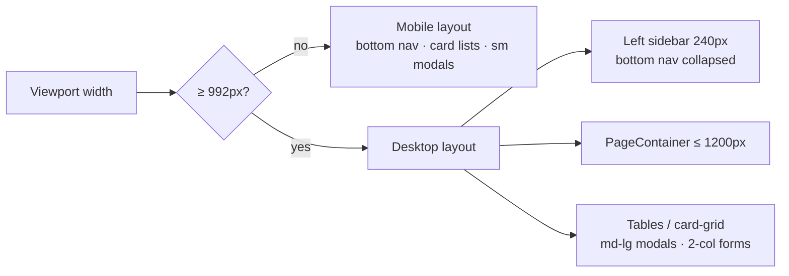

# 1. Desktop responsive layout

Cloudy started as a strictly mobile-first app (bottom nav, card lists, floating
modals). It now also presents a purpose-built layout for wide screens: at Mantine's
`lg` breakpoint (**992px = 62em**) and above the shell gains a left sidebar, pages
center in a bounded container, data-dense lists become tables, card lists flow into
multi-column grids, and modals/forms widen. Below `lg` **nothing changes** — the
mobile layout is byte-for-byte the same code path.

## Table of contents

- [1.1 Breakpoint & detection](#11-breakpoint--detection)
- [1.2 App shell (sidebar + collapsed bottom nav)](#12-app-shell-sidebar--collapsed-bottom-nav)
- [1.3 Layout scaffolding (globals.css)](#13-layout-scaffolding-globalscss)
- [1.4 Dashboard](#14-dashboard)
- [1.5 Settings](#15-settings)
- [1.6 Parade State & Contacts](#16-parade-state--contacts)
- [1.7 Modal sizes](#17-modal-sizes)
- [1.8 Login & PWA](#18-login--pwa)
- [1.9 File index](#19-file-index)
- [1.10 Related docs](#110-related-docs)

## 1.1 Breakpoint & detection

One breakpoint governs everything: Mantine `lg`, pinned to **992px** via a
theme override (`src/lib/theme.ts` sets `breakpoints.lg` to `"62em"`, matching
the CSS block). Mantine's default `lg` is 75em (1200px); without the override
the JS `isDesktop` query, the `visibleFrom="lg"` props, and the `62em` CSS
would drift apart. The override makes every `lg:` reference mean 992px.

| Medium | Where | Usage |
| ------ | ----- | ----- |
| CSS | `src/app/globals.css` | `@media (min-width: 62em)` block (62em = 992px at the default 16px root) |
| Theme | `src/lib/theme.ts` | `breakpoints.lg: "62em"` — aligns Mantine's `lg` with the CSS |
| Client components | `@mantine/hooks` | `const theme = useMantineTheme(); const isDesktop = useMediaQuery(\`(min-width: ${theme.breakpoints.lg})\`)` (do **not** append `px` — `theme.breakpoints.lg` is an em string) |
| Mantine props | core | `visibleFrom="lg"` / `hiddenFrom="lg"` (note: v9 has no `hiddenDown`/`visibleDown`), responsive props like `maw={{ base: 380, lg: 440 }}`, `Grid.Col span={{ base: 12, lg: 6 }}` |

Server components do not need the flag: they render both variants and let the
CSS/`visibleFrom`/`hiddenFrom` props decide.

## 1.2 App shell (sidebar + collapsed bottom nav)

`src/components/AppShellShell.tsx` (client) renders the whole authenticated shell:

- **Navbar** — `AppShell navbar={{ width: 240, breakpoint: "lg" }}`: appears at `lg`
  with the four nav items (Calendar, Parade State, Contacts, Settings for admins) as
  `NavLink`s driven by the same local `items` array (the `NavItem` constants defined in
  the same file) the mobile footer renders. Below `lg` Mantine collapses it
  automatically.
- **Footer** — `footer={{ height: BOTTOM_NAV_HEIGHT_CSS, collapsed: isDesktop }}`:
  the bottom nav stays for mobile; at `lg` it collapses off-screen and its layout
  offset drops to 0 (Mantine's `collapsed` footer behavior), so the FAB clearance
  below it no longer applies.
- `isDesktop` comes from `useMediaQuery` (see 1.1); it only drives the footer's
  `collapsed` prop — the navbar collapse is Mantine's own `breakpoint`.
- The shell root carries `className="app-shell-root"`, the hook for the floating
  offset variable (1.3).

## 1.3 Layout scaffolding (globals.css)

All pure-CSS desktop switches live in one `@media (min-width: 62em)` block in
`src/app/globals.css`, plus a few base classes:

| Class / var | Mobile | At `lg` | Consumed by |
| ----------- | ------ | ------- | ----------- |
| `.app-shell-root` → `--app-floating-bottom-offset` | `calc(56px + env(safe-area-inset-bottom) + 16px)` (clears bottom nav) | `16px` | `FloatingToolbar` default `bottomOffset` |
| `.settings-page-pad` → `--settings-fab-bottom` + `padding-bottom` | `calc(108px + env(safe-area-inset-bottom) + 16px)` (clears bottom nav + settings tab bar) | `16px` | settings `layout.tsx` wrapper; the four settings FABs pass it to `FloatingToolbar` |
| `.app-shell-root` → `--app-shell-header-offset` | undefined (the dashboard's sticky bars stay non-stuck on mobile) | `56px` (the app header's height) | `SettingsTabs` sticky row; the dashboard's view-tabs wrapper and Week v2 day-header strip |
| `.page-container` | full width | `max-width: 1200px; margin-inline: auto` | `PageContainer` component |
| `.card-grid` | `1fr` single column | `repeat(auto-fill, minmax(320px, 1fr))` | `ContactList`, `ParadeStateView` |

`PageContainer` (`src/components/PageContainer.tsx`) is the thin wrapper
(`<Box className="page-container">`) that data pages apply to their root so
content centers without touching each page's internals.

The old fixed pixel offsets (`BOTTOM_NAV_FLOATING_OFFSET`,
`SETTINGS_TAB_BAR_OFFSET` / `settingsTabBar.ts`) were deleted — the CSS variables
above replace them, so a FAB's clearance now re-resolves automatically at the
breakpoint.

## 1.4 Dashboard

`DashboardView.tsx` owns the desktop differences for the calendar tabs (all
gated on `isDesktop`):

| Element | Mobile | At `lg` |
| ------- | ------ | ------- |
| Schedule views' resource/group label widths (`--resources-day-view-*` / `--resources-week-view-*` vars) | `3rem` / `1.5rem` | `6rem` / `3.5rem` — shortnames get room to stop ellipsizing |
| Week timeline slot width (`--resources-week-view-slot-width`) | Mantine default (`calc(3.75rem * var(--mantine-scale))`, 60px/hour) | `calc(4.5rem * var(--mantine-scale))` |
| Week v2 matrix label columns | `MOBILE_LABEL_WIDTH` 3rem / group 1.5rem | `DESKTOP_LABEL_WIDTH` 5rem / group 2.5rem (header spacers, sticky row labels, `contentMinWidth`, `labelLeft`) |
| Month view `maxEventsPerDay` | 3 | 4 |
| "New event" | FAB only | FAB **hidden** (`hiddenFrom="lg"`) — replaced by a `Button visibleFrom="lg"` in the header row beside the ⋮ menu |
| Agenda day / event form / detail / filter / date-picker modals | `sm` | `md` (see 1.7) |

**Schedule CSS-var gotcha:** `@mantine/schedule` declares its label/slot width
variables on the **view root element** (hashed class), so a parent class cannot
shadow them. `DashboardView` therefore passes the widths through each view's own
`style`/`vars` props, and `WeekMatrixView` (a fully custom component) computes the
widths in JS and inlines them. The pinned Week-day header strip takes the same
widths as props (`resourceLabelWidth`/`groupLabelWidth`) so its corner spacers
track the label columns at both breakpoints.

## 1.5 Settings

- **`SettingsTabs`** — below `lg` it stays a fixed strip above the bottom nav; at
  `lg` it becomes a **sticky top row** so the tab bar stays visible while a long
  table scrolls. The sticky element is a `Box` wrapping `<Tabs>` — it must be a
  direct child of the settings layout root (a full-height column), because a sticky
  element pinned to the `Tabs` root alone can't stick: that root is only as tall as
  the tab bar and scrolls away with the page (same pattern as the dashboard's
  view-tabs wrapper).
- **Data-dense lists use Mantine `Table` at `lg` only** (the scoped exception to
  the mobile card-list rule — cards stay below `lg` via `hiddenFrom="lg"`, the
  table wrapper uses `visibleFrom="lg"`):

  | Page | Desktop columns |
  | ---- | --------------- |
  | Users (`UserTable`) | Name · Phone · Role · Department · Status · Edit (row click = edit) |
  | Departments (`DepartmentTable`) | Name · Calendar ID · Share · Rename · Delete |
  | Event Types (`EventTypeTable`) | Name · Acronym · Time options · Location policy (row click = edit) |
  | Audit Log (`AuditLogView`) | Time · Actor · Action · Entity · Route · Details (row click = detail modal) |

- **Audit Log filters** — mobile keeps them in the ⋮ menu; at `lg` they render as
  an inline bar (search field + Actor/Action/Entity selects + from/to date inputs +
  Reset) above the table.
- **Forms go 2-column** at `lg` via `Grid gap="md"` with
  `Grid.Col span={{ base: 12, lg: 6 }}` pairs: `UserForm` (Name/Shortname,
  Phone/Email, Birthday half-width), `EventTypeForm` (Name/Acronym,
  Time options/Location policy), `TemplatesForm` and the General tab's
  `SettingsForm` (two template cards side by side).
- Modals widen one size step (1.7); settings pages wrap their content in
  `PageContainer` from `settings/layout.tsx`.

## 1.6 Parade State & Contacts

Both pages wrap their content in `PageContainer`; their card lists
(`ContactList`, `ParadeStateView`'s per-department user list) switch from
`<Stack gap="sm">` to a `<Box className="card-grid">`, so cards reflow into
`auto-fill` ≥320px columns at `lg`. No other behavior changes.

## 1.7 Modal sizes

Modals stay **floating centered dialogs** (never `fullScreen`) at every width;
only the `size` steps up at `lg` (detected with `useMediaQuery` inside the client
components):

| Modal | Mobile | At `lg` |
| ----- | ------ | ------- |
| Event form (`DashboardView`) | `sm` (380px) | `md` (440px) |
| Event detail (`EventDetail`) | `sm` | `md` |
| Agenda day modal | `sm` | `md` (max-height `56dvh` → `70dvh`) |
| Filter modal (`FilterModal`) | `sm` | `md` |
| Date picker (`DateSelectorModal`) | `sm` | `md` |
| User form | `md` | `lg` |
| Event type form | `sm` | `md` |
| Audit detail (`LogDetailModal`) | `md` | `lg` |

`EventDetail`'s shrink animation sizes off the same value through
`modalContentWidth(viewport, sizePx)` in `src/lib/motion/origin.ts`
(`smModalContentWidth` = `modalContentWidth(viewport, 380)`).

The event form's **Timestamp step** pairs Start/End side by side in a 2-column
`Grid` at `lg` (both the range pickers and the full-day date+AM/PM pairs).

## 1.8 Login & PWA

- `LoginForm` card: `maw={{ base: 380, lg: 440 }}`.
- `src/app/manifest.ts`: `orientation: "any"` (was `"portrait"`) so an installed
  PWA on a tablet/desktop is not forced to portrait.

## 1.9 File index

| File | Role |
| ---- | ---- |
| `src/app/globals.css` | `@media (min-width: 62em)` block: offset vars, `.page-container`, `.card-grid` |
| `src/components/AppShellShell.tsx` | Navbar (240px, `breakpoint: "lg"`), footer `collapsed: isDesktop`, `.app-shell-root` |
| `src/components/PageContainer.tsx` | 1200px-centered wrapper |
| `src/components/FloatingToolbar.tsx` | Default `bottomOffset` = `var(--app-floating-bottom-offset)` |
| `src/lib/bottomNav.ts` | `BOTTOM_NAV_HEIGHT` / `BOTTOM_NAV_HEIGHT_CSS` (floating offset var moved to CSS) |
| `src/app/(protected)/settings/layout.tsx` | `.settings-page-pad` wrapper + `PageContainer` |
| `src/app/(protected)/settings/SettingsTabs.tsx` | Fixed strip < `lg`, sticky top row ≥ `lg` |
| `src/app/(protected)/settings/users/UserTable.tsx` | Cards < `lg`, `Table` ≥ `lg` |
| `src/app/(protected)/settings/departments/DepartmentTable.tsx` | Cards < `lg`, `Table` ≥ `lg` |
| `src/app/(protected)/settings/event-types/EventTypeTable.tsx` | Cards < `lg`, `Table` ≥ `lg` |
| `src/app/(protected)/settings/audit-log/AuditLogView.tsx` | Menu filters < `lg`, inline bar + `Table` ≥ `lg` |
| `src/app/(protected)/settings/users/UserForm.tsx` | 2-col `Grid` at `lg` |
| `src/app/(protected)/settings/event-types/EventTypeForm.tsx` | 2-col `Grid` at `lg` |
| `src/app/(protected)/settings/templates/TemplatesForm.tsx` | Side-by-side cards at `lg` |
| `src/app/(protected)/settings/general/SettingsForm.tsx` | Side-by-side cards at `lg` |
| `src/app/(protected)/dashboard/DashboardView.tsx` | Schedule label/slot widths, header New-event button, hidden FAB, modal sizes |
| `src/app/(protected)/dashboard/WeekMatrixView.tsx` | MOBILE_/DESKTOP_ label widths, responsive `contentMinWidth`/`labelLeft` |
| `src/app/(protected)/dashboard/EventForm.tsx` | Timestamp step 2-col at `lg` |
| `src/app/(protected)/dashboard/EventDetail.tsx`, `src/components/FilterModal.tsx`, `src/components/DateSelectorModal.tsx` | `sm` → `md` at `lg` |
| `src/lib/motion/origin.ts` | `modalContentWidth(viewport, sizePx)` |
| `src/app/(protected)/contacts/page.tsx` + `ContactList.tsx` | `PageContainer` + `.card-grid` |
| `src/app/(protected)/parade-state/page.tsx` + `ParadeStateView.tsx` | `PageContainer` + `.card-grid` |
| `src/components/LoginForm.tsx` | `maw={{ base: 380, lg: 440 }}` |
| `src/app/manifest.ts` | `orientation: "any"` |

## 1.10 Related docs

- [ui-state.md](ui-state.md) — remembered page/tab/filter state (the nav items
  both the sidebar and the bottom nav render).
- [loading-transitions.md](loading-transitions.md) — skeletons/fades are
  breakpoint-agnostic and unchanged by this design.
- [events-cache.md](events-cache.md) — the data layer behind the dashboard
  views; untouched by the responsive work.
