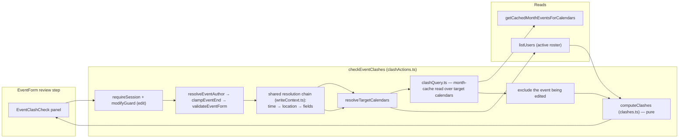

# 1. Event clash warnings

A **pre-submit, notify-only** clash (double-booking) advisory for the event
create/edit wizard: when the user reaches the review step, the form checks whether
the event would overlap an existing event that occupies any of the same people, and
warns about each affected person and conflicting event. The check never blocks a
save — it exists to inform, exactly like the KAH breach notifications
([`kah.md`](kah.md)) but shown in the form before the event is written.

## Table of contents

- [1.1 Problem](#11-problem)
- [1.2 Semantics](#12-semantics)
- [1.3 Goals & non-goals](#13-goals--non-goals)
- [1.4 Architecture overview](#14-architecture-overview)
- [1.5 The check path](#15-the-check-path)
- [1.6 The review-step panel](#16-the-review-step-panel)
- [1.7 Edge cases & rules](#17-edge-cases--rules)
- [1.8 Pure helpers & testing](#18-pure-helpers--testing)
- [1.9 File index & related docs](#19-file-index--related-docs)

## 1.1 Problem

The app's calendar stores no event table — one logical event is _N copies_ spread
over the involved department calendars. A user double-booking themselves, or a user
tagging an attendee who already has an overlapping event, was previously invisible
until someone looked at the calendar. We want the person creating or editing an
event to be told, **before saving**, which of the event's people already have an
overlapping event.

There is a second, subtler need. A **department-level event** (an event that tags a
department in Participants) is shown on that department's schedule row — but for
availability purposes it must count as an event for **every active user within that
department**. Two events that only look fine per-person can still double-book a whole
department (e.g. a full-team event overlapping a member's personal leave).

## 1.2 Semantics

Who an event **occupies**:

| Event kind | Occupies |
| ----------------------------------------------------------------------------- | ---------------------------------------------------------------------------------- |
| In-app event with attendees | each tagged attendee + every **active** member of each tagged department (the **organizer counts only when they tagged themselves**; a no-invitee-type event keeps the organizer as its sole attendee) |
| External / people-less event (created directly in Google, no parseable notes) | every active member of the **department calendar the copy sits on** |
| **Informational** event (type has *Exclude from conflict checks* enabled) | **nobody** — the event is ignored entirely: it never triggers a conflict and is never checked itself (the candidate check is skipped) |

Two events **clash** when their time windows overlap AND they occupy at least one
common active roster user. Time windows use the half-open instant convention the
calendar cache already uses (`start < end`; back-to-back events do not clash);
all-day events carry their exclusive end date, exactly as in `absEventRange`
([`datetime.ts`](event-lifecycle.md#1112-datetime-conventions-datetimets)).

Day-based (`full`/`half`) events are *stored* at UTC-midnight (so the date
round-trips for display), but the clash engine compares them on the **SGT civil
day** basis shared with timed and half-day windows: a `full` event's UTC-midnight
window is realigned via `utcMidnightToSgt` (−8 h), so a full-day on day `D` ends
exactly where the next day's AM half begins — adjacent days never overlap.

**Half-day (`half`) events clash at half-day resolution, not whole-day.** A
day-based event stores no time on Google — the (AM)/(PM) markers live only in
the notes block — so the overlap test compares the *effective* window each
event actually occupies: `halfDayRange` (`datetime.ts`) maps AM to
`00:00`–`12:00` and PM to `12:00`–`24:00` (UTC+8 wall clock). Two adjacent
halves of the same day therefore fit back-to-back and do **not** clash, while
an AM event still clashes with another AM event (and a `full` event with
anything that day). The engine only applies this for a `half` event carrying
*both* markers; a legacy `full` event whose notes still carry stray (AM)/(PM)
markers keeps its full-day window.

> Membership expansion only ever counts **active** roster users, and the candidate
> itself is always normalized through the same `resolveEventAuthor` chain as a real
> create/update (fixed organizer), so the advisory reasons about the exact
> people/calendars that save would write.

## 1.3 Goals & non-goals

**Goals**

- Inform before save: per conflicting event, list the affected people (marking the
  acting user as "you") plus the conflicting event's title, time, and department.
- Treat department-level events as events for everyone within that department, both
  for the candidate and for existing events.
- Stay advisory: warnings never prevent a create/update, mirroring the KAH
  notify-only philosophy.
- Reuse the mutation's own normalization and the sanctioned month cache so the check
  is cheap, consistent, and never touches raw Google `listEvents`.

**Non-goals**

- No hard-blocking policy, no "save anyway" gate.
- No persistence: clashes are computed on the fly, nothing is stored or emailed.
- No authority: the check never issues a session or audits; the caller's later
  create/update performs the real guards.
- External events that have parseable people do not exist (external = no app notes),
  so the people-less rule above is unambiguous.

## 1.4 Architecture overview

The read is bounded to the candidate's **target calendars** — the same
`deriveTargetCalendarIds` set the write will use — because of a data-model invariant:
every event that occupies a person carries a copy on that person's own department
calendar (creator → own department; tagged user → their department; tagged department
→ that department), and external events sit on their own calendar. So nothing that can
clash with the candidate lives outside those calendars.

## 1.5 The check path

The client (`src/app/(protected)/dashboard/EventForm.tsx`) builds the exact submit
payload via the same `valuesToPayload` helper the submit handler uses, so the check
sees byte-identical values. A memoized `clashRequest` (a new object only when the
effective window/people actually change) feeds `EventClashCheck`
(`src/app/(protected)/dashboard/EventClashCheck.tsx`), which calls the server action:

1. `requireSession()`; on edit, `modifyGuard` against the ref (organizer/attendees/
 tagged-department members, owner-lock aware) — the advisory is never richer than the
 mutation the actor may perform (a failed guard simply returns no clashes).
2. `normalized = clampEventEnd(resolveEventAuthor(values, session, ref, canChangeLock))`,
 then the shared `resolveEffectiveInput` chain from `src/lib/events/writeContext.ts` —
 the same chain `createEvent`/`updateEvent` run, so event types that hide invitees or
 restrict time options resolve identically.
3. `resolveTargetCalendars(effectiveInput, ref?.calendarId)` (create → no fallback;
 update → the ref's calendar, exactly like the mutations).
4. `absEventRange` gives the candidate window; `clashingEventsFor`
 (`src/lib/events/clashQuery.ts`) reads those calendars' overlapping months from
 the layered month cache (`clashWindowMonths` mirrors the KAH read's month
 arithmetic exactly) and shapes each item with its parsed people.
5. Copies of the event **being edited** are dropped (all copies share the group
 `eventId`; a legacy event with no group id is dropped by its original
 `(calendar, googleEventId)` copy).
6. The pure `computeClashes` (`src/lib/events/clashes.ts`) intersects the candidate's
 occupied users with each overlapping event's occupied users and returns one entry
 per conflicting logical event (logical copies collapse to one) with the affected
 candidate user ids.
7. Display names are resolved from the active roster and the entries return to the
 panel with a UTC+8 naive window (all-day ends converted to inclusive).

The shared chain lives in `writeContext.ts` (a plain module, never `"use server"`)
precisely so `actions.ts` and `clashActions.ts` import the same resolution — a Next
`"use server"` module may only export async functions, so the helpers had to move out
of `actions.ts` to be importable by both.

## 1.6 The review-step panel

`EventClashCheck` renders inside the wizard's review step, under the calendar-preview
paper. It runs the server check when it mounts and whenever `request` changes, and
shows one of:

- **Checking** — a small skeleton block with a `LoadingStatus` announcement.
- **Clashes** — a shared **`ClashCard`** amber panel, collapsed by default to the
  summary line `Double booking: N people · <titles preview>` — the first two
  conflicting-event titles, then `· +N more` (a chevron shows it expands);
  tapping the summary reveals one row per conflicting event (title, `External`
  badge when applicable, when + department, and the affected people as chips — the
  acting user's chip reads "You (name)" in the accent color). Many people from a
  whole-department clash are capped at six chips with a `+N more` summary. A
  closing line reminds the user the event can still be saved. The polite
  `role="status"` announcement covers only the summary line, so the clash count is
  announced on arrival while expanding stays a quiet user action. Row when-labels
  come from the shared `clashWhenLabel` (`clashDisplay.ts`), which collapses a
  same-day range to a single date; each entry also carries `eventId`/`calendarId`,
  which only the Double Booking page uses (its rows deep-link; the wizard's stay
  inert).
- **No clashes** — a green confirmation naming how many people were checked.
- **Error** — a muted one-liner with a Retry button.

The Create/Save button is never disabled by a warning (the check is asynchronous and
advisory; submitting while it is in flight simply proceeds).

## 1.7 Edge cases & rules

- **Editing an event**: its own existing copies are excluded by group id, so an
  unchanged edit never warns about itself. Moving an event's time onto another event
  of the same people _does_ warn.
- **Duplicating an event**: the copy is a genuinely overlapping new event, so it warns
  normally against the source event (the user is expected to retime the copy).
- **Department-level candidate**: tagging a department makes every active member of
  it an affected candidate, so a member's overlapping personal event is reported.
- **Department-level existing event**: it occupies all members of its tagged
  departments, so any overlapping candidate that involves one of them clashes.
- **Half-day events**: the candidate and each existing event are compared by
  their effective AM/PM sub-day windows (§1.2), so an AM half-day does not warn
  against a PM half-day on the same day, while two AM (or AM-vs-full-day)
  overlaps still do. The advisory is advisory only, so the boundary between
  morning and afternoon is exact (`12:00` UTC+8) rather than rounded.
- **Full-day vs next-day half-day**: because day-based events compare on the SGT
  civil day (§1.2), a full-day on one day is back-to-back with an AM half-day on
  the following day and does **not** warn — only same-day overlaps do.
- **External events**: no parseable people → treated as occupying every active member
  of their calendar (the schedule view pins them to the department row, and
  department-row events are events for everyone within).
- **Informational events** (type has *Exclude from conflict checks* enabled): they
  occupy nobody, so they never appear as a conflicting event — and a candidate whose
  own type is informational skips the check entirely (no warnings either way). The
  flag is resolved **live** from the event-type config (by the type name stored in the
  notes block), so toggling it reclassifies every event of that type, past and future.
- **Inactive/unknown users** are never occupied; a candidate whose creator is not on
  the roster (e.g. the phone-less bootstrap admin) affects only the people the event
  actually names.
- **Nothing to derive**: when the candidate resolves to no department calendars, the
  mutation itself would be rejected ("Assign yourself to a department or tag an
  invitee"), so the check returns an empty result rather than failing the form.
- **Boundary timing**: back-to-back events (`10:00–11:00` next to `11:00–12:00`) do
  not clash; overlap uses the same half-open instants the cache and KAH reads use.

## 1.8 Pure helpers & testing

The decision logic is a pure, unit-tested module (`src/lib/events/clashes.ts`):
`instantWindowsOverlap`, `buildActiveMembersByDepartment`, `busyUsersOfEvent`,
`candidateUsers`, and `computeClashes`. Its tests (`clashes.test.ts`) cover overlap
boundaries, creator/invitee/tagged-department expansion, active-membership-only
expansion, the external-event-as-own-calendar rule, logical-copy collapsing, empty
roster handling, no-people-overlap non-clashes, and deterministic ordering. The
I/O glue (`clashQuery.ts`, `clashActions.ts`) is deliberately thin and not
unit-tested, following the repo convention.

## 1.9 File index & related docs

| File | Role |
| --------------------------------------------------- | ------------------------------------------------------ |
| `src/lib/events/writeContext.ts` | Shared resolution chain (`actions.ts` + clash check) |
| `src/lib/events/clashes.ts` | Pure clash engine + types (unit-tested) |
| `src/lib/events/clashes.test.ts` | Engine tests |
| `src/lib/events/clashDisplay.ts` | Pure when/time/day/type label helpers (unit-tested) |
| `src/lib/events/clashLabel.ts` | Server-side title-template rendering for Double Booking labels (unit-tested) |
| `src/lib/events/clashTimeline.ts` | Pure timeline geometry + lane packing (unit-tested) |
| `src/components/clashTimeline.tsx` | Double Booking timeline + 30-day strip visuals |
| `src/lib/events/clashQuery.ts` | Month-cache read over the candidate's target calendars; flags informational events from their type name |
| `src/lib/events/clashActions.ts` | `checkEventClashes` server action (read-only) |
| `src/components/clashCards.tsx` | Shared collapsible amber card + per-event row (page + wizard) |
| `src/app/(protected)/dashboard/EventClashCheck.tsx` | Review-step advisory panel |
| `src/app/(protected)/dashboard/EventForm.tsx` | Review step mounts the panel with the submit payload |

Related docs: [`event-lifecycle.md`](event-lifecycle.md) (wizard, resolution chain),
[`event-mutations.md`](event-mutations.md) (the create/update path the check mirrors),
[`events-cache.md`](events-cache.md) (the month cache the check reads),
[`kah.md`](kah.md) (the notify-only philosophy and window-month precedent).
