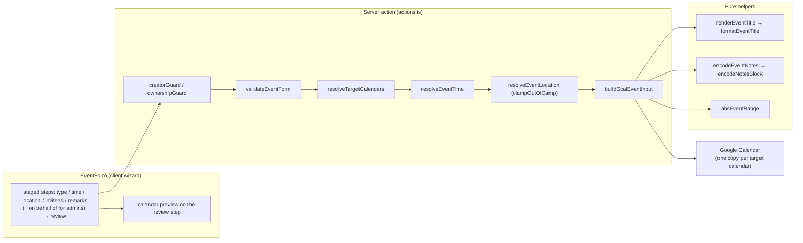
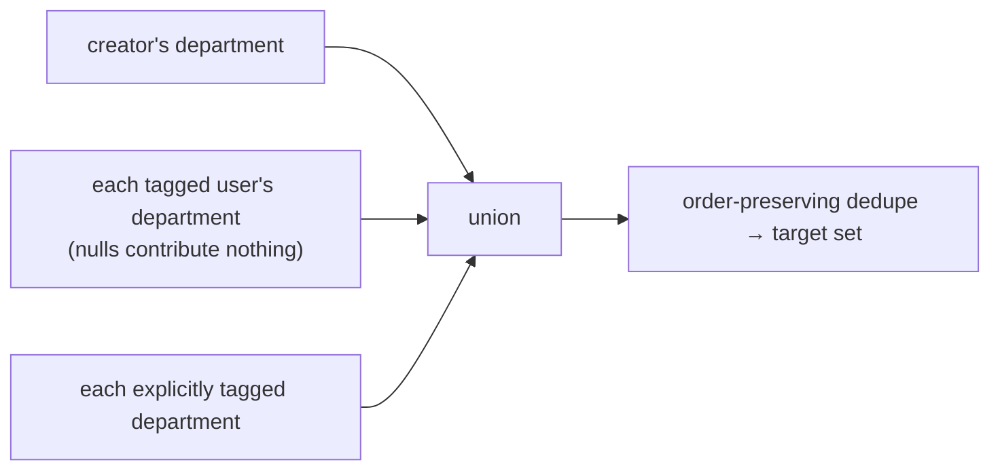
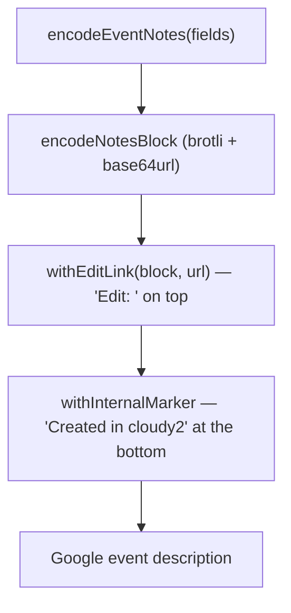

# 1. Event lifecycle: form to Google Calendar

An event is created and edited through the dashboard's staged form, but it **lives in
Google Calendar** — one copy per involved department calendar. This document describes
how form data becomes a Google event: the staged wizard, the access guards and
validation, target-calendar derivation, the machine-readable notes block (and its three
stored formats), the title template, the location policy, and the time/datetime
conventions. The write-side mutations (create/update/delete, copy reconciliation) are a
separate concern covered in [`event-mutations.md`](event-mutations.md); the read-side
month cache is covered in [`events-cache.md`](events-cache.md).

## Table of contents

- [1.1 Problem](#11-problem)
- [1.2 Goals & non-goals](#12-goals--non-goals)
- [1.3 Architecture overview](#13-architecture-overview)
- [1.4 The staged wizard](#14-the-staged-wizard)
- [1.5 Guards & validation](#15-guards--validation)
- [1.6 Target derivation](#16-target-derivation)
- [1.7 The notes block](#17-the-notes-block)
- [1.8 Title rendering](#18-title-rendering)
- [1.9 Location policy](#19-location-policy)
- [1.10 Time options & datetime math](#110-time-options--datetime-math)
- [1.11 Pure helpers & testing](#111-pure-helpers--testing)
- [1.12 File index & related docs](#112-file-index--related-docs)

## 1.1 Problem

The app's domain object is an event, but the storage is Google Calendar — a system the
app does not own and that other people also edit. That creates four sub-problems this
pipeline solves:

- **Round-tripping**: the form must prefill from the event on edit with the *original*
  data — the raw typed description, not the templated calendar title; the AM/PM
  indicators; the invitees; the out-of-camp flag. Google only stores `summary`,
  `description`, `location`, and dates, so the app's extra state has to be encoded
  somewhere: the notes block (§1.7).
- **Identity**: one logical event spans several department calendars. Copies must be
  findable and deduplicated, including legacy events that predate the grouping (§1.7.4).
- **Rendering**: the calendar title is rendered from an admin template with people/type/
  location tokens, plus a shared (AM)/(PM) marker — identically on the server write path
  and in the audit log, with a live preview in the form (§1.8).
- **Constraints**: admins restrict each event type's time options and location policy;
  the form and the server must enforce the same rules so a stale form can never submit
  an out-of-policy combination (§1.9, §1.10).

## 1.2 Goals & non-goals

**Goals**

- Editing an in-app event prefills the original form state exactly (raw description,
  time option, indicators, invitees, location) — the rendered title is never re-typed.
- One logical event = N identical department copies sharing a group id; every copy
  carries the same notes block.
- The title written to Google equals the title recorded in the audit snapshot, by
  construction (one shared pure helper, §1.8).
- Location-policy and time-option constraints are enforced client- and server-side by
  the same pure helpers.
- External events (created directly in Google Calendar) are readable, flagged, and
  editable by admins without breaking the app's own state.

**Non-goals**

- Google Calendar remains the single source of truth; the app keeps no event table.
- No recurring events, reminders, or attendees: `GcalEventInput.attendees` exists in the
  contract but the app does not set it — visibility is expressed through calendar ACLs
  ([`roster-sharing.md`](roster-sharing.md)), not per-event attendees.
- No client-side title rendering is authoritative: the form's preview is a convenience
  (§1.8.3).

## 1.3 Architecture overview

Read-back goes the other way: `mapCalendarItem` (`src/lib/events/queries.ts:127`) runs
the pure notes parsers over each `GcalEventItem` and produces a `CalendarEvent` with a
`CalendarEventPayload` (`queries.ts:26`) that the views and the edit form consume.

## 1.4 The staged wizard

The form is `EventForm` (`src/app/(protected)/dashboard/EventForm.tsx`), rendered in a
floating `size="sm"` modal from `DashboardView.tsx:1509` and minimizable into a floating
bubble that keeps its draft. It is a **staged walk** — one input group visible at a
time, built by role via `buildSteps` (`EventForm.tsx:118-125`): regular users get six
steps, admins seven ("On behalf of" sits between Remarks and Review):

| # | Step       | Who         | Gate before advancing                                           |
| - | ---------- | ----------- | --------------------------------------------------------------- |
| 1 | `type`     | all         | custom: a type must be selected (`EventForm.tsx:308-313`)       |
| 2 | `time`     | all         | `start`, `end`, `startAmPm`, `endAmPm` validate cleanly         |
| 3 | `location` | all         | none (policy clamping is live, §1.9)                            |
| 4 | `invitees` | all         | none                                                            |
| 5 | `remarks`  | all         | none                                                            |
| 6 | `creator`  | admins only | none — optional; blank means the acting user (§1.5.2)           |
| 7 | `review`   | all         | submit only (last step) — read-only summary of everything entered |

Mechanics worth knowing:

- **No progress indicator**: there are no step dots or "N of M" caption; the **Back**
  button (`EventForm.tsx:838-849`) is the only backward navigation.
- **Enter never submits**: `handleFormKeyDown` (`EventForm.tsx:296-303`) cancels the
  browser's implicit form submission for `INPUT`/`SELECT` targets, so only the explicit
  Create/Save button (review step) commits — the Remarks `Textarea` keeps natural newline
  behavior. `onSubmit` re-guards with `if (!isLastStep) return` (`EventForm.tsx:447`),
  and the Next/submit buttons use distinct React keys so a step-advance click can never
  activate a leftover `type="submit"` node (`EventForm.tsx:852, 862`).
- **Server error → step**: a failed submit maps the server's `field` back onto the owning
  step via `STEP_BY_FIELD` (`EventForm.tsx:127-134`, including `creatorId` → `creator`)
  and lands the user there (`EventForm.tsx:477`).
- **Admin "On behalf of"** (`EventForm.tsx:701-722`): its own step after Remarks rather
  than a select pinned above every step; **optional** — a blank select means the acting
  admin themselves (the server defaults it via `withSelfCreator`, §1.5.2). Picking a user
  sets `creatorId` and keeps the invitee chips in sync (the creator is always an invitee).
  Regular users have their own id locked in as `creatorId`.

### 1.4.1 Step details

- **Type** (`EventForm.tsx:578-608`): alphabetically sorted toggleable `Badge` chips
  (no searchable select — the list is short). Selecting a type re-resolves the time
  option against the type's allowed set and re-clamps Out of Camp + location against the
  type's location policy (`handleEventTypeChange`, `EventForm.tsx:339-360`).
- **Timestamp** (`EventForm.tsx:610-630`): when the type allows more than one option the
  step shows a `Tabs` control ("Start & End" / "Full Day"); otherwise the single option's
  fields render directly. `range` = two `DateTimePicker`s (naive
  `YYYY-MM-DD HH:mm:ss` strings); `full` = two `DatePickerInput`s plus an AM/PM
  `SegmentedControl` per side. `switchTimeOption` (`EventForm.tsx:320-337`) zeroes the
  time part to `00:00:00` when entering `full` and defaults the indicators to AM→PM so a
  plain full-day span renders with no title suffix.
- **Location** (`EventForm.tsx:632-656`): the "Out of Camp" checkbox is disabled unless
  the type's policy is `both`; unchecking it clears the location; the location input is
  disabled when in-camp or the policy is `in`. The effective flag/location is always the
  `clampOutOfCamp` pair (`EventForm.tsx:269-273`), never the raw form value.
- **Invitees** (`EventForm.tsx:658-679`): a `NoKeyboardMultiSelect` with two groups —
  Departments (`dept:<id>` values) and People (`user:<id>` values). The creator's chip is
  **locked** and re-added on every change (`lockedUserValue`, `EventForm.tsx:173,
  669`) so it can never be deselected. The value prefixes are split into
  `inviteeUserIds` / `inviteeDepartments` on submit (`splitInvitees`,
  `EventForm.tsx:137-148`).
- **Remarks** (`EventForm.tsx:681-697`): an autosize `Textarea` bound to the form's
  `title` field — the **raw description**. It is optional; the calendar title comes from
  the template (§1.8).
- **On behalf of** (`EventForm.tsx:703-727`, admins only): the searchable user select,
  entered as the last input before review (see §1.4). Optional — blank = acting user.
- **Review** (`EventForm.tsx:739-848`): the read-only final page. It folds in the
  calendar preview Paper plus When / Location (In/Out-of-Camp badge + destination) /
  Event Type / On-behalf-of / People / Departments / Remarks rows, all resolved from the
  same effective state the submit payload uses (`reviewPeople`, `reviewDepartments`,
  `creatorName`, `whenText`, `EventForm.tsx:425-456`; `reviewPeople` derives from the
  effective invitee list, so the People row includes the acting admin when "On behalf
  of" is blank) so what is reviewed is exactly what gets saved. There are no per-section
  edit links — fixing a mistake means walking Back through the intermediate steps.

### 1.4.2 Edit prefill (`?edit=` deep link)

Google Calendar events created by the app carry an `Edit: <url>` line in their notes
(§1.7.3) deep-linking back to `/dashboard?date=<event day>&edit=<group id>`.

- **Server** (`src/app/(protected)/dashboard/page.tsx:42-43`): `initialEditEventId` is
  accepted only when `?edit=` is a valid UUID; the `date` in the same link pins the
  fetched month so the event is in view. For an `edit` render (like `_fresh`) the
  remembered-UI-state cookie is **skipped entirely** — the link is explicit intent
  (`page.tsx:51-53`; see [`ui-state.md`](ui-state.md)).
- **Client** (`DashboardView.tsx`): the event is resolved **synchronously at mount** by
  matching the notes group id in the already-fetched month events
  (`DashboardView.tsx:279-284`) and the form opens on first paint with no follow-up
  render (`:292-296`). A valid id that matches nothing (filters/date exclude it) shows a
  dismissible "not in your current view" alert (`:323-325`, `:1140-1150`). The one-shot
  `edit` param is stripped after its render by a ref-guarded plain `router.push`
  (`:621-631`).
- **Form prefill** (`buildInitialValues`, `EventForm.tsx:175-228`):
  - `title` = the notes' raw description (`payload.rawTitle`) — never the rendered
    calendar title; a deliberately blank description round-trips as `""` (legacy events
    without the field fall back to the summary, with `"(no title)"` normalized to `""`,
    `EventForm.tsx:191`).
  - time option resolved against the stored type's allowed set
    (`resolveTimeOption`, `EventForm.tsx:168`); legacy full-day events without
    indicators default to AM→PM (`:183-184`).
  - Google's **exclusive** all-day end is converted back to the form's **inclusive**
    end: `end = subOneDay(event.end) 00:00:00` (`EventForm.tsx:186`, §1.10.2).
  - Out of Camp + location re-clamped against the type's *current* policy, in case it
    tightened since the event was last edited (`:169-175`).
  - Invitees re-prefixed as `dept:`/`user:` values; `creatorId` from the payload.
- **New events** (`EventForm.tsx:199-215`): start `09:00:00` / end `10:00:00` on
  `defaultDate`, `range`, `creatorId` = own id for regular users (locked) / `""` for
  admins, and the own `user:<id>` chip pre-added for non-admins.

## 1.5 Guards & validation

Two layers, both pure and unit-tested.

### 1.5.1 Access guards (`src/lib/events/guards.ts`)

| Guard | Rule | Error |
| ----- | ---- | ----- |
| `creatorGuard(session, pendingCreatorId, originalCreatorId)` (`guards.ts:17`) | Admins pass. A non-admin may use an empty/self creator, or (on edit) *keep* the event's existing creator — never introduce a different one. | "You can only create or edit events for yourself" |
| `ownershipGuard(session, creatorId)` (`guards.ts:39`) | Admins pass. A non-admin may only edit/delete events whose recorded creator is themselves; creator-less (legacy/external) events are admin-only. | "You can only edit or delete your own events" |

Server application: `createEvent` runs `creatorGuard(..., null)`; `updateEvent` runs
`ownershipGuard` then `creatorGuard(..., ref.creatorId)`; `deleteEvent` runs
`ownershipGuard` (`actions.ts:349, 464-472, 627`). The client mirrors this in the event
detail modal — Edit/Delete buttons render only for admins or the creator.

### 1.5.2 Field validation (`src/lib/events/validate.ts`)

`validateEventForm(values)` (`validate.ts:79`) checks, in order:

1. `full` events: both `startAmPm` and `endAmPm` required → "Select AM or PM".
2. `start` / `end` required.
3. **Cross-field chronology** via `sortKey` (`validate.ts:51-58`): for `full` events the
   half-of-day indicator is folded into the sort key (`YYYY-MM-DD AM` < `YYYY-MM-DD PM`,
   since the time part is always `00:00:00`), so same-day AM→PM is valid and PM→AM is not;
   for `range` the full naive strings compare. Violation → "End must be on or after
   start".

Deliberately **not** validated: `title` (may be blank — the template produces the
title), `eventType` (the wizard's custom gate covers it), invitee arrays, `outOfCamp`,
and `location` (policy clamping covers it, §1.9).

Creator normalization happens before the guards and this validation: `withSelfCreator`
(`validate.ts:75`) defaults a blank/whitespace `creatorId` to the **session user** — "on
behalf of" is optional, and a cleared select uniformly means the acting admin — then
dedupes the creator into the invitee list via `withCreatorInvited` (`validate.ts:60`).
Both actions apply it right after `requireSession()` (`actions.ts`, create & update), so
targets (§1.6), the notes' `createdBy`, ownership, and the audit snapshot all see the
effective creator even when the form submitted none.

## 1.6 Target derivation

A logical event lives in **one copy per involved department calendar**.
`deriveTargetCalendarIds` (`src/lib/events/targets.ts:33`) computes that set purely:

The I/O wrapper `resolveTargetCalendars` (`actions.ts:111-131`) batch-resolves the
creator's and invitees' departments (`getUserDepartmentIds`, `queries.ts:106`) and calls
the pure helper; when nothing derives (no department, no tags) it falls back to a single
calendar on update (`ref.calendarId`) or fails with "Assign yourself to a department or
tag an invitee" on create (`actions.ts:364-370`).

Related pure helpers in `targets.ts`:

- `EventRef` (`targets.ts:13`) — the reference to one (representative) copy passed to
  update/delete: registry `calendarId`, Google `googleEventId`, group `eventId` (null for
  legacy), naive start/end, `allDay`, creator + invitee ids.
- `eventRefFromCalendarEvent(event)` (`targets.ts:94`) — builds it from a schedule-ready
  `CalendarEvent` (used by the form on submit).
- `diffEventTargets(old, new)` (`targets.ts:57`) — splits into `create`/`keep`/`remove`;
   the update action inlines the equivalent union/set logic
   ([`event-mutations.md` §1.5](event-mutations.md#15-updateevent--reconciling-copies)).
- `dedupeEventsByGroupId(events)` (`targets.ts:75`) — display dedup: the first event
  seen per non-null group id wins, legacy (null-id) events always pass. Input order
  defines the representative, so callers feed it deterministically (the dashboard reads
  calendars in name order).

## 1.7 The notes block

The machine-readable state lives in the Google event **description**; the visible
**title (summary)** carries the rendered template.

### 1.7.1 Fields (`EventNotes`, `src/lib/events/notes.ts:19`)

| Field | Stored when | Notes |
| ----- | ----------- | ----- |
| `eventType` | set | The type's name |
| `title` | always (even `""`) | The raw pre-template description; a blank value round-trips to distinguish "no text typed" from legacy |
| `eventId` | always (app events) | The logical group id shared by all department copies |
| `createdBy` | set | Creator user id (schedule view: the event's row always shows it) |
| `inviteeUsers` | non-empty | Tagged user ids (the event shows in each user's row) |
| `inviteeDepartments` | non-empty | Tagged department ids (shows in each department row) |
| `timeOption` | set | `"range"` \| `"full"` |
| `startAmPm` / `endAmPm` | `full` only | Half-of-day indicators |
| `outOfCamp` | **only when `true`** | Absence (legacy) or `false` means in camp; the destination itself goes to Google's `location` field, not the notes |

`encodeEventNotes` (`notes.ts:53`) drops `undefined`/`null`/empty-array values and keeps
a blank value **only for `title`**; it returns `""` when nothing survives. The block is a
JSON object (not a fixed schema), so fields can be added later without a format
migration.

### 1.7.2 The three stored formats

| Version | Description layout | When written |
| ------- | ------------------ | ------------ |
| **v3** (current) | `Edit: <url>` line, blank line, one **base64url(brotli(JSON))** block line, blank line, `Created in cloudy2` | every create/edit since Phase 2v |
| **v2** | `Edit: <url>` line, blank line, one **raw JSON** line | intermediate era |
| **v1** | the description **is** the JSON object alone | earliest era |

`encodeNotesBlock(json)` (`notes.ts:131`) brotli-compresses and base64url-encodes
(no padding) — one short, **opaque**, deterministic line. Decoding
(`inflateNotesBlock`, `notes.ts:141`) tries brotli first (the current writer) then gzip
as a codec fallback.

`parseEventNotes(description)` (`notes.ts:166`) is the single reader for all three
formats: if the whole string parses as a JSON object it is v1; otherwise the lines are
scanned **bottom-up**, and the first line that is either raw JSON (v2, starts with `{`)
or an inflatable block (v3) wins. Any failure (bad base64, bad JSON, non-object) returns
`null` — the parser is total and never throws on untrusted descriptions.

### 1.7.3 Description assembly & markers

The write path assembles the description in `buildGcalEventInput`
(`actions.ts:264-281`):

- `withEditLink(block, url)` (`notes.ts:198`): `Edit: <url>` above the block; Google
  Calendar linkifies plain URLs in notes. The URL is `eventEditUrl(baseUrl, start,
  eventId)` (`notes.ts:245`) → `/dashboard?date=<first day>&edit=<group id>`; the app
  origin comes from the request headers (`appBaseUrl`, `src/lib/appUrl.ts:9`), so the
  link is rebuilt on every create/edit and always points at the deployed app.
- `withInternalMarker` (`notes.ts:223`) appends `INTERNAL_EVENT_MARKER` =
  `"Created in cloudy2"` (`notes.ts:211`) one blank line below, never duplicated.
- `isExternalEvent(description)` (`notes.ts:236`): external = **no marker AND no
  parseable notes block**. Older in-app events predate the marker but still carry a
  block, so they stay internal. External events get an "External" badge in the detail
  view and are admin-only to edit (§1.5.1).

### 1.7.4 Field parsers

All pure, all total (never throw, tolerate malformed values):

| Parser (`notes.ts`) | Returns |
| ------------------- | ------- |
| `parseEventPeople` (`:99`) | `{ eventId, creatorId, userIds, departmentIds }` — the identity used by copy reconciliation and the user filter |
| `parseEventType` (`:256`) | type name or null |
| `parseEventTitle` (`:267`) | raw description: `""` for a deliberately blank one, `null` for legacy (field absent) |
| `parseEventTimeOption` (`:274`) | `"range"` \| `"full"` \| null |
| `parseEventStartAmPm` / `parseEventEndAmPm` (`:281` / `:288`) | `"AM"` \| `"PM"` \| null |
| `parseEventOutOfCamp` (`:295`) | `true` only when the flag is exactly `true` |

`mapCalendarItem` (`queries.ts:127`) wires these into the `CalendarEventPayload`
(`queries.ts:26`), and the edit form reads them back (§1.4.2) — that is the full
round-trip: raw text typed in Remarks is stored in notes `title` and prefilled on edit,
so editing never re-types the templated calendar title.

## 1.8 Title rendering

### 1.8.1 `formatEventTitle` — the token engine (`src/lib/settings/formatEventTitle.ts:46`)

Substitutes `{...}` tokens in the admin template (`settings.event_title_template`,
default `"{description}"`) case-insensitively:

| Token | Renders |
| ----- | ------- |
| `{description}` | the raw typed text |
| `{type}` | the type's name (null type → `""`) |
| `{type:acronym}` | the type's shortname, falling back to the name when blank |
| `{people}` (bare) | **FQN style** — fully qualified names via the display-name template |
| `{people:full}` | plain names |
| `{people:acronym}` | user shortnames, falling back to names |
| `{people:fqn}` | `formatFullName` rendering (`{name}`/`{department}`) |
| `{departments}` | department names joined with `", "` |
| `{location}` | the out-of-camp destination; `""` for in-camp events |

List tokens join with `", "`; empty lists/absent values resolve to `""` (no
gap-collapsing); **unknown tokens and unknown styles are left as literal text**; the
result is trimmed. People arrive pre-resolved as `EventTitlePerson { full, acronym, fqn
}` (`formatEventTitle.ts:8`) and the type as `EventTitleType { name, acronym }`
(`:17`), so the formatter is pure string substitution. The FQN style uses
`formatFullName` (`src/lib/settings/formatName.ts:20`), which substitutes
`{name}`/`{department}` in `settings.name_template` the same way.

### 1.8.2 `renderEventTitle` — the single source of truth (`src/lib/events/eventTitle.ts:40`)

1. trims the raw description;
2. renders the template via `formatEventTitle`;
3. **falls back to the raw (trimmed) description when the template renders nothing** —
   an empty result yields an intentionally untitled event;
4. appends ` (AM)` / ` (PM)` **only** when `timeOption === "full"`, the base title is
   non-empty, and `amPmSuffix(startAmPm, endAmPm)` (`timeOptions.ts:74`) is non-empty —
   i.e. only when start and end **share** the same indicator. AM→PM and PM→PM spans get
   no suffix, and an empty title gets no bare "(AM)".

There are deliberately **no AM/PM tokens in the template** — the time marker is appended
solely by this wrapper. This function is the single source of truth for both the title
written to Google (`buildGcalEventInput`, `actions.ts:250`) and the `title` field of
audit snapshots (`actions.ts:405, 574`), so the two can never diverge.

### 1.8.3 The form's live preview

`EventForm` shows a "Calendar preview" Paper with the exact title the server will write,
recomputed from form values (`EventForm.tsx:397-421`). The Paper lives **on the review
step only** (`EventForm.tsx:741-749`) — earlier steps render no preview card. The
preview derives its people from the **effective** invitee list (`effectiveInvitees`,
`EventForm.tsx:385-393`): the creator — picked user, or the acting admin when "On
behalf of" is blank — is prepended first, mirroring the server's `withSelfCreator` +
`withCreatorInvited` ordering exactly, so `{people}` / `{people:acronym}` tokens render
identically to what gets written (the review step's People row uses the same list).
Note: the preview **re-implements** the fallback + AM/PM suffix rules inline rather than
importing the pure `renderEventTitle` — kept in sync by convention, a drift risk to be
aware of when changing the title rules.

### 1.8.4 Context resolution (I/O)

`buildEventTitleContext` (`actions.ts:166-209`) resolves everything the tokens need in
one `Promise.all`: the settings (both templates), the invitee users (`getUsersByIds`),
the department names, and the event-type row (shortname, `timeOptions`,
`locationPolicy`). Unknown ids are dropped; a blank type shortname falls back to the
name.

## 1.9 Location policy

Per event type, an admin restricts where events may take place
(`event_types.location_policy`; `src/lib/events/locationPolicy.ts`). Location is the
**out-of-camp destination** — in-camp events record no location at all.

| Policy | Label | `clampOutOfCamp` effect (`locationPolicy.ts:58`) | UI |
| ------ | ----- | ------------------------------------------------ | -- |
| `in` | In camp only | `{ outOfCamp: false, location: "" }` — flag forced off, location cleared | checkbox disabled, input disabled |
| `out` | Out of camp only | `{ outOfCamp: true, location }` — flag forced on, destination kept | checkbox disabled (on), input enabled |
| `both` (default) | Both | `{ outOfCamp, location: outOfCamp ? location : "" }` — location recorded only while out of camp | checkbox free |

`clampOutOfCamp` is the **single source of truth applied client- and server-side**: the
form derives the effective pair live (`EventForm.tsx:257-261`) and re-clamps on type
change; the write path re-applies it in `resolveEventLocation`
(`actions.ts:233-241`) after `resolveEventTime`, in both create and update — so a stale
form state can never submit an out-of-policy combination. `normalizeLocationPolicy`
(`locationPolicy.ts:43`) maps unknown/missing values to `"both"`. The `outOfCamp` flag
is persisted in the notes (only when true); the destination goes to Google's
first-class `location` field (`actions.ts:290`), which `buildEventBody` always sends
(even empty) so an in-app update actively clears a previously set location.

## 1.10 Time options & datetime math

### 1.10.1 Time options (`src/lib/events/timeOptions.ts`)

Per event type, `time_options` enables one or more of:

| Option | Label | Form fields | Notes |
| ------ | ----- | ----------- | ----- |
| `range` | Start & End | two datetime pickers | always timed |
| `full` | Full Day | two date pickers + AM/PM per side | optional (AM)/(PM) marker in the title |

- `normalizeTimeOptions` (`timeOptions.ts:34`) dedupes and drops unknown values (e.g. a
  legacy `"ampm"`).
- `resolveTimeOptions` (`:53`): empty/unrecorded types fall back to `["range"]`.
- `resolveTimeOption(allowed, selected)` (`:62`): unknown/empty selection → first
  allowed; a selection the type no longer allows → first allowed. The server applies it
  in `resolveEventTime` (`actions.ts:216`), which also defaults `full`-event indicators
  to AM→PM when unset.
- `amPmSuffix(startAmPm, endAmPm)` (`:74`): the shared marker, or `""`.

### 1.10.2 Datetime conventions (`src/lib/events/datetime.ts`)

All wall-clock times are interpreted in a **fixed UTC+8** (`Asia/Singapore`, no DST), so
conversions are deterministic and unit-testable. Naive values are `YYYY-MM-DD HH:mm:ss`
strings; date-only values are `YYYY-MM-DD`.

- `parseNaiveToInstant` / `formatInstantToNaive` (`datetime.ts:17` / `:27`) convert
  naive ↔ UTC instant via the fixed 8-hour offset.
- **`absEventRange(naiveStart, naiveEnd, allDay)`** (`datetime.ts:121`) — the instants
  the event occupies on Google:
  - timed: both sides parsed as UTC+8 wall clock;
  - all-day: `start = dateToUtc(startDate)`, **`end = dateToUtc(addOneDay(endDate))`** —
    Google's **exclusive all-day end date** convention (the day after the last day).

The form stores `full`-day ends *inclusively*; `buildGcalEventInput` expands via
`absEventRange` (`actions.ts:284`), and reads convert back (`EventForm.tsx:186`; the
detail view displays the inclusive day via `subOneDay`).

Also in `datetime.ts` (used across views and the cache): `monthRange` (`:58`),
`weekDays` (Monday-first, `:71`), `shiftMonth` (`:80`), `monthGridRows` (`:91`), and
`monthsInRange` (`:99`) — every `YYYY-MM` a naive range touches, with a guard that a
malformed (reversed) range still yields the start month.

## 1.11 Pure helpers & testing

Every decision-making part of the pipeline is a pure, I/O-free function unit-tested by
Vitest without a DB or Google credentials; the I/O glue (DB lookups, the Google
writes, headers) is thin and lives in `actions.ts` / `queries.ts`.

| Helper | Module | Tests |
| ------ | ------ | ----- |
| `encodeEventNotes`, `parseEventNotes` (v1/v2/v3 + gzip fallback), `encodeNotesBlock`, `withEditLink`, `withInternalMarker`, `isExternalEvent`, `eventEditUrl`, all field parsers | `events/notes.ts` | `notes.test.ts` |
| `renderEventTitle` | `events/eventTitle.ts` | `eventAudit.test.ts:270` |
| `formatEventTitle` (every token/style, unknown pass-through) | `settings/formatEventTitle.ts` | `formatEventTitle.test.ts` |
| `formatFullName` | `settings/formatName.ts` | `formatName.test.ts` |
| `clampOutOfCamp` (all policies), `normalizeLocationPolicy` | `events/locationPolicy.ts` | `locationPolicy.test.ts` |
| `resolveTimeOption(s)`, `normalizeTimeOptions`, `amPmSuffix` | `events/timeOptions.ts` | `timeOptions.test.ts` |
| `absEventRange` (timed + all-day exclusive end), naive↔instant, `weekDays`, `monthsInRange`, `shiftMonth`, `monthRange`, `monthGridRows` | `events/datetime.ts` | `datetime.test.ts` |
| `creatorGuard`, `ownershipGuard` | `events/guards.ts` | `guards.test.ts` |
| `validateEventForm` (incl. full-day chronology), `withSelfCreator` / `withCreatorInvited` | `events/validate.ts` | `validate.test.ts` |
| `deriveTargetCalendarIds`, `diffEventTargets`, `dedupeEventsByGroupId`, `eventRefFromCalendarEvent` | `events/targets.ts` | `targets.test.ts` |

I/O-bound (not unit-tested, per the repo convention): `actions.ts` (the server
actions), `queries.ts` (DB + cache reads, `mapCalendarItem`), `appUrl.ts`
(`next/headers`), and the form/UI components.

## 1.12 File index & related docs

| File | Role |
| ---- | ---- |
| `src/app/(protected)/dashboard/EventForm.tsx` | The staged wizard (steps, prefill, preview, submit) |
| `src/app/(protected)/dashboard/page.tsx` | `?edit=` / `_fresh` / `?refresh=` param resolution |
| `src/app/(protected)/dashboard/DashboardView.tsx` | Edit deep-link resolution + one-shot param strips |
| `src/lib/events/actions.ts` | Write path: guards → validate → targets → normalize → Google → audit → cache invalidation |
| `src/lib/events/notes.ts` | Notes block codec + markers (pure) |
| `src/lib/events/eventTitle.ts` | `renderEventTitle` (pure) |
| `src/lib/settings/formatEventTitle.ts` | Template token engine (pure) |
| `src/lib/settings/formatName.ts` | Display-name template (pure) |
| `src/lib/events/locationPolicy.ts` | Location policy clamping (pure) |
| `src/lib/events/timeOptions.ts` | Time options + AM/PM marker (pure) |
| `src/lib/events/datetime.ts` | UTC+8 datetime math (pure) |
| `src/lib/events/guards.ts` | Creator/ownership guards (pure) |
| `src/lib/events/validate.ts` | Form validation + creator normalization (pure) |
| `src/lib/events/targets.ts` | Target set, dedup, `EventRef` (pure) |
| `src/lib/events/queries.ts` | `mapCalendarItem` — read-back into `CalendarEvent` |
| `src/lib/appUrl.ts` | App origin for the `Edit:` link |

Related docs:

- [`event-mutations.md`](event-mutations.md) — create/update/delete, cross-department
  copy reconciliation, rollback, audit integration.
- [`events-cache.md`](events-cache.md) — the read-side month cache these events flow
  through.
- [`audit-log.md`](audit-log.md) — where the event audit snapshots from §1.8.2 render.
- [`roster-sharing.md`](roster-sharing.md) — who can see which department calendar.
- [`README.md`](../README.md#112-documentation) — documentation index.
- `progress.md` — phase write-ups: 1.16 (events), 1.20 (copies), 1.23/1.24 (title
  template), 1.27 (time options), 1.31 (edit link), 1.32 (opaque notes), 1.40
  (external events), 1.46 (location policy), 1.47 (staged wizard).
