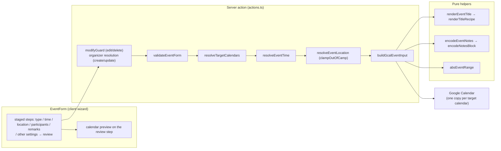
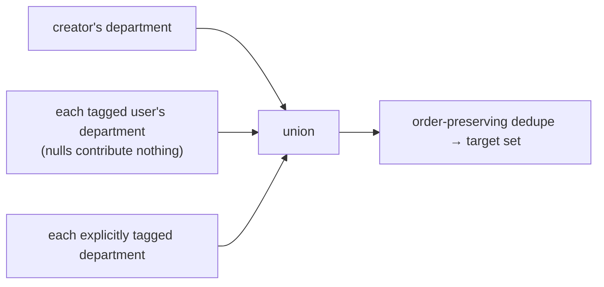
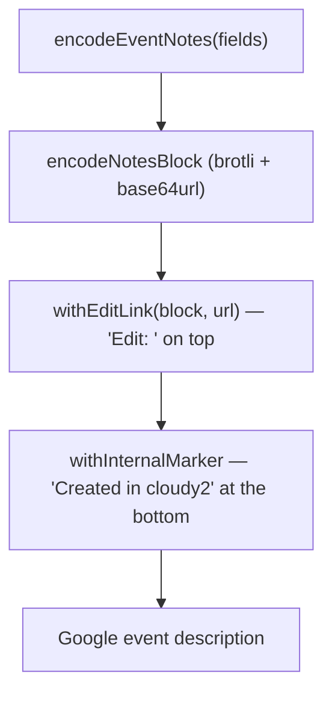
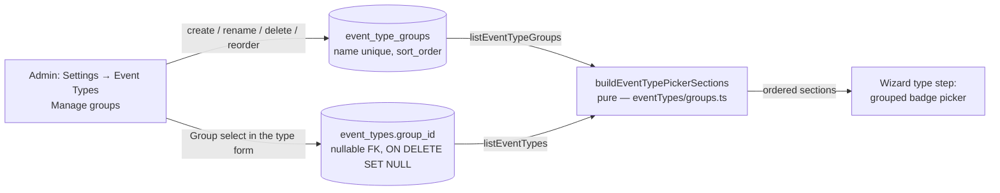

# 1. Event lifecycle: form to Google Calendar

An event is created and edited through the dashboard's staged form, but it **lives in
Google Calendar** — one copy per involved department calendar. This document describes
how form data becomes a Google event: the staged wizard, the access guards and
validation, target-calendar derivation, the machine-readable notes block (and its three
stored formats), the title template, the location categories, and the time/datetime
conventions. The write-side mutations (create/update/delete, copy reconciliation) are a
separate concern covered in [`event-mutations.md`](event-mutations.md); the read-side
month cache is covered in [`events-cache.md`](events-cache.md).

## Table of contents

- [1.1 Problem](#11-problem)
- [1.2 Goals & non-goals](#12-goals--non-goals)
- [1.3 Architecture overview](#13-architecture-overview)
- [1.4 The staged wizard](#14-the-staged-wizard)
- [1.5 Guards & validation](#15-guards--validation)
- [1.6 Target derivation](#16-target-derivation)
- [1.7 The notes block](#17-the-notes-block)
- [1.8 Title rendering](#18-title-rendering)
- [1.9 Location categories](#19-location-categories)
  - [1.9.1 Per-type field visibility](#191-per-type-field-visibility)
  - [1.9.2 Hiding the Location step](#192-hiding-the-location-step)
- [1.10 Event type groups](#110-event-type-groups)
- [1.11 Time options & datetime math](#111-time-options--datetime-math)
- [1.12 Pure helpers & testing](#112-pure-helpers--testing)
- [1.13 File index & related docs](#113-file-index--related-docs)

## 1.1 Problem

The app's domain object is an event, but the storage is Google Calendar — a system the
app does not own and that other people also edit. That creates four sub-problems this
pipeline solves:

- **Round-tripping**: the form must prefill from the event on edit with the *original*
  data — the raw typed description, not the templated calendar title; the AM/PM
  indicators; the invitees; the out-of-camp flag. Google only stores `summary`,
  `description`, `location`, and dates, so the app's extra state has to be encoded
  somewhere: the notes block (§1.7).
- **Identity**: one logical event spans several department calendars. Copies must be
  findable and deduplicated, including legacy events that predate the grouping (§1.7.4).
- **Rendering**: the calendar title is rendered from an admin template with people/type/
  location tokens, plus a shared (AM)/(PM) marker — identically on the server write path
  and in the audit log, with a live preview in the form (§1.8).
- **Constraints**: admins restrict each event type's time options, allowed location
  categories, and remarks field;
  the form and the server must enforce the same rules so a stale form can never submit
 an out-of-policy combination (§1.9, §1.11).

## 1.2 Goals & non-goals

**Goals**

- Editing an in-app event prefills the original form state exactly (raw description,
  time option, indicators, invitees, location) — the rendered title is never re-typed.
- One logical event = N identical department copies sharing a group id; every copy
  carries the same notes block.
- The title written to Google equals the title recorded in the audit snapshot, by
  construction (one shared pure helper, §1.8).
- Location-policy and time-option constraints are enforced client- and server-side by
  the same pure helpers.
- External events (created directly in Google Calendar) are readable, flagged, and
  editable by admins without breaking the app's own state.

**Non-goals**

- Google Calendar remains the single source of truth; the app keeps no event table.
- No recurring events, reminders, or attendees: `GcalEventInput.attendees` exists in the
  contract but the app does not set it — visibility is expressed through calendar ACLs
  ([`roster-sharing.md`](roster-sharing.md)), not per-event attendees.
- No client-side title rendering is authoritative: the form's preview is a convenience
  (§1.8.3).

## 1.3 Architecture overview

```mermaid
flowchart LR
 subgraph FORM["EventForm (client wizard)"]
 W["staged steps: type / time / location / participants / remarks<br/>/ other settings → review"]
 P["calendar preview on the review step"]
 end
 subgraph GUARD["Server action (actions.ts)"]
 G["modifyGuard (edit/delete)<br/>organizer resolution (create/update)"]
 V["validateEventForm"]
 T["resolveTargetCalendars"]
 RT["resolveEventTime"]
 RL["resolveEventLocation (clampOutOfCamp)"]
 B["buildGcalEventInput"]
 end
 subgraph PURE["Pure helpers"]
 TE["renderEventTitle → renderTitleRecipe"]
 NB["encodeEventNotes → encodeNotesBlock"]
 AR["absEventRange"]
 end
 Gcal["Google Calendar<br/>(one copy per target calendar)"]

 W --> P
 W --> G --> V --> T --> RT --> RL --> B
 B --> TE
 B --> NB
 B --> AR
 B --> Gcal
```

Read-back goes the other way: `mapCalendarItem` (`src/lib/events/queries.ts`) runs
the pure notes parsers over each `GcalEventItem` and produces a `CalendarEvent` with a
`CalendarEventPayload` (`queries.ts`) that the views and the edit form consume.

## 1.4 The staged wizard

The form is `EventForm` (`src/app/(protected)/dashboard/EventForm.tsx`), rendered in a
centered modal from `DashboardView.tsx` whose size scales with the viewport (the width
tiers are in the sizing bullet below) and minimizable into a floating bubble that keeps
its draft. It is a **staged walk** — one input group visible at a time, built via
`buildSteps` (`EventForm.tsx`); every role walks the same steps
(no admin-only extras — there is no "On behalf of" creator step):

| # | Step | Who | Gate before advancing |
| - | --------------- | --- | ----------------------------------------------------------------- |
| 1 | `type` | all | custom: a type must be selected |
| 2 | `time` | all | `start`, `end`, `startAmPm`, `endAmPm` validate cleanly |
| 3 | `location` | all | none (policy clamping is live, §1.9) |
| 4 | `invitees` (Participants) | all | none |
| 5 | `remarks` | all | none |
| 6 | `settings` (Other settings) | all | none — the "Pin this event" + organizer-only edit-lock switches |
| 7 | `review` | all | submit only (last step) — read-only summary of everything entered |

The `invitees`, `remarks`, and `location` steps drop out per the selected type's config
(§1.9.1): `show_location` off removes the Location step entirely — otherwise it always
stays, and an exclusively in-camp type just collapses its category selector to one disabled
segment while still recording an optional specific place. The `settings` step is always
present (so even invitees-hidden types can be pinned and locked); an untyped event walks
the full set of them.

Mechanics worth knowing:

- **Bottom step strip + fixed-height body**: the wizard body is a fixed-height flex column
  in `EventForm.tsx` (`WIZARD_BODY_HEIGHT_MOBILE` / `WIZARD_BODY_HEIGHT_DESKTOP` below):
  the active step's content in the middle on an **internal scroll** (`.c2-wizard-scroll`),
  and, pinned at the bottom above the **Back / Next / Create-Save bar**, the step strip —
  a caption naming the current step plus a compact Mantine **Stepper**. Because the body
  height is a pure function of the viewport — never of the active step's content — the
  modal never resizes between steps and the buttons never jump. The sizing is tiered so
  the modal actually uses the space a given screen has:
  - **Width** (`DashboardView.tsx`): `xs` (320px) on ≤360px phones, `sm` (380px) across
 the rest of the phone band, `md` (440px) on the narrow desktop band (640–799px), and
 `lg` (620px) on the wide-desktop band (≥800px). The shrink-out motion feeds on the
 matching width (`formContentWidth`), so it always lands on the originating button.
  - **Centered at every width**: the host modal is `centered` on all screens, so the
 wizard always has **equal top/bottom gutters**. On phones (< 640px) the body
 **fills the modal's box** to take up as much vertical space as possible:
 `DashboardView` sets `yOffset="44px"`, so Mantine centers inside a
 `100dvh - 88px` (2 × 44px gutter) box, and `WIZARD_BODY_HEIGHT_MOBILE` =
 `calc(100dvh - 164px)` fills it — the 88px of gutters plus the modal's own chrome
 (sticky header ~60px + body bottom padding ~16px = 76px). Equal ~44px gutters
 remain, and the "Tap outside to minimize" caption sits in the bottom gutter (it
 stays at the viewport bottom; the header's minimize chevron / X also stay).
 `100dvh` shrinking with the on-screen keyboard just shortens the body.
  - **Desktop height**: the centered modal's body grows with the viewport up to
 `min(68dvh, 720px, calc(100dvh - 200px))` so a tall screen is actually used up to a
 comfortable cap.
  - **Wide review step**: at `lg` width the review's definition rows (When, Location,
 Event Type, Organizer, Participants, Departments, Remarks) reflow into a two-column
 grid beneath the full-width calendar preview and clash check — the extra width reads
 as structure, not a stretched single column.
  The Stepper (`.c2-wizard-steps`) is one non-wrapping row of
  numbered circles joined by connector lines, so it reads unambiguously as a left→right
  step path: passed steps show a check, the current circle is filled, future ones are
  outlined. The **caption** always shows the current step's real name and position
  (`Location` · `Step 3 of 6`); inline per-step labels are deliberately omitted — the
  modal is too narrow for them, and the walk's length shifts when a type hides its
  remarks/invitees step. Clicking any circle calls `goToStep` — a **free jump** (the
  semantics of the old bottom "Go to Summary" link, now gone): nothing in between is
  validated; the final submit still catches problems and returns the user to the owning
  step. A step change resets the body scroll to the top and announces
  `Step N of M: <name>` through the shell's polite live region.
- **Enter never submits**: `handleFormKeyDown` (`EventForm.tsx`) cancels the
  browser's implicit form submission for `INPUT`/`SELECT` targets, so only the explicit
  Create/Save button (review step) commits — the Remarks `Textarea` keeps natural newline
  behavior. `onSubmit` re-guards with `if (!isLastStep) return` (`EventForm.tsx`),
  and the Next/submit buttons use distinct React keys so a step-advance click can never
  activate a leftover `type="submit"` node (`EventForm.tsx`).
- **Server error → step**: a failed submit maps the server's `field` back onto the owning
  step via `STEP_BY_FIELD` (`EventForm.tsx`) and lands the user there.
- **Organizer is always the acting user**: there is no admin "On behalf of" step — every
  event's organizer (`creatorId` → notes `createdBy`) is the session user, fixed at
  creation and never changed by an edit (the server re-derives it from the event itself,
  §1.5.2). Review always shows an **Organizer** row (the stored organizer, or "You" on a
  new/legacy-adopting event).
- **Other settings**: the always-present "settings" step groups the two switches —
  **Pin this event** (sets the notes `pinned` flag, §Pinned Events) and the
  **organizer-only edit lock** — a switch shown only when the acting user is the
  organizer or an admin that sets the notes `ownerOnlyEdits` flag. It reads
  **"Only I can edit this event"** to the organizer (an admin editing someone else's
  event sees **"Only the organizer can edit this event"** — the lock always binds to
  the event's organizer). Attendees/editors who are not the organizer never see the
  lock and cannot change it (§1.5.1).

### 1.4.1 Step details

- **Type** (`EventForm.tsx`): alphabetically sorted toggleable `Badge` chips
  (no searchable select — the list is short). Selecting a type re-resolves the time
  option against the type's allowed set and re-clamps the location category against the
  type's allowed locations (`handleEventTypeChange`, `EventForm.tsx`).
- **Timestamp** (`EventForm.tsx`): when the type allows more than one
  option the step shows a `Tabs` control ("Start & End" / "Full Day" / "Half Day");
  otherwise the single option's fields render directly. `range` = a `DatePickerInput`
  plus a time control per side — date pickers carry no time. Time is set
  keyboard-free: a shared **`TimeChipSelector`** (`src/components/TimeChipSelector.tsx`,
  a horizontally scrollable hour row 00–23 +   a fixed minute row 00/15/30/45 — two taps,
  no dropdown) sits below the 24h `TimePicker` (kept for exact values, tap-to-select
  hour/minute lists with `minutesStep={15}`); the two halves join into the naive
  `YYYY-MM-DD HH:mm:ss` string via `joinDateTimeParts`, a cleared time stores a bare
  date, which `validateEventForm` rejects ("Start time is required" / "End time is
  required"). `full` = two `DatePickerInput`s (plain dates, no half-day markers);
  `half` = two `DatePickerInput`s plus an AM/PM `SegmentedControl` per side. Every
  date/time input is made natively read-only via the styles-API `attributes`
  (`attributes.input` / `attributes.field`) — **never** the component `readOnly` prop,
  which would also disable the popover/dropdown — so tapping opens only the
  calendar/time dropdown and never raises the on-screen keyboard.
  `switchTimeOption` (`EventForm.tsx`) zeroes the time part to `00:00:00` when
  entering any day-based option and defaults the indicators to AM→PM on `half`, so a
  mixed span renders with no title suffix.
- **Location** (`EventForm.tsx`): a `SegmentedControl` over the type's allowed
  categories (single-option types show one disabled segment), switching it sets the
  `outOfCamp`/`overseas` flags. Below it a **Recent locations** row of tappable
  suggestion chips fills the location `TextInput` on tap — the acting user's own past
  destinations, fetched once per open by `fetchRecentLocations`
  (`src/lib/events/recentLocations.ts`, read-only, best-effort, most recent first, at
  most 8, through the month cache) — while the input itself is **always enabled**:
  even in-camp events may record an optional specific place (it never implies out of
  camp). The effective flag/location is always the
  `clampOutOfCamp` pair (`EventForm.tsx`), never the raw form value. The whole
  step is skipped when the type hides it (§1.9.2) — events of such a type save with the
  sole allowed category and no specific location.
- **Participants** (`EventForm.tsx`): a `PickerField` + `UserSelectModal`
  (free multi-select) with two groups — Departments (`dept:<id>` values) and
  Participants (`user:<id>` values). A fresh create pre-selects the acting user as a
  participant by default (deselectable) — to attend (get a personal row, be counted
  busy, appear in `{people}`), the organizer must stay tagged, and every event of a type
  that shows this step must keep at least one person or department (both client and
  server reject an empty selection).
  A compact **Add myself / Remove myself** toggle below the badges (`toggleInviteeUser`,
  `userSelect.ts`) self-invites the acting user without opening the dialog. The current
  user's own badge (when self-invited) renders with the amber "mine" treatment — cream
  tint + `accent-6` ring + a **(You)** suffix (`.c2-my-badge`, `globals.css`) — marking
  them apart from the other participants. The value
  prefixes are split into
  `inviteeUserIds` / `inviteeDepartments` on submit (`splitInvitees`,
  `EventForm.tsx`).
- **Remarks** (`EventForm.tsx`): an autosize `Textarea` bound to the form's
  `title` field — the **raw description**. It is optional; the calendar title comes from
  the template (§1.8).
- **Other settings** (`EventForm.tsx`): the Pin + organizer-only-lock switches (§1.4).
- **Review** (`EventForm.tsx`): the read-only final page. It folds in the
  calendar preview Paper plus When / Location (In/Out-of-Camp badge + destination) /
  Event Type / Organizer / Participants / Departments / Remarks rows, all
  resolved from the same effective state the submit payload uses. The Participants
  row is the full attendee selection (an organizer who tagged themselves appears both as
  Organizer and among the participants — the current user's name there gets the same
  amber `(You)` badge as on the Participants step). There are no per-section edit links on the review
  page itself, but the bottom Stepper (§1.4) jumps straight back to any earlier step
  without walking.

### 1.4.2 Deep links back to the event

Google Calendar events created by the app carry an `Edit: <url>` line in their notes
(§1.7.3) deep-linking back to
`/dashboard?date=<event day>&event=<group id>&_eventCal=<calendar id>` — the
**details** deep link (same shape as Pinned Events / event search). The dashboard
auto-opens the event's details modal; Edit is one tap inside it (per the event's
edit rights, §1.5.1). `_eventCal` names the tapped copy's calendar so the
fetch always includes it even when the arriving user's filters exclude it (it
joins the fetch set only, never the filter selection). The event search modal's
"Edit" action instead deep-links `?edit=<group id>`, which opens the edit form
directly.

- **Server** (`src/app/(protected)/dashboard/page.tsx`): `initialDetailEventId`
  / `initialEditEventId` are accepted only when `?event=` / `?edit=` is a valid UUID;
  the `date` in the same link pins the fetched month so the event is in view. An
  `event`/`edit` render reads the remembered-UI-state cookie like any other render — so
  the event opens on the arriving user's own view + filters (`page.tsx`; see
  [`ui-state.md`](ui-state.md)).
- **Client** (`DashboardView.tsx`): the event is resolved **synchronously at mount**
  by matching the notes group id in the already-fetched month events
  (`DashboardView.tsx`) and the details modal / edit form opens on first paint
  with no follow-up render. A valid id that matches nothing
  (filters/date exclude it) shows a dismissible "not in your current view" alert.
  The one-shot `event`/`edit` params are stripped after their render by
  ref-guarded plain `router.push` calls.
- **Form prefill** (`buildInitialValues`, `EventForm.tsx`):
  - `title` = the notes' raw description (`payload.rawTitle`) — never the rendered
 calendar title; a deliberately blank description round-trips as `""` (legacy events
 without the field fall back to the summary, with `"(no title)"` normalized to `""`,
 `EventForm.tsx`).
  - time option resolved against the stored type's allowed set
  (`resolveTimeOption`, `EventForm.tsx`); legacy full-day events without
  indicators default to AM→PM.
  - Google's **exclusive** all-day end is converted back to the form's **inclusive**
 end: `end = subOneDay(event.end) 00:00:00` (`EventForm.tsx`, §1.11.2).
  - Out of Camp + location re-clamped against the type's *current* policy, in case it
  tightened since the event was last edited.
  - Invitees re-prefixed as `dept:`/`user:` values; `creatorId` = the stored organizer
 (falling back to the acting user on a creator-less legacy event); `ownerOnlyEdits`
 from the payload. Attendees are kept exactly as stored — a legacy event's organizer
 who was auto-invited stays in the list, deselectable.
- **New events** (`EventForm.tsx`): start `09:00:00` / end `10:00:00` on
  `defaultDate`, `range`, `creatorId` = the acting session user (every role — no admin
  on-behalf), `ownerOnlyEdits` = false, and no self chip: the attendee list starts
  empty.

## 1.5 Guards & validation

Two layers, both pure and unit-tested.

### 1.5.1 Access guards (`src/lib/events/guards.ts`)

| Guard | Rule | Error |
| ----- | ---- | ----- |
| `modifyGuard(session, event, activeMembersByDepartment)` (`guards.ts`) | The single edit/delete/duplicate authorization (there is no "on behalf of" any more). Admins always pass, ignoring the owner lock. A creator-less event with no people (legacy/external) is admin-only. When the notes `ownerOnlyEdits` lock is set, only the organizer passes. Otherwise the organizer, every tagged attendee, and every **active member of each tagged department** (resolved from the active roster per action) pass. | "Only the organizer can edit this event" / "You can only edit or delete events you're on" / "You can only edit or delete events you created" |
| `canChangeLock(session, creatorId)` (`guards.ts`) | Whether the actor may set/clear `ownerOnlyEdits`: the organizer or an admin. | — |

Server application: `createEvent` needs no guard (every signed-in user may create; the
organizer is the acting session user). `updateEvent` and `deleteEvent` run
`modifyGuard` against the ref's stored people + lock (`actions.ts`). The client mirrors
this in the event detail modal — Edit/Delete/Duplicate buttons render when the acting
user is an admin, the organizer, a tagged attendee, or an active member of a tagged
department (and only the organizer/admin when the lock is on).

### 1.5.2 Field validation (`src/lib/events/validate.ts`)

`validateEventForm(values)` checks, in order:

1. `half` events: both `startAmPm` and `endAmPm` required → "Select AM or PM".
2. `start` / `end` required.
3. **Cross-field chronology** via `sortKey`: for `half` events the
 half-of-day indicator is folded into the sort key (`YYYY-MM-DD AM` < `YYYY-MM-DD PM`,
 since the time part is always `00:00:00`), so same-day AM→PM is valid and PM→AM is not;
 for `range` the full naive strings compare. Violation → "End must be on or after
 start".

Deliberately **not** validated in `validateEventForm`: `title` (may be blank — the
template produces the title), `eventType` (the wizard's custom gate covers it), invitee
arrays, `ownerOnlyEdits`, `outOfCamp`, and `location` (policy clamping covers it, §1.9).
An all-empty invitee selection is still rejected — after the effective-input
resolution of the write chain (see docs/event-mutations.md) — so an event that would
occupy no one never saves. Both `createEvent` and
`updateEvent` refuse when the resolved attendees and tagged departments are both empty
("Add at least one participant or department"); the wizard bounces the same submission
back to the Participants step before any optimistic chip is staged.

Organizer resolution happens before validation via `resolveEventAuthor`
(`validate.ts`): on create the organizer is always the **acting session user**; on
update it is the **stored organizer** (`ref.creatorId`, adopting the acting user on a
creator-less legacy/external first edit) — a submitted `creatorId` is never trusted, so
the organizer is fixed for the life of the event. The organizer is **not** merged into
the invitee list. The `ownerOnlyEdits` lock is taken from the form only when
`canChangeLock` is true (organizer/admin) and kept from the ref otherwise, so an
attendee editing an event can never lock it. Create and update both apply it right
after `requireSession()`, so targets (§1.6), the notes' `createdBy`, the lock, and the
audit snapshot all see the effective organizer.

## 1.6 Target derivation

A logical event lives in **one copy per involved department calendar**.
`deriveTargetCalendarIds` (`src/lib/events/targets.ts`) computes that set purely:

```mermaid
flowchart LR
 C["creator's department"] --> U["union"]
 U2["each tagged user's department<br/>(nulls contribute nothing)"] --> U
 D["each explicitly tagged department"] --> U
 U --> R["order-preserving dedupe → target set"]
```

The I/O wrapper `resolveTargetCalendars` (`writeContext.ts`) batch-resolves the
creator's and invitees' departments (`getUserDepartmentIds`, `queries.ts`) and calls
the pure helper; when nothing derives (no department, no tags) it falls back to a single
calendar on update (`ref.calendarId`) or fails with "Assign yourself to a department or
tag an invitee" on create (`actions.ts`).

Related pure helpers in `targets.ts`:

- `EventRef` (`targets.ts`) — the reference to one (representative) copy passed to
  update/delete: registry `calendarId`, Google `googleEventId`, group `eventId` (null for
  legacy), naive start/end, `allDay`, creator + invitee ids.
- `eventRefFromCalendarEvent(event)` (`targets.ts`) — builds it from a schedule-ready
  `CalendarEvent` (used by the form on submit).
- `diffEventTargets(old, new)` (`targets.ts`) — splits into `create`/`keep`/`remove`;
 the update action inlines the equivalent union/set logic
 ([`event-mutations.md` §1.5](event-mutations.md#15-updateevent--reconciling-copies)).
- `dedupeEventsByGroupId(events)` (`targets.ts`) — display dedup: the first event
  seen per non-null group id wins, legacy (null-id) events always pass. Input order
  defines the representative, so callers feed it deterministically (the dashboard reads
  calendars in name order).

## 1.7 The notes block

The machine-readable state lives in the Google event **description**; the visible
**title (summary)** carries the rendered template.

### 1.7.1 Fields (`EventNotes`, `src/lib/events/notes.ts`)

| Field | Stored when | Notes |
| ----- | ----------- | ----- |
| `eventType` | set | The type's name |
| `title` | always (even `""`) | The raw pre-template description; a blank value round-trips to distinguish "no text typed" from legacy |
| `eventId` | always (app events) | The logical group id shared by all department copies |
| `createdBy` | set | Organizer user id — fixed at creation to the acting user; NOT an attendee unless they tagged themselves |
| `inviteeUsers` | non-empty | Tagged attendee user ids (the event shows in each user's row; attendees can edit) |
| `inviteeDepartments` | non-empty | Tagged department ids (shows in each department row; every active member can edit) |
| `ownerOnlyEdits` | only when `true` | Organizer-only modification lock (admins bypass; absence = open to attendees/members) |
| `timeOption` | set | `"range"` \| `"full"` \| `"half"` |
| `startAmPm` / `endAmPm` | `half` only (legacy `full` events may still carry them) | Half-of-day indicators |
| `outOfCamp` | **only when `true`** | Absence (legacy) or `false` means in camp; the destination itself goes to Google's `location` field, not the notes |

`encodeEventNotes` (`notes.ts`) drops `undefined`/`null`/empty-array values and keeps
a blank value **only for `title`**; it returns `""` when nothing survives. The block is a
JSON object (not a fixed schema), so fields can be added later without a format
migration.

### 1.7.2 The three stored formats

| Version | Description layout | When written |
| ------- | ------------------ | ------------ |
| **v3** (current) | `Edit: <url>` line, blank line, one **base64url(brotli(JSON))** block line, blank line, `Created in cloudy2` | every create/edit since Phase 2v |
| **v2** | `Edit: <url>` line, blank line, one **raw JSON** line | intermediate era |
| **v1** | the description **is** the JSON object alone | earliest era |

`encodeNotesBlock(json)` (`notes.ts`) brotli-compresses and base64url-encodes
(no padding) — one short, **opaque**, deterministic line. Decoding
(`inflateNotesBlock`, `notes.ts`) tries brotli first (the current writer) then gzip
as a codec fallback.

`parseEventNotes(description)` (`notes.ts`) is the single reader for all three
formats: if the whole string parses as a JSON object it is v1; otherwise the lines are
scanned **bottom-up**, and the first line that is either raw JSON (v2, starts with `{`)
or an inflatable block (v3) wins. Any failure (bad base64, bad JSON, non-object) returns
`null` — the parser is total and never throws on untrusted descriptions.

### 1.7.3 Description assembly & markers

The write path assembles the description in `buildGcalEventInput`
(`actions.ts`):

```mermaid
flowchart TB
 N["encodeEventNotes(fields)"] --> B["encodeNotesBlock (brotli + base64url)"]
 B --> E["withEditLink(block, url) — 'Edit: <url>' on top"]
 E --> M["withInternalMarker — 'Created in cloudy2' at the bottom"]
 M --> D["Google event description"]
```

- `withEditLink(block, url)` (`notes.ts`): `Edit: <url>` above the block; Google
  Calendar linkifies plain URLs in notes. The URL is `eventDetailUrl(baseUrl, start,
  eventId, calendarId)` (`notes.ts`) →
  `/dashboard?date=<first day>&event=<group id>&_eventCal=<calendar id>` — the
  details deep link (§1.4.2); each copy's link names its own calendar. The app
  origin comes from the request headers (`appBaseUrl`, `src/lib/appUrl.ts`), so the
  link is rebuilt on every create/edit and always points at the deployed app.
- `withInternalMarker` (`notes.ts`) appends `INTERNAL_EVENT_MARKER` =
  `"Created in cloudy2"` (`notes.ts`) one blank line below, never duplicated.
- `isExternalEvent(description)` (`notes.ts`): external = **no marker AND no
  parseable notes block**. Older in-app events predate the marker but still carry a
  block, so they stay internal. External events get an "External" badge in the detail
  view and are admin-only to edit (§1.5.1).

### 1.7.4 Field parsers

All pure, all total (never throw, tolerate malformed values):

| Parser (`notes.ts`) | Returns |
| ------------------- | ------- |
| `parseEventPeople`  | `{ eventId, creatorId, userIds, departmentIds }` — the identity used by copy reconciliation and the user filter |
| `parseEventType`  | type name or null |
| `parseEventTitle`  | raw description: `""` for a deliberately blank one, `null` for legacy (field absent) |
| `parseEventTimeOption`  | `"range"` \| `"full"` \| null |
| `parseEventStartAmPm` / `parseEventEndAmPm` | `"AM"` \| `"PM"` \| null |
| `parseEventOutOfCamp`  | `true` only when the flag is exactly `true` |

`mapCalendarItem` (`queries.ts`) wires these into the `CalendarEventPayload`
(`queries.ts`), and the edit form reads them back (§1.4.2) — that is the full
round-trip: raw text typed in Remarks is stored in notes `title` and prefilled on edit,
so editing never re-types the templated calendar title.

## 1.8 Title rendering

### 1.8.1 Title recipes — structured, not free text

Event titles are authored as a **recipe** (`src/lib/settings/titleRecipe.ts`) instead of
a hand-written token string: an ordered list of **fields** plus per-field decoration. A
field shows only when its value has content; a wrapper (`( )` / `[ ]`) belongs to its
own field; and a **connector** joins a field to the *next shown* field — never leading
or trailing. Because the admin never types separators into a `{token}< ... >` grammar,
an empty field can no longer leave dangling punctuation (`OL:, …`, `(LZH )`).

| Field | Renders (empty when absent) | Style options |
| ------------ | -------------------------------------------------------- | ----------------------------------- |
| `type` | the event type's name, or acronym | `name` / `acronym` |
| `description`| the raw typed description | — |
| `people` | invitees joined with `", "` (organizer only when self-invited) | `fqn` (default) / `full` / `acronym` |
| `departments`| tagged department names joined with `", "` | — |
| `location` | the location string | — |
| `time` | `HH:MM-HH:MM` (range) / `AM`/`PM` (half) / `""` (full) | — |
| `text` | the segment's literal words (a blank text hides the segment) | — (typed in the Text field) |

`time` segments also honor a `timeFull` override: when the caller passes a
pre-rendered wall-clock string (push bodies do), it renders that instead of the
raw `HH:MM` text.

Each segment may set `wrapper` (`none`/`paren`/`bracket`) and `connector`
(`none`/`space`/`comma`/`dash`/`colon`/`middot`). A connector sits **after** its
segment and is applied only while a later segment renders — so `type` + connector
`colon:` yields `M: description`, and with no description simply `M: location`, never a
dangling `:`. The final result is trimmed. `renderTitleRecipe` (`titleRecipe.ts`) is
the pure renderer; `sanitizeTitleRecipe` coerces any stored value to a valid recipe
(unknown segments dropped, empty → the default `{ field: "description" }` recipe).

A recipe is stored as JSONB: `settings.event_title_recipe` (master) and
`event_title_templates.recipe` (library rows). The old free-text columns
(`settings.event_title_template`, `event_title_templates.template`) are kept only for
rollback and are never read.

### 1.8.2 `renderEventTitle` — the single source of truth (`src/lib/events/eventTitle.ts`)

1. trims the raw description;
2. renders the recipe via `renderTitleRecipe`;
3. **falls back to the raw (trimmed) description when the recipe renders nothing** —
 an empty result yields an intentionally untitled event.

Half-day AM/PM markers come only from a `time` segment in the recipe, never a
hardcoded suffix — a recipe without `time` never adds `(AM)`. Full-day events render
no marker (legacy `full` events keep the markers already baked into their stored
Google titles — this function only renders on writes). This function is the single
source of truth for both the title written to Google (`buildGcalEventInput`,
`actions.ts`) and the `title` field of audit snapshots (`actions.ts`), so
the two can never diverge.

### 1.8.3 The form's live preview

`EventForm` shows a "Calendar preview" Paper with the exact title the server will write,
recomputed from form values (`EventForm.tsx`). The Paper lives **on the review
step only** (`EventForm.tsx`) — earlier steps render no preview card. The
preview derives its people from the **effective** invitee list — exactly the stored
attendees, with no organizer prepended (the organizer appears in a `people` segment only
when they tagged themselves; the sole exception is an invitees-hidden type, which keeps
the organizer as its only attendee), mirroring what the server writes, so `people`/people
styles render identically to what gets written. The review step's Participants row uses
the same full list (an organizer who self-invited appears both as Organizer and among the
attendees).
The preview builds the same `EventTitleRecipeInput` the server derives and calls the pure
`renderEventTitle` — so the fallback and field/connector rules cannot drift from the
write path.

### 1.8.4 Context resolution (I/O)

`buildEventTitleContext` (`src/lib/events/writeContext.ts`) resolves everything a recipe
needs in one `Promise.all`: the settings (the master recipe), the invitee users
(`getUsersByIds`), the department names, and the event-type row (shortname, `timeOptions`,
`allowedLocations`, `showRemarks`). Unknown ids are dropped; a blank type shortname falls
back to the name.

### 1.8.5 View assignments (per-target templates)

Saved library templates can be assigned to individual display targets in the View
assignments modal (Settings → Templates):

- The assignments live on the settings row as `eventTitleTemplateAssignments` (jsonb).
  Keys are whitelisted to `EVENT_TITLE_ASSIGNMENT_TARGETS`
  (`src/lib/settings/validate.ts`) — the five dashboard views
  (`DASHBOARD_VIEW_VALUES`: `month`, `week`, `weekv2`, `schedule`, `agenda`), the
  `pinned` Pinned Events panel, the `pinnedHeader` ticker, and the two push
  bodies `notifyCreated` / `notifyAdded` ("Notification — new event" / "Added to event").
- Pure `normalizeAssignments` (`validate.ts`) keeps only whitelisted keys and
  drops empty/null entries; `validateAssignments` rejects unknown template
  ids (unit-tested in `validate.test.ts`).
- **Unassigned target = Master fallback** (`settings.event_title_recipe`) for views,
  pinned and the ticker; notification targets fall back to the **built-in copy** in
  `src/lib/events/notifyRecipes.ts` instead (the master title recipe has no intro
  sentence).
- Dashboard views are display-only re-renders; `fetchPinnedEvents` renders every
  pinned event twice — `title` through the `pinned` target for the panel list and
  `tickerTitle` through `pinnedHeader` for the header ticker
  ([`pinned-events.md`](pinned-events.md)). Push bodies render through the same
  recipes at dispatch time (docs/event-notifications.md §1.11).
- Reads resolve assignments through `normalizeAssignments` and
  `getEventTitleTemplateMap()` (`src/lib/settings/queries.ts`); the update action
  normalizes + validates before saving (`src/lib/settings/actions.ts`). Duplicating a
  saved template (row copy or the edit dialog's Duplicate) creates a new library row
  named "Copy of X" (`duplicateEventTitleTemplate`).

## 1.9 Location categories (the allowed-locations matrix)

Per event type, an admin configures which location **categories** events of that type may
take place in — `event_types.allowed_locations` (a `text[]` matrix column, defaulting to
all three; `src/lib/events/locationPolicy.ts`). The location string is an **optional
specific place** regardless of category — even in-camp events may record one.

| Category | Label | Stored flags (`outOfCamp` / `overseas`) | Destination | KAH counts tagged member as |
| -------- | ----- | --------------------------------------- | ----------- | --------------------------- |
| `in` | In camp | `false` / `false` | optional | in country |
| `out` | Out of camp | `true` / `false` | recorded | in country |
| `overseas` | Overseas | `true` / `true` | recorded | **away (not in country)** |

An event's location is a **single category** picked in the wizard's Location step — a
`SegmentedControl` built from the type's allowed categories (untyped events = all three).
`flagsFromCategory`/`categoryFromFlags` (`locationPolicy.ts`) map between the category and
the two stored booleans, and the "Overseas" checkbox from the original request is the
category itself: an `overseas` event is out of camp and out of the country.

`clampOutOfCamp` is the **single source of truth applied client- and server-side**: the
form derives the effective flags live and re-clamps on type change
(`EventForm.tsx`), and the write path re-applies it in `resolveEventLocation`
(`writeContext.ts`) after `resolveEventTime`, in both create and update — so a stale form state
can never submit an out-of-policy category. A category outside the type's allowlist clamps
to the **first allowed category in canonical order** (`in` → `out` → `overseas`; in-camp is
the terminal fallback), and an out-of-policy pick therefore degrades to in camp. The clamp
**always preserves the location string** — in-camp events keep their optional specific
place. The `outOfCamp` and `overseas` flags are persisted in the notes (each only when
true); the location goes to Google's first-class `location` field, which the write path
always sends (even empty) so an in-app update actively clears a previously set location.

Migration note: `event_types.location_policy` (`in`/`out`/`both`) was replaced by the
matrix. Migration `0027` backfilled existing rows (`in`→`[in]`, `out`→`[out,overseas]`,
`both`→all three); `0028` dropped the old column.

### 1.9.1 Per-type field visibility

Besides the location matrix, each event type carries three boolean toggles (edited in the
event-type form, Settings → Event Types), all defaulting to `true`:

- `event_types.show_remarks`: when off, the wizard's Remarks step is omitted and the
  server clears the description (`resolveEventFields` in `writeContext.ts`), so the title
  template's other tokens supply the text.
- `event_types.show_invitees`: when off, the wizard's Participants step is omitted
  and the server drops every attendee beyond the creator (`inviteeUserIds` collapses to
  the creator, `inviteeDepartments` empties), so `{people}` renders just the creator and
  the event lives only in the creator's department calendar. Because target derivation
  (`resolveTargetCalendars`) runs on the *cleared* input, re-saving an existing
  multi-department event of such a type removes its other departments' copies.
- `event_types.show_location`: when off, the wizard's **Location step is skipped
  entirely** (§1.9.2). The toggle is disabled in the event-type form unless the
  allowed-locations matrix has exactly one category (validated: hiding the step with
  more than one allowed location is a field error).

A fourth toggle, `event_types.exclude_from_clash` (default `false`, "Exclude from
conflict checks" in the event-type form), marks a type **informational**: its events
are ignored by the clash engine in both directions — they never trigger a conflict and
are never checked themselves — and are dropped from the Double Booking scan. See
[`event-clashes.md`](event-clashes.md) §1.2/§1.7.

For types whose matrix is exclusively `[in]` but still show the Location step, the
category selector collapses to a single disabled "In camp" segment and only the optional
location input remains.

### 1.9.2 Hiding the Location step

An admin may already restrict an event type to a single location category with the
allowed-locations matrix — the wizard then offers no real choice in that step. The
`event_types.show_location` toggle (migrations 0035 add / 0036 drop the superseded
`locked_location` of the earlier lock design; default `true`, edited in the event-type
form's Event form block next to Show remarks / Show invitees) goes one step further: it
lets the admin **skip the Location step entirely** for a type.

The toggle is only usable when the matrix allows exactly **one** category (it renders
disabled otherwise, and widening the matrix while it is off re-shows the step). When a
type hides its Location step:

- The wizard's **Location step is omitted entirely** (`buildSteps` in `EventForm.tsx`
  drops it; the step strip and "Step X of Y" count shrink accordingly) — creators never
  choose a category or type a specific place.
- Every event of the type saves in its **sole allowed location category** with an
  **empty location string**. The client seeds/re-clamps to that category on type change
  and on edit/duplicate prefill (`handleEventTypeChange`, `buildInitialValues`), and the
  server enforces it in `resolveEventLocation` (`writeContext.ts`) after
  `resolveEventTime`, in both create and update — so a stale form state (or a legacy
  event with stored flags) can never submit a category outside the single allowed one or
  a stray specific location.
- The KAH flags still follow: a type allowed `out` or `overseas` tags its events out of
  camp / away respectively; an `[in]`-only type produces plain in-camp events. Because
  resolution runs on the *cleared* input, re-saving a legacy event of a type whose step
  was hidden after the event was created converts it to the sole allowed category and
  drops its stored specific location — the same re-save semantics as hidden invitees
  (§1.9.1).

## 1.10 Event type groups

The wizard's type step was a flat, alphabetical list of every event type — overwhelming
once the catalog grew. Event type **groups** (categories) let an admin organize that
list: each event type belongs to at most one group, and the type step renders one
labeled section per group.

```mermaid
flowchart LR
 A[Admin: Settings → Event Types<br/>Manage groups] -->|create / rename / delete / reorder| G[(event_type_groups<br/>name unique, sort_order)]
 A -->|Group select in the type form| T[(event_types.group_id<br/>nullable FK, ON DELETE SET NULL)]
 G -->|listEventTypeGroups| P[buildEventTypePickerSections<br/>pure — eventTypes/groups.ts]
 T -->|listEventTypes| P
 P -->|ordered sections| W[Wizard type step:<br/>grouped badge picker]
```

- **Schema** (migration `0031`): the `event_type_groups` table (`name` unique,
  `sort_order` display rank, timestamps) and `event_types.group_id` — a nullable FK
  with `ON DELETE SET NULL` (the same pattern as `calendars.parent_id`), so deleting a
  group never deletes a type: its types simply become ungrouped.
- **Display order**: groups render in `sort_order` order (name as tiebreak); types
  within a group stay alphabetical. `sort_order` is managed with up/down buttons in
  the groups dialog; a move re-ranks the whole list (position = rank), which also
  closes legacy gaps — the same convention as the department order
  (`moveDepartment`, `roster/actions.ts`).
- **Ungrouped types** render in a trailing "Ungrouped" section (`UNGROUPED_LABEL`),
  mirroring "No department" being last in the user picker. A type whose `group_id`
  doesn't resolve (stale prop) degrades to ungrouped rather than disappearing.
- **Picker sections** come from the pure `buildEventTypePickerSections(types,
  groups)` (`src/lib/eventTypes/groups.ts`, unit-tested in `groups.test.ts`): groups
  in display order, empty groups skipped, and the ungrouped section present only when
  some type has no group. The dashboard page fetches the groups in the same
  `Promise.all` as the types (`listEventTypeGroups()`, per-request React-cached like
  `listEventTypes`) and passes them through `DashboardView` to `EventForm`.
- **Management** lives in Settings → Event Types under **Manage groups** (a dialog,
  not a separate tab): create (appends after the last group), inline rename, delete
  (the confirm states how many types become ungrouped), and up/down reordering. All
  four are `requireAdmin()` server actions with audit rows
  (`eventTypeGroup.create` / `eventTypeGroup.update` / `eventTypeGroup.delete`) in
  `src/lib/eventTypes/groupActions.ts`; moves log as `update` with an `order` diff.
- The **event type form** gained a Group `NoKeyboardSelect` (the "Ungrouped" option
  stores `null`; the server verifies the id exists before writing), and the event
  type table shows a Group column/badge. Grouping is **presentation-only**: the
  `eventType` name in the notes block, target derivation, KAH checks, and type colors
  are all unaffected.

## 1.11 Time options & datetime math

### 1.11.1 Time options (`src/lib/events/timeOptions.ts`)

Per event type, `time_options` enables one or more of:

| Option | Label | Form fields | Notes |
| ------ | ----- | ----------- | ----- |
| `range` | Start & End | two date pickers + two 24h time pickers (tap-select dropdown, 15-min step) | always timed |
| `full` | Full Day | two date pickers | plain all-day dates — no half-day markers |
| `half` | Half Day | two date pickers + AM/PM per side | optional (AM)/(PM) marker in the title |

Legacy note: the AM/PM markers used to live under `full`; events saved before the split
still carry `"full"` + markers in their notes and display them as-is. Editing such an
event re-clamps to the type's current allowed set; saving under `full` drops the
markers, switching to `half` (prefilled from the stored notes) keeps them.

- `normalizeTimeOptions` (`timeOptions.ts`) dedupes and drops unknown values (e.g. a
  legacy `"ampm"`).
- `resolveTimeOptions` : empty/unrecorded types fall back to `["range"]`.
- `resolveTimeOption(allowed, selected)` : unknown/empty selection → first
  allowed; a selection the type no longer allows → first allowed. The server applies it
  in `resolveEventTime` (`writeContext.ts`), which also defaults `half`-event indicators
  to AM→PM when unset and blanks them for every other option.
- `naiveDatePart` / `naiveTimePart` / `joinDateTimeParts`:
  split/join the Start & End form's one-string-per-side storage into the date picker's
  `YYYY-MM-DD` half and the time picker's `HH:mm` half (a blank time stores a bare date
 — the "time not yet chosen" state).
- The title's `(AM)`/`(PM)` marker comes from the recipe's `time` segment (§1.8.1), not a
  hardcoded helper.

### 1.11.2 Datetime conventions (`src/lib/events/datetime.ts`)

All wall-clock times are interpreted in a **fixed UTC+8** (`Asia/Singapore`, no DST), so
conversions are deterministic and unit-testable. Naive values are `YYYY-MM-DD HH:mm:ss`
strings; date-only values are `YYYY-MM-DD`.

- `parseNaiveToInstant` / `formatInstantToNaive` (`datetime.ts`) convert
  naive ↔ UTC instant via the fixed 8-hour offset.
- **`absEventRange(naiveStart, naiveEnd, allDay)`** (`datetime.ts`) — the instants
  the event occupies on Google:
  - timed: both sides parsed as UTC+8 wall clock;
  - all-day: `start = dateToUtc(startDate)`, **`end = dateToUtc(addOneDay(endDate))`** —
 Google's **exclusive all-day end date** convention (the day after the last day).

The form stores `full`-day ends *inclusively*; `buildGcalEventInput` expands via
`absEventRange` (`actions.ts`), and reads convert back (`EventForm.tsx`; the
detail view displays the inclusive day via `subOneDay`).

Also in `datetime.ts` (used across views and the cache): `monthRange`,
`weekDays` (Monday-first), `shiftMonth`, `monthGridRows`, and
`monthsInRange` — every `YYYY-MM` a naive range touches, with a guard that a
malformed (reversed) range still yields the start month.

## 1.12 Pure helpers & testing

Every decision-making part of the pipeline is a pure, I/O-free function unit-tested by
Vitest without a DB or Google credentials; the I/O glue (DB lookups, the Google
writes, headers) is thin and lives in `actions.ts` / `queries.ts`.

| Helper | Module | Tests |
| ------ | ------ | ----- |
| `encodeEventNotes`, `parseEventNotes` (v1/v2/v3 + gzip fallback), `encodeNotesBlock`, `withEditLink`, `withInternalMarker`, `isExternalEvent`, `eventDetailUrl`, all field parsers | `events/notes.ts` | `notes.test.ts` |
| `renderEventTitle`, `renderTitleRecipe` | `events/eventTitle.ts`, `settings/titleRecipe.ts` | `eventAudit.test.ts`, `titleRecipe.test.ts` |
| `sanitizeTitleRecipe`, recipe validation | `settings/titleRecipe.ts` | `titleRecipe.test.ts` |
| `normalizeAssignments` (whitelist keys, drop empties), `validateAssignments` (unknown ids) (§1.8.5) | `settings/validate.ts` | `settings/validate.test.ts` |
| `formatFullName` | `settings/formatName.ts` | `formatName.test.ts` |
| `clampOutOfCamp` (all allowed-location sets), `flagsFromCategory` / `categoryFromFlags`, `normalizeAllowedLocations` | `events/locationPolicy.ts` | `locationPolicy.test.ts` |
| `resolveTimeOption(s)`, `normalizeTimeOptions`, `naiveDatePart` / `naiveTimePart` / `joinDateTimeParts` | `events/timeOptions.ts` | `timeOptions.test.ts` |
| `buildEventTypePickerSections` (grouped sections, empty-group skip, ungrouped last, dangling-id degrade), `sortEventTypeGroups`, `moveEventTypeGroupOrder` (§1.10) | `eventTypes/groups.ts` | `groups.test.ts` |
| `absEventRange` (timed + all-day exclusive end), naive↔instant, `weekDays`, `monthsInRange`, `shiftMonth`, `monthRange`, `monthGridRows` | `events/datetime.ts` | `datetime.test.ts` |
| `modifyGuard`, `canChangeLock` | `events/guards.ts` | `guards.test.ts` |
| `validateEventForm` (range time-part requirement, chronology), `resolveEventAuthor` | `events/validate.ts` | `validate.test.ts` |
| `deriveTargetCalendarIds`, `diffEventTargets`, `dedupeEventsByGroupId`, `eventRefFromCalendarEvent` | `events/targets.ts` | `targets.test.ts` |

I/O-bound (not unit-tested, per the repo convention): `actions.ts` (the server
actions), `queries.ts` (DB + cache reads, `mapCalendarItem`), `appUrl.ts`
(`next/headers`), and the form/UI components.

## 1.13 File index & related docs

| File | Role |
| ---- | ---- |
| `src/app/(protected)/dashboard/EventForm.tsx` | The staged wizard (steps, prefill, preview, submit) |
| `src/app/(protected)/dashboard/page.tsx` | `?event=` / `?edit=` / `?refresh=` param resolution |
| `src/app/(protected)/dashboard/DashboardView.tsx` | Details/edit deep-link resolution + one-shot param strips |
| `src/lib/events/actions.ts` | Write path: guards → validate → targets → normalize → Google → audit → cache invalidation |
| `src/lib/events/notes.ts` | Notes block codec + markers (pure) |
| `src/lib/events/eventTitle.ts` | `renderEventTitle` (pure) |
| `src/lib/settings/titleRecipe.ts` | Structured title-recipe types + `renderTitleRecipe` / sanitizer (pure) |
| `src/lib/settings/tokenTemplate.ts` | Token engine for participant-notification content (pure) |
| `src/lib/settings/formatName.ts` | Display-name template (pure) |
| `src/lib/events/locationPolicy.ts` | Location categories / allowed-locations clamping (pure) |
| `src/lib/events/timeOptions.ts` | Time options + AM/PM marker (pure) |
| `src/lib/events/datetime.ts` | UTC+8 datetime math (pure) |
| `src/lib/events/guards.ts` | Creator/ownership guards (pure) |
| `src/lib/events/validate.ts` | Form validation + creator normalization (pure) |
| `src/lib/events/targets.ts` | Target set, dedup, `EventRef` (pure) |
| `src/lib/eventTypes/groups.ts` | Group ordering + picker sections (pure) |
| `src/lib/eventTypes/groupActions.ts` | Group create/rename/delete/move server actions (§1.10) |
| `src/lib/events/queries.ts` | `mapCalendarItem` — read-back into `CalendarEvent` |
| `src/lib/events/recentLocations.ts` | `fetchRecentLocations` — per-user location suggestions (server action) |
| `src/components/TimeChipSelector.tsx` | Tap-to-set `HH:mm` chip grid (hour + minute rows) |
| `src/lib/appUrl.ts` | App origin for the `Edit:` link |

Related docs:

- [`event-mutations.md`](event-mutations.md) — create/update/delete, cross-department
  copy reconciliation, rollback, audit integration.
- [`events-cache.md`](events-cache.md) — the read-side month cache these events flow
  through.
- [`audit-log.md`](audit-log.md) — where the event audit snapshots from §1.8.2 render.
- [`roster-sharing.md`](roster-sharing.md) — who can see which department calendar.
- [`developer-guide.md`](developer-guide.md#112-related-docs) — documentation index.
- `progress-archive.md` — phase write-ups: 1.16 (events), 1.20 (copies), 1.23/1.24 (title
  template), 1.27 (time options), 1.31 (edit link), 1.32 (opaque notes), 1.40
  (external events), 1.46 (location policy), 1.47 (staged wizard), 1.127 (location
  categories matrix + remarks toggle), 1.221 (keyboard-free wizard: quick time chips +
  recent-location suggestions).
