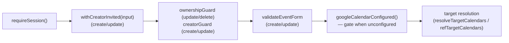
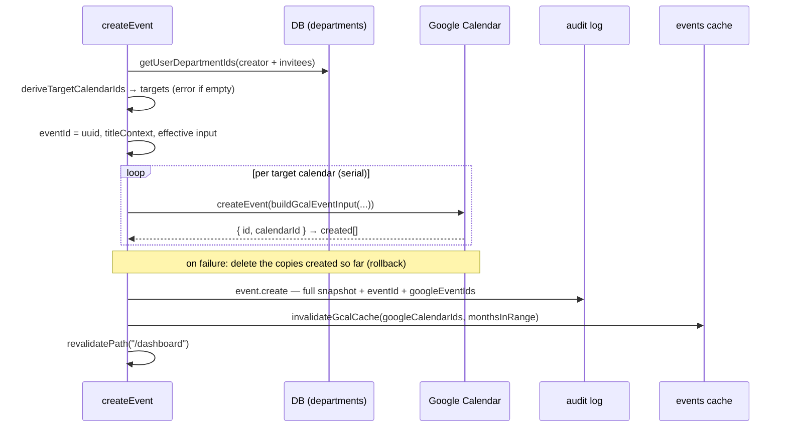
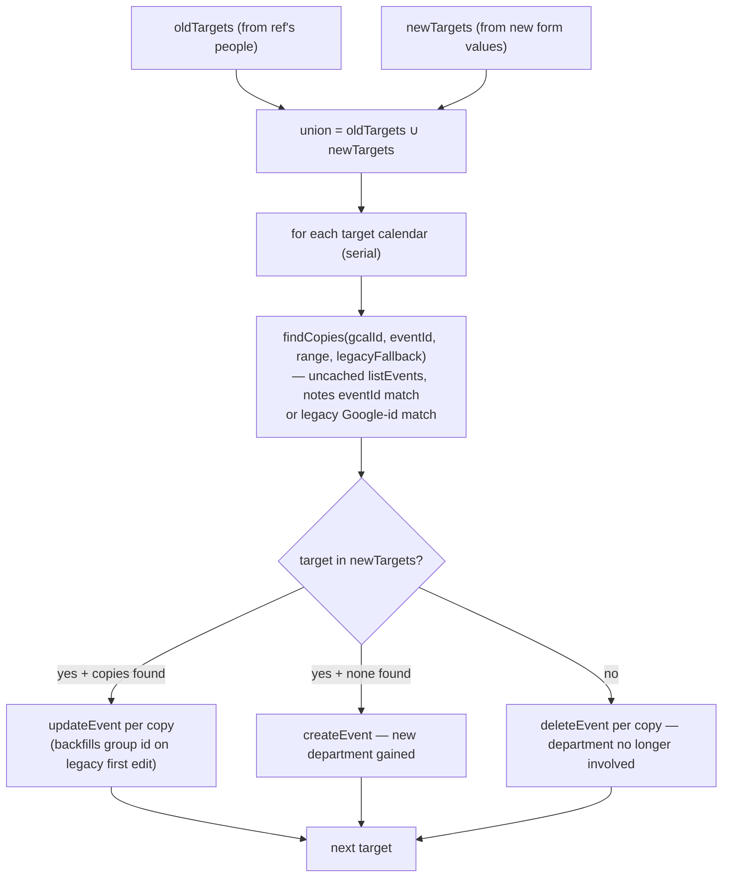

# 1. Event mutations: cross-department copies

The create/update/delete server actions in `src/lib/events/actions.ts` keep one
**logical event** — possibly spanning several department calendars — consistent in
Google Calendar: copies are created, updated, retired, and rolled back so that a
failure never leaves orphan or stale copies behind. This document covers the three
actions, the copy-reconciliation algorithm, failure semantics, and how each mutation
integrates with the audit log and the month cache. What an event *is* (notes block,
title, location, time options) is covered in
[`event-lifecycle.md`](event-lifecycle.md); what happens to the cached month read is
covered in [`events-cache.md`](events-cache.md).

## Table of contents

- [1.1 Problem](#11-problem)
- [1.2 Identity & the group id](#12-identity--the-group-id)
- [1.3 Shared prelude (all three actions)](#13-shared-prelude-all-three-actions)
- [1.4 createEvent](#14-createevent)
- [1.5 updateEvent — reconciling copies](#15-updateevent--reconciling-copies)
- [1.6 deleteEvent](#16-deleteevent)
- [1.7 Failure semantics](#17-failure-semantics)
- [1.8 Audit integration](#18-audit-integration)
- [1.9 Cache invalidation & revalidation](#19-cache-invalidation--revalidation)
- [1.10 Pure helpers & testing](#110-pure-helpers--testing)
- [1.11 File index & related docs](#111-file-index--related-docs)

## 1.1 Problem

Every department is a Google Calendar, and an event involving several departments must
appear in each of them so each department's people see it. The complications:

- **No foreign keys across calendars**: the copies are independent Google events; the
  only link is the group id written into each copy's notes (`eventId`,
  [`event-lifecycle.md` §1.7.1](event-lifecycle.md#171-fields-eventnotes-srclibeventsnotess19)).
- **Google is not a local database**: there is no transaction. A multi-calendar write
  can fail halfway, and the app must define what a half-finished mutation means.
- **Legacy events** created before the copies feature have no group id and may exist in
  a single calendar; the first edit or delete must still find and adopt them.
- **Reads go through a cache** ([`events-cache.md`](events-cache.md)), so after a
  mutation the app must invalidate exactly the affected calendar×month keys.

The design answers: an **idempotent reconcile plan** (create missing copies, update
present ones, delete retired ones) with **rollback of only the copies this run
created**, so a retry self-heals a half-failed attempt.

## 1.2 Identity & the group id

- On **create**, `createEvent` mints `eventId = crypto.randomUUID()`
  (`actions.ts:372`) and writes it into every copy's notes.
- All copies of a logical event therefore share the same `eventId`;
  `parseEventPeople(item.description).eventId` is how a copy is recognized
  (`actions.ts:311`).
- **Legacy events** (no group id) are found differently: `legacyFallback(ref)`
  (`actions.ts:323`) resolves the representative copy's registry calendar to its Google
  id and matches **by Google event id** within the search range. On the first edit of a
  legacy event, `updateEvent` mints a group id (`ref.eventId ?? crypto.randomUUID()`,
  `actions.ts:484`) and backfills it into the copies it writes.
- For **display**, the read path collapses the copies: `dedupeEventsByGroupId`
  (`targets.ts:75`) keeps the first copy per group id (legacy events always pass), fed
  in deterministic calendar-name order.
- `EventRef` (`targets.ts:13`) is the unit of identity an edit/delete operates on: one
  representative copy plus its people fields, which define the target set.

## 1.3 Shared prelude (all three actions)

All actions are `"use server"` and follow the same opening sequence (create:
`actions.ts:345-372`, update: `:461-495`, delete: `:624-638`):

- **Guards** (`events/guards.ts`): non-admins may only act on their own events and may
  never introduce a different creator; creator-less legacy/external events are
  admin-only (details in [`event-lifecycle.md` §1.5](event-lifecycle.md#15-guards--validation)).
- **Validation** (`events/validate.ts`): required fields, AM/PM for `full` events, and
  chronological order. On failure the action returns
  `{ ok: false, error, field }` with the *first* failing field so the form can jump to
  the owning step.
- **Google gate**: without service-account credentials the actions refuse with
  "Google Calendar is not configured" (the stub integration would otherwise "succeed"
  and audit-log phantom events).
- **Server re-normalization** (create `:375-378`, update `:492-495`):
  `resolveEventLocation(resolveEventTime(input, ctx), ctx)` clamps the time option to
  the type's allowed set and applies the location policy — the same pure helpers the
  form uses, so a stale or tampered form can't submit an out-of-policy combination.
- **Result type**: `EventActionResult = { ok: true } | { ok: false; error: string;
  field?: EventResultField }` (`actions.ts:54`) — actions never throw for expected
  failures; the client maps the error back onto the wizard.

## 1.4 createEvent

`createEvent(input)` (`actions.ts:345`):

- **Target resolution** (`resolveTargetCalendars`, `actions.ts:111`): creator's
  department + each invitee user's department + tagged departments, deduped. When
  nothing derives, create fails with "Assign yourself to a department or tag an
  invitee" (there is no fallback calendar for a brand-new event).
- **Per-target input**: `buildGcalEventInput` (`actions.ts:243`) renders the title
  (`renderEventTitle`), assembles the description (`Edit:` link + brotli notes block +
  internal marker, [`event-lifecycle.md` §1.7.3](event-lifecycle.md#173-description-assembly--markers)),
  converts the range via `absEventRange`, and puts the location in Google's first-class
  field.
- **Rollback**: if any copy fails, the already-created copies are deleted
  (best-effort, `.catch(() => {})`) and the error is returned — a failed
  multi-department create never leaves orphan events (`actions.ts:392-399`).
- **Audit**: `event.create` with a flat `EventAuditSnapshot` (the rendered title, raw
  description, type, pre-formatted `time`, out-of-camp/location, department + invitee
  **names**, creator name) plus `eventId` and the per-copy `googleEventIds`
  (`actions.ts:416-440`, §1.8).
- **Cache**: invalidate every written Google calendar id × every touched month
  (`actions.ts:442-445`).

## 1.5 updateEvent — reconciling copies

`updateEvent(ref, input)` (`actions.ts:457`) is the heart of the subsystem. It
**reconciles** the copy set: the target set is derived from the *old* people fields
(`refTargetCalendars`, `actions.ts:134`) and the *new* form values
(`resolveTargetCalendars` with `ref.calendarId` as fallback), and the plan is applied
per calendar in the **union** of both sets.

Key mechanics:

- **Search range** (`actions.ts:496-507`): the union of the old and new
  `absEventRange`s grown by **±1 day** (`withMargin`) so a copy that drifted slightly in
  Google, or an event whose date changed, is still found. `findCopies`
  (`actions.ts:302`) reads `integration.listEvents` **uncached** — a reconcile must
  always see the latest Google state, never a cached snapshot
  ([`events-cache.md` §1.6](events-cache.md#16-write--invalidation-path)).
- **The plan is idempotent**: it is derived from the current Google state, not from
  bookkeeping. If a run fails halfway, a retry re-derives the same plan and finishes
  it — "a half-failed attempt self-heals on retry" (`actions.ts:453-456`).
- **First found copy = the before state**: the first existing copy found anywhere
  (`firstCopy`, `actions.ts:516, 526-528`) is captured for the audit diff — all copies
  of a logical event are identical, so any of them represents the pre-edit state
  (§1.8).
- **Rollback** (§1.7): only the copies *created by this run* (`createdHere`) are rolled
  back on failure; copies that were already updated before the failure keep the new
  state, and the retry's re-derived plan converges them anyway
  (`actions.ts:549-556`).
- **Group-id backfill**: on the first edit of a legacy event the freshly minted
  `eventId` is written into the notes of every copy this run writes, adopting the event
  into the group-id world (`actions.ts:484`).

### 1.5.1 What each copy operation writes

Every write goes through `buildGcalEventInput` with the *new* effective input, so after
a successful update all remaining copies are byte-identical in title, description,
location, and times. Update is a **full replace** in Google
(`GcalEventInput` → `events.update`), so clearing the location clears it in Google too.

## 1.6 deleteEvent

`deleteEvent(ref)` (`actions.ts:624`):

1. `ownershipGuard` (admin-only for creator-less events), Google gate.
2. `refTargetCalendars(ref)` + `legacyFallback(ref)` in parallel; range = the ref's
   `absEventRange` ±1 day (`actions.ts:636-638`).
3. For each target calendar: `findCopies`, then delete every match, collecting the
   Google event ids and affected calendar ids; the first copy found is captured for the
   audit snapshot (`actions.ts:644-662`).
4. Audit `event.delete` with the flat snapshot (+ `eventId`, `googleEventIds`), then
   cache invalidation + `revalidatePath("/dashboard")` (`actions.ts:664-691`).

No rollback is needed: deleting a second time is a 404, and the integration's
`deleteEvent` treats 404 as success.

## 1.7 Failure semantics

| Situation | Behavior |
| --------- | -------- |
| One copy of a multi-calendar **create** fails | All copies created so far in this run are deleted (rollback); the error is returned; nothing is left behind. |
| A **create** fails after some copies exist | The retry re-derives targets from the (unchanged) form and creates again; the rolled-back copies are gone, so no duplicates. |
| **Update** fails after updating some copies | Only this run's *new* copies are rolled back; pre-existing updated copies keep the new state. The retry re-derives the plan from Google's current state and converges the rest. |
| A calendar id in the target set has no Google calendar (`resolveGoogleCalendarId` → null) | Skipped in update/delete loops (`actions.ts:520-523, 646-648`); throws "Calendar not found" in create (`:383-386`). |
| Google error (401/403/429/404) | Mapped to a human message by the integration's `fail()` (`src/lib/google/real.ts:42`) and returned as the action error. |
| Audit or cache-invalidation failure | Propagates as an unhandled error from the action (the primary Google writes already happened) — there is no retry/queue for audit writes; `logAction` itself is best-effort and swallows its own failures. |

The governing rule: **a mutation is best-effort eventually-consistent across Google,
with at-most-once creation of new copies per run**. Because the plan is a pure function
of Google's current state plus the form, retries are safe and self-healing.

## 1.8 Audit integration

Every mutation writes one `audit_logs` row via `logAction`
([`audit-log.md`](audit-log.md) for the table and display layer):

| Action | `AUDIT_ACTIONS` key | `details` |
| ------ | ------------------- | --------- |
| create | `event.create` | flat `EventAuditSnapshot` + `eventId` + `googleEventIds[]` |
| update | `event.update` | `diffFields(before, after)` (the `FieldDiff`) + `eventId` |
| delete | `event.delete` | flat `EventAuditSnapshot` + `eventId` + `googleEventIds[]` |

The snapshots are built by the pure helpers in `src/lib/events/eventAudit.ts`:

- **`EventAuditSnapshot`** (`eventAudit.ts:23`) — display names, never ids:
  `title` (the **rendered Google title** — the same string written to Google),
  `description` (raw typed text), `type`, `time` (pre-formatted in the app's UTC+8
  wall clock by `formatEventAuditTime`, `eventAudit.ts:83` — e.g. `2026-08-21 14:00 –
  15:30`, `2026-08-21 (AM) – 2026-08-23 (PM)`), `outOfCamp`, `location`,
  `departments[]`, `invitees[]`, `creator`.
- **`buildEventSnapshot`** (`eventAudit.ts:110`) builds the *after* state from form
  values + resolved id→name maps (unknown ids dropped, blanks → null).
- **`snapshotFromCopy`** (`eventAudit.ts:150`) builds the *before* state for
  update/delete from the `EventRef` plus the first copy read back from Google: the
  visible title comes from the copy's **summary** (so legacy/external/blank-description
  events still show the visible title), while description/type/time-option/AM-PM/
  out-of-camp come from the copy's **notes** — fields the notes can't supply (legacy
   event, or the copy was already gone) render as the empty marker `—`
   ([`audit-log.md` §1.8](audit-log.md#18-display-formatting)).
- `title` uses `renderEventTitle` in both the write path and the audit, so the two
  cannot diverge ([`event-lifecycle.md` §1.8.2](event-lifecycle.md#18-title-rendering)).

The update diff is computed with `diffFields` (`src/lib/audit/diff.ts:17`): union of
keys, JSON-equality per field, changed fields as `[before, after]` pairs — the display
layer renders them as before→after lines plus a "Resulting state" section from the
stored `after` record.

## 1.9 Cache invalidation & revalidation

After the Google writes and the audit row, every action calls
`invalidateGcalCache(googleCalendarIds, months)` and then
`revalidatePath("/dashboard")`:

- **Calendars**: every Google calendar id the mutation wrote to (create: `created`,
  update/delete: `affectedGoogleIds`).
- **Months**: every `YYYY-MM` the old *and* new date ranges touch
  (`monthsInRange`, `datetime.ts:99`) — so a reschedule into a new month invalidates
  both months (`actions.ts:610-618`).
- The purge deletes the L1 in-process entries and the DB rows for those
  calendar×month keys; on the mutating instance the next view is a blocking re-fetch,
  so the `router.refresh()` after the server action shows the change immediately
  (read-your-own-writes). Full consistency analysis in
  [`events-cache.md` §1.6/§1.7](events-cache.md#17-freshness--consistency).

## 1.10 Pure helpers & testing

The algorithmic core is split out as pure, unit-tested helpers
([`event-lifecycle.md` §1.11](event-lifecycle.md#111-pure-helpers--testing) covers the
full list); the mutation-specific ones:

| Helper | Module | Tests |
| ------ | ------ | ----- |
| `deriveTargetCalendarIds`, `diffEventTargets`, `dedupeEventsByGroupId`, `eventRefFromCalendarEvent` | `events/targets.ts` | `targets.test.ts` |
| `creatorGuard`, `ownershipGuard` | `events/guards.ts` | `guards.test.ts` |
| `validateEventForm`, `withCreatorInvited` | `events/validate.ts` | `validate.test.ts` |
| `resolveTimeOption`, `amPmSuffix` | `events/timeOptions.ts` | `timeOptions.test.ts` |
| `clampOutOfCamp` | `events/locationPolicy.ts` | `locationPolicy.test.ts` |
| `absEventRange`, `monthsInRange` | `events/datetime.ts` | `datetime.test.ts` |
| `buildEventSnapshot`, `snapshotFromCopy`, `formatEventAuditTime`, `renderEventTitle` | `events/eventAudit.ts` / `events/eventTitle.ts` | `eventAudit.test.ts` |
| `diffFields` | `audit/diff.ts` | `audit/diff.test.ts` |
| notes parsers used by `findCopies`/snapshots | `events/notes.ts` | `notes.test.ts` |

The actions themselves (`createEvent`, `updateEvent`, `deleteEvent`) and their I/O
helpers (`resolveTargetCalendars`, `findCopies`, `legacyFallback`,
`buildGcalEventInput`, `buildEventTitleContext`) are not unit-tested — they require a
live runtime, per the repo convention.

## 1.11 File index & related docs

| File | Role |
| ---- | ---- |
| `src/lib/events/actions.ts` | The three server actions + I/O glue |
| `src/lib/events/targets.ts` | `EventRef`, target set, dedup (pure) |
| `src/lib/events/eventAudit.ts` | Audit snapshot builders (pure) |
| `src/lib/events/eventTitle.ts` | `renderEventTitle` — title for write + audit (pure) |
| `src/lib/events/notes.ts` | Notes codec — group-id identity, before-state (pure) |
| `src/lib/events/guards.ts` | Access guards (pure) |
| `src/lib/events/validate.ts` | Form validation (pure) |
| `src/lib/events/datetime.ts` | Ranges + months for invalidation (pure) |
| `src/lib/audit/diff.ts` | `diffFields` before/after diff (pure) |
| `src/lib/audit/log.ts` | `logAction` (best-effort DB write) |
| `src/lib/google/eventsCache.ts` | `invalidateGcalCache` |
| `src/lib/google/real.ts` | The Google writes + error mapping |
| `src/app/(protected)/dashboard/EventForm.tsx` | Client submit → action call, error → step |

Related docs:

- [`event-lifecycle.md`](event-lifecycle.md) — what an event is: form, notes block,
  title, location policy, time options.
- [`events-cache.md`](events-cache.md) — the read cache these mutations invalidate.
- [`audit-log.md`](audit-log.md) — the audit rows these mutations write, rendered.
- [`roster-sharing.md`](roster-sharing.md) — the department calendars (Google ACLs)
  the copies live in.
- `progress.md` — phase write-ups: 1.16 (events), 1.20 (cross-department copies),
  1.29 (admin-id UUID guard), 1.30 (empty title), 1.73 (legible audit details).
