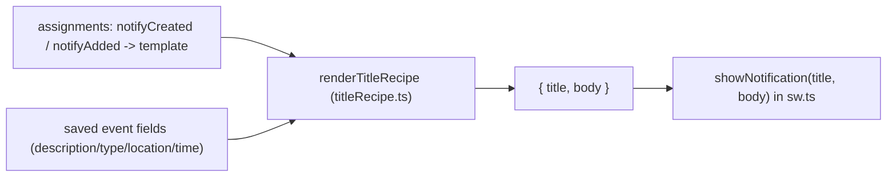

# 1. Event participant notifications (Web Push)

Roster users are notified — via standard **Web Push** (the browser Push API with
VAPID) — when they are **included as participants** in a newly-created event, or
**added** to an existing event. Department tags include every **active** member
of the department (the same occupancy model the clash engine and the edit guard
use). The acting user who performed the create/edit is never notified.

This is a **notify-only** feature, in the same spirit as the KAH breach check,
webhooks and clash advisories: delivery is best-effort, runs inside `after()`,
and can never delay or fail the mutation.

## Table of contents

- [1.1 When a notification is sent](#11-when-a-notification-is-sent)
- [1.2 Channels & reachability](#12-channels--reachability)
- [1.3 Flow](#13-flow)
- [1.4 Data model](#14-data-model)
- [1.5 Environment](#15-environment)
- [1.6 Server path](#16-server-path)
- [1.7 Service worker](#17-service-worker)
- [1.8 User surface (Notifications dialog)](#18-user-surface-notifications-dialog)
- [1.9 Audit trail](#19-audit-trail)
- [1.10 Platform notes & limits](#110-platform-notes--limits)
- [1.10.1 Troubleshooting](#1101-troubleshooting)
- [1.11 Customizing the notification content](#111-customizing-the-notification-content)
- [1.12 Files](#112-files)

## 1.1 When a notification is sent

A notification goes out after a successful event **create** or **update**
(never delete), for every roster user who is newly included as a participant:

| Situation                                                          | Notified                                                          |
| ------------------------------------------------------------------ | ----------------------------------------------------------------- |
| New event created                                                  | every participant (tagged users + active members of tagged depts) |
| Existing event edited — a user is tagged                           | that user                                                         |
| Existing event edited — a department is newly tagged               | every active member of that department                            |
| Existing event edited (time/title/location only)                   | nobody (the added-set is empty)                                   |
| User removed from an event / event deleted                         | nobody                                                            |

Semantics follow the clash **occupancy** model (`busyUsersOfEvent` in
`src/lib/events/clashes.ts`): a user is "included" when they are tagged by id
**or** an active member of a tagged department. The organizer (`createdBy`) is a
participant only when self-tagged; an event type with invitees disabled stores
the organizer as its sole attendee, so only they are "added" (and, being the
actor on create, never notified).

The diff is computed against the **mutation-time roster snapshot**: old state
(the pre-edit ref) and new state (the effective input) are both expanded with
the same current `activeMembershipsByDepartment` map. A member who joined a
department *after* it was first tagged is not re-reported by a later unrelated
edit, and re-saving an event never spams an already-tagged department's members.
Removing then re-adding a user later *does* re-notify them.

## 1.2 Channels & reachability

Only **Web Push** is used (no email fallback):

- **Android**: installed PWA via Chrome — fully supported.
- **iOS / iPadOS**: the **installed home-screen web app** on iOS/iPadOS **16.4+**
  (the app's browser floor is already Safari 16.4). Push is *not* delivered in
  Safari browser tabs — a user who opens the site in a tab sees no banner and
  cannot enable it.
- A user must (1) be an **active** roster user, (2) have granted the browser
  **permission**, (3) have a stored **subscription** for the device, and (4) have
  the account-wide **master switch** on.

Users' email addresses are optional on profiles and are **not** used here; a user
without a subscribed device simply receives nothing.

## 1.3 Flow

```mermaid
sequenceDiagram
  participant U as User (wizard)
  participant A as server action<br/>(create/updateEvent)
  participant G as Google Calendar
  participant P as after() dispatch
  participant D as Neon
  participant S as Web Push service

  U->>A: save event (people: old + new)
  A->>G: write copies
  A->>A: logAction + webhook + KAH + caches
  A->>P: dispatchParticipantNotifications({before, after, copies, …})
  Note over A: mutation returns; response not delayed
  P->>D: roster memberships + added-set diff
  P->>D: filter actor, active users, master switch, subscriptions
  P->>D: audit row (event.participantNotify)
  P->>S: sendNotification (per subscription, VAPID)
  S-->>P: ok / 404 / 410
  P->>D: prune dead endpoint on 404/410
```

## 1.4 Data model

Migration `0038_late_ultimates`:

- **`push_subscriptions`** — one row per browser push endpoint:
  - `user_id` → `users.id` (cascade delete), `endpoint` (unique), `keys` JSONB
    (`{ p256dh, auth }`), timestamps.
  - A user on several devices has several rows. Because the *endpoint* is unique,
    a device shared by two accounts is **re-`userId`d** to the currently signed-in
    account by `syncPushSubscription` (an upsert-by-endpoint), so no account's
    pushes leak to a device now used by another account.
- **`user_preferences.event_invite_push`** — the account-wide **master switch**
  (boolean, default `true`, independent of the OS permission). Row is lazily
  ensured on first write; an absent row means enabled.

No in-app event table is touched: event participant state lives in the Google
notes block (`inviteeUsers` / `inviteeDepartments`), exactly as the create/update
actions already read it.

## 1.5 Environment

The VAPID pair is generated **once** (`npx web-push generate-vapid-keys`) and
**shared across environments** — the keys identify the application server, so a
device subscribed through the Vercel origin keeps validating when the same
keypair signs from the Cloud Run shadow. Required on every deploy surface
(Vercel Production + Preview, Cloud Run shadow, `.env.local`):

| Variable                       | Purpose                                                              |
| ------------------------------ | -------------------------------------------------------------------- |
| `NEXT_PUBLIC_VAPID_PUBLIC_KEY` | VAPID public key — inlined into the client (`pushManager.subscribe`) |
| `VAPID_PRIVATE_KEY`            | VAPID private key (server-only secret)                               |
| `VAPID_SUBJECT`                | `mailto:` (or `https:`) contact identifying the app to the push service |

Without all three the feature is **disabled gracefully**: no crash, no sends.
Rotating the pair invalidates existing subscriptions; their next delivery fails
with 404/410 and prunes the row (users re-enable once from the Notifications
dialog, which re-subscribes under the new key).

## 1.6 Server path

Entry points — `src/lib/events/actions.ts`:

- `createEvent`: after the copies are written, KAH/webhook/cache work and before
  `revalidatePath`, calls `dispatchParticipantNotifications({ reason: "created",
  before: null, after: effectiveInput people, … })`.
- `updateEvent`: same site, `reason: "added"`, `before` = the ref's stored
  people, `after` = the effective input people.
- `deleteEvent`: no dispatch (deletion frees people).

`dispatchParticipantNotifications` (`src/lib/events/participantNotify/notify.ts`)
registers one `after(async () => …)` and returns immediately. Inside:

1. `parseVapidConfig()` (pure, `vapid.ts`) — bail when unconfigured.
2. `activeMembershipsByDepartment(old ∪ new dept ids)` →
   `computeAddedUserIds(before, after, memberships)` (pure, `diff.ts`) →
   drop the **acting user**.
3. Resolve the added ids against `users` (keep `status = 'active'`), drop rows
   whose `userPreferences.eventInvitePush` is `false`, then load their
   `push_subscriptions`. Empty at any step → no-op.
4. Build the shared text (`message.ts`, pure; reuses the audit log's UTC+8 wall
   clock via `formatEventAuditTime`) and a **per-recipient** deep link: the copy
   on the recipient's own department calendar when it exists, else the first
   copy — `/dashboard?date=<start>&event=<eventId>&_eventCal=<calendarId>` so the
   dashboard's fetch includes the event regardless of the user's filters.
5. **Audit first** (`AUDIT_ACTIONS.eventParticipantNotify` —
   `event.participantNotify`) so the send is on record even when delivery fails.
6. Send one push per subscription (`web-push`, `sendNotification`, TTL 7 days,
   10s timeout, payload `{ title, body, tag: eventId, url }`). 404/410 →
   `deletePushSubscriptionById` (endpoint gone); other errors are logged and
   swallowed.

## 1.7 Service worker

`src/app/sw.ts` (the Serwist SW) gains two plain listeners, appended after
`serwist.addEventListeners()` — the caching routes are untouched:

- **`push`**: reads the JSON payload and calls
  `registration.showNotification(title, { body, icon, badge, tag, data: { url } })`.
  The `tag` (the event id) collapses repeated pushes for the same event. A
  payload-less push falls back to a branded generic instead of nothing. Nothing
  is fetched from the network in the push event — payloads are kept small for iOS.
- **`notificationclick`**: closes the notification, focuses an existing window
  client (navigating it to the deep link) or opens a new one. Tapping a
  notification lands on the event's details modal.

**Notification art.** The `icon` is `public/notification-icon-192x192.png` (the
brand cloud+movement mark recolored white over a full-bleed blue-gradient tile —
a full-bleed square so an unmasked render shows a clean tile with no white halo,
and Android's own crop turns it into the round "app icon" look) and the status-bar
`badge` is `public/notification-badge-96x96.png` (the same white silhouette on
transparent, which Android tints monochrome). The app tile
(`public/icon-192x192.png`) is a near-white rounded square and reads as a
blank/opaque square on Android's light notification surface — do **not** use it
here. Both files plus their `.svg` sources are derived from `public/icon.svg` by
`python3 scripts/gen-notification-icons.py` (textual recolor + `rsvg-convert`);
re-run it when the brand icon changes and commit the outputs.

## 1.8 User surface (Notifications dialog)

`Profile menu → Notifications` (`NotificationSettings.tsx`, mounted in
`UserMenu.tsx` like the Calendar Access modal) presents:

- **Enable on this device** — the button calls `Notification.requestPermission()`
  synchronously in the click (required on iOS), then subscribes through the
  controlling SW's `pushManager` with the inlined `applicationServerKey`, then
  persists via the `syncPushSubscription` server action.
- **Turn off on this device** — unsubscribes the browser and calls
  `unsyncPushSubscription`.
- **Send test notification** — a `sendTestPush` server action pushes one
  notification to this device through the *same* `web-push` path and reports the
  outcome, so a config/subscription problem surfaces immediately (403/401 =
  VAPID pair mismatch, 404/410 = stale endpoint → prompts re-enable) instead of
  a silent miss.
- **Receive event-invite notifications** — the account-wide master switch
  (`setEventInvitePush`), paused independently of the browser permission.
- Browser-state-specific messaging so the dialog **always reaches a terminal
  state** (never an eternal spinner): the service-worker probe (`pushSwState`)
  is raced against a timeout, and distinct copy explains each of: unsupported
  (Safari tab / old iOS → "add to Home Screen"), server push not configured
  (VAPID env trio missing), the background service not ready (reopen/reinstall
  the installed app), permission denied, and the global-Admin account (no
  `users` row → cannot subscribe). Server actions return structured errors
  (never throw), including a hint when the `push_subscriptions` migration is
  missing.

Browser mechanics live in `src/lib/events/participantNotify/client.ts`
(capability detection, no-hang service-worker resolution, VAPID key conversion,
subscribe/unsubscribe); the server actions live in `participantNotify/actions.ts`.

## 1.9 Audit trail

Every send batch writes one `audit_logs` row (`event.participantNotify`):

- `entityId` = the first copy's calendar id; `entityName` = the notification
  headline; `details` = `{ eventId, reason, notified: n, devices: m,
  recipients: "<names, comma-joined>" }`.

There is deliberately **no dedup table** (unlike KAH): the added-set diff makes
re-saves of an unchanged participant set a no-op, so duplicates only arise from
genuinely re-adding someone.

## 1.10 Platform notes & limits

- **iOS**: push needs the app added to Home Screen on iOS/iPadOS 16.4+. An app
  installed before upgrading may need a one-time remove + re-add to unlock push.
  There is no per-app notification settings deep link on iOS — the dialog text
  explains re-enabling.
- **Payloads** are tiny and encrypted in transit by the push service.
- **Offline**: if the device is offline when the server sends, the push service
  queues it (TTL 7 days) and the SW shows it when the device returns. If the app
  is open, the notification still appears (the SW cannot tell focus); the page
  itself is not mutated until the user taps through.
- **Shared devices**: a push subscription is browser-level; re-sign-in with a
  different account re-owns the row only when that account subscribes/syncs
  (the dialog re-owns silently whenever it opens on a granted+subscribed
  device). Until then the previous owner's sends may still reach the device
  (treated as a stale device, not a leak).

## 1.10.1 Troubleshooting

Fastest path when "I enabled it but nothing arrives": open **Profile →
Notifications** on the receiving device and tap **Send test notification** — it
exercises the exact delivery path and returns the concrete reason. Failing that,
check in order:

1. **The dialog spins forever** → the page isn't controlled by an active service
   worker. Reopen the installed app (fully close it first); if it persists,
   reinstall the PWA. (The dialog now times out its probe and shows this
   guidance instead of hanging.)
2. **"Notifications aren't turned on for this server yet"** → the VAPID env trio
   is missing server-side. Set `NEXT_PUBLIC_VAPID_PUBLIC_KEY`,
   `VAPID_PRIVATE_KEY`, `VAPID_SUBJECT` on the deploy surface and redeploy.
   `NEXT_PUBLIC_*` is inlined **at build time** — the running deployment must
   have been built after the variable was set.
3. **"VAPID keys don't match" (403/401 on the test)** → the client subscribed
   with a different application-server key than the server now signs with (the
   pair was changed or a public/private mismatch was pasted). Use one pair from a
   single `npx web-push generate-vapid-keys` run on every surface, then turn
   notifications off/on on the device to re-subscribe.
4. **Test succeeds but event notifications don't arrive** → verify the
   two-account rule: the acting user is never notified, and the *recipient* must
   have push enabled on their own account/device. Create/edit the event as one
   user tagging a second user whose device has push on; a `event.participantNotify`
   audit row should appear (Settings → Audit Log) and a `[push]` line in the
   function logs if a send failed. A no-op participant edit adds nobody by design.
5. **"push_subscriptions table is missing"** → the schema migration (0038) has
   not run on this environment's DB; push `dev`/`main` so the CI migrate job
   applies it, or run `pnpm db:migrate` with that `DATABASE_URL` in the shell.
6. **Nothing happened and no error** → the recipient had no stored subscription
   row (never completed Enable on that account), the master switch is off for
   them, or their account is inactive. Re-check step 4's setup.

## 1.11 Notification copy is template-driven

Push copy is no longer managed separately — it uses the **same recipe templates**
as event titles (Settings → Templates). The push **title** is the event's rendered
title (already produced by templates); the **body** renders the recipe assigned to
one of two notification targets, exactly like a dashboard view gets a template.



### 1.11.1 Targets & defaults

Two assignable targets extend `EVENT_TITLE_ASSIGNMENT_TARGETS`
(`src/lib/settings/validate.ts`):

- `notifyCreated` — "Notification — new event".
- `notifyAdded` — "Notification — added to event".

An **unassigned** notification target uses the built-in copy in
`src/lib/events/notifyRecipes.ts` (NOT the master title template). The default
recipes lead with a `text` segment (the intro sentence) followed by the
description, location and the wall-clock time:

```
notifyCreated: Text "You're included in a new event" · Description · Location · (Time)
notifyAdded:   Text "You've been added to this event" · Description · Location · (Time)
```

Because recipes support a **literal Text field**, an assigned template can carry
its own intro sentence and any combination of fields; notification-rendered
recipes use the event's raw description, type name, location and full wall-clock
time (a `timeFull` override makes a `time` segment render the dated audit
string). People/department segments render empty in push.

### 1.11.2 Rendering & dispatch

`dispatchParticipantNotifications` (`participantNotify/notify.ts`) runs inside
`after()`: it reads the settings assignment for the reason's target, loads the
assigned library template (falling back to `notifyRecipes` defaults on any read
failure), and renders the body via `renderTitleRecipe`. The title falls back to
the event type, then `New event` / `Event update`. The push payload schema
(`{ title, body, tag, url }`) is unchanged, so the SW is untouched.

### 1.11.3 Admin surface

No separate copy editor. Templates are managed once in Settings → Templates:
the master row (unremovable, duplicatable) plus saved templates, and the
"Assign templates" dialog lists the notification targets alongside the views
and pinned ticker (each with its preview). Notification targets show
"Default copy" as their unassigned state.

The profile dialog's **Send test** keeps fixed copy — it exercises the plumbing,
not the content.

## 1.12 Files

| File                                                            | Role                                                          |
| --------------------------------------------------------------- | ------------------------------------------------------------- |
| `src/lib/events/participantNotify/vapid.ts` (+ test)            | Pure VAPID env parsing                                        |
| `src/lib/events/participantNotify/diff.ts` (+ test)             | Pure occupancy diff (`computeAddedUserIds`)                   |
| `src/lib/events/participantNotify/notify.ts`                    | `dispatchParticipantNotifications` (`after()` send path; template-driven body) |
| `src/lib/events/notifyRecipes.ts`                               | Built-in notification copy (default recipes per target)      |
| `src/lib/settings/titleRecipe.ts` (+ test)                      | Recipe types + `renderTitleRecipe` (incl. `text`/`timeFull`) |
| `src/lib/events/participantNotify/subscriptions.ts`             | `push_subscriptions` DB access (list/upsert/delete/by-endpoint) |
| `src/lib/events/participantNotify/sender.ts`                    | Shared one-shot `web-push` send (used by notify + test action)   |
| `src/lib/events/participantNotify/actions.ts`                   | Server actions (subscribe/unsync, settings read, test send)      |
| `src/lib/events/participantNotify/client.ts`                    | Browser-side push helpers (no-hang SW probe, subscribe)          |
| `src/components/NotificationSettings.tsx`                       | Profile-menu Notifications dialog (incl. Send test)              |
| `src/components/UserMenu.tsx`                                   | Menu entry + modal mount                                      |
| `src/app/sw.ts`                                                 | `push` / `notificationclick` handlers                         |
| `src/lib/events/actions.ts`                                     | Dispatch calls in `createEvent` / `updateEvent`               |
| `src/app/(protected)/settings/templates/TemplatesManager.tsx`   | Template groups + Assign templates dialog (incl. notify targets) |
| `src/db/schema.ts`, `drizzle/0038_late_ultimates.sql`           | `push_subscriptions`, `user_preferences.event_invite_push`    |
| `src/db/schema.ts` (`participant_notify_*` columns, deprecated) | Legacy free-text copy columns — never read (0039 migration)  |
| `public/notification-icon-192x192.png` (+ `.svg` source)       | Push `icon` — white logo on blue tile (see §1.7)              |
| `public/notification-badge-96x96.png` (+ `.svg` source)        | Push `badge` — white silhouette (see §1.7)                    |
| `scripts/gen-notification-icons.py`                            | Regenerates the notification art from `public/icon.svg`       |
| `.env.example`, `docs/developer-guide.md`, `AGENTS.md`         | Env + deployment docs                                         |
