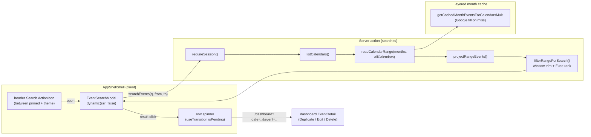

# 1. Event search

A header-launched, **fuzzy** free-text search over every department calendar.
It reads the **layered events cache** for the months the date window touches,
trims the result to the exact window, and Fuse.js-ranks title/location/type/
calendar matches — so a small typo still finds the event. Results render as a
flat, relevance-ranked list; tapping one shows a **spinner on that row** while it
navigates to the dashboard, which opens the **shared** full event detail modal
(with in-place Duplicate/Edit/Delete).

## Table of contents

- [1.1 Problem](#11-problem)
- [1.2 Goals & non-goals](#12-goals--non-goals)
- [1.3 Architecture overview](#13-architecture-overview)
- [1.4 The read path](#14-the-read-path)
- [1.5 The server action](#15-the-server-action)
- [1.6 Search scope & security](#16-search-scope--security)
- [1.7 Date range & defaults](#17-date-range--defaults)
- [1.8 Searchable surface & fuzzy matching](#18-searchable-surface--fuzzy-matching)
- [1.9 The search modal (lazy-loaded)](#19-the-search-modal-lazy-loaded)
- [1.10 Search history](#110-search-history)
- [1.11 Pure helpers & testing](#111-pure-helpers--testing)
- [1.12 File index & related docs](#112-file-index--related-docs)

## 1.1 Problem

The dashboard answers "what is happening this month in these departments", but
it has no way to answer "where and when did we mention *X*" — the three views
(five calendar views + filters) only show the currently fetched month range,
and the event cache only holds months that have already been viewed. Finding an
event means knowing roughly *when* it happened and paging to it. Search closes
that gap: enter a term (typos welcome), choose a (defaulted) date window, and
get every matching event across every department, best matches first.

## 1.2 Goals & non-goals

**Goals**

- Fuzzy free-text lookup across **all** department calendars (any signed-in user).
- Typo tolerance and relevance ranking (a near-miss still surfaces, best first).
- A user-chosen window with sensible defaults (1 month back, 3 months ahead).
- Reuse the warm month cache so repeated searches and the dashboard share work.
- A zero-cost entry point: the modal and its imports stay out of the shell's
  initial bundle until the user opens search.

**Non-goals**

- Not a structured query: the term matches a fixed set of event fields (title,
  location, event type, calendar name) — no people/date-range beyond the window.
- No separate search index: results are derived from the cache-backed month read
  and recomputed on every search. (The *query history* is a small per-account
  preference — see §1.10 — not a results cache.)
- No Google-side search: the app no longer calls `events.list` with `q` for this
  feature (see §1.4); a cold month is filled by the normal month fetch.
- No edit-in-place from search: tapping a result deep-links to the dashboard,
  which owns the event detail (Duplicate/Edit/Delete) and all mutation wiring.
  The search results are a lookup, not an editor.

## 1.3 Architecture overview

Search reads through `readCalendarRange` (`queries.ts`) — the same cache-through
path the dashboard uses — so a range the dashboard already loaded is served from
cache, while a cold month is filled from Google in one batched read.

## 1.4 The read path

The action converts the window to `YYYY-MM` months (`monthsInRange`), reads the
months for every registry calendar via `readCalendarRange` (which calls
`getCachedMonthEventsForCalendarsMulti`; a cache miss fills that month from
Google and warms adjacent months after the response), then projects them with
`projectRangeEvents(data, { typeFilter: [], userFilter: [] })` — the shared
mapper/deduper, so one logical event appears once regardless of how many
department calendars it lives in.

`GoogleIntegration.searchEvents` (Google `events.list` with `q`) still exists on
the interface and is implemented in `src/lib/google/real.ts`, but the app's
event search no longer calls it. Structured Google-side matching may return for
an indexed feature, but it is not this one.

## 1.5 The server action

`searchEvents(q, from, to)` (`src/lib/events/search.ts`, `"use server"`):

1. `requireSession()`.
2. Trims and enforces `SEARCH_MIN_QUERY_LENGTH` (2) characters.
3. Coerces the date window (§1.7).
4. `listCalendars()` → `readCalendarRange({ months, calendarIds })` (§1.4).
5. `projectRangeEvents` → the deduped, start-sorted `CalendarEvent[]`.
6. `filterRangeForSearch(events, from, to, q)` — trims whole months down to the
   exact window (`eventWithinRange`) and, for a query, fuzzy-ranks by
   title/location/type/calendar (relevance first; chronological on ties / blank).
7. Returns `{ ok: true, events, myEventIds }` — `myEventIds` are the current
   user's own (tagged-attendee, or a tagged department they belong to) events
   among the results, so the modal can apply the amber "mine" row highlight.

Failure surfaces as `{ ok: false, error }` (the client shows it inline); there
is no throw. The result events are `CalendarEvent[]`, the same shape the
dashboard consumes.

## 1.6 Search scope & security

Search runs over **every** registry calendar (`listCalendars()`), for **every
authenticated user** — no admin/own-department narrowing. This mirrors "any
user can invite anyone / tag any department" policy: calendar *visibility* is
department scoped via Google ACLs, but the app does not hide other departments'
events from signed-in users. Editing an event from a result is still gated by
`modifyGuard` in the detail modal it deep-links to. Stub (unconfigured Google)
returns empty months, so search degrades to "0 matches" rather than erroring.

Note: because reads go through the service account (owner of every calendar), a
search result set is the union of every department calendar — it is not
per-user ACL-filtered. That matches the existing dashboard read path (which the
service account also serves un-scoped).

## 1.7 Date range & defaults

The window is an inclusive `[from, to]` pair of `YYYY-MM-DD` dates the user
picks; defaults open 1 month back and 3 months ahead of "today" (UTC+8 naive).
The pure helpers live in `src/lib/events/searchRange.ts`:

- `defaultSearchFrom` / `defaultSearchTo` — month arithmetic with day-of-month
  clamping (`Jan 31 − 1 month → Dec 31`).
- `searchRangeBoundaries` — `from` → `timeMin = UTC-midnight`, `to` →
  `timeMax = UTC-midnight of addOneDay(to)` (Google's exclusive all-day-end
  convention), so an event on the `to` date is still included.
- `coerceSearchRange` — swaps a reversed pair and clamps the forward span to
  `SEARCH_MAX_RANGE_DAYS` (730).
- `eventWithinRange` — overlaps the event's absolute span (all-day exclusive-end
  via `exclusiveAbsEventRange`) with the window; the cache read returns whole
  months, so this trims the extra days at the edges.
- `filterRangeForSearch` — the window trim above plus the Fuse relevance rank.

On the server, non-`YYYY-MM-DD` inputs fall back to the defaults; the span cap
bounds how many months a single search can read.

## 1.8 Searchable surface & fuzzy matching

Matching runs client-and-server-safe through the shared
`src/lib/search/fuzzy.ts` (Fuse.js). The event keys are **title**, **location**,
**event type**, and **calendar name** — the rendered title template's output
(by default just `{description}`, i.e. the raw remarks) plus first-class fields.
People/departments encoded in the notes block are still not directly matchable.

Defaults (see `fuzzy.ts`): `threshold: 0.22`, `ignoreLocation: true`, field-length
norm left on. This tolerates a one-edit typo (`"alise"` → `"Alice"`,
`"sembawng"` → `"Sembawang"`) while rejecting short-word false positives
(`"ling"` does not drag in `"Ming"`). Multi-word queries are matched as one
fuzzy pattern, so distant words fail. `shouldSort` is off for order-preserving
callers and on for event search (relevance ranking).

Numeric identifiers are matched **exactly** (case-insensitive substring), never
fuzzily — see the `{ value, fuzzy: false }` field in §1.11.

## 1.9 The search modal (lazy-loaded)

`EventSearchModal` (`src/components/EventSearchModal.tsx`):

- Loaded with `dynamic(() => import(...), { ssr: false, loading: () =>
  <EventSearchModalSkeleton /> })`, so the modal — its `DatePickerInput` and
  other heavy imports — never contributes to the shell's first paint. The
  dependency-free skeleton fallback paints an immediate dialog for a click that
  races the chunk download. The chunk is **prefetched in the background** —
  `requestIdleCallback(cb, { timeout: 2000 })` after the shell's first paint,
  plus `onPointerEnter` / `onFocus` / `onPointerDown` / `onTouchStart` on the
  header button and the desktop `⌘/Ctrl-K` hotkey (the runtime Loadable's
  `.preload()`, reached through a cast since the TS type omits it). The
  `searchLoaded` flag is set when the preload promise resolves, so the modal
  **mounts closed** the moment the chunk lands: the first open is then a pure
  `opened` flip (no mount, parse, or network on the click), and it stays mounted
  afterward so the shrink-out plays and repeat opens don't reload the chunk.
- Owned by `AppShellShell`: the header `ActionIcon` toggles it; on click the
  shell captures the icon's rect and passes it down as `originRect`, and the
  modal zooms out of / shrinks back into it via the app's standard
  `motion/origin` transition (mirroring `PinnedEventsPanel`).
- Contents: a single toolbar row — the query `TextInput` (no autofocus;
  in-field clear) plus a Search submit (`Button` at `lg`, a 43px icon below it)
  and a date-filter `ActionIcon` that opens a popover with the From/To
  `DatePickerInput`s (cleared → server defaults) and a Reset, badge-counting a
  non-default window. Below it the recent-search badges scroll as one
  horizontal chip row and are **hidden once results exist**; a result-count +
  active-range caption (from the resolved window, not the result extremes) with
  a Clear action heads the list. Results render as a **flat list in relevance
  order** — each row a colored stripe + title + a date/time/all-day line, plus
  location and calendar — reusing the dashboard's amber `c2-my-agenda-event` /
  purple `c2-ext-agenda-event` highlight (the action returns `myEventIds`).
  Rows are paged (`RESULT_PAGE_SIZE` = 150) with a "Show more" button to keep the
  DOM bounded. The column is capped at `min(72dvh, 680px)` with the result list
  as the only scroll region, so the Modal body never scrolls and the mobile
  keyboard (`dvh`) shrinks it cleanly. While searching it shows a skeleton (with
  a `LoadingStatus`), and no matches render the shared `EmptyState`.
- A result click shows a **spinner on that row** — an overlay sized to the
  clicked row's box (positional, so nothing shifts) — and navigates
  `/dashboard?date=<start day>&event=<group id>&_eventCal=<calendar id>`
  (built by the pure `buildEventDeepLink`, `src/lib/events/deepLink.ts`) inside a
  `useTransition`. The link **preserves the active dashboard tab** (`?view=` is
  carried over when the search was opened from `/dashboard`), so opening a
  result can never fall back to the remembered tab and switch views. It never
  writes the tab's stored filters: the search covers every calendar and the
  active filters may exclude the event, so `_eventCal` names the tapped copy's
  calendar and the server resolves **that one event separately** — only its
  calendar, no type/user filters, and over the target's **own** months
  (`deepLinkMonths(date)`, never the active tab's required months) — returning it
  as `deepLinkEvent` on the snapshot record root (not in the cached `data`). The
  grid's `events` stay the filtered set, so the result does **not** leak a chip
  the filters hide; the dashboard's own full `EventDetail` (Duplicate/Edit/Delete)
  opens from the resolved event. `_eventCal`/`event` are absent from
  `dashboardRequestKey`, so `DashboardScreen` fires a ref-guarded one-shot refetch
  when a deep link's target is missing from an otherwise-current record (e.g. a
  same-period link). The details modal opens **immediately as a skeleton** and the
  target resolves underneath (the Double Booking detail's pattern); the
  "not in your current view" advisory appears only once that resolution has
  settled without a match. The one-shot `event`/`_eventCal` params are stripped
  after opening (re-armed per click, so the same event can be opened again), and
  `DashboardView` re-arms its same-id guard when they clear. Rows stay clickable
  throughout, so a re-click re-triggers navigation. There is no read-only detail
  step.

The Google Calendar notes' `Edit:` link is another producer of the same
`?event=` deep link (it carries `?date=` plus `_eventCal` naming the tapped
copy's calendar, exactly like this search link), and Pinned Events'
tap-to-open a third. See
[`event-lifecycle.md` §1.4.2](event-lifecycle.md#142-deep-links-back-to-the-event).

## 1.10 Search history

The modal shows the user's recent queries as tappable **"Recent searches"
badges** above the form (only when non-empty). History is **per-account** — it
lives in `user_preferences.search_history` (see
[`ui-state.md`](ui-state.md)), a most-recent-first string list that is
case-insensitively deduped and capped at `SEARCH_HISTORY_MAX` (8). Tapping a
badge fills the query and runs the search immediately; a small × on each badge
removes it.

- **Pure helpers** (`src/lib/events/searchHistory.ts`): `addSearchHistoryEntry`
  / `removeSearchHistoryEntry` / `cleanSearchHistoryList` — trim, dedupe, cap.
- **Server actions** (`src/lib/events/searchHistoryActions.ts`, `"use server"`):
  `getSearchHistory`, `recordSearchHistory` (fire-and-forget after a successful
  search), `removeSearchHistory`. The virtual break-glass admin (`id ===
  "admin"`, no `users` row) returns an empty history and no-op writes.
- **Modal wiring**: `EventSearchModal` fetches history on every open (so
  queries run on other devices surface here), records a query + updates the
  local badge list optimistically after a successful search, and removes both
  server-side and locally on ×. History is *not* cleared by the close/reset
  path (which only resets the query/results).

This history is a convenience shortcut, not a results cache — a badge re-runs
the cache-backed search with the current (defaulted) date window.

## 1.11 Pure helpers & testing

The decision-making parts are pure and unit-tested. `searchRange.test.ts` covers
the date helpers plus `eventWithinRange` / `filterRangeForSearch`;
`searchHistory.test.ts` covers the history list; `fuzzy.test.ts` covers
`fuzzyFilter` / `fuzzySearch` / `fuzzyMatches`. Everything that touches Google,
Postgres, or the Next runtime (the `searchEvents` action, `readCalendarRange`
wiring, the `searchHistoryActions` actions) follows the repo convention of being
I/O-bound and untested.

The shared `src/lib/search/fuzzy.ts` wraps Fuse.js once for the whole app
(pickers, Contacts, Users, events):

- `fuzzyFilter(items, query, getFields)` — filter a list by text fields, order
  preserved. `getFields` may return `{ value, fuzzy: false }` for identifiers
  (e.g. phone) matched by case-insensitive substring instead of fuzzily.
- `fuzzySearch(items, query, keys)` — relevance-ranked match by object keys.
- `fuzzyMatches(fields, query)` — one-off boolean test.

| Helper | Module | Tests |
| ------ | ------ | ----- |
| `addMonthsClamped` | `events/searchRange.ts` | `searchRange.test.ts` |
| `defaultSearchFrom` / `defaultSearchTo` | `events/searchRange.ts` | `searchRange.test.ts` |
| `searchRangeBoundaries` | `events/searchRange.ts` | `searchRange.test.ts` |
| `coerceSearchRange` | `events/searchRange.ts` | `searchRange.test.ts` |
| `eventWithinRange` / `filterRangeForSearch` | `events/searchRange.ts` | `searchRange.test.ts` |
| `fuzzyFilter` / `fuzzySearch` / `fuzzyMatches` | `search/fuzzy.ts` | `fuzzy.test.ts` |
| `addSearchHistoryEntry` / `removeSearchHistoryEntry` / `cleanSearchHistoryList` | `events/searchHistory.ts` | `searchHistory.test.ts` |

## 1.12 File index & related docs

| File | Role |
| ---- | ---- |
| `src/lib/search/fuzzy.ts` | Shared Fuse.js wrapper (fuzzy filter/search/matches) |
| `src/lib/events/search.ts` | `searchEvents` server action (cache read → project → fuzzy rank) |
| `src/lib/events/searchRange.ts` | Pure date-range helpers + window trim + Fuse rank (tested) |
| `src/lib/events/searchHistory.ts` | Pure history-list helpers (tested) |
| `src/lib/events/searchHistoryActions.ts` | `getSearchHistory` / `recordSearchHistory` / `removeSearchHistory` actions |
| `src/lib/userPrefs/queries.ts` | `getUserPreferences` (now exposes `searchHistory`) |
| `src/lib/events/queries.ts` | `readCalendarRange` / `projectRangeEvents` (the cache-backed read) |
| `src/lib/google/types.ts` | `searchEvents` contract (retained; not called by search) |
| `src/lib/google/real.ts` | `events.list({ ..., q })` implementation (retained) |
| `src/lib/google/stub.ts` | `searchEvents` → `[]` |
| `src/app/(protected)/dashboard/EventDetail.tsx` | The shared detail modal the deep link lands on (unchanged) |
| `src/components/EventSearchModal.tsx` | Lazy-loaded search modal + toolbar + flat relevance list + history badges + row-spinner deep link |
| `src/components/EventSearchModalSkeleton.tsx` | Dependency-free `dynamic` loading fallback dialog |
| `src/components/AppShellShell.tsx` | Header search button + ⌘/Ctrl-K + modal mount + origin rect + chunk preload |

Related docs:

- [`events-cache.md`](events-cache.md) — the month cache the search now reads
  through.
- [`event-lifecycle.md`](event-lifecycle.md) — the notes codec (§1.7) and title
  template (§1.8), which determine the rendered title.
- [`developer-guide.md`](developer-guide.md#112-related-docs) — documentation index.
