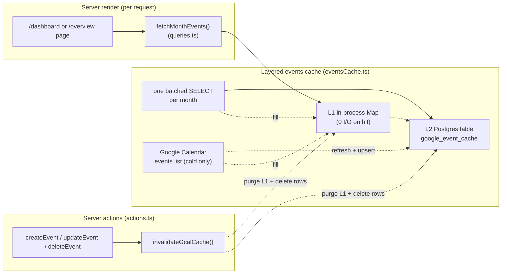
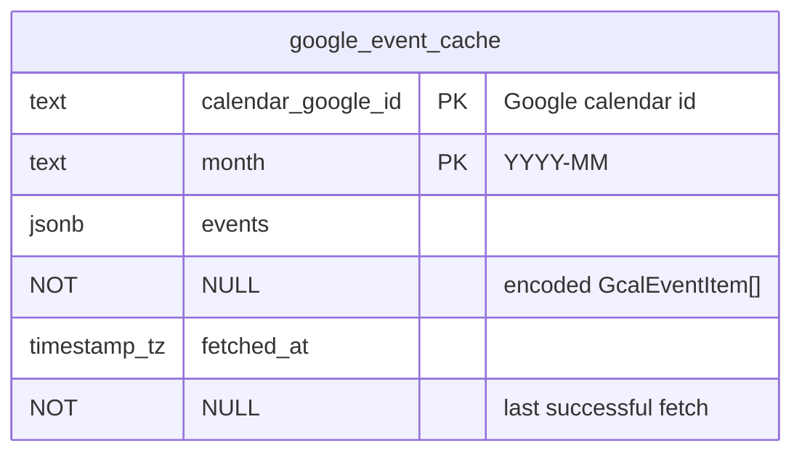
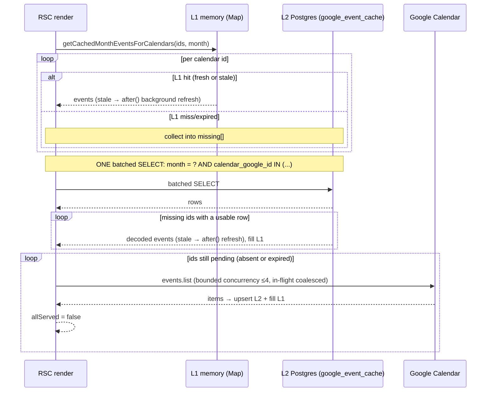
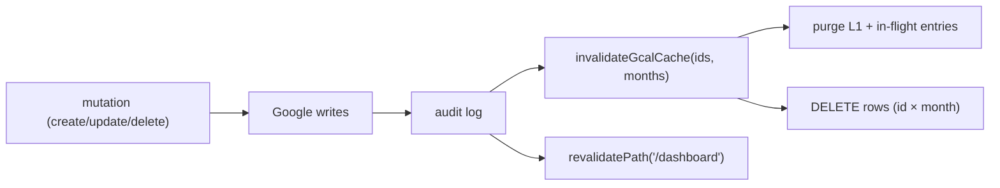
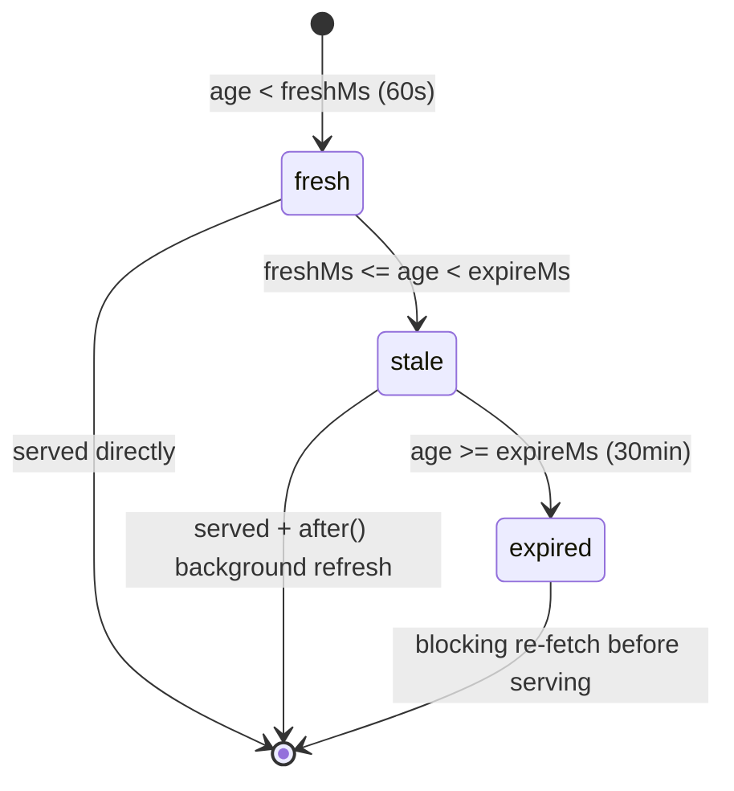
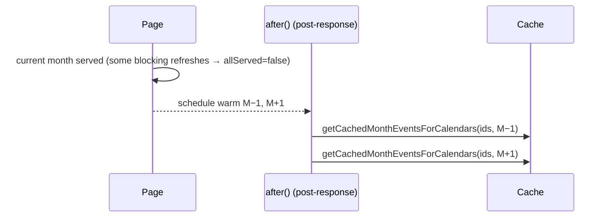

# 1. Google Calendar event cache

The calendar pages render a month of events sourced from Google Calendar. This document
describes the server-side caching layer between the frontend and the Google Calendar API:
its design, data model, read/write flows, freshness guarantees, and the pure helpers that
make it testable. The concise architecture note lives in `AGENTS.md`; the phase write-up is
in `progress.md` §1.42; this is the full reference.

## Table of contents

- [1.1 Problem](#11-problem)
- [1.2 Goals & non-goals](#12-goals--non-goals)
- [1.3 Architecture overview](#13-architecture-overview)
- [1.4 Cache key & data model](#14-cache-key--data-model)
- [1.5 Read path](#15-read-path)
- [1.6 Write / invalidation path](#16-write--invalidation-path)
- [1.7 Freshness & consistency](#17-freshness--consistency)
- [1.8 Adjacent-month prefetch](#18-adjacent-month-prefetch)
- [1.9 Constants & configuration](#19-constants--configuration)
- [1.10 Pure helpers & testing](#110-pure-helpers--testing)
- [1.11 Why not Next's `use cache`](#111-why-not-nexts-use-cache)
- [1.12 Performance](#112-performance)
- [1.13 File index & related docs](#113-file-index--related-docs)

## 1.1 Problem

Both authenticated calendar pages — `/dashboard` and `/overview` — rendered by asking
Google Calendar for events **on every server render**:

- `fetchMonthEvents()` (`src/lib/events/queries.ts`) called `integration.listEvents()`
  once per selected department calendar, **serially**, for the whole month.
- An admin viewing all departments therefore triggered one `events.list` round-trip per
  calendar (each a network call to the Google API, often hundreds of milliseconds).
- The result was masked by the loading skeleton: users waited on the Google fan-out with
  nothing rendered.
- The same uncached fan-out ran independently on `/dashboard` **and** `/overview`.
- There was no caching at all: no HTTP cache, no data cache, and the service worker
  (`src/app/sw.ts`) deliberately runs `NetworkOnly` for same-origin data, because event
  data "can never be stale".

## 1.2 Goals & non-goals

**Goals**

- Repeat views of a month skip Google Calendar entirely.
- In-app create/edit/delete appears immediately to the mutating user on the same instance,
  and everywhere else within the fresh window (see §1.6).
- Out-of-band edits made directly in Google Calendar converge within a bounded window.
- One cached entry serves every user, filter combination, and both pages.
- The shared layer (L2 Postgres) is consistent across serverless instances and survives
  restarts; the fast layer (L1) is per-instance and eventually consistent (see §1.6 / §1.7.2).

**Non-goals**

- Not a client-side cache: the browser/service worker still fetches fresh server responses
  every time (`NetworkOnly` in the service worker is unchanged).
- Not a full offline copy: only the per-calendar month payload is cached, and Google
  Calendar remains the single source of truth for event data.
- No event persistence: the app still writes/reads events only through the Google
  integration; the cache is derived data, never authoritative.

## 1.3 Architecture overview



The central design decision: **filters are applied after the fetch.** `fetchMonthEvents`
reads the full month from the cache and only then narrows by calendar, event type, and
user (`parseEventType`, `parseEventPeople`, `eventMatchesUserFilter`). Because of that,
the cache key is independent of every filter — a single entry per `(googleCalendarId,
month)` serves all users and all filter combinations on both pages.

## 1.4 Cache key & data model

### 1.4.1 Key

`(googleCalendarId, month)` where `month` is the `YYYY-MM` string of the viewed month
(`fetchMonthEvents` derives the range via `monthRange()` in
`src/lib/events/datetime.ts:57`). Events are fetched for the exclusive `[monthStart,
nextMonthStart)` window.

### 1.4.2 Table

Defined in `src/db/schema.ts:152` (migration `0011_panoramic_mariko_yashida.sql`):



| Column                | Type             | Notes                                                       |
| --------------------- | ---------------- | ------------------------------------------------------------ |
| `calendar_google_id`  | `text`           | Google calendar id (from the `calendars` registry row)       |
| `month`               | `text`           | `YYYY-MM`                                                    |
| `events`              | `jsonb`          | `CachedEvent[]` — `GcalEventItem`s with dates as ISO strings |
| `fetched_at`          | `timestamptz`    | Set on every successful refresh (drives TTL)                 |

Primary key: `(calendar_google_id, month)`. No foreign key — the row is keyed by the
Google id, not the registry UUID, so the cache is independent of the `calendars` table.

### 1.4.3 Stored payload

`GcalEventItem` (`src/lib/google/types.ts`) has `Date` `start`/`end` values, which JSON
cannot represent round-trippably. The codec (`eventsCacheCodec.ts`) encodes them as ISO
strings for storage and reconstructs `Date`s on read:

```ts
interface CachedEvent {
  id: string; calendarId: string; title: string; description: string;
  allDay: boolean; start: string; end: string;   // ISO 8601
}
```

## 1.5 Read path

Entry point: `getCachedMonthEventsForCalendars(googleCalendarIds, month)`
(`src/lib/google/eventsCache.ts:115`), returns `{ events: Record<googleId, GcalEventItem[]>,
allServed }`. It walks three layers, each cheaper than the last:



1. **L1 in-process map** (`memory`, keyed `` `${googleCalendarId}:${month}` ``) — a warm
   instance serves repeat views with **zero I/O**. Entries hold the already-decoded
   `GcalEventItem[]` plus an epoch `fetchedAt`. A size cap (`MAX_MEMORY_ENTRIES`) evicts
   the oldest-inserted entry when the map exceeds 512 rows.
2. **L2 Postgres** — for ids not served by L1, a **single batched `SELECT`** returns every
   cache row for the month across all requested calendars (one round-trip regardless of
   calendar count). Usable rows (fresh or stale) are decoded and promoted into L1.
3. **Google** — anything missing or expired blocks on a fresh `events.list` + upsert,
   executed with bounded concurrency (`GOOGLE_FETCH_CONCURRENCY` = 4). Concurrent callers
   of the same key within one process share a single promise via the `inflight` map, so a
   thundering herd collapses to one Google call.

`allServed` is `false` when at least one calendar needed a blocking Google refresh; the
prefetch gate (see §1.8) uses it to avoid background work on fully-cached views.

Stale hits schedule the refresh through `after()` (`next/server`), which runs after the
response ships — the visible render is never delayed by a stale-entry refresh.

### 1.5.1 Force refresh (manual, one-shot)

The dashboard header has a force-refresh button that bypasses the freshness windows and
re-fetches from Google on demand. It works as a **one-shot URL nonce**:

1. The button navigates with `?refresh=<epoch-ms>` (`DashboardView.tsx`).
2. `page.tsx` parses it: the nonce is honored only while it is a finite number younger than
   `REFRESH_NONCE_TTL_MS` (5min, `page.tsx`) — so a stale history entry (back/forward)
   can't silently re-force a fetch.
3. The page passes `force: true` through `fetchMonthEvents` into
   `getCachedMonthEventsForCalendars(ids, month, { force })` (`eventsCache.ts`): with
   `force`, **both L1 and L2 are skipped** and every requested calendar blocks on a fresh
   `events.list` (coalesced, `GOOGLE_FETCH_CONCURRENCY` ≤ 4 in flight), upserting DB rows
   with `fetchedAt = now` and refilling L1.
4. After the forced render mounts, a ref-guarded effect in `DashboardView.tsx` (mirroring
   the `?edit=` param pattern) strips `refresh` from the URL so later month/day navigation
   doesn't keep force-refreshing.

```mermaid
sequenceDiagram
    participant V as DashboardView (client)
    participant P as Page (RSC render)
    participant C as events cache (L1/L2)
    participant G as Google Calendar
    V->>P: router.push(?refresh=<epoch-ms>)
    P->>C: getCachedMonthEventsForCalendars(ids, month, { force: true })
    C->>G: events.list per selected calendar (≤4 concurrent)
    G-->>C: items → upsert L2 (fetchedAt=now) + refill L1
    C-->>P: fresh items — same request
    P-->>V: fresh render; then strip ?refresh=
```

Scope is the **selected calendars × displayed month** only (what the user sees); hidden
calendars and other months keep their normal freshness window, and `force` returns
`allServed: false` so the adjacent-month prefetch (§1.8) fires like any miss.

Doing the force **inside the same RSC render** — rather than invalidating in a server
action and issuing `router.refresh()` — guarantees the response carries the just-fetched
data. A separate re-read could be served by another instance whose L1 still holds a warm
(≤ 60s) entry for the same key, which would shadow the fresh rows for up to
`GCAL_CACHE_FRESH_MS` (§1.7.2 covers the analogous mutation case; the nonce approach
eliminates the window for the user who pressed the button entirely).

The button is disabled while Google is unconfigured (the stub integration returns no
events, so a forced refresh would cache empties and blank the view), and shows a loading
spinner (`BUTTON_LOADER_PROPS`) from a dedicated `useTransition` that wraps the
`router.push` directly (the same shape as the page's other nav transitions); the page
skeleton renders on `isPending || isRefreshing` so the load is covered either way.

## 1.6 Write / invalidation path

Create, update, and delete (`src/lib/events/actions.ts`: `createEvent` :322, `updateEvent`
:410, `deleteEvent` :529) write to Google Calendar directly (the source of truth), audit-log,
then call `invalidateGcalCache(googleCalendarIds, months)` (`eventsCache.ts:199`) before
`revalidatePath("/dashboard")`:



- **Affected ids** are the Google calendar ids the mutation wrote to, collected during the
  write loops (`created.map(...)`, `affectedGoogleIds`).
- **Affected months** are every `YYYY-MM` the event's old and new date ranges touch, via
  `monthsInRange()` (`datetime.ts:74`) — so a reschedule that moves an event into a new
  month invalidates both months.
- `invalidateGcalCache` purges the corresponding L1 and in-flight entries **and** deletes
  the DB rows (`WHERE calendar_google_id IN (...) AND month IN (...)`). Over-invalidation
  across the touched calendars/months is harmless.

The L1 purge is **per-instance** (the map only exists on the instance that ran the
mutation), while the DB deletion is **shared**. On the mutating instance the next view of
that calendar+month is a blocking re-fetch, so `router.refresh()` shows the change
immediately (read-your-own-writes). Other warm instances can't be reached by the purge, so
they may keep serving their pre-mutation L1 copy with zero I/O until that entry ages out of
the fresh window (`GCAL_CACHE_FRESH_MS`, 60s) and a background refresh runs — on a
multi-instance deployment (Vercel) the worst case for a *different* user/instance is ~60s,
though the shared DB row is gone so any cold instance or expired re-read converges right
away. This window is bounded and self-correcting; it is a deliberate trade for the zero-I/O
L1 warm hit.

One deliberate exception: `findCopies` (used inside mutations to reconcile cross-department
copies) reads `integration.listEvents` **uncached**, because a reconcile must always see
the latest Google state, not a cached snapshot.

## 1.7 Freshness & consistency

### 1.7.1 State machine

`cacheEntryState(fetchedAt, now, freshMs, expireMs)` (`eventsCacheCodec.ts:18`) classifies
every entry (in L1 or L2) by age:



| State    | Age window         | Served?        | Refresh                                    |
| -------- | ------------------ | -------------- | ------------------------------------------ |
| `fresh`  | `< 60s`            | immediately    | none                                       |
| `stale`  | `60s – 30min`      | immediately    | background via `after()` (stale-while-revalidate) |
| `expired`| `>= 30min`         | no             | blocking `events.list` + upsert            |

### 1.7.2 Guarantees

- **In-app edits** are read-your-own-writes on the mutating instance: the mutation
  invalidates the exact (calendar, month) keys (L1 purge + DB row delete), so the next view
  on that instance re-fetches fresh from Google. On *other* warm instances the L1 purge
  can't reach them, so they may serve the pre-mutation copy for up to `GCAL_CACHE_FRESH_MS`
  before a background refresh corrects it — see §1.6.
- **External (Google-native) edits** converge within roughly **60–90 seconds**: worst case
  the entry is fresh for 60s, then a background refresh runs within the stale window. The
  30-minute hard expire bounds how long a stale entry can linger before a blocking refetch.
  (An in-app edit made while an entry is fresh is the *same* ~60s staleness bound for other
  instances, but for an in-app change the shared DB row is already deleted, so cold
  instances and the mutating instance never see the old copy.)
- **Failures are never served as data.** `refreshMonthEvents` propagates Google errors
  (auth, rate limit, network). A failed refresh leaves the existing entry untouched and the
  request surfaces the error — a cache entry only ever reflects a **successful** fetch.
- **Per-instance vs shared:** L1 is per serverless instance (fast warm-instance hits,
  lost on instance recycle); L2 Postgres is the shared, durable layer that survives
  restarts and serves cold instances. A cold instance simply falls through L1 → L2.
- **Deterministic output:** `fetchMonthEvents` iterates calendars in name order and feeds
  the cache result through the same filtering/dedup logic as before, so the representative
  copy per logical event stays deterministic.

## 1.8 Adjacent-month prefetch

After a month view that **missed** the cache (`allServed === false` — i.e. the user is
actually navigating), `fetchMonthEvents` schedules an `after()` callback that warms the
neighboring months (`shiftMonth(month, ±1)`, `datetime.ts:67`) with the same batched
function (`queries.ts:118`):



Gate `PREFETCH_ADJACENT_MONTHS` (default `true`) plus the `allServed` condition keep
fully-cached views from churning extra Google/DB work after the response. Prefetching makes
month swiping render from cache on the next navigation.

## 1.9 Constants & configuration

All constants live at the top of `src/lib/google/eventsCache.ts` unless noted.

| Constant                  | Value     | Purpose                                                        |
| ------------------------- | --------- | -------------------------------------------------------------- |
| `GCAL_CACHE_FRESH_MS`     | `60_000`  | Fresh window: served directly, no refresh (60s)                |
| `GCAL_CACHE_EXPIRE_MS`    | `1_800_000` | Hard expire: stale-while-revalidate until this age (30min)   |
| `GOOGLE_FETCH_CONCURRENCY`| `4`       | Max Google `events.list` calls in flight for a cold refresh    |
| `MAX_MEMORY_ENTRIES`      | `512`     | L1 size cap (oldest-inserted entry evicted first)              |
| `PREFETCH_ADJACENT_MONTHS`| `true`    | `queries.ts` — enable neighbor-month prefetch (gated on miss)  |
| `REFRESH_NONCE_TTL_MS`    | `300_000` | `page.tsx` — max age of a valid `?refresh=` nonce (5min, §1.5.1) |

No Next.js cache configuration is used: `next.config.ts` and `(protected)/layout.tsx`
contain no `cacheComponents`, `cacheLife`, or `instant` settings (see §1.11).

## 1.10 Pure helpers & testing

The cache logic is split so the decision-making parts are pure, I/O-free functions that
Vitest can exercise without a database or Next runtime. The glue (DB queries, `after()`,
the Google call) is deliberately thin.

| Helper                                | Module                          | Tests                        |
| ------------------------------------- | ------------------------------- | ---------------------------- |
| `cacheEntryState` (fresh/stale/expired) | `eventsCacheCodec.ts:18`      | `eventsCacheCodec.test.ts`   |
| `encodeCachedEvents` / `decodeCachedEvents` | `eventsCacheCodec.ts:45/:58` | `eventsCacheCodec.test.ts`   |
| `monthsInRange` / `shiftMonth` / `monthRange` | `events/datetime.ts:74/:67/:57` | `events/datetime.test.ts` |
| `mapWithConcurrency`                   | `async.ts`                     | `async.test.ts`              |

Testing strategy, matching the repo convention: pure helpers are unit-tested; the
Next/Postgres/Google-glue functions (`getCachedMonthEventsForCalendars`,
`refreshMonthEvents`, `invalidateGcalCache`) are not — they require a live runtime.

## 1.11 Why not Next's `use cache`

The first implementation used Next's native data cache: `cacheComponents: true` in
`next.config.ts`, a `'use cache'` function, `cacheLife`, `cacheTag`, and `updateTag` for
invalidation. It was replaced with the Postgres table because:

- **Turbopack `next dev` crashed on Node 26** with
  `TypeError: ArrayBuffer is not detachable and could not be cloned`
  (upstream vercel/next.js#96165, unfixed). Node 26 raised `Buffer.poolSize` to 64 KiB, so
  the dev RSC streaming bridge enqueued pooled (non-detachable) `Buffer`s into a byte
  stream. Dev-only — production builds were unaffected — but it broke local development.
- `cacheComponents: true` enabled PPR-style prerendering, which forced an
  `export const instant = false` opt-out on the authenticated layout and changed the
  app's rendering model for no benefit here.
- Self-hosting adds further quirks: the data cache is filesystem-backed per instance
  (no cross-instance sharing), with a 2 MB per-entry fetch-cache cap.

The DB table avoids the entire Next cache runtime and behaves identically in dev, CI,
Vercel, and self-hosted. See `progress.md` §1.42 for the full history.

## 1.12 Performance

Measured on an authenticated `next dev` (Node 26) against the real Neon pooler + Google
Calendar, after the layered optimization:

| Page                          | Before caching | DB-only cache | Layered cache (current) |
| ----------------------------- | -------------- | ------------- | ----------------------- |
| `/dashboard` warm hit         | ~1.0–1.9s      | ~1.0s         | **~0.35–0.46s**         |
| `/overview` warm hit          | ~0.75s         | ~0.75s        | **~0.29s**              |

Where the remaining time goes (pre-existing app floor, unchanged by the cache):

- Every query is serialized on the `postgres` client's single connection (`max: 1` in
  `src/db/index.ts`) — the base dashboard queries (`listCalendars`, `listEventTypes`,
  `listUsers`, `getSettings`) run in `Promise.all` but execute serially.
- Per-query round-trip to Neon from this environment is ~45–65ms warm, ~600ms for the
  first (cold) connection.

What the cache changed:

- **Before:** N serial Google `events.list` calls per render (one per calendar).
- **DB-only:** N serial `SELECT`s per render (~50ms each) — an improvement only for
  many-calendar admin views, and it could *feel* slower for small calendar counts.
- **Layered (current):** L1 hits cost zero I/O; L2 costs **one batched `SELECT`** (~60ms
  total regardless of calendar count); only true misses touch Google (parallel, ≤4, and
  coalesced per key).

## 1.13 File index & related docs

| File                                            | Role                                                       |
| ----------------------------------------------- | ---------------------------------------------------------- |
| `src/lib/google/eventsCache.ts`                 | Layered cache read + invalidation (L1/L2/Google)           |
| `src/lib/google/eventsCacheCodec.ts`            | Pure state + codec helpers (unit-tested)                   |
| `src/db/schema.ts:152`                          | `google_event_cache` table                                  |
| `drizzle/0011_panoramic_mariko_yashida.sql`     | Migration creating the table                                 |
| `src/lib/events/queries.ts:118`                 | `fetchMonthEvents` — read path + gated prefetch             |
| `src/lib/events/actions.ts`                     | Mutations → `invalidateGcalCache`                           |
| `src/app/(protected)/dashboard/page.tsx`        | `?refresh=` nonce parsing → `force` flag (§1.5.1)           |
| `src/app/(protected)/dashboard/DashboardView.tsx` | Force-refresh button + one-shot nonce strip (§1.5.1)       |
| `src/lib/events/datetime.ts`                    | `monthRange`, `shiftMonth`, `monthsInRange`                 |
| `src/lib/async.ts`                              | `mapWithConcurrency`                                        |
| `src/app/sw.ts`                                 | Service worker: `NetworkOnly` for data (unchanged)          |

Related docs:

- [`README.md`](../README.md#112-documentation) — documentation index (this file).
- [`progress.md` §1.42](../progress.md#142-calendar-caching-layer-phase-3g) — phase write-up
  and the `use cache` → Postgres migration history.
- `AGENTS.md` — concise architecture bullet (the canonical quick reference).
