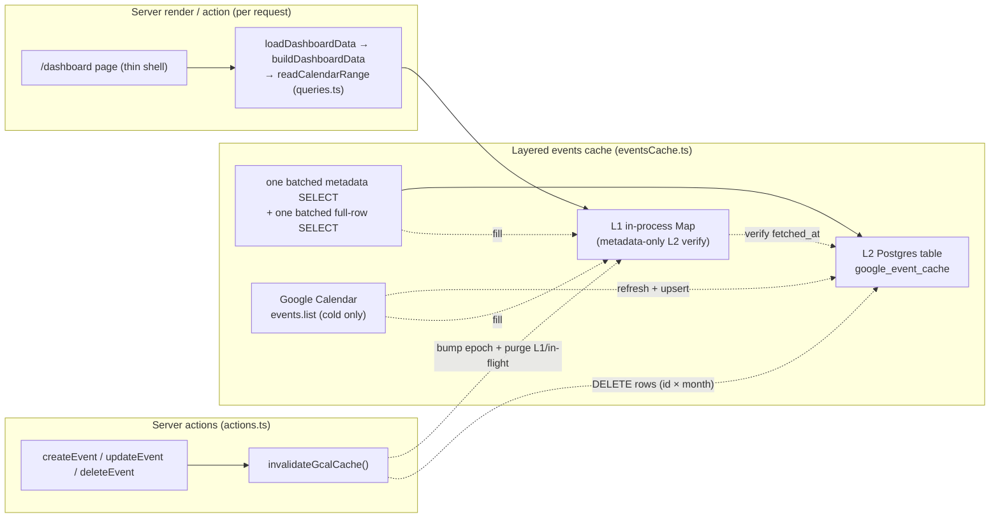
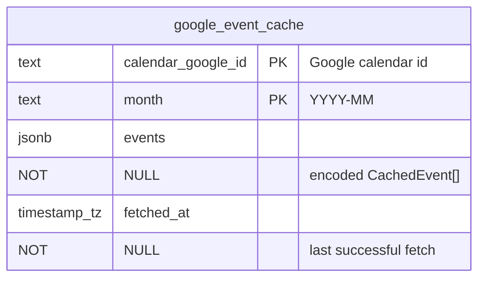
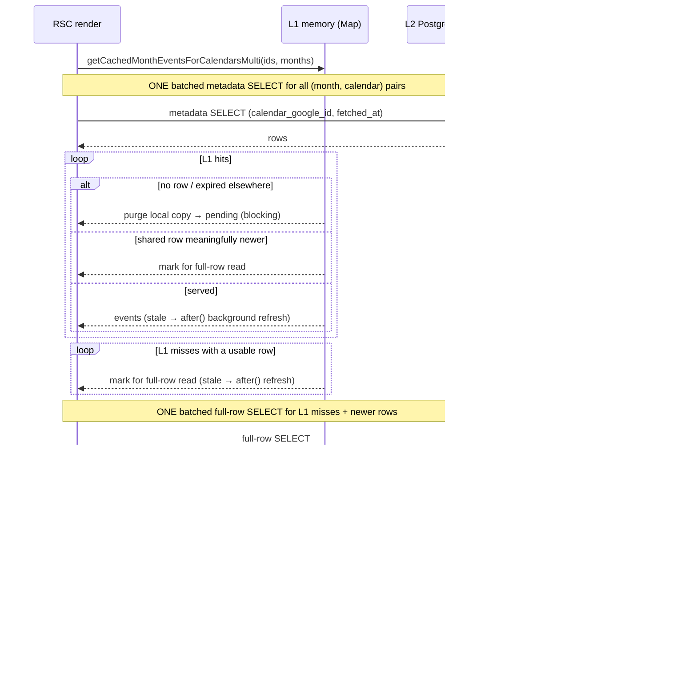
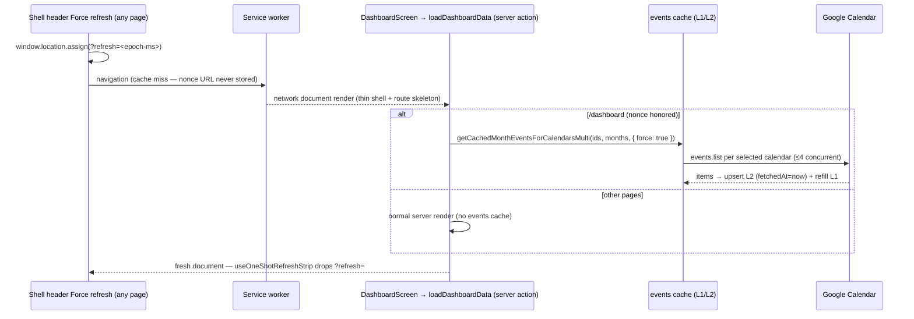
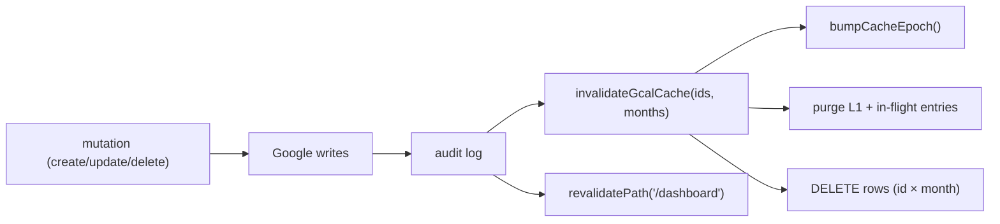
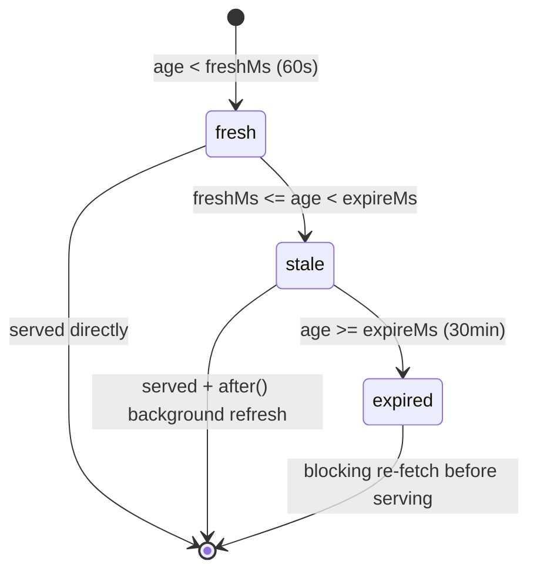
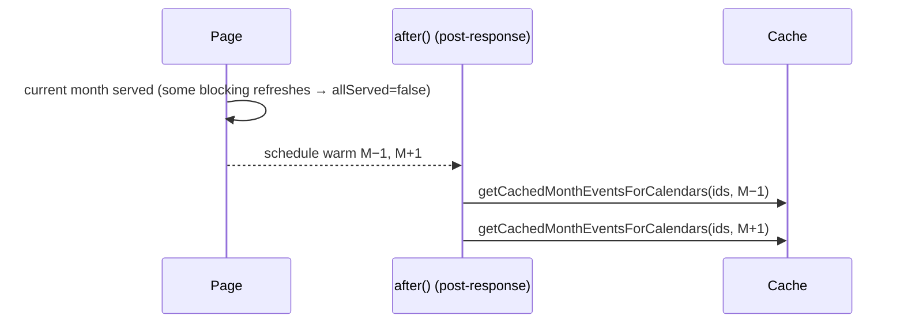

# 1. Google Calendar event cache

The calendar pages render a month of events sourced from Google Calendar. This document
describes the server-side caching layer between the frontend and the Google Calendar API:
its design, data model, read/write flows, freshness guarantees, and the pure helpers that
make it testable. The concise architecture note lives in `AGENTS.md`; the phase write-up is
in `progress-archive.md` §1.42; this is the full reference.

## Table of contents

- [1.1 Problem](#11-problem)
- [1.2 Goals & non-goals](#12-goals--non-goals)
- [1.3 Architecture overview](#13-architecture-overview)
- [1.4 Cache key & data model](#14-cache-key--data-model)
- [1.5 Read path](#15-read-path)
- [1.6 Write / invalidation path](#16-write--invalidation-path)
- [1.7 Freshness & consistency](#17-freshness--consistency)
- [1.8 Adjacent-month prefetch](#18-adjacent-month-prefetch)
- [1.9 Constants & configuration](#19-constants--configuration)
- [1.10 Pure helpers & testing](#110-pure-helpers--testing)
- [1.11 Why not Next's `use cache`](#111-why-not-nexts-use-cache)
- [1.12 Performance](#112-performance)
- [1.13 File index & related docs](#113-file-index--related-docs)

## 1.1 Problem

The dashboard (`/dashboard`) rendered by asking Google Calendar for events **on every
server render**:

- `fetchMonthEvents()` (`src/lib/events/queries.ts`) called `integration.listEvents()`
  once per selected department calendar, **serially**, for the whole month.
- An admin viewing all departments therefore triggered one `events.list` round-trip per
  calendar (each a network call to the Google API, often hundreds of milliseconds).
- The result was masked by the loading skeleton: users waited on the Google fan-out with
  nothing rendered.
- There was no caching at all: no HTTP cache, no data cache, and the service worker
  (`src/app/sw.ts`) deliberately runs `NetworkOnly` for same-origin data, because event
  data "can never be stale".

The cache exists to defend **two real constraints — not a daily Google quota scare**.
The Calendar API's project-level capacity (per-minute-per-project, and a 1M-requests/day
billing threshold on post-May-2026 projects) is far above this app's traffic; measured
usage on the production project is ~0%. The real ceilings are:

1. **Per-user per-minute rate limit.** Every Google call here is made by the **service
 account**, which Google charges as a single "user" (~600 requests/min on new projects).
 An uncached admin view of all departments fans out to N `events.list` calls per render,
 so a busy multi-user minute can burst past that cap. The cache collapses "N Google
 calls per render" into "zero on a warm hit".
2. **Render latency.** Each `events.list` round-trip costs hundreds of milliseconds and
 the uncached fan-out was serial, hiding the wait behind the loading skeleton.

## 1.2 Goals & non-goals

**Goals**

- Repeat views of a month skip Google Calendar entirely.
- In-app create/edit/delete appears immediately to the mutating user on the same instance,
  and everywhere else within the fresh window (see §1.6).
- Out-of-band edits made directly in Google Calendar converge within a bounded window.
- One cached entry serves every user and filter combination.
- The shared layer (L2 Postgres) is consistent across serverless instances and survives
  restarts; the fast layer (L1) is per-instance and eventually consistent (see §1.6 / §1.7.2).

**Non-goals**

- Not a client-side cache: the browser/service worker still fetches fresh server responses
  every time (`NetworkOnly` in the service worker is unchanged).
- Not a full offline copy: only the per-calendar month payload is cached, and Google
  Calendar remains the single source of truth for event data.
- No event persistence: the app still writes/reads events only through the Google
  integration; the cache is derived data, never authoritative.

**The binding constraint is the database, not Google.** The cache converts Google calls
(per-user burst-capped, daily effectively free) into reads/writes on the shared L2
Postgres row — and Neon's free tier (100 compute-hours/month, 5 GB egress) is far easier
to exhaust than Google's 1M-requests/day. That is why the read path is deliberately
DB-frugal: warm L1 hits are verified with a metadata-only `SELECT` (no JSONB re-ship,
§1.5), full month rows are read only for L1 misses, duplicate per-render reads are
`React.cache()`d (see `events/queries.ts`), and Google refreshes are coalesced in-process
by the `inflight` map. In short: the system trades a generous external quota for a scarce
internal one, and the cache is tuned to keep the scarce side cheap. See
[`neon-usage.md`](neon-usage.md) for how to verify the DB-side numbers.

## 1.3 Architecture overview


```mermaid
flowchart LR
 subgraph RSC["Server render / action (per request)"]
 D["/dashboard page (thin shell)"]
 FM["loadDashboardData → buildDashboardData<br/>→ readCalendarRange (queries.ts)"]
 end
 subgraph CACHE["Layered events cache (eventsCache.ts)"]
 L1["L1 in-process Map<br/>(metadata-only L2 verify)"]
 L2["L2 Postgres table<br/>google_event_cache"]
 L2q["one batched metadata SELECT<br/>+ one batched full-row SELECT"]
 G["Google Calendar<br/>events.list (cold only)"]
 L1 -. "verify fetched_at" .-> L2
 L2q --> L2
 L2q -. "fill" .-> L1
 G -. "refresh + upsert" .-> L2
 G -. "fill" .-> L1
 end
 subgraph MUT["Server actions (actions.ts)"]
 CRUD["createEvent / updateEvent / deleteEvent"]
 INV["invalidateGcalCache()"]
 CRUD --> INV
 INV -. "bump epoch + purge L1/in-flight" .-> L1
 INV -. "DELETE rows (id × month)" .-> L2
 end
 D --> FM --> L1
```

The central design decision: **filters are applied after the fetch.** `fetchMonthEvents`
reads the full month from the cache and only then narrows by calendar, event type, and
user (`parseEventType`, `parseEventPeople`, `eventMatchesUserFilter`). Because of that,
the cache key is independent of every filter — a single entry per `(googleCalendarId,
month)` serves all users and all filter combinations.

## 1.4 Cache key & data model

### 1.4.1 Key

`(googleCalendarId, month)` where `month` is the `YYYY-MM` string of the viewed month
(`fetchMonthEvents` derives the range via `monthRange()` in
`src/lib/events/datetime.ts`). Events are fetched for the exclusive `[monthStart,
nextMonthStart)` window. The dashboard Month view reads the months its natural
(4–6) week grid displays in one range pass — `fetchRangeEvents` over `monthGridMonths()` (the Monday
on/before the 1st through the last rendered week, 2-3 cache entries per calendar) — so the
dimmed adjacent-month days carry their events; Day/Agenda/parade-state stay single
month via `fetchMonthEvents`.

The dashboard's client fetch identity mirrors this: `requiredMonths(kind, month, date)`
(`src/lib/dashboard/snapshot.ts`) returns the same month set the server would read, and
`DashboardScreen` only calls `loadDashboardData` when that set changes. An in-month day
move (same month set) is a pure client re-filter — it never reaches this cache or the DB.
The day inside the loaded month comes from the URL: `DashboardScreen` passes `?date=` as
the URL-first `date` prop, so the Day/Week (H) grids and chrome move without a read.

### 1.4.2 Table

Defined in `src/db/schema.ts` (migration `0011_panoramic_mariko_yashida.sql`):


```mermaid
erDiagram
 google_event_cache {
 text calendar_google_id PK "Google calendar id"
 text month PK "YYYY-MM"
 jsonb events NOT NULL "encoded CachedEvent[]"
 timestamp_tz fetched_at NOT NULL "last successful fetch"
 }
```

| Column | Type | Notes |
| --------------------- | ---------------- | ------------------------------------------------------------ |
| `calendar_google_id`  | `text` | Google calendar id (from the `calendars` registry row) |
| `month` | `text` | `YYYY-MM` |
| `events` | `jsonb` | `CachedEvent[]` — `GcalEventItem`s with dates as ISO strings |
| `fetched_at` | `timestamptz` | Set on every successful refresh (drives TTL) |

Primary key: `(calendar_google_id, month)`. No foreign key — the row is keyed by the
Google id, not the registry UUID, so the cache is independent of the `calendars` table.

### 1.4.3 Stored payload

`GcalEventItem` (`src/lib/google/types.ts`) has `Date` `start`/`end` values, which JSON
cannot represent round-trippably. The codec (`eventsCacheCodec.ts`) encodes them as ISO
strings for storage and reconstructs `Date`s on read:

```ts
interface CachedEvent {
  id: string; calendarId: string; title: string; description: string;
  allDay: boolean; location: string; start: string; end: string; // ISO 8601 dates
}
```

## 1.5 Read path

Entry point: `getCachedMonthEventsForCalendars(googleCalendarIds, month)`
(`src/lib/google/eventsCache.ts`), returns `{ events: Record<googleId, GcalEventItem[]>,
allServed }`. It walks three layers, each cheaper than the last:


```mermaid
sequenceDiagram
 participant R as RSC render
 participant L1 as L1 memory (Map)
 participant L2 as L2 Postgres (google_event_cache)
 participant G as Google Calendar
 R->>L1: getCachedMonthEventsForCalendarsMulti(ids, months)
 Note over R,L2: ONE batched metadata SELECT for all (month, calendar) pairs
 R->>L2: metadata SELECT (calendar_google_id, fetched_at)
 L2-->>R: rows
 loop L1 hits
 alt no row / expired elsewhere
 L1-->>R: purge local copy → pending (blocking)
 else shared row meaningfully newer
 L1-->>R: mark for full-row read
 else served
 L1-->>R: events (stale → after() background refresh)
 end
 end
 loop L1 misses with a usable row
 L1-->>R: mark for full-row read (stale → after() refresh)
 end
 Note over R,L2: ONE batched full-row SELECT for L1 misses + newer rows
 R->>L2: full-row SELECT
 L2-->>R: decoded events, fill L1
 loop ids still pending (absent or expired)
 R->>G: events.list (bounded concurrency ≤4, in-flight coalesced)
 G-->>R: items → upsert L2 + fill L1
 R-->>R: allServed = false
 end
```

1. **L1 in-process map** (`memory`, keyed `` `${googleCalendarId}:${month}` ``) — a warm
 instance serves repeat views with **no Google I/O** and, since the `events` JSONB is
 never re-shipped for a warm hit, minimal DB transfer. Entries hold the already-decoded
 `GcalEventItem[]` plus an epoch `fetchedAt`. A size cap (`MAX_MEMORY_ENTRIES`) evicts
 the oldest-inserted entry when the map exceeds 512 rows.
2. **L2 Postgres** — every L1 hit is verified against the shared row with a
 **metadata-only `SELECT`** (`calendar_google_id`, `fetched_at` — no `events` payload),
 so a cross-instance `invalidateGcalCache` (DELETE on another lambda) is visible without
 re-downloading whole months; full `events` rows are fetched **only for L1 misses** (one
 batched `SELECT` regardless of calendar count), plus the rare L1 hit whose shared row is
 meaningfully newer than the local copy. Usable rows (fresh or stale) are decoded and
 promoted into L1.
3. **Google** — anything missing or expired blocks on a fresh `events.list` + upsert,
 executed with bounded concurrency (`GOOGLE_FETCH_CONCURRENCY` = 4). Concurrent callers
 of the same key within one process share a single promise via the `inflight` map, so a
 thundering herd collapses to one Google call. The fetch runs **outside any transaction**
 (the app's Postgres pool is `max: 3` by default, configurable via `DB_POOL_MAX`), so it
 never holds the connection open across the network round-trip; duplicate cross-instance
 refreshes are harmless because the upsert is idempotent.

`allServed` is `false` when at least one calendar needed a blocking Google refresh; the
prefetch gate (see §1.8) uses it to avoid background work on fully-cached views.

Stale hits schedule the refresh through `after()` (`next/server`), which runs after the
response ships — the visible render is never delayed by a stale-entry refresh.

### 1.5.1 Force refresh (manual, one-shot)

The **header's "Force refresh"** button (right of Search, left of the profile menu; the ⋮
calendar kebab no longer hosts it) bypasses
the freshness windows and re-fetches fresh data on demand — on every page. It is a **full
page reload** of the current URL carrying a **one-shot URL nonce** (`?refresh=<epoch-ms>`),
not an in-app navigation:

1. The shell's header button (`AppShellShell`) reloads `window.location.href` +
 `?refresh=<epoch-ms>`. The nonce URL is **never answered by the service worker**:
 `?refresh` is in `ONE_SHOT_PARAMS` (`swRules.ts`), so there is no cached document/RSC
 entry for it — the reload is always a **network render**. On non-calendar pages that
 alone is the refresh (fresh server data on any page — Settings included). On
 `/dashboard` the server additionally honors the nonce:
2. The client `DashboardScreen` reads the nonce from the URL and hands it to the
   `loadDashboardData` server action, which honors it only while it is a finite number
   younger than `REFRESH_NONCE_TTL_MS` (5min, `snapshot.ts`) — so a stale history entry
   (back/forward) can't silently re-force a fetch.
3. The action threads `force: true` through `buildDashboardData` / `readCalendarRange`
   into `getCachedMonthEventsForCalendarsMulti(ids, months, { force })`
   (`eventsCache.ts`): with
 `force`, **both L1 and L2 are skipped** and every requested calendar blocks on a fresh
 `events.list` (bounded by `GOOGLE_FETCH_CONCURRENCY` ≤ 4 in flight, and deliberately
 **not** joined to an in-flight background refresh) for **every month in the read**
 (1 for Day/Agenda, 2 for a boundary week, 2-3 for the Month grid), upserting DB rows
 with `fetchedAt = now` and refilling L1. During the reload the wait is covered by the
 route `loading.tsx` skeleton.
4. After the forced document mounts, the **global** one-shot strip
 (`useOneShotRefreshStrip`, mounted in `AppShellShell`, `src/lib/pwa/client.ts`)
 removes `refresh` from the URL so later navigation doesn't keep force-refreshing. It
 clears the pathname's RSC cache entries first (`invalidateRscPathCaches`) and then
 `router.replace`s to the clean URL — the cached *document* is left alone so instant/
 offline launch keeps working, and the clean-URL replace can't be answered by a stale
 SWR RSC payload.


```mermaid
sequenceDiagram
 participant U as Shell header Force refresh (any page)
 participant SW as Service worker
 participant P as DashboardScreen → loadDashboardData (server action)
 participant C as events cache (L1/L2)
 participant G as Google Calendar
 U->>U: window.location.assign(?refresh=<epoch-ms>)
 U->>SW: navigation (cache miss — nonce URL never stored)
 SW-->>P: network document render (thin shell + route skeleton)
 alt /dashboard (nonce honored)
 P->>C: getCachedMonthEventsForCalendarsMulti(ids, months, { force: true })
 C->>G: events.list per selected calendar (≤4 concurrent)
 G-->>C: items → upsert L2 (fetchedAt=now) + refill L1
 else other pages
 P->>P: normal server render (no events cache)
 end
 P-->>U: fresh document — useOneShotRefreshStrip drops ?refresh=
```

Scope on the calendar is the **selected calendars × displayed month** only (what the user
sees); hidden calendars and other months keep their normal freshness window. `force`
skips the adjacent-month prefetch (§1.8) — a forced reload re-reads the visible range only
and does not warm neighbors in the background.

Doing the force **inside the same request** — rather than invalidating in a server action
and issuing `router.refresh()` — guarantees the response carries the just-fetched data. A
separate re-read could be served by another instance whose L1 still holds a warm (≤ 60s)
entry for the same key, which would shadow the fresh rows for up to `GCAL_CACHE_FRESH_MS`
(§1.7.2 covers the analogous mutation case; the nonce approach eliminates the window for
the user who pressed refresh entirely).

The button is disabled while Google is unconfigured **only on the calendar** (the stub
integration returns no events, so a forced refresh would cache empties and blank the
view); on other pages it always reloads. Native browser pull-to-refresh is disabled
app-wide (`overscroll-behavior-y: contain` on the root scroller, `globals.css`) — the
header button is the app's refresh affordance.

## 1.6 Write / invalidation path

Create, update, and delete (`src/lib/events/actions.ts`: `createEvent`, `updateEvent`,
`deleteEvent`) write to Google Calendar directly (the source of truth), audit-log,
then call `invalidateGcalCache(googleCalendarIds, months)` before
`revalidatePath("/dashboard")`:


```mermaid
flowchart LR
 A["mutation (create/update/delete)"] --> B["Google writes"]
 B --> C["audit log"]
 C --> D["invalidateGcalCache(ids, months)"]
 D --> H["bumpCacheEpoch()"]
 D --> E["purge L1 + in-flight entries"]
 D --> F["DELETE rows (id × month)"]
 C --> G["revalidatePath('/dashboard')"]
```

- **Affected ids** are the Google calendar ids the mutation wrote to, collected during the
  write loops (`created.map(...)`, `affectedGoogleIds`).
- **Affected months** are every `YYYY-MM` the event's old and new date ranges touch, via
  `monthsInRange()` (`datetime.ts`) — so a reschedule that moves an event into a new
  month invalidates both months.
- `invalidateGcalCache` bumps the cache epoch (so a background refresh that started before
  the mutation can't persist its pre-mutation snapshot), purges the corresponding L1 and
  in-flight entries, **and** deletes the DB rows
  (`WHERE calendar_google_id IN (...) AND month IN (...)`). Over-invalidation across the
  touched calendars/months is harmless.

The L1 purge is **per-instance** (the map only exists on the instance that ran the
mutation), while the DB deletion is **shared**. On the mutating instance the next view of
that calendar+month is a blocking re-fetch, so `router.refresh()` shows the change
immediately (read-your-own-writes). Other warm instances can't be reached by the purge, so
they may keep serving their pre-mutation L1 copy with zero I/O until that entry ages out of
the fresh window (`GCAL_CACHE_FRESH_MS`, 60s) and a background refresh runs — on a
multi-instance deployment (Vercel) the worst case for a *different* user/instance is ~60s,
though the shared DB row is gone so any cold instance or expired re-read converges right
away. This window is bounded and self-correcting; it is a deliberate trade for the zero-I/O
L1 warm hit.

One deliberate exception: `findCopies` (used inside mutations to reconcile cross-department
copies) reads `integration.listEvents` **uncached**, because a reconcile must always see
the latest Google state, not a cached snapshot.

## 1.7 Freshness & consistency

### 1.7.1 State machine

`cacheEntryState(fetchedAt, now, freshMs, expireMs)` (`eventsCacheCodec.ts`) classifies
every entry (in L1 or L2) by age:


```mermaid
stateDiagram-v2
 [*] --> fresh: age < freshMs (60s)
 fresh --> stale: freshMs <= age < expireMs
 stale --> expired: age >= expireMs (30min)
 fresh --> [*]: served directly
 stale --> [*]: served + after() background refresh
 expired --> [*]: blocking re-fetch before serving
```

| State | Age window | Served? | Refresh |
| -------- | ------------------ | -------------- | ------------------------------------------ |
| `fresh`  | `< 60s` | immediately | none |
| `stale`  | `60s – 30min` | immediately | background via `after()` (stale-while-revalidate) |
| `expired`| `>= 30min` | no | blocking `events.list` + upsert |

### 1.7.2 Guarantees

- **In-app edits** are read-your-own-writes on the mutating instance: the mutation
  invalidates the exact (calendar, month) keys (L1 purge + DB row delete), so the next view
  on that instance re-fetches fresh from Google. On *other* warm instances the L1 purge
  can't reach them, so they may serve the pre-mutation copy for up to `GCAL_CACHE_FRESH_MS`
  before a background refresh corrects it — see §1.6.
- **External (Google-native) edits** converge within roughly **60–90 seconds**: worst case
  the entry is fresh for 60s, then a background refresh runs within the stale window. The
  30-minute hard expire bounds how long a stale entry can linger before a blocking refetch.
  (An in-app edit made while an entry is fresh is the *same* ~60s staleness bound for other
  instances, but for an in-app change the shared DB row is already deleted, so cold
  instances and the mutating instance never see the old copy.)
- **Failures are never served as data.** `refreshMonthEvents` propagates Google errors
  (auth, rate limit, network). A failed refresh leaves the existing entry untouched and the
  request surfaces the error — a cache entry only ever reflects a **successful** fetch.
- **Per-instance vs shared:** L1 is per serverless instance (fast warm-instance hits,
  lost on instance recycle); L2 Postgres is the shared, durable layer that survives
  restarts and serves cold instances. A cold instance simply falls through L1 → L2.
- **Deterministic output:** `fetchMonthEvents` iterates calendars in name order and feeds
  the cache result through the same filtering/dedup logic as before, so the representative
  copy per logical event stays deterministic.

## 1.8 Adjacent-month prefetch

After a month/range view that **missed** the cache (`allServed === false` — i.e. the
user is actually navigating) and was **not** a force refresh, `fetchRangeEvents` schedules
an `after()` callback that warms the months adjacent to the **whole range**
(`shiftMonth(firstMonth, -1)` / `shiftMonth(lastMonth, 1)`, `datetime.ts`) with the same
batched function (`queries.ts`):


```mermaid
sequenceDiagram
 participant P as Page
 participant A as after() (post-response)
 participant C as Cache
 P->>P: current month served (some blocking refreshes → allServed=false)
 P-->>A: schedule warm M−1, M+1
 A->>C: getCachedMonthEventsForCalendars(ids, M−1)
 A->>C: getCachedMonthEventsForCalendars(ids, M+1)
```

Gate `PREFETCH_ADJACENT_MONTHS` (default `true`) plus the `allServed` condition keep
fully-cached views from churning extra Google/DB work after the response. Prefetching makes
month swiping render from cache on the next navigation.

A second, client-driven warm exists on top of this: after the active context is fresh, the
dashboard calls `preloadDashboardTabs` (`src/lib/dashboard/data.ts`), which takes the
**union** of every tab's calendars/months and does **one** `readCalendarRange` (the
cache-key-independent read the tab projections share), then projects each tab's filtered
events. This never forces a Google refresh and never uses `after()` — it is a foreground
read the client awaits in the background — so it warms only what the active context has
already fetched plus any genuinely cold `(calendar, month)` combinations for other tabs
(see [`pwa-offline.md`](pwa-offline.md) §1.18). `fetchRangeEvents` is now a thin wrapper
over `readCalendarRange` + `projectRangeEvents` (`queries.ts`), the split that lets one raw
read back several filter sets.

## 1.9 Constants & configuration

All constants live at the top of `src/lib/google/eventsCache.ts` unless noted.

| Constant | Value | Purpose |
| ------------------------- | --------- | -------------------------------------------------------------- |
| `GCAL_CACHE_FRESH_MS` | `60_000`  | Fresh window: served directly, no refresh (60s) |
| `GCAL_CACHE_EXPIRE_MS` | `1_800_000` | Hard expire: stale-while-revalidate until this age (30min) |
| `GOOGLE_FETCH_CONCURRENCY`| `4` | Max Google `events.list` calls in flight for a cold refresh |
| `MAX_MEMORY_ENTRIES` | `512` | L1 size cap (oldest-inserted entry evicted first) |
| `PREFETCH_ADJACENT_MONTHS`| `true` | `queries.ts` — enable neighbor-month prefetch (gated on miss)  |
| `REFRESH_NONCE_TTL_MS` | `300_000` | `page.tsx` — max age of a valid `?refresh=` nonce (5min, §1.5.1) |

No Next.js cache configuration is used: `next.config.ts` and `(protected)/layout.tsx`
contain no `cacheComponents`, `cacheLife`, or `instant` settings (see §1.11).

## 1.10 Pure helpers & testing

The cache logic is split so the decision-making parts are pure, I/O-free functions that
Vitest can exercise without a database or Next runtime. The glue (DB queries, `after()`,
the Google call) is deliberately thin.

| Helper | Module | Tests |
| ------------------------------------- | ------------------------------- | ---------------------------- |
| `cacheEntryState` (fresh/stale/expired) | `eventsCacheCodec.ts` | `eventsCacheCodec.test.ts` |
| `encodeCachedEvents` / `decodeCachedEvents` | `eventsCacheCodec.ts` | `eventsCacheCodec.test.ts` |
| `monthsInRange` / `shiftMonth` / `monthRange` | `events/datetime.ts` | `events/datetime.test.ts` |
| `mapWithConcurrency` | `async.ts` | `async.test.ts` |

Testing strategy, matching the repo convention: pure helpers are unit-tested; the
Next/Postgres/Google-glue functions (`getCachedMonthEventsForCalendars`,
`refreshMonthEvents`, `invalidateGcalCache`) are not — they require a live runtime.

## 1.11 Why not Next's `use cache`

The first implementation used Next's native data cache: `cacheComponents: true` in
`next.config.ts`, a `'use cache'` function, `cacheLife`, `cacheTag`, and `updateTag` for
invalidation. It was replaced with the Postgres table because:

- **Turbopack `next dev` crashed on Node 26** with
  `TypeError: ArrayBuffer is not detachable and could not be cloned`
  (upstream vercel/next.js#96165, unfixed). Node 26 raised `Buffer.poolSize` to 64 KiB, so
  the dev RSC streaming bridge enqueued pooled (non-detachable) `Buffer`s into a byte
  stream. Dev-only — production builds were unaffected — but it broke local development.
- `cacheComponents: true` enabled PPR-style prerendering, which forced an
  `export const instant = false` opt-out on the authenticated layout and changed the
  app's rendering model for no benefit here.
- Self-hosting adds further quirks: the data cache is filesystem-backed per instance
  (no cross-instance sharing), with a 2 MB per-entry fetch-cache cap.

The DB table avoids the entire Next cache runtime and behaves identically in dev, CI,
Vercel, and self-hosted. See `progress-archive.md` §1.42 for the full history.

## 1.12 Performance

Measured on an authenticated `next dev` (Node 26) against the real Neon pooler + Google
Calendar, after the layered optimization:

| Page | Before caching | DB-only cache | Layered cache (current) |
| ----------------------------- | -------------- | ------------- | ----------------------- |
| `/dashboard` warm hit | ~1.0–1.9s | ~1.0s | **~0.35–0.46s** |

Where the remaining time goes (pre-existing app floor, unchanged by the cache):

- Every query is serialized on the `postgres` client's small pool (`max: 3` by default in
  `src/db/index.ts`) — the base dashboard queries (`listCalendars`, `listEventTypes`,
  `listUsers`, `getSettings`) run in `Promise.all` but execute serially.
- Per-query round-trip to Neon from this environment is ~45–65ms warm, ~600ms for the
  first (cold) connection.

What the cache changed:

- **Before:** N serial Google `events.list` calls per render (one per calendar).
- **DB-only:** N serial `SELECT`s per render (~50ms each) — an improvement only for
  many-calendar admin views, and it could *feel* slower for small calendar counts.
- **Layered (current):** L1 hits cost a **metadata-only `SELECT`** (no JSONB payload) per
  month; full month rows are read only for L1 misses (one batched `SELECT`, ~60ms total
  regardless of calendar count); only true misses touch Google (parallel, ≤4, coalesced
  per key in-process via the `inflight` map).

Three adjacent DB-load reductions complement the layered cache (they live outside this
module, but they keep the render's total query count low):

- The user-independent reference reads — `listCalendars` / `listEventTypes` (plus
  `listEventTypeGroups`, `listUsers`, the settings row, event-title templates and quick
  links) — are React-`cache()`d per request **and** served from a shared 60s in-memory TTL
  (`getCachedValue` via `src/lib/configCache.ts`). The per-request cache alone can't span
  the dashboard's **two server actions** (the active read + the tab preload are separate
  requests), so without the TTL every launch re-read the whole config block twice; the TTL
  collapses that to one read per window per instance. Every admin write that changes one
  of these reads calls `invalidateConfigCache([...])` (`src/lib/configCache.ts`) beside its
  `revalidatePath(...)`, so the edit is visible on the next read rather than after the TTL;
  the invalidation is per-instance, so other instances converge within
  `CONFIG_CACHE_TTL_MS` (60s), matching the events cache's own fresh window.
- `getDashboardViews` reads a user's tabs **before** running the transactional default-tab
  seed (`ensureDefaultDashboardView`), so the seed — an INSERT + `SELECT … FOR UPDATE` +
  COUNT — only runs for an account that has no tabs yet, not on every dashboard read.
- `fetchPinnedEvents` (a global, user-independent value) is served from a 60s in-memory
  TTL (`src/lib/cache.ts`), so the header ticker's + panel's mount/refocus/panel-close/
  CRUD refreshes collapse to one read per window; event mutations call
  `invalidatePinnedCache` for immediate freshness.

## 1.13 File index & related docs

| File | Role |
| ----------------------------------------------- | ---------------------------------------------------------- |
| `src/lib/google/eventsCache.ts` | Layered cache read + invalidation (L1/L2/Google) |
| `src/lib/google/eventsCacheCodec.ts` | Pure state + codec helpers (unit-tested) |
| `src/db/schema.ts` | `google_event_cache` table |
| `drizzle/0011_panoramic_mariko_yashida.sql` | Migration creating the table |
| `src/lib/events/queries.ts` | `readCalendarRange` + `projectRangeEvents` (split so one raw read backs several filter sets); `fetchMonthEvents` / `fetchRangeEvents` wrappers + gated prefetch |
| `src/lib/events/actions.ts` | Mutations → `invalidateGcalCache` |
| `src/app/(protected)/dashboard/page.tsx` | `?refresh=` nonce parsing → `force` flag (§1.5.1) |
| `src/components/AppShellShell.tsx` | Header "Force refresh" button — full reload + `?refresh=` nonce (§1.5.1) |
| `src/lib/pwa/client.ts` | `useOneShotRefreshStrip` — global post-reload nonce strip (§1.5.1) |
| `src/app/globals.css` | Native pull-to-refresh disabled (`overscroll-behavior-y: contain`) |
| `src/lib/events/datetime.ts` | `monthRange`, `shiftMonth`, `monthsInRange`, `monthGridMonths`, `monthGridRows` |
| `src/lib/async.ts` | `mapWithConcurrency` |
| `src/lib/cache.ts` | Generic TTL cache backing the pinned list read |
| `src/app/sw.ts` | Service worker: `NetworkOnly` for data (unchanged) |

Related docs:

- [`developer-guide.md`](developer-guide.md#112-related-docs) — documentation index (this file).
- [`progress-archive.md` §1.42](../progress-archive.md#142-calendar-caching-layer-phase-3g) — phase write-up
  and the `use cache` → Postgres migration history.
- `AGENTS.md` — concise architecture bullet (the canonical quick reference).
