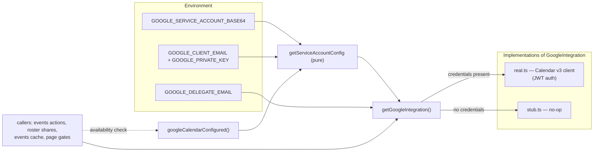

# 1. Google integration layer

All Google Calendar access goes through one interface — `GoogleIntegration` in
`src/lib/google/` — so the app can run, build, and pass CI **without any GCP
credentials** (no-op stub) while production uses a real service-account client.
This document covers the contract, the credential parsing, the selector, the real
client's behavior (auth, error mapping, ACL upserts, event mapping), and what the
stub means for each consumer.

## Table of contents

- [1.1 Problem](#11-problem)
- [1.2 Goals & non-goals](#12-goals--non-goals)
- [1.3 Architecture overview](#13-architecture-overview)
- [1.4 The contract](#14-the-contract)
- [1.5 Credential parsing](#15-credential-parsing)
- [1.6 The selector](#16-the-selector)
- [1.7 The real client](#17-the-real-client)
- [1.8 The stub](#18-the-stub)
- [1.9 Pure helpers & testing](#19-pure-helpers--testing)
- [1.10 File index & related docs](#110-file-index--related-docs)

## 1.1 Problem

The app's event data lives in Google Calendar, but a developer's laptop (and CI)
should not need a GCP service account to build, run, or test the app. The app
therefore needs two interchangeable implementations of the same Google
operations, selected at runtime from the environment — plus a well-defined
"Google is unavailable" surface so callers can refuse work (and tell the user)
instead of silently writing to nothing.

## 1.2 Goals & non-goals

**Goals**

- One interface for calendar lifecycle, event read/write, ACL sharing, and (future)
  email — callers never touch the `googleapis` client directly.
- The app compiles, runs, and passes CI with zero credentials: the stub makes
  every operation resolve successfully with no external side effects.
- Production: a single service account (full `calendar` scope) owns the
  department calendars; per-user access is shared via calendar ACLs.
- Google failures surface as human-readable errors (not raw API errors).
- Callers that must surface "Google is unavailable" check
  `googleCalendarConfigured()` **before** acting.

**Non-goals**

- Gmail is not wired yet: `sendEmail` exists in the contract but the real client
  **throws** ("not implemented yet") so nothing is silently dropped; it needs
  Workspace domain-wide delegation, which is not provisioned.
- No OAuth/user-delegated access — service account only.
- No retry/backoff here: callers (e.g. the mutations' rollback) decide retry
  policy.

## 1.3 Architecture overview



Rule for callers: **never import `real.ts` or `stub.ts` directly** — always go
through `getGoogleIntegration()` / `googleCalendarConfigured()`
(`src/lib/google/index.ts`), so the selection stays in one place.

## 1.4 The contract

`GoogleIntegration` (`src/lib/google/types.ts:45`):

| Method | Purpose | Notes |
| ------ | ------- | ----- |
| `createEvent(input)` | create an event in a calendar | returns `{ id, calendarId, htmlLink? }` |
| `updateEvent(eventId, input)` | full-replace an event | same return shape |
| `deleteEvent(calendarId, eventId)` | delete an event | 404 = no-op |
| `listEvents(calendarId, timeMin, timeMax)` | events overlapping the range | ordered by start time |
| `createCalendar(name)` | new calendar owned by the service account | returns `{ id, calendarId }` |
| `renameCalendar(calendarId, name)` | rename | — |
| `deleteCalendar(calendarId)` | delete | 404 = no-op |
| `listCalendars()` | calendars visible to the account | — |
| `getCalendar(calendarId)` | one calendar or null | 404 = null |
| `setCalendarAccess(calendarId, email, role)` | grant **or update** a user ACL rule | upsert semantics |
| `listCalendarAccess(calendarId)` | user-scope ACL rules | `{ email, role }[]` |
| `removeCalendarAccess(calendarId, email)` | remove a user ACL rule | 404 = no-op |
| `sendEmail(input)` | send on behalf of the delegate | **unimplemented in the real client** |

Payload types (`types.ts`):

- `GcalEventInput` (`:8`) — `calendarId`, `title`, `description?`, `start`, `end`,
  `allDay?`, `attendees?` (unused by the app), `location?`.
- `GcalEventItem` (`:28`) — what reads return: `id`, `calendarId`, `title`,
  `description`, `start`/`end` as `Date`s, `allDay`, `location` (or `""`).
- `GoogleCalendarInfo` (`:40`) — `{ calendarId, name }`.

## 1.5 Credential parsing

`src/lib/google/config.ts` (pure, env injectable, unit-tested):

- **`getServiceAccountConfig(env)`** (`config.ts:21`) — prefers
  `GOOGLE_SERVICE_ACCOUNT_BASE64` (a base64-encoded service-account JSON key; a
  single env var keeps Vercel secret management simple) and reads
  `client_email`/`private_key` from it; a malformed key **falls through** to the
  individual fields rather than failing. Fallback: `GOOGLE_CLIENT_EMAIL` +
  `GOOGLE_PRIVATE_KEY`, with `\\n` in the pasted key unescaped to real newlines
  (keys pasted into env files commonly arrive escaped). Returns `null` when
  nothing usable is configured — including "only one of email/key set".
- **`hasGoogleCredentials(env)`** (`:52`) — the selector's predicate.
- **`getAdminGoogleEmail(env)`** (`:60`) — `GOOGLE_DELEGATE_EMAIL`: the admin
   Google account that gets owner access to every department calendar
   ([`roster-sharing.md` §1.5](roster-sharing.md#15-the-acl-model)).
- **`GOOGLE_CALENDAR_SCOPE`** (`:13`) — the full `calendar` scope.

Why base64-first: on Vercel, a multi-line private key in one env var is fiddly;
base64 collapses the whole JSON key into one line. The individual-field fallback
covers local dev.

## 1.6 The selector

`src/lib/google/index.ts` (26 lines):

```ts
export function googleCalendarConfigured(): boolean {
  return hasGoogleCredentials();
}

export async function getGoogleIntegration(): Promise<GoogleIntegration> {
  return googleCalendarConfigured() ? createRealGoogleIntegration() : stubGoogleIntegration;
}
```

- The decision is per-call (env is read each time) — a credentials change takes
  effect on the next request, no restart needed.
- Callers that must **refuse** work when Google is absent check
  `googleCalendarConfigured()` first and return a user-visible error: the event
  create/update/delete actions ("Google Calendar is not configured"), the
  dashboard's force-refresh button (disabled while unconfigured — a forced
  refresh would cache empties and blank the view), department creation, and the
  shares modal (surfaced as a `syncWarning`).

## 1.7 The real client

`createRealGoogleIntegration()` (`src/lib/google/real.ts:19`) builds a
`googleapis` `calendar_v3` client:

- **Lazy JWT auth** (`:22-36`): the client is constructed on first use from
  `getServiceAccountConfig()` (throws "Google Calendar is not configured" if the
  env vanished mid-process) with the full calendar scope. The returned object
  caches it.
- **Error mapping — `fail(error)`** (`:42-54`): the single choke point for all
  Google failures.

  | HTTP status | Mapped error |
  | ----------- | ------------ |
  | 404 | "Calendar not found in Google Calendar" |
  | 401 / 403 | "Google Calendar access denied — check the service account credentials" |
  | 429 | "Google Calendar is rate limited, please try again later" |
  | other | the original error message, or "Google Calendar request failed" |

- **Calendar lifecycle**: `calendars.insert/update/delete`; `deleteCalendar` and
  `getCalendar` treat 404 as success/null (`:83-118`).
- **Events**:
  - `createEvent`/`updateEvent` build the body with `buildEventBody`
    (`:231-243`): `summary`, `description`, and **`location` always sent (even
    empty)** — an in-app update is a full replace, so an empty location actively
    clears a previously set one. All-day events send `start.date`/`end.date`
    (`YYYY-MM-DD`, exclusive end convention); timed events send `dateTime`
    ISO strings.
  - `deleteEvent` treats 404 as success (`:199-208`).
  - `listEvents` (`:209-223`): `singleEvents: true`, `orderBy: startTime`,
    `maxResults: 2500`; `mapGoogleEvent` (`:251-269`) maps raw events to
    `GcalEventItem` — `allDay = Boolean(event.start.date)`, dates reconstructed
    as UTC-midnight `Date`s for all-day events.
- **ACL sharing** ([`roster-sharing.md`](roster-sharing.md) is the consumer):
  - `setCalendarAccess` (`:120-137`) — **upsert**: finds the existing user-scope
    rule (case-insensitive, `findAclRule` `:286-297`) and `acl.update`s it, else
    `acl.insert`s — so a reader→writer change is an update, not a duplicate.
  - `listCalendarAccess` (`:139-152`) — paginated `acl.list`
    (`listAllAclRules` `:271-283`, 100/page), filtered to user-scope rules with
    non-empty email+role.
  - `removeCalendarAccess` (`:154-166`) — deletes the rule if present; 404 = no-op.
- **`sendEmail`** (`:224-226`) — throws "sendEmail is not implemented yet".

## 1.8 The stub

`stubGoogleIntegration` (`src/lib/google/stub.ts`) resolves every operation
successfully with no external side effects:

| Method | Stub result | Effect on the app (unconfigured) |
| ------ | ----------- | -------------------------------- |
| `createEvent` / `updateEvent` / `createCalendar` | `{ id: "stub", calendarId: "stub" }` | event mutations are **gated** by `googleCalendarConfigured()` and refuse before reaching the stub |
| `deleteEvent` / `renameCalendar` / `deleteCalendar` / `setCalendarAccess` / `removeCalendarAccess` / `sendEmail` | no-op | — |
| `listEvents` | `[]` | calendar views render empty; the month cache caches empties (why the force-refresh button is disabled) |
| `listCalendars` / `listCalendarAccess` | `[]` | no calendars to share; shares modal shows the `syncWarning` |
| `getCalendar` | `null` | — |

The app is designed so the stub degrades **gracefully but visibly**: reads show
empty data, writes are refused with a clear message, and sharing surfaces a
"Google Calendar is not configured — sharing is unavailable" warning instead of
failing.

## 1.9 Pure helpers & testing

| Helper | Module | Tests |
| ------ | ------ | ----- |
| `getServiceAccountConfig` (base64 parse, precedence, `\\n` repair, malformed → null, partial config → null), `hasGoogleCredentials` | `google/config.ts` | `google/config.test.ts` |

The real client and the stub are I/O-bound (Google API / no-ops) and not
unit-tested; the interface itself is the test seam — the rest of the app is
developed and tested against it without credentials.

## 1.10 File index & related docs

| File | Role |
| ---- | ---- |
| `src/lib/google/index.ts` | Selector + `googleCalendarConfigured` |
| `src/lib/google/types.ts` | `GoogleIntegration` contract + payload types |
| `src/lib/google/config.ts` | Credential parsing (pure) |
| `src/lib/google/real.ts` | Calendar v3 client (JWT), error mapping, ACL upserts |
| `src/lib/google/stub.ts` | No-op implementation |
| `src/lib/google/config.test.ts` | Unit tests for config parsing |

Related docs:

- [`event-mutations.md`](event-mutations.md) — the event write path that consumes
  `createEvent`/`updateEvent`/`deleteEvent`.
- [`events-cache.md`](events-cache.md) — the read path that consumes
  `listEvents`.
- [`roster-sharing.md`](roster-sharing.md) — the ACL consumer
  (`setCalendarAccess`/`listCalendarAccess`/`removeCalendarAccess`).
- [`README.md`](../README.md#110-google-integration) — environment variables and
  the stub note.
- `progress.md` — phase write-ups: 1.3.4 (stub), 1.11 (calendars + sharing), 1.41
  (access levels), 1.61 (email-change ACL sync).
