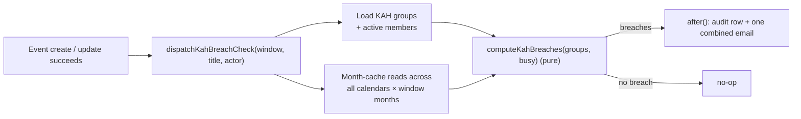
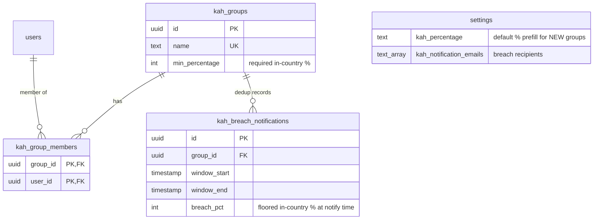
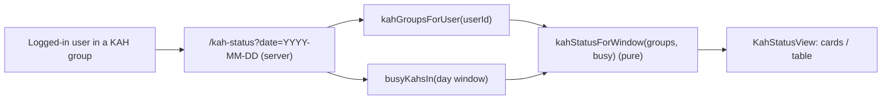

# 1. KAH (Key Appointment Holder) constraints

KAH groups are named sets of important people ("Key Appointment Holders") of which a
required percentage must remain in-country. When an event is created or updated, the app
checks every group over the saved event's time window and notifies configured email
addresses when a group falls below its threshold. **Notification only** — the save itself
never blocks or fails because of KAH.

## Table of contents

- [1.1 What the check does](#11-what-the-check-does)
- [1.2 Data model](#12-data-model)
- [1.3 Breach math](#13-breach-math)
- [1.4 Flow of a mutation](#14-flow-of-a-mutation)
- [1.5 Email delivery](#15-email-delivery)
- [1.6 Admin UI](#16-admin-ui)
- [1.7 User-facing status page](#17-user-facing-status-page)
- [1.8 Files](#18-files)
- [1.9 Deliberate limits & future work](#19-deliberate-limits--future-work)

## 1.1 What the check does

For each enabled group, count how many members are **away** during the saved event's
window, and compare the remaining share against the group's required percentage:



A member is **away** when they are the **creator or an invitee** (`inviteeUsers`) of an
in-app internal event overlapping the window `[event.start, event.end]` **whose location
category is `overseas`** (the `overseas` notes flag; `eventTakesMembersOverseas` in
`src/lib/kah/status.ts`). In-camp events, local out-of-camp events, external events, and
legacy events without the overseas flag never make anyone away — the flag is only written
for events recorded as overseas, so legacy data stays in-country by default. Deactivated
users stop counting even if still listed as members.

## 1.2 Data model



- `kah_group_members` cascades on both FKs: deleting a group or user cleans membership.
- `kah_breach_notifications` stores one row per notified (group × window × breach-pct)
  combination; cascades on `group_id` so deleting a group cleans its dedup history.
- The legacy global `settings.kah_percentage` column is repurposed as the **prefill
  default** for newly created groups (live thresholds live on each row).
- Recipient addresses live once on `settings.kah_notification_emails`
  (Settings → General), shared by all groups; max 10.

## 1.3 Breach math

Pure helpers in `src/lib/kah/check.ts`:

- `actualPct = floor(inCountry / totalMembers × 100)` — floored, so rounding is
  conservative against the requirement.
- A breach is **strictly below**: meeting the percentage exactly is not a breach
  (3 of 5 members = 60% satisfies a 60% requirement).
- Empty groups never breach; duplicate member ids collapse.

Validation/normalization for the forms lives in `src/lib/kah/validate.ts`; the email body
builder in `src/lib/kah/email.ts`. All three modules are pure and unit-tested without a DB.

## 1.4 Flow of a mutation

```mermaid
sequenceDiagram
    participant U as User (event form)
    participant A as createEvent/updateEvent
    participant G as Google Calendar
    participant N as dispatchKahBreachCheck
    participant M as after() queue
    U->>A: submit form values
    A->>G: create/update all copies
    A->>G: invalidateGcalCache (months touched)
    A->>N: register check (window = saved range)
    A-->>U: ok (response never waits for KAH)
    Note over N,M: runs after the response ships,
    after the invalidation above, so its reads see the saved copies
    N->>N: listKahGroupChecks (active members only)
    N->>N: busyKahsIn — getCachedMonthEventsForCalendars over all calendars × window months
    N->>N: computeKahBreaches (pure)
    N->>N: dedup — filter breaches already in kah_breach_notifications
    alt new breaches exist
        N->>N: logAction(kah.breachNotify) — flat human-readable details
        N->>N: insert dedup rows (group × window × pct)
        N->>N: buildKahBreachEmail (one combined message)
        N->>M: integration.sendEmail(to=settings emails)
    end
```

Guarantees:

- Registration order matters: `dispatchKahBreachCheck` is called **after**
  `invalidateGcalCache`, so the month cache refetches include the just-saved copies and
  the edited event counts with its *new* invitees.
- Everything inside the check is wrapped in try/catch and logged — a KAH failure can
  never fail the mutation (same philosophy as webhook delivery).
- `deleteEvent` skips the check: deleting frees people and cannot cause a breach.
- **Dedup:** each (group × window × breach-pct) triggers at most one email. A
  subsequent mutation that doesn't change the breach state is silent. A change in breach
  percentage (worsening or recovery + re-breach) re-notifies.

## 1.5 Email delivery

Transport selection happens at dispatch time (`src/lib/email/send.ts`), first match wins:

1. **Workspace delegation** — `GOOGLE_DELEGATE_EMAIL` set → the integration's real
   `sendEmail`: service-account JWT with the `gmail.send` scope impersonating that
   account (domain-wide delegation; Workspace admins must grant the scope).
2. **SMTP** — `SMTP_URL` set (e.g. a personal Gmail account with an app password, no
   Workspace needed) → nodemailer (`smtp.gmail.com:465`). See `.env.example` for the
   app-password setup.
3. **Neither** → one warn log; the audit row below is still written.

MIME messages for the Gmail path are built by pure `buildTextEmail`
(`src/lib/google/mime.ts`): UTF-8 text, RFC 2047 encoded subject, base64url `raw` for
`users.messages.send`. Without Google credentials the stub logs instead of sending.

One **combined** email per mutation lists every breached group with counts and names;
no addresses configured → audit row still written, email skipped.

### 1.5.1 Customizable templates

Subject and body come from admin-editable settings columns
(`kah_email_subject_template` / `kah_email_body_template`, edited in Settings → General
with a live preview rendered by the same pure renderer). Tokens, substituted
case-insensitively; unknown tokens stay literal:

| Token | Value |
| --- | --- |
| `{event}` | The rendered Google Calendar title of the saved event |
| `{actor}` | Display name of the user who saved it |
| `{window}` | The checked window, UTC+8 wall clock |
| `{breaches}` | One `- Group: X% in country … away: names` line per breached group |

The body must contain `{breaches}` (validated in the form); blank stored templates fall
back to the shipped defaults in `emailDefaults.ts`, whose strings must stay identical to
the schema column defaults (guarded by a unit test).

## 1.6 Admin UI

- **Settings → KAH Groups** (`/settings/kah-groups`): table (desktop) / cards (mobile) of
  groups with name, required %, members. Create/edit modal: name, required-% NumberInput
  prefilled from the settings default, and members picked through the shared badge dialog
  (`UserSelectModal`, active users grouped by department). Delete asks for confirmation.
  All mutations are audited (`kahGroup.create/update/delete`) with member display names.
- **Settings → General → KAH Breach Notifications**: `TagsInput` recipient list plus
  subject/body template fields with a live preview (sample breach data rendered through
  `renderKahEmailTemplate`), validated by `validateKahNotificationsForm`, saved by one
  audited `updateKahNotifications` action (`settings.update`).
- The tab is registered in `SettingsTabs.tsx` between Quick Links and Banner.

## 1.7 User-facing status page

Regular users — especially KAH members — can check their group's live in-country
standing from a read-only **KAH Status** page (`/kah-status`), reached from the
bottom nav / desktop sidebar (the entry appears **only for users who belong to at
least one KAH group**; the server passes `hasKahGroup` into `AppShellShell` so it
can't flicker). It answers "is my group OK today?" before acting on leave/events —
the same data the notify-only breach check reasons about, but shown proactively.



- The window is a full selected day (default today; only an explicit `?date=`
  wins, mirroring `/parade-state`). Confirmed color bands: **green** at/above the
  requirement, **amber** below it but within 10 points, **red** below it by more
  than 10 points. Away members are listed inline.
- Every calendar read goes through the existing month cache (60s fresh / 30min
  SWR), NEVER raw `listEvents` — same freshness/consistency as the dashboard, no
  forced blocking refresh.
- Shared plumbing lives in `src/lib/kah/status.ts` (`listKahGroupChecks`,
  `busyKahsIn`, `kahStatusForWindow`, `kahGroupsForUser`, `userHasKahGroup`,
  `resolveUserNames`); the notify path imports the first two from here so the two
  never diverge on who counts as a member or away.

## 1.8 Files

| File | Role |
| --- | --- |
| `src/db/schema.ts` | `kahGroups`, `kahGroupMembers`, `kahBreachNotifications`, repurposed `settings.kahPercentage` |
| `src/lib/kah/check.ts` | Pure breach math (`computeKahBreaches`, `inCountryPercentage`) |
| `src/lib/kah/validate.ts` | Pure form validation/normalization |
| `src/lib/kah/email.ts` | Pure template renderer + combined breach-email builder |
| `src/lib/kah/emailDefaults.ts` | Default subject/body templates shared with the schema defaults |
| `src/lib/kah/queries.ts` | Group + member reads for the tab |
| `src/lib/kah/status.ts` | Shared status reads: member groups, `busyKahsIn`, pure `kahStatusForWindow`, `userHasKahGroup` |
| `src/lib/kah/actions.ts` | Audited group CRUD server actions |
| `src/lib/kah/notify.ts` | `dispatchKahBreachCheck` — check, audit, email (imports reads from `status.ts`) |
| `src/app/(protected)/kah-status/{page,loading,KahStatusView}.tsx` | Read-only user-facing status page with day selector |
| `src/components/AppShellShell.tsx` | Conditional KAH Status nav entry (`hasKahGroup`) |
| `src/lib/email/send.ts` | Transport selection: Workspace delegation → SMTP → warn |
| `src/lib/email/smtp.ts` | Pure `SMTP_URL` parser + nodemailer sender |
| `src/lib/events/actions.ts` | Hook call sites in `createEvent` / `updateEvent` |
| `src/lib/google/{mime,config,real,stub}.ts` | MIME builder, scopes, real/stub `sendEmail` |
| `drizzle/0022_*.sql` | Migration creating the two KAH tables |
| `drizzle/0024_*.sql` | Migration adding `kah_breach_notifications` dedup table |

## 1.9 Deliberate limits & future work

- **Notify-only** — there is deliberately no hard block on saving breaching events.
  The status page is similarly read-only: it never blocks or changes anything.
- The check runs only at mutation time over the saved event's own window / the
  status page's selected day; it does not continuously monitor "right now" apart
  from whatever day is open, nor evaluate other windows automatically.
- Away-ness is tied to the **overseas** location category (see §1.1) — the busy-set
  computation filters on the overseas notes flag (`eventTakesMembersOverseas`) rather
  than counting every tagged event; if finer rules are needed later, extend that pure
  filter rather than changing `computeKahBreaches`.
- **Dedup** via `kah_breach_notifications`: each (group × window × breach-pct)
  combination triggers at most one email. The table is append-only during normal
  operation; rows cascade-delete when a group is removed.
- **Not yet built:** a per-day forecast over a date range (same computation, wider
  window) and a past-breach history view from `kah_breach_notifications`.
