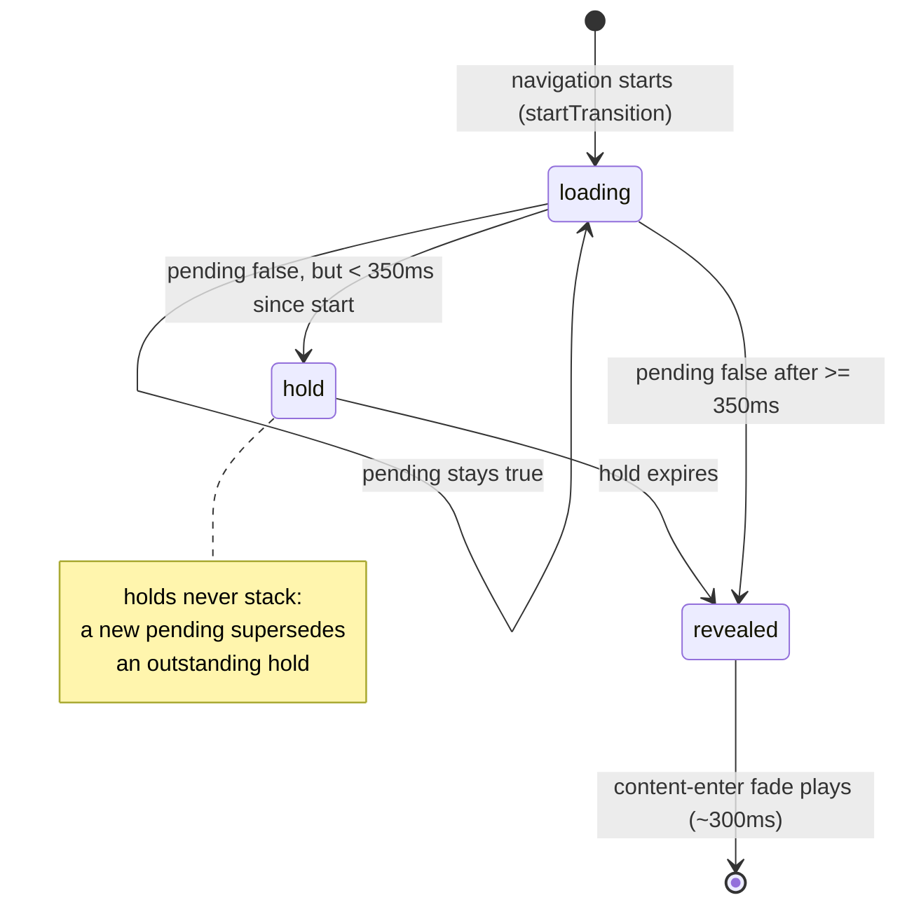
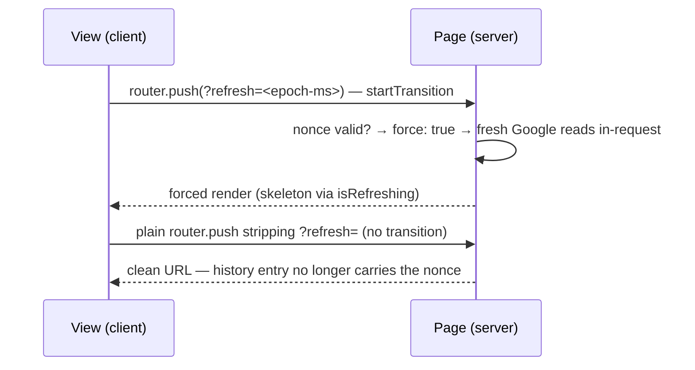

# 1. Loading & transitions

The app renders data-heavy pages (a month of Google Calendar events behind a
server cache) on small mobile screens, where a flash-of-skeleton or a content
hard-cut reads as jank. This document describes the standard **loading
appearance** — skeleton only, minimum hold, fade-in on reveal — and the
**one-shot URL param** pattern (`?edit=` / `?refresh=` / `?_fresh=`) that
drives forced renders without polluting history. The rules here are canonical
for the repo (see also the checklist bullet in `AGENTS.md`); this is the
reference for *why* each piece exists and where it is wired.

## Table of contents

- [1.1 Problem](#11-problem)
- [1.2 Goals & non-goals](#12-goals--non-goals)
- [1.3 The standard sequence](#13-the-standard-sequence)
- [1.4 Route-level loading](#14-route-level-loading)
- [1.5 Minimum skeleton hold](#15-minimum-skeleton-hold)
- [1.6 Reveal fade](#16-reveal-fade)
- [1.7 One-shot URL params](#17-one-shot-url-params)
- [1.8 No-op navigations & in-page exceptions](#18-no-op-navigations--in-page-exceptions)
- [1.9 Mutations are out of scope](#19-mutations-are-out-of-scope)
- [1.10 Usage inventory](#110-usage-inventory)
- [1.11 File index & related docs](#111-file-index--related-docs)

## 1.1 Problem

Three failure modes, all observed before this system existed:

- **Skeleton flash**: with warm data (L1 cache hit, or the no-op Google stub in
  dev) an RSC round-trip can land in well under 100 ms. Showing a skeleton for
  that long flashes and makes the content swap read as a hard cut, not a
  load.
- **Scroll position loss**: the dashboard's week/schedule `ScrollArea` is
  horizontally scrollable; remounting the container to reveal content (the
  naive `loading ? <Skeleton/> : <Content/>` with remounting children) drops
  the user's scroll position on every navigation.
- **Stale one-shot params**: `?edit=`/`?refresh=`-style params that force a
  special render must not survive into back/forward history — otherwise a
  back navigation re-triggers the forced behavior.

## 1.2 Goals & non-goals

**Goals**

- **The skeleton is the only loading indicator** — content is never dimmed or
  darkened while loading (the `opacity: isPending ? 0.6 : 1` pattern is banned).
- Every skeleton→content reveal reads as a deliberate, perceptible sequence,
  even for sub-100 ms loads (minimum hold, §1.5).
- Content fades in over ~300 ms on reveal, **and** on cold first paint — the
  class ships in the SSR HTML, so no JS is needed for the first fade
  (§1.6).
- Containers that must not remount (scroll position) keep their identity; the
  animation is restarted on them, not the DOM (§1.6).
- One-shot params force exactly one render and strip themselves out of the
  URL, so history entries stay clean (§1.7).
- Reduced-motion users get the hard swap: all animation lives inside
  `@media (prefers-reduced-motion: no-preference)`.

**Non-goals**

- No progress bars, no percentages, no per-resource loading states.
- Mutations (server actions) do not use skeletons at all — the button's loader
  covers them (§1.9).
- Not a data cache: freshness/invalidation is
  [`events-cache.md`](events-cache.md)'s job; this doc only describes the
  *appearance* of a load.

## 1.3 The standard sequence

1. A **data navigation** (view/tab/date/month/filter change that changes the
   server fetch) runs inside `startTransition`; the route's `loading.tsx`
   (or the in-page skeleton swap) shows while `isPending`.
2. `useMinSkeletonHold` extends the hold to a minimum of
   `MIN_SKELETON_HOLD_MS` (350 ms) from the load's start.
3. On reveal, `useContentEnter` (or the SSR-shipped class) plays the
   `content-enter` fade.
4. URL-only changes (one-shot param strips, in-month day sync) use **plain
   `router.push` outside `startTransition`** — no pending flag, no skeleton,
   no fade.

## 1.4 Route-level loading

Every route segment that awaits data has a `loading.tsx` (the automatic
Suspense fallback), shaped to match the real content:

| Segment | `loading.tsx` |
| ------- | ------------- |
| `(protected)/dashboard` | tab-bar + toolbar skeletons + `MonthGridSkeleton` (row count from `monthGridRows(currentMonth())`, so the skeleton matches the real grid height) |
| `(protected)/parade-state` | day card + rows from `paradeStateSkeleton.tsx` |
| `(protected)/contacts` | list skeleton |
| `(protected)/settings/users` | user card skeletons |
| `(protected)/settings/audit-log` | search bar + 4 × `AuditLogRowSkeleton` |
| `(protected)/settings/templates` | form skeleton |
| `(protected)/settings/departments` | card skeletons |
| `(protected)/settings/event-types` | card skeletons |
| `(protected)/settings/general` | form skeleton |

The row/card skeletons are extracted into small **shared components** so the
route fallback and the in-page swap stay in sync: `dashboard/calendarSkeleton.tsx`
(`MonthGridSkeleton`), `parade-state/paradeStateSkeleton.tsx`,
`settings/audit-log/AuditLogRowSkeleton.tsx`.

The committed content's root carries `CONTENT_ENTER_CLASS`
(`src/lib/loading/contentEnter.ts:12`): the class ships in the SSR HTML, so
the fade plays on first paint (no JS, no hydration flash), segment remounts
replay it, and `router.refresh()` mutations don't remount — so they never
replay it.

## 1.5 Minimum skeleton hold

`useMinSkeletonHold(pending, holdMs = 350)`
(`src/lib/loading/minHoldLoading.ts:24`):

- Returns `pending || holdRemaining`. While `pending`, it records
  `performance.now()` on the rising edge. When the load ends early,
  `holdRemaining` stays true until `holdMs` have elapsed since the start.
- **Holds never stack**: a new `pending` supersedes any outstanding hold —
  fast consecutive navigations each hold from their own start, so the
  skeleton can't accumulate delays.
- Timing uses `performance.now()` **in effects only**, so SSR renders are
  unaffected.
- The 350 ms constant is `MIN_SKELETON_HOLD_MS` (`:12`) — deliberately long
  enough to read as a deliberate pause, short enough not to feel slow.

Callers gate their *in-page* skeleton on the held value, e.g.
`gridLoading = useMinSkeletonHold(isPending || isRefreshing)`
(`DashboardView.tsx:418`) — the force-refresh transition's `isRefreshing`
participates in the same hold.

## 1.6 Reveal fade

**Cold mount**: `CONTENT_ENTER_CLASS` on the content root (see §1.4). The
animation is `content-enter` — `opacity: 0 → 1`, 300 ms ease-out
(`src/app/globals.css:1-5, 31-34`) — inside the
`prefers-reduced-motion: no-preference` guard.

**In-page reveal into a stable container**: the dashboard's week/schedule
`ScrollArea` must **not** remount across navigations (it owns the horizontal
scroll position), so the fade can't be restarted by unmounting.
`useContentEnter(ref, shown)` (`src/lib/loading/contentEnter.ts:27`) instead:

- watches `shown` (i.e. `!loading`) and, on a `false → true` flip,
- removes the class, forces a style flush (`void el.offsetWidth`), and
  re-adds it — restarting the one-shot CSS animation;
- runs in `useLayoutEffect`, so it happens **before paint**: the reveal frame
  already shows the fade at frame 0 instead of a fully-opaque flash;
- skips the first mount (`prev === null`) — the SSR-shipped class is already
  playing there.

Related CSS in `globals.css`: the agenda day's directional slide-in
(`agenda-slide-next`/`agenda-slide-prev`, `:9-29, 36-42`) — the in-month day
change plays the slide *instead* of the skeleton (§1.8).

## 1.7 One-shot URL params

Three params force a special render for exactly one request, then strip
themselves. All strips are plain `router.push` **outside** `startTransition`
(no skeleton, no fade), and all are ref-guarded or self-terminating so a
stale history entry can't re-trigger the behavior.

| Param | Purpose | Validity | Stripped by |
| ----- | ------- | -------- | ----------- |
| `?edit=<uuid>` | open the event's edit form (deep link from the `Edit:` note line) | `isUuid` — anything else ignored (`dashboard/page.tsx:42-43`); the link's `date` pins the fetched month; the remembered-UI-state cookie is skipped for the render ([`ui-state.md`](ui-state.md)) | ref-guarded effect after the forced render mounts (`DashboardView.tsx:621-631`) — a refresh won't reopen the form |
| `?refresh=<epoch-ms>` | force-refresh: bypass the cache freshness windows and block on fresh Google reads **inside the same RSC request** | finite number younger than `REFRESH_NONCE_TTL_MS` (5 min, `page.tsx:29,93-95`) — a stale history entry can't silently re-force (`events-cache.md` §1.5.1) | self-terminating effect (`DashboardView.tsx:633-644`) — a ref guard would leak a second nonce if refresh is clicked before the first strip lands |
| `?_fresh=1` | skip the remembered-UI-state cookie for this one render (a navigation that *removed* remembered keys — Clear, tab switch — must not re-apply the now-stale cookie) | any value — presence is enough (`dashboard/page.tsx:51`, `parade-state/page.tsx:32`) | self-terminating effect after mount (`DashboardView.tsx:611-619`, `ParadeStateView.tsx:238-246`) |

Injection of `_fresh` is automatic: `navigate()` checks
`freshMarkerNeeded(updates, STATE_KEYS)` (a remembered key set to `null`) and
adds the marker to that one navigation ([`ui-state.md` §1.9](ui-state.md#19-the-_fresh-one-shot-marker)).

Doing the forced work **inside the same RSC render** (rather than
invalidate-then-`router.refresh()`) guarantees the response carries the
just-fetched data — a separate re-read could be served by another instance
whose warm L1 entry still shadows the fresh rows
([`events-cache.md` §1.5.1](events-cache.md#151-force-refresh-manual-one-shot)).

## 1.8 No-op navigations & in-page exceptions

- **No-op guard**: `navigate()` builds the href and returns early when it
  equals the current URL — tapping "Today" while already there doesn't run a
  transition or flash the skeleton (`DashboardView.tsx:589-595`).
- **Parade state**: in-month day switches and filter applies update from local
  state optimistically (already correct), so they show no skeleton; only a
  cross-month switch (the server must fetch the new month) is a data
  navigation — hence `useMinSkeletonHold(initialMonth !== month)`
  (`ParadeStateView.tsx:141`).
- **Dashboard Agenda tab**: in-month day changes (swipe/chevrons/Today/picker)
  apply to local state instantly and sync `?date=` with a plain no-transition
  push; the new day plays the **directional slide-in** classes instead of the
  skeleton. Only a cross-month change is a data navigation with the skeleton
  (`DashboardView.tsx:738-757`).

## 1.9 Mutations are out of scope

A `router.refresh()` after a server action is **not** wrapped in a transition:
the button's own loader covers it (Mantine `loading` +
`loaderProps={BUTTON_LOADER_PROPS}`; `form.submitting` for form submits). No
skeleton, no fade — the content stays put while the data updates in place,
and the non-remounting container means `useContentEnter` never replays.

## 1.10 Usage inventory

| Consumer | Minimum hold | Reveal fade | Notes |
| -------- | ------------ | ----------- | ----- |
| `DashboardView` (week/schedule grid) | `useMinSkeletonHold(isPending \|\| isRefreshing)` (`:418`) | `useContentEnter(weekBoxRef, …)` (`:419`) | stable `ScrollArea` keeps scroll position; force-refresh participates in the hold |
| `ParadeStateView` | `useMinSkeletonHold(initialMonth !== month)` (`:141`) | `useContentEnter` (`:143`) | in-month changes are optimistic — no skeleton |
| `AuditLogView` | `useMinSkeletonHold(isPending)` (`:93`) | `useContentEnter` (`:95`) | filter navigations; no-op guard skips the transition |
| `SettingsForm`, `DepartmentTable`, `ContactList`, `UserTable`, `EventTypeTable`, `TemplatesForm` | — | static `CONTENT_ENTER_CLASS` on the content root | server-rendered pages; the SSR fade plays on first paint |
| all nine route segments | — | `loading.tsx` skeletons | §1.4 table |

## 1.11 File index & related docs

| File | Role |
| ---- | ---- |
| `src/lib/loading/minHoldLoading.ts` | `useMinSkeletonHold` + `MIN_SKELETON_HOLD_MS` |
| `src/lib/loading/contentEnter.ts` | `CONTENT_ENTER_CLASS` + `useContentEnter` |
| `src/app/globals.css` | `content-enter` / `agenda-slide-*` keyframes, reduced-motion guard |
| `src/app/(protected)/*/loading.tsx` | Route-level skeletons (9 segments) |
| `src/app/(protected)/dashboard/calendarSkeleton.tsx` | `MonthGridSkeleton` (shared by route + in-page) |
| `src/app/(protected)/parade-state/paradeStateSkeleton.tsx` | Parade row skeletons (shared) |
| `src/app/(protected)/settings/audit-log/AuditLogRowSkeleton.tsx` | Audit row skeleton (shared) |
| `src/app/(protected)/dashboard/DashboardView.tsx` | Held loading, reveal fade, one-shot strips (`edit`/`refresh`/`_fresh`), agenda slide |
| `src/app/(protected)/parade-state/ParadeStateView.tsx` | Month-gated hold, `_fresh` inject/strip |
| `src/app/(protected)/dashboard/page.tsx` | `?edit=`/`?refresh=` nonce validation |

Related docs:

- [`ui-state.md`](ui-state.md) — the `?_fresh` marker's role in remembered-state
  removals.
- [`events-cache.md`](events-cache.md) — what the loads load (the month cache)
  and the force-refresh mechanism.
- `AGENTS.md` — the "Standard loading appearance" checklist (canonical rules).
- [`README.md`](../README.md#112-documentation) — documentation index.
- `progress.md` — phase write-ups: 1.52/1.53 (stale-while-navigating grid,
  cold-load reveal), 1.58/1.59 (skeleton-only loading across the app), 1.64/1.65
  (agenda slide-in).
