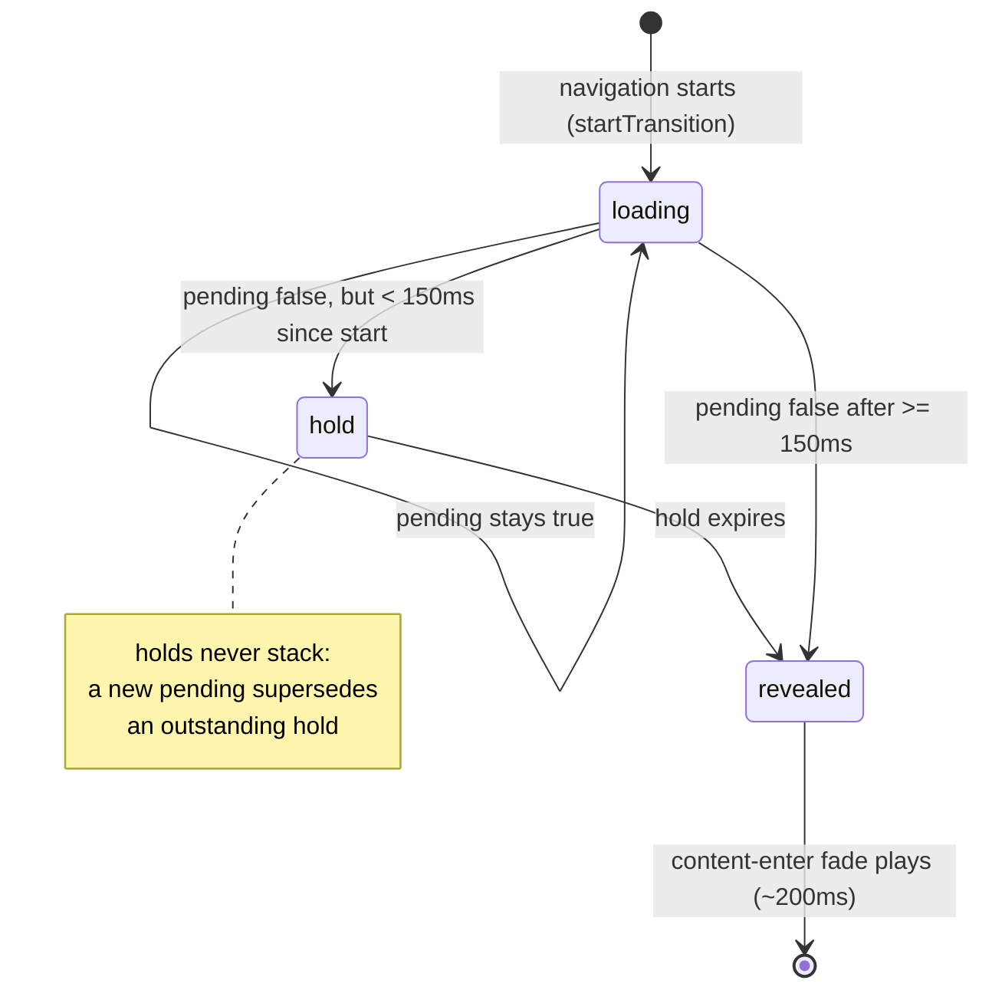
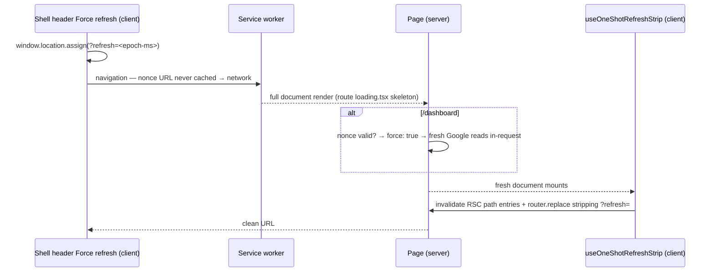
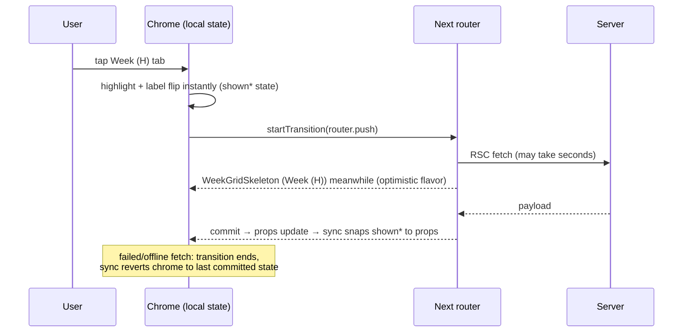
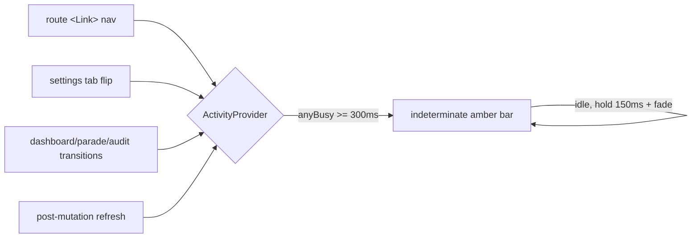
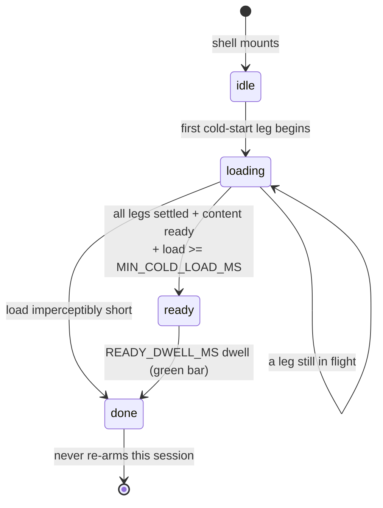

# 1. Loading & transitions

The app renders data-heavy pages (a month of Google Calendar events behind a
server cache) on small mobile screens, where a flash-of-skeleton or a content
hard-cut reads as jank. This document describes the standard **loading
appearance** — skeleton only, minimum hold, fade-in on reveal — the
**optimistic navigation chrome** that keeps controls answering instantly while
data loads (§1.9), and the **one-shot URL param** pattern (`?event=` /
`?edit=` / `?refresh=`) that drives forced renders without
polluting history. The rules here are canonical for the repo (see also the checklist
bullet in `AGENTS.md`); this is the reference for *why* each piece exists and
where it is wired.

## Table of contents

- [1.1 Problem](#11-problem)
- [1.2 Goals & non-goals](#12-goals--non-goals)
- [1.3 The standard sequence](#13-the-standard-sequence)
- [1.4 Route-level loading](#14-route-level-loading)
- [1.5 Minimum skeleton hold](#15-minimum-skeleton-hold)
- [1.6 Reveal fade](#16-reveal-fade)
- [1.7 One-shot URL params](#17-one-shot-url-params)
- [1.8 No-op navigations & in-page exceptions](#18-no-op-navigations--in-page-exceptions)
- [1.9 Optimistic navigation chrome](#19-optimistic-navigation-chrome)
- [1.10 Client-router reuse window](#110-client-router-reuse-window)
- [1.11 Mutations are out of scope](#111-mutations-are-out-of-scope)
- [1.12 Usage inventory](#112-usage-inventory)
- [1.13 Global activity bar](#113-global-activity-bar)
- [1.13.1 Cold-start readiness](#1131-cold-start-readiness)
- [1.13.2 Per-view tab load indicator](#1132-per-view-tab-load-indicator)
- [1.14 Route-change page transition](#114-route-change-page-transition)
- [1.15 File index & related docs](#115-file-index--related-docs)

## 1.1 Problem

Three failure modes, all observed before this system existed:

- **Skeleton flash**: with warm data (L1 cache hit, or the no-op Google stub in
  dev) an RSC round-trip can land in well under 100 ms. Showing a skeleton for
  that long flashes and makes the content swap read as a hard cut, not a
  load.
- **Scroll position loss**: the dashboard's week/schedule `ScrollArea` is
  horizontally scrollable; remounting the container to reveal content (the
  naive `loading ? <Skeleton/> : <Content/>` with remounting children) drops
  the user's scroll position on every navigation.
- **Stale one-shot params**: `?edit=`/`?refresh=`-style params that force a
  special render must not survive into back/forward history — otherwise a
  back navigation re-triggers the forced behavior.

## 1.2 Goals & non-goals

**Goals**

- **The skeleton is the only loading indicator** — content is never dimmed or
  darkened while loading (the `opacity: isPending ? 0.6 : 1` pattern is banned).
- Every skeleton→content reveal reads as a deliberate, perceptible sequence,
  even for sub-100 ms loads (minimum hold, §1.5).
- Content fades in over ~200 ms on reveal, **and** on cold first paint — the
  class ships in the SSR HTML, so no JS is needed for the first fade
  (§1.6).
- Containers that must not remount (scroll position) keep their identity; the
  animation is restarted on them, not the DOM (§1.6).
- One-shot params force exactly one render and strip themselves out of the
  URL, so history entries stay clean (§1.7).
- Reduced-motion users get the hard swap: all animation lives inside
  `@media (prefers-reduced-motion: no-preference)`.

**Non-goals**

- **No per-resource loading states** — no percentages, no bounded progress fills
  tied to a measure of completion. The one sanctioned exception is the shared
  **indeterminate activity bar** (§1.13): a single glanceable strip that says
  "something in the chrome is busy" without pretending to know how much is left.
- Mutations (server actions) do not use skeletons at all — the button's loader
  covers them (§1.9), and the `router.refresh()` that follows is now surfaced by
  the activity bar (§1.13).
- Not a data cache: freshness/invalidation is
  [`events-cache.md`](events-cache.md)'s job; this doc only describes the
  *appearance* of a load.

## 1.3 The standard sequence


```mermaid
stateDiagram-v2
 [*] --> loading: navigation starts (startTransition)
 loading --> loading: pending stays true
 loading --> hold: pending false, but < 150ms since start
 hold --> revealed: hold expires
 loading --> revealed: pending false after >= 150ms
 revealed --> [*]: content-enter fade plays (~200ms)
 note right of hold
 holds never stack:
 a new pending supersedes
 an outstanding hold
 end note
```

1. A **data navigation** (view/tab/date/month/filter change that changes the
 server fetch) runs inside `startTransition`; the route's `loading.tsx`
 (or the in-page skeleton swap) shows while `isPending`.
2. `useMinSkeletonHold` extends the hold to a minimum of
 `MIN_SKELETON_HOLD_MS` (150 ms) from the load's start.
3. On reveal, `useContentEnter` (or the SSR-shipped class) plays the
 `content-enter` fade.
4. URL-only changes (one-shot param strips, in-month day sync) use **plain
 `router.push` outside `startTransition`** — no pending flag, no skeleton,
 no fade.

## 1.4 Route-level loading

Every route segment that awaits data has a `loading.tsx` (the automatic
Suspense fallback), shaped to match the real content:

| Segment | `loading.tsx` |
| ------- | ------------- |
| `(protected)/dashboard` | one plain full-page skeleton box. Views are on-demand tabs whose renderer kind is only known after the server resolves the active tab (and loading files receive no URL props), so the route skeleton can no longer shape to a kind — the in-page transition skeletons inside `DashboardView` still do |
| `(protected)/parade-state` | day card + rows from `paradeStateSkeleton.tsx` |
| `(protected)/contacts` | list skeleton |
| `(protected)/settings/users` | user card skeletons |
| `(protected)/settings/audit-log` | search bar + 4 × `AuditLogRowSkeleton` |
| `(protected)/settings/templates` | form skeleton |
| `(protected)/settings/departments` | card skeletons |
| `(protected)/settings/event-types` | card skeletons |
| `(protected)/settings/general` | form skeleton |
| `(protected)/settings/security` | form skeleton |
| `(protected)/settings/webhooks` | card list (mobile) + `SettingsTableSkeleton` (desktop) |
| `(protected)/settings/quick-links` | card list (mobile) + `SettingsTableSkeleton` (desktop) |
| `(protected)/settings/banner` | form skeleton |
| `(protected)/settings/kah-groups` | card list (mobile) + `SettingsTableSkeleton` (desktop) |
| `(protected)/kah-status` | episode cards (mobile) + `SettingsTableSkeleton` (desktop) |
| `(protected)/double-booking` | header + scan-result card skeleton |

The `(protected)` **layout awaits only the banner read (a cheap single-row
SELECT, in parallel with the JWT-only session) before rendering the AppShell** —
the announcement banner is passed to the shell as a resolved prop so the header
carries it from first paint — while the **KAH-status probe is streamed** inside a
`<Suspense>` slot. The shell chrome + the route skeleton above paint as soon as
the session resolves; a Neon scale-to-zero cold start never holds up the Android
PWA splash (the precached launch shell covers that wait — §1.5.1). See
[`announcement-banner.md`](announcement-banner.md) §1.1/§1.3.

The row/card skeletons are extracted into small **shared components** so the
route fallback and the in-page swap stay in sync: `dashboard/calendarSkeleton.tsx`
(all five view grids — `MonthGridSkeleton`, `WeekMatrixSkeleton` (Week (D)
matrix), `WeekGridSkeleton` (Week (H)), `AgendaListSkeleton`, `ScheduleGridSkeleton`;
used by the dashboard's **in-page** kind-shaped transitions, not the plain-box
route fallback), `parade-state/paradeStateSkeleton.tsx`,
`settings/audit-log/AuditLogRowSkeleton.tsx`.

The PWA **launch shell** (`public/loading.html`, served unconditionally by the
service worker for the start URL) mirrors that plain-box route skeleton — one
neutral full-page loading block with Mantine's exact palette values and pulse,
brand-bar header, bottom-nav placeholders — so the handoff from the precached
shell reads as **one continuous loading surface** whatever page the launch
resolves to (it cannot know the arriving dashboard tab's kind, and non-dashboard
targets share the same chrome anyway): it either hands off to the
document route's cached copy (served instantly, at any age) or, when nothing is
cached, stays painted while the network read runs behind it, then gives way to
the streamed `loading.tsx` fallback. Every launch paints the shell — the launch
route never redirects, because on a cold launch nothing else has painted yet
(`pwa-offline.md` §1.5.1). `launchShell.test.ts` guards the drift.

Every skeleton block also includes a **`LoadingStatus`**
(`src/components/LoadingStatus.tsx`): a sr-only `role="status"` announcement
("Loading calendar…" etc.), since skeletons are visual-only. Server-safe, so
the same component serves the route `loading.tsx` files and the client-side
skeleton swaps (dashboard `gridLoading`, parade-state `contentLoading`,
audit-log `listLoading`, pinned-events panel). See
[`accessibility.md`](accessibility.md) §1.3.

The committed content's root carries `CONTENT_ENTER_CLASS`
(`src/lib/loading/contentEnter.ts`): the class ships in the SSR HTML, so
the fade plays on first paint (no JS, no hydration flash), segment remounts
replay it, and `router.refresh()` mutations don't remount — so they never
replay it.

## 1.5 Minimum skeleton hold

`useMinSkeletonHold(pending, holdMs = 150)`
(`src/lib/loading/minHoldLoading.ts`):

- Returns `pending || holdRemaining`. While `pending`, it records
  `performance.now()` on the rising edge. When the load ends early,
  `holdRemaining` stays true until `holdMs` have elapsed since the start.
- **Holds never stack**: a new `pending` supersedes any outstanding hold —
  fast consecutive navigations each hold from their own start, so the
  skeleton can't accumulate delays.
- Timing uses `performance.now()` **in a layout effect only**, so SSR renders
  are unaffected. The layout effect is deliberate: it engages the hold on the
  render where `pending` flips false **before the browser paints**, so the
  just-loaded content is never shown for a single frame between the skeleton and
  the held skeleton (a passive `useEffect` let that one-frame flash through —
  same reasoning as `useContentEnter`, §1.6).
- The 150 ms constant is `MIN_SKELETON_HOLD_MS` — long enough to read as a
  deliberate beat, short enough not to feel slow (most warm revisits skip the
  skeleton entirely via the device cache, so this only shapes first-time loads).

Callers gate their *in-page* skeleton on the held value, e.g.
`gridLoading = useMinSkeletonHold(isNavigating)` (`DashboardView.tsx`) — data
navigations only. Force refresh no longer participates: the header button
reloads the whole document, so its wait is the route `loading.tsx` skeleton
(§1.4), not this hold.

## 1.6 Reveal fade

**Cold mount**: `CONTENT_ENTER_CLASS` on the content root (see §1.4). The
animation is `content-enter` — `opacity: 0 → 1`, 200 ms ease-out
(`src/app/globals.css`) — inside the
`prefers-reduced-motion: no-preference` guard.

**In-page reveal into a stable container**: the dashboard's week/schedule
`ScrollArea` must **not** remount across navigations (it owns the horizontal
scroll position), so the fade can't be restarted by unmounting.
`useContentEnter(ref, shown)` (`src/lib/loading/contentEnter.ts`) instead:

- watches `shown` (i.e. `!loading`) and, on a `false → true` flip,
- removes the class, forces a style flush (`void el.offsetWidth`), and
  re-adds it — restarting the one-shot CSS animation;
- runs in `useLayoutEffect`, so it happens **before paint**: the reveal frame
  already shows the fade at frame 0 instead of a fully-opaque flash;
- skips the first mount (`prev === null`) — the SSR-shipped class is already
  playing there.

Related CSS in `globals.css`: the agenda day's directional slide-in
(`agenda-slide-next`/`agenda-slide-prev`) — the in-month day
change plays the slide *instead* of the skeleton (§1.8).

## 1.7 One-shot URL params

Three params force a special render for exactly one request, then strip
themselves. All strips run **outside** `startTransition` (no skeleton, no
fade), and all are ref-guarded or self-terminating so a stale history entry
can't re-trigger the behavior. The `edit`/`event` strips are plain
`router.push`; the `refresh` strip is a **global** per-document `router.replace` that first
clears the pathname's RSC cache entries (`useOneShotRefreshStrip`,
`src/lib/pwa/client.ts`, mounted in `AppShellShell` — a plain replace back to
the bare URL would be answered by the stale client-router/SW RSC snapshot saved
before the special render: undone edits, resurrected filters, an old nonce
still forcing). None of the three is ever written to the document/RSC caches
([`pwa-offline.md`](pwa-offline.md) — `ONE_SHOT_PARAMS`).

| Param | Purpose | Validity | Stripped by |
| ----- | ------- | -------- | ----------- |
| `?event=<uuid>` | open the event's details modal (deep link from the Google Calendar `Edit:` note line, Pinned Events, event search; `_eventCal` names the target's calendar so the server resolves that one event separately) | `isUuid` — anything else ignored (`dashboard/page.tsx`); the link's `date` pins the fetched period; the render keeps the active tab (search carries `?view=`) and its filters — the grid's filtered `events` are never widened, the target rides as `deepLinkEvent` | ref-guarded effect after the forced render mounts (`DashboardView.tsx`) — a refresh won't reopen the modal; re-arms once stripped so the same event can open again; a same-period link (which doesn't refetch on its own) triggers a ref-guarded one-shot refetch in `DashboardScreen.tsx` |
| `?edit=<uuid>` | open the event's edit form directly (the event search modal's "Edit" action) | `isUuid` — anything else ignored (`dashboard/page.tsx`); the link's `date` pins the fetched month; the render reads the remembered-UI-state cookie | ref-guarded effect after the forced render mounts (`DashboardView.tsx`) — a refresh won't reopen the form |
| `?refresh=<epoch-ms>` | Force refresh (header button, every page): a **full page reload** to the nonce URL — the SW never caches it, so every page gets a network render; on the dashboard the server additionally bypasses the events-cache freshness windows and blocks on fresh Google reads **inside the same request** | finite number younger than `REFRESH_NONCE_TTL_MS` (5 min, `page.tsx`) — a stale history entry can't silently re-force (`events-cache.md` §1.5.1) | `useOneShotRefreshStrip` after the reloaded document mounts (`src/lib/pwa/client.ts`, mounted in `AppShellShell`) — clears the pathname's RSC entries first, then `router.replace`s to the clean URL (once per document load) |


```mermaid
sequenceDiagram
 participant V as Shell header Force refresh (client)
 participant SW as Service worker
 participant P as Page (server)
 participant R as useOneShotRefreshStrip (client)
 V->>V: window.location.assign(?refresh=<epoch-ms>)
 V->>SW: navigation — nonce URL never cached → network
 SW-->>P: full document render (route loading.tsx skeleton)
 alt /dashboard
 P->>P: nonce valid? → force: true → fresh Google reads in-request
 end
 P-->>R: fresh document mounts
 R->>P: invalidate RSC path entries + router.replace stripping ?refresh=
 P-->>V: clean URL
```

Doing the forced work **inside the same request** (rather than
invalidate-then-`router.refresh()`) guarantees the response carries the
just-fetched data — a separate re-read could be served by another instance
whose warm L1 entry still shadows the fresh rows
([`events-cache.md` §1.5.1](events-cache.md#151-force-refresh-manual-one-shot)).

## 1.8 No-op navigations & in-page exceptions

- **No-op guard**: `navigate()` builds the href and returns early when it
  equals the current URL — tapping "Today" while already there doesn't run a
  transition or flash the skeleton (`DashboardView.tsx`).
- **Parade state**: in-month day switches and filter applies update from local
  state optimistically (already correct), so they show no skeleton; only a
  cross-month switch (the server must fetch the new month) is a data
  navigation — hence `useMinSkeletonHold(initialMonth !== month)`
  (`ParadeStateView.tsx`).
- **Dashboard day/week-anchored views (Day / Week (H) / Week (D) / Agenda)**:
  an in-month day/week move applies to local state instantly and syncs `?date=`
  with a plain no-transition push (`navigateLocal`), so no skeleton flashes; the
  Agenda also plays its **directional slide-in**. The fetch is gated on the
  required month set (`requiredMonths`, `src/lib/dashboard/snapshot.ts`), so
  these moves make no server read at all. The `?date=` param is passed down as
  the URL-first `date` prop (`DashboardScreen`), so the Day/Week grids and the
  chrome follow it — and so do back/forward and deep links — even without a read.
  **Today** sets the `?date=` anchor for every one of these kinds (Week (H)
  included, not just the Month-style month jump). Only a month-set change (a
  cross-month move, or a week crossing a boundary into a new month) is a data
  navigation with the skeleton, driven by `isNavigating` rather than `isPending`
  (`DashboardView.tsx`, `DashboardScreen.tsx`).
- **Dashboard view (tab) switches**: the skeleton is driven by **data coverage**,
  not the router transition. `resolveDashboardPresentation` returns a URL-first
  `activeView` (fresh, un-failed data) so the tab highlight and renderer kind move
  with the URL immediately instead of snapping back to the held tab while the
  fetch is in flight — this is what previously flickered between the two tabs and
  two views. `isNavigating` is true from the instant the URL context changes
  until the held data answers it (or the fetch fails, which restores the held
  tab), and `gridLoading = useMinSkeletonHold(isNavigating)` — dropping
  `isPending` so a covered/equivalent switch shows no skeleton at all.
  (`DashboardScreen.tsx`, `src/lib/dashboard/snapshot.ts`.)
- **View-switch swipe**: on a tab change the grid/skeleton wrapper plays a
  directional slide (`.view-slide-enter`, `--slide-dir`) — a target earlier in
  the strip enters from the left, later from the right — fired on the tab change
  (not the reveal, so a warm switch animates too). `viewSwitchDirection` maps the
  `tabs` order to the direction; the class is restarted on the stable wrapper
  (remove → reflow → add) and `weekBoxRef`'s `overflow: clip` contains the
  transient 10% offset. The pinned strips/rulers and pan controls stay outside,
  static. Reduced motion drops the slide (`globals.css`, `DashboardView.tsx`,
  `src/lib/dashboardViews/views.ts`).
- **Date-nav swipe**: the same wrapper also slides on a date move within a view
  (chevrons, Today, the date/month pickers): forward in time enters from the
  right, backward from the left (`periodSwitchDirection`, matching the Agenda
  slide). It is driven by the optimistic chrome (`shown*`), so it starts on tap
  while the skeleton is up — an adjacent month change slides the newly drawn
  grid, a far-jump month change slides the skeleton (then the grid fades in),
  and a cached in-month week/day move slides the real grid.
  A tab switch takes precedence, and the date branch is suppressed while a tab
  transition is in flight, so a Month↔anchored switch (which also resets the
  date) slides once. The Agenda tab is excluded — it keeps its own inner keyed
  slide (`DashboardView.tsx`, `src/lib/dashboardViews/views.ts`).
- **Month load gate**: the month grid renders the committed record's `month`,
  which lags the URL while a new month is read — and `isNavigating` can itself
  lag through the router transition (`useSearchParams` updates only when the RSC
  payload lands, so even a device-cached month would flash its skeleton during
  that gap). When the held record shares a month with the destination grid
  (adjacent months — the usual case), `monthOptimistic` anchors the grid to the
  tapped `shownMonth` and draws it from the held events, suppressing the
  skeleton; the read swaps the full event set in place. Only a far jump with no
  shared month (`monthPending`) has no usable in-memory events and keeps the
  skeleton. The render-phase chrome sync is held while `isNavigating`, so the
  optimistic month/kind isn't snapped back mid-load (a failed read still heals),
  and `DashboardScreen`'s `cached` flag suppresses the skeleton only for a
  genuinely warm candidate record (`DashboardView.tsx`, `DashboardScreen.tsx`).

## 1.9 Optimistic navigation chrome

The skeleton sequence (§1.3) governs the **content**, but on a slow network it
used to leave the *controls* frozen until the RSC response landed: the bottom
nav's active highlight derives from the committed `pathname`, and the
dashboard's tab value / period label derive from server-resolved props. A tap
on a flaky connection read as dead for seconds. The fix is a two-layer split:

- **Chrome** (tab highlight, nav highlight, period label, chevron aria-labels,
  skeleton flavor) flips **optimistically at tap time**, from local state.
- **Data** (grids, rulers, agenda machinery, persisted UI state) keeps
  rendering from committed props — the skeleton covers the gap.


```mermaid
sequenceDiagram
 participant U as User
 participant C as Chrome (local state)
 participant N as Next router
 participant S as Server
 U->>C: tap Week (H) tab
 C->>C: highlight + label flip instantly (shown* state)
 C->>N: startTransition(router.push)
 N->>S: RSC fetch (may take seconds)
 N-->>C: WeekGridSkeleton (Week (H)) meanwhile (optimistic flavor)
 S-->>N: payload
 N-->>C: commit → props update → sync snaps shown* to props
 Note over C: failed/offline fetch: transition ends,<br/>sync reverts chrome to last committed state
```

### 1.9.1 Bottom nav & sidebar (`AppShellShell.tsx`)

`tappedHref` tracks the tapped destination; `active` becomes
`matches(pathname) || href === tappedHref`. Two revert paths keep the
highlight honest:

1. **Commit**: render-phase "adjust state on prop change" sync clears
 `tappedHref` when `pathname` changes.
2. **Abandonment**: a timer (`NAV_TAP_REVERT_MS`, 6 s) clears it when no
 navigation ever lands (stalled or offline request), so the highlight can't
 stick to a destination that was never reached.

Additionally each nav `<Link>` wraps its content in `PendingDim`, which calls
`useLinkStatus()` and dims the icon (~55 %) while that link's navigation is in
flight — subtle inline feedback exactly as the Next.js docs prescribe. (The
hook must run inside the Link subtree; hence the wrapper component rather than
state on the button.)

### 1.9.2 Dashboard date-nav chrome (`DashboardView.tsx`)

`shownView` / `shownMonth` / `shownDate` mirror the server props but lead them
after a tap. Written by `shiftMonth/shiftDay/shiftWeek/switchView/goToday/
pickDate`; reconciled by one render-phase sync keyed on
`(view, month, date, isPending)`:

- While our transition is pending, optimistic values stand (rapid taps compose
 — shifts base on `shown*`, so two quick "+" presses advance two months
  instead of the second being eaten by the no-op guard).
- When the transition ends — commit **or failure** — the sync snaps `shown*`
  back onto whatever the server resolved, self-healing an offline navigation
  instead of stranding the label on an intent that never landed.

What deliberately stays on **committed** props: grid/ruler/agenda rendering
and their guards (`isWeekV2`, `isAnchoredView`, `headerDate`),
`usePersistDashboardNav` (a relaunch restores last *committed* state), chevron click
dispatch. The invariant that makes this safe: whenever the data renders
(`!gridLoading`), the sync guarantees `shown === committed`.

The grid **skeleton flavor** and the period label both select by the
optimistic view — the shape and text you asked for are what appear while it
loads (the in-page skeleton follows the target tab's kind; the route/cold-start
fallback cannot know it and shows the plain box instead).

## 1.10 Client-router reuse window

Next.js defaults `staleTimes.dynamic` to **0** — every soft navigation to a
dynamic page blocks on the network, even one visited moments ago. The config
raises it (`next.config.ts`):

```ts
experimental: { staleTimes: { dynamic: 120 } }
```

Within 2 minutes, revisiting a URL renders its cached client-router payload
instantly — bottom-nav round trips and dashboard tab flips become zero-wait
when the prefetch/cache is warm. This is a *page-snapshot* window only:
hard loads, new param combinations, and the force-refresh nonce are different
cache keys and always hit the server, and freshness of the underlying event
data remains [`events-cache.md`](events-cache.md)'s job. It matches the data
layer's existing tolerance (60 s fresh window, 30 min stale-while-revalidate).
The dashboard additionally `router.prefetch`es every tab's target URL on each
anchor (`DashboardView`), so a tab tap's `router.push` is a client-router hit
instead of a fresh server render — the URL catches up promptly and the
optimistic tab preview (§1.13.2) clears. Even before the URL commits, the
displayed context no longer waits on it.

## 1.11 Mutations are out of scope

A `router.refresh()` after a server action is **not** wrapped in a transition:
the button's own loader covers it (Mantine `loading` +
`loaderProps={BUTTON_LOADER_PROPS}`; `form.submitting` for form submits). No
skeleton, no fade — the content stays put while the data updates in place,
and the non-remounting container means `useContentEnter` never replays.

## 1.12 Usage inventory

| Consumer | Minimum hold | Reveal fade | Notes |
| -------- | ------------ | ----------- | ----- |
| `DashboardView` (week/schedule grid) | `useMinSkeletonHold(isNavigating)` | `useContentEnter(weekBoxRef, …)` | stable `ScrollArea` keeps scroll position; force refresh is a full page reload (route `loading.tsx`), not an in-app transition |
| `ParadeStateView` | `useMinSkeletonHold(initialMonth !== month)`  | `useContentEnter`  | in-month changes are optimistic — no skeleton |
| `AuditLogView` | `useMinSkeletonHold(isPending)`  | `useContentEnter`  | filter navigations; no-op guard skips the transition |
| `SettingsForm`, `DepartmentTable`, `ContactList`, `UserTable`, `EventTypeTable`, `TemplatesForm` | — | static `CONTENT_ENTER_CLASS` on the content root | server-rendered pages; the SSR fade plays on first paint |
| all sixteen route segments | — | `loading.tsx` skeletons | §1.4 table |

## 1.13 Global activity bar

The skeleton sequence governs the **content** — but not every busy moment has a
content-shaped skeleton:

- the **post-mutation `router.refresh()`** — the button's loader blinks during
  the server action, then the refresh that re-reads the route is silent on a
  slow network;
- **settings tab flips** and other same-shell `router.push` navigations (their
  per-segment `loading.tsx` may take a moment to stream in, or resolve so fast
  no skeleton ever paints);
- the **brief warm-cache window** where a view lands faster than a skeleton
  reads, where the only honest signal is "a request is in flight".

The **activity bar** covers these as a complement — it never replaces a
skeleton. It is a single **indeterminate amber strip** pinned flush to the
shell header's bottom edge (`position: absolute; bottom: 0`, no margin/padding
above it) while *any* named source is busy.


```mermaid
flowchart LR
 A[route &lt;Link&gt; nav] --> C{ActivityProvider}
 B[settings tab flip] --> C
 D[dashboard/parade/audit transitions] --> C
 E[post-mutation refresh] --> C
 C -->|anyBusy >= 300ms| F[indeterminate amber bar]
 F -->|idle, hold 150ms + fade| F
```

**Sources.** A refcounted `begin(key)`/`end(key)` context
(`ActivityProvider`/`useActivity`, `src/components/ActivityBar.tsx`) lets
overlapping sources (a route nav mid-refresh) share the bar without fighting.
The refcount arithmetic is the pure `src/lib/ui/activity.ts` (unit-tested), and
every reporter releases its key in its effect cleanup (`useReportActivity`) — so
a reporter that unmounts while still active (navigating away from the dashboard
while its read is in flight) can't leak its key and leave the bar running until
a full reload:

| Source | Wiring |
| ------ | ------ |
| Route `<Link>` navigation | each shell nav/rail/bottom/logo link renders `PendingDim`, which now reports its `useLinkStatus().pending` up via `useReportActivity` |
| Settings tab flips | `SettingsTabs` wraps `router.push` in `useTransition` and reports `isPending` (tabs are `router.push`, not `<Link>`, so `useLinkStatus` alone can't see them) |
| In-page view/filter transitions | parade reports the cross-month gate, audit reports its filter `isPending`. The dashboard deliberately does **not** report its view/date/filter navigations — those update in place with a grid skeleton and the active tab's breathing (§1.13.2), so the bar is reserved for its refreshes |
| Post-mutation refresh | the dashboard's `revalidate()` reports `refreshing` (`dashboard:refresh`) for event create/edit/delete, detail actions and view CRUD — the in-place re-read that has no skeleton. A filter apply calls `revalidate({ report: false })` (a view load, no bar). Settings tables/forms use `useActivityRefresh(busyKey)`, which invalidates the SW caches then calls `router.refresh()` **inside** `useTransition`, so `isPending` stays true until the refreshed RSC payload commits (`router.refresh()` itself is not awaitable) |

**Flicker control.** The bar only appears once a busy source has persisted
`ACTIVITY_SHOW_DELAY_MS` (300 ms) — an edge the `ActivityBar` watches with a
rising-edge timer. Quick warm-cache page switches and fast refreshes end inside
that window and the pending show is cancelled, so they never flash a
split-second bar (the earlier immediate-show policy did, on every navigation).
A load that does earn the bar pops in promptly (~120 ms) and, once busy clears,
lingers `ACTIVITY_MIN_HOLD_MS` (150 ms) before its class drops; the exit is a
CSS retract + fade (~230 ms, in `globals.css`), never a single-frame vanish.
Both timers live in effects — SSR renders are unaffected. Sources that hold
themselves visibly while pending (route `<Link>` icons dim via `PendingDim`)
keep giving immediate feedback even for the sub-threshold loads the bar skips.

**Presentation & a11y.** The bar is a 4px amber strip whose busy state is a
bright warm-white **comet head sweeping left → right** across it (~1.4 s
crossing; in `globals.css` `.c2-activity-bar-active::after` /
`c2-activity-travel`, under `prefers-reduced-motion: no-preference` for a
plain static strip). An in-place opacity pulse proved too subtle in peripheral
vision; a moving highlight reads as indeterminate progress at a glance. Show
and hide are animated CSS transitions (~120 ms pop-in, ~230 ms retract + fade;
CSS transitions read the *target* state's `transition`, so the base and active
rules carry different durations per direction) — all disabled under
`prefers-reduced-motion: reduce`, where the strip appears/disappears
instantly. It carries `role="progressbar"` (indeterminate — no
`aria-valuenow`) and is `aria-hidden` while collapsed. Mounted inside
`AppShell.Header` it is automatically hidden in immersive mode (the header
itself is `display: none` there).

### 1.13.1 Cold-start readiness

The activity bar covers navigations and mutations — but a **fresh document
load** (PWA relaunch, hard navigation) has a tail it never sees. The shell
paints its chrome and skeleton first for perceived-fast cold starts, then
pulls the remaining data asynchronously, and none of it has an explicit
"still working" signal:

- the **pinned-events list** and the **double-booking count** are client-side
  server-action fetches kicked off by shell mount effects (`AppShellShell`);
- the **landing route's content** streams over the RSC tree (the dashboard's
  month grid, parade state, etc.).

Before this subsection, users inferred readiness from the pinned pill's text
flipping from the static "Pinned events" label to a rotating title — an
ambiguous gauge (the same label also means "loaded, nothing pinned", or a
failed fetch). The **cold-start readiness indicator** replaces that guesswork
with an explicit confirmation, reusing the activity bar's slot: amber while
the cold-start legs are in flight, then a brief **green bar** (`.c2-ready-bar`)
once the last leg settles, then nothing — it runs **once per shell mount** and
never re-arms on soft navigations.


```mermaid
stateDiagram-v2
 [*] --> idle: shell mounts
 idle --> loading: first cold-start leg begins
 loading --> loading: a leg still in flight
 loading --> ready: all legs settled + content ready<br/>+ load >= MIN_COLD_LOAD_MS
 loading --> done: load imperceptibly short
 ready --> done: READY_DWELL_MS dwell (green bar)
 done --> [*]: never re-arms this session
```

**Legs & the content gate.** The machine waits for every *registered* leg to
settle (success **or** failure), plus the route's content when that route
streams independently of the chrome:

| Gate | Registers / settles at | Source |
| ---- | ---------------------- | ------ |
| `pinned` | the shell's *initial* `fetchPinnedEvents()` — the mount effect wraps it; later refreshes (panel close, refocus, event CRUD) run untracked | `AppShellShell.tsx` |
| `clashes` | the shell's *initial* `checkUserClashes({})` scan (same rule) | `AppShellShell.tsx` |
| content | the landing data view reports content-shown on mount — a view only mounts after its RSC data has streamed, so mount ≈ painted | `DashboardView`, `ParadeStateView`, `DoubleBookingView`, `KahStatusView`, `AuditLogView` (`useColdStartContent`) |

Routes that stream heavy content **require** the content report before the bar
confirms (`COLD_CONTENT_ROUTES` in `src/lib/ui/coldStart.ts`, resolved by the
pure `coldStartRouteRequiresContent`); a slow dashboard stream therefore holds
the amber pulse instead of flashing a false green while the grid skeleton is
still up. Light routes (settings tabs, contacts) **waive** the content
requirement — their reads resolve with the layout/chrome stream, so the bar
confirms when the client legs settle. The banner read resolves with the layout
(prop-seeded, before the shell renders) and the KAH probe is streamed; neither
is tracked — their only UI effect is additive (header growth, a nav entry).

**Decisions.** All timing lives in the pure `coldStartReducer`
(`src/lib/ui/coldStart.ts`, unit-tested):

- **MIN_COLD_LOAD_MS (250 ms)** — a load that ends sooner never promised
  anything visible, so it goes straight to `done` without the green: a warm
  open must not flash a meaningless confirmation.
- **No time cap** — the amber strip pulses for as long as any leg is genuinely
  in flight, so it only disappears once the work actually settles; a cold
  backend (Neon scale-to-zero + serverless/Cloud Run cold start + Google reads)
  is simply a long, legitimate load, never a reason to hide the indicator.
  Both legs settle on resolve **or** reject (the shell wraps them in `.finally`),
  so they cannot hang indefinitely.
- **READY_DWELL_MS (1.2 s)** — how long the green bar stays before the machine
  finishes for the session.

**Presentation & a11y.** During `loading` the indicator renders the standard
amber strip (`.c2-activity-bar c2-activity-bar-active`, `role="progressbar"`);
during `ready` it renders `.c2-ready-bar` — the same 4px slot filled green and
drawn in from the left (`c2-ready-grow`, reduced-motion: instant). The generic
`ActivityBar` suppresses itself while the machine is `loading`/`ready` so two
strips never share the slot, and resumes once it reaches `done`. The
suppression is render-only: the activity bar's own show/hold timers are keyed on
its busy source, **not** on the cold-start phase, so the hand-off is seamless —
a source already busy through the cold start appears immediately at `done`
instead of restarting its 300 ms show-delay (which used to make the bar vanish
for the green confirmation and then pop back in). On entering `ready` the
shell's polite live region announces *"Calendar up to date"* via `announce()`.
Immersive mode hides the bar with the header.

**Wiring.** `ColdStartReadyProvider` mounts in the (protected) layout around
`AppShellShell`; the shell consumes it for the two leg fetches and renders
`ColdStartReadyBar` beside `ActivityBar` in the header. Adding a new data-heavy
route: mount `useColdStartContent()` from its root client view **and** add its
path to `COLD_CONTENT_ROUTES`, or readiness will confirm on the chrome legs
alone while that route's skeleton is still up. Each leg fetch is bounded by a
timeout (`COLD_LEG_TIMEOUT_MS`, `AppShellShell`) so a hung server action can't
leave the amber bar pulsing forever.

## 1.13.2 Per-view tab load indicator

The dashboard's tab strip used to read as static while a tapped view's grid
waited behind the skeleton, and every background tab was indistinguishable from
a loaded one. Each tab now reflects **its own view's** freshness/load state,
decoupled from the active view's skeleton (`DashboardView.tsx`; classes in
`globals.css`):

| State | Meaning | Treatment |
| ----- | ------- | --------- |
| **fresh** | warm snapshot inside the freshness window (60 s), or the active tab | solid |
| **stale** | warm snapshot older than the window; tapping revalidates it in place | solid + small static amber dot |
| **queued** | the background preload is warming this tab right now | solid + small pulsing amber dot |
| **loading** | a read for this tab's key is in flight (active/on-tap) | faded + strong breathing pulse (`0.35 ↔ 1`, 1.3 s) |
| **not-loaded** | no warm copy and no fetch | slightly faded, static |

`stale`/`queued` are **background tabs only** — the active tab is always treated
as `fresh` unless a read for it is in flight. Reduced-motion drops the pulses
(static dot / static fade). The dot is an absolutely-positioned `::after`, so it
never shifts the strip's layout.

```mermaid
stateDiagram-v2
  [*] --> fresh: warm + within window
  fresh --> stale: window elapses (background tab)
  stale --> loading: tapped (revalidates in place)
  stale --> queued: background preload starts
  not-loaded --> queued: background preload starts
  not-loaded --> loading: tapped (cold)
  queued --> fresh: preload resolves
  loading --> fresh: read resolves
```

**State model.** `DashboardScreen` computes `tabStatus` from the warm-snapshot
map (`warmRecords`), each record's `savedAt` vs. `isWarmSnapshotFresh`, the
in-flight flags (`busy` for the active read, `preloadBusy` for the batch), and
each tab's request key (`dashboardRequestKey` + `requiredMonths`); the pure,
unit-tested `tabLoadStates` (`snapshot.ts`) maps keys → states. A **freshness
tick** re-renders the moment the earliest warm record crosses the window (a
single scheduled timeout, re-armed per record change — no polling), so `stale`
appears on time. It rides the existing `DashboardDataContext` (no new props);
loading tabs carry `aria-busy`.

**Loading strategy (hybrid).** The efficient single union-read preload
(`preloadDashboardTabs`) still warms every tab in one server pass; while it runs
its not-fresh targets show `queued`. A tap on a not-yet-loaded tab fires the
normal priority read for that tab, which flips it to `loading` immediately. A
single-tab account skips the preload entirely (the active read already covers
it), avoiding a second server config pass.

**Optimistic switch.** A tap also sets `previewView` in `DashboardDataContext`;
`DashboardScreen` resolves the displayed context from `previewView ??
searchParams.view`, so a warm tab paints at once instead of waiting for the RSC
round-trip that updates `useSearchParams`. The URL push still runs (and is
prefetched, §1.10); the preview clears when `?view=` catches up, or after a 6 s
revert window (`PREVIEW_REVERT_MS`) if the push never lands.

**Active-tab feedback on any active fetch.** Because view loads no longer surface
on the global activity bar (§1.13), the active tab itself carries the signal:
`DashboardScreen` flags the active tab as `loading` whenever a read for its
context is in flight (`busy`) — a cold navigation, a post-mutation refresh, or a
filter apply (`revalidate({ report: false })`, treated as a view load). The pulse
is deliberately strong so it reads at a glance.

## 1.14 Route-change page transition

Switching routes (Calendar ⇄ Parade State, settings tabs, …) plays a short
**fade + rise** on the content region. It uses React's `<ViewTransition>`
(React canary, bundled by Next 16 — no config flag, no extra dependency) and the
browser's View Transitions API. The persistent shell (header, sidebar, footer,
activity bar) does **not** move; only the page content does.

**Where the wrapper lives.** `PageTransition`
(`src/components/PageTransition.tsx`) wraps each `page.tsx`'s returned content:

```tsx
<ViewTransition enter="c2-page-in" exit="c2-page-out" default="none">
  {children}
</ViewTransition>
```

It must sit in the **page**, not a layout: layouts persist across navigations,
so their enter/exit never fire. A page mount = enter, a page unmount = exit, and
a route navigation is a React Transition, so the animations activate
automatically. Every protected page renders through `PageTransition`; the
`/settings` redirect page is the only exception.

**Search-param-only navigations do not animate.** The dashboard's `?date=`,
`?view=`, `?event=` and the parade page's `?date=` change search params without
changing the pathname, so the page does not remount and no transition runs —
in-place updates (and their own `content-enter` reveal, §1.6) are untouched.

**CSS.** The `enter`/`exit` classes map to `::view-transition-old`/`-new` rules
in `globals.css`: the outgoing page fades out over 60% of `--c2-dur-standard`
and the incoming page fades in over the full token while rising 8px. The root
group is held still (`animation: none`) so the shell never crossfades, and the
overlay is `pointer-events: none` so the live page stays interactive. Reduced
motion disables all view-transition animation.

**Shell anchoring.** The page content is its own view-transition group, painted
above the root group — so on pages taller than the viewport its snapshot would
briefly cover the fixed shell. The header, sidebar and bottom nav
(`AppShellShell`) and the settings tab bar (`SettingsTabs`) therefore carry
their own `view-transition-name`s, and `globals.css` holds those groups at
`z-index: 100` above the content with no animation (old snapshot hidden).

**Interaction with `content-enter`.** Both can fire when a route lands with a
cold `loading.tsx` skeleton (the page transition animates the navigation;
`content-enter` animates the skeleton→content reveal). Both are short opacity
fades, so the overlap reads as one gentle reveal.

**Browser support.** Chromium 125+ and recent Safari/Firefox. Without support
the navigation simply happens with no animation — the app is unaffected.

## 1.15 File index & related docs

| File | Role |
| ---- | ---- |
| `src/lib/loading/minHoldLoading.ts` | `useMinSkeletonHold` + `MIN_SKELETON_HOLD_MS` |
| `src/lib/loading/contentEnter.ts` | `CONTENT_ENTER_CLASS` + `useContentEnter` |
| `src/components/LoadingStatus.tsx` | Sr-only `role="status"` announcement included with every skeleton block (§1.4, [`accessibility.md`](accessibility.md) §1.3) |
| `src/app/globals.css` | `content-enter` / `agenda-slide-*` / `c2-page-in`/`c2-page-out` keyframes, `::view-transition-*` page rules, reduced-motion guard |
| `src/components/PageTransition.tsx` | Per-page `<ViewTransition>` wrapper (fade + rise on route change) — §1.14 |
| `src/app/(protected)/**/page.tsx` | Each protected page renders its content through `PageTransition` (§1.14) |
| `src/app/(protected)/*/loading.tsx` | Route-level skeletons (16 segments) |
| `src/app/(protected)/dashboard/calendarSkeleton.tsx` | All five view grid skeletons (shared by route + in-page): `MonthGridSkeleton`, `WeekMatrixSkeleton`, `WeekGridSkeleton`, `AgendaListSkeleton`, `ScheduleGridSkeleton` |
| `src/lib/ui/uiState.ts` | `resolveDashboardView` — shared view resolution for page + route fallback |
| `src/app/(protected)/parade-state/paradeStateSkeleton.tsx` | Parade row skeletons (shared) |
| `src/app/(protected)/settings/audit-log/AuditLogRowSkeleton.tsx` | Audit row skeleton (shared) |
| `src/app/(protected)/dashboard/DashboardView.tsx` | Held loading, reveal fade, one-shot strips (`event`/`edit`/`refresh`), agenda slide, optimistic date-nav chrome (`shown*`, §1.9.2), per-tab load styling (§1.13.2), optimistic tab switch + tab-URL prefetch (§1.10/§1.13.2), WAAPI grid swipe (no forced reflow) |
| `src/app/(protected)/parade-state/ParadeStateView.tsx` | Month-gated hold |
| `src/components/AppShellShell.tsx` | Optimistic nav highlight (`tappedHref`) + `PendingDim`/`useLinkStatus` (§1.9.1) |
| `src/components/ActivityBar.tsx` | ActivityProvider + `useActivity` (refcounted `begin`/`end`), `useReportActivity`, `useActivityRefresh`, `ActivityBar` (300 ms show delay + min hold, indeterminate strip, suppresses itself during the cold-start phases) — §1.13/§1.13.1 |
| `src/lib/ui/activity.ts` | Pure activity refcount (`beginActivity`/`endActivity`/`isActivityBusy`), unit-tested; backs the provider so an unmounting reporter can't leak a key — §1.13 |
| `src/lib/async.ts` | `mapWithConcurrency` + `withTimeout` (bounds the cold-start legs and the first dashboard read) — §1.13.1 |
| `src/lib/ui/coldStart.ts` | Pure readiness reducer (`coldStartReducer`), route allowlist + `coldStartRouteRequiresContent`, timing constants (MIN/MAX/dwell/check) — §1.13.1 |
| `src/components/ColdStartReady.tsx` | `ColdStartReadyProvider` + `useColdStartReady`/`useColdStartContent` + `ColdStartReadyBar` (amber → green once-per-launch) — §1.13.1 |
| `src/lib/dashboard/snapshot.ts` | Pure snapshot/request-key helpers incl. `tabLoadStates` (per-tab fresh/stale/queued/loading/not-loaded) — §1.13.2 |
| `src/lib/dashboardViews/views.ts` | Pure view vocabulary + `tabSwitchTarget` (the period-follows-kind URL rule shared by `switchTab` and the tab-URL prefetch) — §1.10 |
| `src/app/(protected)/dashboard/DashboardScreen.tsx` | Owns the snapshot, warm map, preload, per-tab `tabStatus` (with a freshness tick), and the optimistic `previewView`; first-load timeout + retryable error — §1.13.2 |
| `next.config.ts` | `experimental.staleTimes.dynamic = 120` client-router reuse window (§1.10) |
| `src/app/(protected)/dashboard/page.tsx` | `?event=`/`?edit=`/`?refresh=` param validation |

Related docs:

- [`accessibility.md`](accessibility.md) — the `LoadingStatus` skeleton
  announcement convention (§1.4) and the shell's live region.
- [`ui-state.md`](ui-state.md) — remembered UI state and the cookie the one-shot
  `?event=`/`?edit=` deep links read.
- [`events-cache.md`](events-cache.md) — what the loads load (the month cache)
  and the force-refresh mechanism.
- [`event-lifecycle.md`](event-lifecycle.md) — where the `?event=` / `?edit=`
  deep links come from (the notes' `Edit:` line, §1.4.2).
- `AGENTS.md` — the "Standard loading appearance" checklist (canonical rules).
- [`developer-guide.md`](developer-guide.md#112-related-docs) — documentation index.
- `progress-archive.md` — phase write-ups: 1.52/1.53 (stale-while-navigating grid,
  cold-load reveal), 1.58/1.59 (skeleton-only loading across the app), 1.64/1.65
  (agenda slide-in), 1.168 (the global activity bar).
