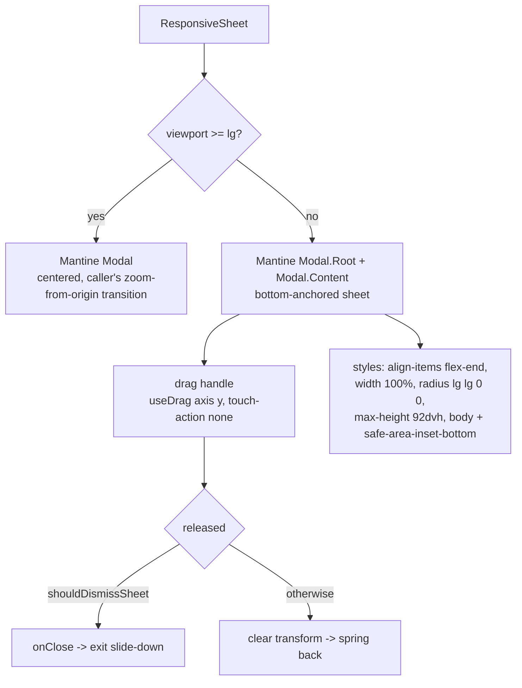

# 1. Native feel

The installed PWA should read as a native app, not a web page in a window. The
rest of the stack already covers launch, caching, safe areas and loading
(`docs/pwa-offline.md`, `docs/loading-transitions.md`); this document covers the
**interaction layer**: mobile dialogs presented as bottom sheets, touch feedback
that the browser does not provide, device-local haptics, and direction-aware page
transitions.

## Table of contents

- [1.1 Problem](#11-problem)
- [1.2 Goals & non-goals](#12-goals--non-goals)
- [1.3 Mobile bottom sheets (`ResponsiveSheet`)](#13-mobile-bottom-sheets-responsivesheet)
  - [1.3.1 Desktop is unchanged](#131-desktop-is-unchanged)
  - [1.3.2 Drag-to-dismiss](#132-drag-to-dismiss)
  - [1.3.3 Migration inventory](#133-migration-inventory)
- [1.4 Touch feedback](#14-touch-feedback)
  - [1.4.1 Tap highlight & touch-action](#141-tap-highlight--touch-action)
  - [1.4.2 Pressed states](#142-pressed-states)
  - [1.4.3 Bottom-nav active indicator](#143-bottom-nav-active-indicator)
- [1.5 Haptics](#15-haptics)
- [1.6 Directional page transitions](#16-directional-page-transitions)
- [1.7 Keyboard & viewport](#17-keyboard--viewport)
- [1.8 Constants & configuration](#18-constants--configuration)
- [1.9 Pure helpers & testing](#19-pure-helpers--testing)
- [1.10 File index & related docs](#110-file-index--related-docs)
- [1.11 Limitations & follow-ups](#111-limitations--follow-ups)

## 1.1 Problem

The app was already fast, offline-capable and installable, but its dialogs and
feedback still read as web: every dialog was a **centered** Mantine `Modal` with a
scale-zoom transition (the desktop pattern), taps flashed Chrome's grey highlight,
controls had hover states that never fire on touch, there was no tactile feedback,
and every route change animated the same way regardless of whether the user moved
forward or back.

## 1.2 Goals & non-goals

**Goals**

- Mobile dialogs present as **bottom sheets** (slide up, drag handle, drag-to-
  dismiss, rounded top, safe-area foot) — the platform's own dialog language.
- Desktop dialogs are **byte-identical** to before (centered, zoom-from-origin).
- Touch feedback: no grey tap flash, no double-tap-zoom delay, a pressed state on
  the chrome's touch targets, and an animated active indicator on the bottom nav.
- Device-local haptics on key actions, with an opt-out.
- Route changes read as push (forward) or pop (back) rather than a uniform fade.
- Zero new dependencies — the gesture work reuses `@mantine/hooks` `useDrag`.

**Non-goals**

- Pull-to-refresh and edge-swipe-back (a later phase — see §1.11).
- The event wizard's sheet conversion: its fixed-height step layout and
  minimize-to-bubble behavior need their own pass (§1.3.3).
- Changing the desktop interaction language.

## 1.3 Mobile bottom sheets (`ResponsiveSheet`)

`src/components/ResponsiveSheet.tsx` is the app's shared dialog surface. Its public
API is the Mantine `Modal` API, so a call site migrates by swapping the import and
the tag; `fullHeight` and `dismissible` are the only mobile-only knobs (stripped
before the desktop `Modal` renders).

### 1.3.1 Desktop is unchanged

On desktop the wrapper renders the **same** `Modal` it replaced, passing through
`centered`, `size`, `zIndex`, `keepMounted`, `transitionProps` (the caller's
zoom-from-origin), `styles`, `classNames` and the rest of `ModalProps`. This is what
makes the migration safe: desktop behavior is untouched by construction.

### 1.3.2 Drag-to-dismiss

The mobile branch uses `Modal.Root` + `Modal.Content` (so the content element is
ref-able) and bottoms the content out with a merged `styles` object:

- `inner`: `align-items: flex-end`, zero padding (plus `--modal-inner-align` so
  the base rule bottoms out too).
- `content`: full width, `max-height: 92dvh`, `border-radius: lg lg 0 0`,
  no bottom margin.
- `body`: `padding-bottom` clears the gesture bar (`env(safe-area-inset-bottom)`).

A sticky `.c2-sheet-handle` sits at the top of the scroll area with
`touch-action: none`, so a vertical drag on it is never stolen by the body's
scroll. `useDrag({ axis: "y", filterTaps: true })` writes the drag transform
straight to the DOM (never React state) so the sheet tracks the finger 1:1; a
`c2-sheet-dragging` class disables the transition while the finger is down
(`!important`, so it beats Mantine's inline transition longhands). On release,
`shouldDismissSheet` (pure, §1.9) decides between `onClose()` (the exit
slide-down plays) and clearing the transform (spring back).

`dismissible={false}` disables the handle and the gesture — used by the user
picker (a fixed-height list whose scroll the gesture would fight) and the search
skeleton.

### 1.3.3 Migration inventory

Migrated: `EventDetail` (detail + delete confirm), `EventSearchModal` (+ skeleton),
`FilterModal`, `UserSelectModal`, `DateSelectorModal`, `PinnedEventsPanel`, the
dashboard agenda day modal and quick Add-view dialog, `LoginForm`'s admin-PIN
prompt, and every settings form/confirm (`EventType*`, `Department*`, `User*`,
`Webhook*`, `KahGroup*`, `QuickLink*`, `SettingsForm`, `EditViewsModal`,
`AuditLogView`, `TemplatesManager`, `TitleRecipeBuilder`, `ParadeStateView` reset,
`ContactList`, `CalendarAccessModal`, `NotificationSettings`).

**Deferred:** the event wizard (`EventForm` / DashboardView's `Modal.Root`). It is
deliberately a fixed-height column with a minimize-to-bubble state and a lot of
viewport math (`WIZARD_BODY_HEIGHT_*`), so it needs a dedicated sheet pass rather
than a mechanical swap.

## 1.4 Touch feedback

### 1.4.1 Tap highlight & touch-action

`globals.css` turns off `-webkit-tap-highlight-color` app-wide (the grey flash
Chrome paints over a tapped element reads as web; the app supplies its own pressed
states instead) and sets `touch-action: manipulation` on interactive controls to
remove the ~300 ms double-tap-zoom delay. Inline `touch-action` on the grids
(`pan-x pan-y`) and the sheet handle (`none`) still wins where it is set.

### 1.4.2 Pressed states

The shared `.c2-press` class adds a `scale(0.96)` pressed state, scoped to
`@media (hover: none)` (a mouse already gets hover styling) and disabled under
`prefers-reduced-motion`. Applied to the bottom-nav / sidebar / rail buttons and the
`FloatingActionButton`.

### 1.4.3 Bottom-nav active indicator

The nav buttons carry `data-active` (alongside `aria-current="page"`). A `.c2-nav-item`
pseudo-element grows a short amber bar in from the top edge of the active entry, and
the `.c2-nav-icon` lifts slightly — the platform's "you are here" language, replacing
the previous flat colour-only active state. Both are reduced-motion-gated.

## 1.5 Haptics

`src/lib/ui/haptics.ts` wraps the Vibration API:

- `hapticPattern(kind)` — a pure table of short patterns (`light`, `medium`,
  `success`, `warning`, `error`).
- `haptic(kind)` — best-effort: no-op when the API is absent (iOS Safari has no
  Vibration API), when the user opted out, or when storage/`vibrate` throws.
- The opt-out is **device-local** (`localStorage`, default on) — a property of the
  phone in your hand, not the account — surfaced as a **Haptics** toggle in the
  profile menu. It is read through `useHapticsEnabled()` (`useSyncExternalStore`
  over a change event + `storage`, so the menu row stays in sync without a
  set-state-in-effect).

Wired at: bottom-nav / sidebar / rail taps, dashboard tab switches, wizard
step forward/back/jump, and post-mutation success (event create/update/delete via
`refreshAfterSave`).

## 1.6 Directional page transitions

`PageTransition` is direction-aware. The App Router does not expose push vs pop, so
`src/lib/ui/navDirection.ts` infers it:

- A same-origin `<a href>` click (capture-phase document listener — Next's `<Link>`
  is still an anchor) is a **forward** navigation.
- `popstate` (hardware/gesture/browser back) is a **back** navigation.

`PageTransition` reads the last signal through `useSyncExternalStore` and picks
`c2-page-in-forward` / `c2-page-out-forward` (slides in from the right) or the
`-back` mirror (from the left); an unknown direction (first load) keeps the original
fade+rise (`c2-page-in` / `c2-page-out`). The value is intentionally never reset — a
stale "forward" is the correct guess for the rare programmatic navigation, and
resetting without notifying would desync the `useSyncExternalStore` snapshot.

## 1.7 Keyboard & viewport

`viewport.interactiveWidget: "resizes-content"` (layout.tsx) makes Android Chrome
shrink the layout viewport — and therefore `dvh` — when the on-screen keyboard opens,
so a bottom sheet or form dialog resizes above it instead of being covered. iOS
ignores the hint; it already tracks the keyboard through the visual viewport, and the
theme keeps inputs at ≥ 16px so iOS does not auto-zoom.

## 1.8 Constants & configuration

| Constant | Value | Where |
|---|---|---|
| Sheet max height | `92dvh` (full-height mode sets `height: 92dvh`) | `ResponsiveSheet.tsx` |
| Sheet radius | `lg lg 0 0` (top corners only) | `ResponsiveSheet.tsx` |
| Sheet drag threshold | absolute `80px` **and** `25%` of height, or `0.5 px/ms` flick | `src/lib/ui/sheetDrag.ts` |
| Sheet transition | `slide-up`, `MOTION.modalZoom` | `ResponsiveSheet.tsx` |
| Pressed-state scale | `0.96`, `@media (hover: none)` | `globals.css` |
| Haptics opt-out key | `cloudy2.haptics` (`localStorage`, default on) | `src/lib/ui/haptics.ts` |
| Haptics change event | `cloudy2:haptics-changed` | `src/lib/ui/haptics.ts` |

## 1.9 Pure helpers & testing

- `src/lib/ui/sheetDrag.ts` — `sheetDragOffset(movementY)` (clamps upward movement
  to 0) and `shouldDismissSheet({ movementY, velocityY, height })` (downward flick,
  or past the absolute floor and the height share). Unit-tested in
  `sheetDrag.test.ts`.
- `src/lib/ui/haptics.ts` — `hapticPattern(kind)` is the pure, unit-tested core
  (`haptics.test.ts`); the device gate and opt-out live in `haptic()`.

Integration is validated by `pnpm build` plus manual device checks (Android WebAPK +
iOS home-screen app): sheet slide/drag on each migrated dialog, no grey tap flash,
pressed states, nav indicator, haptic pulses, and forward/back transition direction.

## 1.10 File index & related docs

| File | Role |
|---|---|
| `src/components/ResponsiveSheet.tsx` | Shared dialog: desktop `Modal` / mobile bottom sheet |
| `src/lib/ui/sheetDrag.ts` | Pure drag-to-dismiss thresholds (§1.9) |
| `src/lib/ui/haptics.ts` | Vibration wrapper + device-local opt-out + `useHapticsEnabled` |
| `src/lib/ui/navDirection.ts` | Forward/back navigation-direction store + tracking hook |
| `src/components/PageTransition.tsx` | Direction-aware `<ViewTransition>` wrapper |
| `src/components/AppShellShell.tsx` | Nav classes (`c2-press`/`c2-nav-item`/`c2-nav-icon`), nav-tap haptics, direction tracking |
| `src/components/FloatingToolbar.tsx` | FAB pressed state |
| `src/components/UserMenu.tsx` | Haptics toggle row |
| `src/app/globals.css` | Tap highlight, touch-action, pressed states, nav indicator, sheet chrome, directional keyframes |
| `src/app/layout.tsx` | `interactiveWidget: "resizes-content"` |
| `docs/loading-transitions.md` | Skeleton / activity-bar / `staleTimes` system the transitions complement |
| `docs/pwa-offline.md` | Launch, caching, safe areas |
| `docs/desktop-responsive.md` | Desktop shell + compact tier |

## 1.11 Limitations & follow-ups

- **Event wizard** is still a centered modal on mobile (§1.3.3).
- **Pull-to-refresh** remains disabled (`overscroll-behavior-y: contain`) with the
  header Force refresh as the affordance; an in-app pull gesture driving the
  `?refresh` force-read is a possible follow-up.
- **Edge-swipe-back** is not implemented; Android has the system back gesture, iOS
  standalone does not, so a left-edge swipe would benefit iOS only and must not
  conflict with the dashboard's horizontal grid panning.
- **Haptics are Android-only** — iOS Safari exposes no Vibration API.
- A programmatic `router.push` (not a link click) reuses the last direction signal;
  it is usually "forward", which is the right guess.
