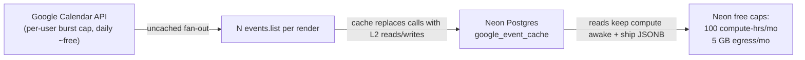

# 1. Neon usage & Google Calendar quota reality

The events cache ([events-cache.md](events-cache.md)) exists to guard Google Calendar
**burst-rate** and **latency**, not a daily Google quota. The resource that actually runs
out is the **Neon free tier**. This document records the quota numbers and the two ways to
verify the app's DB-side load: a daily usage script (consumption API) and query-level
statistics (`pg_stat_statements`).

## Table of contents

- [1.1 Why Google Calendar isn't the constraint](#11-why-google-calendar-isnt-the-constraint)
- [1.2 The real constraint: Neon free tier](#12-the-real-constraint-neon-free-tier)
- [1.3 Daily usage via the consumption API](#13-daily-usage-via-the-consumption-api)
- [1.4 Query-level stats via `pg_stat_statements`](#14-query-level-stats-via-pgstatstatements)
- [1.5 Reading the numbers](#15-reading-the-numbers)

## 1.1 Why Google Calendar isn't the constraint

Measured against the production Google Cloud project, Calendar API usage is **~0%** of
every quota. The post-May-2026 limits are:

| Limit                       | Value                | Reached? |
| --------------------------- | -------------------- | -------- |
| Per minute per project      | 10,000 requests      | No (0)   |
| Per minute per user/project | 600 requests         | No (0)   |
| Per day per project         | 1,000,000 (billing threshold) | No |

The one cap an uncached design could hit is the **per-user-per-minute** rate: every call
runs through the **service account**, which Google charges as a *single user*. An admin
rendering all departments fans out to one `events.list` per calendar, so busy multi-user
minutes can burst past 600/min. The cache collapses that to one re-fetch per expired
`(calendar, month)` per minute. That, plus render latency, is why the cache exists —
**not** to stay under a daily capacity figure.

## 1.2 The real constraint: Neon free tier



The cache trades a generous external quota for a scarce internal one. Neon's free tier is
the binding ceiling:

- **100 compute hours/month** — measured as *active time* (wall-clock the compute endpoint
  is not suspended). The 5-minute scale-to-zero timeout is **fixed on the free plan**
  (cannot be lowered or disabled), so any day the team uses the app continuously, the
  endpoint stays awake and accrues active time regardless of per-query efficiency.
- **5 GB egress/month** — every JSONB month payload re-shipped on a render counts.
- **0.5 GB storage** — the `google_event_cache` rows accumulate per `(calendar, month)`.

Because the free suspend timeout is not configurable, the code-level levers are limited to
*reducing how often* the DB is touched (fewer keep-alive reads, shorter bursts) — which is
exactly what the events-cache optimizations do: metadata-only L1 verification, full rows
only for misses, `React.cache`d per-render reads, and advisory-lock-coalesced Google
refreshes (see [events-cache.md §1.5](events-cache.md#15-read-path)).

## 1.3 Daily usage via the consumption API

`scripts/neon-usage.mjs` (also `pnpm db:usage`) prints daily compute active time, CPU
seconds, egress, data written, and storage from the Neon consumption-history API. It needs
no extra packages (Node ≥ 20 `fetch`).

```powershell
# 1. In .env.local (or the shell) set:
#    NEON_API_KEY=<console.neon.tech → Account → API keys>
#    NEON_ORG_ID=<your organization id>
#    NEON_PROJECT_ID=<optional: filter to one project>

# 2. Load the values and run:
$line = Get-Content .env.local | Where-Object { $_ -match '^NEON_API_KEY=' } | Select-Object -First 1
$env:NEON_API_KEY = $line.Substring(13).Trim()
$line = Get-Content .env.local | Where-Object { $_ -match '^NEON_ORG_ID=' } | Select-Object -First 1
$env:NEON_ORG_ID = $line.Substring(12).Trim()
pnpm db:usage

# Or a custom window:
node scripts/neon-usage.mjs --from 2026-08-01 --to 2026-08-31
```

The script reads `NEON_*` from `.env.local` itself, so the shell lines above are only
needed to *pre-seed* them before other tools; `pnpm db:usage` alone works once the values
are present. On the free plan, the two numbers that matter are **active hours** (vs the
100 h/month cap) and **egress** (vs 5 GB/month). If the consumption API is not exposed on
your plan (403/404), the same numbers live in the Neon Console → **Billing → Usage** page.

## 1.4 Query-level stats via `pg_stat_statements`

For *which* queries drive the load, enable Neon's built-in query stats once (SQL editor or
psql):

```sql
CREATE EXTENSION IF NOT EXISTS pg_stat_statements;
```

Then the top consumers by call count and total time:

```sql
-- Most frequent queries (the cache metadata SELECT should be small/frequent
-- and the full google_event_cache SELECT only for misses):
SELECT query, calls
FROM pg_stat_statements
ORDER BY calls DESC
LIMIT 15;

-- Most time spent (total and average ms):
SELECT query,
       calls,
       round(total_exec_time::numeric, 1)        AS total_ms,
       round((total_exec_time / calls)::numeric, 1) AS avg_ms
FROM pg_stat_statements
WHERE calls > 0
ORDER BY total_exec_time DESC
LIMIT 15;

-- Biggest rows-per-call (proxy for egress per query):
SELECT query, calls, rows AS total_rows, round(rows::numeric / calls, 1) AS rows_per_call
FROM pg_stat_statements
WHERE calls > 0
ORDER BY rows_per_call DESC
LIMIT 15;
```

Reset the counters when you ship a change so the next window reflects it:

```sql
SELECT pg_stat_statements_reset();
```

## 1.5 Reading the numbers

After the DB-load reductions, expect:

- **Active hours / egress (consumption API):** a downward trend once a workday's usage is
  compared against the previous window — chiefly because the pinned badge's background
  refreshes and duplicate per-render reads no longer touch the DB, so idle stretches can
  actually reach Neon's 5-minute suspend.
- **`pg_stat_statements`:** `calendars`/`event_types` reads roughly halve per render
  (page + `fetchRangeEvents` now share one `React.cache`d read each); the `google_event_cache`
  full-payload `SELECT` call count drops to "one per L1-miss month", with warm views
  hitting only the tiny metadata `SELECT`.

One honest caveat: if the team uses the app continuously through the workday, the free
endpoint stays awake all day and active hours will be consumed **regardless** of these
optimizations. In that case the only real fix is a paid Neon plan; the monitoring above
shows you which scenario you're actually in.