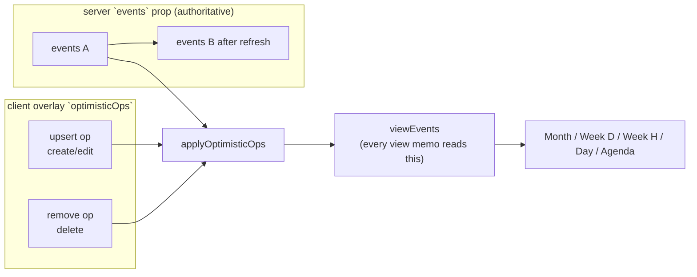
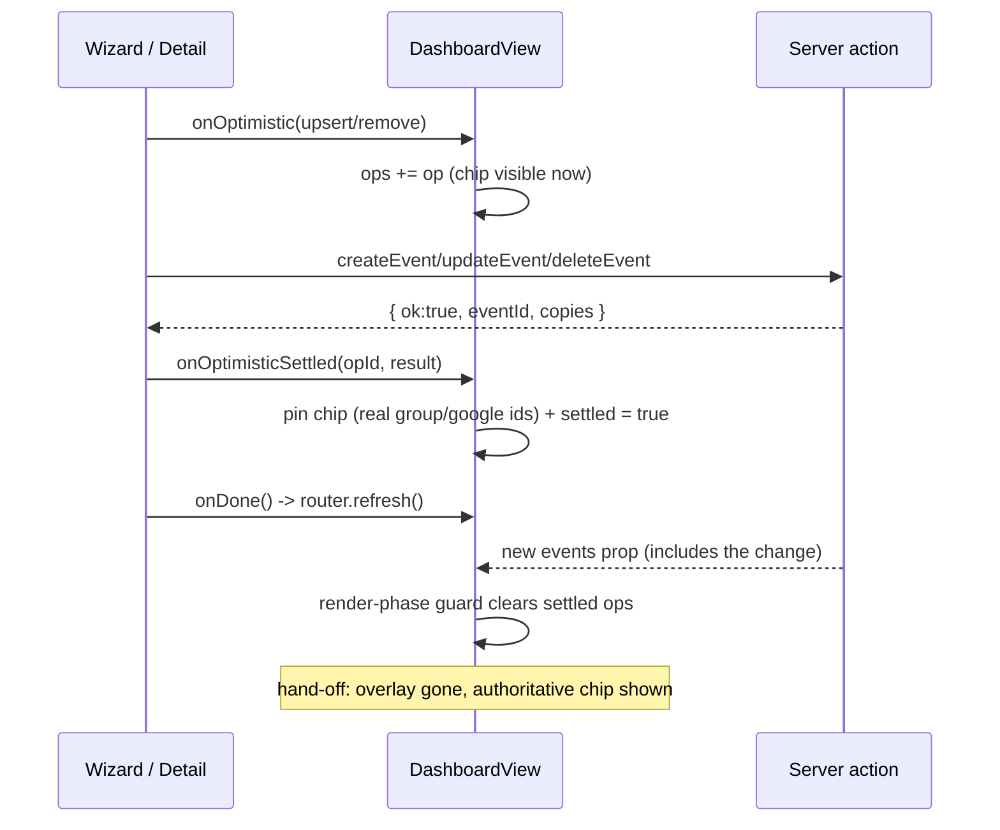

# 1. Optimistic event mutations on the dashboard

The dashboard's grid data is a server-owned `events` prop produced by the layered
cache (`docs/events-cache.md`). A create/edit/delete does not reach the grid until the
whole write path has finished: the action performs **serial Google writes** per target
department calendar (hundreds of ms each, `docs/event-mutations.md`), purges the events
cache, then the client's `router.refresh()` re-reads from Google (**read-your-own-writes**)
before the new `events` prop lands. Between "Save" and "the chip appears" the user stares
at a grid that has not changed, with only the activity bar (1.168) to indicate work.

Optimistic mutations close that gap: the client renders a **stand-in** `CalendarEvent`
immediately on confirm, then hands off to the authoritative server data when the refresh
arrives. Decision A keeps the wizard open through the action (submit spinner as before) so
failure UX is untouched, but the grid behind it already shows the change; Decision 3 makes
the server actions return the ids they already computed (the group `eventId` + per-copy
Google ids), so the stand-in can be pinned to real ids the moment the action resolves and
the hand-off is seamless.

## Table of contents

- [1.1 Goals and non-goals](#11-goals-and-non-goals)
- [1.2 The overlay model](#12-the-overlay-model)
- [1.3 Reconciliation with authoritative data](#13-reconciliation-with-authoritative-data)
- [1.4 The pure overlay engine](#14-the-pure-overlay-engine)
- [1.5 The stand-in builder](#15-the-stand-in-builder)
- [1.6 The server return contract](#16-the-server-return-contract)
- [1.7 Component wiring](#17-component-wiring)
- [1.8 Failure and edge semantics](#18-failure-and-edge-semantics)
- [1.9 Testing](#19-testing)
- [1.10 File index and related docs](#110-file-index-and-related-docs)

## 1.1 Goals and non-goals

**Goals**

- The grid reflects a create/edit/delete **at the moment the user confirms**, not after the
  Google write round trip + read-your-own-writes refresh (~0.5–3 s, `docs/events-cache.md`
  §1.12).
- The change never visibly reverts while the authoritative data is in flight (no chip that
  disappears and reappears), and the hand-off to the refreshed data is flicker-free.
- Failure paths are byte-for-byte the same as before: the wizard stays open on a rejected
  action with its field error + step jump, and the optimistic chip is rolled back.
- All new shared behavior is **pure and unit-tested**; the client only composes it.

**Non-goals**

- Not a client-side cache or SWR layer — the server stays the single source of truth and
  keeps its layered cache, coalescing and read-your-own-writes semantics
  (`docs/events-cache.md`). The overlay is a *short-lived stand-in*, never a data store.
- Not a close-the-wizard-immediately UX (Decision B, deliberately deferred): closing the
  wizard on submit and reopening on failure would need draft persistence across a remount.
  Because the wizard stays open through the action, **rollback is trivial** (drop the op).
- No new client-fetched endpoints, no moving DB/Google code client-side
  (`docs/google-integration.md` §1.6: never static-import `./real`).

## 1.2 The overlay model

The dashboard already receives **one deduplicated `CalendarEvent` per logical event**
(`fetchRangeEvents` → `dedupeEventsByGroupId`, `src/lib/events/queries.ts`), so one
stand-in chip represents a create/edit/delete regardless of how many department copies
Google holds.



An **op** (`OptimisticOp` in `src/lib/events/optimistic.ts`) is one pending mutation:

- `upsert` — render `op.event` in place of (edit) or in addition to (create) the matching
  base event. Carries the stand-in chip.
- `remove` — hide the event(s) a delete targets. Matches by group id when the event has
  one (logical events collapse to one row), otherwise by the exact copy
  (calendar id + google id) for legacy ungrouped events.

Every op has a client `id` (a `crypto.randomUUID`, `nextOptimisticOpId`) and a `settled`
flag set when its action resolves `{ ok: true }`. `settled` means "the chip must keep
rendering until the *next* authoritative `events` prop arrives", at which point the op is
dropped (see §1.3).

The views never see raw `events`: `DashboardView` computes `viewEvents =
applyOptimisticOps(events, optimisticOps)` and every data memo
(`scheduleResources`, `scheduleEvents`, `myEventIds`, `monthEvents`,
`agendaTabEvents`, `agendaModalEvents`, and the Week (D) `WeekMatrixView` input)
derives from `viewEvents`. Swapping the one prop for the memo means inserting or
replacing one object updates every view.

## 1.3 Reconciliation with authoritative data

Read-your-own-writes (`docs/events-cache.md`) guarantees the refresh that follows a
successful mutation returns a prop array that already contains the change. The client
therefore never needs to diff contents — it needs only to *wait for a new props identity
after `ok`* and then drop the settled ops.



The clearing happens as a **guarded render-phase state adjustment** (the codebase's
standard derived-state pattern, used for `EventDetail`'s `displayEvent` and the agenda tab
day sync — an effect is not allowed here; `react-hooks/set-state-in-effect`):

```ts
const [lastEvents, setLastEvents] = useState<readonly CalendarEvent[]>(events);
if (events !== lastEvents) {
  setLastEvents(events);
  if (optimisticOps.some((op) => op.settled)) {
    setOptimisticOps((current) => current.filter((op) => !op.settled));
  }
}
```

`settled` ops survive *navigation too* (a filter/view/date change while a mutation is in
flight keeps the chip; the current view's refreshed data may simply not include an event
that moved outside the window, which matches server truth). A chip is dropped only when
its own post-`ok` refresh lands.

## 1.4 The pure overlay engine

`applyOptimisticOps(base, ops)` (`src/lib/events/optimistic.ts`) merges in op order:

- **remove** filters out every base event matching the op's identity — group id when
  `op.eventId` is set, else the exact `(calendarId, googleEventId)` copy.
- **upsert** replaces the first matching base event, or appends when nothing matches.
  The match rule mirrors the remove rule: grouped chips replace by group id (an edit —
  and, once pinned at settle time, a create — replaces the authoritative row so it never
  duplicates); ungrouped (legacy-edit) chips replace by exact copy; a create's client
  placeholder group id matches nothing in base and so appends.
- The result is re-sorted by `start` (stable), because the month grid assigns rows
  greedily in input order and the per-view memos expect chronological input; the base is
  already start-sorted, so this preserves its relative order and only places added chips
  at their natural time position.

`optimisticEventKey` gives an event its identity key (group id, else `calendar:google`).
`isOptimisticStandIn(event)` returns true exactly when `payload.googleEventId === ""` —
real events always carry a Google id, so this is a reliable "not yet real" marker used by
the detail-click guards (§1.7). Input arrays are never mutated.

## 1.5 The stand-in builder

`buildOptimisticEvent(params)` shapes a schedule-ready `CalendarEvent` that matches what
the action will write and what the read path maps back (`mapCalendarItem`,
`src/lib/events/queries.ts`):

- **Normalization parity.** It re-runs the same pure client chain the action re-runs on the
  server: the wizard already carries the fixed organizer (acting user on create/duplicate,
  the stored organizer on edit), defaulting a blank organizer to the acting user, then
  `clampEventEnd` (`src/lib/events/validate.ts`) — no creator→invitee merge, so the
  stand-in's attendees match what saves.
- **Naive time parity.** Timed events keep their wall-clock `start`/`end`. All-day
  (full/half) events are stored midnight-valued with an **exclusive end** — the day after
  the inclusive last day the form stores — mirroring `absEventRange` on write and
  `mapCalendarItem`'s `scheduleTime` on read.
- **Title parity.** The chip's `title` is passed in already rendered through the current
  view's display template (`previewTitles.view` from `EventForm`, which is the exact
  string `resolveDisplayTitles` produces for that view) — never re-implemented in the
  builder.
- **Color parity.** Typed events use `effectiveEventTypeColor(type, pinnedColor)`;
  untyped fall back to the calendar default. The pinned color rides the (extended)
  `eventTypes` option list (`color` field, sourced from `eventTypes.color` in
  `page.tsx`), so the deterministic default still matches the server's when unpinned.
- **Payload parity.** `eventType`, `timeOption`, half-day AM/PM markers, location flags,
  `rawTitle`, `pinned`, invitees and creator copy the effective (normalized) form values;
  `external` is always false.
- **Identity.** The chip reports the caller's `identity`: an edit reuses the shown copy's
  `(calendarId, googleEventId, eventId)` so it replaces the old row; a create carries a
  client placeholder group id on the acting user's home department (cosmetic — rows come
  from tagged people/departments, not `payload.calendarId`) and `googleEventId: ""`.

## 1.6 The server return contract

`EventActionResult` (Decision 3, `src/lib/events/actions.ts`) gains a success payload:

```ts
type EventActionResult =
  | { ok: true; eventId: string | null; copies: EventMutationCopy[] }
  | { ok: false; error: string; field?: EventResultField };
```

- `createEvent` returns the freshly minted group id and every copy it wrote
  (`{ calendarId, googleEventId }` — `calendarId` is the app registry department id).
- `updateEvent` returns the (possibly legacy-minted) group id and the copies that
  **survived** the reconcile (updated or created — retired ones are excluded).
- `deleteEvent` returns `eventId` (null for a legacy ungrouped delete) and the copies
  retired.

The client uses `copies` to pin the stand-in's `googleEventId` for the calendar the chip
stands on and `eventId` to re-key it to the real group — so between `ok` and the refresh it
is clickable-safe and reconciles by identity rather than by placeholder.

## 1.7 Component wiring

**`EventForm`** (create/edit): at submit time (after client validation), builds the chip
with `buildOptimisticEvent` (identity from the edited copy, or the home-department
placeholder for a create) and calls `onOptimistic(optimisticUpsert(id, chip))` **before**
`await`ing the action. On `ok` it calls `onOptimisticSettled(id, result)` then the existing
`onDone()` (toast, `PINNED_EVENTS_CHANGED_EVENT`, `refreshAfterSave`). On a rejected action
it calls `onOptimisticRollback(id)` and falls through to the unchanged field-error/step-jump
UX.

**`EventDetail`** (delete): on the confirm modal's Delete, applies
`onOptimistic(optimisticRemove(id, ref))` before awaiting, then settles on `ok` (keep the
row hidden through the refresh) or rolls back on failure.

**`DashboardView`** owns the op state and exposes the three callbacks to both children. It
computes `viewEvents` and points every data memo at it, and **guards the detail click
handlers**: tapping a stand-in (`isOptimisticStandIn`) is a no-op until the action pins a
real Google id, because Edit/Delete on an unreal chip would reference an empty id. (During
the submit the wizard modal blocks the grid anyway; the guard covers the short
post-`ok`/pre-refresh window.)

**`page.tsx`** extends the event-type option list with `color` so both the dashboard and
the wizard can resolve chip colors exactly.

## 1.8 Failure and edge semantics

- **Action rejected** — the op is rolled back and the wizard surfaces the error exactly as
  before. Because the wizard never closed (Decision A), there is no draft to restore.
- **Stand-in taps** — no-op until pinned; after settle the chip carries real ids and opens
  normally.
- **Create pinned but representative differs** — the chip reconciles by group id on the
  next props arrival regardless of which calendar ended up representative; a copy lookup
  miss only leaves the transient `googleEventId` empty, keeping the click guard active.
- **Multiple quick mutations** — one wizard at a time (submit is disabled while in flight);
  a second op simply outlives the first and is cleared by its own refresh. Two settled ops
  share a single clearing pass on the next props change.
- **Navigation during an in-flight action** — the op survives (not settled) and keeps its
  chip visible wherever the event falls; the refresh for the *new* window carries
  authoritative state. A settled op is dropped on any props change after `ok`, so a
  mid-refresh view switch cannot resurrect a deleted/edited event.
- **Leaving the dashboard** — unmount discards the ops; the server action still completes
  and the next visit fetches the authoritative result.
- **Stale post-`ok` read (rare race)** — a navigation whose fetch started before the cache
  purge could land stale between `ok` and the refresh; the follow-up refresh then carries
  the true state. The overlay never *adds* stale data — at worst the chip persists one
  render longer.

## 1.9 Testing

The shared behavior is pure and lives in `src/lib/events/optimistic.ts`, unit-tested in
`src/lib/events/optimistic.test.ts` (28 cases, Vitest node environment, no DB/Google):

- `applyOptimisticOps`: no-op passthrough, input non-mutation, chronological insertion of a
  create (not a tail append), grouped-edit replacement without duplication, legacy-edit
  replacement by exact copy, non-colliding upsert as an addition, grouped and legacy
  removals, removal never touching a same-calendar sibling copy, multiple ops applied
  together, and stable ordering for equal start times.
- `optimisticRemove`/`optimisticUpsert` factories and `optimisticEventKey` (group first,
  exact-copy fallback).
- `isOptimisticStandIn` (true only for an empty google id; real and null/undefined safe).
- `buildOptimisticEvent`: creator defaulting + creator-is-invited, end clamping, timed
  wall-clock preservation, full-day midnight + exclusive next-day end, half-day markers,
  pinned vs deterministic type color, department fallback for untyped events, title
  precedence, id/flag/location/rawTitle propagation, and real-identity passthrough for
  edits.

The component layer (op state, render-phase clearing, click guards) is intentionally thin
and is verified by manual QA per view (Month / Week (D) / Week (H) / Day / Agenda):
create a multi-department event, edit it (including moving it across days), delete it, and
confirm the chip appears at confirm, survives the refresh without flicker, and that a
failed action (e.g. drop a department) reverts the chip and shows the field error.

## 1.10 File index and related docs

- `src/lib/events/optimistic.ts` — pure overlay engine + stand-in builder (+ tests).
- `src/lib/events/actions.ts` — `EventActionResult` success payload (`eventId`, `copies`),
  `EventActionOk`, per-action copy collection.
- `src/app/(protected)/dashboard/DashboardView.tsx` — op state, render-phase reconciliation,
  `viewEvents`, click guards, child prop wiring.
- `src/app/(protected)/dashboard/EventForm.tsx` / `EventDetail.tsx` — apply / settle /
  rollback lifecycle at submit and delete-confirm.
- `src/app/(protected)/dashboard/page.tsx` — event-type options now carry `color`.

Related: `docs/events-cache.md` (read-your-own-writes, the layered cache the overlay
hands off to), `docs/event-mutations.md` (write path + idempotent retry), `docs/ui-state.md`
(URL/refresh mechanics unchanged by this design), `docs/loading-transitions.md` (the
activity bar that reports the refresh the overlay bridges).
