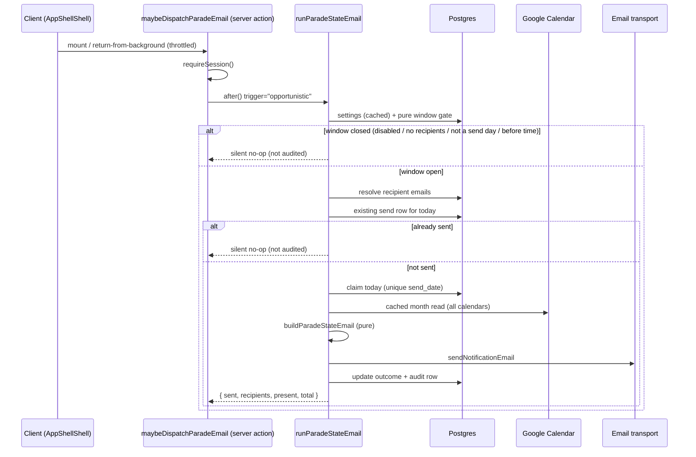
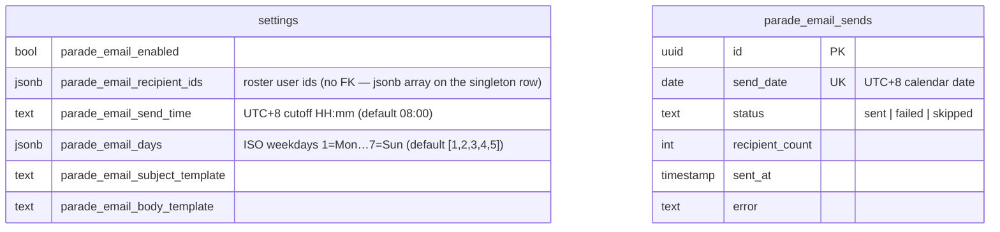

# 1. Daily parade-state email

An admin can have a **snapshot of the parade state emailed to a set of roster users**
once a day. The snapshot is derived from the same calendar data as the Parade State page:
a user counts as **in camp** unless they have an out-of-camp event that day. Attendance
checkmarks are **not** included — those live only in each device's `localStorage`, so a
server job cannot read them.

The send is triggered **in-app** (a lazy tick), not by an external scheduler: on each
configured day, the first authenticated app activity at or after the configured send time
fires it. There is no Cloud Scheduler job and no `CRON_SECRET`.

## Table of contents

- [1.1 Overview](#11-overview)
- [1.2 Data model](#12-data-model)
- [1.3 Snapshot & content](#13-snapshot--content)
- [1.4 Triggering & idempotency](#14-triggering--idempotency)
- [1.5 Send schedule](#15-send-schedule)
- [1.6 Admin UI](#16-admin-ui)
- [1.7 Files](#17-files)
- [1.8 Deliberate limits](#18-deliberate-limits)

## 1.1 Overview

The dispatcher runs inside `after()`, so the triggering request's response is never
delayed. It is host-agnostic: it works identically on Vercel and the Cloud Run shadow.

## 1.2 Data model

- Recipients are stored as **user ids**, so a person's address follows their roster record
  (email changes, deactivation). The dispatcher resolves `users.email` at send time and
  drops blanks.
- `parade_email_sends.send_date` is **unique**, making the dispatch idempotent: a repeated
  tick the same day conflicts and is skipped.
- Templates default from `src/lib/parade-email/emailDefaults.ts`, which the Drizzle column
  defaults import so a fresh row and the runtime fallback never drift.

## 1.3 Snapshot & content

The snapshot is org-wide (every active roster user, every department) and grouped by the
department tree, including a terminal "Unassigned" section. The per-person line shows
`— Present` or `— Out of camp: <type/description> (<location>, <time range>)`.

The email is rendered from two admin-editable templates:

| Token            | Value                                                          |
| ---------------- | -------------------------------------------------------------- |
| `{date}`         | Snapshot date (`YYYY-MM-DD`, UTC+8)                            |
| `{weekday}`      | e.g. `Sunday`                                                  |
| `{present}`      | Users in camp                                                  |
| `{total}`        | Active users in the snapshot                                   |
| `{outOfCamp}`    | Users out of camp                                              |
| `{generatedAt}`  | Build timestamp (`YYYY-MM-DD HH:mm:ss`, UTC+8)                 |
| `{departments}`  | The full per-department, per-person roster block (**required**) |

Substitution is the shared `renderTemplate` helper (`src/lib/email/template.ts`):
case-insensitive, trimmed tokens, unknown tokens left literal. The body **must** contain
`{departments}`; every other omission degrades gracefully.

## 1.4 Triggering & idempotency

1. `useParadeEmailTick` (`src/lib/parade-email/client.ts`) is mounted once in the protected
   shell. It calls the `maybeDispatchParadeEmail` server action on the initial app open
   (after a short delay) and on every return-from-background (`focus` /
   `visibilitychange`), throttled to once per 5 minutes per document and skipped when
   offline.
2. The action requires a session and hands the dispatch to `after()`, so the client is
   never blocked.
3. `runParadeStateEmail` first runs the **pure window gate** (`paradeEmailWindowOpen`) —
   disabled, no configured recipients, not a send day, or before the cutoff all return
   before any per-tick database read.
4. When the window is open it resolves recipient emails, then **claims the day** via an
   `onConflictDoNothing` insert on the unique `send_date`. Concurrent opens/users race
   safely: one claims, the rest see the row and no-op.
5. A **failed** day is left claimable: a later run retries (the row status becomes
   `failed`). A **sent** day is never retried.
6. **Audit policy:** benign skips are *not* audited for the opportunistic trigger —
   otherwise every app open before the cutoff would flood the audit log. Every real
   outcome (`sent` / `failed`) and every error writes one audit row
   (`paradeState.emailSend`) with the date, recipients, counts, `outcome`, and any
   `reason`/`error`. The admin **Send test** action is always audited (skips included).

## 1.5 Send schedule

The schedule is admin-owned (Settings → Parade State Email), stored on the `settings`
singleton row and read through `getSettings`:

- **Send time** — a UTC+8 cutoff (`HH:mm`, default `08:00`). The email goes out on the
  first activity **at or after** this time, not at an exact instant.
- **Send days** — the ISO weekdays (1=Mon … 7=Sun) it may go out on, default Mon–Fri.

`paradeEmailNow` (`src/lib/parade-email/schedule.ts`) converts an instant to the UTC+8
date, ISO weekday, and minutes-since-midnight the gate compares against; malformed stored
values fall back to the defaults (`normalizeSendTime` / `normalizeWeekdays` in
`src/lib/settings/queries.ts`). Public holidays are not excluded.

There is no external scheduler to configure or rotate. To force a send on demand, use
**Send test to my email** (below).

## 1.6 Admin UI

Settings → **Parade State Email** (`/settings/parade-email`, admin-only):

- **Send parade-state email** — the enable switch.
- **Recipients** — a `UserSelectModal` badge picker over active roster users.
- **Send time (Singapore time)** — a `TimeInput` cutoff.
- **Send days** — Mon–Sun checkboxes (at least one required while enabled).
- **Subject / Body templates** — with a token list and a live sample-data preview.
- **Send test to my email** — sends the current templates to the acting admin's **own**
  address only (`[TEST]` subject prefix), never to the configured recipients, and never
  consumes the day's dedup row.

## 1.7 Files

| File | Role |
| --- | --- |
| `src/lib/parade-email/client.ts` | `useParadeEmailTick` — the lazy in-app trigger |
| `src/lib/parade-email/actions.ts` | Save config, send test, and the `maybeDispatchParadeEmail` tick |
| `src/lib/parade-email/dispatch.ts` | Window gate, recipient resolution, day claim, send, audit |
| `src/lib/parade-email/context.ts` | Org-wide snapshot load (cached month read) |
| `src/lib/parade-email/report.ts` | Pure email builder + sample preview context |
| `src/lib/parade-email/schedule.ts` | Pure window gate + UTC+8 clock (date / weekday / time) |
| `src/lib/parade-email/validate.ts` | Form validation + token list + weekday constants |
| `src/lib/parade-email/emailDefaults.ts` | Default subject/body (shared with schema) |
| `src/app/(protected)/settings/parade-email/` | Settings tab page/form/skeleton |
| `src/lib/parade/dayEvents.ts`, `sections.ts` | Shared pure helpers with the parade page |
| `src/lib/email/template.ts` | Shared `{token}` renderer (also used by KAH) |

## 1.8 Deliberate limits

- **Needs app activity.** The email goes out on the first authenticated use of the app at
  or after the cutoff. A day where nobody opens the app at all gets no email — there is no
  external scheduler as a fallback.
- **No attendance marks.** They are device-local; the email is the derived in/out-of-camp
  view. Moving attendance to the database is a prerequisite for including it.
- **Public holidays included.** There is no holiday calendar, so the email still goes out
  on public holidays (kept simple deliberately).
- **Organizer-only events mark nobody.** Matching the page, only tagged attendees count;
  an organizer who is not attending is not listed out of camp.
- **Users without an email are skipped** (and noted in the audit row).
- **No retry queue** beyond the failed-day reclaim: a persistently failing transport means
  no email that day, recorded as `failed`.
- **Best-effort:** a failure never affects any user-facing request.
