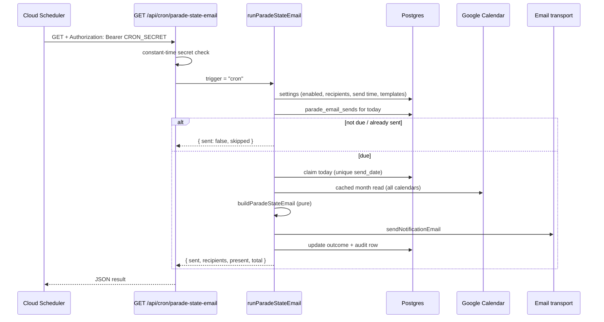
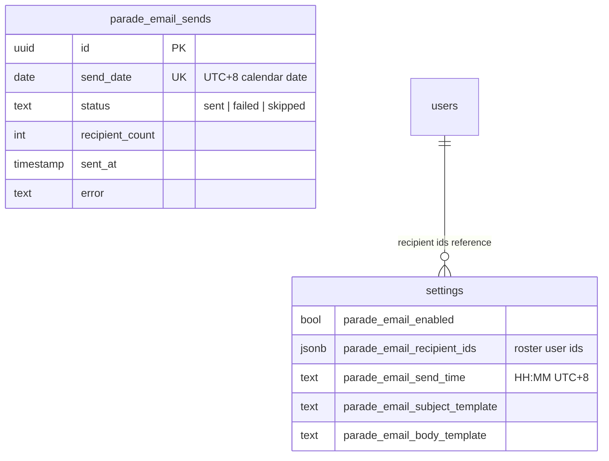

# 1. Daily parade-state email

An admin can have a **snapshot of the parade state emailed to a set of roster users once a
day** at a configured Singapore time. The snapshot is derived from the same calendar data
as the Parade State page: a user counts as **in camp** unless they have an out-of-camp event
that day. Attendance checkmarks are **not** included — those live only in each device's
`localStorage`, so a server job cannot read them.

## Table of contents

- [1.1 Overview](#11-overview)
- [1.2 Data model](#12-data-model)
- [1.3 Snapshot & content](#13-snapshot--content)
- [1.4 Scheduling & idempotency](#14-scheduling--idempotency)
- [1.5 Cloud Scheduler setup](#15-cloud-scheduler-setup)
- [1.6 Admin UI](#16-admin-ui)
- [1.7 Files](#17-files)
- [1.8 Deliberate limits](#18-deliberate-limits)

## 1.1 Overview



The route is **host-agnostic**: it works identically on Vercel and the Cloud Run shadow, so
the scheduler can point at whichever is canonical production. It is triggered by **Cloud
Scheduler** (not Vercel Cron) so the send time can stay runtime-configurable: the scheduler
ticks frequently and the route decides whether the configured time has passed.

## 1.2 Data model



- Recipients are stored as **user ids**, so a person's address follows their roster record
  (email changes, deactivation). The dispatcher resolves `users.email` at send time and
  drops blanks.
- `parade_email_sends.send_date` is **unique**, making the dispatch idempotent: a repeated
  tick the same day conflicts and is skipped.
- Templates default from `src/lib/parade-email/emailDefaults.ts`, which the Drizzle column
  defaults import so a fresh row and the runtime fallback never drift.

## 1.3 Snapshot & content

The snapshot is org-wide (every active roster user, every department) and grouped by the
department tree, including a terminal "Unassigned" section. The per-person line shows
`— Present` or `— Out of camp: <type/description> (<location>, <time range>)`.

The email is rendered from two admin-editable templates:

| Token            | Value                                                          |
| ---------------- | -------------------------------------------------------------- |
| `{date}`         | Snapshot date (`YYYY-MM-DD`, UTC+8)                            |
| `{weekday}`      | e.g. `Sunday`                                                  |
| `{present}`      | Users in camp                                                  |
| `{total}`        | Active users in the snapshot                                   |
| `{outOfCamp}`    | Users out of camp                                              |
| `{generatedAt}`  | Build timestamp (`YYYY-MM-DD HH:mm:ss`, UTC+8)                 |
| `{departments}`  | The full per-department, per-person roster block (**required**) |

Substitution is the shared `renderTemplate` helper (`src/lib/email/template.ts`):
case-insensitive, trimmed tokens, unknown tokens left literal. The body **must** contain
`{departments}`; every other omission degrades gracefully.

## 1.4 Scheduling & idempotency

1. Cloud Scheduler calls the route on a short interval (every 15 minutes).
2. The route authenticates with a constant-time compare of
   `Authorization: Bearer <CRON_SECRET>` (503 when the secret is unset).
3. `runParadeStateEmail` reads the settings, resolves recipients, and calls the pure
   `paradeEmailDue`:
   - not due when **disabled**, **no resolvable recipients**, **already sent**, or
     **before the configured UTC+8 time**;
   - otherwise it **claims the day** via an `onConflictDoNothing` insert on `send_date`.
4. A **failed** day is left claimable: the next tick retries (the row status becomes
   `failed`). A **sent** day is never retried.
5. Every attempt writes an audit row (`paradeState.emailSend`) with the date, recipients,
   counts, and delivery result.

The tick may fire up to the interval (15 min) after the configured time — the trade-off for
keeping the send time configurable in-app.

## 1.5 Cloud Scheduler setup

Create a job that ticks every 15 minutes and presents the secret header. Point `--uri` at
canonical production (Vercel); switching to the Cloud Run URL later is a one-line update.

```bash
gcloud scheduler jobs create http cloudy2-parade-email \
  --schedule="*/15 * * * *" \
  --time-zone="Asia/Singapore" \
  --uri="https://<prod-host>/api/cron/parade-state-email" \
  --http-method=GET \
  --headers="Authorization=Bearer <CRON_SECRET>"
```

Set `CRON_SECRET` (e.g. `openssl rand -base64 32`) on **every** deploy surface — Vercel
prod, the Cloud Run shadow, and `.env.local` — and use the same value in the job header.

If the job already exists, update it instead of re-creating it (note `update` takes
`--update-headers`, not `--headers`):

```bash
gcloud scheduler jobs update http cloudy2-parade-email \
  --location=asia-southeast1 \
  --uri="https://<host>/api/cron/parade-state-email" \
  --http-method=GET \
  --update-headers="Authorization=Bearer <CRON_SECRET>"
```

The last attempt's `status.code` in `gcloud scheduler jobs describe` is the target's HTTP
status mapped to a gRPC code: `5` = 404 (route not deployed yet), `16` = 401 (secret
mismatch), `14` = 503 (`CRON_SECRET` unset), `0` = 200 OK.

### 1.5.1 Rotating `CRON_SECRET`

The scheduler's `Authorization` header and the app's `CRON_SECRET` env var are two copies
of one shared secret, so rotation means changing the value everywhere it lives. There is
only one valid value at a time, so a tick or two may return `401` mid-rotation — harmless
for a 15-minute daily job.

1. Generate a new value. Prefer hex (no `=`, `,`, or `/` to quote):
   ```bash
   openssl rand -hex 32
   ```
2. Update the **GitHub Actions secret** (CI copies it onto Cloud Run on the next `main`
   deploy): `gh secret set CRON_SECRET --body "<new>"`.
3. Update **Vercel** (Project → Settings → Environment Variables, Production + Preview)
   and **redeploy** — env changes only take effect on a new deployment.
4. Update the **Cloud Run** service (rolls a new revision immediately; avoids waiting for
   a `main` push):
   ```bash
   gcloud run services update cloudy2 \
     --region=asia-southeast1 \
     --update-env-vars=CRON_SECRET=<new>
   ```
5. Update the **scheduler header** (see the `update` command above).
6. Verify: `gcloud scheduler jobs run cloudy2-parade-email --location=asia-southeast1`,
   then check `gcloud run services logs read cloudy2 --region=asia-southeast1`. A `200`
   with a JSON body means both sides agree.

The dedup table is untouched by a rotation, so no duplicate email is sent. To confirm the
current values: the app side via
`gcloud run services describe cloudy2 --region=asia-southeast1 --format=yaml | grep -i CRON_SECRET`,
the caller side via `gcloud scheduler jobs describe`.

## 1.6 Admin UI

Settings → **Parade State Email** (`/settings/parade-email`, admin-only):

- **Send daily parade-state email** — the enable switch.
- **Recipients** — a `UserSelectModal` badge picker over active roster users.
- **Send time** — `HH:MM`, Singapore time.
- **Subject / Body templates** — with a token list and a live sample-data preview.
- **Send test now** — sends the current templates to the acting admin's own address
  (`[TEST]` subject prefix); never consumes the day's dedup row.

## 1.7 Files

| File | Role |
| --- | --- |
| `src/app/api/cron/parade-state-email/route.ts` | Secret-protected tick endpoint |
| `src/lib/parade-email/dispatch.ts` | Recipient resolution, day claim, send, audit |
| `src/lib/parade-email/context.ts` | Org-wide snapshot load (cached month read) |
| `src/lib/parade-email/report.ts` | Pure email builder + sample preview context |
| `src/lib/parade-email/schedule.ts` | Pure due-time decision (UTC+8) |
| `src/lib/parade-email/validate.ts` | Form validation + token list |
| `src/lib/parade-email/emailDefaults.ts` | Default subject/body (shared with schema) |
| `src/lib/parade-email/actions.ts` | Save config + send test (server actions) |
| `src/app/(protected)/settings/parade-email/` | Settings tab page/form/skeleton |
| `src/lib/parade/dayEvents.ts`, `sections.ts` | Shared pure helpers with the parade page |
| `src/lib/email/template.ts` | Shared `{token}` renderer (also used by KAH) |

## 1.8 Deliberate limits

- **No attendance marks.** They are device-local; the email is the derived in/out-of-camp
  view. Moving attendance to the database is a prerequisite for including it.
- **Organizer-only events mark nobody.** Matching the page, only tagged attendees count;
  an organizer who is not attending is not listed out of camp.
- **Users without an email are skipped** (and noted in the audit row).
- **No retry queue** beyond the failed-day reclaim: a persistently failing transport means
  no email that day, recorded as `failed`.
- **Best-effort:** a failure never affects any user-facing request.
