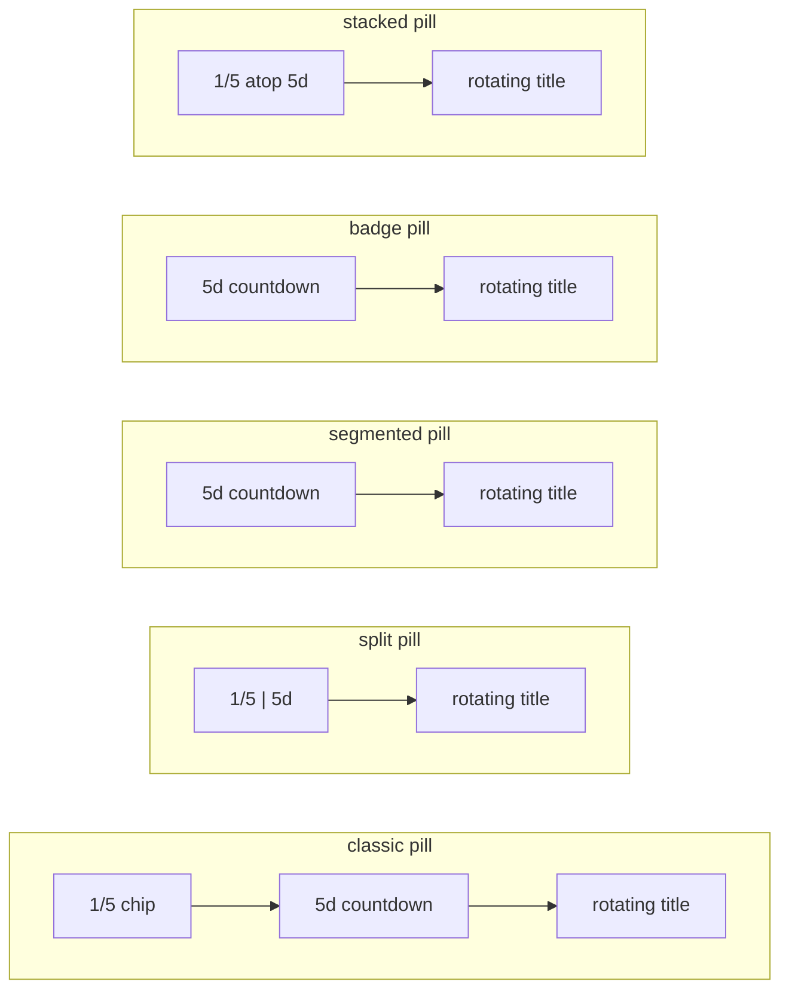

# 1. Pinned Events

The header's left edge carries the **pinned-events ticker** — the brand pill (logo
removed) that rotates through the upcoming pinned events' titles behind a
days-remaining countdown chip and one of five **indicator styles** (the
`pinnedTickerIndicator` feature flag, Settings → Feature Flags). Tapping it opens
a centered Modal listing every explicitly-pinned upcoming event. Both stay fresh
across mutations.

## Table of contents

- [1.1 Pinning an event](#11-pinning-an-event)
- [1.2 The server read](#12-the-server-read)
- [1.3 Opening an event: deep links](#13-opening-an-event-deep-links)
- [1.4 The header ticker](#14-the-header-ticker)
- [1.5 Panel state & components](#15-panel-state--components)
- [1.6 File index & related docs](#16-file-index--related-docs)

## 1.1 Pinning an event

- The wizard's **Other settings** step carries a **"Pin this event" switch** (any
  user) that sets the `pinned` notes flag. Tagging a whole department no longer pins
  by itself.
- The panel shows a **rolling today → 3-months window** (today through the end of the
  month two months out, matching the month-grid reads), **ignoring the dashboard's
  current filters**.

## 1.2 The server read

`src/lib/events/pinned.ts` (server actions):

- `fetchPinnedEvents()` month-reads **all** calendars through the events cache
  (`fetchRangeEvents`) and resolves display-ready data: titles rendered through the
  event-title templates and department names resolved. It backs **both** the panel
  and the header ticker — the ticker derives its count from the list length (the
  old count-only `countPinnedEvents` read is gone; the zero-event case early-returns
  before resolving users/types, so it stays cheap).
- Each consumer renders through its own **template-assignment target** (Settings →
  Templates → View assignments): the panel list via `pinned` (`PinnedEvent.title`),
  the header ticker via `pinnedHeader` (`PinnedEvent.tickerTitle`). Unassigned =
  master template, exactly like the dashboard views.
- The pure `selectUpcomingPinnedEvents` (`pinnedSelect.ts`, unit-tested) drops events
  already ended and sorts by start.

## 1.3 Opening an event: deep links

Tapping an event closes the panel and navigates through the shared
`buildEventDeepLink` (`src/lib/events/deepLink.ts`) to
`/dashboard?view=<active tab>&date=YYYY-MM-DD&event=<groupId>&_eventCal=<calendar id>`,
where the dashboard's `?event=` deep link opens the event's details modal
(Edit / Duplicate / Delete per the usual `isAdmin || creator` rule):

- `eventId` is the group id shared by all department copies of the event; legacy
  events without one fall back to the date alone.
- `view` carries the **active dashboard tab** (when the panel is opened on
  `/dashboard`), so opening a pinned event can never fall back to a different tab
  or switch the visible filters — the same guarantee event search relies on.
- `_eventCal` names the pinned copy's department calendar. The server resolves
  that one event **on its own**, over the target's **own** months
  (`deepLinkMonths(date)` — the event's month plus its neighbours), never the
  active tab's required months. A pinned event two months out therefore opens
  even from a Day/Agenda/Week tab, without changing the tab or its filters.
- The details modal opens **immediately as a skeleton** and the target resolves
  underneath (the Double Booking detail's pattern). The "Could not open that
  event" advisory appears only once the resolution has settled with no match —
  never while the read is still in flight.
- Opening from a non-dashboard page navigates to the dashboard first (the shell stays
  mounted, so the modal survives).

## 1.4 The header ticker

The pill at the header's **left edge** (it took the logo's slot — the "Cloudy2"
wordmark was removed) keeps the rounded-rectangle shape (the pin icon was
removed). It always shows, left to right: an optional position/count indicator
(see below), a **countdown chip** — whole days until the current event's start,
`5d` (lowercase d), computed as a date-part difference so a same-day or
already-started event reads `0d`; it never switches to months, so a far-future
event reads e.g. `45d` — and the **current event's `tickerTitle`**, one line,
ellipsis-truncated.

The **indicator style is a feature flag** (`pinnedTickerIndicator`, Settings →
Feature Flags, org-wide, default `classic`) — admins switch it to compare the
variants live and keep the winner:

| Flag | Indicator | Title space |
| ---- | --------- | ----------- |
| `classic` | inline amber **`1/N` chip** — position within the rotation plus how many events are pinned (replaced the floating amber `Indicator` badge) | baseline |
| `split` | the `1/N` and `5d` joined into one **two-tone pill** — amber left half (counter) + blue right half (countdown), content-sized so it reads as a single leading token | ~+5px |
| `segmented` | thin **segmented progress bar** along the pill's bottom edge — one segment per pinned event, the current rotation position lit amber (count + position at a glance, zero in-flow width) | +~37px |
| `badge` | compact amber **count badge** (`N`) over the pill's upper-right corner, absolutely positioned | +~37px |
| `stacked` | the `1/N` and `5d` folded into one narrow **two-line leading block** (position over countdown) | +~33px |

The variant is resolved once by the `(protected)` layout through the registry and
passed into `AppShellShell` as a prop (like `bannerConfig`), so a save on the
Feature Flags page is visible after the next `router.refresh()` — no reload.

Rotation (`PinnedEventsTicker.tsx`, client):

- Every **5s** (`ROTATE_INTERVAL_MS`) the next title slides in from below (the
  `c2-ticker-in` keyframe in `globals.css`, ~320ms, inside the app's
  `prefers-reduced-motion` guard — with reduced motion titles swap in place and
  the exit clone never renders); the outgoing title is swapped out instantly by
  the keyed remount (there is no exit animation).
- Rotation pauses while the pill is hovered or focused, while the tab is hidden,
  and while the panel modal is open (`paused` prop); a single pinned event never
  rotates.
- The index clamps with modulo when the list changes, so a mutation can never
  point at a missing entry. The segmented bar's active segment rides the same
  clamped index.
- The countdown re-reads the clock on a slow (60s) interval, so a single
  non-rotating pinned event still rolls its `D` count over at midnight.
- Loading / zero events: the pill degrades to the static "Pinned events" label
  (the pre-ticker look, now icon-less) with no indicator chrome.
- The static label is shared by three states (first read in flight, settled
  empty, failed read) **on purpose** — the pill is never the loading signal.
  The shell passes a `status` (`pending`/`ready`/`error`) that only changes
  the accessible name, so a screen reader hears "Loading pinned events…",
  "Pinned events" or "Pinned events unavailable" instead of a misleading
  permanent "still loading". The cold-start readiness indicator
  ([`loading-transitions.md` §1.13.1](loading-transitions.md#1131-cold-start-readiness))
  is the user-visible gauge for the once-per-launch data tail.

Sizing & a11y:

- CSS `max-width` on `.c2-pinned-ticker` caps the pill (~220px on phones,
  ~400px from the 40em desktop band) so it can't stretch across wide headers.
- The count rides the button's `aria-label` (`"Pinned events (5)"`); the count
  chip, the countdown chip, the badge, the stacked block and the rotating titles
  are `aria-hidden` (see [`accessibility.md`](accessibility.md) §1.4).

The list behind the ticker refreshes:

- on mount, on panel close, on tab refocus, and
- after every event create/update/delete via the
  `cloudy2:pinned-events-changed` window event (`PINNED_EVENTS_CHANGED_EVENT`,
  dispatched at the dashboard's `onDeleted` / form `onDone`).

## 1.5 Panel state & components

Open/close state lives in `AppShellShell` and rides `PinnedPanelContext`
(`src/lib/ui/pinnedPanel.ts`) — `openPanel(originRect)` carries the ticker pill's
bounding rect so the modal zooms out of / back into it (the app's standard grow/shrink
animation). The Modal itself is `src/components/PinnedEventsPanel.tsx`; the pill is
`src/components/PinnedEventsTicker.tsx`. The panel seeds its list from the shell's
already-fetched ticker list (`seedEvents` prop), so the first open renders real rows at
their final height — the loading skeleton (only shown in the cold-start race where the
shell's mount fetch hasn't resolved yet) is sized to a short list so it can never
overshoot the content and collapse the modal.

## 1.6 File index & related docs

| File | Role |
| ---- | ---- |
| `src/lib/events/pinned.ts` | `fetchPinnedEvents` (panel `title` + ticker `tickerTitle`) |
| `src/lib/events/pinnedSelect.ts` | Pure upcoming-window selection (unit-tested) |
| `src/lib/events/deepLink.ts` | Shared deep-link builder + `deepLinkMonths` target-month window |
| `src/lib/settings/featureFlags.ts` | The `pinnedTickerIndicator` flag registry entry |
| `src/lib/ui/pinnedPanel.ts` | `PinnedPanelContext` + change event name |
| `src/components/PinnedEventsTicker.tsx` | The header pill: indicator + countdown chips + rotating titles |
| `src/components/PinnedEventsPanel.tsx` | The panel Modal |

Related docs:

- [`events-cache.md`](events-cache.md) — the month reads behind the panel.
- [`event-lifecycle.md`](event-lifecycle.md) — the title templates (incl. the
  `pinned` / `pinnedHeader` view assignments).
- [`feature-flags.md`](feature-flags.md) — the `pinnedTickerIndicator` flag and
  how to add more.
- [`ui-state.md`](ui-state.md) — pinned dashboard view tabs (a separate feature).
