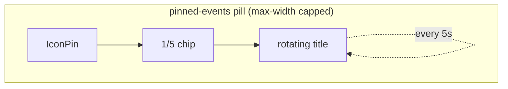

# 1. Pinned Events

The header's left edge carries the **pinned-events ticker** — the brand pill (pin
icon kept, logo removed) that rotates through the upcoming pinned events' titles
with an inline `1/N` count chip. Tapping it opens a centered Modal listing every
explicitly-pinned upcoming event. Both stay fresh across mutations.

## Table of contents

- [1.1 Pinning an event](#11-pinning-an-event)
- [1.2 The server read](#12-the-server-read)
- [1.3 Opening an event: deep links](#13-opening-an-event-deep-links)
- [1.4 The header ticker](#14-the-header-ticker)
- [1.5 Panel state & components](#15-panel-state--components)
- [1.6 File index & related docs](#16-file-index--related-docs)

## 1.1 Pinning an event

- The wizard's **Other settings** step carries a **"Pin this event" switch** (any
  user) that sets the `pinned` notes flag. Tagging a whole department no longer pins
  by itself.
- The panel shows a **rolling today → 3-months window** (today through the end of the
  month two months out, matching the month-grid reads), **ignoring the dashboard's
  current filters**.

## 1.2 The server read

`src/lib/events/pinned.ts` (server actions):

- `fetchPinnedEvents()` month-reads **all** calendars through the events cache
  (`fetchRangeEvents`) and resolves display-ready data: titles rendered through the
  event-title templates and department names resolved. It backs **both** the panel
  and the header ticker — the ticker derives its count from the list length (the
  old count-only `countPinnedEvents` read is gone; the zero-event case early-returns
  before resolving users/types, so it stays cheap).
- Each consumer renders through its own **template-assignment target** (Settings →
  Templates → View assignments): the panel list via `pinned` (`PinnedEvent.title`),
  the header ticker via `pinnedHeader` (`PinnedEvent.tickerTitle`). Unassigned =
  master template, exactly like the dashboard views.
- The pure `selectUpcomingPinnedEvents` (`pinnedSelect.ts`, unit-tested) drops events
  already ended and sorts by start.

## 1.3 Opening an event: deep links

Tapping an event closes the panel and navigates to
`/dashboard?date=YYYY-MM-DD&event=<groupId>`, where the dashboard's `?event=` deep
link auto-opens the event's details modal (Edit / Duplicate / Delete per the usual
`isAdmin || creator` rule):

- `eventId` is the group id shared by all department copies of the event; legacy
  events without one fall back to the date alone.
- The link also carries `&_eventCal=<calendar id>` (the pinned copy's department
  calendar), so `page.tsx` adds that calendar to the fetch set only — a pinned
  event outside the current view's filters still opens. This mirrors event search.
- Opening from a non-dashboard page navigates to the dashboard first (the shell stays
  mounted, so the modal survives).

## 1.4 The header ticker

The pill at the header's **left edge** (it took the logo's slot — the "Cloudy2"
wordmark was removed) keeps the rounded-rectangle shape and the pin icon, and
shows, left to right:

1. the pin icon,
2. an inline amber **count chip** — `1/N`, position within the rotation plus how
   many events are pinned (this replaced the floating amber `Indicator` badge,
   same accent color, now inline with the text), and
3. the **current event's `tickerTitle`**, one line, ellipsis-truncated.

Rotation (`PinnedEventsTicker.tsx`, client):

- Every **5s** (`ROTATE_INTERVAL_MS`) the next title slides in from below while
  the outgoing one slides up and out (`c2-ticker-in`/`c2-ticker-out` keyframes in
  `globals.css`, ~320ms, inside the app's `prefers-reduced-motion` guard — with
  reduced motion titles swap in place and the exit clone never renders).
- Rotation pauses while the pill is hovered or focused, while the tab is hidden,
  and while the panel modal is open (`paused` prop); a single pinned event never
  rotates.
- The index clamps with modulo when the list changes, so a mutation can never
  point at a missing entry.
- Loading / zero events: the pill degrades to the static `IconPin` +
  "Pinned events" label (the pre-ticker look).
- The static label is shared by three states (first read in flight, settled
  empty, failed read) **on purpose** — the pill is never the loading signal.
  The shell passes a `status` (`pending`/`ready`/`error`) that only changes
  the accessible name, so a screen reader hears "Loading pinned events…",
  "Pinned events" or "Pinned events unavailable" instead of a misleading
  permanent "still loading". The cold-start readiness indicator
  ([`loading-transitions.md` §1.13.1](loading-transitions.md#1131-cold-start-readiness))
  is the user-visible gauge for the once-per-launch data tail.

Sizing & a11y:

- CSS `max-width` on `.c2-pinned-ticker` caps the pill (~220px on phones,
  ~400px from the 40em desktop band) so it can't stretch across wide headers.
- The count rides the button's `aria-label` (`"Pinned events (5)"`); the chip
  and the rotating titles are `aria-hidden` (see
  [`accessibility.md`](accessibility.md) §1.4).

The list behind the ticker refreshes:

- on mount, on panel close, on tab refocus, and
- after every event create/update/delete via the
  `cloudy2:pinned-events-changed` window event (`PINNED_EVENTS_CHANGED_EVENT`,
  dispatched at the dashboard's `onDeleted` / form `onDone`).

## 1.5 Panel state & components

Open/close state lives in `AppShellShell` and rides `PinnedPanelContext`
(`src/lib/ui/pinnedPanel.ts`) — `openPanel(originRect)` carries the ticker pill's
bounding rect so the modal zooms out of / back into it (the app's standard grow/shrink
animation). The Modal itself is `src/components/PinnedEventsPanel.tsx`; the pill is
`src/components/PinnedEventsTicker.tsx`. The panel seeds its list from the shell's
already-fetched ticker list (`seedEvents` prop), so the first open renders real rows at
their final height — the loading skeleton (only shown in the cold-start race where the
shell's mount fetch hasn't resolved yet) is sized to a short list so it can never
overshoot the content and collapse the modal.

## 1.6 File index & related docs

| File | Role |
| ---- | ---- |
| `src/lib/events/pinned.ts` | `fetchPinnedEvents` (panel `title` + ticker `tickerTitle`) |
| `src/lib/events/pinnedSelect.ts` | Pure upcoming-window selection (unit-tested) |
| `src/lib/ui/pinnedPanel.ts` | `PinnedPanelContext` + change event name |
| `src/components/PinnedEventsTicker.tsx` | The header pill: count chip + rotating titles |
| `src/components/PinnedEventsPanel.tsx` | The panel Modal |

Related docs:

- [`events-cache.md`](events-cache.md) — the month reads behind the panel.
- [`event-lifecycle.md`](event-lifecycle.md) — the title templates (incl. the
  `pinned` / `pinnedHeader` view assignments).
- [`ui-state.md`](ui-state.md) — pinned dashboard view tabs (a separate feature).
