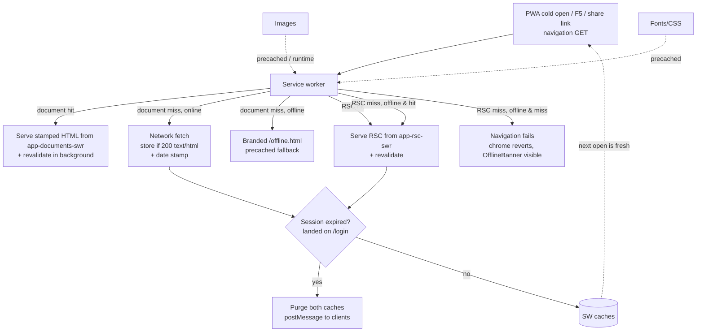
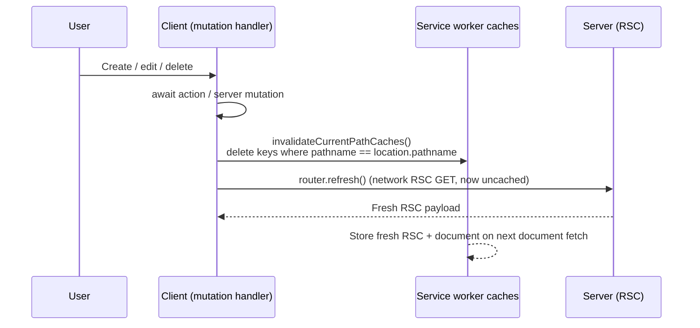

# 1. PWA offline & instant open

The PWA opens with calendar events visible instantly — even cold or offline — by serving previously-rendered pages from the service worker's cache. This document describes the client-side stale-while-revalidate layer, its routes, invalidation, offline fallback, and testing. The concise architecture note lives in `AGENTS.md`; the phase write-up is in `progress-archive.md`.

## Table of contents

- [1.1 Problem](#11-problem)
- [1.2 Goals & non-goals](#12-goals--non-goals)
- [1.3 Architecture overview](#13-architecture-overview)
- [1.4 Service worker routes](#14-service-worker-routes)
- [1.5 Document cache — instant cold open](#15-document-cache--instant-cold-open)
- [1.6 RSC cache — instant in-app navigation & offline views](#16-rsc-cache--instant-in-app-navigation--offline-views)
- [1.7 Cache invalidation after mutations](#17-cache-invalidation-after-mutations)
- [1.8 Offline fallback](#18-offline-fallback)
- [1.9 Session expiry](#19-session-expiry)
- [1.10 Staleness indicator](#110-staleness-indicator)
- [1.11 Constants & configuration](#111-constants--configuration)
- [1.12 Pure helpers & testing](#112-pure-helpers--testing)
- [1.13 Sign-out](#113-sign-out)
- [1.14 File index & related docs](#114-file-index--related-docs)
- [1.15 Limitations & follow-ups](#115-limitations--follow-ups)

## 1.1 Problem

Until this phase the service worker (`src/app/sw.ts`) ran a blanket `NetworkOnly` for every same-origin request (Phase 3a decision: "Cloudy data can never be stale"). Static assets (JS chunks, CSS, fonts, icons) were precached and fast, but the *document* — the SSR HTML that contains the rendered event grid — still required a server round-trip (DB + Google Calendar cache read, 1–3 s on a Google miss). A cold PWA open (tap the installed icon, F5, share link) therefore showed a white screen / skeleton until the server finished. While offline, the same request failed with the browser's dead-page error even when a perfectly usable previous view existed on-device.

## 1.2 Goals & non-goals

**Goals**

- A cold PWA open shows the last-saved calendar instantly (full SSR markup from cache) and revalidates in the background — the server's own 60 s-fresh / 30 min-SWR Google cache (see `docs/events-cache.md`) governs that revalidation.
- In-app navigation is instant when the target state was previously visited, including while offline.
- Reads are offline-capable (last-saved views render); an explicit "Force refresh" always bypasses the cache.
- Post-mutation views never render stale (create/edit/delete is visible on the very next paint).
- Installability and precaching remain Turbopack-native (Serwist).

**Non-goals**

- Offline *mutations* (creating/editing events while offline) — offline is read-only; the attempt surfaces an error toast. No local write queue.
- Push notifications (still deferred — needs VAPID + backend).
- IndexedDB snapshot rendered before the first-ever open (would be needed for instant on a brand-new device that has never opened the app online — covered by the document cache after the first online open, which is the actual "install → open → instant" flow).

## 1.3 Architecture overview

## 1.4 Service worker routes

`src/app/sw.ts` registers, in order (first match wins):

1. **Static images** — `StaleWhileRevalidate`, `static-image-assets` (64 entries, 30 d).
2. **Fonts/CSS** — `CacheFirst`, `static-style-assets` (32 entries, 7 d).
3. **RSC cache** — see §1.6.
4. **Document cache** — see §1.5.
5. **Same-origin fallback** — `NetworkOnly` (auth, `/api/*`, non-GET, and anything unmatched — auth responses must never be cached).

Matcher predicates are pure and imported from `src/lib/pwa/swRules.ts` (see §1.12), so they are unit-tested.

## 1.5 Document cache — instant cold open

- **Cache:** `app-documents-swr` — `StaleWhileRevalidate` + `ExpirationPlugin` (48 entries, 30 d, `maxAgeFrom: last-used`, `purgeOnQuotaError`).
- **Matcher:** same-origin `GET` with `request.mode === "navigate"` and `isCacheableDocumentRequest(url, origin)` — i.e. not `/login`, `/api/*`, `/serwist/*`, `/_next/*`.
- **Key:** exact URL including query — `?refresh=` nonce, `?edit=` deep links, `_fresh` marker are therefore naturally always-fresh (different keys).
- **Stored responses:** `shouldStoreDocumentResponse` — 200 + `text/html` + not a login redirect + not an excluded pathname.
- **Stamping:** `cachedResponseWillBeUsed` reads the cached `Date` header as `cachedAt`, runs `stampDocument(html, cachedAt)` — injects `` after `<head>` — so the page can show a "Saved · HH:MM" chip (see §1.10).
- **Background revalidation:** `StaleWhileRevalidate` fetches the network in parallel and updates the cache; the served document is the stamped stale copy. The next open is warmer without any client `router.refresh()` on mount (avoids a skeleton flash — the cached HTML already contains the full grid).
- **Session-expiry guard:** `cacheWillUpdate` + `fetchDidSucceed` call `isSessionExpiredResponse` (final URL is `/login`) → purge both caches + `postMessage({type:"cloudy2:session-expired"})` → client in `AppProviders` hard-redirects to `/login`. The login page itself is never written under a protected page's key.

## 1.6 RSC cache — instant in-app navigation & offline views

- **Cache:** `app-rsc-swr` — `StaleWhileRevalidate` + `ExpirationPlugin` (64 entries, 30 d).
- **Matcher:** same-origin `GET` with `RSC: 1` header and `isCacheableRscRequest` (excludes the same prefixes). Covers soft navigations and `<Link>` prefetches (which carry `Next-Router-Prefetch: 1`).
- **Stored responses:** `shouldStoreRscResponse` — 200 + `text/x-component` + not a login redirect.
- **Offline navigation:** cache hit → instant; miss + offline → navigation fails — Next's transition ends and the chrome reverts (per `docs/loading-transitions.md`), with `OfflineBanner` visible. Month/day changes that are local state (in-month day taps, filter drafts) never need a fetch and keep working.
- **Same session-expiry guard as documents.**

## 1.7 Cache invalidation after mutations

`StaleWhileRevalidate` for RSC would otherwise serve the pre-mutation RSC on the immediate `router.refresh()` after a create/edit/delete. Every mutation site therefore **invalidates the current pathname's entries in both caches before refreshing**:

- Helper: `invalidatePathCaches(pathname)` / `invalidateCurrentPathCaches()` in `src/lib/pwa/client.ts` (reads `caches`, filters keys by `origin + pathname`, fire-and-forget, never throws).
- 22 `router.refresh()` call sites across 12 files were migrated to `void invalidateCurrentPathCaches().then(() => router.refresh())`.
- The same helper is used for the document cache — a hard reload (F5) after a mutation also cannot serve the pre-mutation document.
- The dashboard's **Pin/Unpin tab** toggle fires the same invalidation, fire-and-forget and without a refresh: pinning only writes the `cloudy2.ui` cookie (no navigation, no URL change), so every SWR-cached `/dashboard` document and RSC payload rendered before the toggle still carries the old tab order. Serving one on the next reload or soft navigation would re-seed the `pinnedViews` prop and the state writer would then clobber the fresh pin in the cookie — losing it for good. `togglePinView` therefore calls `invalidateCurrentPathCaches()` before `setPinned`; the cost is that the next dashboard load after a toggle bypasses the instant cache (pin toggles are rare).

## 1.8 Offline fallback

- `public/offline.html` is a branded, self-contained HTML file (navy header, no external assets) included in `__SW_MANIFEST` as `/offline.html` (see the `precacheEntries` log: `71 precache entries` after the change).
- The document `handlerDidError` plugin returns `caches.match("/offline.html")` when a navigation has neither a cache hit nor a successful network fetch — i.e. offline on a never-visited view. If the precache lookup fails, an inline minimal HTML response is returned instead.
- Offline with a previously visited view → served from `app-documents-swr` / `app-rsc-swr`, no fallback needed.
- `OfflineBanner` (`src/components/OfflineBanner.tsx`) still shows the amber "You're offline" strip globally.

## 1.9 Session expiry

When the session expires, background revalidations for protected pages redirect to `/login` (the protected layout's `requireSession()` issues a 307 to `/login`). Without a guard, the SW would cache the login HTML under the protected page's URL and the next open would show the login page at, e.g., `/dashboard`.

Guard (both caches, both `cacheWillUpdate` and `fetchDidSucceed`):

- `isSessionExpiredResponse({finalUrl})` — checks `finalUrl`'s pathname is `/login`.
- On match: `purgePageCaches()` (`caches.delete` for both names) + `notifySessionExpired()` (`clients.matchAll` + `postMessage`).
- `cacheWillUpdate` returns `null` so the redirect is never written.
- Client: `useSessionExpiryRedirect` in `AppProviders` listens on `navigator.serviceWorker` `message` and does `window.location.assign("/login")`.

Shared devices are covered by the sign-out purge as well (see §1.13).

## 1.10 Staleness indicator

The document stamp (`window.__C2_STAMP__.cachedAt`) is read by `SavedDataChip` (`src/components/SavedDataChip.tsx`) at mount. When present, a subtle `Badge` ("Saved · 12:04") renders centered beneath the date-nav row in `DashboardView` with a tooltip showing the full timestamp and a hint to force-refresh. When the document was fresh (no stamp), the chip renders nothing. The chip is intentionally muted (grey `light` badge) — secondary chrome below the date-nav chevrons.

## 1.11 Constants & configuration

| Constant | Value | Where |
|---|---|---|
| `APP_DOCUMENT_CACHE` | `app-documents-swr` | `src/lib/pwa/swRules.ts` |
| `APP_RSC_CACHE` | `app-rsc-swr` | `src/lib/pwa/swRules.ts` |
| Document entries | 48, 30 d, `last-used` | `src/app/sw.ts` |
| RSC entries | 64, 30 d, `last-used` | `src/app/sw.ts` |
| Image cache | 64, 30 d | `src/app/sw.ts` |
| Font/CSS cache | 32, 7 d | `src/app/sw.ts` |

All expiration plugins use `purgeOnQuotaError` (implicit via Serwist defaults where applicable — the document/RSC plugins set it explicitly).

## 1.12 Pure helpers & testing

Pure logic lives in `src/lib/pwa/swRules.ts` so it is unit-tested without a live SW or `caches`:

- `isCacheableDocumentRequest(url, origin)`
- `isCacheableRscRequest(url, origin, headers)`
- `shouldStoreDocumentResponse(check)` / `shouldStoreRscResponse(check)`
- `isSessionExpiredResponse(check)`
- `keysForPathname(keys, origin, pathname)`
- `stampDocument(html, cachedAtIso)`

Tests: `src/lib/pwa/swRules.test.ts` (16 cases). The SW bundle itself (`src/app/sw.ts`) is wiring only — no branching logic to test there. Integration is validated by `pnpm build` (precache count) + manual PWA checks: second open instant + chip, F5, force-refresh bypass, deep links, offline cold open, offline view switching, offline mutation error, sign-out isolation, killed-session purge.

## 1.13 Sign-out

`UserMenu` (`src/components/UserMenu.tsx`) now calls `clearAllSavedPages()` (deletes both SW caches) beside `clearUiState()` before `signOut({callbackUrl: "/login"})`, so the next account on the same device cannot see the previous user's cached calendar.

## 1.14 File index & related docs

| File | Role |
|---|---|
| `src/app/sw.ts` | Serwist SW: precache + 5 runtime routes (images, fonts, RSC, documents, NetworkOnly fallback) |
| `src/lib/pwa/swRules.ts` | Pure predicates & constants (see §1.12) |
| `src/lib/pwa/swRules.test.ts` | Unit tests for the above |
| `src/lib/pwa/client.ts` | Client cache helpers: `invalidatePathCaches`, `invalidateCurrentPathCaches`, `clearAllSavedPages`, `readStaleStamp` |
| `src/components/SavedDataChip.tsx` | "Saved · HH:MM" chip |
| `src/components/AppProviders.tsx` | Session-expiry `message` listener |
| `src/components/UserMenu.tsx` | Sign-out cache purge |
| `public/offline.html` | Branded offline fallback (precached) |
| `src/app/(protected)/dashboard/DashboardView.tsx` | Chip placement + `router.refresh` → invalidate-then-refresh + pin-toggle cache invalidation (§1.7) |
| `src/app/(protected)/settings/**` + `src/components/LoginForm.tsx` | Same invalidate-then-refresh migration |
| `docs/pwa-offline.md` | This document |
| `docs/events-cache.md` | Server-side Google Calendar cache (the background revalidation target) |
| `docs/loading-transitions.md` | Skeleton / `staleTimes` / transition chrome that the SW complements |

## 1.15 Limitations & follow-ups

- Offline mutations remain an error (no local queue / background sync). A future phase could add a `BackgroundSync` queue for event creates/updates and a conflict UI — deliberately not included here.
- First-ever open on a brand-new device needs one online visit before instant/offline works (the caches are populated on that first successful render). An IndexedDB snapshot rendered before the first RSC would cover this, but the value is low given the install flow already requires connectivity.
- Push notifications remain deferred (needs VAPID + backend) — unchanged from Phase 3a.
