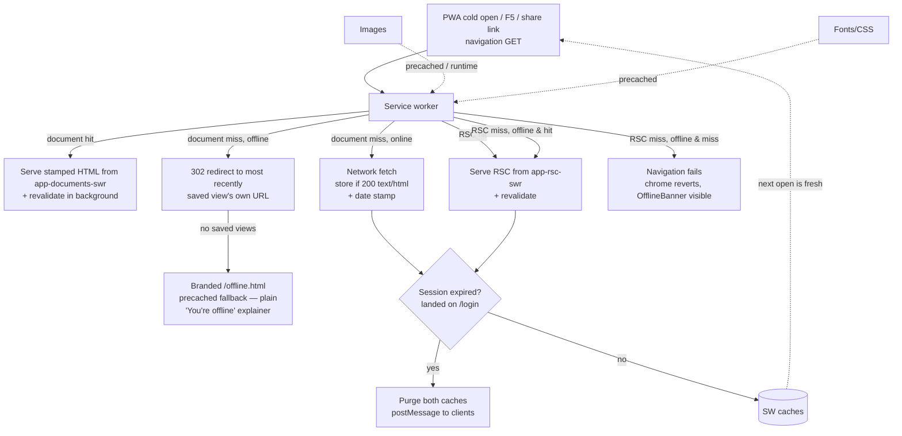
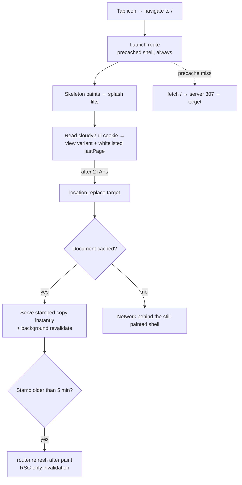
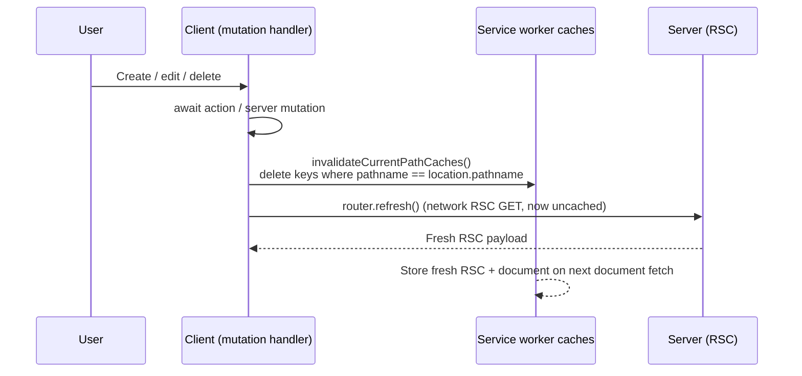
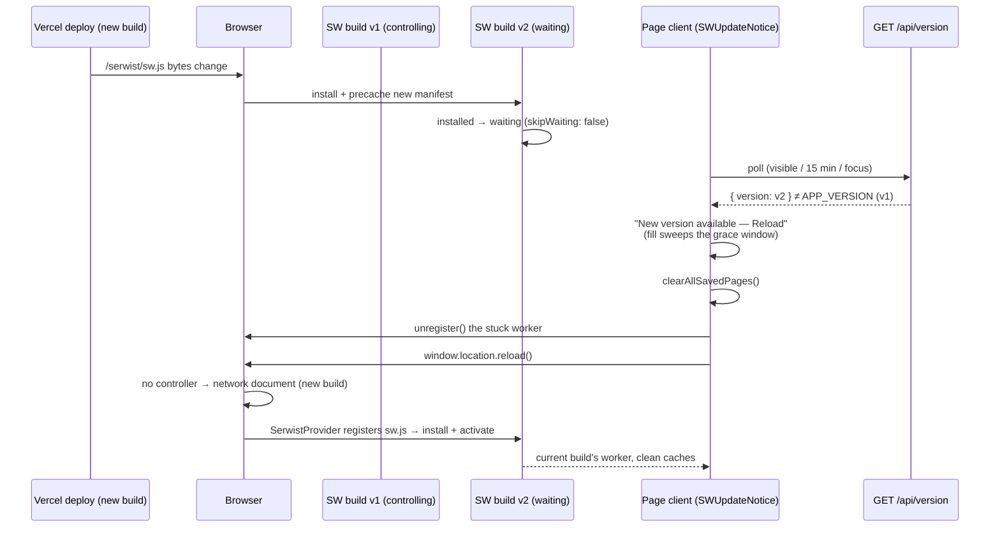
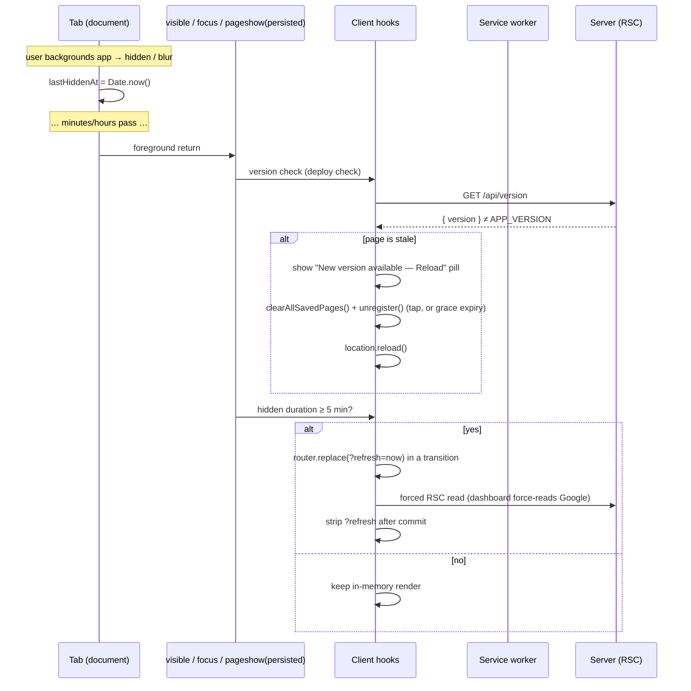
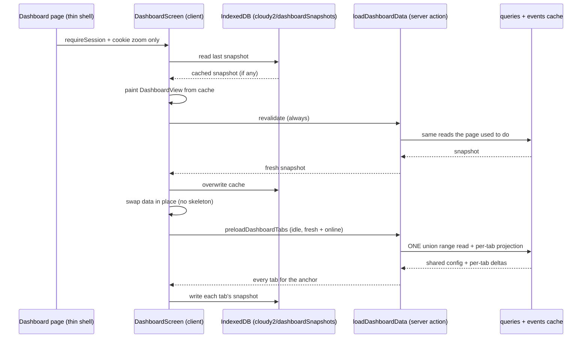

# 1. PWA offline & instant open

The PWA opens with calendar events visible instantly — even cold or offline — by serving previously-rendered pages from the service worker's cache. This document describes the client-side stale-while-revalidate layer, its routes, invalidation, new-build takeover, offline fallback, and testing. The concise architecture note lives in `AGENTS.md`; the phase write-up is in `progress-archive.md`.

## Table of contents

- [1.1 Problem](#11-problem)
- [1.2 Goals & non-goals](#12-goals--non-goals)
- [1.3 Architecture overview](#13-architecture-overview)
- [1.4 Service worker routes](#14-service-worker-routes)
- [1.5 Document cache — instant cold open](#15-document-cache--instant-cold-open)
  - [1.5.1 Launch path (start URL)](#151-launch-path-start-url)
- [1.6 RSC cache — instant in-app navigation & offline views](#16-rsc-cache--instant-in-app-navigation--offline-views)
- [1.7 Cache invalidation after mutations](#17-cache-invalidation-after-mutations)
- [1.8 New build (deploy) takeover](#18-new-build-deploy-takeover)
  - [1.8.1 Platform note — iOS vs Android](#181-platform-note--ios-vs-android)
- [1.9 Offline fallback](#19-offline-fallback)
- [1.10 Session expiry](#110-session-expiry)
- [1.11 On-demand refresh (pull-to-refresh disabled)](#111-on-demand-refresh-pull-to-refresh-disabled)
- [1.12 Constants & configuration](#112-constants--configuration)
- [1.13 Pure helpers & testing](#113-pure-helpers--testing)
- [1.14 Sign-out](#114-sign-out)
- [1.15 File index & related docs](#115-file-index--related-docs)
- [1.16 Limitations & follow-ups](#116-limitations--follow-ups)
- [1.17 Auto-refresh on return from background](#117-auto-refresh-on-return-from-background)
- [1.18 Device-local dashboard snapshot](#118-device-local-dashboard-snapshot)
- [1.19 Android edge-to-edge (system navigation bar)](#119-android-edge-to-edge-system-navigation-bar)

## 1.1 Problem

Until this phase the service worker (`src/app/sw.ts`) ran a blanket `NetworkOnly` for every same-origin request (Phase 3a decision: "Cloudy2 data can never be stale"). Static assets (JS chunks, CSS, fonts, icons) were precached and fast, but the *document* — the SSR HTML that contains the rendered event grid — still required a server round-trip (DB + Google Calendar cache read, 1–3 s on a Google miss). A cold PWA open (tap the installed icon, F5, share link) therefore showed a white screen / skeleton until the server finished. While offline, the same request failed with the browser's dead-page error even when a perfectly usable previous view existed on-device.

## 1.2 Goals & non-goals

**Goals**

- A cold PWA open shows the last-saved calendar instantly (full SSR markup from cache) and revalidates in the background — the server's own 60 s-fresh / 30 min-SWR Google cache (see `docs/events-cache.md`) governs that revalidation.
- In-app navigation is instant when the target state was previously visited, including while offline.
- Reads are offline-capable (last-saved views render); an explicit "Force refresh" always bypasses the cache.
- Post-mutation views never render stale (create/edit/delete is visible on the very next paint).
- A deployed build takes over a running installed app: the tab reloads under the new build and no old-build page or payload is ever served.
- Installability and precaching remain Turbopack-native (Serwist).

**Non-goals**

- Offline *mutations* (creating/editing events while offline) — offline is read-only; the attempt surfaces an error toast. No local write queue.
- Push notifications (still deferred — needs VAPID + backend).
- IndexedDB snapshot rendered before the first-ever open (would be needed for instant on a brand-new device that has never opened the app online — covered by the document cache after the first online open, which is the actual "install → open → instant" flow).

## 1.3 Architecture overview

## 1.4 Service worker routes

`src/app/sw.ts` registers, in order (first match wins):

1. **Static images** — `StaleWhileRevalidate`, `static-image-assets` (64 entries, 30 d).
2. **Fonts/CSS** — `CacheFirst`, `static-style-assets` (32 entries, 7 d).
3. **RSC cache** — see §1.6.
4. **Launch path (start URL `/`)** — the precached shell, always; see §1.5.1.
5. **Document cache** — `StaleWhileRevalidate`, cached copy served at any age; see §1.5.
6. **Same-origin fallback** — `NetworkOnly` (auth, `/api/*`, non-GET, and anything unmatched — auth responses must never be cached).

Matcher predicates are pure and imported from `src/lib/pwa/swRules.ts` (see §1.13), so they are unit-tested.

## 1.5 Document cache — instant cold open

- **Cache:** `app-documents-swr-v<build>` — the `app-documents-swr` prefix plus a per-build version token (`swCacheVersion`, §1.8) — `ExpirationPlugin` (48 entries, 30 d, `maxAgeFrom: last-used`, `purgeOnQuotaError`).
- **Strategy: `StaleWhileRevalidate`, at any age.** A hard navigation (launch target, F5, share link) serves the cached document the moment one exists and revalidates in the background — the launch must never block on a cold serverless round trip. With no entry the route is a plain network read (and stores the response); when the network *fails* it still falls back to the cache, and with both exhausted `handlerDidError` reaches the §1.9 fallback exactly as before. There is deliberately **no `networkTimeoutSeconds`** anywhere: on a cold function + cold Neon a fresh response routinely outlives any sane timeout.

  **Routing by cache age was tried and reverted** (instant when younger than `DOCUMENT_FRESH_WINDOW_MS`, `NetworkFirst` when older). Two reasons it broke: the "older" branch *is* the common case — an app reopened after a coffee break is always >5 min stale — so the launch blocked on the cold stack again; and because the launch shell hands off with a real navigation (§1.5.1), that wait presented as the **Android splash sitting through the entire cold boot**, which is the bug §1.5.1 exists to kill.

  Staleness is instead handled **after** paint, not before it: the served copy is stamped (§1.5 "Stamping") and `useStaleDocumentReconcile` (`src/lib/pwa/client.ts`, mounted in `AppProviders`) fires **one** non-blocking `router.refresh()` per document load when the stamp is older than `DOCUMENT_FRESH_WINDOW_MS` (5 min). The user sees the last-saved grid immediately and the live one a beat later. The reconcile clears only the **RSC** entries for the pathname (`invalidateRscPathCaches`) — it must not delete the cached *document*, or the next launch would have nothing instant to serve; the SW's own background revalidation already refreshes that entry. This is the one intentional exception to the "invalidate before every `router.refresh()`" rule (§1.7).

  Both document and RSC caches keep **one** plugins array per strategy instance on purpose: `ExpirationPlugin` keys its `CacheExpiration` by the `cacheName` handed to each callback, so a single instance manages its cache correctly — two would double-manage it (duplicate IndexedDB bookkeeping and redundant deletes).
- **Matcher:** same-origin `GET` with `request.mode === "navigate"` and `isCacheableDocumentRequest(url, origin)` — i.e. not `/login`, `/api/*`, `/serwist/*`, `/_next/*`.
- **Key:** exact URL including query — `?refresh=` nonce, `?event=` / `?edit=` deep links are therefore naturally always-fresh (different keys).
- **Stored responses:** `shouldStoreDocumentResponse` — 200 + `text/html` + not a login redirect + not an excluded pathname + no one-shot param (`refresh`/`edit`/`event`/`_fresh`). One-shot URLs are stripped by the client right after their render and never requested again, so storing them would only pollute the cache and let the offline fallback pick a stale nonce entry as "newest".
- **Stamping:** `cachedResponseWillBeUsed` reads the cached `Date` header as `cachedAt`, runs `stampDocument(html, cachedAt)` — injects `` after `<head>` — so the client can tell a cache hit from a network render and reconcile stale copies after paint (§1.5, `documentCachedAtIso` → `needsReconcile`). A document served straight off the network carries **no** stamp, which is how the client tells "already fresh" from "cached".
- **Background revalidation:** `StaleWhileRevalidate` fetches the network in parallel and updates the cache, so the next open is warmer on its own. The *current* render is brought up to date by the after-paint reconcile above — never in front of the first paint.
- **Session-expiry guard:** `cacheWillUpdate` + `fetchDidSucceed` call `isSessionExpiredResponse` (final URL is `/login`) → purge both caches + `postMessage({type:"cloudy2:session-expired"})` → client in `AppProviders` hard-redirects to `/login`. The login page itself is never written under a protected page's key.

### 1.5.1 Launch path (start URL)

Chrome dismisses the Android PWA splash on the launch page's **first non-empty
paint** (Chromium's `WebappSplashScreenController`). So the splash's duration is
exactly "time until something paints" — and the start URL `/` is a *dynamic*
server route (it reads the remembered-page cookie and 307s). Letting a launch
reach the network therefore means the tap waits on a full serverless cold boot
before a single byte arrives, and the splash sits there for the whole thing.

The service worker answers `/` from the **precache** instead, and the shell
resolves the target on the client, so **nothing on the server is on the critical
path to first paint**:

1. `isLaunchRequest` (same-origin GET navigation, `isStartUrlRequest`) matches
 before the document route (first-match-wins). `isStartUrlRequest` is
 deliberately **lenient**: `/` plus any `utm_*` params counts (a launcher can
 tag the start URL), and a hash is ignored. The first version demanded an
 exactly query-less `/`, and one unexpected param was enough to fall through
 to the document route — i.e. back to a blocking network read with the splash
 still up.
2. `handleLaunchRequest` returns `serwist.matchPrecache("/loading.html")` — the
 launch shell. **Always.** Network `fetch` only on a precache miss (the very
 first navigation racing `install`, or an eviction).
3. `public/loading.html` paints the branded skeleton → **splash lifts**.
4. Its inline script reads the client-owned `cloudy2.ui` cookie (base64url JSON,
 same codec as `decodeUiState`), whitelists `lastPage`, and `location.replace`s
 to it — default `/dashboard`. It also pre-selects the skeleton variant
 matching the remembered `dashboard.view` and applies the manual color-scheme
 override (see below).
5. The document route (§1.5) then serves that target: instantly from the cache
 whenever a copy exists (any age), from the network only when none does. A
 cached copy is stamped, so the after-paint reconcile (§1.5) upgrades the view
 when it is older than 5 minutes.

Three properties are load-bearing; changing either reintroduces the original
bug:

- **The shell answer is unconditional, and the launch route never redirects.**
  On a cold launch *nothing* is painted yet — the splash is all that is on
  screen — so a redirect from the launch route replaces the guaranteed paint
  with a second navigation, and if that one has to wait on the network the user
  watches the splash through the whole cold boot. (A previous revision did
  exactly that: it peeked at the remembered page in the request's `Cookie`
  header and 302'd to a still-fresh cached document. That could never work —
  `Cookie` is a **forbidden request header**, appended by the Fetch standard in
  the network & cache layer *after* service-worker interception, so
  `request.headers` never carries it — and wherever it is leaked, the redirect
  was the nothing-painted path.) The runtime page caches are versioned per build
  and wiped on `activate` (§1.8), and `clearAllSavedPages()` runs on controller
  change, so any shortcut keyed on "is there a saved view?" would go inert on
  the first launches after a deploy anyway — precisely when the function and
  Neon are coldest. The precache is written at **install**, so the shell is the
  only always-available answer.
- **The redirect waits for a presented frame.** The script defers
  `location.replace` behind two nested `requestAnimationFrame`s. The parser can
  otherwise reach it before the browser has presented a frame, and navigating
  away pre-paint means the splash never lifts at all.
- **The launch matcher stays lenient** (point 1 above).

`launchShell.test.ts` guards all three: the shell's route whitelist (against
`BASE_PAGES`/`SETTINGS_SUBTABS`), its paint-before-redirect structure, the
absence of any `fetch(` in the shell, and — by parsing `src/app/sw.ts` — that
`handleLaunchRequest` contains no redirect and no cookie peek.

The shell's whitelist only needs to be *safe*, not authoritative — `/settings/*`
is still enforced server-side by `requireAdmin()` (a signed-in non-admin is
redirected to `/dashboard`, not `/login`), so an over-permissive entry costs at
most one redirect. The server `/` route (`src/app/page.tsx`) stays as-is
for contexts the SW does not control: the first-ever visit, desktop browsers, and
SW-less environments.

**The shell is pixel-matched to the app's route skeleton.** Because a launch can
hand off from the shell either to a cached document or to the streamed
`loading.tsx` fallback (§1.5), the two must read as one skeleton, not two:
`loading.html` mirrors `dashboard/loading.tsx` + `calendarSkeleton.tsx` — all
five view variants (month / week (H) / week (D) matrix / agenda / schedule,
pre-rendered and selected by `main[data-view]` from the remembered view), the
same Mantine v9 palette values (light `#fff` body / `#dee2e6` skeletons; dark
`#242424` / `#424242`), the same skeleton pulse (opacity 0.4 → 1, 1500 ms), the
same brand-blue header bar and mobile bottom-nav placeholders, and the manual
`mantine-color-scheme-value` localStorage override applied pre-paint (matching
`defaultColorScheme="auto"`). `launchShell.test.ts` guards the variant set, the
default view, and the scheme override. Known gaps: a configured announcement
banner's height can't be mirrored in this static shell — the shell always draws
the bare 56px bar, so a banner-configured deployment shifts by the banner
height exactly at the shell→app handoff (the app itself is aligned from first
paint, `announcement-banner.md` §1.3.1; warm launches served straight from the
document cache skip the shell entirely), and the desktop sidebar isn't mirrored
(mobile-first; desktop is unaffected by the splash path).

**One caveat on "no server round trip":** `navigationPreload: true` is enabled
globally (`Serwist.ts` → `registration.navigationPreload.enable()`), so the
browser still issues a preload `GET /` on every launch even though we answer
from the precache. It is never awaited and never blocks paint — and it usefully
*warms* the serverless function and Neon while the shell paints, so the target
navigation that follows a moment later often lands on an already-booting
instance. The claim is that the server is off the **critical path**, not that it
is never contacted.

## 1.6 RSC cache — instant in-app navigation & offline views

- **Cache:** `app-rsc-swr-v<build>` — same per-build versioning as the document cache (§1.8) — `StaleWhileRevalidate` + `ExpirationPlugin` (64 entries, 30 d).
- **Matcher:** same-origin `GET` with `RSC: 1` header and `isCacheableRscRequest` (excludes the same prefixes). Covers soft navigations and `<Link>` prefetches (which carry `Next-Router-Prefetch: 1`).
- **Always-fresh routes:** `isAlwaysFreshPath` (`swRules.ts`) additionally excludes routes whose content changes independently of the visiting client — currently only `/settings/audit-log`, a diagnostic stream that gains a row on every mutation anywhere. Both its RSC and document requests fall through to `NetworkOnly`, so they are never served stale; the client also self-revalidates on entry and on Force refresh (`useLiveRouteRefresh`, §1.11). The trade-off is no offline/instant-cached viewing of that one admin page (documented in `docs/audit-log.md` §1.10).
- **Stored responses:** `shouldStoreRscResponse` — 200 + `text/x-component` + not a login redirect + no one-shot param (`refresh`/`edit`/`event`/`_fresh`) + not an excluded/always-fresh path, same rationale as §1.5.
- **Offline navigation:** cache hit → instant; miss + offline → navigation fails — Next's transition ends and the chrome reverts (per `docs/loading-transitions.md`), with `OfflineBanner` visible. Month/day changes that are local state (in-month day taps, filter drafts) never need a fetch and keep working.
- **Same session-expiry guard as documents.**

## 1.7 Cache invalidation after mutations

`StaleWhileRevalidate` for RSC would otherwise serve the pre-mutation RSC on the immediate `router.refresh()` after a create/edit/delete. Every mutation site therefore **invalidates the current pathname's entries in both caches before refreshing**:

- Helper: `invalidatePathCaches(pathname)` / `invalidateCurrentPathCaches()` in `src/lib/pwa/client.ts` (reads `caches`, matches page caches by prefix across every build version, filters keys by `origin + pathname`, fire-and-forget, never throws).
- Post-mutation `router.refresh()` call sites now go through the shared `useActivityRefresh` hook (see [`loading-transitions.md` §1.13](loading-transitions.md)), which calls `invalidateCurrentPathCaches()` before refreshing.
- The same helper is used for the document cache — a hard reload (F5) after a mutation also cannot serve the pre-mutation document.
- **The one exception is the after-paint reconcile (§1.5)**, which calls `invalidateRscPathCaches` instead: it wants a live RSC read but must leave the cached *document* in place, because that entry is what makes the next launch instant (and the SW's background revalidation keeps it current).

## 1.8 New build (deploy) takeover

Every build emits a different precache manifest (the `/_next/static` chunk hashes change), so the browser detects a new SW version on its next update check and installs it. Two things must then be true, or the running app stays on the **previous build**:

1. **The runtime page caches outlive the build.** Unlike the precache (which Serwist cleans up between versions), the SWR page caches persist across SW versions under fixed names. A new SW would happily serve a cached document from the old build — whose HTML references `/_next/static/chunks/<old-hash>.js`, which 404 against the new build — so the page renders stale or broken.
2. **The running tab keeps running the old build.** The SW file is served from a fixed URL (`/serwist/sw.js`), so `controller.scriptURL` never changes across deploys and nothing on the client knew the build had swapped.

The fix has four parts:

- **Build-versioned cache names** (`swRules.ts`): `swCacheVersion()` computes a deterministic FNV-1a 32-bit token over the serialized precache manifest; the real names are `documentCacheName(v)` / `rscCacheName(v)` → `app-documents-swr-v<token>` / `app-rsc-swr-v<token>`. A build only ever reads caches it (or its own version) wrote.
- **Wipe on activate** (`sw.ts`): an `activate` listener deletes every page-cache name this build does not own — matched by the `isPageCacheName` prefix, which also catches the legacy unversioned names from before versioning — so old-build entries vanish the moment the new SW activates, for this build and every future one.
- **A waiting worker, not an instant takeover** (`sw.ts`): the SW is constructed with **`skipWaiting: false`**, so a new build installs and **waits** — the old worker keeps serving the old precache intact. Activating immediately (the old `skipWaiting: true`) would leave the running page loading chunks that no longer exist, which is why the reload can safely be deferred behind a prompt.
- **A live version check + a "New version available" pill** (`SWUpdateNotice`, mounted in `AppProviders` inside `ActionPillProvider`; server side `GET /api/version`): the browser only checks for a new worker on a navigation or page load, so a long-lived session never discovers a deploy. The component polls `/api/version` (`no-store`) while the tab is visible — every `SW_UPDATE_CHECK_INTERVAL_MS`, plus on `visibilitychange` / `focus` / `online` — and compares the server's build with the `APP_VERSION` baked into **this page's** bundle. A mismatch means *this page* is stale, so it shows the shared action pill ("New version available" → **Reload**).

  Detection is deliberately **not** `registration.waiting`: on iOS Safari a waiting worker can linger — and keep being reported — after the new build is already running, which made the pill reappear after every reload the user tapped. A live server/client version comparison is authoritative, so a stuck worker can never re-prompt a page that is current. On tap (or once `SW_UPDATE_PROMPT_GRACE_MS` elapses, so an ignored pill still updates) the client runs `clearAllSavedPages()`, **unregisters the service worker** (a stuck waiting worker would otherwise keep serving the old precache), and reloads; the reload comes up from the network and `SerwistProvider` installs the current build's worker from a clean slate. The reload also clears Next's in-memory client-router RSC cache (`staleTimes.dynamic` — see `docs/loading-transitions.md`).

Registration is hardened against an HTTP-cached worker, without which a deploy can never be discovered: `SerwistProvider` registers with `updateViaCache: "none"` (`src/app/layout.tsx`) and `next.config.ts` sends `Cache-Control: no-cache, no-store, must-revalidate` for `/serwist/*` (overriding the `force-static` route's `s-maxage=31536000`).

Notes:

- The activate wipe and the client-side clear are deliberately redundant: the wipe closes the "fresh tab after deploy" hole (a tab opened after v2 claimed has no `controllerchange` in its lifetime, so only the wipe guarantees an empty cache), while the client clear covers the brief activate/claim race where an in-flight v1 fetch could re-store an entry under the old name after the wipe. When the client applies an update itself it unregisters instead, so the waiting worker never activates at all.
- The pill replaces the old silent takeover (which reloaded the instant a worker claimed the tab). Because the new worker now waits, the running old build is never partially upgraded, and the reload is warned rather than abrupt — the one trade-off is that an ignored pill relies on the grace timer or the next cold open.
- The version check only fires for deploys that bump `APP_VERSION` (repo convention: bump on every codebase change), which is the same set of deploys that need a client reload.
- In-page "older data" *within the same build* (navigating back to a visited URL) is still the intended SWR behavior (§1.5/§1.6) plus `staleTimes.dynamic = 120`; the header's **Force refresh** button (§1.11) is the user-facing escape hatch for that.

### 1.8.1 Platform note — iOS vs Android

The original takeover used the service worker's `registration.waiting` state as the update signal. That is reliable on Chrome/Android — a waiting worker is cleared the moment it activates — but **iOS Safari leaves a waiting worker lingering and keeps reporting it** even after the new build is already running. The result was an iOS-only loop: the user tapped Reload, the reload landed on the new build, but `registration.waiting` still reported the old waiting worker, so the pill reappeared on every load.

The fix makes detection platform-agnostic: `SWUpdateNotice` compares the page's bundled `APP_VERSION` with the live `/api/version`, so a page that is already current can never be prompted, whatever the worker state. Applying the update clears the page caches and **unregisters** the worker, which discards a stuck waiting worker on iOS and forces a clean reinstall on Android. A `sessionStorage` record of the applied build (`cloudy2.swUpdateApplied`) is a final guard: a deploy already applied in this session is never prompted for again, so an update loop cannot be *visible* on any platform.

Two platform-neutral details worth noting:

- **Android multi-tab:** `unregister()` is origin-wide, so applying an update in one tab drops the registration for the others; they re-register on their next navigation. Self-healing, never a loop.
- **`reloadOnOnline` is disabled** (`SerwistProvider reloadOnOnline={false}`): Serwist defaults it to `true`, hard-reloading the page on every `online` event — a surprise on flaky mobile connections, and redundant with the app's own `useInactivityRefresh` / `SWUpdateNotice` refresh paths.

## 1.9 Offline fallback

When a navigation has neither a cache hit for its exact URL nor a working network, the document handler's `handlerDidError` **redirects to the most recently saved view's own URL** (`lastSavedDocumentUrl`, `src/app/sw.ts`) — for any navigation, query-less or deep-linked. The pure `newestSavedView` (§1.13) picks the document-cache entry with the newest `Date` header; the SW then returns a 302 to that entry's URL. Redirecting (rather than serving the saved body under the requested URL) keeps the browser URL agreeing with the rendered view, so the page hydrates cleanly instead of reconciling mismatched view state. The follow-up navigation is a guaranteed cache hit, served by the SWR route with its stamp; the amber `OfflineBanner` supplies the "this is an offline copy" context on-page without a picker landing page. This covers:

- **Icon taps / bare F5s** (start URL `/`): a page-level intent with no specific view — the last-saved view is the obvious content.
- **Deep links with a query** (`?view=…&date=…`) that were *never visited*: the exact URL isn't cached, and redirecting to the newest saved view is far more useful than a dead end. The redirected-to page shows the amber `OfflineBanner`, so the "this is an offline copy" context is on-page — there is no separate picker landing page to explain. Exact-visit deep links are served by the SWR cache before `handlerDidError` runs; `/login` is never routed here (`isCacheableDocumentRequest` excludes it).

Only when there are **no saved views at all** (first-ever install, right after a deploy wipe or sign-out) does the fallback serve `offline.html`, a branded, self-contained explainer (navy header, no external assets, included in `__SW_MANIFEST` as `/offline.html` — the `pnpm build` log prints the precache entry count): "You're offline — reconnect to keep using the app" with a Try again (`/`) button. There is no saved-views list on it — when it appears, the document cache is empty, so a list would be dead UI.

**Why `matchPrecache`, not `caches.match`:** Serwist stores revisioned precache entries under a `?__WB_REVISION__=<hash>` cache key, so the plain `caches.match("/offline.html")` misses every time. `handlerDidError` therefore resolves the precache key via `serwist.matchPrecache("/offline.html")`. If that (or the precache itself) is ever unavailable, the SW serves a self-contained inline copy of the branded page (`OFFLINE_FALLBACK_HTML` in `src/app/sw.ts`, kept in sync with `public/offline.html`) — never a bare error string.

- Offline with a previously visited view → served from the document/RSC SWR caches, no fallback needed.
- Offline **launch** (start URL `/`) → the §1.5.1 shell is precached, so it still paints; it then redirects to the remembered page, which resolves from the document cache when it was visited before, or falls through to this same fallback when it wasn't.
- `OfflineBanner` (`src/components/OfflineBanner.tsx`) still shows the amber "You're offline" strip globally.

## 1.10 Session expiry

When the session expires, background revalidations for protected pages redirect to `/login` (the protected layout's `requireSession()` issues a 307 to `/login`). Without a guard, the SW would cache the login HTML under the protected page's URL and the next open would show the login page at, e.g., `/dashboard`.

Guard (both caches, both `cacheWillUpdate` and `fetchDidSucceed`):

- `isSessionExpiredResponse({finalUrl})` — checks `finalUrl`'s pathname is `/login`.
- On match: `purgePageCaches()` (`caches.delete` for both names) + `notifySessionExpired()` (`clients.matchAll` + `postMessage`).
- `cacheWillUpdate` returns `null` so the redirect is never written.
- Client: `useSessionExpiryRedirect` in `AppProviders` listens on `navigator.serviceWorker` `message` and does `window.location.assign("/login")`.

Shared devices are covered by the sign-out purge as well (see §1.14).

## 1.11 On-demand refresh (pull-to-refresh disabled)

Native browser pull-to-refresh is **disabled app-wide** (`overscroll-behavior-y: contain`
on the root scroller, `globals.css`) — the browser gesture that used to hard-reload the
page would otherwise keep showing a SWR-served cached copy (§1.5). The app's refresh
affordance is the **Force refresh** button in the header, right of Search and left of the
profile menu (every page):

- It **full-page reloads** the current URL with a one-shot `?refresh=<epoch-ms>` nonce
  (`AppShellShell.tsx`). Because `?refresh` is an `ONE_SHOT_PARAMS` key, the service worker has
  **no cached document or RSC entry for that URL** — the reload is always a network render,
  fresh on every page (Settings included), never a cached copy.
- On `/dashboard` the server additionally honors the nonce and force-reads Google
  (details + the `force` mechanics: [`events-cache.md` §1.5.1](events-cache.md#151-force-refresh-manual-one-shot)).
- After the reloaded document mounts, `useOneShotRefreshStrip` (`src/lib/pwa/client.ts`,
  mounted in `AppShellShell`) clears the pathname's **RSC** entries and
  `router.replace`s to the clean URL, so later navigations don't keep re-forcing and no
  stale SWR RSC payload can surface for the clean URL. The cached *document* is left
  alone (it powers instant/offline launch, §1.5).
- **Always-fresh routes take a soft path instead** (`isAlwaysFreshPath`, §1.6): they are
  never SW-cached, so the `?refresh` nonce is redundant and the full reload would freeze
  the page through the network render and then re-render once more when the nonce is
  stripped. For those routes the shell dispatches `LIVE_REFRESH_EVENT`
  (`src/lib/loading/liveRefreshRules.ts`) and the mounted page re-reads itself in place
  (`invalidateRscPathCaches` → `router.refresh()` behind its own skeleton,
  `useLiveRouteRefresh`), reported on the activity bar. The header button therefore
  refreshes `/settings/audit-log` without a document reload.
- The old "Saved · HH:MM" freshness indicator (and its freshness state in
  `DashboardView`) has been **removed**; the stamp still drives §1.5's reconcile, and
  the `cloudy2:document-reconciled` event is still dispatched, but nothing renders it.

## 1.12 Constants & configuration

| Constant | Value | Where |
|---|---|---|
| `APP_DOCUMENT_CACHE_PREFIX` | `app-documents-swr` (real name: `-v<build token>` suffix) | `src/lib/pwa/swRules.ts` |
| `APP_RSC_CACHE_PREFIX` | `app-rsc-swr` (real name: `-v<build token>` suffix) | `src/lib/pwa/swRules.ts` |
| Build token | FNV-1a 32-bit over the serialized precache manifest (`swCacheVersion`) | `src/lib/pwa/swRules.ts` |
| Document entries | 48, 30 d, `last-used` | `src/app/sw.ts` |
| RSC entries | 64, 30 d, `last-used` | `src/app/sw.ts` |
| Image cache | 64, 30 d | `src/app/sw.ts` |
| Font/CSS cache | 32, 7 d | `src/app/sw.ts` |
| Launch shell | `/loading.html` (precached; the unconditional answer to `/`, §1.5.1) | `src/app/sw.ts` |
| Launch whitelist | 9 routes, in the shell's `#c2-launch-routes` JSON (drift-guarded against `BASE_PAGES`/`SETTINGS_SUBTABS`) | `public/loading.html` |
| Start-URL leniency | `/` + any `utm_*` params counts; hash ignored (§1.5.1) | `src/lib/pwa/swRules.ts` |
| Always-fresh routes | `/settings/audit-log` — never SW-cached; soft-refreshed in place (§1.6/§1.11) | `src/lib/pwa/swRules.ts` (`isAlwaysFreshPath`) |
| Live-replay window | 2 s (`LIVE_ROUTE_MAX_AGE_MS`) — an older server payload is a cache replay, re-read live | `src/lib/loading/liveRefreshRules.ts` |
| Document fresh window | 5 min (`DOCUMENT_FRESH_WINDOW_MS`) — beyond it a cached document reconciles after paint (§1.5) | `src/lib/pwa/swRules.ts` |
| Inactivity refresh window | 5 min (`INACTIVITY_REFRESH_MS`) — a tab hidden longer refreshes on return (§1.17) | `src/lib/pwa/swRules.ts` |
| SW update check interval | 15 min (`SW_UPDATE_CHECK_INTERVAL_MS`) — visible-only `GET /api/version` poll (§1.8) | `src/lib/pwa/swRules.ts` |
| SW update prompt grace | 30 s (`SW_UPDATE_PROMPT_GRACE_MS`) — the pill's fill sweep, then the update auto-applies (§1.8) | `src/lib/pwa/swRules.ts` |
| Reconcile delay | 1500 ms after mount, once per document load (§1.5) | `src/lib/pwa/client.ts` |

The document/RSC expiration plugins set `purgeOnQuotaError: true` so a cache-storage quota error evicts expired entries instead of silently failing writes.

## 1.13 Pure helpers & testing

Pure logic lives in `src/lib/pwa/swRules.ts` so it is unit-tested without a live SW or `caches`:

- `isCacheableDocumentRequest(url, origin)`
- `isCacheableRscRequest(url, origin, headers)`
- `isAlwaysFreshPath(pathname)` — routes excluded from both page caches (§1.6)
- `shouldStoreDocumentResponse(check)` / `shouldStoreRscResponse(check)`
- `isSessionExpiredResponse(check)`
- `keysForPathname(keys, origin, pathname)`
- `stampDocument(html, cachedAtIso)` — idempotent: replaces an existing `__C2_STAMP__` script instead of stacking a second one
- `newestSavedView(entries)` — newest-`Date` entry for the offline fallback (§1.9); missing timestamps sort oldest, ties to the first entry
- `isDocumentFresh(savedAtMs, now)` — whether a cached document is recent enough to count as up to date (§1.5); `null` (no entry / no `Date`) is not fresh, and a future timestamp clamps to age 0 rather than reading as ancient
- `needsReconcile(cachedAtIso, now)` — whether a rendered page should pull the live version after paint (§1.5). A **missing** stamp means the document came off the network, so it never reconciles; an unparsable stamp is treated as fresh rather than hammering the network
- `isStartUrlRequest(url)` — the PWA start URL: `/`, optionally carrying only `utm_*` launcher params, hash ignored (§1.5.1)
- `shouldPromptForUpdate({ clientVersion, serverVersion, alreadyPrompted, appliedVersion })` — whether *this page* is stale and should surface the "Update available" pill (§1.8): true only when both versions are known, they differ, this server build has not already been prompted for, and it has not already been applied this session (`appliedVersion`)
- `swCacheVersion(manifest)`
- `documentCacheName(version)` / `rscCacheName(version)`
- `isPageCacheName(name)`

Client-side helpers live in `src/lib/pwa/client.ts`: `invalidatePathCaches` /
`invalidateCurrentPathCaches` / `refreshFresh` (§1.7), the RSC-only
`invalidateRscPathCaches` and the `useStaleDocumentReconcile` hook (§1.5),
`useOneShotRefreshStrip` (the post-reload `?refresh` strip, §1.11), and
`documentCachedAtIso()` — the single reader of the SW's document stamp.

Tests: `src/lib/pwa/swRules.test.ts` (61 cases) and
`src/lib/pwa/launchShell.test.ts` (11 cases — parses `public/loading.html` and
holds its inline copy of the route whitelist to the server's definitions, plus
its default target, its paint-before-redirect structure, its view-variant
skeletons, and its color-scheme override; it also **executes the shell's redirect
script under a DOM shim** (`node:vm`) and asserts the launch always navigates —
the guard that caught `VIEW_VALUES` leaking out of scope and stranding the launch
on the skeleton — and **parses `src/app/sw.ts`** to hold the launch route to its
two invariants: it answers from the precache, and it contains no redirect and no
cookie peek). The rest of the SW bundle (`src/app/sw.ts`) is wiring only.
Integration is validated by `pnpm build` (precache count + inspecting the emitted
SW bundle) + manual PWA checks: second open instant, cold launch (the
skeleton must paint before any content), F5, profile-menu force-refresh bypass,
deep links, offline cold open, offline view switching, offline mutation error,
sign-out isolation, and the deploy-takeover pill (§1.8).

## 1.14 Sign-out

`UserMenu` (`src/components/UserMenu.tsx`) now calls `clearAllSavedPages()` (deletes every build version of both page caches, matched by prefix) beside `clearUiState()` before `signOut({callbackUrl: "/login"})`, so the next account on the same device cannot see the previous user's cached calendar.

## 1.15 File index & related docs

| File | Role |
|---|---|
| `src/app/sw.ts` | Serwist SW: precache + 6 runtime routes (images, fonts, RSC, launch shell, documents, NetworkOnly fallback) + `skipWaiting: false` waiting-worker takeover (§1.8) + activate-time page-cache wipe (§1.8) + offline last-saved-view fallback (§1.9) |
| `src/lib/pwa/swRules.ts` | Pure predicates, constants & build-version helpers (see §1.13) |
| `src/lib/pwa/swRules.test.ts` | Unit tests for the above |
| `src/lib/pwa/client.ts` | Client cache helpers (prefix-matched across build versions): `invalidatePathCaches`, `invalidateRscPathCaches`, `invalidateCurrentPathCaches`, `clearAllSavedPages`, `documentCachedAtIso`, + the `useStaleDocumentReconcile` after-paint reconcile (§1.5) + `useOneShotRefreshStrip` (§1.11) + `useInactivityRefresh` (§1.17) |
| `src/app/(protected)/dashboard/DashboardView.tsx` | Route-level one-shot strips (`edit`/`event`) + `router.refresh` → invalidate-then-refresh (§1.7); no longer hosts Force refresh or a "Saved" chip (§1.11) |
| `src/components/SWUpdateNotice.tsx` | Deploy takeover (§1.8): polls `GET /api/version`, shows the "New version available — Reload" action pill when this page's `APP_VERSION` differs from the server's, then clears caches + unregisters the worker + reloads |
| `src/app/api/version/route.ts` | `no-store` `{ version: APP_VERSION }` endpoint the pill compares against (§1.8) |
| `src/components/AppProviders.tsx` | Session-expiry `message` listener + mounts `SWUpdateNotice` (§1.8) + `useStaleDocumentReconcile` (§1.5) |
| `src/components/UserMenu.tsx` | Profile menu: theme switcher (light/dark/system rows) + sign-out cache purge |
| `src/components/AppShellShell.tsx` | Header Force refresh (full reload + `?refresh` nonce, §1.11; soft `LIVE_REFRESH_EVENT` path on always-fresh routes) + mounts `useOneShotRefreshStrip` (§1.11) |
| `src/lib/loading/liveRefreshRules.ts` | `needsLiveRefresh` + `LIVE_REFRESH_EVENT` — the always-fresh re-read rules (pure) |
| `src/lib/loading/liveRefresh.ts` | `useLiveRouteRefresh` — always-fresh route revalidation in place (§1.6/§1.11) |
| `public/offline.html` | Branded offline explainer (precached) — "You're offline" + Try again; no saved-views list (§1.9) |
| `public/loading.html` | Branded launch shell (precached) — view-aware skeleton mirroring the route skeleton + sr-only status; resolves the remembered page + view from the `cloudy2.ui` cookie and redirects after a presented frame (§1.5.1) |
| `src/lib/pwa/launchShell.test.ts` | Drift guard for the launch shell's inline copy of the route whitelist / redirect structure / skeleton variants / scheme override, its runtime smoke test under a DOM shim, and the SW launch route's invariants (precached shell, no redirect, no cookie peek) |
| `src/app/(protected)/settings/**` + `src/components/LoginForm.tsx` | Same invalidate-then-refresh migration |
| `docs/pwa-offline.md` | This document |
| `docs/events-cache.md` | Server-side Google Calendar cache (the background revalidation target) |
| `docs/loading-transitions.md` | Skeleton / `staleTimes` / transition chrome that the SW complements |

## 1.16 Limitations & follow-ups

- Offline mutations remain an error (no local queue / background sync). A future phase could add a `BackgroundSync` queue for event creates/updates and a conflict UI — deliberately not included here.
- First-ever open on a brand-new device needs one online visit before instant/offline works (the caches are populated on that first successful render). The device-local dashboard snapshot (§1.18) covers the dashboard after that first visit; the general first-ever case remains a network render.
- Push notifications remain deferred (needs VAPID + backend) — unchanged from Phase 3a.
- The deploy takeover (§1.8) still interrupts whatever the user was doing on the old build (scroll position, form drafts in flight) when the pill's grace timer expires or the user taps Reload; the 30 s warned window is the mitigation. A future refinement could defer the auto-apply while an unsaved form is open.

## 1.17 Auto-refresh on return from background

A PWA left running — tab switched away, app sent to the background, screen
locked — does **not** keep itself fresh. The after-paint reconcile (§1.5) is a
once-per-document-load affair, and every other refresh site (navigation,
mutation, the header's Force refresh) requires user action. So a backgrounded
app can sit stale indefinitely, and worse: a deploy that lands while it is idle
never reaches it, leaving the **old build** running whose in-flight RSC /
`/_next/static` chunk requests then 404 against the new deploy when the user
returns — a stuck (infinite) load with no recovery except a manual reload.

Two small client pieces fix both, keyed on the Page Visibility API
(`visibilitychange` / `document.visibilityState`):

- **Deploy catch-up** — `SWUpdateNotice` (§1.8) checks for a new build on
  `visibilitychange` (plus `focus` / `online`, and a visible-only 15-min poll)
  via `GET /api/version`, comparing the server's build with this page's
  `APP_VERSION`. The browser otherwise only checks for a new SW on
  navigation/page load — which a backgrounded PWA never does. If the page is
  stale the "New version available — Reload" pill appears; nothing is forced on
  the user until they tap it or the grace timer elapses.
- **Data refresh** — `useInactivityRefresh` (`AppShellShell`, protected routes
  only) records the timestamp when the document goes `hidden` and, when it
  returns after more than `INACTIVITY_REFRESH_MS` (5 min), drives the **same
  one-shot `?refresh` force-read** the header's Force refresh uses: a soft
  `router.replace` to a `?refresh=<now>` URL so the dashboard's server read
  bypasses its cache freshness window and blocks on fresh Google data
  (`page.tsx`'s `force`), then strips the nonce once the forced render commits.
  A bare `router.refresh()` would return the **same stale grid** — after 5 min
  hidden the events cache is stale-but-usable (60 s fresh / 30 min expire, see
  `docs/events-cache.md`), so a plain re-read is a no-op in pixels. The refresh
  is non-destructive (scroll/state preserved) and the cached *document* is
  deliberately left intact for instant launch, exactly like the reconcile
  (§1.5); its transition pending flag is reported on the activity bar (a
  same-path soft navigation has no skeleton). A quick app-switch (hidden < 5
  min) keeps the in-memory render. The absence is also recorded on `blur` and
  the return detected on `focus` and bfcache `pageshow` (`event.persisted`) —
  some platforms skip the visibility transition entirely.

The timestamp is read actively on the return transition — never a timer —
because background tabs freeze timers but still dispatch `visibilitychange`.
The action always runs at the moment of return (never while hidden), which is
what makes it reliable across desktop tabs, Android PWA (Home / app-switch /
lock), and iOS PWA; an Android WebView killed under memory pressure instead
comes back as a cold launch through the §1.5.1 shell, which already reconciles.

Files: the pure `INACTIVITY_REFRESH_MS` / `needsInactivityRefresh`
(`swRules.ts`, unit-tested), `useInactivityRefresh` + the shared
`stripRefreshNonce` (`pwa/client.ts`), the shell's `InactivityActivityReporter`
(`AppShellShell.tsx`), and the `/api/version` check inside `SWUpdateNotice`
(`src/components/SWUpdateNotice.tsx`).

## 1.18 Device-local dashboard snapshot

The document/RSC caches (§1.5/§1.6) are keyed by exact URL and hold whole SSR
payloads. That makes a *previously visited exact URL* instant, but a cold open
onto a different URL — a first visit after a deploy (caches wiped), a new
param combination, or a device whose document entry was evicted — still waits on
a server render, and the Calendar route used to be fully **server-gated**: the
page awaited every read (tabs, filters, calendars, users, settings, events)
before the client component mounted, so the whole wait showed as the one solid
`loading.tsx` skeleton.

The dashboard now owns a **device-local data cache** in front of that path,
independent of the URL:

- **Thin route.** `page.tsx` resolves only the session (JWT) and the per-device
  zoom from the `cloudy2.ui` cookie, then renders `DashboardScreen`. All heavy
  reads moved into the `loadDashboardData` server action via
  `buildDashboardData` (`src/lib/dashboard/data.ts`) — the exact resolution the
  page used to run inline (including the events cache and adjacent-month
  prefetch). The route's `loading.tsx` is now only the pre-hydration shell. The
  filter-independent reference reads (calendars, users, event types, settings,
  templates, quick links) are served from a shared 60s in-memory TTL
  (`src/lib/configCache.ts`), so the `loadDashboardData` read and the later
  `preloadDashboardTabs` pass don't each re-query the whole config block
  ([`events-cache.md` §1.12](events-cache.md#112-performance)). Every admin
  write that changes one of those reads calls `invalidateConfigCache([...])`
  beside its `revalidatePath(...)`, so the edit is visible on the **next** read
  instead of after the TTL. The invalidation is per-instance (like the cache
  itself): the instance that served the write is fresh immediately; other
  instances converge when their TTL expires.
- **Cached first paint & warm revisits.** `DashboardScreen` hydrates a
  per-account map of cached *contexts* from IndexedDB
  (`src/lib/dashboard/localStore.ts`) on mount. A cold load with a silent URL
  paints the cached context for the **first tab** (falling back to a fetch when
  that tab isn't cached), so the last-viewed tab is never resurrected; with
  `?view=` the URL resolves the tab and the newest record can hold the paint.
  Every successful read writes its context (keyed by the account id
  + `requestKey`), capped at `MAX_SNAPSHOTS_PER_USER` (12) by LRU
  (`selectSnapshotsToEvict`), which bounds disk, the cold-start hydration parse
  and the IndexedDB quota (write failures are swallowed, so an unbounded store
  would silently stop caching); 12 covers the preloaded tabs for a typical
  account. Switching back to a previously loaded context
  paints it instantly from the map and revalidates only when the cached record is
  older than `WARM_SNAPSHOT_FRESH_MS` (60s, aligned with the server events-cache
  window) — a warm paint shows no skeleton. A mutation / filter apply / tab CRUD
  (`revalidate()`) and a force refresh drop every cached context before
  re-reading, so no stale record survives a write.
- **Every tab is preloaded for instant switches.** After the active context is
  fresh and idle, `DashboardScreen` calls `preloadDashboardTabs` once per anchor
  (the tab set + the months those tabs need) — deferred to `requestIdleCallback`
  so it never delays first paint, and skipped offline. `buildDashboardPreload`
  (`src/lib/dashboard/data.ts`) resolves the shared config once and does a single
  `readCalendarRange` over the union of every tab's calendars/months, then
  projects each tab (`projectRangeEvents` + `resolveDisplayTitles`) into a
  delta; `assembleDashboardSnapshot` (`snapshot.ts`) recombines the shared config
  with each delta and the client writes all of them to the warm map + IndexedDB.
  A tab switch then paints from the warm cache with no server round-trip
  (revalidating only past `WARM_SNAPSHOT_FRESH_MS`). The read never forces a
  Google refresh — it warms what the active context already fetched, so tabs
  sharing the active months cost ~no extra Google calls; only genuinely cold
  `(calendar, month)` combinations are fetched. A mutation / force refresh bumps
  a generation ref and clears the warm map, so an in-flight preload can't
  repopulate stale records.
- **In-place, never interrupting.** A revalidation of the *current* context
  never shows the grid skeleton (`isNavigating` is false). A context-changing
  fetch shows the skeleton only when the target isn't served from the warm cache;
  a cached context is painted instantly through the change (then corrected).
- **Fetch identity is the months a view needs, not the day.** The request key
  (`dashboardRequestKey`) is the resolved tab id plus `requiredMonths(kind,
  month, date)` — the Month grid's 2-3 months, a week's 1-2 months, or the
  single containing month for Day/Agenda (`src/lib/dashboard/snapshot.ts`). The
  server (`buildDashboardData`) and the client (`DashboardScreen`) compute it
  from the same pure helper, and the client only calls `loadDashboardData` when
  the URL's signature differs from the held record. An in-month day move is
  therefore a pure client re-filter: no server action, no DB read, no skeleton —
  the Day/Week/Agenda date nav uses a plain (non-transition) push and the
  effective date is persisted to the `cloudy2.ui` cookie locally. The URL day
  still drives the rendered grid and chrome directly: `DashboardScreen` passes
  the `?date=` param as the URL-first `date` prop (falling back to the
  server-resolved day when absent), so the Day/Week (H) grids reposition and
  back/forward / deep links stay in sync without any read. Switching to a tab
  whose data the held record already covers (same kind, required months and
  filters — the navigation module's tab-equivalence rule) likewise makes no
  server read: the tab identity is swapped locally (`activeView` + `requestKey`)
  and the snapshot is rewritten, guarded on fresh, idle data so it never races an
  in-flight read.
  `resolveDashboardNavigation` centralises this: `activeView` is **URL-first**
  whenever the data is fresh and the fetch for the context hasn't failed (so the
  tab highlight and renderer kind move with the URL instead of snapping back to
  the held tab mid-fetch), and `isNavigating` is **coverage-based** — true from
  the instant the URL context changes until the held data answers it, or the
  fetch fails (then the held tab is restored). The grid skeleton keys off
  `isNavigating`, never the router transition, so it can neither gap around the
  data fetch nor flash on a covered/equivalent switch.
- **Deep links resolve against fresh data.** A `?event=`/`?edit=` link may
  target an event the cached snapshot doesn't contain, so `DashboardScreen`
  skips the cached paint while a deep link is present and shows the skeleton
  until the fresh snapshot arrives (the event is then found and the modal
  opens).
- **Mutations revalidate through context.** `DashboardView` no longer calls
  `router.refresh()` (which would re-render only the thin shell); it calls the
  provider's `revalidate()`. The optimistic overlay still covers the immediate
  paint, then the fresh snapshot reconciles it.
- **Force/inactivity refresh.** The header Force refresh (full reload with a
  one-shot `?refresh=` nonce) and `useInactivityRefresh`'s soft navigation both
  drive a **forced** `loadDashboardData` read (the server honors the nonce
  within `REFRESH_NONCE_TTL_MS`), then the nonce is stripped as before.
  `useStaleDocumentReconcile` is skipped on `/dashboard` — the provider owns
  refresh, and the cached document is only the shell.
- **Freshness/versioning.** The record carries a `version`; a shape change
  (bumped constant) makes old records unusable, so a deploy can never feed the
  new UI a stale record. `clearAllDashboardSnapshots()` runs on sign-out beside
  the page-cache purge, so a shared device can't paint the previous account's
  calendar. A failed read keeps the cached render (offline reads keep working).

Pure logic (key derivation, version guard, refresh-nonce window) lives in
`src/lib/dashboard/snapshot.ts`; the display/fetch decision (URL → displayed
tab/period, coverage, warm-record choice, fetch classification) lives in
`src/lib/dashboard/navigation.ts` — both unit-tested (`snapshot.test.ts`,
`navigation.test.ts`); the IndexedDB glue is deliberately thin and no-ops when
unavailable.

Files: `src/app/(protected)/dashboard/page.tsx` (thin shell),
`DashboardScreen.tsx` (provider), `DashboardDataContext.tsx`, `loading.tsx` /
`DashboardShellSkeleton.tsx`, `DashboardView.tsx` (consumes `revalidate` /
`isNavigating`), `src/lib/dashboard/{data,actions,snapshot,navigation,localStore}.ts`,
`src/lib/pwa/client.ts` (reconcile skip), `src/components/UserMenu.tsx`
(sign-out purge).

## 1.19 Android edge-to-edge (system navigation bar)

The goal is the Android **system** navigation bar (the gesture bar / three-button
bar at the very bottom) reading as transparent, with app content drawn behind it,
instead of an opaque black/white strip below the app's bottom nav.

**What is (not) controllable.** There is no web API that sets the system bar's
color or alpha — Chrome/Android own it. `<meta name="theme-color">` (written by
`SystemBarSync`, set to the opaque brand-navy header colour)
only drives the **status bar**; the nav bar follows the page's
`color-scheme` unless edge-to-edge is active. The only web-side lever is opting
into **edge-to-edge** via `viewport-fit=cover`, which `src/app/layout.tsx`
already declares.

**The fast-path override.** Chrome suppresses its bottom "chin" retraction when
it detects a fixed bottom element using `padding-bottom: env(safe-area-inset-bottom)`
— which is exactly Mantine's own `AppShell.Footer` rule. The shell therefore
overrides the footer in `src/app/globals.css` with Chrome's fast-path pattern:
grow the box by the *maximum* inset, pad with the max, and pull it down with
`calc(env(safe-area-inset-bottom) - max)`. The `--c2-safe-area-max-bottom` var
resolves `safe-area-max-inset-bottom` with a nested fallback to the live inset, so
browsers without the max-inset property keep the old exact behavior (`bottom`
becomes 0). The override is scoped to `max-width: 39.99em` (the footer is only
visible below `lg`; above it the collapsed transform would leave the extra band
showing, and desktop insets are 0 anyway). `--app-shell-footer-offset` is
re-declared (minus immersive mode) so AppShell main clears the footer's
in-viewport height — 56px + the live inset — rather than the bare 56px Mantine
assumes. The launch shell (`public/loading.html`, §1.5.1) mirrors the same pattern
so the pre-hydration paint reaches the same edge; `src/lib/pwa/launchShell.test.ts`
guards it.

**iOS guard (the max-inset env is Chrome-only).** Because
`safe-area-max-inset-bottom` is not recognized on iOS/Safari, the whole
fast-path box is additionally overridden under
`@supports (-webkit-touch-callout: none) and (font: -apple-system-body)` (a
reliable Apple/WebKit-only probe — the second clause keeps Chromium, which parses
the prefixed property, out) to the plain live-inset
`height`/`padding-bottom` with `bottom: 0`. This keeps the fixed footer immune to
a mis-resolving `env()` fallback, which on some iOS 18 standalone states detached
it from the visible bottom (the bar read as lifted, with empty space beneath it).
The `bottom` calc also carries an explicit `var(…, env(safe-area-inset-bottom))`
fallback so an unresolved custom property can never collapse `bottom` to `auto`
(which would drop the footer to its static position — right after short content).

**Standalone viewport sync.** The iOS/Android `--app-shell-vh` effect in
`AppShellShell` gates its CSS through the JS-added `app-shell-standalone` class
(not the `display-mode` media query alone, which some iOS launch paths miss while
`navigator.standalone` is true). It measures `window.visualViewport` — the visible
viewport — rather than `documentElement.clientHeight` (the layout viewport that
`position: fixed` resolves against), and exposes their difference as
`--app-shell-visual-bottom-gap`. The iOS standalone footer rule pins itself with
`bottom: max(0, gap - env(safe-area-inset-bottom))`, so when the two viewports
diverge (rotation, resume, keyboard teardown) the footer stays on the visible
bottom instead of the layout bottom. `visualViewport` `scroll` is listened to in
addition to `resize`.

**Limits.** Installed PWAs (WebAPKs) did not get edge-to-edge at all until a 2026
Chromium fix (`issues.chromium.org/407420295`); whether it applies depends on the
device's Chrome version, and no app-side change can force it. In **three-button**
navigation Android keeps a scrim by policy — only **gesture** navigation is truly
transparent. So the app maximises compatibility with the platform's edge-to-edge
behavior where the platform supports it; it cannot add support the browser lacks.

Files: `src/app/globals.css` (`--c2-safe-area-max-bottom` + footer override),
`src/components/AppShellShell.tsx` (standalone class + `visualViewport` sync),
`public/loading.html`, `src/app/layout.tsx` (`viewportFit: "cover"`),
`src/components/SystemBarSync.tsx` (status bar / `color-scheme`).
