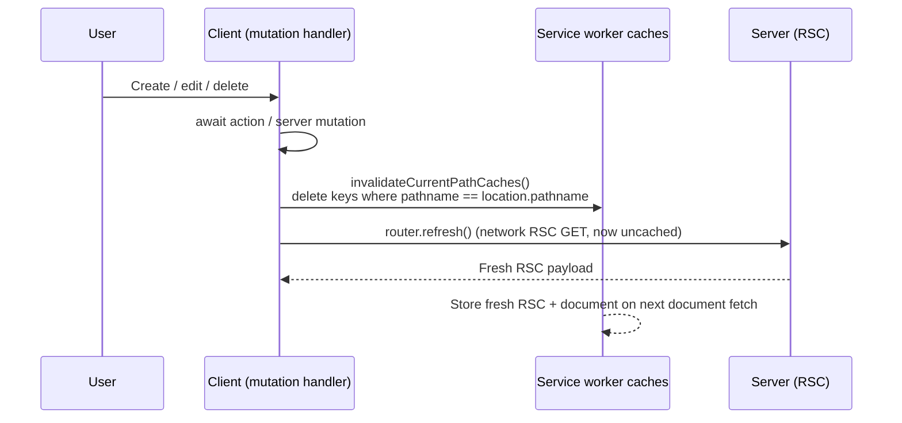
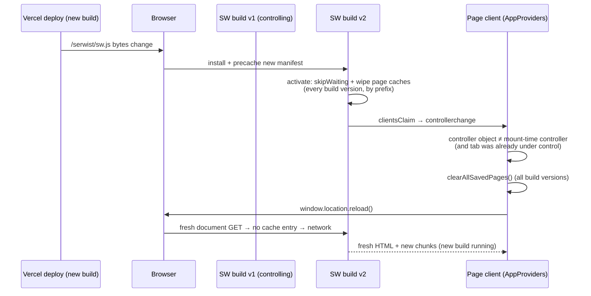

# 1. PWA offline & instant open

The PWA opens with calendar events visible instantly — even cold or offline — by serving previously-rendered pages from the service worker's cache. This document describes the client-side stale-while-revalidate layer, its routes, invalidation, new-build takeover, offline fallback, and testing. The concise architecture note lives in `AGENTS.md`; the phase write-up is in `progress-archive.md`.

## Table of contents

- [1.1 Problem](#11-problem)
- [1.2 Goals & non-goals](#12-goals--non-goals)
- [1.3 Architecture overview](#13-architecture-overview)
- [1.4 Service worker routes](#14-service-worker-routes)
- [1.5 Document cache — instant cold open](#15-document-cache--instant-cold-open)
- [1.6 RSC cache — instant in-app navigation & offline views](#16-rsc-cache--instant-in-app-navigation--offline-views)
- [1.7 Cache invalidation after mutations](#17-cache-invalidation-after-mutations)
- [1.8 New build (deploy) takeover](#18-new-build-deploy-takeover)
- [1.9 Offline fallback](#19-offline-fallback)
- [1.10 Session expiry](#110-session-expiry)
- [1.11 Staleness indicator](#111-staleness-indicator)
- [1.12 Constants & configuration](#112-constants--configuration)
- [1.13 Pure helpers & testing](#113-pure-helpers--testing)
- [1.14 Sign-out](#114-sign-out)
- [1.15 File index & related docs](#115-file-index--related-docs)
- [1.16 Limitations & follow-ups](#116-limitations--follow-ups)

## 1.1 Problem

Until this phase the service worker (`src/app/sw.ts`) ran a blanket `NetworkOnly` for every same-origin request (Phase 3a decision: "Cloudy data can never be stale"). Static assets (JS chunks, CSS, fonts, icons) were precached and fast, but the *document* — the SSR HTML that contains the rendered event grid — still required a server round-trip (DB + Google Calendar cache read, 1–3 s on a Google miss). A cold PWA open (tap the installed icon, F5, share link) therefore showed a white screen / skeleton until the server finished. While offline, the same request failed with the browser's dead-page error even when a perfectly usable previous view existed on-device.

## 1.2 Goals & non-goals

**Goals**

- A cold PWA open shows the last-saved calendar instantly (full SSR markup from cache) and revalidates in the background — the server's own 60 s-fresh / 30 min-SWR Google cache (see `docs/events-cache.md`) governs that revalidation.
- In-app navigation is instant when the target state was previously visited, including while offline.
- Reads are offline-capable (last-saved views render); an explicit "Force refresh" always bypasses the cache.
- Post-mutation views never render stale (create/edit/delete is visible on the very next paint).
- A deployed build takes over a running installed app: the tab reloads under the new build and no old-build page or payload is ever served.
- Installability and precaching remain Turbopack-native (Serwist).

**Non-goals**

- Offline *mutations* (creating/editing events while offline) — offline is read-only; the attempt surfaces an error toast. No local write queue.
- Push notifications (still deferred — needs VAPID + backend).
- IndexedDB snapshot rendered before the first-ever open (would be needed for instant on a brand-new device that has never opened the app online — covered by the document cache after the first online open, which is the actual "install → open → instant" flow).

## 1.3 Architecture overview

```mermaid
flowchart TB
    PWA[PWA cold open / F5 / share link<br/>navigation GET] --> SW[Service worker]
    IMG[Images] -. precached / runtime .-> SW
    FONT[Fonts/CSS] -. precached .-> SW

    SW -->|document hit| DOC[Serve stamped HTML from app-documents-swr<br/>+ revalidate in background]
    SW -->|document miss, online| NET[Network fetch<br/>store if 200 text/html<br/>+ date stamp]
    SW -->|document miss, offline| LASTSAVED[Serve most recently saved view<br/>stamped, re-stored under requested URL]
    LASTSAVED -->|no saved views| OFF[Branded /offline.html<br/>precached fallback — plain<br/>"You're offline" explainer]

    SW -->|RSC hit| RSC[Serve RSC from app-rsc-swr<br/>+ revalidate]
    SW -->|RSC miss, offline & hit| RSC
    SW -->|RSC miss, offline & miss| FAIL[Navigation fails<br/>chrome reverts, OfflineBanner visible]

    NET --> PURGE{Session expired?<br/>landed on /login}
    RSC --> PURGE
    PURGE -->|yes| PURGE2[Purge both caches<br/>postMessage to clients]
    PURGE -->|no| STORE[(SW caches)]

    STORE -. next open is fresh .-> PWA
```

## 1.4 Service worker routes

`src/app/sw.ts` registers, in order (first match wins):

1. **Static images** — `StaleWhileRevalidate`, `static-image-assets` (64 entries, 30 d).
2. **Fonts/CSS** — `CacheFirst`, `static-style-assets` (32 entries, 7 d).
3. **RSC cache** — see §1.6.
4. **Document cache** — see §1.5.
5. **Same-origin fallback** — `NetworkOnly` (auth, `/api/*`, non-GET, and anything unmatched — auth responses must never be cached).

Matcher predicates are pure and imported from `src/lib/pwa/swRules.ts` (see §1.13), so they are unit-tested.

## 1.5 Document cache — instant cold open

- **Cache:** `app-documents-swr-v<build>` — the `app-documents-swr` prefix plus a per-build version token (`swCacheVersion`, §1.8) — `StaleWhileRevalidate` + `ExpirationPlugin` (48 entries, 30 d, `maxAgeFrom: last-used`, `purgeOnQuotaError`).
- **Matcher:** same-origin `GET` with `request.mode === "navigate"` and `isCacheableDocumentRequest(url, origin)` — i.e. not `/login`, `/api/*`, `/serwist/*`, `/_next/*`.
- **Key:** exact URL including query — `?refresh=` nonce, `?edit=` deep links, `_fresh` marker are therefore naturally always-fresh (different keys).
- **Stored responses:** `shouldStoreDocumentResponse` — 200 + `text/html` + not a login redirect + not an excluded pathname.
- **Stamping:** `cachedResponseWillBeUsed` reads the cached `Date` header as `cachedAt`, runs `stampDocument(html, cachedAt)` — injects `<script>window.__C2_STAMP__={cachedAt}</script>` after `<head>` — so the page can show a "Saved · HH:MM" chip (see §1.11).
- **Background revalidation:** `StaleWhileRevalidate` fetches the network in parallel and updates the cache; the served document is the stamped stale copy. The next open is warmer without any client `router.refresh()` on mount (avoids a skeleton flash — the cached HTML already contains the full grid).
- **Session-expiry guard:** `cacheWillUpdate` + `fetchDidSucceed` call `isSessionExpiredResponse` (final URL is `/login`) → purge both caches + `postMessage({type:"cloudy2:session-expired"})` → client in `AppProviders` hard-redirects to `/login`. The login page itself is never written under a protected page's key.

## 1.6 RSC cache — instant in-app navigation & offline views

- **Cache:** `app-rsc-swr-v<build>` — same per-build versioning as the document cache (§1.8) — `StaleWhileRevalidate` + `ExpirationPlugin` (64 entries, 30 d).
- **Matcher:** same-origin `GET` with `RSC: 1` header and `isCacheableRscRequest` (excludes the same prefixes). Covers soft navigations and `<Link>` prefetches (which carry `Next-Router-Prefetch: 1`).
- **Stored responses:** `shouldStoreRscResponse` — 200 + `text/x-component` + not a login redirect.
- **Offline navigation:** cache hit → instant; miss + offline → navigation fails — Next's transition ends and the chrome reverts (per `docs/loading-transitions.md`), with `OfflineBanner` visible. Month/day changes that are local state (in-month day taps, filter drafts) never need a fetch and keep working.
- **Same session-expiry guard as documents.**

## 1.7 Cache invalidation after mutations

`StaleWhileRevalidate` for RSC would otherwise serve the pre-mutation RSC on the immediate `router.refresh()` after a create/edit/delete. Every mutation site therefore **invalidates the current pathname's entries in both caches before refreshing**:



- Helper: `invalidatePathCaches(pathname)` / `invalidateCurrentPathCaches()` in `src/lib/pwa/client.ts` (reads `caches`, matches page caches by prefix across every build version, filters keys by `origin + pathname`, fire-and-forget, never throws).
- 22 `router.refresh()` call sites across 12 files were migrated to `void invalidateCurrentPathCaches().then(() => router.refresh())`.
- The same helper is used for the document cache — a hard reload (F5) after a mutation also cannot serve the pre-mutation document.
- The dashboard's **Pin/Unpin tab** toggle fires the same invalidation, fire-and-forget and without a refresh: pinning only writes the `cloudy2.ui` cookie (no navigation, no URL change), so every SWR-cached `/dashboard` document and RSC payload rendered before the toggle still carries the old tab order. Serving one on the next reload or soft navigation would re-seed the `pinnedViews` prop and the state writer would then clobber the fresh pin in the cookie — losing it for good. `togglePinView` therefore calls `invalidateCurrentPathCaches()` before `setPinned`; the cost is that the next dashboard load after a toggle bypasses the instant cache (pin toggles are rare).

## 1.8 New build (deploy) takeover

Every build emits a different precache manifest (the `/_next/static` chunk hashes change), so the browser detects a new SW version on its next update check (a navigation or page load) and — with `skipWaiting` + `clientsClaim` — activates it and hands it the tab immediately. Without extra care the takeover leaves the app serving the **previous build**:

1. **The runtime page caches outlive the build.** Unlike the precache (which Serwist cleans up between versions), the SWR page caches persist across SW versions under fixed names. The new SW would happily serve a cached document from the old build — whose HTML references `/_next/static/chunks/<old-hash>.js`, which 404 against the new build — so the page renders stale or broken.
2. **The running tab keeps running the old build.** The SW file is served from a fixed URL (`/serwist/sw.js`), so `controller.scriptURL` never changes across deploys and nothing on the client knew the build had swapped.

The fix has three parts:

- **Build-versioned cache names** (`swRules.ts`): `swCacheVersion()` computes a deterministic FNV-1a 32-bit token over the serialized precache manifest; the real names are `documentCacheName(v)` / `rscCacheName(v)` → `app-documents-swr-v<token>` / `app-rsc-swr-v<token>`. A build only ever reads caches it (or its own version) wrote.
- **Wipe on activate** (`sw.ts`): an `activate` listener deletes every page-cache name this build does not own — matched by the `isPageCacheName` prefix, which also catches the legacy unversioned names from before versioning — so old-build entries vanish the moment the new SW activates, for this build and every future one.
- **Client swap detection** (`AppProviders` → `useSWUpdateReload`): listens for `navigator.serviceWorker` `controllerchange` and compares `ServiceWorker` **object identity** (not `scriptURL`, which is fixed). When a real swap is detected — the tab was already under control, so the first-ever claim after install is excluded and never flashes — it runs `clearAllSavedPages()` (which now sweeps every build version by prefix) and `window.location.reload()`. The reload also clears Next's in-memory client-router RSC cache (`staleTimes.dynamic`, see `docs/loading-transitions.md`), so no old-build payload survives in-page.



Notes:

- The activate wipe and the client-side clear are deliberately redundant: the wipe closes the "fresh tab after deploy" hole (a tab opened after v2 claimed has no `controllerchange` in its lifetime, so only the wipe guarantees an empty cache), while the client clear covers the brief activate/claim race where an in-flight v1 fetch could re-store an entry under the old name after the wipe.
- In-page "older data" *within the same build* (navigating back to a visited URL) is still the intended SWR behavior (§1.5/§1.6) plus `staleTimes.dynamic = 120`; the "Saved · HH:MM" chip (§1.11) and the force-refresh nonce are the user-facing escape hatch for that.

## 1.9 Offline fallback

When a navigation has neither a cache hit for its exact URL nor a working network, the document handler's `handlerDidError` serves the **most recently saved view** (`lastSavedDocument`, `src/app/sw.ts`) — for any navigation, query-less or deep-linked. The pure `newestSavedView` (§1.13) picks the document-cache entry with the newest `Date` header; it is stamped ("Saved · HH:MM") and served (so the `window.__C2_STAMP__` chip renders), and the un-stamped original is re-stored under the requested URL — so repeat offline opens of it become direct cache hits, and normal SWR revalidation applies on reconnect. This covers:

- **Icon taps / bare F5s** (start URL `/`): a page-level intent with no specific view — the last-saved view is the obvious content.
- **Deep links with a query** (`?view=…&date=…`) that were *never visited*: the exact URL isn't cached, and silently landing on the newest saved view is far more useful than a dead end. The served page already carries the amber `OfflineBanner` and the "Saved · HH:MM" stamp, so the "this is an offline copy" context is on-page — there is no separate picker landing page to explain. Exact-visit deep links are served by the SWR cache before `handlerDidError` runs; `/login` is never routed here (`isCacheableDocumentRequest` excludes it).

Only when there are **no saved views at all** (first-ever install, right after a deploy wipe or sign-out) does the fallback serve `offline.html`, a branded, self-contained explainer (navy header, no external assets, included in `__SW_MANIFEST` as `/offline.html` — the `pnpm build` log prints the precache entry count): "You're offline — reconnect to keep using the app" with a Try again (`/`) button. There is no saved-views list on it — when it appears, the document cache is empty, so a list would be dead UI.

**Why `matchPrecache`, not `caches.match`:** Serwist stores revisioned precache entries under a `?__WB_REVISION__=<hash>` cache key, so the plain `caches.match("/offline.html")` misses every time. `handlerDidError` therefore resolves the precache key via `serwist.matchPrecache("/offline.html")`. If that (or the precache itself) is ever unavailable, the SW serves a self-contained inline copy of the branded page (`OFFLINE_FALLBACK_HTML` in `src/app/sw.ts`, kept in sync with `public/offline.html`) — never a bare error string.

- Offline with a previously visited view → served from the document/RSC SWR caches, no fallback needed.
- `OfflineBanner` (`src/components/OfflineBanner.tsx`) still shows the amber "You're offline" strip globally.

## 1.10 Session expiry

When the session expires, background revalidations for protected pages redirect to `/login` (the protected layout's `requireSession()` issues a 307 to `/login`). Without a guard, the SW would cache the login HTML under the protected page's URL and the next open would show the login page at, e.g., `/dashboard`.

Guard (both caches, both `cacheWillUpdate` and `fetchDidSucceed`):

- `isSessionExpiredResponse({finalUrl})` — checks `finalUrl`'s pathname is `/login`.
- On match: `purgePageCaches()` (`caches.delete` for both names) + `notifySessionExpired()` (`clients.matchAll` + `postMessage`).
- `cacheWillUpdate` returns `null` so the redirect is never written.
- Client: `useSessionExpiryRedirect` in `AppProviders` listens on `navigator.serviceWorker` `message` and does `window.location.assign("/login")`.

Shared devices are covered by the sign-out purge as well (see §1.14).

## 1.11 Staleness indicator

The document stamp (`window.__C2_STAMP__.cachedAt`) is read at mount in `DashboardView`. When present, a subtle `Badge` ("Saved · 12:04") renders centered beneath the date-nav row with a tooltip showing the full timestamp and a hint to force-refresh. When the document was fresh (no stamp), the chip renders nothing. The chip is intentionally muted (grey `light` badge) — secondary chrome below the date-nav chevrons.

## 1.12 Constants & configuration

| Constant | Value | Where |
|---|---|---|
| `APP_DOCUMENT_CACHE_PREFIX` | `app-documents-swr` (real name: `-v<build token>` suffix) | `src/lib/pwa/swRules.ts` |
| `APP_RSC_CACHE_PREFIX` | `app-rsc-swr` (real name: `-v<build token>` suffix) | `src/lib/pwa/swRules.ts` |
| Build token | FNV-1a 32-bit over the serialized precache manifest (`swCacheVersion`) | `src/lib/pwa/swRules.ts` |
| Document entries | 48, 30 d, `last-used` | `src/app/sw.ts` |
| RSC entries | 64, 30 d, `last-used` | `src/app/sw.ts` |
| Image cache | 64, 30 d | `src/app/sw.ts` |
| Font/CSS cache | 32, 7 d | `src/app/sw.ts` |

All expiration plugins use `purgeOnQuotaError` (implicit via Serwist defaults where applicable — the document/RSC plugins set it explicitly).

## 1.13 Pure helpers & testing

Pure logic lives in `src/lib/pwa/swRules.ts` so it is unit-tested without a live SW or `caches`:

- `isCacheableDocumentRequest(url, origin)`
- `isCacheableRscRequest(url, origin, headers)`
- `shouldStoreDocumentResponse(check)` / `shouldStoreRscResponse(check)`
- `isSessionExpiredResponse(check)`
- `keysForPathname(keys, origin, pathname)`
- `stampDocument(html, cachedAtIso)` — idempotent: replaces an existing `__C2_STAMP__` script instead of stacking a second one
- `newestSavedView(entries)` — newest-`Date` entry for the offline fallback (§1.9); missing timestamps sort oldest, ties to the first entry
- `swCacheVersion(manifest)`
- `documentCacheName(version)` / `rscCacheName(version)`
- `isPageCacheName(name)`

Tests: `src/lib/pwa/swRules.test.ts` (34 cases). The SW bundle itself (`src/app/sw.ts`) is wiring only — no branching logic to test there. Integration is validated by `pnpm build` (precache count + inspecting the emitted SW bundle) + manual PWA checks: second open instant + chip, F5, force-refresh bypass, deep links, offline cold open, offline view switching, offline mutation error, sign-out isolation, killed-session purge, and the deploy-takeover reload (§1.8).

## 1.14 Sign-out

`UserMenu` (`src/components/UserMenu.tsx`) now calls `clearAllSavedPages()` (deletes every build version of both page caches, matched by prefix) beside `clearUiState()` before `signOut({callbackUrl: "/login"})`, so the next account on the same device cannot see the previous user's cached calendar.

## 1.15 File index & related docs

| File | Role |
|---|---|
| `src/app/sw.ts` | Serwist SW: precache + 5 runtime routes (images, fonts, RSC, documents, NetworkOnly fallback) + activate-time page-cache wipe (§1.8) + offline last-saved-view fallback (§1.9) |
| `src/lib/pwa/swRules.ts` | Pure predicates, constants & build-version helpers (see §1.13) |
| `src/lib/pwa/swRules.test.ts` | Unit tests for the above |
| `src/lib/pwa/client.ts` | Client cache helpers (prefix-matched across build versions): `invalidatePathCaches`, `invalidateCurrentPathCaches`, `clearAllSavedPages`, `readStaleStamp` |
| `src/app/(protected)/dashboard/DashboardView.tsx` | "Saved · HH:MM" stamp chip + `router.refresh` → invalidate-then-refresh + pin-toggle cache invalidation (§1.7) |
| `src/components/AppProviders.tsx` | Session-expiry `message` listener + `controllerchange` build-swap reload (§1.8) |
| `src/components/UserMenu.tsx` | Sign-out cache purge |
| `public/offline.html` | Branded offline explainer (precached) — "You're offline" + Try again; no saved-views list (§1.9) |
| `src/app/(protected)/settings/**` + `src/components/LoginForm.tsx` | Same invalidate-then-refresh migration |
| `docs/pwa-offline.md` | This document |
| `docs/events-cache.md` | Server-side Google Calendar cache (the background revalidation target) |
| `docs/loading-transitions.md` | Skeleton / `staleTimes` / transition chrome that the SW complements |

## 1.16 Limitations & follow-ups

- Offline mutations remain an error (no local queue / background sync). A future phase could add a `BackgroundSync` queue for event creates/updates and a conflict UI — deliberately not included here.
- First-ever open on a brand-new device needs one online visit before instant/offline works (the caches are populated on that first successful render). An IndexedDB snapshot rendered before the first RSC would cover this, but the value is low given the install flow already requires connectivity.
- Push notifications remain deferred (needs VAPID + backend) — unchanged from Phase 3a.
- The deploy-takeover reload (§1.8) interrupts whatever the user was doing on the old build (scroll position, form drafts in flight). An explicit "New version available — reload" banner would be the refinement if that ever bites; today the takeover is correct-by-default and silent.
