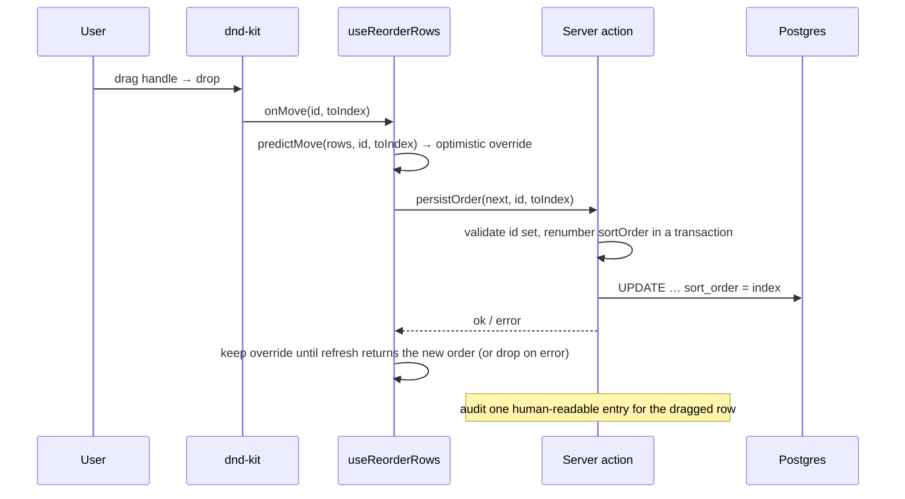

# 1. Drag-to-Reorder

The shared reorder interaction behind every manageable list in the app:
dashboard views, event-type groups, departments, quick links, and title-recipe
segments. Each row can carry a **drag handle** and/or the **up/down chevron
pair**, selected org-wide by the `reorderDrag` feature flag (default: drag
handle only). Drag is additive where both are shown; the chevrons remain the
explicit non-drag control in the `arrows` and `arrowsDrag` modes.

## Table of contents

- [1.1 The flag](#11-the-flag)
- [1.2 Shared pieces](#12-shared-pieces)
- [1.3 The drag → persist flow](#13-the-drag--persist-flow)
- [1.4 Per-surface behavior](#14-per-surface-behavior)
- [1.5 Departments: sibling-only drag](#15-departments-sibling-only-drag)
- [1.6 Accessibility](#16-accessibility)
- [1.7 File index & related docs](#17-file-index--related-docs)

## 1.1 The flag

`reorderDrag` (Settings → Feature Flags, org-wide) has three options:

| Option | Chevrons | Drag handle |
| ------ | -------- | ----------- |
| `drag` (**default**) | — | ✓ |
| `arrowsDrag` | ✓ | ✓ |
| `arrows` | ✓ | — |

Resolution is server-side and threaded to each surface: the dashboard reads it
from `DashboardSharedConfig.reorderDrag`, the settings pages call
`getFeatureFlag("reorderDrag")` and pass the resolved mode. The pure helpers
`isReorderDragEnabled(value)` (handle shown) and `isReorderArrowsEnabled(value)`
(chevrons shown) (`src/lib/settings/featureFlags.ts`) derive the two booleans —
`drag` and `arrowsDrag` show the handle; `arrows` and `arrowsDrag` show the
chevrons. Registry mechanics: [`feature-flags.md`](feature-flags.md).

## 1.2 Shared pieces

| Piece | File | Role |
| ----- | ---- | ---- |
| `useReorderRows` | `src/lib/ui/reorderRows.ts` | Optimistic order + server persistence. `move(id, ±1)` is the chevron path (FLIP); `moveTo(id, toIndex)` is the drag path. |
| `moveToIndex` | `src/lib/ui/reorderRows.ts` | Pure `arrayMove`-style helper for flat lists. |
| `useFlipReorder` | `src/lib/ui/flipReorder.ts` | CSS FLIP animation for chevron moves. |
| `ReorderUpDown` | `src/components/reorderUpDown.tsx` | The chevron pair (unchanged). |
| `SortableList` / `SortableRow` / `DragHandle` | `src/components/SortableRow.tsx` | dnd-kit plumbing (see below). |

`SortableList` wraps one rendered list in a `@dnd-kit/react` `DragDropProvider`
and turns a completed drop into `(id, toIndex)`. `SortableRow` is the **per-row
component** (a component, not a hook call inside `.map`, to obey the Rules of
Hooks) and renders through a function child so each surface attaches the
`ref` to its own element (`Paper`, `Table.Tr`, …). `DragHandle` is the grip the
user drags. Drag is inert unless `enabled` is true.

Each mobile/desktop twin list gets its own `DragDropProvider`; the hidden twin's
rows measure zero-sized rects, so they can't corrupt the visible one.

## 1.3 The drag → persist flow

- **Optimistic:** the move paints instantly via the override; the render-phase
  reconcile drops it once the authoritative rows match (or membership changes) —
  never a snap-back. A failed write drops it immediately.
- **Persistence:** every server-backed surface has a whole-list
  `reorderX(orderedIds, movedId?)` action that renumbers `sortOrder = index` in a
  transaction (dense + unique even after legacy gaps) and audits the dragged row.
  `movedId` is used only for the audit entry.
- **FLIP vs dnd-kit:** the drag path does **not** call `snapshot`/`play`; dnd-kit
  owns the drag/drop animation. FLIP stays for the chevron moves.

## 1.4 Per-surface behavior

| Surface | Items | Drag path |
| ------- | ----- | --------- |
| Manage views modal (`EditViewsModal`) | dashboard tabs | `moveToIndex` → `reorderDashboardViews(orderedIds)` |
| Event type groups (`EventTypeGroupsModal`) | groups | `moveToIndex` → `reorderEventTypeGroups` |
| Quick links (`QuickLinkTable`) | links | `moveToIndex` → `reorderQuickLinks` |
| Title recipe (`TitleRecipeBuilder`) | recipe segments | `moveToIndex`, **local only** (order saved in the recipe JSON on Save) |
| Departments (`DepartmentTable`) | departments (siblings) | `moveToSiblingIndex` → `reorderDepartments` |

The chevrons keep using the pre-existing adjacent actions
(`moveDashboardViews` is whole-list already; `moveEventTypeGroup` /
`moveQuickLink` / `moveDepartment` remain for arrows).

## 1.5 Departments: sibling-only drag

Departments form a preorder tree. The rendered list is the preorder flattening,
but a department may only move **among its siblings**. The pure
`moveToSiblingIndex(departments, id, targetId)` (`src/lib/roster/hierarchy.ts`)
moves the node (with its whole subtree) and **normalizes the drop target to a
sibling**: if you drop on a descendant of a sibling, it climbs to that sibling;
an unrelated target returns `null` (the drop is ignored).

The department optimistic path also carries the re-ranked `sortOrder` on each
predicted row — `displayRows` rebuilds the tree from those rows and sorts
siblings by `sortOrder`, so keeping the old values would silently revert the
move.

## 1.6 Accessibility

- **The chevrons remain available in `arrows` / `arrowsDrag`** — the explicit
  single-pointer non-drag alternative WCAG 2.5.7 ("Dragging Movements") asks for.
  The default `drag` mode shows the handle only; its non-mouse path is the
  **KeyboardSensor** (see below), which is a keyboard path rather than a
  single-pointer one — switch the flag to `arrowsDrag` if strict 2.5.7
  compliance is wanted.
- `DragHandle` is a focusable button with an accessible name (`Drag <name> to
  reorder`); it stops click propagation so a tap never opens the row's
  edit/detail dialog.
- dnd-kit's `KeyboardSensor` binds to the handle: **Space/Enter** starts the
  drag, **arrow keys** move (Shift = ×5), **Space/Enter** drops, **Escape**
  cancels. It also drives the `Accessibility` plugin's screen-reader
  announcements.
- The app respects `prefers-reduced-motion` (FLIP is disabled, dnd-kit's
  transitions are short), and `touch-action: none` on the handle lets a touch
  drag start instead of scrolling.

See [`accessibility.md`](accessibility.md) for the app-wide conventions.

## 1.7 File index & related docs

| File | Role |
| ---- | ---- |
| `src/components/SortableRow.tsx` | `SortableList`, `SortableRow`, `DragHandle`, `resolveDragMove` |
| `src/lib/ui/reorderRows.ts` | Hook + pure order helpers (`swapAdjacent`, `moveToIndex`, reconcile) |
| `src/lib/ui/flipReorder.ts` | FLIP animation (chevron path) |
| `src/lib/roster/hierarchy.ts` | `moveInTreeOrder` (arrows), `moveToSiblingIndex` (drag) |
| `src/lib/settings/featureFlags.ts` | `reorderDragFlag`, `isReorderDragEnabled`, `isReorderArrowsEnabled` |
| `src/db/schema.ts` | `settings.reorder_drag` column |

Related docs:

- [`feature-flags.md`](feature-flags.md) — the `reorderDrag` flag registry.
- [`dashboard-views.md`](dashboard-views.md) — the Manage-views tab strip.
- [`quick-links.md`](quick-links.md) — the quick-links table.
- [`roster-sharing.md`](roster-sharing.md) — the department hierarchy + `sortOrder`.
- [`event-lifecycle.md`](event-lifecycle.md) §1.8 — title-recipe segments.
