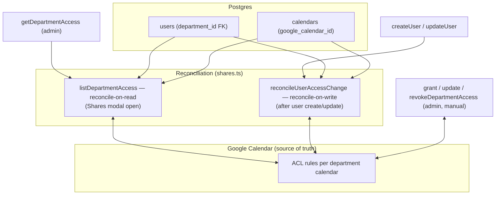
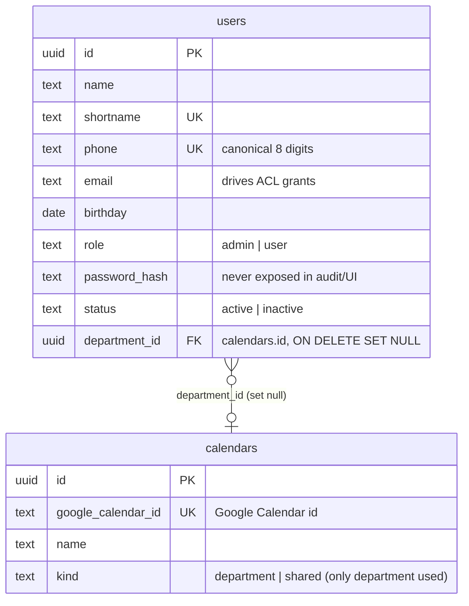
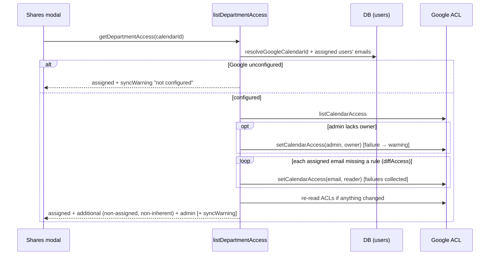

# 1. Roster & calendar sharing

The app's org model is deliberately flat: a **department is a Google Calendar**
(one row in `calendars`), and a **user belongs to at most one department**
(`users.department_id`). Access to a department's calendar is expressed **only in
Google's ACLs** — nothing is stored in the database — so keeping access correct
is a reconciliation problem: every org change (user create/edit, department
create/delete) and every read of the Shares modal must *diff* Google's current
ACLs against what the roster implies and fix the difference. This document
covers the data model, the roster actions, the ACL model, and the two
reconcile paths (on read, and on user change).

## Table of contents

- [1.1 Problem](#11-problem)
- [1.2 Goals & non-goals](#12-goals--non-goals)
- [1.3 Architecture overview](#13-architecture-overview)
- [1.4 Data model](#14-data-model)
- [1.5 The ACL model](#15-the-acl-model)
- [1.6 Roster & department actions](#16-roster--department-actions)
- [1.7 Reconcile-on-read: the Shares modal](#17-reconcile-on-read-the-shares-modal)
- [1.8 Reconcile-on-write: email & department changes](#18-reconcile-on-write-email--department-changes)
- [1.9 Access-level actions](#19-access-level-actions)
- [1.10 Pure helpers & testing](#110-pure-helpers--testing)
- [1.11 File index & related docs](#111-file-index--related-docs)

## 1.1 Problem

Each department's people must see that department's calendar in their own Google
Accounts; other people's access is granted per email. The tricky part: the org
data (who is in which department, at which email) lives in Postgres, but the
access data lives in Google. The two can drift — a user's email changes, a user
moves departments, a user is added — and stale ACLs mean either someone loses
access or (worse) keeps access they should have lost.

The pre-fix behavior (before Phase 1.61) reconciled **only when an admin opened
the Shares modal**: the new email became a reader then, and the *old* email kept
access forever unless manually revoked. The fix made the user create/update
actions reconcile immediately after the DB write.

## 1.2 Goals & non-goals

**Goals**

- Google Calendar is the **single source of truth for ACLs** — no share rows in
  the DB, so there is exactly one place to look for "who can see this
  calendar".
- Every department calendar has: the service account (owner, inherent), the
  admin account (`GOOGLE_DELEGATE_EMAIL`, owner — granted/upgraded on read),
  every assigned user with an email (reader, auto-granted), and any manual
  additional grants (reader/writer/owner).
- Org changes sync immediately after the DB commit; failures degrade to
  human-readable warnings, never failing the already-committed roster change.
- Reconcile-on-read remains as a safety net for pre-existing drift.

**Non-goals**

- No per-user calendar: access is per-department only.
- No fine-grained per-event sharing — visibility is calendar-scoped
  ([`google-integration.md` §1.2](google-integration.md#12-goals--non-goals)).
- Inactive users are not auto-deactivated from ACLs: deactivation is a roster
  state, and the reader rule is left in place (revocation happens when the
  user's email/department changes or an admin removes the rule manually).

## 1.3 Architecture overview

All Google I/O goes through `getGoogleIntegration()`
([`google-integration.md`](google-integration.md)); when Google is
unconfigured, reconcile paths short-circuit and the Shares modal surfaces a
`syncWarning`.

## 1.4 Data model

- `users` (`src/db/schema.ts:22`): `phone` and `shortname` carry unique indexes
  (the duplicate UX is constraint-driven, §1.6); `department_id` is a nullable
  FK to `calendars` with `ON DELETE SET NULL` — deleting a department
  unassigns its users, it never deletes them.
- `calendars` (`schema.ts:51`): the **department registry**;
  `google_calendar_id` is unique (a department with the same Google calendar
  can't be created twice). `kind` is `department` (used) or `shared` (reserved).
- **History**: the original schema (migration 0000) had a `departments` table
  plus a many-to-many `user_departments` join; migration 0002 collapsed that
  into the single `users.department_id` column (backfilled by primary
  membership) and migration 0003 dropped `departments` entirely — `calendars`
  became the department registry. Today a user belongs to at most one
  department.

## 1.5 The ACL model

`src/lib/roster/shares.ts` types:

- **`DepartmentAccessRole`** (`shares.ts:9`) — `"reader" | "writer" | "owner"`:
  the selectable levels, mapping 1:1 to Google ACL roles (Read only / Can edit /
  Owner). `isDepartmentAccessRole` (`:34`) deliberately rejects
  `freeBusyReader` even though the integration contract allows it — it is not a
  UI-selectable level.
- **`DepartmentAccess`** (`:16`) — what the Shares modal renders:
  `assigned` (emails of the department's users — auto-readers), `additional`
  (manual grants beyond assigned users), `admin` (the `GOOGLE_DELEGATE_EMAIL`
  account, non-removable), and `syncWarning` when Google is unavailable or a
  sync failed.

**Inherent owners** — `isInherentOwnerEmail` (`shares.ts:87`) — three email
identities are owner rules that are **never revoked and never surfaced as
removable shares**: the calendar resource id itself, the owning service account
(`getServiceAccountConfig().clientEmail`), and the configured admin account.

The pure diff helpers (all case-insensitive, ignoring blanks):

| Helper (`shares.ts`) | Computes |
| -------------------- | -------- |
| `diffAccess(existing, expected)` (`:42`) | expected emails **missing** an ACL rule → to grant |
| `diffRevocable(candidates, assigned)` (`:57`) | candidate emails no assigned user holds anymore → safe to revoke |
| `needsAdminOwnerGrant(acls, adminEmail)` (`:69`) | true when the admin has no rule or a lower role (a manual reader grant gets upgraded to owner); blank email never needs one |
| `isValidEmail` (`:29`) | simple email shape check, used server-side in grant/update and in user-form validation |
| `resolveGoogleCalendarId(calendarId)` (`:104`) | registry id → Google calendar id (null when missing); also reused by the events layer |

## 1.6 Roster & department actions

All in `src/lib/roster/actions.ts` (`"use server"`, all `requireAdmin()`-gated).
Result types: `RosterActionResult = { ok: true; warnings? } | { ok: false; error, field? }`
(`:30`) — `warnings` carries partial Google-sync failures (yellow toast in the
form); and `ShareActionResult` (`:34`).

**User actions**

| Action | Behavior | Audit row |
| ------ | -------- | --------- |
| `createUser` (`:110`) | validate → `normalizePhone` → INSERT (returning id+name) → audit → `revalidatePath` → **`reconcileUserAccessChange` with old values null** (a new user with email+department gets reader access immediately) | `user.create` — flat details incl. department **name** |
| `updateUser` (`:174`) | validate → load before → build before/after `userSnapshot`s (sanitized — never the password hash — with department names) → UPDATE → audit **`diffFields(before, after)`** → reconcile **only when email or department changed** (`:243-252`) | `user.update` |
| `setUserStatus` (`:258`) | toggle active/inactive; **no ACL reconcile** — status doesn't affect sharing | `user.status.change` — status diff |

There is **no `deleteUser`**: users are deactivated, never deleted (the UI has a
Deactivate/Activate button).

Duplicate UX is **constraint-driven, not pre-queried**: the INSERT/UPDATE catch
Postgres SQLSTATE `23505` and map the violated constraint to a field error —
`users_shortname_idx` → "A user with this shortname already exists" (field
`shortname`), any other unique violation → phone duplicate (`:153-161`,
`:231-239`).

**Department (calendar) actions**

| Action | Behavior | Audit row |
| ------ | -------- | --------- |
| `createDepartment` (`:286`) | requires Google configured → **creates the calendar in Google first**, then inserts the registry row → unique `google_calendar_id` violation → "A department with this Google Calendar already exists" | `calendar.create` — `{ googleCalendarId }` |
| `renameDepartment` (`:332`) | renames in Google (when configured) then DB | `calendar.rename` — name diff |
| `deleteDepartment` (`:374`) | deletes the Google calendar (404 tolerated) then the registry row — the FK cascade **unassigns its users** | `calendar.delete` — `{ googleCalendarId }` |

## 1.7 Reconcile-on-read: the Shares modal

`listDepartmentAccess(calendarId)` (`shares.ts:120`) is called by the admin-gated
`getDepartmentAccess` (`actions.ts:412`) when the Shares modal opens:

Properties:

- **Reads are also writes**: opening the modal grants any missing reader rules
  and upgrades the admin to owner — drift self-heals on view.
- **`additional`** excludes assigned users and inherent owners
  (`shares.ts:185-193`), so the modal only lists rules an admin can act on.
- **Failures never throw**: per-email grant failures and an admin-grant failure
  become a joined `syncWarning` ("Could not share with: …" · "Could not grant
  admin owner access"); a total ACL read failure returns a generic warning with
  the assigned list intact (`:195-217`).

## 1.8 Reconcile-on-write: email & department changes

`reconcileUserAccessChange(change)` (`shares.ts:245`) runs after the DB commit in
`createUser` (always) and `updateUser` (only when email or department changed):

```mermaid
sequenceDiagram
    participant A as createUser / updateUser
    participant D as DB (users)
    participant S as reconcileUserAccessChange
    participant G as Google ACL
    A->>D: INSERT/UPDATE committed
    A->>S: { oldEmail, newEmail, oldDepartmentId, newDepartmentId }
    Note over S: affected = oldDept ∪ newDept (resolved to Google ids)
    loop per affected department calendar
        S->>D: fresh SELECT of assigned emails
        S->>G: listCalendarAccess
        loop diffAccess(acls, assigned)
            S->>G: setCalendarAccess(email, reader)
        end
        opt givenUp email (only in the department being left)<br/>and no assigned user holds it<br/>and not an inherent owner
            S->>G: removeCalendarAccess(givenUp)
        end
        Note over S: per-email failures → human-readable warnings
    end
    S-->>A: warnings → yellow toast (DB change already committed)
```

The rules, precisely:

- **Affected calendars** = union of `oldDepartmentId` and `newDepartmentId`
  (`shares.ts:253-259`); each resolved to a Google id, missing ones skipped.
- **Grants**: `diffAccess(acls, assigned)` against a **fresh** SELECT of the
  department's emails (`:267-277`) — covers a new email on the same department,
  and the (unchanged) email on the newly joined department after a move.
- **Revokes**: the "given-up" email is defined **only for the department being
  left** — `oldEmail` when the calendar is `oldDepartmentId` (`:279-282`). It is
  revoked only when `diffRevocable` says no remaining assigned user holds that
  email, and never when it is an inherent owner (`:299-302`). This is what fixed
  the old "old email keeps access forever" bug.
- **Failure isolation**: every grant/revoke is try/caught; failures accumulate
  into warnings like "Could not sync calendar access for: …" that surface as a
  yellow toast — the roster change already committed and is not rolled back.
- **Short-circuit**: Google unconfigured → no warnings, nothing to reconcile.

## 1.9 Access-level actions

Manual management of `additional` rules (Shares modal), all admin-gated, all
validating email + role server-side (`isValidEmail`,
`isDepartmentAccessRole`), all requiring the calendar + Google configured:

| Action (`actions.ts`) | Behavior | Audit row |
| --------------------- | -------- | --------- |
| `grantDepartmentAccess(calendarId, email, role)` (`:417`) | `setCalendarAccess` (upsert) | `access.grant` — `{ email, role: null → role }` diff |
| `updateDepartmentAccess(calendarId, email, role)` (`:461`) | reads ACLs for the **previous role** (case-insensitive), then upserts | `access.update` — `{ email, role: prev → new }` diff |
| `revokeDepartmentAccess(calendarId, email)` (`:508`) | reads ACLs for the previous role, then `removeCalendarAccess` | `access.revoke` — `{ email, role: prev → null }` diff |

Inherent owners can't be removed through the UI (they aren't listed), and the
admin account's owner rule is shown in a separate "Owner access" section, not as
a removable row.

## 1.10 Pure helpers & testing

| Helper | Module | Tests |
| ------ | ------ | ----- |
| `normalizePhone` (exactly 8 digits, strips non-digits), `validateUserForm`, `validateCalendarForm` | `roster/validate.ts` | `roster/validate.test.ts` |
| `isValidEmail`, `isDepartmentAccessRole` (rejects `freeBusyReader`), `diffAccess`, `diffRevocable`, `needsAdminOwnerGrant` (incl. blank-admin edge), `isInherentOwnerEmail` | `roster/shares.ts` | `roster/shares.test.ts` |
| `diffFields` (the audit diffs), `actorFromUser`, `AUDIT_ACTIONS` | `audit/diff.ts`, `audit/build.ts` | `audit/diff.test.ts`, `audit/build.test.ts` |
| `getServiceAccountConfig`, `hasGoogleCredentials`, `getAdminGoogleEmail` | `google/config.ts` | `google/config.test.ts` |

I/O-bound (not unit-tested, per the repo convention): `resolveGoogleCalendarId`,
`listDepartmentAccess`, `reconcileUserAccessChange`, all of `roster/queries.ts`
(`listUsers`, `getUsersByIds`, `listDepartments`), the nine server actions in
`roster/actions.ts`, and the `events/queries.ts` department lookups
(`getUserDepartmentId(s)`).

## 1.11 File index & related docs

| File | Role |
| ---- | ---- |
| `src/db/schema.ts:22-63` | `users` + `calendars` tables |
| `src/lib/roster/shares.ts` | ACL model, pure diff helpers, both reconcile paths |
| `src/lib/roster/validate.ts` | Phone/user/calendar validation (pure) |
| `src/lib/roster/queries.ts` | Roster reads (users, departments, by-ids) |
| `src/lib/roster/actions.ts` | User/department/sharing server actions |
| `src/app/(protected)/settings/users/` | Users page: `UserTable`, `UserForm` (badge role/department fields), deactivate |
| `src/app/(protected)/settings/users/DepartmentShares.tsx` | The Shares modal (assigned/additional/admin sections) |
| `src/app/(protected)/settings/departments/` | Departments page: create/rename/share/delete |
| `src/lib/google/` | The integration the ACL calls go through |

Related docs:

- [`google-integration.md`](google-integration.md) — the ACL methods and error
  mapping these flows use.
- [`event-lifecycle.md`](event-lifecycle.md) — how events pick their target
  department calendars (users' departments).
- [`audit-log.md`](audit-log.md) — the user/calendar/access rows rendered.
- [`README.md`](../README.md#112-documentation) — documentation index.
- `progress.md` — phase write-ups: 1.8 (roster & departments), 1.11 (calendars
  + sharing + audit), 1.41 (access levels), 1.61 (email-change ACL sync bugfix),
  1.62 (department selects).
