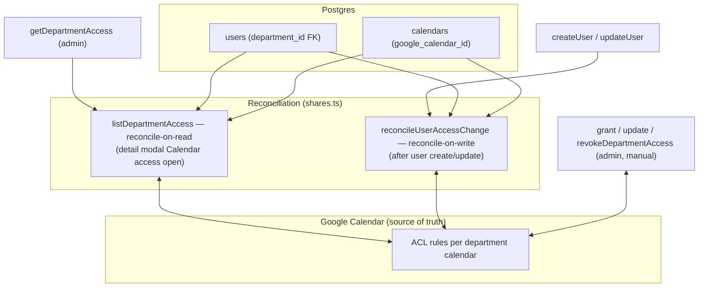
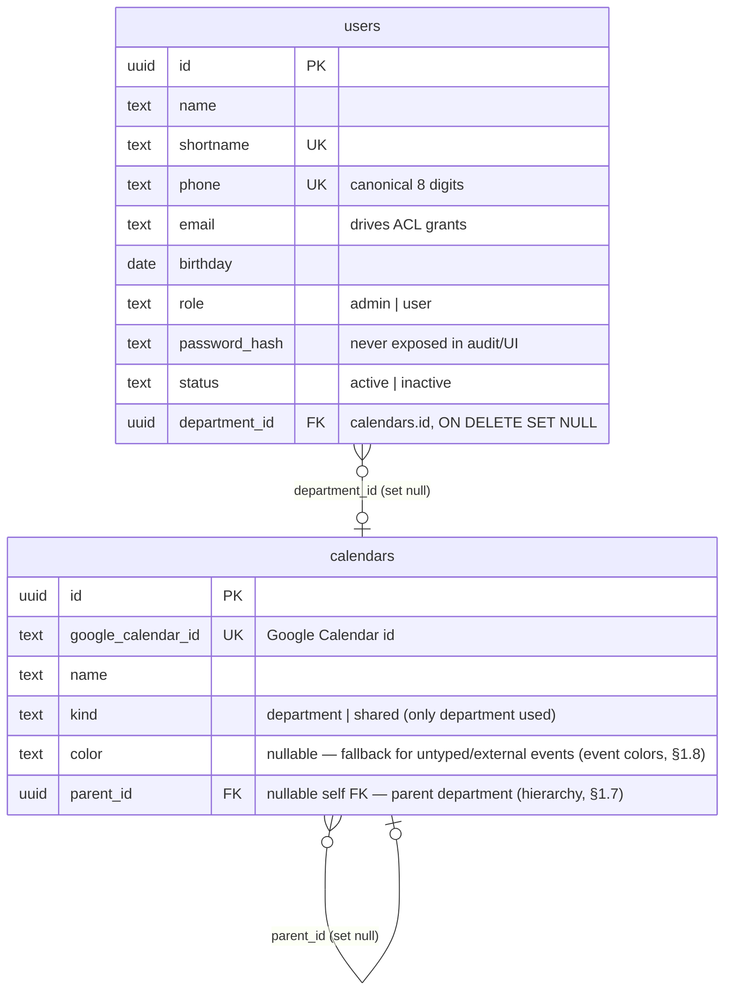
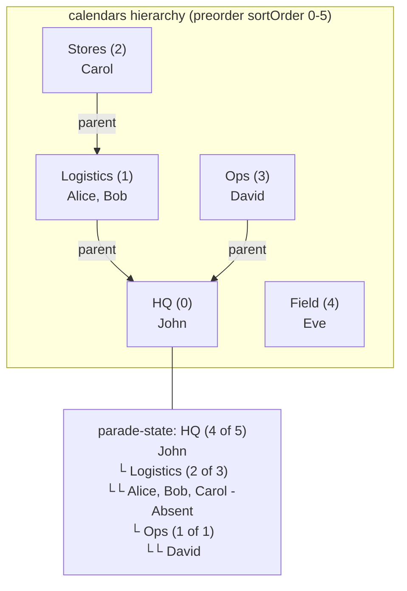
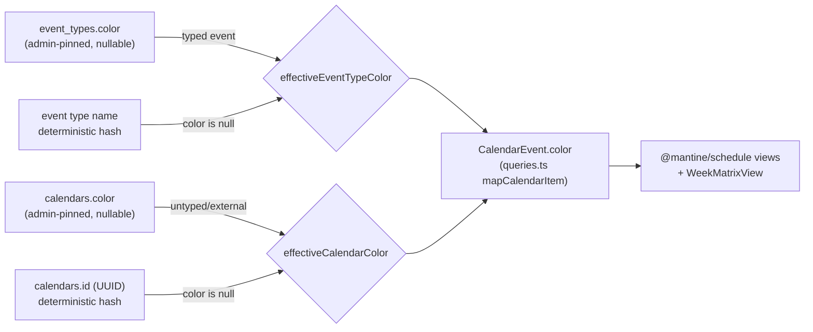
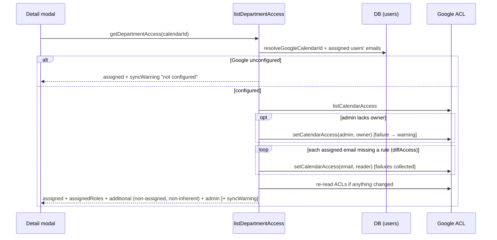
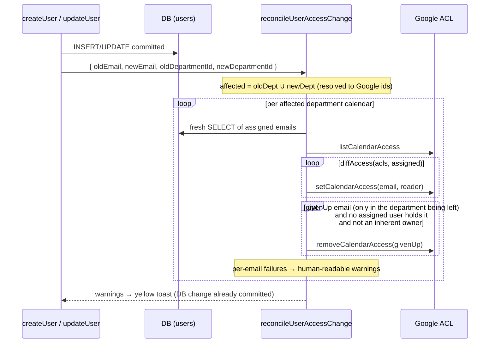

# 1. Roster & calendar sharing

The app's org model: a **department is a Google Calendar** (one row in
`calendars`), departments form a **hierarchy** (a department may be nested
under a parent department, §1.7), and a **user belongs to at most one
department** (`users.department_id` — users never belong to two departments,
even nested ones). Access to a department's calendar is expressed **only in
Google's ACLs** — nothing is stored in the database — so keeping access correct
is a reconciliation problem: every org change (user create/edit, department
create/delete) and every read of the department detail modal must *diff*
Google's current ACLs against what the roster implies and fix the difference.
This document
covers the data model, the roster actions, the department hierarchy, the ACL
model, and the two
reconcile paths (on read, and on user change).

## Table of contents

- [1.1 Problem](#11-problem)
- [1.2 Goals & non-goals](#12-goals--non-goals)
- [1.3 Architecture overview](#13-architecture-overview)
- [1.4 Data model](#14-data-model)
- [1.5 The ACL model](#15-the-acl-model)
- [1.6 Roster & department actions](#16-roster--department-actions)
- [1.7 Department hierarchy & parade-state aggregation](#17-department-hierarchy--parade-state-aggregation)
- [1.8 Event colors](#18-event-colors)
- [1.9 Reconcile-on-read: the department detail modal](#19-reconcile-on-read-the-department-detail-modal)
- [1.10 Reconcile-on-write: email & department changes](#110-reconcile-on-write-email--department-changes)
- [1.11 Access-level actions](#111-access-level-actions)
- [1.12 Pure helpers & testing](#112-pure-helpers--testing)
- [1.13 File index & related docs](#113-file-index--related-docs)

## 1.1 Problem

Each department's people must see that department's calendar in their own Google
Accounts; other people's access is granted per email. The tricky part: the org
data (who is in which department, at which email) lives in Postgres, but the
access data lives in Google. The two can drift — a user's email changes, a user
moves departments, a user is added — and stale ACLs mean either someone loses
access or (worse) keeps access they should have lost.

The pre-fix behavior (before Phase 1.61) reconciled **only when an admin opened
the Shares modal**: the new email became a reader then, and the *old* email kept
access forever unless manually revoked. The fix made the user create/update
actions reconcile immediately after the DB write.

## 1.2 Goals & non-goals

**Goals**

- Google Calendar is the **single source of truth for ACLs** — no share rows in
  the DB, so there is exactly one place to look for "who can see this
  calendar".
- Every department calendar has: the service account (owner, inherent), the
  admin account (`GOOGLE_DELEGATE_EMAIL`, owner — granted/upgraded on read),
  every assigned user with an email (reader, auto-granted — upgradable to
  writer/owner from the detail modal), and any manual additional grants
  (reader/writer/owner).
- Org changes sync immediately after the DB commit; failures degrade to
  human-readable warnings, never failing the already-committed roster change.
- Reconcile-on-read remains as a safety net for pre-existing drift.

**Non-goals**

- No per-user calendar: access is per-department only.
- No fine-grained per-event sharing — visibility is calendar-scoped
  ([`google-integration.md` §1.2](google-integration.md#12-goals--non-goals)).
- Inactive users are not auto-deactivated from ACLs: deactivation is a roster
  state, and the reader rule is left in place (revocation happens when the
  user's email/department changes or an admin removes the rule manually).

## 1.3 Architecture overview


```mermaid
flowchart TB
    subgraph DB["Postgres"]
        U["users (department_id FK)"]
        C["calendars (google_calendar_id)"]
    end
    subgraph RECONCILE["Reconciliation (shares.ts)"]
        READ["listDepartmentAccess — reconcile-on-read<br/>(detail modal Calendar access open)"]
        WRITE["reconcileUserAccessChange — reconcile-on-write<br/>(after user create/update)"]
    end
    subgraph G["Google Calendar (source of truth)"]
        ACL["ACL rules per department calendar"]
    end
    CR["createUser / updateUser"] --> WRITE
    SM["getDepartmentAccess (admin)"] --> READ
    U --> READ
    U --> WRITE
    C --> READ
    C --> WRITE
    READ <--> ACL
    WRITE <--> ACL
    GA["grant / update / revokeDepartmentAccess (admin, manual)"] <--> ACL
```

All Google I/O goes through `getGoogleIntegration()`
([`google-integration.md`](google-integration.md)); when Google is
unconfigured, reconcile paths short-circuit and the detail modal surfaces a
`syncWarning`.

## 1.4 Data model


```mermaid
erDiagram
    calendars {
        uuid id PK
        text google_calendar_id UK "Google Calendar id"
        text name
        text kind "department | shared (only department used)"
        text color "nullable — fallback for untyped/external events (event colors, §1.8)"
        uuid parent_id FK "nullable self FK — parent department (hierarchy, §1.7)"
    }
    users {
        uuid id PK
        text name
        text shortname UK
        text phone UK "canonical 8 digits"
        text email "drives ACL grants"
        date birthday
        text role "admin | user"
        text password_hash "never exposed in audit/UI"
        text status "active | inactive"
        uuid department_id FK "calendars.id, ON DELETE SET NULL"
    }
    users }o--o| calendars : "department_id (set null)"
    calendars }o--o| calendars : "parent_id (set null)"
```

- `users` (`src/db/schema.ts:22`): `phone` and `shortname` carry unique indexes
  (the duplicate UX is constraint-driven, §1.6); `department_id` is a nullable
  FK to `calendars` with `ON DELETE SET NULL` — deleting a department
  unassigns its users, it never deletes them.
- `calendars` (`schema.ts:51`): the **department registry**;
  `google_calendar_id` is unique (a department with the same Google calendar
  can't be created twice). `kind` is `department` (used) or `shared` (reserved).
  `color` is the admin-pinned **fallback** color for untyped/external events
  (a Mantine palette name) — nullable, where null means "use the
  deterministic per-calendar default" (§1.8). Typed events take their color
  from the event type instead.
- `calendars.parent_id` (`schema.ts:72`): nullable **self FK** forming the
  department hierarchy (§1.7) — null = top level, `ON DELETE SET NULL` (deleting
  a parent promotes its children to top level). Cycles are impossible to create
  through the UI or the server actions (self/descendant parents are excluded /
  rejected) and the traversal helpers stay cycle-safe as a defense.
  `sort_order` is globally unique and encodes **preorder tree rank** (a child is
  ranked right after its parent's subtree), so the flat ordering doubles as the
  tree rendering order everywhere calendars are listed.
- **History**: the original schema (migration 0000) had a `departments` table
  plus a many-to-many `user_departments` join; migration 0002 collapsed that
  into the single `users.department_id` column (backfilled by primary
  membership) and migration 0003 dropped `departments` entirely — `calendars`
  became the department registry. Today a user belongs to at most one
  department.

## 1.5 The ACL model

`src/lib/roster/shares.ts` types:

- **`DepartmentAccessRole`** (`shares.ts:9`) — `"reader" | "writer" | "owner"`:
  the selectable levels, mapping 1:1 to Google ACL roles (Read only / Can edit /
  Owner).   `isDepartmentAccessRole` (`:40`) deliberately rejects
  `freeBusyReader` even though the integration contract allows it — it is not a
  UI-selectable level.
- **`DepartmentAccess`** (`:16`) — what the detail modal renders:
  `assigned` (emails of the department's users — auto-readers),
  `assignedRoles` (each assigned email's live ACL role, so an admin-upgraded
  writer/owner shows through the selector), `additional` (manual grants beyond
  assigned users), `admin` (the `GOOGLE_DELEGATE_EMAIL` account,
  non-removable), and `syncWarning` when Google is unavailable or a sync
  failed.

**Inherent owners** — `isInherentOwnerEmail` (`shares.ts:81`) — three email
identities are owner rules that are **never revoked and never surfaced as
removable shares**: the calendar resource id itself, the owning service account
(`getServiceAccountConfig().clientEmail`), and the configured admin account.

The pure diff helpers (all case-insensitive, ignoring blanks):

| Helper (`shares.ts`) | Computes |
| -------------------- | -------- |
| `diffAccess(existing, expected)` (`:48`) | expected emails **missing** an ACL rule → to grant |
| `diffRevocable(candidates, assigned)` (`:58`) | candidate emails no assigned user holds anymore → safe to revoke |
| `needsAdminOwnerGrant(acls, adminEmail)` (`:68`) | true when the admin has no rule or a lower role (a manual reader grant gets upgraded to owner); blank email never needs one |
| `isValidEmail` (`:35`) | simple email shape check, used server-side in grant/update and in user-form validation |
| `resolveGoogleCalendarId(calendarId)` (`:98`) | registry id → Google calendar id (null when missing); also reused by the events layer |

## 1.6 Roster & department actions

All in `src/lib/roster/actions.ts` (`"use server"`, all `requireAdmin()`-gated).
Result types: `RosterActionResult = { ok: true; warnings? } | { ok: false; error, field? }`
(`:39`) — `warnings` carries partial Google-sync failures (yellow toast in the
form); and `ShareActionResult` (`:47`).

**User actions**

| Action | Behavior | Audit row |
| ------ | -------- | --------- |
| `createUser` (`:102`) | validate → `normalizePhone` → INSERT (returning id+name) → audit → `revalidatePath` → **`reconcileUserAccessChange` with old values null** (a new user with email+department gets reader access immediately) | `user.create` — flat details incl. department **name** |
| `updateUser` (`:169`) | validate → load before → build before/after `userSnapshot`s (sanitized — never the password hash — with department names) → UPDATE → audit **`diffFields(before, after)`** → reconcile **only when email or department changed** (`:244`) | `user.update` |
| `setUserStatus` (`:256`) | toggle active/inactive; **no ACL reconcile** — status doesn't affect sharing | `user.status.change` — status diff |

There is **no `deleteUser`**: users are deactivated, never deleted (the UI has a
Deactivate/Activate button).

Duplicate UX is **constraint-driven, not pre-queried**: the INSERT/UPDATE catch
Postgres SQLSTATE `23505` and map the violated constraint to a field error —
`users_shortname_idx` → "A user with this shortname already exists" (field
`shortname`), any other unique violation → phone duplicate (`:148-156`,
`:229-237`).

**Department (calendar) actions**

| Action | Behavior | Audit row |
| ------ | -------- | --------- |
| `createDepartment` (`:284`) | requires Google configured → **creates the calendar in Google first**, then inserts the registry row (name + `color`, normalized via `normalizeEventColor`); an optional `parentId` must exist — a new child is ranked at the end of its parent's subtree (shifted rows renumbered in the same transaction), a new top level ranks last overall → unique `google_calendar_id` violation → "A department with this Google Calendar already exists" | `calendar.create` — `{ googleCalendarId, color, parent }` |
| `renameDepartment` (`:389`) | the detail modal's Save: renames in Google **only when the name actually changed** (color is app-local — no Google call for color-only edits), then updates name + color (+ `parentId` when the parent changed) in the DB; a parent change is cycle-validated (self / own descendant rejected, moving to top level always allowed) and renumbers the affected preorder ranks in the same transaction | `calendar.update` — `diffFields({ name, color, parent })` (legacy rows: `calendar.rename` — name diff) |
| `deleteDepartment` (`:363`) | deletes the Google calendar (404 tolerated) then the registry row — the FK cascade **unassigns its users** and **promotes its sub-departments to top level** (`parent_id` set null); the detail modal's Delete button opens a separate confirm modal for it (warning about the promotion when it has children) | `calendar.delete` — `{ googleCalendarId }` |
| `moveDepartment` (`:539`) | the list's up/down arrows: swap with the adjacent **sibling** only (same parent, or both top level — first/last child of a group is a no-op); the whole subtree moves, and the result is re-ranked in preorder (also closing legacy sortOrder gaps) | `calendar.update` — order diff (preorder position, 1-based) |

## 1.7 Department hierarchy & parade-state aggregation

Departments can be nested: any department may be the **parent** of other
departments (any depth), while a user still belongs to exactly one department
— the *direct* one. A parent's people therefore include every sub-department
below it: the parade-state page renders the hierarchy as nested sections whose
headcounts aggregate down the tree, and the attendance clipboard report
mirrors it as flat blocks in tree order.


```mermaid
flowchart TB
    subgraph TREE["calendars hierarchy (preorder sortOrder 0-5)"]
        HQ["HQ (0)<br/>John"]
        LOG["Logistics (1)<br/>Alice, Bob"]
        STO["Stores (2)<br/>Carol"]
        OPS["Ops (3)<br/>David"]
        FLD["Field (4)<br/>Eve"]
    end
    LOG -->|parent| HQ
    STO -->|parent| LOG
    OPS -->|parent| HQ
    HQ --- AGG["parade-state: HQ (4 of 5)<br/>John<br/>└ Logistics (2 of 3)<br/>└└ Alice, Bob, Carol - Absent<br/>└ Ops (1 of 1)<br/>└└ David"]
```

**The model**

- `calendars.parent_id` (nullable self FK, §1.4) — null = top level. Each
  department is still its own Google Calendar; the hierarchy is purely an
  app-level grouping over the calendar registry.
- **Preorder rank**: `sort_order` stays globally unique and encodes the tree
  traversal (children ranked right after their parent's subtree). Every flat
  list of calendars (`listCalendars`, `listDepartments`, filter options) is
  therefore already in tree order, and the parade-state nested render needs no
  separate ordering.
- **Cycle safety**: the parent picker (`parentOptionsFor`) excludes the
  department itself and its descendants, and `renameDepartment` rejects a
  parent that is self or an own descendant (`descendantIds`); traversal
  helpers (`buildDepartmentTree`, `descendantIds`, `moveInTreeOrder`) are
  independently cycle-safe, so corrupt data degrades to a flat list.
- **Deleting a parent** promotes its children to top level (FK `set null`);
  the delete confirm warns about the promotion.
- **Users are unaffected**: `users.department_id` still points at the direct
  department only; access reconcile paths (§1.9, §1.10) see no change — a
  parent/child relationship is not an access relationship.

**Managing the hierarchy** (Settings → Departments)

- The detail modal carries a **Parent department** field (plain
  `NoKeyboardSelect` — the department list is short, no search) offering
  "No parent (top level)" plus every department except the row itself and its
  descendants.
- The list shows the tree: children indented under their parent (desktop
  table: indent + a Parent column; mobile cards: indent + an "In
  {parent}" line).
- The up/down arrows move a department **among its siblings only**
  (`moveDepartment` via `moveInTreeOrder`) — first/last child of a group is a
  no-op, and a parent's whole subtree moves with it. For a flat list (no
  parents) this is exactly the old global up/down swap.

**Pure helpers** (`src/lib/roster/hierarchy.ts`, unit-tested in
`hierarchy.test.ts`)

| Helper | Computes |
| ------ | -------- |
| `buildDepartmentTree(depts)` | nested tree (children sorted by sortOrder, then name); missing parents and cycles degrade to top level |
| `findDepartmentNode(tree, id)` | a node by id anywhere in the tree |
| `flattenDepartmentTree(tree)` | preorder (parent before children) |
| `descendantIds(depts, rootId)` | every transitive descendant (cycle-safe) |
| `parentOptionsFor(depts, selfId)` | parent-picker options: all but self + descendants |
| `moveAvailability(depts)` | per id `{ up, down }` — has a sibling in that direction |
| `moveInTreeOrder(depts, id, dir)` | the re-ranked flat list after a sibling swap (subtree moves), or null when not possible |

**Parade state** (`src/app/(protected)/parade-state/`)

- The page passes each calendar's `parentId` to `ParadeStateView`, which
  builds the section tree (`buildDepartmentTree` + direct members per node;
  "Unassigned" stays a terminal top-level section).
- Rendering is recursive: a section header `NAME (present/total)` where both
  numbers are **aggregated over direct + all descendant members**
  (`departmentTreeHeadcount`, recursive over the out-of-camp events), the
  direct members' card grid, then the nested sub-departments indented one
  level. In attendance mode the header counts checked users the same way.
- The attendance clipboard report (`buildAttendanceReport`) takes the same
  tree and emits **flat blocks in tree order** (a department, then its
  sub-departments depth-first; no indentation): a department's header counts
  include every department below it, its block lists only its direct users
  (checked bare, otherwise ` - Absent`), and a department without direct
  users gets no block of its own (its people still count toward the
  ancestor's header). Example:

  ```text
  HQ (4 of 5)
  John
  Logistics (2 of 3)
  Alice
  Bob
  Carol - Absent
  Ops (1 of 1)
  David
  Field (0 of 1)
  Eve - Absent
  ```

## 1.8 Event colors

Typed events render in the color of their **event type** — one color per type,
shared across all departments. Untyped/external events (created directly in
Google Calendar) fall back to the color of the **department calendar**. There
is no per-event color, and Google's own `colorId` is ignored in both
directions (the read path drops it before caching; the write path never sends
it).


```mermaid
flowchart LR
    T["event_types.color<br/>(admin-pinned, nullable)"] -->|typed event| E1{effectiveEventTypeColor}
    TN["event type name<br/>deterministic hash"] -->|"color is null"| E1
    C["calendars.color<br/>(admin-pinned, nullable)"] -->|untyped/external| E2{effectiveCalendarColor}
    CI["calendars.id (UUID)<br/>deterministic hash"] -->|"color is null"| E2
    E1 --> CE["CalendarEvent.color<br/>(queries.ts mapCalendarItem)"]
    E2 --> CE
    CE --> V["@mantine/schedule views<br/>+ WeekMatrixView"]
```

- **The value** is one of the fixed 10-color Mantine palette
  (`EVENT_COLORS`, `src/lib/events/eventColors.ts`). Null ("Auto") means a
  **deterministic default**: `colorForId` hashes the event type *name* (typed
  events) or the calendar UUID (untyped/external) onto the same palette, so an
  unset type/department always renders the same color across sessions and
  views — and events of a later-deleted type keep a stable name-derived
  color.
- **Configuration** lives in Settings → Event Types (the primary color) and
  Settings → Departments (the external-event fallback). Both forms use the
  shared `ColorSwatchPicker` (`src/components/ColorSwatchPicker.tsx`) —
  tap-friendly swatch buttons, not inputs, so no keyboard pop-up on mobile —
  offering "Auto" (labeled with the id-derived default) plus every palette
  color. Server-side, `normalizeEventColor` accepts a palette name and falls
  back to null for anything else (accept/fallback pair, like
  `normalizeLocationPolicy`) — invalid data can never break rendering. Event
  type create/rename audit rows store the human-readable label
  (`formatColorLabel`, e.g. "Blue" or "Auto (Teal)").
- **Application is at read time**: `fetchRangeEvents` selects full calendar
  rows plus every event type's (name, color) and `mapCalendarItem` stamps
  `color: effectiveEventTypeColor(typeName, typeColor)` on typed events and
  `color: effectiveCalendarColor(calendar.id, calendar.color)` on the rest.
  The color is **not part of `google_event_cache`** (the cache stores raw
  Google items; mapping happens per request —
  [`events-cache.md`](events-cache.md)), so changing a type's or a
  department's color takes effect on the next render with **no cache
  invalidation**.
- **Rendering**: `@mantine/schedule` resolves `color` via
  `variantColorResolver({ variant: "light" })` into the `--event-bg` /
  `--event-color` CSS vars; `WeekMatrixView.tsx` replicates that resolution for
  its custom matrix cells. Consumers need no changes when a color changes.

## 1.9 Reconcile-on-read: the department detail modal

`listDepartmentAccess(calendarId)` (`shares.ts:112`) is called by the admin-gated
`getDepartmentAccess` (`actions.ts:589`) when a department's detail modal opens
(its "Calendar access" section — the sharing view that used to be a separate
Shares modal):


```mermaid
sequenceDiagram
    participant M as Detail modal
    participant S as listDepartmentAccess
    participant D as DB (users)
    participant G as Google ACL
    M->>S: getDepartmentAccess(calendarId)
    S->>D: resolveGoogleCalendarId + assigned users' emails
    alt Google unconfigured
        S-->>M: assigned + syncWarning "not configured"
    else configured
        S->>G: listCalendarAccess
        opt admin lacks owner
            S->>G: setCalendarAccess(admin, owner)  [failure → warning]
        end
        loop each assigned email missing a rule (diffAccess)
            S->>G: setCalendarAccess(email, reader)  [failures collected]
        end
        S->>G: re-read ACLs if anything changed
        S-->>M: assigned + assignedRoles + additional (non-assigned, non-inherent) + admin [+ syncWarning]
    end
```

Properties:

- **Reads are also writes**: opening the modal grants any missing reader rules
  and upgrades the admin to owner — drift self-heals on view.
- **`additional`** excludes assigned users and inherent owners
  (`shares.ts:177-185`), so the modal only lists rules an admin can act on.
- **Assigned-user role overrides**: the modal shows each assigned user's live
  role from `assignedRoles` (the auto-granted rule reads `reader`). The
  selector next to the user calls `updateDepartmentAccess`, upserting the ACL
  rule to `writer`/`owner`; the override then survives every follow-up
  reconcile because `diffAccess` only grants emails that still have **no**
  rule. When the user leaves the department (or changes email) the rule is
  revoked as usual (§1.10) — an override is scoped to the assignment.
- **Failures never throw**: per-email grant failures and an admin-grant failure
  become a joined `syncWarning` ("Could not share with: …" · "Could not grant
  admin owner access"); a total ACL read failure returns a generic warning with
  the assigned list intact (`:195-217`).

## 1.10 Reconcile-on-write: email & department changes

`reconcileUserAccessChange(change)` (`shares.ts:248`) runs after the DB commit in
`createUser` (always) and `updateUser` (only when email or department changed):


```mermaid
sequenceDiagram
    participant A as createUser / updateUser
    participant D as DB (users)
    participant S as reconcileUserAccessChange
    participant G as Google ACL
    A->>D: INSERT/UPDATE committed
    A->>S: { oldEmail, newEmail, oldDepartmentId, newDepartmentId }
    Note over S: affected = oldDept ∪ newDept (resolved to Google ids)
    loop per affected department calendar
        S->>D: fresh SELECT of assigned emails
        S->>G: listCalendarAccess
        loop diffAccess(acls, assigned)
            S->>G: setCalendarAccess(email, reader)
        end
        opt givenUp email (only in the department being left)<br/>and no assigned user holds it<br/>and not an inherent owner
            S->>G: removeCalendarAccess(givenUp)
        end
        Note over S: per-email failures → human-readable warnings
    end
    S-->>A: warnings → yellow toast (DB change already committed)
```

The rules, precisely:

- **Affected calendars** = union of `oldDepartmentId` and `newDepartmentId`
  (`shares.ts:254-260`); each resolved to a Google id, missing ones skipped.
- **Grants**: `diffAccess(acls, assigned)` against a **fresh** SELECT of the
  department's emails (`:268-278`) — covers a new email on the same department,
  and the (unchanged) email on the newly joined department after a move.
- **Revokes**: the "given-up" email is defined **only for the department being
  left** — `oldEmail` when the calendar is `oldDepartmentId` (`:281-284`). It is
  revoked only when `diffRevocable` says no remaining assigned user holds that
  email, and never when it is an inherent owner (`:300-303`) — which also ends
  an admin-granted writer/owner override, since it rides the same ACL rule.
  This is what fixed the old "old email keeps access forever" bug.
- **Failure isolation**: every grant/revoke is try/caught; failures accumulate
  into warnings like "Could not sync calendar access for: …" that surface as a
  yellow toast — the roster change already committed and is not rolled back.
- **Short-circuit**: Google unconfigured → no warnings, nothing to reconcile.

## 1.11 Access-level actions

Manual management of the detail modal's "Calendar access" section, all
admin-gated, all validating email + role server-side (`isValidEmail`,
`isDepartmentAccessRole`), all requiring the calendar + Google configured:

| Action (`actions.ts`) | Behavior | Audit row |
| --------------------- | -------- | --------- |
| `grantDepartmentAccess(calendarId, email, role)` (`:594`) | `setCalendarAccess` (upsert) | `access.grant` — `{ email, role: null → role }` diff |
| `updateDepartmentAccess(calendarId, email, role)` (`:638`) | reads ACLs for the **previous role** (case-insensitive), then upserts | `access.update` — `{ email, role: prev → new }` diff |
| `revokeDepartmentAccess(calendarId, email)` (`:685`) | reads ACLs for the previous role, then `removeCalendarAccess` | `access.revoke` — `{ email, role: prev → null }` diff |

The **assigned-user role override** reuses `updateDepartmentAccess` with the
user's department email — the same upsert, the same `access.update` audit row,
the same reconcile-safe semantics (§1.9). Assigned users get no Remove button:
their rule is auto-managed by the assignment, so taking it back means
unassigning the user or changing their email. Inherent owners can't be removed
through the UI (they aren't listed), and the admin account's owner rule is shown
in a separate "Owner access" section, not as a removable row.

## 1.12 Pure helpers & testing

| Helper | Module | Tests |
| ------ | ------ | ----- |
| `normalizePhone` (exactly 8 digits, strips non-digits), `validateUserForm`, `validateCalendarForm` | `roster/validate.ts` | `roster/validate.test.ts` |
| `isValidEmail`, `isDepartmentAccessRole` (rejects `freeBusyReader`), `diffAccess`, `diffRevocable`, `needsAdminOwnerGrant` (incl. blank-admin edge), `isInherentOwnerEmail` | `roster/shares.ts` | `roster/shares.test.ts` |
| `diffFields` (the audit diffs), `actorFromUser`, `AUDIT_ACTIONS` | `audit/diff.ts`, `audit/build.ts` | `audit/diff.test.ts`, `audit/build.test.ts` |
| `buildDepartmentTree` (cycle-safe), `findDepartmentNode`, `flattenDepartmentTree` (preorder), `descendantIds` (cycle-safe), `parentOptionsFor` (self + descendants excluded), `moveAvailability`, `moveInTreeOrder` (sibling swap, subtree moves, null at ends) | `roster/hierarchy.ts` (§1.7) | `roster/hierarchy.test.ts` |
| `departmentHeadcount` (direct), `departmentTreeHeadcount` (aggregated over sub-departments) | `parade-state/headcount.ts` (§1.7) | `parade-state/headcount.test.ts` |
| `buildAttendanceReport` (tree in → flat preorder blocks out, aggregated headers) | `parade-state/attendanceReport.ts` (§1.7) | `parade-state/attendanceReport.test.ts` |
| `EVENT_COLORS`, `isEventColor`, `normalizeEventColor` (accept/fallback, §1.8), `colorForId` (deterministic id hash), `effectiveEventTypeColor` (type: pinned or name-derived default), `effectiveCalendarColor` (untyped/external: pinned or id-derived default), `formatColorLabel` (audit/UI labels) | `events/eventColors.ts` | `events/eventColors.test.ts` |
| `getServiceAccountConfig`, `hasGoogleCredentials`, `getAdminGoogleEmail` | `google/config.ts` | `google/config.test.ts` |

I/O-bound (not unit-tested, per the repo convention): `resolveGoogleCalendarId`,
`listDepartmentAccess`, `reconcileUserAccessChange`, all of `roster/queries.ts`
(`listUsers`, `getUsersByIds`, `listDepartments`), the eleven server actions in
`roster/actions.ts`, and the `events/queries.ts` department lookups
(`getUserDepartmentId(s)`).

## 1.13 File index & related docs

| File | Role |
| ---- | ---- |
| `src/db/schema.ts:22-83` | `users` + `calendars` tables (incl. `calendars.parent_id` hierarchy §1.7 and `calendars.color` external fallback, §1.8) |
| `src/lib/roster/shares.ts` | ACL model, pure diff helpers, both reconcile paths |
| `src/lib/roster/hierarchy.ts` | Pure department-hierarchy helpers: tree build, preorder flatten, descendants, parent options, sibling move (§1.7) |
| `src/lib/roster/validate.ts` | Phone/user/calendar validation (pure) |
| `src/lib/roster/queries.ts` | Roster reads (users, departments, by-ids) |
| `src/lib/roster/actions.ts` | User/department/sharing server actions (incl. parent create/rename, sibling move) |
| `src/lib/events/eventColors.ts` | Event-color palette, normalization, deterministic defaults, labels (pure, §1.8) |
| `src/components/ColorSwatchPicker.tsx` | Shared color swatch picker + `ColorDot` chip (event type & department forms, §1.8) |
| `src/app/(protected)/settings/users/` | Users page: `UserTable`, `UserForm` (badge role/department fields), deactivate |
| `src/app/(protected)/settings/departments/` | Departments page: a tree list (name indented by depth + Parent column + external color) whose rows/cards open `DepartmentDetail` — one modal holding the name/parent/color form, the calendar ID, the Calendar-access management (owner, assigned-user role override, additional access) and the delete trigger (with sub-department promotion warning); sibling-scoped up/down moves; the swatch picker + chip come from the shared `ColorSwatchPicker` (§1.7) |
| `src/app/(protected)/parade-state/` | Parade state: nested department sections with aggregated headcounts, attendance mode, the tree-ordered clipboard report (`attendanceReport.ts`, `headcount.ts`, both pure + tested, §1.7) |
| `src/lib/google/` | The integration the ACL calls go through |

Related docs:

- [`google-integration.md`](google-integration.md) — the ACL methods and error
  mapping these flows use.
- [`event-lifecycle.md`](event-lifecycle.md) — how events pick their target
  department calendars (users' departments).
- [`audit-log.md`](audit-log.md) — the user/calendar/access rows rendered.
- [`README.md`](../README.md#112-documentation) — documentation index.
- `progress-archive.md` — phase write-ups: 1.8 (roster & departments), 1.11 (calendars
  + sharing + audit), 1.41 (access levels), 1.61 (email-change ACL sync bugfix),
  1.62 (department selects), 1.95 (department event colors), 1.96 (event-type
  event colors), 1.118 (departments detail modal + assigned-user role overrides).
