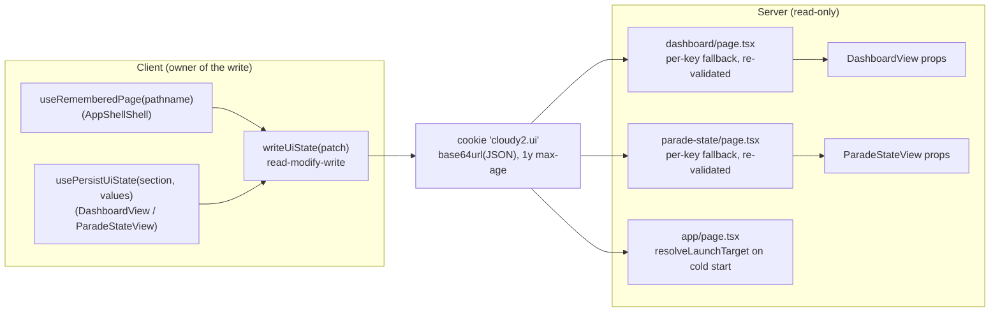
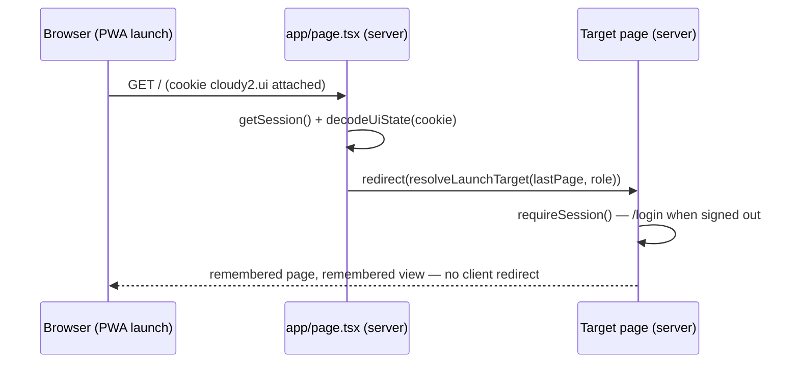
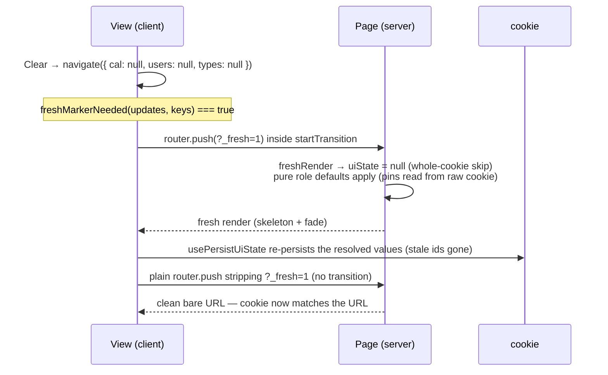

# 1. Remembered UI state

Relaunching the PWA (or an F5) should land the user exactly where they left off:
the last page, the dashboard's view/tab, date or month, and the Cal/Users/Types
filters — plus the pinned view tabs. This document describes the
**per-device remembered UI state** subsystem: one small cookie the **client owns
writing** and the **server reads** as per-key defaults before first paint, the
trust/normalization rules that keep a user-editable cookie from breaking renders,
the one-shot `_fresh` marker that keeps state removals from re-applying stale
values, and the pinned-tabs mechanism.

## Table of contents

- [1.1 Problem](#11-problem)
- [1.2 Goals & non-goals](#12-goals--non-goals)
- [1.3 Architecture overview](#13-architecture-overview)
- [1.4 The cookie: format & stored shape](#14-the-cookie-format--stored-shape)
- [1.5 Server read: per-key fallback](#15-server-read-per-key-fallback)
- [1.6 Cold-start launch target](#16-cold-start-launch-target)
- [1.7 Client write: convergence to what was rendered](#17-client-write-convergence-to-what-was-rendered)
- [1.8 Pinned tabs](#18-pinned-tabs)
- [1.9 The `_fresh` one-shot marker](#19-the-_fresh-one-shot-marker)
- [1.10 Sign-out & clearing](#110-sign-out--clearing)
- [1.11 Pure helpers & testing](#111-pure-helpers--testing)
- [1.12 File index & related docs](#112-file-index--related-docs)

## 1.1 Problem

The app is a mobile PWA: a genuine cold start (installed shortcut, `start_url /`)
goes through the server. Without remembered state, every cold start and every F5
would reset the user to "Month view, today, role-default filters" — losing the
view, date, and filters they had set, which on a daily-driver tool is a real
friction.

The constraints that shape the design:

- **No extra backend round-trip**: the state must restore before first paint, with
  no client redirect.
- **Per-device, not per-account**: the browser persists cookies per origin, which
  is exactly the right scope for UI preferences; there is no schema/table work.
- **The cookie is user-editable**: it must never be trusted — a corrupted or
  malicious value must degrade to "no remembered state", never break a render or
  redirect somewhere unknown.
- **Removals are ambiguous**: a bare URL (no `?users=`) means both "no user
  filter" *and* "use whatever the cookie remembers". When a navigation *removes*
  remembered state (Clear, unchecking "My Events"), the bare URL must **not**
  re-apply the now-stale cookie for that one render.

## 1.2 Goals & non-goals

**Goals**

- PWA cold start lands on the remembered page; a bare/F5 load of a page renders the
  remembered view before first paint — no client redirect, no flash.
- URL params always win over the cookie; the cookie fills gaps per key.
- Stored values are re-validated server-side exactly like URL params (patterns,
  whitelist, ids against live data), so stale/unknown ids drop out.
- The cookie always converges to **exactly what was last rendered** — including
  dropped stale ids and role defaults after a Clear.
- Pinned tabs survive tab switches (every tab switch is a `_fresh` render).
- Sign-out clears the state so the next account on the device starts from pure
  defaults.

**Non-goals**

- No cross-device sync, no server storage, no sharing between users on one device
  beyond the single cookie (the most recent writer's state wins per key).
- Not a client-side cache of page data — only view/filters/page preferences.
- One-shot URL params (`edit`, `refresh`, `_fresh`) are never stored.

## 1.3 Architecture overview



Division of labor:

- **The client owns the write.** Two independent writer hooks feed one
  read-modify-write `writeUiState`: `useRememberedPage` (the app shell, on every
  pathname change) and `usePersistUiState` (each page, on resolved-prop change).
  `mergeUiState`'s section-wholesale semantics keep them from clobbering each
  other (§1.7).
- **The server only reads**, via `cookies()` in the page components, and applies
  the state as **per-key fallbacks where the URL param is absent** — so
  restoration happens in the same RSC request, before first paint.

## 1.4 The cookie: format & stored shape

- **Name**: `cloudy2.ui` (`UI_STATE_COOKIE`, `src/lib/ui/uiState.ts:28`).
- **Value**: `base64url(JSON)` without padding — `encodeUiState` / `decodeUiState`
  (`uiState.ts:183` / `:188`). The encoder is `toBase64Url` (`:166`, UTF-8 →
  `btoa` → `+`→`-`, `/`→`_`, padding stripped); the decoder re-pads and is total —
  any failure (bad base64, broken JSON, non-object) returns `null`, never throws.
- **Attributes**: `path=/; max-age=31536000` (one year, `uiStateClient.ts:17,48`).
- **Overflow guard**: if the encoded value would exceed
  `SAFE_COOKIE_VALUE_LENGTH` (3500, headroom under the ~4 KiB browser cap —
  `uiStateClient.ts:18-21`), the writer re-encodes **dropping the id lists**
  (`cal`/`users`/`types`) and keeping the small scalars that carry the most
  "where am I" signal: `lastPage`, dashboard `view`/`date`/`month`/`pinnedViews`,
  parade `date`/`month` (`uiStateClient.ts:32-46`).

### 1.4.1 Stored JSON (`UiState`, `uiState.ts:30-55`)

```jsonc
{
  "lastPage": "/settings/users",        // bottom-nav path, incl. /settings sub-tab
  "dashboard": {
    "view": "weekv2",                   // month | week | weekv2 | schedule | agenda
    "date": "2026-08-21",               // day-anchored views
    "month": "2026-08",                 // Month view
    "cal": ["<calendar id>", "..."],    // comma-joined in the URL
    "users": ["<user id>"],
    "types": ["<event type name>"],
    "pinnedViews": ["weekv2", "month"]  // recency order: index 0 = leftmost tab
  },
  "parade": {
    "date": "2026-08-21",
    "month": "2026-08",
    "cal": ["<calendar id>"],
    "users": ["<user id>"]
  }
}
```

### 1.4.2 Normalization (`normalizeUiState`, `uiState.ts:120`)

Anything mismatched is **dropped, never thrown** — a corrupted cookie degrades to
"no remembered state":

- Non-plain-object top level → `null`.
- `lastPage` must be a string starting with `/` (`:123-126`) — blocks relative
  paths and `https://…` open-redirect attempts.
- Id lists: only arrays of non-empty strings survive (`idListOf`, `:109-113`); an
  **empty list is dropped** — empty means "unfiltered", and dropping it makes
  consumers fall back to their role default.
- `pinnedViews` keeps only known view values, de-duplicated in stored order
  (`normalizePinnedViews`, `:76-87`).
- A section with no surviving keys vanishes entirely (`:144-146`, `:159-161`).
- Note: `view`/`date`/`month` are **not** pattern-checked here — that lives in
  the consuming pages, which re-validate every key exactly like a URL param
  (§1.5).

## 1.5 Server read: per-key fallback

Both pages implement the same contract: **URL param wins; else the remembered
value, re-validated; else the role default.** A remembered value is only applied
after it survives the same validation a URL param would (date/month regexes, ids
filtered against live calendar/user/type data).

**Dashboard** (`src/app/(protected)/dashboard/page.tsx`):

- **Whole-cookie skips** (`page.tsx:51-53`): a `_fresh` render or an `?edit=` deep
  link (explicit intent) ignores the cookie entirely — `uiState = null`.
- `view` (`:60-70`): whitelisted to the five tab values, else `"month"`.
- `date` (`:72-78`): URL date (pattern `YYYY-MM-DD`) wins; a remembered date is
  used **only for day-anchored views** (`view !== "month"`) — in Month view the
  remembered *month* drives the read.
- `month` (`:82-88`): derived from the resolved date, else URL month
  (`YYYY-MM`), else remembered month, else the current month.
- `cal` (`:105-117`): **presence** of the `cal` param decides (an empty `?cal=`
  means "no filter" and wins) → URL ids filtered against real calendar ids; else
  remembered ids filtered the same way; else the role default (admin: all
  calendars; non-admin: own department's calendar).
- `users` / `types` (`:126-139`): same pattern against existing user ids / event
  type names. The ids dropped by validation are exactly what the client
  re-persists afterwards (§1.7).

**Parade state** (`src/app/(protected)/parade-state/page.tsx`): same `_fresh`
contract (`:32-36`); `date` = URL ?? cookie (pattern-checked) ?? today, `month`
derived from it (`:38-42`); `cal` — **every role defaults to all calendars**,
narrowing is opt-in (`:52-61`) — and `users` (`:63-69`) use the identical
URL-wins/validate-remembered/default pattern.

## 1.6 Cold-start launch target

The PWA `start_url` is `/` (`src/app/manifest.ts`), and `src/app/page.tsx` is a
tiny server component that resolves the launch **before first paint**:



`resolveLaunchTarget(lastPage, role)` (`uiState.ts:243`) is a pure whitelist:

- `/dashboard`, `/parade-state`, `/contacts` → as remembered (both roles).
- `/settings` → `/settings/users` for admins, `/dashboard` for everyone else.
- `/settings/<subtab>` → admin-only; known subtabs kept (users, departments,
  event-types, templates, general, audit-log — `SETTINGS_SUBTABS`, `:229-236`),
  unknown subtabs → `/settings/users`.
- Anything else — unknown page, relative path, `https://…`, `undefined` →
  `/dashboard`.

Role scoping is enforced a second time by `requireAdmin()` in the settings layout,
so a tampered cookie can never launch a non-admin into admin routes.

## 1.7 Client write: convergence to what was rendered

`writeUiState(patch)` (`src/lib/ui/uiStateClient.ts:28-49`) is a read-modify-write:
decode the current cookie, `mergeUiState(current, patch)`, encode, set.
`mergeUiState` (`uiState.ts:198`) merges **per section**: a patch's section
replaces that section wholesale; `lastPage` patch-wins; absent keys are untouched.
That is what keeps the two writer hooks from clobbering each other.

| Writer | Where | What it persists |
| ------ | ----- | ---------------- |
| `useRememberedPage(pathname)` (`uiStateClient.ts:73`) | `AppShellShell.tsx` — every authenticated page | `{ lastPage: pathname }` on every pathname change, incl. `/settings` sub-tabs |
| `usePersistUiState("dashboard", values)` (`uiStateClient.ts:62`) | `DashboardView.tsx:424` | the **server-resolved props**: `view`, `date`, `month`, `cal`, `users`, `types`, plus local `pinnedViews` |
| `usePersistUiState("parade", values)` | `ParadeStateView.tsx:148` | the server-resolved `date`, `month`, `cal`, `users` |

The crucial detail is **what** gets written: the *server-resolved* props, not the
raw URL params. The server has already dropped stale ids and applied role
defaults, so persisting the resolved values makes the cookie converge to exactly
what was on screen — no special handling in the navigation code
(`uiStateClient.ts:55-61`). `usePersistUiState` snapshots via `JSON.stringify` in
a `useMemo` and writes in an effect on change, so React re-renders with identical
resolved state never rewrite the cookie.

## 1.8 Pinned tabs

The dashboard's view tabs can be pinned: the "Pin Tab" / "Unpin Tab" item in the
3-dot menu (`DashboardView.tsx:1085`) toggles the **active** tab.

- **Storage**: `dashboard.pinnedViews` in the cookie — **recency order**, index 0
  = most recently pinned = renders **leftmost**, with a filled star icon prefixed
  to the tab name (`DashboardView.tsx:983-996`). `orderDashboardViews`
  (`uiState.ts:93`) computes the tab bar order: pinned first (stored order), then
  unpinned in the default order (`DASHBOARD_VIEW_VALUES`, `uiState.ts:65`).
- **Not URL-backed** — unlike every other dashboard key. `DASHBOARD_STATE_KEYS`
  deliberately excludes `pinnedViews` (`uiState.ts:57-61`), and a pin toggle
  **navigates nowhere**: `togglePinView` (`DashboardView.tsx:823-830`) just
  updates local state (prepend on pin, filter-out on unpin) — no skeleton, no
  `_fresh`.
- **Why pins survive `_fresh` renders**: every tab *switch* off an anchored view
  is a `_fresh` navigation, and the server's whole-cookie skip there would wipe
  everything read from the cookie. The page therefore reads pins from the **raw**
  `cookieState`, not the skipped `uiState` (`dashboard/page.tsx:55-58`), and the
  client keeps persisting `pinnedViews` on every render
  (`DashboardView.tsx:431`, incl. the overflow-degrade branch).
- **Local state vs prop**: `pinned` is local state seeded from the server-validated
  prop, with a render-phase sync that adopts the prop when its *content* changes
  (`DashboardView.tsx:329-340`) — back/forward and cleared cookies win, while a
  local toggle leads the prop by one render (the cookie write happens in a
  post-render effect, so content comparison avoids clobbering it).

## 1.9 The `_fresh` one-shot marker

**Problem**: a bare URL produced by a *removal* (Clear, "My Events" off, tab
switch off an anchored view) would, for one render, fall back to the now-stale
cookie for the removed keys.

**Mechanism**:



1. **Detection** — `freshMarkerNeeded(updates, keys)` (`uiState.ts:221-226`):
   true when any remembered key is set to `null` in the navigation's updates.
2. **Injection** — `navigate()` in `DashboardView` (`:584-609`) and
   `ParadeStateView` (`:174-189`): after a no-op guard (built href === current
   URL → return, so re-removing an absent key never round-trips), a removal
   navigation pushes `?_fresh=1` inside `startTransition`. Triggering actions:
   `clearFilters` (`:832-836`), `switchView` leaving an anchored view
   (`:707-711`), `toggleOnlyMe` unchecked (`:817-821`); parade equivalents in
   `ParadeStateView.tsx:248-275`.
3. **Server handling** — presence of `?_fresh` (any value) nulls the whole cookie
   state for that render: `dashboard/page.tsx:51-53`, `parade-state/page.tsx:32-35`.
4. **Stripping** — a self-terminating effect pushes a plain (no-transition)
   `router.push` removing the marker once its render mounted
   (`DashboardView.tsx:611-619`, `ParadeStateView.tsx:238-246`), so it never
   survives into back/forward history. The same pattern covers the `?edit=` strip
   (`:621-631`) and the `?refresh=` nonce strip (`:633-644`).

After the fresh render commits, `usePersistUiState` re-persists the freshly
resolved values, so the next render (marker stripped) reads a cookie that already
matches the URL — the stale entries are gone.

## 1.10 Sign-out & clearing

- `clearUiState()` (`uiStateClient.ts:51-53`) expires the cookie (`max-age=0`).
- It is called by the **Log out** menu item in `UserMenu.tsx:19-26` right before
  NextAuth's `signOut`: the state is per-device, so the next account on the device
  must start from pure defaults. `UserMenu` is the only caller.

## 1.11 Pure helpers & testing

All decision logic is pure and unit-tested in `src/lib/ui/uiState.test.ts`
(283 lines); the writer hooks and the page-level reads are thin glue.

| Helper (`src/lib/ui/uiState.ts`) | Behavior | Tests |
| -------------------------------- | -------- | ----- |
| `encodeUiState` / `decodeUiState` (`:183` / `:188`) | base64url round-trip; total decode (garbage → `null`) | round-trip (incl. `pinnedViews`), alphabet check, padded-input tolerance, garbage cases |
| `normalizeUiState` (`:120`) | type/shape coercion; drops mismatched values, empty lists, empty sections; `lastPath` absolute-path check | well-formed keep, mismatched drop, mixed-type lists, open-redirect block |
| `mergeUiState` (`:198`) | section-wholesale merge, `lastPage` patch-wins | patch-only-section, whole-section replace |
| `normalizePinnedViews` (`:76`) | known values only, de-duped, stored order | non-arrays, unknown/duplicate drop, order |
| `orderDashboardViews` (`:93`) | pinned first (recency), then default order | default order, single/multiple pins, all-pinned uniqueness |
| `freshMarkerNeeded` (`:221`) | true iff any remembered key removed | single/multiple removals, set-only, empty |
| `resolveLaunchTarget` (`:243`) | whitelist + role scoping for the cold start | base pages, `/settings` per role, all subtabs, unknown/relative/`https`/`undefined` fallbacks |

Test environment note: vitest runs in bare node without `btoa`/`atob`, so the test
file carries a `Buffer`-based mirror of the base64url encoder
(`uiState.test.ts:278-283`).

I/O-bound (not unit-tested): `uiStateClient.ts` (`document.cookie`), the
`cookies()` reads in `page.tsx`/`dashboard/page.tsx`/`parade-state/page.tsx`, and
the writer hooks.

## 1.12 File index & related docs

| File | Role |
| ---- | ---- |
| `src/lib/ui/uiState.ts` | Pure state model, codec, normalization, launch target, pin ordering |
| `src/lib/ui/uiStateClient.ts` | Client writer: `writeUiState`, `clearUiState`, `usePersistUiState`, `useRememberedPage` |
| `src/lib/ui/uiState.test.ts` | Unit tests for all pure helpers |
| `src/app/page.tsx` | Cold-start launch redirect (`resolveLaunchTarget`) |
| `src/app/(protected)/dashboard/page.tsx` | Dashboard per-key fallback + `_fresh`/`edit` skips + pin read |
| `src/app/(protected)/parade-state/page.tsx` | Parade-state per-key fallback + `_fresh` skip |
| `src/app/(protected)/dashboard/DashboardView.tsx` | Persist hook, `navigate` + `_fresh` inject/strip, pin toggle + sync, one-shot strips |
| `src/app/(protected)/parade-state/ParadeStateView.tsx` | Parade persist hook + `_fresh` inject/strip |
| `src/components/AppShellShell.tsx` | `useRememberedPage` on every pathname change |
| `src/components/UserMenu.tsx` | Sign-out → `clearUiState` |
| `src/app/manifest.ts` | PWA `start_url /` |

Related docs:

- [`loading-transitions.md`](loading-transitions.md) — the one-shot param pattern
  (`?edit=` / `?refresh=` / `?_fresh=`) and skeleton/fade behavior these
  navigations trigger.
- [`events-cache.md`](events-cache.md) — the `?refresh=` force-refresh nonce this
  state system coexists with.
- [`README.md`](../README.md#112-documentation) — documentation index.
- `progress.md` — phase write-ups: 1.69 (remembered UI state), 1.71 (user filter
  row narrowing), 1.72 (pinned tabs).
