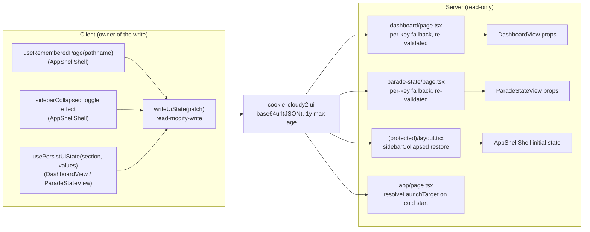
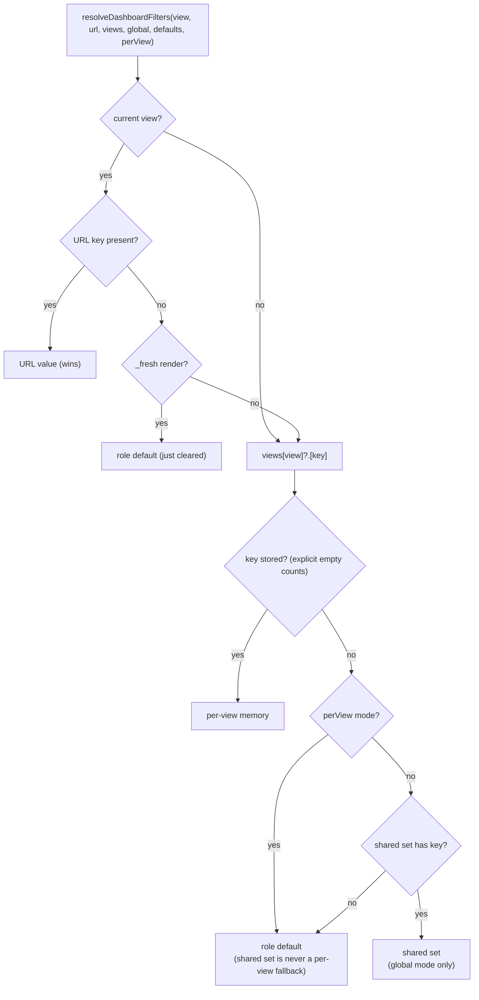
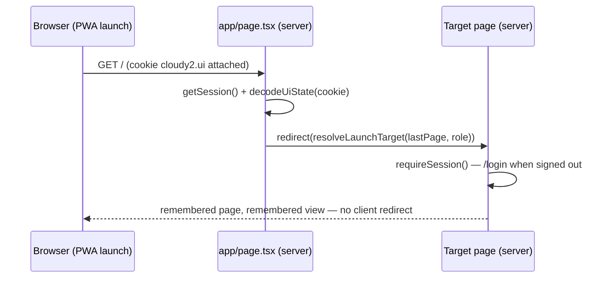
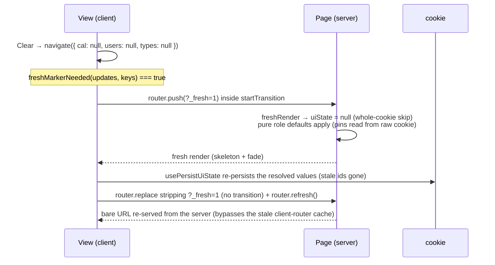

# 1. Remembered UI state

Relaunching the PWA (or an F5) should land the user exactly where they left off:
the last page, the dashboard's view/tab, date or month, and the Cal/Users/Types
filters — plus the pinned view tabs and the desktop sidebar's minimized state.
One deliberate exception: the parade state page remembers only its
Cal/Users filters — its day is never restored, so it always opens on today.
This document describes the
**per-device remembered UI state** subsystem: one small cookie the **client owns
writing** and the **server reads** as per-key defaults before first paint, the
trust/normalization rules that keep a user-editable cookie from breaking renders,
the one-shot `_fresh` marker that keeps state removals from re-applying stale
values, and the pinned-tabs mechanism.

## Table of contents

- [1.1 Problem](#11-problem)
- [1.2 Goals & non-goals](#12-goals--non-goals)
- [1.3 Architecture overview](#13-architecture-overview)
- [1.4 The cookie: format & stored shape](#14-the-cookie-format--stored-shape)
- [1.5 Server read: per-key fallback](#15-server-read-per-key-fallback)
- [1.5.1 Dashboard filter scoping (`filterMode` / `views`)](#151-dashboard-filter-scoping-filtermode--views)
- [1.6 Cold-start launch target](#16-cold-start-launch-target)
- [1.7 Client write: convergence to what was rendered](#17-client-write-convergence-to-what-was-rendered)
- [1.8 Pinned tabs](#18-pinned-tabs)
- [1.9 The `_fresh` one-shot marker](#19-the-_fresh-one-shot-marker)
- [1.10 Sign-out & clearing](#110-sign-out--clearing)
- [1.11 Pure helpers & testing](#111-pure-helpers--testing)
- [1.12 File index & related docs](#112-file-index--related-docs)

## 1.1 Problem

The app is a mobile PWA: a genuine cold start (installed shortcut, `start_url /`)
goes through the server. Without remembered state, every cold start and every F5
would reset the user to "Month view, today, role-default filters" — losing the
view, date, and filters they had set, which on a daily-driver tool is a real
friction.

The constraints that shape the design:

- **No extra backend round-trip**: the state must restore before first paint, with
  no client redirect.
- **Per-device, not per-account**: the browser persists cookies per origin, which
  is exactly the right scope for UI preferences; there is no schema/table work.
- **The cookie is user-editable**: it must never be trusted — a corrupted or
  malicious value must degrade to "no remembered state", never break a render or
  redirect somewhere unknown.
- **Removals are ambiguous**: a bare URL (no `?users=`) means both "no user
  filter" *and* "use whatever the cookie remembers". When a navigation *removes*
  remembered state (Clear, unchecking "My Events"), the bare URL must **not**
  re-apply the now-stale cookie for that one render.

## 1.2 Goals & non-goals

**Goals**

- PWA cold start lands on the remembered page; a bare/F5 load of a page renders the
  remembered view before first paint — no client redirect, no flash.
- URL params always win over the cookie; the cookie fills gaps per key.
- Stored values are re-validated server-side exactly like URL params (patterns,
  whitelist, ids against live data), so stale/unknown ids drop out.
- The cookie always converges to **exactly what was last rendered** — including
  dropped stale ids and role defaults after a Clear.
- Pinned tabs survive tab switches (every tab switch is a `_fresh` render).
- Sign-out clears the state so the next account on the device starts from pure
  defaults.

**Non-goals**

- No cross-device sync, no server storage, no sharing between users on one device
  beyond the single cookie (the most recent writer's state wins per key).
- Not a client-side cache of page data — only view/filters/page preferences.
- One-shot URL params (`event`, `edit`, `refresh`, `_fresh`) are never stored.

## 1.3 Architecture overview


```mermaid
flowchart LR
    subgraph CLIENT["Client (owner of the write)"]
        RP["useRememberedPage(pathname)<br/>(AppShellShell)"]
        SB["sidebarCollapsed toggle effect<br/>(AppShellShell)"]
        PU["usePersistUiState(section, values)<br/>(DashboardView / ParadeStateView)"]
        W["writeUiState(patch)<br/>read-modify-write"]
        RP --> W
        SB --> W
        PU --> W
    end
    CK["cookie 'cloudy2.ui'<br/>base64url(JSON), 1y max-age"]
    W --> CK
    subgraph SERVER["Server (read-only)"]
        D["dashboard/page.tsx<br/>per-key fallback, re-validated"]
        P["parade-state/page.tsx<br/>per-key fallback, re-validated"]
        L["(protected)/layout.tsx<br/>sidebarCollapsed restore"]
        H["app/page.tsx<br/>resolveLaunchTarget on cold start"]
        D --> DASH["DashboardView props"]
        P --> PAR["ParadeStateView props"]
        L --> SHELL["AppShellShell initial state"]
    end
    CK --> D
    CK --> P
    CK --> L
    CK --> H
```

Division of labor:

- **The client owns the write.** Three independent writers feed one
  read-modify-write `writeUiState`: `useRememberedPage` (the app shell, on every
  pathname change), the sidebar toggle effect (the app shell, on the
  `sidebarCollapsed` change), and `usePersistUiState` (each page, on
  resolved-prop change). `mergeUiState`'s section-wholesale semantics keep them
  from clobbering each other (§1.7).
- **The server only reads**, via `cookies()` in the page components (and the
  (protected) layout for the sidebar key), and applies the state as **per-key
  fallbacks where the URL param is absent** — so restoration happens in the
  same RSC request, before first paint.

## 1.4 The cookie: format & stored shape

- **Name**: `cloudy2.ui` (`UI_STATE_COOKIE`, `src/lib/ui/uiState.ts`).
- **Value**: `base64url(JSON)` without padding of `{ v: [major, minor], ...UiState }`
  — `encodeUiState` / `decodeUiState`. The encoder is `toBase64Url` (UTF-8 →
  `btoa` → `+`→`-`, `/`→`_`, padding stripped); the decoder re-pads and is
  **version-checked then total** — bad base64, broken JSON, a non-object, OR an
  incompatible major version all return `null`, never throw.
- **Attributes**: `path=/; max-age=31536000` (one year, `uiStateClient.ts`).
- **Schema versioning** (`v: [major, minor]`): a **major mismatch in either
  direction drops the whole cookie** (`decodeUiState` → `null`) — the writer's
  shape guarantees are per-major, so a rolled-back deploy never decodes a
  future-major blob and a past-major blob is never tolerated. A **newer minor**
  within the current major decodes as-is (minor bumps are forward-compatible,
  unknown fields fall out in normalization); an **older minor** runs the pure
  `MINOR_MIGRATIONS` chain before normalization. A **legacy v1 cookie** (no
  `v` field) is dropped too — v1 shipped the materialized per-view `views`
  blob whose overflow drain is exactly what versioning retires, so every
  existing cookie gets a clean start on this build. `writeUiState` always
  re-stamps the current version (self-healing after a drop). (The PWA launch
  shell's inline script reads only `lastPage` + `dashboard.view` leniently and
  ignores the version — it cannot import the server codec, and at worst one
  launch lands on the default target; the app self-heals on the next write.
  The service worker does not decode this cookie at all: a SW never sees the
  `Cookie` request header, so the launch target is resolved in the page.)
- **Overflow guard**: if the encoded value exceeds `SAFE_COOKIE_VALUE_LENGTH`
  (3500, headroom under the ~4 KiB browser cap), the writer **trims the least
  intentful id lists first** via `reduceUiStateForCookie` (pure): parade filters,
  then the shared `cal`/`types`/`users`, then per-view `cal` lists (re-derivable
  from the role default), then per-view `types`, keeping per-view **user**
  selections last — and only when everything else is gone do the scalar
  "where am I" keys suffer. Once per-view memory stopped materializing
  unconfigured views (§1.5.1), healthy cookies stay far under the limit; this
  guard is the last-resort safety net for large explicit selections and no
  longer wipes the `views` map it used to.

### 1.4.1 Stored JSON (`UiState`, `uiState.ts:52-58`)

```jsonc
{
  // decodeUiState strips the version before this shape is consumed; the wire
  // value is `{ "v": [2, 0], ...this }`. Bump minor for a migration, major to
  // drop the cookie (see §1.4). Update the jsonc + tests when bumping.
  "lastPage": "/settings/users",        // bottom-nav path, incl. /settings sub-tab
  "sidebarCollapsed": false,            // desktop sidebar minimized to the icon rail
  "dashboard": {
    "view": "weekv2",                   // month | week (H) | weekv2 (Week D) | schedule | agenda — labels are "Week (H)" / "Week (D)"
    "date": "2026-08-21",               // day-anchored views
    "month": "2026-08",                 // Month view
    "cal": ["<calendar id>", "..."],    // comma-joined in the URL
    "users": ["<user id>"],
     "types": ["<event type name>"],
     "pinnedViews": ["weekv2", "month"], // recency order: index 0 = leftmost tab
     "zoom": 1.5,                        // Day/Week (H) hour-slot zoom (see slotZoom.ts)
     "filterMode": "per-view",           // "global" (absent) = ONE shared filter set across
                                         // every view; "per-view" = each view remembers its own
     "views": {                          // present only in per-view mode; holds ONLY views the user
                                         // explicitly configured or cleared (buildDashboardPersist merges
       "month":  { "cal": ["<calendar id>"], "users": [], "types": [] },
                                         // the current view into the previous map) — an ABSENT view
       "week":   { "cal": ["<calendar id>"], "users": ["<user id>"] },
                                         // resolves to the ROLE DEFAULT (per-view never consults the
       ...                               // shared set — configuring one view can't leak into another)
     }
   },
  "parade": {
    "cal": ["<calendar id>"],           // filters only — the day is NOT remembered:
    "users": ["<user id>"]              // a bare /parade-state always opens on today
  }
}
```

### 1.4.2 Normalization (`normalizeUiState`, `uiState.ts:120`)

Anything mismatched is **dropped, never thrown** — a corrupted cookie degrades to
"no remembered state":

- Non-plain-object top level → `null`.
- `lastPage` must be a string starting with `/` (`:126-128`) — blocks relative
  paths and `https://…` open-redirect attempts.
- `sidebarCollapsed` must be a real boolean — both `true` and `false` survive
  (an explicit `false` is "expanded", which the writer persists on re-expand).
- Id lists: only arrays of non-empty strings survive (`idListOf`, `:112-116`); an
  **empty list is dropped** — empty means "unfiltered", and dropping it makes
  consumers fall back to their role default.
- `pinnedViews` keeps only known view values, de-duplicated in stored order
  (`normalizePinnedViews`, `:79-90`).
- `zoom` is a finite number snapped to the nearest known level via `clampZoom`
  (`slotZoom.ts`); non-numeric / non-finite values drop.
- `filterMode` keeps only `"per-view"` — an explicit `"global"` is dropped
  (absent = global), keeping old cookies small and "no remembered preference"
  canonical.
- `views` is kept only while `filterMode === "per-view"` (a stale map in a
  global cookie is dropped so it can't leak into the shared set). Only known
  view keys survive; each sub-list keeps every non-empty string and — unlike
  the shared `cal`/`users`/`types` lists — an **explicit empty list is kept**
  because in per-view mode it records "this view cleared that filter" (a view
  that never set a key falls back to the shared set). A view whose sub-lists
  are all non-arrays vanishes; an empty whole map vanishes.
- A section with no surviving keys vanishes entirely (`:150-152`, `:165-167`).
- Note: `view`/`date`/`month` are **not** pattern-checked here — that lives in
  the consuming pages, which re-validate every key exactly like a URL param
  (§1.5). The parade section has no scalars left at all: a stale `date`/`month`
  in an old cookie is dropped outright, because the day is never restored.

## 1.5 Server read: per-key fallback

Both pages implement the same contract: **URL param wins; else the remembered
value, re-validated; else the role default.** A remembered value is only applied
after it survives the same validation a URL param would (date/month regexes, ids
filtered against live calendar/user/type data).

**Dashboard** (`src/app/(protected)/dashboard/page.tsx`):

- **Whole-cookie skips** (`page.tsx:74-80`): a `_fresh` render or an
  `?event=` / `?edit=` deep link (explicit intent — the notes' `Edit:` link
  writes `?event=`, older notes carry `?edit=`) ignores the cookie entirely —
  `uiState = null`.
- `zoom` (Day/Week (H) hour-slot width): not URL-backed like `pinnedViews`, so it
  is read from the **raw** `cookieState` (not the skipped `uiState`), snapped via
  `clampZoom` (`slotZoom.ts`), defaulting to `1`. It seeds the client zoom state
  before first paint so a relaunch restores the last zoom with no width jump.
- `view` (`:60-70`): whitelisted to the five tab values, else `"month"`.
- `date` (`:72-78`): URL date (pattern `YYYY-MM-DD`) wins; a remembered date is
  used **only for day-anchored views** (`view !== "month"`) — in Month view the
  remembered *month* drives the read.
- `month` (`:82-88`): derived from the resolved date, else URL month
  (`YYYY-MM`), else remembered month, else the current month.
- `cal` (`:105-117`): **presence** of the `cal` param decides (an empty `?cal=`
  means "no filter" and wins) → URL ids filtered against real calendar ids; else
  remembered ids filtered the same way; else the role default (admin: all
  calendars; non-admin: own department's calendar).
- `users` / `types` (`:126-139`): same pattern against existing user ids / event
  type names. The ids dropped by validation are exactly what the client
  re-persists afterwards (§1.7).

#### 1.5.1 Dashboard filter scoping (`filterMode` / `views`)

The dashboard's Calendars/Users/Event Types filters resolve through one helper,
`resolveDashboardFilters` (`uiState.ts`, pure, unit-tested):

```
global:    current view:  URL (if present) → views[view] → shared set → role default
           other views:                   → views[view] → shared set → role default
per-view:  current view:  URL (if present) → views[view] → role default
           other views:                   → views[view] → role default
```

- **Global mode** (the default, `filterMode` absent) is unchanged: the cookie
  carries no `views`, so every view resolves `URL → shared set → role default`.
- **Per-view mode** (`filterMode: "per-view"`) gives each of the five views its
  own absolute remembered set, and the shared set is **never a fallback** — the
  page passes `perView: true` to `resolveDashboardFilters`, which skips
  `global` entirely. A view the user never configured therefore shows **role
  defaults** (admin: all calendars; no user/event-type filter), and configuring
  one view never leaks its filters into another's untouched views. An **explicit
  empty list in `views[view]`** (records "this view cleared that filter") still
  resolves to empty trivially — with no shared fallback, there is nothing to
  resurrect. The shared set remains the *global*-mode set and the "flip back to
  Same for all views" target (§1.2).
- **The writer only records what the user configured.** `buildDashboardPersist`
  (`uiState.ts`, pure — the seed `DashboardPersistSeed` carries the current
  view's resolved set plus which filter params the current URL pins) merges the
  current view's entry into the *previous* `views` map; it never persists the
  full resolved set for every view, so a view the user never touched keeps
  absent keys and resolves to role defaults. A key is recorded when the URL pins
  it (an apply or a per-view view-switch wrote it — recorded verbatim) or when
  the view already remembered it (the value is refreshed); everything else stays
  absent. Besides matching the absent-key semantics, this keeps a 15+ calendar
  org's cookie far under the size guard — the v1 writer materialized
  `cal = <all calendars>` into all five views per render, blowing past
  `SAFE_COOKIE_VALUE_LENGTH` and triggering the old overflow drain that silently
  wiped the whole `views` map (the Users-filter loss this fixed).
- `filterMode` is a **non-navigating preference** like `pinnedViews`/`zoom`:
  read from the **raw** `cookieState` even on `_fresh` renders, so a Clear never
  silently flips the user back to the global default.
- Stale ids are validated in the page exactly like URL ids — per-view and
  shared lists are filtered against live calendar/user/type data **before** the
  helper picks a value, so a deleted department/user drops out of both memories
  (and the client re-persists the pruned sets). Side-effect of that validation:
  a per-view list whose entries are all stale degrades to an absent key (resolves
  to the role default) rather than pinning an empty grid.
- In per-view mode the URL always reflects the *current* view's resolved set:
  `switchView` writes the target view's filters into the URL (empty selection as
  `?cal=` — never a removed key, so no `_fresh`), which keeps back/forward and
  deep links coherent.


```mermaid
flowchart TD
    A["resolveDashboardFilters(view, url, views, global, defaults, perView)"] --> B{"current view?"}
    B -- yes --> C{"URL key present?"}
    C -- yes --> OUT["URL value (wins)"]
    C -- no --> D{"_fresh render?"}
    D -- yes --> OUT2["role default (just cleared)"]
    B -- no --> E
    D -- no --> E["views[view]?.[key]"]
    E --> F{"key stored? (explicit empty counts)"}
    F -- yes --> OUT3["per-view memory"]
    F -- no --> P{"perView mode?"}
    P -- yes --> OUT5["role default<br/>(shared set is never a per-view fallback)"]
    P -- no --> G{"shared set has key?"}
    G -- yes --> OUT4["shared set<br/>(global mode only)"]
    G -- no --> OUT5
```

**Parade state** (`src/app/(protected)/parade-state/page.tsx`): same `_fresh`
contract (`:33-34`). The day is deliberately **not** remembered — `date` = URL
(pattern-checked) ?? today (`:37-43`), `month` derived from it — so a bare
/parade-state always opens on today while an explicit `?date=` still wins
(in-session day switches, back/forward, F5 on a picked-day URL). Remembered
state is filters only: `cal` — **every role defaults to all calendars**,
narrowing is opt-in (`:53-62`) — and `users` (`:64-70`) use the identical
URL-wins/validate-remembered/default pattern.

## 1.6 Cold-start launch target

The PWA `start_url` is `/` (`src/app/manifest.ts`), and `src/app/page.tsx` is a
tiny server component that resolves the launch **before first paint**:


```mermaid
sequenceDiagram
    participant B as Browser (PWA launch)
    participant H as app/page.tsx (server)
    participant T as Target page (server)
    B->>H: GET / (cookie cloudy2.ui attached)
    H->>H: getSession() + decodeUiState(cookie)
    H->>T: redirect(resolveLaunchTarget(lastPage, role))
    T->>T: requireSession() — /login when signed out
    T-->>B: remembered page, remembered view — no client redirect
```

`resolveLaunchTarget(lastPage, role)` (`uiState.ts:243`) is a pure whitelist:

- `/dashboard`, `/parade-state`, `/contacts` → as remembered (both roles).
- `/settings` → `/settings/users` for admins, `/dashboard` for everyone else.
- `/settings/<subtab>` → admin-only; known subtabs kept (users, departments,
  event-types, templates, general, audit-log — `SETTINGS_SUBTABS`, `:229-236`),
  unknown subtabs → `/settings/users`.
- Anything else — unknown page, relative path, `https://…`, `undefined` →
  `/dashboard`.

Role scoping is enforced a second time by `requireAdmin()` in the settings layout,
so a tampered cookie can never launch a non-admin into admin routes.

## 1.7 Client write: convergence to what was rendered

`writeUiState(patch)` (`src/lib/ui/uiStateClient.ts:29-50`) is a read-modify-write:
decode the current cookie, `mergeUiState(current, patch)`, encode, set.
`mergeUiState` (`uiState.ts:204`) merges **per section**: a patch's section
replaces that section wholesale; `lastPage` and `sidebarCollapsed` patch-win;
absent keys are untouched.
That is what keeps the writer hooks from clobbering each other.

The sidebar key is the one state the **shell** owns end-to-end: the (protected)
layout reads `sidebarCollapsed` from the cookie before first paint
(`(protected)/layout.tsx:17`) and passes it to `AppShellShell` as the
initial state (no client-side restore — the server renders exactly what was
remembered), and the shell's effect persists it back on every toggle.

| Writer | Where | What it persists |
| ------ | ----- | ---------------- |
| `useRememberedPage(pathname)` (`uiStateClient.ts:74`) | `AppShellShell.tsx` — every authenticated page | `{ lastPage: pathname }` on every pathname change, incl. `/settings` sub-tabs |
| sidebar toggle effect (`AppShellShell.tsx:153-155`) | `AppShellShell.tsx` — every authenticated page | `{ sidebarCollapsed }` on mount (the remembered value) and on every toggle — writing `false` too, so the cookie converges when the sidebar is re-expanded |
| `usePersistUiState("dashboard", seed)` (`uiStateClient.ts:70`) | `DashboardView.tsx` | builds the next section from the **current cookie** via `buildDashboardPersist` (pure): the server-resolved `view`, `date`, `month`, `selected`→shared `cal/users/types`, plus local `pinnedViews`/`zoom`; in per-view mode `filterMode` and the current view's entry **merged** into the previous `views` map (never the full resolved map — §1.5.1; the shared set written top-level is the global-mode/`flip-back` target and is not a per-view fallback); omitting them in global mode prunes a stale map on revert |
| `usePersistUiState("parade", values)` | `ParadeStateView.tsx:166` | the server-resolved `cal`, `users` filters — the day is deliberately not persisted, so a bare /parade-state opens on today |

The overflow guard described in §1.4 also lives in this read-modify-write: the
writer encodes, and if the value exceeds `SAFE_COOKIE_VALUE_LENGTH` it trims
the least-intentful id lists one pass at a time (`reduceUiStateForCookie`) and
re-encodes until it fits — never silently dropping the per-view `views` map the
way the v1 writer did.

The crucial detail is **what** gets written: the *server-resolved* props, not the
raw URL params. The server has already dropped stale ids and applied role
defaults, so persisting the resolved values makes the cookie converge to exactly
what was on screen — no special handling in the navigation code
(`uiStateClient.ts:55-61`). `usePersistUiState` snapshots via `JSON.stringify` in
a `useMemo` and writes in an effect on change, so React re-renders with identical
resolved state never rewrite the cookie.

## 1.8 Pinned tabs

The dashboard's view tabs can be pinned: the "Pin Tab" / "Unpin Tab" item in the
3-dot menu (`DashboardView.tsx:1085`) toggles the **active** tab.

- **Storage**: `dashboard.pinnedViews` in the cookie — **recency order**, index 0
  = most recently pinned = renders **leftmost**, with a filled star icon prefixed
  to the tab name (`DashboardView.tsx:983-996`). `orderDashboardViews`
  (`uiState.ts:96`) computes the tab bar order: pinned first (stored order), then
  unpinned in the default order (`DASHBOARD_VIEW_VALUES`, `uiState.ts:68`).
- **Not URL-backed** — unlike every other dashboard key. `DASHBOARD_STATE_KEYS`
  deliberately excludes `pinnedViews` (and `zoom`, the Day/Week (H) slot zoom —
  which follows this exact pattern: a non-navigating local state, read from the
  raw cookie, never needing `_fresh`), and a pin toggle
  **navigates nowhere**: `togglePinView` (`DashboardView.tsx:823-830`) just
  updates local state (prepend on pin, filter-out on unpin) — no skeleton, no
  `_fresh`.
- **Why pins survive `_fresh` renders**: every tab *switch* off an anchored view
  is a `_fresh` navigation, and the server's whole-cookie skip there would wipe
  everything read from the cookie. The page therefore reads pins from the **raw**
  `cookieState`, not the skipped `uiState` (`dashboard/page.tsx:55-58`), and the
  client keeps persisting `pinnedViews` on every render
  (`DashboardView.tsx:431`, incl. the overflow-degrade branch).
- **Local state vs prop**: `pinned` is local state seeded from the server-validated
  prop, with a render-phase sync that adopts the prop when its *content* changes
  (`DashboardView.tsx:329-340`) — back/forward and cleared cookies win, while a
  local toggle leads the prop by one render (the cookie write happens in a
  post-render effect, so content comparison avoids clobbering it).

## 1.9 The `_fresh` one-shot marker

**Problem**: a bare URL produced by a *removal* (Clear, "My Events" off, tab
switch off an anchored view) would, for one render, fall back to the now-stale
cookie for the removed keys.

**Mechanism**:


```mermaid
sequenceDiagram
    participant V as View (client)
    participant P as Page (server)
    participant C as cookie
    V->>V: Clear → navigate({ cal: null, users: null, types: null })
    Note over V: freshMarkerNeeded(updates, keys) === true
    V->>P: router.push(?_fresh=1) inside startTransition
    P->>P: freshRender → uiState = null (whole-cookie skip)<br/>pure role defaults apply (pins read from raw cookie)
    P-->>V: fresh render (skeleton + fade)
    V->>C: usePersistUiState re-persists the resolved values (stale ids gone)
    V->>P: router.replace stripping ?_fresh=1 (no transition) + router.refresh()
    P-->>V: bare URL re-served from the server (bypasses the stale client-router cache)
```

1. **Detection** — `freshMarkerNeeded(updates, keys)` (`uiState.ts:230-235`):
   true when any remembered key is set to `null` in the navigation's updates.
2. **Injection** — `navigate()` in `DashboardView` (`:584-609`) and
   `ParadeStateView` (`:174-189`): after a no-op guard (built href === current
   URL → return, so re-removing an absent key never round-trips), a removal
   navigation pushes `?_fresh=1` inside `startTransition`. Triggering actions:
   `clearFilters` (`:832-836`), `switchView` leaving an anchored view
   (`:707-711`), and the FilterModal's Reset/empty-selection apply; parade
   equivalents in `ParadeStateView.tsx:248-275`.
3. **Server handling** — presence of `?_fresh` (any value) nulls the whole cookie
   state for that render: `dashboard/page.tsx:51-53`, `parade-state/page.tsx:33-34`.
   **Per-view scoping (dashboard):** a `_fresh` render in per-view mode skips the
   cookie for the *current view only* — it resolves from the URL or pure role
   defaults — while the other views' `views` memories (and the `filterMode`
   preference) keep being read from the raw cookie. Clearing Week's filters must
   never reset Month; `resolveDashboardFilters`' `fresh` flag encodes this.
4. **Stripping** — a self-terminating effect removes the marker once its render
   mounted (`DashboardView.tsx:611-619`, `ParadeStateView.tsx:238-246`) via
   `router.replace(…, { scroll: false }); router.refresh()`, so it never
   survives into back/forward history **and** the bare URL is re-served from
   the *server*: `router.refresh()` bypasses the stale client-router/SW RSC
   snapshot (`staleTimes.dynamic: 120`) that a plain push would have replayed,
   which would revert the just-cleared filters and let `usePersistUiState`
   re-seed them into the cookie. The `?refresh=` nonce strip uses the same
   replace+refresh pattern (`:633-644`); the `?edit=`/`?event=` strips stay
   plain pushes (they carry no filter state to resurrect).
   In per-view mode `switchView` writes the target view's filters explicitly
   (never `null`), so view switches never need `_fresh` — the URL carries the
   target's resolved set.

After the fresh render commits, `usePersistUiState` re-persists the freshly
resolved values, so the next render (marker stripped) reads a cookie that already
matches the URL — the stale entries are gone.

## 1.10 Sign-out & clearing

- `clearUiState()` (`uiStateClient.ts:52-54`) expires the cookie (`max-age=0`).
- It is called by the **Log out** menu item in `UserMenu.tsx:19-26` right before
  NextAuth's `signOut`: the state is per-device, so the next account on the device
  must start from pure defaults (the sidebar rail preference goes with it).
  `UserMenu` is the only caller.

## 1.11 Pure helpers & testing

All decision logic is pure and unit-tested in `src/lib/ui/uiState.test.ts`
(334 lines); the writer hooks and the page-level reads are thin glue.

| Helper (`src/lib/ui/uiState.ts`) | Behavior | Tests |
| -------------------------------- | -------- | ----- |
| `encodeUiState` / `decodeUiState` (`:189` / `:194`) | base64url round-trip; total decode (garbage → `null`) | round-trip (incl. `pinnedViews`), alphabet check, padded-input tolerance, garbage cases |
| `normalizeUiState` (`:123`) | type/shape coercion; drops mismatched values, empty lists, empty sections; `lastPage` absolute-path check; `sidebarCollapsed` boolean-only | well-formed keep, mismatched drop, mixed-type lists, open-redirect block, `sidebarCollapsed` keep/drop |
| `mergeUiState` (`:204`) | section-wholesale merge, `lastPage`/`sidebarCollapsed` patch-wins | patch-only-section, whole-section replace, `sidebarCollapsed` both directions + absence |
| `normalizePinnedViews` (`:79`) | known values only, de-duped, stored order | non-arrays, unknown/duplicate drop, order |
| `orderDashboardViews` (`:96`) | pinned first (recency), then default order | default order, single/multiple pins, all-pinned uniqueness |
| `freshMarkerNeeded` (`:230`) | true iff any remembered key removed | single/multiple removals, set-only, empty |
| `resolveLaunchTarget` (`:252`) | whitelist + role scoping for the cold start | base pages, `/settings` per role, all subtabs, unknown/relative/`https`/`undefined` fallbacks |

Test environment note: vitest runs in bare node without `btoa`/`atob`, so the test
file carries a `Buffer`-based mirror of the base64url encoder
(`uiState.test.ts:321-326`).

I/O-bound (not unit-tested): `uiStateClient.ts` (`document.cookie`), the
`cookies()` reads in `page.tsx`/`dashboard/page.tsx`/`parade-state/page.tsx`/
`(protected)/layout.tsx`, and the writer hooks.

## 1.12 File index & related docs

| File | Role |
| ---- | ---- |
| `src/lib/ui/uiState.ts` | Pure state model, codec, normalization, launch target, pin ordering |
| `src/lib/ui/uiStateClient.ts` | Client writer: `writeUiState`, `clearUiState`, `usePersistUiState`, `useRememberedPage` |
| `src/lib/ui/uiState.test.ts` | Unit tests for all pure helpers |
| `src/app/page.tsx` | Cold-start launch redirect (`resolveLaunchTarget`) |
| `src/app/(protected)/dashboard/page.tsx` | Dashboard per-key fallback + `_fresh`/`edit` skips + pin read |
| `src/app/(protected)/parade-state/page.tsx` | Parade-state per-key fallback + `_fresh` skip |
| `src/app/(protected)/dashboard/DashboardView.tsx` | Persist hook, `navigate` + `_fresh` inject/strip, pin toggle + sync, one-shot strips |
| `src/app/(protected)/parade-state/ParadeStateView.tsx` | Parade persist hook + `_fresh` inject/strip |
| `src/app/(protected)/layout.tsx` | Reads `sidebarCollapsed` from the cookie before first paint, passes it to the shell as initial state |
| `src/components/AppShellShell.tsx` | `useRememberedPage` on every pathname change; sidebar `sidebarCollapsed` initial state (from the layout prop) + persist (effect) |
| `src/components/UserMenu.tsx` | Sign-out → `clearUiState` |
| `src/app/manifest.ts` | PWA `start_url /` |

Related docs:

- [`loading-transitions.md`](loading-transitions.md) — the one-shot param pattern
  (`?event=` / `?edit=` / `?refresh=` / `?_fresh=`) and skeleton/fade behavior
  these navigations trigger.
- [`events-cache.md`](events-cache.md) — the `?refresh=` force-refresh nonce this
  state system coexists with.
- [`developer-guide.md`](developer-guide.md#112-related-docs) — documentation index.
- `progress-archive.md` — phase write-ups: 1.69 (remembered UI state), 1.71 (user filter
  row narrowing), 1.72 (pinned tabs), 1.81 (collapsible sidebar rail).
