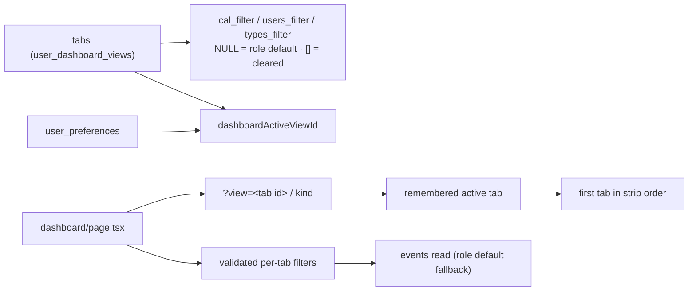

# 1. User preferences & device state

Where does the app remember things? Two scopes with one hard rule:

- **Cross-account preferences follow the user to any device** — they live in
  Postgres: the dashboard's on-demand **Views (tabs)** and their per-tab
  filters (`user_dashboard_views`), the last-active tab, the Parade State
  Calendars/Users filters and the event-search history (`user_preferences`).
- **"Where you are" is device-local** — it lives in one small cookie
  `cloudy2.ui`: the last visited page, the sidebar rail state, the dashboard
  `date`/`month` anchor, the two zooms — the Day/Week (H) hour-slot `zoom`
  and the Month grid's fit-width `monthZoom` — and the Month & Agenda split
  (`dualSplit`).

This document covers the split, the two Postgres tables and their lazy seeding,
the tab-resolution order the dashboard page follows, the reduced cookie and
its writers, and the sign-out path. The dashboard's tab management UI and
filter semantics are described in [`dashboard-views.md`](dashboard-views.md).

## Table of contents

- [1.1 Why the split](#11-why-the-split)
- [1.2 Server-side storage](#12-server-side-storage)
- [1.2.1 Dashboard Views (`user_dashboard_views`)](#121-dashboard-views-user_dashboard_views)
- [1.2.2 Scalar preferences (`user_preferences`)](#122-scalar-preferences-user_preferences)
- [1.2.3 Lazy seeding & concurrency](#123-lazy-seeding--concurrency)
- [1.3 Active-tab resolution](#13-active-tab-resolution)
- [1.4 Per-tab filter storage](#14-per-tab-filter-storage)
- [1.5 The device cookie](#15-the-device-cookie)
- [1.5.1 Stored JSON](#151-stored-json)
- [1.5.2 Versioning & trust](#152-versioning--trust)
- [1.6 Server read: per-key fallback](#16-server-read-per-key-fallback)
- [1.7 Client writers](#17-client-writers)
- [1.8 Parade filters](#18-parade-filters)
- [1.9 Sign-out](#19-sign-out)
- [1.10 Pure helpers & testing](#110-pure-helpers--testing)
- [1.11 File index & related docs](#111-file-index--related-docs)

## 1.1 Why the split

The app is a mobile PWA: a genuine cold start (installed shortcut,
`start_url /`) goes through the service worker, and the launch shell
(`public/loading.html`) must decide *where to go* on the client before any
bundle or network — it cannot query Postgres. So the launch target
(`lastPage`) and the dashboard's period anchor stay in a cookie the inline
shell script can read. Everything the user *configures* — their view tabs,
which calendars/users/types each tab shows, parade filters — is a preference
that should follow the account, so it lives server-side and syncs across
devices (the old cookie carried all of it and was per-device).

## 1.2 Server-side storage

### 1.2.1 Dashboard Views (`user_dashboard_views`)

One row per tab: `userId` (FK `users.id`, cascade), `viewType` (one of the
six renderer kinds — `src/lib/dashboardViews/views.ts`), `name` (user
chosen), `sortOrder` (per-user strip order), the three filter overrides
`calFilter`/`usersFilter`/`typesFilter` (each JSON array or SQL `NULL`, §1.4),
timestamps. Index `(user_id, sort_order)`. Rows cascade-delete with the user.
Duplicates of the same kind are allowed — the row UUID is the tab's identity.

### 1.2.2 Scalar preferences (`user_preferences`)

Singleton row per user (`userId` PK, FK cascade):

- `dashboardActiveViewId` — the last-active tab, FK to
  `user_dashboard_views.id` with `ON DELETE SET NULL` (deleting the active tab
  leaves the pointer null; the next render resolves the first tab).
- `paradeCal` / `paradeUsers` — Parade State filter lists (empty = all
  departments / no user filter; parade has no role-default distinction).
- `searchHistory` — the user's recent event-search queries (most-recent-first,
  deduped, capped at 8) surfaced as "Recent searches" badges in the search
  modal ([`event-search.md`](event-search.md) §1.10).
- timestamps.

### 1.2.3 Lazy seeding & concurrency

There is no registration-time seeding — rows appear on first use:

- `getUserPreferences(userId)` (React-`cache()`d) upserts the
  `user_preferences` row on first read.
- `ensureDefaultDashboardView(userId)` (inside `getDashboardViews`) runs a
  transaction that upserts the preferences row, `SELECT … FOR UPDATE`s it as a
  serialization point, and inserts a single **"Month"** tab only when the user
  has none (pointing `dashboardActiveViewId` at it). The row lock stops two
  racing renders (cold start + an early navigation) from double-inserting two
  identical default tabs.

All queries short-circuit for the **virtual break-glass admin** session
(`session.user.id === "admin"`, no `users` row — the FK/uuid columns can never
match it): it has no stored tabs or prefs, and the dashboard renders a static
single Month tab with view management hidden (`canManageViews = false`).

## 1.3 Active-tab resolution

The dashboard page (`dashboard/page.tsx`) resolves the tab to render, in order:

1. **URL `?view=<tab id>`** — the tab's UUID, wins when it is one of the
 user's tabs. A legacy `?view=<kind>` string (a pre-feature deep link /
 bookmark) maps to the **first tab of that kind**.
2. **Remembered last-active tab** — `user_preferences.dashboardActiveViewId`.
3. **First tab** in strip order.

Pure `resolveActiveTab` (`src/lib/dashboardViews/views.ts`) encodes the order
and is unit-tested. The tab's `kind` then drives the renderer, the skeleton
flavor, anchored/date semantics and the event-title template assignment; its
filters resolve to the fetch (next section). A bare `/dashboard` (no `?view=`)
lands on the remembered/first tab — the URL therefore only carries a tab when
the user has been navigating, and reloads restore the account's last tab.

## 1.4 Per-tab filter storage

Each of a tab's three filters is either:

- **SQL `NULL`** — *role default*, re-resolved on every render (admin: all
  calendars; non-admin: their own department; Users/Event Types: nothing). A
  department added later appears in a `NULL` tab without any edit.
- **An explicit array** — that exact selection, stored verbatim. An explicit
  **`[]`** is a genuine "cleared" selection (an empty grid), distinct from
  `NULL`.

`saveDashboardViewFilters` (a server action) persists the active tab's filters;
the client maps a selection that equals the role default onto `NULL` before
calling it. The filter modal's **Clear** button maps every group to `NULL` (role
default); only a per-group **Deselect All** stores the explicit `[]`. Reads
validate stored ids/names against live calendars/users/types
each render (`dashboard/page.tsx`) and drop stale entries — an all-stale list
degrades to the role default. There are **no `cal`/`users`/`types` URL params**
any more: applying/clearing is an action followed by a server re-render that
refetches the events under the new set. See [`dashboard-views.md`](dashboard-views.md) §1.2.


```mermaid
flowchart LR
 T["tabs (user_dashboard_views)"] --> ROW["cal_filter / users_filter / types_filter<br/>NULL = role default · [] = cleared"]
 PREF["user_preferences"] --> ACTIVE["dashboardActiveViewId"]
 T --> ACTIVE
 PAGE["dashboard/page.tsx"] --> R1["?view=&lt;tab id&gt; / kind"]
 R1 --> R2["remembered active tab"]
 R2 --> R3["first tab in strip order"]
 PAGE --> FILT["validated per-tab filters"]
 FILT --> FETCH["events read (role default fallback)"]
```

## 1.5 The device cookie

**Name**: `cloudy2.ui` (`UI_STATE_COOKIE`, `src/lib/ui/uiState.ts`). Value:
`base64url(JSON)` of `{ v: [major, minor], ...state }`. Attributes:
`path=/; max-age=31536000` (one year). Server components read it with
`decodeUiState`; the client owns writes (`writeUiState`, a read-modify-write).

### 1.5.1 Stored JSON

```jsonc
{
  "lastPage": "/settings/users", // bottom-nav path, incl. /settings sub-tab
  "sidebarCollapsed": false, // desktop sidebar minimized to the icon rail
  "dashboard": { // per-device "where you are"
 "date": "2026-08-21", // day-anchored views
 "month": "2026-08", // Month view
 "zoom": 1.5, // Day/Week (H) hour-slot zoom (slotZoom.ts)
 "monthZoom": 1.5, // Month-grid zoom, fit-width multiplier (monthZoom.ts)
 "dualSplit": 0.6 // Month & Agenda month/agenda width split (dualSplit.ts)
  }
}
```

Everything the pre-feature cookie carried on top of this — the active view,
`pinnedViews`, per-view `views` memory, `filterMode`, the parade section — is
either server-side now or deleted. `normalizeUiState` drops those keys if a
legacy cookie still carries them, and the versioned decode below refuses the
old majors wholesale on first read (see §1.5.2).

### 1.5.2 Versioning & trust

- The cookie is **user-editable** and never trusted: `decodeUiState` is total
  (bad base64, broken JSON, a non-object, or an incompatible **major** — in
  either direction — all return `null`, never throw). Major 3 dropped the v2
  shape (per-view filters + pinned tabs), so every pre-feature cookie decodes
  to `null` once and is re-stamped fresh on the next write.
- Within the current major, a **newer minor** decodes as-is (forward
  compatible, unknown fields dropped by `normalizeUiState`); an **older
  minor** runs the pure `MINOR_MIGRATIONS` chain first. The chain is a
  pass-through for every step so far: v3.1 added `monthZoom`, v3.2 added
  `dualSplit` — an older cookie simply lacks the key and the consumer falls
  back to its default (fit zoom / 60-40 split).
- The cookie is tiny (scalars + short id lists nowhere near the ~4 KiB browser
  cap), so the old overflow-trimming machinery is gone.

## 1.6 Server read: per-key fallback

Contract: **URL param wins; else the remembered value, re-validated; else the
default.**

- **Dashboard** (`dashboard/page.tsx`): `date` — URL wins; a remembered cookie
  `date` anchors the **day views only** (`view !== "month"`); in Month view the
  remembered `month` (else current) drives the read. `zoom` (Day/Week (H)),
  `monthZoom` (Month grid) and `dualSplit` (Month & Agenda) are read from the raw
  cookie and snapped via `clampZoom`/`clampMonthZoom`/`clampDualSplit` before
  first paint (no width jump on relaunch).
  The **active tab is not cookie state** — it resolves server-side (§1.3).
- **`?event=` / `?edit=` deep links** (Google "Edit:" notes, Pinned Events,
  event search) land on the user's active tab + its filters (search carries
  `?view=`); the link's `date` pins the fetched period and `_eventCal` lets the
  server resolve the target event separately (only its calendar, no type/user
  filters), so it opens even when the tab's filters exclude it.
- **Protected layout** (`(protected)/layout.tsx`) reads `sidebarCollapsed`
  from the cookie before first paint and passes it to the shell as initial
  state (no client restore, no flash); the shell persists every toggle back.

## 1.7 Client writers

| Writer | Where | What it persists |
| ------ | ----- | ---------------- |
| `useRememberedPage(pathname)` | `AppShellShell` — every authenticated page | `{ lastPage: pathname }` (incl. `/settings` sub-tabs) |
| sidebar toggle effect | `AppShellShell` | `{ sidebarCollapsed }` on mount + every toggle |
| `usePersistDashboardNav({ date?, month, zoom, monthZoom, dualSplit })` | `DashboardView` | the dashboard    section; `date` is stored only when the URL pins one (day views) or for Month & Agenda, `month`/`zoom`/`monthZoom`/`dualSplit` always |

Server-side writes happen through server actions (the client never writes
Postgres directly): tab CRUD + per-tab filters via `src/lib/dashboardViews`,
`setActiveDashboardView` + `saveParadeFilters` via `src/lib/userPrefs`. The
last-active tab write is fire-and-forget from `switchTab` — the URL carries the
current render, so a failed write just resumes the previous tab on the next
bare load.

## 1.8 Parade filters

Parade State resolves its Calendars/Users filters from
`user_preferences.parade_cal` / `parade_users` (empty = all). The **day is
deliberately not remembered**: a bare `/parade-state` always opens on today;
only an explicit `?date=` wins. Applying/clearing is a server action
(`saveParadeFilters`) followed by a re-render, mirroring the dashboard.

## 1.9 Sign-out

`clearUiState()` expires the cookie; the **Log out** item in `UserMenu` calls
it right before NextAuth's `signOut` so the next account on the device starts
from pure defaults. (Server-side prefs are per-account and follow the user, so
they are not cleared on sign-out.)

## 1.10 Pure helpers & testing

| Helper | Behavior |
| ------ | -------- |
| `src/lib/dashboardViews/views.ts` | kind vocabulary/labels, name sanitization, filter-override normalization, `resolveActiveTab` (URL id → kind string → remembered → first) — unit-tested |
| `src/lib/ui/uiState.ts` | cookie codec (`encodeUiState`/`decodeUiState`), `normalizeUiState`, `mergeUiState`, `resolveLaunchTarget` + route whitelists — unit-tested |
| `src/lib/ui/slotZoom.ts` | `clampZoom` snapping (imported by the cookie normalizer) |
| `src/lib/ui/monthZoom.ts` | `clampMonthZoom` snapping (imported by the cookie normalizer) |
| `src/lib/ui/dualSplit.ts` | `clampDualSplit`/`stepDualSplit` split-ratio math (imported by the cookie normalizer) |

I/O-bound (not unit-tested): the `db` calls in `src/lib/userPrefs` /
`src/lib/dashboardViews` (incl. the transactional seed), the `cookies()` reads
in the pages/layout, and the writer hooks.

## 1.11 File index & related docs

| File | Role |
| ---- | ---- |
| `src/lib/dashboardViews/views.ts` | Kind vocabulary, tab DTO, `resolveActiveTab`, filter normalizers (pure) |
| `src/lib/dashboardViews/queries.ts` | `getDashboardViews` (+ mutex-guarded default seed) |
| `src/lib/dashboardViews/actions.ts` | Tab CRUD + per-tab filter saves |
| `src/lib/userPrefs/queries.ts` | `getUserPreferences` (cached ensure + read) |
| `src/lib/userPrefs/actions.ts` | `setActiveDashboardView`, `saveParadeFilters` |
| `src/lib/events/searchHistoryActions.ts` | `getSearchHistory` / `recordSearchHistory` / `removeSearchHistory` (search-history prefs) |
| `src/db/schema.ts` | `user_dashboard_views`, `user_preferences` |
| `src/app/(protected)/dashboard/page.tsx` | Active-tab resolution + per-tab filter validation + date/month fallback |
| `src/app/(protected)/parade-state/page.tsx` | Parade filters from `user_preferences` |
| `src/app/(protected)/layout.tsx` | `sidebarCollapsed` read before first paint |
| `src/components/AppShellShell.tsx` | `useRememberedPage`, sidebar toggle persist |
| `src/components/UserMenu.tsx` | Sign-out → `clearUiState` |
| `src/lib/ui/uiState.ts` / `uiStateClient.ts` | Cookie model/codec + client writers |
| `src/lib/ui/dualSplit.ts` | Month & Agenda split-ratio levels + clamping (pure) |
| `src/app/(protected)/dashboard/DashboardView.tsx` | Tab strip (+ Add-view button / Manage-views gear), `usePersistDashboardNav`, `switchTab` (+ active-tab action) |

Related docs:

- [`dashboard-views.md`](dashboard-views.md) — the tabs themselves: kinds,
  management UI, per-tab filter semantics, period-preservation rules.
- [`loading-transitions.md`](loading-transitions.md) — plain-box route/cold-start
  loading and the in-page skeletons.
- [`developer-guide.md`](developer-guide.md#112-related-docs) — documentation index.
- `progress-archive.md` — phase write-ups: 1.69 (remembered UI state), 1.71 (user filter
  row narrowing), 1.72 (pinned tabs — replaced by on-demand views), 1.81 (collapsible
  sidebar rail).
