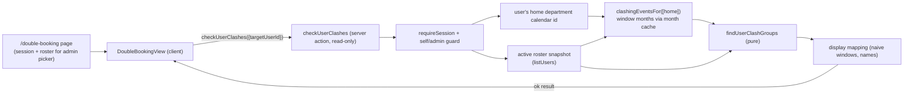

# 1. Double Booking (existing-event clash scan)

- [1.1 Goal](#11-goal)
- [1.2 Entry point & audience](#12-entry-point--audience)
  - [1.2.1 The nav count badge](#121-the-nav-count-badge)
- [1.3 Semantics](#13-semantics)
- [1.4 Why one calendar read suffices](#14-why-one-calendar-read-suffices)
- [1.5 Pipeline](#15-pipeline)
- [1.6 The pure engine (`findUserClashGroups`)](#16-the-pure-engine-finduserclashgroups)
- [1.7 The read-only action (`checkUserClashes`)](#17-the-read-only-action-checkuserclashes)
- [1.8 The page & view](#18-the-page--view)
- [1.9 Edge cases](#19-edge-cases)
- [1.10 Related docs](#110-related-docs)

The wizard's pre-submit advisory ([`event-clashes.md`](event-clashes.md)) answers "will
this _draft_ clash?". This page answers the sibling question for events that already
exist: **"am I double-booked in my upcoming schedule?"** The two share the same
occupancy semantics and engine building blocks, but differ in shape — a scan has no
candidate to compare against; an event is relevant when it _occupies_ the scanned user,
and two relevant events clash simply by overlapping in time.

## 1.1 Goal

A regular user can open **Double Booking** from the bottom nav (or sidebar) and see,
over the next 30 days, every episode where two or more of their existing events keep
them busy at overlapping times — each episode listing the offending events (title,
when, department, `External` badge) and the people every event in the episode occupies
(the user emphasised as `You (name)` when scanning themselves). Advisory and
read-only: it never writes, never audits, and never blocks anything.

## 1.2 Entry point & audience

`/double-booking` is a top-level protected route under the shell, added to the bottom
nav and sidebar for **every** role (regular, KAH-group member, admin) via the shared
`NavItem` list in `AppShellShell.tsx` (all three role arrays include it after
Contacts). The server page only resolves the session identity and — for admins — the
active roster; the scan itself runs client-side through the server action so an admin
can switch targets without a navigation.

- **Regular users** always scan themselves.
- **Admins** get a `NoKeyboardSelect` target picker (never a raw searchable `Select`,
  per the mobile-keyboard rule in `docs/user-picker.md`) over every **active** roster
  user and can scan anyone's schedule. Inactive users are not offered.
- The acting user is emphasised as `You` only when the target **is** the actor, so an
  admin scanning a colleague sees plain name chips.

### 1.2.1 The nav count badge

The Double Booking **nav entry** (bottom nav, sidebar, and collapsed rail) carries a
live amber count pill so a double booking is visible without opening the page. The
pill shows the acting user's _own_ overlap count — exactly `groups.length` the page
reports (no cap: `999` renders as `999`) — only when it is > 0 (a clean scan and a
"no schedule" state both hide it, so a missing pill means "none right now"). The count
rides each surface's `aria-label`, never the visible label.

It is fetched by `AppShellShell` (which stays mounted across SPA navigations, so there
is **no per-navigation recompute**) via the same read-only `checkUserClashes({})`
action, once on mount in the background, again on tab refocus, and after every
successful create/update/delete: `DashboardView` dispatches the new
`cloudy2:events-changed` window event (`src/lib/ui/eventChanges.ts`) from the same two
post-mutation completion points that already dispatch the pinned-events event, and the
shell re-runs the scan trailing-debounced (~400ms) so a save burst is one recompute.
Best-effort, like the pinned-events ticker: a failure keeps the last count. Each
refresh reuses the action's warm month cache where possible, so it is cheap (§1.4).

## 1.3 Semantics

"Occupies" is exactly the wizard's definition (see [event-clashes.md §1.2 Semantics]
(event-clashes.md#12-semantics) — same `busyUsersOfEvent`): creator, each tagged user,
every **active** member of each tagged department (a department-level event is an event
for everyone within), and external / people-less events occupy every active member of
the department calendar their copy sits on. An event that does **not** occupy the scanned user is irrelevant even when it
overlaps — e.g. a colleague's separate absence on the shared department calendar never
counts against the user.

A **double booking** for the user is two or more occupying events whose half-open
instant windows overlap (`instantWindowsOverlap`; back-to-back events do not clash).
Reports are maximal **connected components** of the pairwise-overlap graph among
occupying events — an overlap chain `A↔B↔C` is one report even when `A` and `C` do not
touch each other. Components of size one are dropped. The shared chips of a report are
the roster users occupied by _every_ event in it (a subset always containing the
scanned user).

## 1.4 Why one calendar read suffices

The same data-model invariant that bounds the wizard advisory (event-clashes.md §1.4)
bounds the scan: every event that occupies a user carries a copy on that user's own
department calendar — creator → own department, tagged user → their department, tagged
department → that department — and an external event occupies (and lives on) the
members' own calendar. Nothing that can occupy the scanned user exists outside their
home department calendar, so reading **only that calendar** over the window and letting
`busyUsersOfEvent` decide who each copy occupies is complete. Cross-department grants
play no role (a granted-but-not-a-member outsider is never occupied), and the read
never touches another department.

## 1.5 Pipeline

1. The page (`src/app/(protected)/double-booking/page.tsx`, a server component)
   resolves the session and, for admins, loads the active roster for the target
   picker, then renders `DoubleBookingView`.
2. On mount (and on every target change / Retry) the view calls the server action
   `checkUserClashes({ targetUserId })` — the same cancelled-flag + `attempt` pattern
   `EventClashCheck` uses, with the loading/error views derived from the
   request/outcome pair (state is only set in the async callbacks, so the
   `react-hooks/set-state-in-effect` rule stays satisfied).
3. The action guards: `requireSession()`; a non-admin requesting a user other than
   themselves is refused.
4. The scan window is **today → +30 days**, inclusive dates in the UTC+8 wall clock:
   `[parseNaiveToInstant(today + " 00:00:00"), +30 days)` — a half-open instant window
   (`USER_CLASH_SCAN_DAYS = 30`, exported from `clashQuery.ts`). An event that started
   before today but still overlaps the window is included.
5. `clashingEventsFor([homeDepartment.id], from, to)` reads the overlapping months
   through the layered month cache (`clashWindowMonths` → `getCachedMonthEventsForCalendars`,
   never raw `listEvents`), dedupes by (calendar row, Google id), and shapes each item
   with its parsed notes people — the exact reader the wizard advisory uses.
6. `findUserClashGroups` collapses logical copies, keeps events that occupy the
   target, and computes the overlap components.
7. The action maps the groups to display entries (per-event title / calendar /
   inclusive-naive window via the shared `conflictWindowNaive`, plus the shared-people
   names) and returns them with the target id/name, the covered dates, and the acting
   user's id (for the `You` emphasis).

## 1.6 The pure engine (`findUserClashGroups`)

`findUserClashGroups({ targetUserId, events, activeUsers })` lives in
`src/lib/events/clashes.ts` next to `computeClashes` and is kept I/O-free and
unit-tested (`clashes.test.ts`). Steps:

1. Guard: the target must be on the **active** roster, else nothing is scanned.
2. For each event compute `busyUsersOfEvent`; drop events that do not occupy the
   target. Multiple copies of the same logical event (same group id) collapse into one
   slot carrying the union of their occupied users (belt-and-braces: a single-calendar
   read already yields at most one copy per group).
3. Union-find over the pairwise `instantWindowsOverlap` graph among the survivors.
4. Each component of size ≥ 2 is one report: its events sorted chronologically (then
   calendar/title), and its shared people = the roster users busy in **every** member
   event (always includes the target), sorted.

## 1.7 The read-only action (`checkUserClashes`)

`checkUserClashes(request: { targetUserId?: string })` in `clashActions.ts` (a
`"use server"` module) returns a `UserClashCheckResult`:

- `{ ok: false, error }` for failures (including a non-admin asking for someone else).
- `{ ok: true, currentUserId, targetUserId, targetName, rangeStartDate,
rangeEndDate, groups, skipReason }` where `skipReason` is:
  - `"no-department"` — the target belongs to no department calendar (e.g. an
    email-less bootstrap admin), so nothing can occupy them;
  - `"no-active-user"` — the requested target is not on the active roster (only
    reachable through a stale admin pick); or
  - `null` — a real scan ran (possibly with zero groups).

Each `groups[]` entry is `{ events: EventClashEntry[] }` — the same `EventClashEntry`
shape the wizard advisory returns, so the shared `clashUi.tsx` chips and when-labels
render both. The per-event `affected` is the report's shared-people list.

## 1.8 The page & view

- **`page.tsx`** — server component: `requireSession()`; admins additionally load and
  shape the active roster (`id`, `name`, department) for the picker. Regular users get
  an empty list and never fetch the roster.
- **`DoubleBookingView.tsx`** — client component. The header is a responsive flex row
  (`.c2-db-head` in `globals.css`): title + a target-aware subtitle on the left, and
  the admin-only target `NoKeyboardSelect` on the right — **full column width on
  mobile**, right-aligned at a fixed 340px from the 40em desktop band on (a pure-CSS
  switch, so there is no `useMediaQuery` first-frame shift). Content states: skeleton +
  `LoadingStatus` while loading (mirrors a result card); an error card with Retry; an
  `EmptyState` for `no-department` / `no-active-user`; otherwise one amber `Paper` per
  overlap report — a "You're / {name} is double-booked by N overlapping events"
  heading, the shared-people chips (`ClashAffectedChips`), and one row per event
  (title, `External` badge, when · department). Every real-scan outcome opens with a
  polite `role="status"` summary line (counts + covered dates); clashes end with a
  muted footnote ("Only events that occupy {you/name} are compared… warnings only").
- **`loading.tsx`** — route skeleton in the standard shape (`LoadingStatus` + shaped
  `Skeleton`s inside `PageContainer`).

Shared clash UI (`conflictWhen`/`eventWhenLabel` and `ClashAffectedChips`) was lifted
out of `EventClashCheck.tsx` into `src/components/clashUi.tsx` so the wizard panel and
this page render identically from one source.

## 1.9 Edge cases

- **An event that spans the scan boundary** (started before today, or running past
  day 30) is included whenever it overlaps the window — the user is genuinely busy
  during part of the scan.
- **Two clash episodes on the same day** (morning pair, afternoon pair) are two
  reports; a **chain** `A↔B↔C` is one.
- **Whole-department events** occupy every active member, so they clash with a member's
  personal event on the shared calendar — exactly the schedule-view rule.
- **External events** on the user's calendar occupy the user and count like any other
  event; they are labelled `External` and have no `eventId`, so they never collapse.
- **Target with no department / deactivated** produces no scan and a specific notice
  rather than a misleading "no double bookings".
- **Roster changes** (someone deactivated mid-scan) are handled by the active-only
  filter in the engine; the picker is rebuilt from the roster on each page load.
- **Non-admin tampering** with the `targetUserId` is refused by the action — self-only.

## 1.10 Related docs

- [`event-clashes.md`](event-clashes.md) — the occupancy semantics, the shared
  `busyUsersOfEvent`/`instantWindowsOverlap` engine, and the wizard pre-submit check
  this page reuses.
- [`event-mutations.md`](event-mutations.md) — the copy model that guarantees the
  home-calendar invariant (§1.4).
- [`user-guide.md`](user-guide.md) / [`admin-guide.md`](admin-guide.md) — how each
  audience reaches and uses the page.
