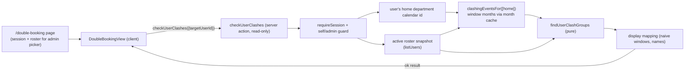

# 1. Double Booking (existing-event clash scan)

- [1.1 Goal](#11-goal)
- [1.2 Entry point & audience](#12-entry-point--audience)
  - [1.2.1 The nav count badge](#121-the-nav-count-badge)
- [1.3 Semantics](#13-semantics)
- [1.4 Why one calendar read suffices](#14-why-one-calendar-read-suffices)
- [1.5 Pipeline](#15-pipeline)
- [1.6 The pure engine (`findUserClashGroups`)](#16-the-pure-engine-finduserclashgroups)
- [1.7 The read-only action (`checkUserClashes`)](#17-the-read-only-action-checkuserclashes)
- [1.8 The page & view](#18-the-page--view)
- [1.9 Edge cases](#19-edge-cases)
- [1.10 Related docs](#110-related-docs)

The wizard's pre-submit advisory ([`event-clashes.md`](event-clashes.md)) answers "will
this _draft_ clash?". This page answers the sibling question for events that already
exist: **"am I double-booked in my upcoming schedule?"** The two share the same
occupancy semantics and engine building blocks, but differ in shape — a scan has no
candidate to compare against; an event is relevant when it _occupies_ the scanned user,
and two relevant events clash simply by overlapping in time.

## 1.1 Goal

A regular user can open **Double Booking** from the bottom nav (or sidebar) and see,
over the next 30 days, every episode where two or more of their existing events keep
them busy at overlapping times — each episode listing the offending events (title,
when, department, `External` badge) and the people every event in the episode occupies
(the user emphasised as `You (name)` when scanning themselves). Advisory and
read-only: it never writes, never audits, and never blocks anything.

## 1.2 Entry point & audience

`/double-booking` is a top-level protected route under the shell, added to the bottom
nav and sidebar for **every** role (regular, KAH-group member, admin) via the shared
`NavItem` list in `AppShellShell.tsx` (all three role arrays include it after
Contacts). The server page only resolves the session identity and — for admins — the
active roster; the scan itself runs client-side through the server action so an admin
can switch targets without a navigation.

- **Regular users** always scan themselves.
- **Admins** get the shared **`UserSelectModal` badge dialog in `single` mode** (a
  `NoKeyboardSelect`-style dropdown would violate the large-option-list rule in
  `docs/user-picker.md`): roster grouped into per-department badge sections with the
  shortname as an extra search term. Picking one person (Confirm disabled until a
  pick) switches the scan target. Inactive users are not offered.
- The acting user is emphasised as `You` only when the target **is** the actor, so an
  admin scanning a colleague sees plain name chips.

### 1.2.1 The nav count badge

The Double Booking **nav entry** (bottom nav, sidebar, and collapsed rail) carries a
live amber count pill so a double booking is visible without opening the page. The
pill shows the acting user's _own_ overlap count — exactly `groups.length` the page
reports (no cap: `999` renders as `999`) — only when it is > 0 (a clean scan and a
"no schedule" state both hide it, so a missing pill means "none right now"). The count
rides each surface's `aria-label`, never the visible label; the bottom-nav/sidebar
surface also carries it as a `title`, so sighted mouse users read the same
"Double Booking — N double bookings" wording the screen reader announces.

It is fetched by `AppShellShell` (which stays mounted across SPA navigations, so there
is **no per-navigation recompute**) via the same read-only `checkUserClashes({})`
action, once on mount in the background, again on tab refocus, and after every
successful create/update/delete: `DashboardView` dispatches the new
`cloudy2:events-changed` window event (`src/lib/ui/eventChanges.ts`) from the same two
post-mutation completion points that already dispatch the pinned-events event, and the
shell re-runs the scan trailing-debounced (~400ms) so a save burst is one recompute.
Best-effort, like the pinned-events ticker: a failure keeps the last count. Each
refresh reuses the action's warm month cache where possible, so it is cheap (§1.4).

## 1.3 Semantics

"Occupies" is exactly the wizard's definition (see [event-clashes.md §1.2 Semantics]
(event-clashes.md#12-semantics) — same `busyUsersOfEvent`): creator, each tagged user,
every **active** member of each tagged department (a department-level event is an event
for everyone within), and external / people-less events occupy every active member of
the department calendar their copy sits on. An event that does **not** occupy the scanned user is irrelevant even when it
overlaps — e.g. a colleague's separate absence on the shared department calendar never
counts against the user. **Informational** events (whose type has *Exclude from conflict
checks* enabled) occupy nobody, so they are dropped the same way.

A **double booking** for the user is two or more occupying events whose half-open
instant windows overlap (`instantWindowsOverlap`; back-to-back events do not clash).
Half-day (`timeOption = "half"`) events are compared at half-day resolution — the
(AM)/(PM) markers stored in the notes map to `00:00`–`12:00` / `12:00`–`24:00`
UTC+8 (`halfDayRange`, `datetime.ts`), so a morning leave does not clash with an
afternoon event on the same day, but two morning events do. Reports are maximal
**connected components** of the pairwise-overlap graph among
occupying events — an overlap chain `A↔B↔C` is one report even when `A` and `C` do
not touch each other. Components of size one are dropped. The shared chips of a report are
the roster users occupied by _every_ event in it (a subset always containing the
scanned user).

## 1.4 Why one calendar read suffices

The same data-model invariant that bounds the wizard advisory (event-clashes.md §1.4)
bounds the scan: every event that occupies a user carries a copy on that user's own
department calendar — tagged user → their department, tagged department → that
department (an organizer who participates counts as a tagged user) — and an external
event occupies (and lives on) the
members' own calendar. Nothing that can occupy the scanned user exists outside their
home department calendar, so reading **only that calendar** over the window and letting
`busyUsersOfEvent` decide who each copy occupies is complete. Cross-department grants
play no role (a granted-but-not-a-member outsider is never occupied), and the read
never touches another department.

## 1.5 Pipeline

1. The page (`src/app/(protected)/double-booking/page.tsx`, a server component)
 resolves the session and, for admins, loads the active roster for the target
 picker, then renders `DoubleBookingView`.
2. On mount (and on every target change / Retry) the view calls the server action
 `checkUserClashes({ targetUserId })` — the same cancelled-flag + `attempt` pattern
 `EventClashCheck` uses, with the loading/error views derived from the
 request/outcome pair (state is only set in the async callbacks, so the
 `react-hooks/set-state-in-effect` rule stays satisfied).
3. The action guards: `requireSession()`; a non-admin requesting a user other than
 themselves is refused.
4. The scan window is **today → +30 days**, inclusive dates in the UTC+8 wall clock:
 `[parseNaiveToInstant(today + " 00:00:00"), +30 days)` — a half-open instant window
 (`USER_CLASH_SCAN_DAYS = 30`, exported from `clashQuery.ts`). An event that started
 before today but still overlaps the window is included.
5. `clashingEventsFor([homeDepartment.id], from, to)` reads the overlapping months
 through the layered month cache (`clashWindowMonths` → `getCachedMonthEventsForCalendars`,
 never raw `listEvents`), dedupes by (calendar row, Google id), and shapes each item
 with its parsed notes people — the exact reader the wizard advisory uses.
6. `findUserClashGroups` collapses logical copies, keeps events that occupy the
 target, and computes the overlap components.
7. The action maps the groups to display entries (per-event title / calendar /
 inclusive-naive window via the shared `conflictWindowNaive`, plus the shared-people
 names) and returns them with the target id/name, the covered dates, and the acting
 user's id (for the `You` emphasis).

## 1.6 The pure engine (`findUserClashGroups`)

`findUserClashGroups({ targetUserId, events, activeUsers })` lives in
`src/lib/events/clashes.ts` next to `computeClashes` and is kept I/O-free and
unit-tested (`clashes.test.ts`). Steps:

1. Guard: the target must be on the **active** roster, else nothing is scanned.
2. For each event compute `busyUsersOfEvent`; drop events that do not occupy the
 target. Multiple copies of the same logical event (same group id) collapse into one
 slot carrying the union of their occupied users (belt-and-braces: a single-calendar
 read already yields at most one copy per group).
3. Union-find over the pairwise `instantWindowsOverlap` graph among the survivors.
4. Each component of size ≥ 2 is one report: its events sorted chronologically (then
 calendar/title), and its shared people = the roster users busy in **every** member
 event (always includes the target), sorted.

## 1.7 The read-only action (`checkUserClashes`)

`checkUserClashes(request: { targetUserId?: string })` in `clashActions.ts` (a
`"use server"` module) returns a `UserClashCheckResult`:

- `{ ok: false, error }` for failures (including a non-admin asking for someone else).
- `{ ok: true, currentUserId, targetUserId, targetName, rangeStartDate,
rangeEndDate, groups, skipReason }` where `skipReason` is:
  - `"no-department"` — the target belongs to no department calendar (e.g. an
 email-less bootstrap admin), so nothing can occupy them;
  - `"no-active-user"` — the requested target is not on the active roster (only
 reachable through a stale admin pick); or
  - `null` — a real scan ran (possibly with zero groups).

Each `groups[]` entry is `{ events: EventClashEntry[] }` — the same `EventClashEntry`
shape the wizard advisory returns, so the shared `clashUi.tsx` chips and when-labels
render both. The per-event `affected` is the report's shared-people list. Each entry
also carries display/geometry fields the Double Booking page uses (and the wizard
ignores): `eventId` / `calendarId` (the row deep-link target), `external`, `typeName`
/ `typeShortname` / `rawTitle` (type-first labelling), `color` (the event type's
color, else the department fallback), `occupiesFullDay`, `timeOption` /
`startAmPm` / `endAmPm`, and `effectiveStartNaive` / `effectiveEndNaive` — the
half-day-aware occupancy window the timeline positions bars by (the stored
`startNaive` / `endNaive` remain the inclusive display window).

## 1.8 The page & view

- **`page.tsx`** — server component: `requireSession()`; admins additionally load and
  shape the active roster (`id`, `name`, `shortname`, department) for the picker.
  Regular users get an empty list and never fetch the roster.
- **`DoubleBookingView.tsx`** — client component. The header is a responsive flex row
  (`.c2-db-head` in `globals.css`): title + a short target-aware subtitle on the left,
  and the admin-only target control on the right — **full column width on mobile**,
  content-sized from the 40em desktop band on (a pure-CSS switch, so there is no
  `useMediaQuery` first-frame shift). The control follows the event form's Invited
  Attendees pattern: a "Check another person" label + a light **Select** button that
  opens the `UserSelectModal` badge dialog (`single` mode; department sections,
  shortname search), plus a chip for the current target (`Name · Department`) or a
  dimmed "Checking your own schedule" when scanning self. Content states: skeleton +
  `LoadingStatus` while loading (mirrors a result card); an error card with Retry; an
  `EmptyState` for `no-department` / `no-active-user`; a single actionable
  `EmptyState` (with an "Open calendar" link) for a clean scan.
- **Result layout — visual, time-first and day-grouped.** A real scan opens with one
  concise `role="status"` line (`N double bookings in the next 30 days`), then a
  **30-day overview strip** (`ClashDayStrip`): one cell per day from the scan range
  with its conflict count; busy cells are tappable and scroll to that day's section
  (`jumpToDay`). Reports are then bucketed into consecutive days (an episode is filed
  under its first day) behind a short day heading (`Today` / `Tomorrow` / `Mon 14 Sep`,
  via `clashDayLabel`).
- **The conflict timeline.** Each day renders one amber **`ClashCard`** per overlap
  report, collapsed by default. Its always-visible visual is a **`ClashTimeline`**
  (`src/components/clashTimeline.tsx`): a time axis with a colored bar per event —
  positioned and sized by the entry's effective window and lane-packed by greedy
  interval partitioning (`buildClashTimeline`, `clashTimeline.ts`) — plus shaded
  overlap regions (a tinted band with dashed edges, theme-aware), and a separate band
  for whole-day events. Bars are colored by event type (department fallback) with a
  **`light-dark()`** palette (pastel fill + dark text in light mode, deep fill + light
  text in dark mode), and each bar opens the in-place detail modal. The heading leads with
  the episode's **time** (`9:00 AM – 5:00 PM`, `All day`, or a date range —
  `clashEpisodeTimeLabel`; a group mixing a whole-day and a timed event names both,
  e.g. `9:00 AM – 10:00 AM · All day`) and a muted `N events` count (prefixed
  `{name} ·` for an admin scan); the old titles-preview line is gone. The 30-day strip
  cells are theme-aware too (`light-dark()`). The same `ClashTimeline` powers the
  wizard's review-step advisory ([event-clashes.md](event-clashes.md) §1.6), with the
  candidate as a distinct `brand` "This event" bar and inert (non-linking) bars.
- **Template-driven labels.** Each event's bar/row label is rendered server-side in
  `checkUserClashes` through the admin's **title-template engine** — the
  `doubleBooking` assignment target when set, else Master (`clashLabelFor`,
  `src/lib/events/clashLabel.ts`; Settings → Templates → Assign templates). So admins
  choose exactly which fields show (type, description, people, departments, location,
  time) and how they are decorated, and the clash report reads like the calendar
  titles. When the recipe renders nothing, it falls back to the raw title, then the
  stored summary.
- **In-place detail modal.** Tapping a bar or a row opens that event's details
  **without leaving the page**. The modal opens **instantly** with a shaped skeleton
  (`EventDetail`'s `loading` prop; no spinner, no dim — the skeleton-only rule) and
  zooms out of the tapped element (`originRect` captured from the bar/row), then
  `DoubleBookingView` lazily calls the read-only `getClashEventDetail` server action
  (guarded like the scan — a non-admin may only resolve the target's own home
  calendar), which reads the copy through the sanctioned month cache
  (`fetchRangeEvents`) and returns the full `CalendarEvent` plus the `peopleNames` /
  `calendarNames` / `myActiveDepartmentIds` the shared `EventDetail` needs. The
  details then fade in (`content-enter`, after a ~150 ms minimum skeleton hold). The
  modal renders in **read-only mode** (`readOnly`): it hides Edit/Duplicate/Delete and
  offers a single **"Open in calendar"** button — the only navigation on the page, an
  explicit secondary action via `buildEventDeepLink`. `EventDetail` stays mounted
  (toggling `event`) so the close shrink-back animation plays; a request token
  supersedes an in-flight fetch on close/re-tap, and a failure closes the modal with a
  red toast. The row/bar label uses the entry's `displayLabel` as the modal title.
- **Rows.** Tapping the heading expands the per-event rows: the same rendered label
  primary, the stored composite title demoted to a muted line, then the date-free time
  · department (`clashEntryTimeLabel`). Each row carries an explicit trailing
  affordance — an eye `View` — with a hover tint and focus ring (`.c2-clash-row`), so
  the tap target is obvious. The wizard's inert rows show neither and keep the stored
  title primary. `ClashAffectedChips` renders beneath the heading only for people
  *other than* the scanned target (`omitUserId`) — a self-scan therefore shows no lone
  `You` chip. The cards are not their own live regions (`live={false}`): the single
  status line announces the count, so a many-report scan is one concise announcement,
  not N.
- **Display helpers** are pure and unit-tested in
  `src/lib/events/clashDisplay.ts` (`clashDisplay.test.ts`): day keys/labels, the
  episode/strip builders, type-first labels, date-free time labels, and axis ticks (a
  same-day timed range collapses the repeated date). The shared `clashWhenLabel`
  replaces the old `eventWhenLabel`, so the wizard's rows get the same tighter labels.
  Timeline geometry lives in `src/lib/events/clashTimeline.ts` (`clashTimeline.test.ts`).
- **`loading.tsx`** — route skeleton in the standard shape (`LoadingStatus` + shaped
  `Skeleton`s inside `PageContainer`).

Shared clash UI was lifted out of `EventClashCheck.tsx` so the wizard panel and
this page render identically from one source: the chips and labels (incl. the
`clashTitlesPreview` teaser builder) live in
`src/components/clashUi.tsx`, and the collapsible card shell (`ClashCard`) plus
the per-event row (`ClashEventRow`) live in `src/components/clashCards.tsx`. The
card's polite live-region announcement is scoped to the always-visible summary
row (never the expandable detail), so a fresh scan announces just the concise
headings; expansion is a user action and is never re-announced.

## 1.9 Edge cases

- **An event that spans the scan boundary** (started before today, or running past
  day 30) is included whenever it overlaps the window — the user is genuinely busy
  during part of the scan.
- **Two clash episodes on the same day** (morning pair, afternoon pair) are two
  reports; a **chain** `A↔B↔C` is one.
- **Whole-department events** occupy every active member, so they clash with a member's
  personal event on the shared calendar — exactly the schedule-view rule.
- **External events** on the user's calendar occupy the user and count like any other
  event; they are labelled `External` and have no `eventId`, so they never collapse.
- **Informational events** (type has *Exclude from conflict checks* enabled) are
  ignored: they occupy nobody, so they never form or join a double-booking report.
- **Target with no department / deactivated** produces no scan and a specific notice
  rather than a misleading "no double bookings".
- **Roster changes** (someone deactivated mid-scan) are handled by the active-only
  filter in the engine; the picker is rebuilt from the roster on each page load.
- **Non-admin tampering** with the `targetUserId` is refused by the action — self-only.

## 1.10 Related docs

- [`event-clashes.md`](event-clashes.md) — the occupancy semantics, the shared
  `busyUsersOfEvent`/`instantWindowsOverlap` engine, and the wizard pre-submit check
  this page reuses.
- [`event-mutations.md`](event-mutations.md) — the copy model that guarantees the
  home-calendar invariant (§1.4).
- [`user-guide.md`](user-guide.md) / [`admin-guide.md`](admin-guide.md) — how each
  audience reaches and uses the page.
