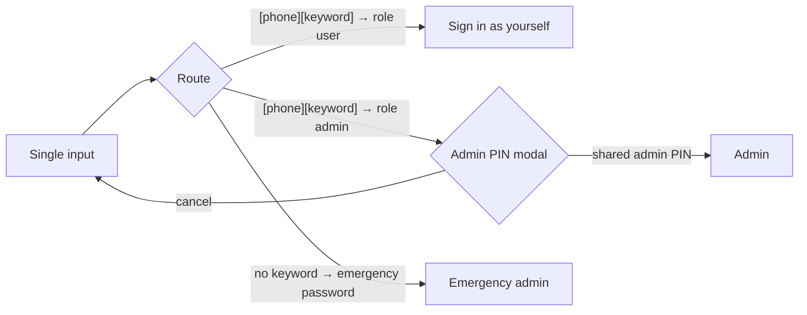

# 1. User guide

Cloudy2 is the company's cloud calendar: who is out, where, and when — plus parade
state, contacts, and KAH status. This guide is for everyday users; administrators
should also read [`admin-guide.md`](admin-guide.md).

## Table of contents

- [1.1 Signing in](#11-signing-in)
- [1.2 Getting around](#12-getting-around)
- [1.3 The calendar](#13-the-calendar)
- [1.4 Events: create, view, edit](#14-events-create-view-edit)
- [1.5 Pinned events](#15-pinned-events)
- [1.6 Quick links](#16-quick-links)
- [1.7 Parade state](#17-parade-state)
- [1.8 Contacts](#18-contacts)
- [1.9 KAH status](#19-kah-status)
- [1.10 Install as an app & offline use](#110-install-as-an-app--offline-use)
- [1.11 Good to know](#111-good-to-know)

## 1.1 Signing in

One input field, no username.

- **Regular user** — type your phone number immediately followed by the login
  keyword your administrator gives you, no spaces: `91234567leave`.
- **Admin** — type your phone + keyword the same way; the app then asks for the
  shared admin PIN. The emergency admin instead types the emergency password alone
  (no keyword).

## 1.2 Getting around

| Page | What it's for |
| ---- | ------------- |
| **Calendar** | All events across departments — the main screen |
| **Parade State** | Today's roll call by department, with attendance mode |
| **Contacts** | Phone list with search and VCF export |
| **KAH Status** | Past & future KAH breaches for your groups over ±3 months, with resolved/active/upcoming status (shown when you are in a KAH group; admins always see it with all groups) |
| **Settings** | Admin only |

On phones the pages sit in the bottom navigation bar; on desktop they move to the
left sidebar (which can collapse to an icon rail). The header carries the
**Pinned events** button (with an amber count badge) and the light/dark toggle.

## 1.3 The calendar

### 1.3.1 Views

Five views show the same calendar data; each view keeps its own filters. Switch
them with the tabs above the grid:

| View | Shows |
| ---- | ----- |
| **Month** | The whole month grid; bars span multiple days |
| **Week (H)** | One week, hour-by-hour, one row per person/department |
| **Week (D)** | One week as day columns — events as spanning banners per row |
| **Day** | A single day, hour-by-hour |
| **Agenda** | A day-by-day list |

- **Pin tabs** you use most (⋮ menu → **Pin Tab**) — pinned views become quick tabs.
- Wide desktop grids pan horizontally: drag with the mouse, or use the round arrow
  buttons at the grid's edges.
- **Fullscreen** (⋮ menu → **Enter fullscreen**, under Pin Tab) hides all app
  chrome (and the browser UI where supported) for a wall-display calendar; press
  Esc or use ⋮ menu → **Exit fullscreen** to go back.

### 1.3.2 Dates & filters

- Date-nav arrows move day/week/month; the ⋮ menu has **Today** and **Select date**.
- The **filter button** (funnel icon, with a badge when filters are active) opens
  the filter dialog: Calendars/departments and Users (searchable badge list grouped
  by department) up front, Event Types behind a **Show** toggle, and a **Myself**
  one-tap (your own events). **Reset** clears them (back to your role default).
- **Filters are per view** — each of Month / Week (H) / Week (D) / Day / Agenda
  remembers its own Calendars/Users/Event Types selection, and the dialog notes
  *"These filters apply to {view} only"*. Setting a filter on one view never
  affects the others; clearing one view's filters never resets the rest.
  An untouched view shows your role default (admin: all departments). Filtering
  is not tied to access: everyone can always select **every** department
  calendar, whatever department they belong to or extra access they hold.
- **Force refresh** (⋮ menu) bypasses the server cache and pulls the latest from
  Google Calendar. The muted *Saved · HH:MM* label shows when you're looking at a
  cached copy.

Events created directly in Google Calendar (outside Cloudy2) show an **External**
badge; admins can still edit them.

## 1.4 Events: create, view, edit

### 1.4.1 Creating an event

Tap the **+** button, then walk the wizard:

1. **Type** — the event type, listed under its category (types without a category
   appear at the bottom under "Ungrouped"); each type can restrict the steps below.
2. **Time** — Start & End date pickers plus tap-select time dropdowns (15-minute
   steps), or Full day / Half day (AM/PM) options.
3. **Location** — one category: **In camp**, **Out of camp**, or **Overseas**
   (the type decides which are allowed), plus an optional specific place. Overseas
   events are what KAH groups count as "away". Some event types **lock their
   location** (set by your admin) — for those this step is skipped and the event is
   saved with the locked category automatically.
4. **Invited Attendees** — invite individual users and/or tag whole departments;
   the event appears on everyone's calendars. The **Pin this event** switch puts it
   in the Pinned Events panel (§1.5).
5. **Remarks** — the free-text description.
6. **Review** — a summary with a live calendar-title preview, then Create.

Tapping outside the wizard minimizes it to a floating bubble — your draft survives
until you resume or discard it.

### 1.4.2 Viewing and editing

Tap any event for its details. If you created it (or you're an admin) you get
**Edit**, **Duplicate**, and **Delete**. Editing prefills the wizard with the
original details; deleting asks for confirmation and removes every department copy.

## 1.5 Pinned events

The pill at the header's left edge is the **pinned-events ticker**: it rotates
through your pinned events' titles (one every few seconds) behind an amber `1/N`
chip that tells you how many events are pinned and which one is on screen. Tap it
to open a panel listing every explicitly-pinned upcoming event (today → 3 months
out, all departments, ignoring your current filters). Tap one there to jump
straight to it on the calendar and open its details.

Events get pinned through the **Pin this event** switch in the wizard (§1.4.1).
The ticker and its count refresh after every create/update/delete; with nothing
pinned the pill shows a plain "Pinned events" label.

## 1.6 Quick links

When your admin sets up quick links, an amber **link button** appears beside the
**+** button (phone) or as a "Quick links" chip in the calendar header (desktop).
It opens a menu of external shortcuts — each opens in a new tab.

## 1.7 Parade state

A roll-call view of who is where **today**, grouped by department (including
sub-departments, with aggregated counts):

- Each person shows their status for the day (out-of-camp/overseas events are
  highlighted).
- The day never auto-drifts: Parade State always opens on today; navigate days
  explicitly with the arrows or date picker.
- **Attendance mode** (clipboard icon): tick the people physically present, then
  copy a formatted attendance report to the clipboard. Attendance checks are stored
  on your device per date; **Reset attendance** clears them.

## 1.8 Contacts

Searchable phone list (name, shortname, or number). Copy a number with one tap, or
download the currently-filtered list as a `.vcf` file to import into your phone.

## 1.9 KAH status

Visible only when you belong to a KAH (Key Appointment Holder) group (admins
always see it too, with all groups). It answers "did my group breach recently,
or will it soon?" over the **past and next 3 months**:

- Each **breach period** — consecutive days where the group's in-country
  percentage fell below its requirement — is listed once, with its date range,
  day count, lowest in-country % during the run, and the members who were away
  (tagged on Overseas events).
- Each period is marked **Resolved** (green — it ended before today), **Active**
  (red — it includes today), or **Upcoming** (amber — it starts in the future).
  A "…" at a period's edge means it runs past the 3-month scan window.
- Groups with no breaches in the window are listed as **All clear**.

## 1.10 Install as an app & offline use

Cloudy2 is a PWA — install it (browser menu → Install / Add to Home screen) for a
full-screen app icon.

- **Instant open:** an installed Cloudy2 opens your last-saved calendar immediately,
  then refreshes in the background.
- **Offline:** previously viewed pages stay available. Offline copies carry an amber
  offline banner and a *Saved · HH:MM* stamp; any navigation falls back to your most
  recently saved view. Offline is **read-only** — creating or editing shows an error
  until you're back online.
- Signing out clears the saved pages.

## 1.11 Good to know

- **Cloudy2 remembers where you left off** — your last page, view, date, and filters
  come back on relaunch (the day on Parade State is the exception: it always opens
  on today).
- **Event titles are templated** by your admin — what you type in Remarks is the
  description; the calendar title combines it with type, people, and location.
- **Two themes** — the sun/moon toggle in the header switches light/dark.
- **Loading style** — pages show skeletons, never dimmed content; buttons show their
  own spinner while working.
- **Modern browsers only** — Cloudy2 needs Safari 16.4 (iOS 16.4) or newer on Apple
  devices, or a current Chrome / Edge / Firefox (version 111+, i.e. from 2023). On
  older browsers the login page shows a short "unsupported browser" notice instead of
  the sign-in form — updating your browser or device is the only way to sign in.
