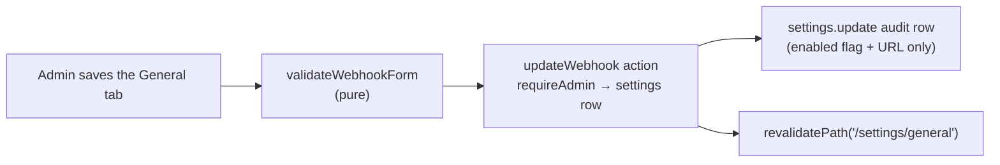
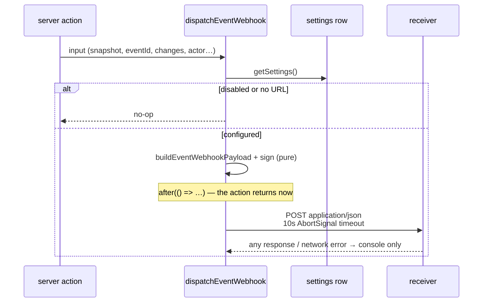

# 1. Event webhooks: notifying external systems

When an event is created, modified, or deleted inside the app, a JSON notification is
POSTed to a single admin-configured webhook URL so external systems can mirror the
change. The payload carries **everything the event form collects** — rendered title,
raw description, type, times, out-of-camp/location, departments, invitees, creator —
with display names resolved exactly like the audit log. Delivery is fire-and-forget:
it never delays or fails the mutation. What an event *is* lives in
[`event-lifecycle.md`](event-lifecycle.md); the mutations that trigger the webhook live
in [`event-mutations.md`](event-mutations.md).

## Table of contents

- [1.1 Goals & non-goals](#11-goals--non-goals)
- [1.2 Configuration](#12-configuration)
- [1.3 Payload](#13-payload)
- [1.4 Delivery & security](#14-delivery--security)
- [1.5 Integration points](#15-integration-points)
- [1.6 Pure helpers & testing](#16-pure-helpers--testing)
- [1.7 File index & related docs](#17-file-index--related-docs)

## 1.1 Goals & non-goals

**Goals**

- External systems learn about every successful in-app event create/update/delete with
  all user-configurable fields included — no follow-up call into cloudy2 required.
- Updates show what changed (`changes` with `[before, after]` pairs) plus the full
  resulting state, mirroring the audit log's diff.
- A slow or broken receiver can never delay a mutation response or fail the action.

**Non-goals**

- No retry queue or delivery history: failed deliveries are logged to the console and
  dropped (same philosophy as `logAction`).
- No notifications for Google-side edits of events made outside the app — only the
  three in-app server actions fire webhooks.
- No per-action subscription filters: the single configured endpoint receives all
  three actions.

## 1.2 Configuration

The destination lives on the singleton `settings` row (admin-only Settings → General,
"Event webhooks" card):

| Column            | Meaning                                                                    |
| ----------------- | -------------------------------------------------------------------------- |
| `webhook_url`     | The endpoint URL; empty/null disables delivery                              |
| `webhook_secret`  | Optional shared secret used to sign deliveries (§1.4)                       |
| `webhook_enabled` | Master switch; lets admins pause delivery without losing the configuration |

`updateWebhook` (`src/lib/settings/actions.ts`) validates with the pure helpers in
`src/lib/settings/validate.ts` (`normalizeWebhookUrl` requires an http(s) URL;
`normalizeWebhookSecret` caps length), writes the row, and records a `settings.update`
audit diff of the enabled flag and URL (never the secret).



## 1.3 Payload

`buildEventWebhookPayload` (`src/lib/webhooks/payload.ts`, pure) assembles the POSTed
JSON from the same `EventAuditSnapshot` the audit log stores, so names can never
diverge between audit and webhook:

```json
{
  "action": "event.updated",
  "eventId": "0f0a…uuid shared by every department copy",
  "googleEventIds": ["gcal-copy-1", "gcal-copy-2"],
  "occurredAt": "2026-08-23T01:02:03.000Z",
  "actor": { "name": "Alice Tan", "role": "admin" },
  "event": {
    "title": "Range Alpha",
    "description": "Field training",
    "type": "Exercise",
    "time": "2026-08-21 (AM) – 2026-08-23 (PM)",
    "outOfCamp": true,
    "location": "Range North",
    "departments": ["Alpha", "Bravo"],
    "invitees": ["Bob Lim", "Alice Tan"],
    "creator": "Alice Tan",
    "timeOption": "half",
    "start": "2026-08-21 00:00:00",
    "end": "2026-08-23 00:00:00",
    "startAmPm": "AM",
    "endAmPm": "PM"
  },
  "changes": {
    "location": ["Range North", "Range South"],
    "time": ["2026-08-21 (AM)", "2026-08-21 (AM) – 2026-08-23 (PM)"]
  }
}
```

Field notes:

- `action` — `"event.created"` | `"event.updated"` | `"event.deleted"`
  (`WEBHOOK_ACTIONS`).
- `eventId` — the logical group id shared by all department copies
  ([`event-mutations.md` §1.2](event-mutations.md#12-identity--the-group-id)); null
  only when deleting a legacy event that was never edited.
- `event.title` — the rendered Google Calendar title (`renderEventTitle`);
  `description` is the raw text typed in the form.
- `event.time` — pre-formatted UTC+8 wall-clock string (`formatEventAuditTime`). The
  structured keys `timeOption` / `start` / `end` / `startAmPm` / `endAmPm` are added
  when the datetime parts are known (create/update); deletes of legacy events may omit
  them, leaving `time` as the fallback.
- `changes` — present on updates only; same `[before, after]` pairs as the audit log's
  `diffFields`, keyed by snapshot field name.

## 1.4 Delivery & security

`dispatchEventWebhook` (`src/lib/webhooks/deliver.ts`) runs at the end of each
successful mutation:



- **Fire-and-forget**: the signed POST is queued via `after()` (`next/server`), so the
  mutation's response is never delayed; preparation failures are caught and logged.
- **Timeout**: `AbortSignal.timeout(10_000)` bounds each delivery.
- **Signature** (`src/lib/webhooks/sign.ts`, pure): when a secret is configured,
  deliveries carry
  - `X-Cloudy2-Signature: sha256=<hex>` — HMAC-SHA256 over `"<timestamp>.<body>"`
  - `X-Cloudy2-Timestamp` — unix seconds, part of the signed material (replay binding)
  - `X-Cloudy2-Event` — the action string, for cheap routing without parsing the body

  Receivers verify by recomputing the HMAC over `${header.timestamp}.${rawBody}` with
  their shared secret and comparing (constant-time comparison recommended).
- **No secrets in logs**: failures log the URL/status/error only; the secret is never
  written to the console or the audit log.

## 1.5 Integration points

One dispatch per action in `src/lib/events/actions.ts`, placed immediately after the
audit `logAction` call — so a webhook fires **only for successful Google writes**, and
never for rolled-back attempts:

| Action        | Dispatch extras                                                              |
| ------------- | ---------------------------------------------------------------------------- |
| `createEvent` | `timePartsOf(effectiveInput)`; `googleEventIds` = the copies created          |
| `updateEvent` | `changes` = the same `diffFields(before, after)` the audit row stores; `googleEventIds` = every copy touched this run (updated, newly created, retired) collected in the reconcile loop |
| `deleteEvent` | `snapshotFromCopy` result; `timeParts: null`; `googleEventIds` = the deleted copy ids |

## 1.6 Pure helpers & testing

| Helper | Module | Tests |
| ------ | ------ | ----- |
| `buildEventWebhookPayload`, `WEBHOOK_ACTIONS` | `webhooks/payload.ts` | `payload.test.ts` |
| `webhookSignature` | `webhooks/sign.ts` | `sign.test.ts` |
| `normalizeWebhookUrl`, `normalizeWebhookSecret`, `validateWebhookForm` | `settings/validate.ts` | `validate.test.ts` |

I/O-bound (not unit-tested, per repo convention): `webhooks/deliver.ts` (settings read
+ `fetch`) and the wiring inside `events/actions.ts`.

## 1.7 File index & related docs

| File | Role |
| ---- | ---- |
| `src/lib/webhooks/payload.ts` | Payload builder + action constants (pure) |
| `src/lib/webhooks/sign.ts` | HMAC-SHA256 signature (pure) |
| `src/lib/webhooks/deliver.ts` | Settings read, sign, `after()` POST |
| `src/lib/events/actions.ts` | The three dispatch sites |
| `src/lib/settings/actions.ts` | `updateWebhook` server action |
| `src/lib/settings/validate.ts` | URL/secret validation (pure) |
| `src/db/schema.ts` | `settings.webhook_*` columns |

Related docs:

- [`event-mutations.md`](event-mutations.md) — the mutations that trigger webhooks and
  the audit snapshots they share.
- [`audit-log.md`](audit-log.md) — the audit rows whose snapshots/diffs feed the
  payload.
- [`event-lifecycle.md`](event-lifecycle.md) — what each payload field means
  (title rendering, location policy, time options).
