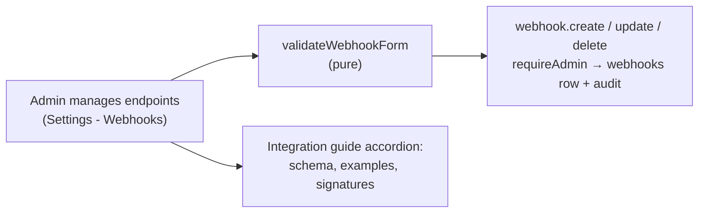
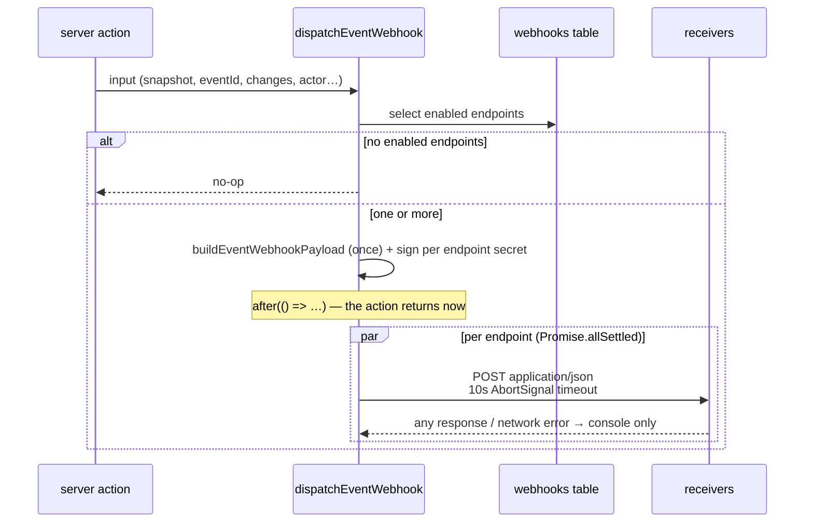

# 1. Event webhooks: notifying external systems

When an event is created, modified, or deleted inside the app, a JSON notification is
POSTed to every enabled admin-registered webhook endpoint so external systems can
mirror the change. The payload carries **everything the event form collects** —
rendered title, raw description, type, times, out-of-camp/location, departments,
invitees, creator — with display names resolved exactly like the audit log. Delivery
is fire-and-forget: it never delays or fails the mutation. What an event *is* lives in
[`event-lifecycle.md`](event-lifecycle.md); the mutations that trigger the webhook live
in [`event-mutations.md`](event-mutations.md).

## Table of contents

- [1.1 Goals & non-goals](#11-goals--non-goals)
- [1.2 Configuration](#12-configuration)
- [1.3 Payload](#13-payload)
- [1.4 Delivery & security](#14-delivery--security)
- [1.5 Integration points](#15-integration-points)
- [1.6 In-app integration guide](#16-in-app-integration-guide)
- [1.7 Pure helpers & testing](#17-pure-helpers--testing)
- [1.8 File index & related docs](#18-file-index--related-docs)

## 1.1 Goals & non-goals

**Goals**

- External systems learn about every successful in-app event create/update/delete with
  all user-configurable fields included — no follow-up call into cloudy2 required.
- Updates show what changed (`changes` with `[before, after]` pairs) plus the full
  resulting state, mirroring the audit log's diff.
- Any number of endpoints can be registered; each is delivered independently, so one
  slow or broken receiver can never delay a mutation response or affect other
  receivers.

**Non-goals**

- No retry queue or delivery history: failed deliveries are logged to the console and
  dropped (same philosophy as `logAction`).
- No notifications for Google-side edits of events made outside the app — only the
  three in-app server actions fire webhooks.
- No per-endpoint action filters: every enabled endpoint receives all three actions.

## 1.2 Configuration

Endpoints live in the dedicated `webhooks` table and are managed in Settings →
Webhooks (admin-only), which also renders the in-app integration guide (§1.6):

| Column       | Meaning                                                                        |
| ------------ | ------------------------------------------------------------------------------ |
| `name`       | Display label used in this list and the audit log                              |
| `url`        | The HTTPS endpoint that receives deliveries                                     |
| `secret`     | Optional per-endpoint shared secret used to sign its deliveries (§1.4)          |
| `enabled`    | Disabled rows receive nothing but keep their configuration                      |

CRUD goes through `createWebhook` / `updateWebhook` / `deleteWebhook`
(`src/lib/webhooks/actions.ts`) following the settings/event-types pattern:
`requireAdmin()` → pure validation (`src/lib/webhooks/validate.ts`: required name,
http(s) URL, secret length cap) → DB write → audit row (`webhook.create/update/delete`,
details of name/url/enabled — **never the secret**) → `revalidatePath`. The original
single-endpoint config (`settings.webhook_url/secret/enabled`, Phase 3ap) was migrated
into this table by `drizzle/0015_chubby_sentinel.sql`, which then dropped those
columns.



## 1.3 Payload

`buildEventWebhookPayload` (`src/lib/webhooks/payload.ts`, pure) assembles the POSTed
JSON from the same `EventAuditSnapshot` the audit log stores, so names can never
diverge between audit and webhook:

```json
{
  "action": "event.updated",
  "eventId": "0f0a…uuid shared by every department copy",
  "googleEventIds": ["gcal-copy-1", "gcal-copy-2"],
  "occurredAt": "2026-08-23T01:02:03.000Z",
  "actor": { "name": "Alice Tan", "role": "admin" },
  "event": {
    "title": "Range Alpha",
    "description": "Field training",
    "type": "Exercise",
    "time": "2026-08-21 (AM) – 2026-08-23 (PM)",
    "outOfCamp": true,
    "location": "Range North",
    "departments": ["Alpha", "Bravo"],
    "invitees": ["Bob Lim", "Alice Tan"],
    "creator": "Alice Tan",
    "timeOption": "half",
    "start": "2026-08-21 00:00:00",
    "end": "2026-08-23 00:00:00",
    "startAmPm": "AM",
    "endAmPm": "PM"
  },
  "changes": {
    "location": ["Range North", "Range South"],
    "time": ["2026-08-21 (AM)", "2026-08-21 (AM) – 2026-08-23 (PM)"]
  }
}
```

Field notes:

- `action` — `"event.created"` | `"event.updated"` | `"event.deleted"`
  (`WEBHOOK_ACTIONS`).
- `eventId` — the logical group id shared by all department copies
  ([`event-mutations.md` §1.2](event-mutations.md#12-identity--the-group-id)); null
  only when deleting a legacy event that was never edited.
- `event.title` — the rendered Google Calendar title (`renderEventTitle`);
  `description` is the raw text typed in the form.
- `event.time` — pre-formatted UTC+8 wall-clock string (`formatEventAuditTime`). The
  structured keys `timeOption` / `start` / `end` / `startAmPm` / `endAmPm` are added
  when the datetime parts are known (create/update); deletes of legacy events may omit
  them, leaving `time` as the fallback.
- `changes` — present on updates only; same `[before, after]` pairs as the audit log's
  `diffFields`, keyed by snapshot field name.

## 1.4 Delivery & security

`dispatchEventWebhook` (`src/lib/webhooks/deliver.ts`) runs at the end of each
successful mutation:



- **Fan-out**: the payload and body are built once; every enabled endpoint gets its
  own signed POST inside a single `after()` via `Promise.allSettled` — deliveries are
  independent, so one receiver's failure never affects another's.
- **Fire-and-forget**: the POSTs are queued via `after()` (`next/server`), so the
  mutation's response is never delayed; preparation failures are caught and logged.
- **Timeout**: `AbortSignal.timeout(10_000)` bounds each delivery.
- **Signature** (`src/lib/webhooks/sign.ts`, pure): when an endpoint has a secret, its
  delivery carries
  - `X-Cloudy2-Signature: sha256=<hex>` — HMAC-SHA256 over `"<timestamp>.<body>"`
  - `X-Cloudy2-Timestamp` — unix seconds, part of the signed material (replay binding)
  - `X-Cloudy2-Event` — the action string, for cheap routing without parsing the body

  Receivers verify by recomputing the HMAC over `${header.timestamp}.${rawBody}` with
  their shared secret and comparing (constant-time comparison recommended).
- **No secrets in logs or audits**: failures log the endpoint name/URL/status/error
  only; secrets appear nowhere outside the `webhooks` row.

## 1.5 Integration points

One dispatch per action in `src/lib/events/actions.ts`, placed immediately after the
audit `logAction` call — so a webhook fires **only for successful Google writes**, and
never for rolled-back attempts:

| Action        | Dispatch extras                                                              |
| ------------- | ---------------------------------------------------------------------------- |
| `createEvent` | `timePartsOf(effectiveInput)`; `googleEventIds` = the copies created          |
| `updateEvent` | `changes` = the same `diffFields(before, after)` the audit row stores; `googleEventIds` = every copy touched this run (updated, newly created, retired) collected in the reconcile loop |
| `deleteEvent` | `snapshotFromCopy` result; `timeParts: null`; `googleEventIds` = the deleted copy ids |

## 1.6 In-app integration guide

The Webhooks tab renders a **PayloadReference** accordion
(`src/app/(protected)/settings/webhooks/PayloadReference.tsx`) so endpoint integrators
get the schema without leaving the app:

- **Actions & headers** — the three action strings and the delivery headers table.
- **Example payloads** — one JSON sample per action with copy buttons. These are
  generated at render time by `buildExampleWebhookPayload`
  (`src/lib/webhooks/example.ts`, pure), which calls the **real**
  `buildEventWebhookPayload` with fixed fixture data — the displayed schema can never
  drift from actual deliveries.
- **Verifying signatures** — HMAC recipe with a copyable Node `crypto` snippet.

## 1.7 Pure helpers & testing

| Helper | Module | Tests |
| ------ | ------ | ----- |
| `buildEventWebhookPayload`, `WEBHOOK_ACTIONS` | `webhooks/payload.ts` | `payload.test.ts` |
| `buildExampleWebhookPayload` | `webhooks/example.ts` | `example.test.ts` |
| `webhookSignature` | `webhooks/sign.ts` | `sign.test.ts` |
| `normalizeWebhookName/Url/Secret`, `validateWebhookForm` | `webhooks/validate.ts` | `validate.test.ts` |

I/O-bound (not unit-tested, per repo convention): `webhooks/deliver.ts` (endpoint read
+ `fetch`), `webhooks/actions.ts` (CRUD server actions), and the wiring inside
`events/actions.ts`.

## 1.8 File index & related docs

| File | Role |
| ---- | ---- |
| `src/lib/webhooks/payload.ts` | Payload builder + action constants (pure) |
| `src/lib/webhooks/example.ts` | Fixture-driven examples for the in-app guide (pure) |
| `src/lib/webhooks/sign.ts` | HMAC-SHA256 signature (pure) |
| `src/lib/webhooks/deliver.ts` | Enabled-endpoint read, sign, fan-out `after()` POSTs |
| `src/lib/webhooks/queries.ts` | `listWebhooks` for the settings tab |
| `src/lib/webhooks/actions.ts` | Endpoint CRUD server actions + audit rows |
| `src/app/(protected)/settings/webhooks/*` | Tab page, list/table/form, payload reference |
| `src/lib/events/actions.ts` | The three dispatch sites |
| `src/db/schema.ts` | The `webhooks` table |

Related docs:

- [`event-mutations.md`](event-mutations.md) — the mutations that trigger webhooks and
  the audit snapshots they share.
- [`audit-log.md`](audit-log.md) — the audit rows whose snapshots/diffs feed the
  payload.
- [`event-lifecycle.md`](event-lifecycle.md) — what each payload field means
  (title rendering, location policy, time options).
