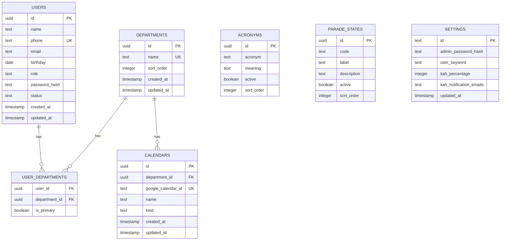
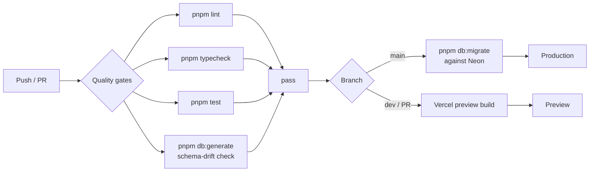
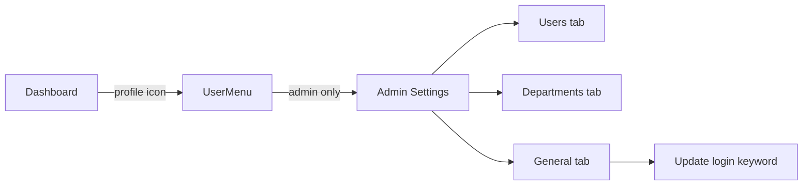
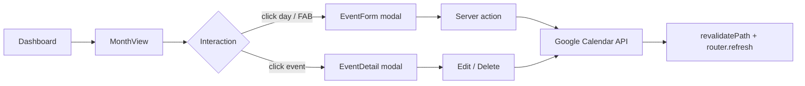

# 1. Cloudy2 — Progress

Internal tool for managing company personnel, leave/event records, and Key Appointment
Holder (KAH) constraints, with Google Calendar as the event/visibility layer.

## Table of contents

- [1.1 Status](#11-status)
- [1.2 Decisions locked in (Phase 0)](#12-decisions-locked-in-phase-0)
- [1.3 Implemented (Phase 1)](#13-implemented-phase-1)
  - [1.3.1 Tooling](#131-tooling)
  - [1.3.2 Database schema](#132-database-schema-srcdbschematics)
  - [1.3.3 Auth & routing](#133-auth-routing)
  - [1.3.4 Google integration (stub)](#134-google-integration-stub)
  - [1.3.5 Tests](#135-tests)
- [1.4 Verification status](#14-verification-status)
- [1.5 Deployment (Vercel) — current blocker & fix](#15-deployment-vercel-current-blocker-fix)
  - [1.5.1 Remaining manual steps (Vercel dashboard)](#151-remaining-manual-steps-vercel-dashboard)
- [1.6 CI migrations (Phase 1.5)](#16-ci-migrations-phase-15)
- [1.7 Bootstrap & schema hardening (Phase 1.5)](#17-bootstrap-schema-hardening-phase-15)
- [1.8 Roster & Departments (Phase 2a)](#18-roster-departments-phase-2a)
- [1.9 Seeding (Phase 2b)](#19-seeding-phase-2b)
- [1.10 Next.js 16 upgrade & auth fix (Phase 2c)](#110-nextjs-16-upgrade-auth-fix-phase-2c)
- [1.11 Departments as Google Calendars + sharing + audit (Phase 2d)](#111-departments-as-google-calendars--sharing--audit-phase-2d)
- [1.12 Mobile-only UI refactor and Users rename (Phase 2e)](#112-mobile-only-ui-refactor-and-users-rename-phase-2e)
- [1.13 Admin Settings hub and login keyword (Phase 2f)](#113-admin-settings-hub-and-login-keyword-phase-2f)
- [1.14 Event Types (Phase 2g)](#114-event-types-phase-2g)
- [1.15 Next steps (Phase 2+)](#115-next-steps-phase-2)
- [1.16 Calendar events (Phase 2h)](#116-calendar-events-phase-2h)
- [1.17 Git history](#117-git-history)

## 1.1 Status

- **Phase 0 (spec & decisions):** complete
- **Phase 1 (scaffold):** complete — builds, lints, typechecks, and tests pass locally
- **Phase 2 (roster/seeding/auth-fix):** roster + departments CRUD shipped; `db:seed`
  working; Next.js upgraded to 16.3.1 fixing the post-login `useEffectEvent` crash
- **Phase 2d (departments = Google Calendars):** departments are now `calendars` rows
  (kind = `department`), each user has a single `department_id` (dropped
  `departments`/`user_departments`), real Google Calendar ACL sharing + audit logging
  shipped. `pnpm build/lint/typecheck/test` (53) pass, `db:generate` shows no drift.
- **Phase 2e (mobile-only UI + rename):** shell switched from hamburger/sidebar to a fixed
  **bottom nav bar**; lists refactored to mobile **card layouts** with `fullScreen` modals;
  the "Roster" section renamed to **Users** (`/roster` → `/users`). No schema changes.
- **Phase 2g (event types):** new **Event Types** admin settings tab (`/settings/event-types`)
  for a lookup list of taggable event names (create/rename/delete). Migration `0005` adds the
  `event_types` table (unique `name`). `pnpm build/lint/typecheck/test` (68) pass; `db:generate`
  shows no drift.
- **Phase 2h (calendar events):** the `/dashboard` placeholder is now a real month calendar
  (`@mantine/schedule` `MonthView`) with create/edit/delete/view of Google Calendar events,
  calendar + event-type filters, and per-day event rendering. Event data stays 100% in Google
  Calendar (no DB table); the event type is stored in the event "notes" (`description`) as an
  extensible JSON block. `pnpm build/lint/typecheck/test` (86) pass; `db:generate` shows no
  drift.
- **Deployment (Vercel):** build passes on `main`/`dev` with no warnings (Corepack +
  `NEXTAUTH_URL` unset). Migrations `0000` + `0001` applied to Neon (via CI migrate job);
  `0002`–`0005` pending (apply on next `main` push).

## 1.2 Decisions locked in (Phase 0)

| Topic                    | Decision                                                                 |
| ------------------------ | ------------------------------------------------------------------------ |
| Architecture             | Single Next.js 16 (App Router) app — no monorepo                          |
| UI                       | Mantine v9                                                               |
| Database                 | Neon Postgres + Drizzle ORM                                              |
| Auth                     | NextAuth v4, Credentials provider, **JWT sessions**                       |
| Login UX                 | Single input field, auto-detect: admin password vs `[phone][keyword]`    |
| Google integration       | GCP service account (Calendar v3 + Gmail v1); domain-wide delegation     |
| GCal notes               | JSON block stored on events                                              |
| Calendars                | Department-level calendars; `calendars` table is the department registry (kind = `department`) |
| Parade states            | `parade_states` lookup table (code/label/description)                    |
| Settings                 | Single-row `settings` table (admin password hash, keyword, KAH %)        |
| User→dept                | One department per user: `users.department_id` → `calendars.id` (nullable, ON DELETE SET NULL) |
| PWA / monorepo           | Deferred / not used                                                      |

## 1.3 Implemented (Phase 1)

### 1.3.1 Tooling
- Next.js `16.3.1` (Turbopack), React `19.2.8`, TypeScript, pnpm `11.18.0`
- `packageManager` + `engines` pinned in `package.json`
- Mantine v9 wired via `postcss.config.cjs` + `MantineProvider` + `optimizePackageImports`
- Drizzle `0.45.2` + `postgres-js`; Vitest `4.1.10`; ESLint 9 + Prettier
- Native build scripts approved in `pnpm-workspace.yaml` (`allowBuilds`: esbuild, sharp,
  unrs-resolver)
- CI workflow (`.github/workflows/ci.yml`): lint, typecheck, test, schema-drift check

### 1.3.2 Database schema (`src/db/schema.ts`)
7 tables: `users`, `departments`, `user_departments`, `calendars`, `acronyms`,
`parade_states`, `settings`. Lazy DB client (`src/db/index.ts`) avoids requiring
`DATABASE_URL` at build time. Migration generated at `drizzle/0000_serious_ezekiel_stane.sql`.



### 1.3.3 Auth & routing
- `src/lib/auth.ts` — NextAuth config: Credentials + JWT, admin/user resolution, JWT/session
  callbacks that carry `id`, `role`, `phone`
- `src/lib/login.ts` — pure (I/O-free) login parsing: `parseUserLogin`, `classifyLogin`
- `src/lib/session.ts` — `requireSession`, `requireAdmin`, `getSession` guards
- `src/types/next-auth.d.ts` — session/JWT type augmentation
- `src/app/api/auth/[...nextauth]/route.ts` — auth handler
- `src/app/login/page.tsx` + `src/components/LoginForm.tsx` — login page + form
- `src/app/(protected)/layout.tsx` + `dashboard/page.tsx` + `AppShellShell` — protected
  dashboard shell
- `src/components/` — `AcronymBadge`, `CalendarSelect`

### 1.3.4 Google integration (stub)
- `src/lib/google/types.ts` — `GoogleIntegration` interface
- `src/lib/google/stub.ts` — no-op implementation
- `src/lib/google/index.ts` — `getGoogleIntegration()` returns the stub until credentials
  are provisioned

### 1.3.5 Tests
- `src/lib/login.test.ts` — 8 passing tests (login parsing)

## 1.4 Verification status

| Check              | Result |
| ------------------ | ------ |
| `pnpm build`       | pass   |
| `pnpm lint`        | pass   |
| `pnpm typecheck`   | pass   |
| `pnpm test`        | 8/8    |
| `pnpm db:generate` | 7 tables, 1 migration |

## 1.5 Deployment (Vercel) — current blocker & fix

Vercel auto-builds: `main` → production, `dev` → preview.

Two issues were diagnosed and fixed in-repo (committed and pushed to both `dev` and `main`):

1. **`TypeError: Invalid URL` during `/login` prerender.** Caused by an empty
   `NEXTAUTH_URL` env var (NextAuth's `parseUrl` does `new URL('')`). Fix: leave
   `NEXTAUTH_URL` **unset** on Vercel — it injects `VERCEL_URL` and NextAuth falls back
   automatically.
2. **"Ignored build scripts" warning** (esbuild, sharp, unrs-resolver). Root cause: Vercel
   detects pnpm **10** from `lockfileVersion: 9.0` and ignores the pnpm-11 `allowBuilds`
   config. Fix: enable Corepack so Vercel honors `packageManager: pnpm@11.18.0`.

### 1.5.1 Remaining manual steps (Vercel dashboard)
- [x] Add `ENABLE_EXPERIMENTAL_COREPACK` = `1` — done, build passes with no warnings
- [x] Add `NEXTAUTH_SECRET` (`openssl rand -base64 32`) — done per user
- [x] Add `DATABASE_URL` (Neon) — done per user
- [x] Remove any empty `NEXTAUTH_URL` — done per user
- [x] Redeploy and confirm build passes — done, no warnings
- [ ] Set `ADMIN_INITIAL_PASSWORD` on Vercel (seeds the admin password hash on first login)
- [x] Add `DATABASE_URL` as a GitHub Actions repo secret (feeds the CI migrate job)

## 1.6 CI migrations (Phase 1.5)



- `migrate` job added to `.github/workflows/ci.yml`: `needs: quality`, runs only on
  `main` push (`if: github.ref == 'refs/heads/main'`), serialized via a `db-migrate`
  concurrency group so concurrent pushes can't race. Applies `pnpm db:migrate` against
  Neon using the `DATABASE_URL` repo secret.
- Single shared Neon DB across Vercel `dev`/`main`, so main-only migration keeps both
  environments schema-synced. Pending `0000` + `0001` apply automatically on the next
  `main` push — no local migrate step needed.

## 1.7 Bootstrap & schema hardening (Phase 1.5)

- `settings` table now has a `settings_singleton` CHECK constraint (`id = 'singleton'`,
  `text` PK with default) — a second row is impossible. Migration `0001` generated.
- `drizzle/meta/` is now **committed** (was gitignored). CI schema-drift step is
  `pnpm db:generate && git diff --exit-code -- drizzle/` so drift actually fails the build.
- `src/lib/bootstrap.ts` `ensureSettingsRow()` lazily seeds the singleton settings row on
  first auth, hashing `ADMIN_INITIAL_PASSWORD` (env). Called at the top of `authorize` in
  `src/lib/auth.ts`. Race-safe via `onConflictDoNothing` + check constraint.
- `ADMIN_INITIAL_PASSWORD` added to `.env.example`.

## 1.8 Roster & Departments (Phase 2a)

- **`src/lib/roster/validate.ts`** — pure helpers: `normalizePhone` (exactly 8 digits after
  stripping), `validateUserForm`, `validateDepartmentForm`. Unit-tested (15 cases).
- **`src/lib/roster/queries.ts`** — `listUsers()` (join `user_departments` + `departments`,
  primary flag, sorted), `listDepartments()`.
- **`src/lib/roster/actions.ts`** — Server Actions guarded by `requireAdmin()`:
  `createUser`, `updateUser`, `setUserStatus` (deactivate-only; no hard delete),
  `createDepartment`, `updateDepartment`, `deleteDepartment`. Exactly-one-primary enforced;
  unique-violation errors mapped to form fields; `revalidatePath` after mutations.
- **`/roster`** — admin-only table (search name/phone, filter status + department, badges
  for role/status/departments with primary marked), create/edit modal, activate/deactivate.
- **`/departments`** — admin-only name + sortOrder CRUD, delete-with-cascade confirm.
- **`AppShellShell`** — Roster/Departments nav links only for admins (role passed from the
  protected layout).
- Verification: migrations applied to Neon (2/2), all 7 tables live, roster queries hit the
  live DB. `pnpm build/lint/typecheck/test` all pass.

## 1.9 Seeding (Phase 2b)

- **`src/db/seed.ts`** — `pnpm db:seed` (tsx). Idempotent, refuses to run with
  `NODE_ENV=production`. Reads `DATABASE_URL` from env or `.env.local`. Seeds 4
  departments, 4 users, 5 memberships; also sets `settings.userKeyword = 'leave'` when
  empty so seeded users can log in as `[phone]leave`. Verified: 4/4/5 created, re-run
  inserts 0.

## 1.10 Next.js 16 upgrade & auth fix (Phase 2c)

**Root cause of login crash (`useEffectEvent is not a function`):** Next.js 15.5.23
bundles its own React (`19.2.0-canary-0bdb9206-20250818`) and aliases all `react`
imports to it at runtime — the installed React version is bypassed. That bundled React
had no `useEffectEvent`, which Mantine v9.5.1 (peer `react ^19.2.0`, the whole v9 line
requires React 19.2 stable) calls inside `AppShell`. The protected shell crashed right
after login on both Vercel and local. This predated the roster work (latent since
Phase 1); it surfaced once login reached the protected layout.

**Fix:** upgraded Next.js `15.5.23` → `16.3.1` (the line that bundles React 19.2 stable;
installed bundle is `19.3.0-canary` with `useEffectEvent`). Also `eslint-config-next`
`15.5.23` → `16.3.1`.

- `eslint.config.mjs` rewritten: Next 16 ships flat configs directly, so
  `next/core-web-vitals` + `next/typescript` are imported as arrays instead of via
  `FlatCompat` (the legacy wrapper crashed with a circular-structure error).
- `next.config.ts` unchanged (`experimental.optimizePackageImports` still valid).
- tsconfig auto-updated by Next 16: `jsx: preserve` → `react-jsx`, added
  `.next/dev/types/**/*.ts`.
- Verified with `next start`: admin login → dashboard/roster/departments 200;
  non-admin (Bob `82345678leave`) → dashboard 200, `/roster` + `/departments` 307 →
  `/dashboard`. `pnpm build/lint/typecheck/test` (23) pass.

## 1.11 Departments as Google Calendars + sharing + audit (Phase 2d)

Departments are now Google Calendars: the `calendars` table is the department registry,
Google Calendar is the source of truth for existence/ACLs, and nothing sharing-related is
stored in the DB.

- **Schema** — migrations `0002`–`0004`: `users.department_id` (backfilled from
  `user_departments`, then `departments`/`user_departments` dropped), `calendars` no
  longer references `departments`, new `audit_logs` table. `src/db/schema.ts` rewritten
  to match `0004` exactly (verified: `pnpm db:generate` produces no diff).
- **Google layer** — `src/lib/google/config.ts` (env parsing, `getServiceAccountConfig`,
  `getAdminGoogleEmail`), `real.ts` (JWT service account, Calendar v3; event/Gmail methods
  still throw "not implemented yet"), `types.ts` (interface + `GoogleCalendarInfo`),
  `stub.ts` (no-op fallback), `index.ts` (`getGoogleIntegration()` real-when-configured,
  `googleCalendarConfigured()`). Env vars: `GOOGLE_SERVICE_ACCOUNT_BASE64` (or
  `GOOGLE_CLIENT_EMAIL`/`GOOGLE_PRIVATE_KEY`) + `GOOGLE_DELEGATE_EMAIL`.
- **Sharing** — `src/lib/roster/shares.ts` (`listDepartmentAccess` reconciles assigned
  users as readers, grants admin owner, returns `DepartmentAccess`); actions
  `get/grant/revokeDepartmentAccess`; UI modal `DepartmentShares.tsx` (copy calendar ID,
  add/remove manual shares, surfaces `syncWarning` when Google is unconfigured).
- **Audit** — `audit_logs` written best-effort via `src/lib/audit/log.ts` +
  `build.ts` (actions `user.create`/`calendar.create`/`access.grant`/…, field diffs via
  `diff.ts`). Hooked into roster + calendar + share server actions.
- **Roster (single-department)** — `users` has one `department_id`; `queries.ts`
  `listUsers()` left-joins `calendars`, `UserTable`/`UserForm` use a single clearable
  department select; `actions.ts` `createUser`/`updateUser`/`setUserStatus`.
- **Departments page** — `DepartmentTable` lists calendars (name + calendar ID) with
  Share/Rename/Delete; `DepartmentForm` creates/renames a Google Calendar; creation is
  blocked with a clear message when Google is unconfigured.
- **New dependency** — `@tabler/icons-react` added (used by `DepartmentShares`).
- Verification: `pnpm build/lint/typecheck/test` (53) pass; `db:generate` shows no schema
  drift.

## 1.12 Mobile-only UI refactor and Users rename (Phase 2e)

The app is **strictly mobile-only**: no desktop sidebar/hamburger layout exists anymore.

- **Bottom nav** — `src/components/AppShellShell.tsx` renders `AppShell.Footer` with
  icon + label links (Dashboard `IconLayoutDashboard`, Users `IconUsers`, Departments
  `IconBuilding`; non-admins see only Dashboard). Header is a slim centered "Cloudy" brand
  bar; footer adds `env(safe-area-inset-bottom)` padding. Active tab matched via
  `pathname.startsWith(href)`.
- **Card lists** — `UserTable` and `DepartmentTable` render each row as a stacked
  `Paper` card (badges + action buttons) instead of `<Table>`; the users filter bar stacks
  vertically. Modals (`UserForm`, `DepartmentForm`, `DepartmentShares`, delete confirm)
  are floating `centered` dialogs with a fixed `size`.
- **"Users" rename** — nav label + page title "Roster" → "Users"; route `/roster` moved
  to `/users` (`git mv src/app/(protected)/roster src/app/(protected)/users`,
  `RosterPage` → `UsersPage`). `src/lib/roster/actions.ts` `revalidatePath` calls and the
  `src/lib/audit/build.test.ts` route fixtures updated. The internal `src/lib/roster/*`
  module namespace is intentionally left as "roster".
- Verification: `pnpm lint`, `pnpm typecheck`, `pnpm test` (53), and `pnpm build` all
  pass; build route list shows `/users` and no `/roster`.

## 1.13 Admin Settings hub and login keyword (Phase 2f)

The Users and Departments sections now live under a single **Admin Settings** hub,
reachable only via the profile icon in the header. The bottom nav bar is gone.

- **Routing** — `src/app/(protected)/users` and `.../departments` moved to
  `src/app/(protected)/settings/users` and `.../settings/departments`. A new
  `settings/layout.tsx` calls `requireAdmin()` once (removed from the two pages) and
  renders a horizontal, scrollable `SettingsTabs` bar; `settings/page.tsx` redirects
  `/settings` → `/settings/users` (Users is the default tab). Tabs: **Users**
  (`/settings/users`), **Departments** (`/settings/departments`), **General**
  (`/settings/general`). `next.config.ts` adds permanent redirects from the old
  `/users` and `/departments` URLs.
- **Keyword setting (General tab)** — new `src/lib/settings/*` module mirroring the
  roster module: `validate.ts` (`normalizeKeyword` → trimmed, lowercased, `/^[a-z]{1,12}$/`,
  plus `validateKeywordForm`; unit-tested), `queries.ts` (`getSettings()` returns only
  `userKeyword`, never the admin password hash), `actions.ts` (`updateKeyword` server
  action: `requireAdmin`, validate, `UPDATE settings`, audit log `settings.update` with a
  field diff, `revalidatePath("/settings/general")`). `AUDIT_ACTIONS.settingsUpdate` added
  to `src/lib/audit/build.ts`.
- **Navigation** — `AppShellShell` drops the `AppShell.Footer`/bottom nav entirely; the
  "Cloudy" brand is now a link to `/dashboard`. `UserMenu` takes a `role` prop and shows an
  **Admin Settings** item (→ `/settings`) for admins only, above Log out.
  `FloatingToolbar` bottom offset changed from the old footer clearance (76px) to
  `calc(env(safe-area-inset-bottom) + 16px)`.
- **Revalidation** — `src/lib/roster/actions.ts` `revalidatePath` targets updated to
  `/settings/users` and `/settings/departments`.



- Verification: `pnpm lint/typecheck/test/build` pass; no schema change so `db:generate`
  shows no drift.

## 1.14 Event Types (Phase 2g)

A new **Event Types** tab in Admin Settings lets admins define the list of event names that
can later be tagged onto calendar events. This phase ships only the lookup list (create /
rename / delete) — tagging onto events is a future phase.

- **Schema** — migration `0005` adds `event_types` (`id` uuid pk, `name` text not null,
  `created_at`/`updated_at`) with a unique index on `name` so the same tag can't be defined
  twice. `src/db/schema.ts` exports the `eventTypes` table + `EventType` type.
- **Module** — `src/lib/eventTypes/*` mirrors the roster module:
  `validate.ts` (`validateEventTypeForm`, unit-tested), `queries.ts` (`listEventTypes()`
  ordered by name), `actions.ts` (`createEventType`/`renameEventType`/`deleteEventType`
  server actions — `requireAdmin`, validate, DB op, audit log, `revalidatePath`, unique
  violation → "already exists" error).
- **UI** — `src/app/(protected)/settings/event-types/` (`page.tsx`, `EventTypeTable.tsx`
  card list with Rename/Delete + floating "Add event type" button, `EventTypeForm.tsx`
  centered modal, `loading.tsx` skeleton). Added to `SettingsTabs` between Departments and
  General.
- **Audit** — `AUDIT_ACTIONS` gains `eventType.create`/`eventType.rename`/
  `eventType.delete`.
- Verification: `pnpm lint`, `pnpm typecheck`, `pnpm test` (68), `pnpm build`, and
  `pnpm db:generate` (no drift) all pass; build route list shows `/settings/event-types`.

## 1.15 Next steps (Phase 2+)

1. Wire the real Gmail method in `real.ts` (Gmail send-as, KAH visibility) — calendar
   event read/write is now implemented.
2. Core screens still pending: KAH constraint checks, parade states, acronyms on event
   titles, on-behalf/masquerade permissions, and VCF contacts export.
3. Gmail notifications for KAH percentage breaches.

## 1.16 Calendar events (Phase 2h)

The `/dashboard` placeholder is replaced by a real month calendar with full event
create/edit/delete/view. Events remain 100% in Google Calendar — no event table exists.



- **Dependency** — added `@mantine/schedule@9.5.1` (the `MonthView` component) and `dayjs`
  (its required peer). `@mantine/dates/styles.css` + `@mantine/schedule/styles.css` imported
  in `src/app/layout.tsx` (order: core → dates → schedule).
- **Google layer** (`src/lib/google/`) — implemented `createEvent`/`updateEvent`/
  `deleteEvent`/`listEvents` in `real.ts` (`events.insert/update/delete/list`,
  `singleEvents: true`, `orderBy: startTime`); `listEvents` added to the interface + stub.
  All-day events use Google's `date` field with an exclusive end date; timed events use
  `dateTime`. `GcalEventItem` added for read-back.
- **Events module** (`src/lib/events/*`, mirrors `roster`/`eventTypes`):
  - `notes.ts` — pure encode/parse of the machine-readable "notes" JSON block stored in the
    event `description` (currently `{ eventType }`, extensible for future fields).
  - `datetime.ts` — pure date/time helpers; wall-clock times are treated as fixed
    `Asia/Singapore` (UTC+8, no DST) so conversions are deterministic and testable.
  - `validate.ts` — pure form validation (title/start/end, end ≥ start).
  - `queries.ts` — `listCalendars`, `getUserDepartmentId`, and `fetchMonthEvents` which reads
    events across the selected calendars and maps them to `CalendarEvent` (schedule-ready
    data with a `payload` carrying calendar id, Google event id, all-day flag, and parsed
    event type).
  - `actions.ts` — `createEvent`/`updateEvent`/`deleteEvent` server actions (`requireSession`,
    audit-logged, `revalidatePath("/dashboard")`). Admins pick a target calendar; regular
    users always target their own department.
- **Dashboard** (`src/app/(protected)/dashboard/`) — `page.tsx` (server) reads `month`/`cal`/
  `types` search params and fetches events; `DashboardView.tsx` (client) renders a custom
  header + `MonthView` (`withHeader={false}`), `FilterButton` → `FilterModal` (Calendars +
  Event Types groups), `EventForm.tsx` (description, all-day toggle swapping
  `DateTimePicker` ↔ `DatePickerInput`, event-type `Select`, admin calendar `Select`),
  `EventDetail.tsx` (view + Edit/Delete), a `loading.tsx` skeleton, and a FAB.
- **Default view** — non-admin shows only their department calendar; admin shows all
  calendars. The filter always offers every calendar + every event type (regardless of
  access). Google unconfigured → empty calendar + a notice, and the FAB is disabled.
- **Audit** — `AUDIT_ACTIONS` gains `event.create`/`event.update`/`event.delete`.
- Verification: `pnpm lint`, `pnpm typecheck`, `pnpm test` (86), `pnpm build` (route list
  shows `/dashboard`), and `pnpm db:generate` (no drift — no schema change) all pass.

## 1.17 Git history

```
c2e1a68 Document Vercel Corepack requirement and env setup
d914aca Fix pnpm build scripts and pin package manager/Node
e04140f Phase 1 scaffold
8e60883 Initial commit from Create Next App
```
