# 1. Cloudy2 — Progress

Internal tool for managing company personnel, leave/event records, and Key Appointment
Holder (KAH) constraints, with Google Calendar as the event/visibility layer.

## Table of contents

- [1.1 Status](#11-status)
- [1.2 Decisions locked in (Phase 0)](#12-decisions-locked-in-phase-0)
- [1.3 Implemented (Phase 1)](#13-implemented-phase-1)
  - [1.3.1 Tooling](#131-tooling)
  - [1.3.2 Database schema](#132-database-schema-srcdbschematics)
  - [1.3.3 Auth & routing](#133-auth-routing)
  - [1.3.4 Google integration (stub)](#134-google-integration-stub)
  - [1.3.5 Tests](#135-tests)
- [1.4 Verification status](#14-verification-status)
- [1.5 Deployment (Vercel) — current blocker & fix](#15-deployment-vercel-current-blocker-fix)
  - [1.5.1 Remaining manual steps (Vercel dashboard)](#151-remaining-manual-steps-vercel-dashboard)
- [1.6 CI migrations (Phase 1.5)](#16-ci-migrations-phase-15)
- [1.7 Bootstrap & schema hardening (Phase 1.5)](#17-bootstrap-schema-hardening-phase-15)
- [1.8 Roster & Departments (Phase 2a)](#18-roster-departments-phase-2a)
- [1.9 Seeding (Phase 2b)](#19-seeding-phase-2b)
- [1.10 Next.js 16 upgrade & auth fix (Phase 2c)](#110-nextjs-16-upgrade-auth-fix-phase-2c)
- [1.11 Departments as Google Calendars + sharing + audit (Phase 2d)](#111-departments-as-google-calendars--sharing--audit-phase-2d)
- [1.12 Mobile-only UI refactor and Users rename (Phase 2e)](#112-mobile-only-ui-refactor-and-users-rename-phase-2e)
- [1.13 Admin Settings hub and login keyword (Phase 2f)](#113-admin-settings-hub-and-login-keyword-phase-2f)
- [1.14 Event Types (Phase 2g)](#114-event-types-phase-2g)
- [1.15 Next steps (Phase 2+)](#115-next-steps-phase-2)
- [1.16 Calendar events (Phase 2h)](#116-calendar-events-phase-2h)
- [1.17 Dashboard mobile month view (Phase 2i)](#117-dashboard-mobile-month-view-phase-2i)
- [1.18 Agenda day swipe (Phase 2j)](#118-agenda-day-swipe-phase-2j)
- [1.19 Schedule view & event invitees (Phase 2k)](#119-schedule-view--event-invitees-phase-2k)
- [1.20 Cross-department event copies (Phase 2l)](#120-cross-department-event-copies-phase-2l)
- [1.21 User shortname (Phase 2m)](#121-user-shortname-phase-2m)
- [1.22 Display name template (Phase 2n)](#122-display-name-template-phase-2n)
- [1.23 Event title template (Phase 2o)](#123-event-title-template-phase-2o)
- [1.24 Event type acronym + Templates tab (Phase 2p)](#124-event-type-acronym--templates-tab-phase-2p)
- [1.25 Schedule view space optimization (Phase 2q)](#125-schedule-view-space-optimization-phase-2q)
- [1.26 Git history](#126-git-history)
- [1.27 Event time options + calendar preview (Phase 2r)](#127-event-time-options--calendar-preview-phase-2r)
- [1.28 Calendar user filter (Phase 2s)](#128-calendar-user-filter-phase-2s)
- [1.28 Admin events on behalf of another user (Phase 2s)](#128-admin-events-on-behalf-of-another-user-phase-2s)
- [1.29 Admin-id UUID guard fix](#129-admin-id-uuid-guard-fix)
- [1.30 Empty event title (Phase 2t)](#130-empty-event-title-phase-2t)
- [1.31 Google Calendar "Edit in app" link (Phase 2u)](#131-google-calendar-edit-in-app-link-phase-2u)
- [1.32 Compressed opaque notes block (Phase 2v)](#132-compressed-opaque-notes-block-phase-2v)
- [1.33 Searchable user filter (Phase 2w)](#133-searchable-user-filter-phase-2w)
- [1.34 PWA installability (Phase 3a)](#134-pwa-installability-phase-3a)
- [1.35 Touch-friendly input heights (Phase 3b)](#135-touch-friendly-input-heights-phase-3b)
- [1.36 Global bottom nav + Overview page (Phase 3c)](#136-global-bottom-nav--overview-page-phase-3c)
- [1.37 Overview cross-department filter fix (Phase 3d)](#137-overview-cross-department-filter-fix-phase-3d)
- [1.38 Cross-department user options in filter dialogs (Phase 3d)](#138-cross-department-user-options-in-filter-dialogs-phase-3d)
- [1.39 Overview full-selection row scoping fix (Phase 3d)](#139-overview-full-selection-row-scoping-fix-phase-3d)
- [1.40 Externally created events (Phase 3e)](#140-externally-created-events-phase-3e)
- [1.41 Additional access levels (Phase 3f)](#141-additional-access-levels-phase-3f)
- [1.42 Calendar caching layer (Phase 3g)](#142-calendar-caching-layer-phase-3g)

## 1.1 Status

- **Phase 0 (spec & decisions):** complete
- **Phase 1 (scaffold):** complete — builds, lints, typechecks, and tests pass locally
- **Phase 2 (roster/seeding/auth-fix):** roster + departments CRUD shipped; `db:seed`
  working; Next.js upgraded to 16.3.1 fixing the post-login `useEffectEvent` crash
- **Phase 2d (departments = Google Calendars):** departments are now `calendars` rows
  (kind = `department`), each user has a single `department_id` (dropped
  `departments`/`user_departments`), real Google Calendar ACL sharing + audit logging
  shipped. `pnpm build/lint/typecheck/test` (53) pass, `db:generate` shows no drift.
- **Phase 2e (mobile-only UI + rename):** shell switched from hamburger/sidebar to a fixed
  **bottom nav bar**; lists refactored to mobile **card layouts** with `fullScreen` modals;
  the "Roster" section renamed to **Users** (`/roster` → `/users`). No schema changes.
- **Phase 2g (event types):** new **Event Types** admin settings tab (`/settings/event-types`)
  for a lookup list of taggable event names (create/rename/delete). Migration `0005` adds the
  `event_types` table (unique `name`). `pnpm build/lint/typecheck/test` (68) pass; `db:generate`
  shows no drift.
- **Phase 2h (calendar events):** the `/dashboard` placeholder is now a real month calendar
  (`@mantine/schedule` `MonthView`) with create/edit/delete/view of Google Calendar events,
  calendar + event-type filters, and per-day event rendering. Event data stays 100% in Google
  Calendar (no DB table); the event type is stored in the event "notes" (`description`) as an
  extensible JSON block. `pnpm build/lint/typecheck/test` (86) pass; `db:generate` shows no
  drift.
- **Phase 2i (dashboard view toggle):** `/dashboard` gains a Month ⇄ MobileMonth view
  toggle (`?view=mobile` URL param); a day tap in either view opens an `AgendaView`
  modal. No schema changes; `pnpm lint/typecheck/test` (86) pass, `db:generate` no drift.
- **Phase 2j (agenda day swipe):** the agenda modal now changes day via left/right swipe
  (touch or mouse drag) and prev/next chevrons flanking the title; swiping across a
  month edge auto-navigates `?month=` so the new month's events load while the modal
  stays open. No schema changes; `pnpm lint/typecheck/test/build` pass.
- **Phase 2k (schedule view + event invitees):** `/dashboard` gains a third view —
  **Schedule** (`@mantine/schedule` `ResourcesDayView`), one row per user plus a
  department row per filtered department — and an **invitee system**: events store
  `createdBy`/`inviteeUsers`/`inviteeDepartments` in the notes JSON, and an "Invitees"
  multi-select in the event form tags people/departments whose rows show the event. The
  view switcher is now a full-viewport tab strip (Month / Mobile / Schedule). No schema
  changes; `pnpm lint/typecheck/test` (103) pass, `db:generate` no drift; verified in the
  dev environment against the live dev Google Calendar (invitee-tagged event rendered in
  both the department and user rows; smoke event deleted afterwards).
- **Phase 2l (cross-department event copies):** the event form no longer offers a
  calendar picker — the target calendars are derived (creator's department + each tagged
  person's department + tagged departments) and one linked copy of the event is created
  per target. Copies share an `eventId` in the notes JSON so the app treats them as one
  logical event: edits/deletes reconcile and cascade to every copy, and the month views
  dedupe by `eventId`. Legacy events get the group id backfilled on first edit. No
  schema changes; `pnpm lint/typecheck/test` (114) pass, `db:generate` no drift;
  verified live (2-copy cross-dept create, dedupe, edit reconcile with move, re-tag
  copy, delete cascade, legacy backfill).
- **Phase 2o (event title template):** admins define an **event title template**
  (`settings.event_title_template`, default `'{description}'`) that composes the title
  written to Google Calendar events — `{description}`, `{type}`/`{type:acronym}`,
  `{departments}`, and invited personnel as `{people}` / `{people:full}` / `{people:acronym}` /
  `{people:fqn}` (bare = FQN via the display-name template). The raw description round-trips
  through `notes.title` so editing never re-types the rendered title. Only newly created/edited
  events re-render. `pnpm lint/typecheck/test` (146) pass; `db:generate` no drift
  (migration `0008`).
- **Phase 2p (event type acronym + Templates tab):** event types gain an app-required, unique
  **shortname** acronym (migration `0009`) rendered by the new `{type:acronym}` event title
  token, and the two template cards move from the General tab into a dedicated **Templates**
  tab (`/settings/templates`). The General tab now holds only the login keyword.
  `pnpm lint/typecheck/test` (151) pass; `db:generate` no drift.
- **Phase 2q (schedule view space optimization):** the Schedule view's left columns are
  compressed for mobile — user rows show the shortname (full-name tooltip), department rows
  drop their text for an icon, and the group header rotates 90° in a narrow column.
  `pnpm lint/typecheck/test` (152) pass; `db:generate` no drift (no schema change).
- **Phase 2s (calendar user filter):** the `/dashboard` filter dialog gains a **Users** group
  (role-scoped active users, display-name labels) with a one-tap **"Only me"** quick action
  beside it; `?users=` is honored by `fetchMonthEvents`, showing events created by or tagged
  on the selected users in every dashboard view. `pnpm build/lint/typecheck/test` (193) pass,
  `db:generate` shows no drift.
- **Phase 2u (Google Calendar "Edit in app" link):** every event's Google notes now start
  with a human-readable `Edit: <url>` line (also stored as `notes.editLink`) that deep-links
  to `/dashboard?date=<start>&edit=<event group id>` and opens the event's edit form
  directly (dismissable "could not open" alert when the event isn't in the current view).
  The link origin is derived from the request headers (no new env config). No schema
  changes; `pnpm lint/typecheck/test` (203) + `pnpm build` pass, `db:generate` no drift.
- **Phase 2v (compressed opaque notes block):** the Google notes block is now opaque —
  brotli-compressed and base64url-encoded (no padding) on a single line below the
  `Edit: <url>` line (block shrinks ~585 → ~220 chars worst case; raw uuids/titles no
  longer leak to calendar viewers); the redundant in-JSON `editLink` field was dropped.
  `parseEventNotes` still reads v1 (raw JSON) and v2 (JSON line) events, so no migration.
  No schema changes; `pnpm lint/typecheck/test` + `pnpm build` pass, `db:generate` no
  drift.
- **Phase 2w (searchable user filter):** the dashboard's filter dialog now renders the
  **Users** group as a searchable dropdown (same pattern as the event form's invitees
  picker) instead of one checkbox card per user. The shared `FilterModal` gains a `search`
  group variant ("empty selection = no filter") for large option lists; grid groups are
  unchanged. `pnpm lint/typecheck/test` (208) + `pnpm build` pass, `db:generate` no drift.
- **Phase 3a (PWA installability):** Cloudy is installable as a PWA — web app manifest
  (`/manifest.webmanifest`, brand colors + 192/512/maskable icons), iOS metadata
  (`appleWebApp` + `apple-touch-icon`), and a Serwist service worker (Turbopack variant)
  served from `/serwist/sw.js`. **Network-first policy:** the SW caches only immutable
  static assets; pages, RSC, auth, and any `/api/*` are `NetworkOnly` so data is always
  fresh from the DB/Google Calendar and never served stale. No push notifications yet.
   `pnpm build` (SW bundled, 50 precache entries) + `lint/typecheck/test` (220) pass,
   `db:generate` no drift. Manual iOS/Android install checks pending.
- **Phase 3b (touch-friendly input heights):** every single-line input (text boxes +
   dropdowns) is 1.2× taller via one `components.Input.vars` override in the theme —
   Mantine 9 drives input heights with `--input-height-*` CSS variables, and the base-
   `Input` vars merge into all of `TextInput`/`PasswordInput`/`Select`/`MultiSelect`.
   The login field's local 1.5× height hack was removed, so it now matches the global
   scale. No schema changes; `pnpm lint/typecheck/test` (220) pass, `db:generate` no
   drift.
- **Bugfix (grid-group apply semantics):** `FilterModal` no longer collapses a fully
  selected **grid** group to "no filter" when the user edited it — the explicit selection
  (including "all") is applied. Previously a non-admin who ticked every calendar got the
  "no filter" value, which the server resolves to their department default, so they could
  never view all calendars. "Clear" still restores the consumer default (department for
  non-admins, all for admins) and untouched groups re-apply their current values. The
   apply resolution is a pure, unit-tested helper in `src/lib/filters/resolveFilterApply.ts`.
   `pnpm lint/typecheck/test` (220) + `pnpm build` pass, `db:generate` no drift.
- **Bugfix (overview cross-dept filter):** Overview matrix rows no longer intersect the
   `users` filter — a non-admin filtering to another department with a users filter (e.g.
   "Only me") active now sees that department's rows instead of the "No users to show"
   empty state. Row scoping moved to a pure helper (`src/lib/overview/scope.ts`, 6 unit
   tests) mirroring the dashboard, where `users`/`types` narrow events only.
   `pnpm lint/typecheck/test` (244) pass, no schema change.
- **Bugfix (cross-dept user options in filter dialogs):** the filter dialog's **Users**
   group now offers the users of the selected department(s) — plus the current user so
   "Only me" still works — instead of being pinned to a non-admin's own department. This
   applies to both the Overview and Dashboard filters (shared pure helper
   `src/lib/filters/filterUserOptions.ts`, 6 unit tests). The event-form **invitee
   picker** stays own-department-scoped (creation context). `pnpm lint/typecheck/test`
   (250) pass, no schema change.
- **Bugfix (overview full-selection rows):** the Overview matrix no longer collapses to a
   non-admin's own department when they select **all** departments — rows always follow
   the selected departments (dashboard parity). The `narrowed`-length heuristic in
   `overviewRowUserIds` was replaced with a rule where a full selection is a real
   selection; only the admin default/full-selection keeps unassigned users. 7 unit tests.
   `pnpm lint/typecheck/test` (251) pass, no schema change.
- **Tweak (overview shortname headers):** the Overview matrix column headers now render
   the event-type **shortname** acronym (e.g. "LL", "OL") with the full name as a
   tooltip; the filter dialog and `?types=`/counts still use full names. No schema
   change.
- **Deployment (Vercel):** build passes on `main`/`dev` with no warnings (Corepack +
  `NEXTAUTH_URL` unset). Migrations `0000` + `0001` applied to Neon (via CI migrate job);
  `0002`–`0005` pending (apply on next `main` push).
- **Phase 3e (externally created events):** events created directly in Google Calendar
  (no app notes) are now flagged as **external** — an "External" badge in the event
  detail modal, and a department-row pin in the Day (schedule) view so they stay visible.
  In-app events carry a new bottom note line `Created in cloudy2` written on every
  create/edit. `pnpm build/lint/typecheck/test` (262) pass, `db:generate` no drift.
- **Phase 3g (calendar caching layer):** the Google Calendar month read is now cached
  server-side in a Postgres `google_event_cache` table (see §1.42) — repeat month views skip
  Google, the per-calendar fan-out is parallelized, and adjacent months are prefetched.
  `pnpm build/lint/typecheck/test` pass, `db:generate` no drift beyond the new table.

## 1.2 Decisions locked in (Phase 0)

| Topic              | Decision                                                                                       |
| ------------------ | ---------------------------------------------------------------------------------------------- |
| Architecture       | Single Next.js 16 (App Router) app — no monorepo                                               |
| UI                 | Mantine v9                                                                                     |
| Database           | Neon Postgres + Drizzle ORM                                                                    |
| Auth               | NextAuth v4, Credentials provider, **JWT sessions**                                            |
| Login UX           | Single input field, auto-detect: admin password vs `[phone][keyword]`                          |
| Google integration | GCP service account (Calendar v3 + Gmail v1); domain-wide delegation                           |
| GCal notes         | JSON block stored on events                                                                    |
| Calendars          | Department-level calendars; `calendars` table is the department registry (kind = `department`) |
| Parade states      | `parade_states` lookup table (code/label/description)                                          |
| Settings           | Single-row `settings` table (admin password hash, keyword, KAH %)                              |
| User→dept          | One department per user: `users.department_id` → `calendars.id` (nullable, ON DELETE SET NULL) |
| PWA / monorepo     | Deferred / not used                                                                            |

## 1.3 Implemented (Phase 1)

### 1.3.1 Tooling

- Next.js `16.3.1` (Turbopack), React `19.2.8`, TypeScript, pnpm `11.18.0`
- `packageManager` + `engines` pinned in `package.json`
- Mantine v9 wired via `postcss.config.cjs` + `MantineProvider` + `optimizePackageImports`
- Drizzle `0.45.2` + `postgres-js`; Vitest `4.1.10`; ESLint 9 + Prettier
- Native build scripts approved in `pnpm-workspace.yaml` (`allowBuilds`: esbuild, sharp,
  unrs-resolver)
- CI workflow (`.github/workflows/ci.yml`): lint, typecheck, test, schema-drift check

### 1.3.2 Database schema (`src/db/schema.ts`)

7 tables: `users`, `departments`, `user_departments`, `calendars`, `acronyms`,
`parade_states`, `settings`. Lazy DB client (`src/db/index.ts`) avoids requiring
`DATABASE_URL` at build time. Migration generated at `drizzle/0000_serious_ezekiel_stane.sql`.

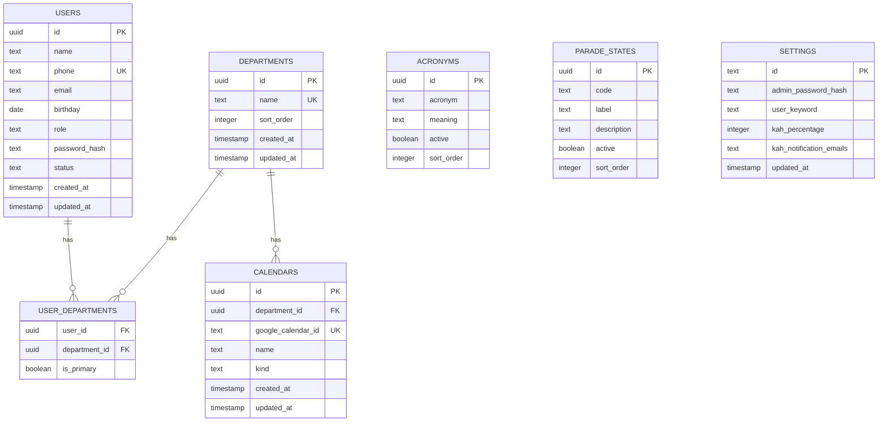

### 1.3.3 Auth & routing

- `src/lib/auth.ts` — NextAuth config: Credentials + JWT, admin/user resolution, JWT/session
  callbacks that carry `id`, `role`, `phone`
- `src/lib/login.ts` — pure (I/O-free) login parsing: `parseUserLogin`, `classifyLogin`
- `src/lib/session.ts` — `requireSession`, `requireAdmin`, `getSession` guards
- `src/types/next-auth.d.ts` — session/JWT type augmentation
- `src/app/api/auth/[...nextauth]/route.ts` — auth handler
- `src/app/login/page.tsx` + `src/components/LoginForm.tsx` — login page + form
- `src/app/(protected)/layout.tsx` + `dashboard/page.tsx` + `AppShellShell` — protected
  dashboard shell
- `src/components/` — `AcronymBadge`, `CalendarSelect`

### 1.3.4 Google integration (stub)

- `src/lib/google/types.ts` — `GoogleIntegration` interface
- `src/lib/google/stub.ts` — no-op implementation
- `src/lib/google/index.ts` — `getGoogleIntegration()` returns the stub until credentials
  are provisioned

### 1.3.5 Tests

- `src/lib/login.test.ts` — 8 passing tests (login parsing)

## 1.4 Verification status

| Check              | Result                |
| ------------------ | --------------------- |
| `pnpm build`       | pass                  |
| `pnpm lint`        | pass                  |
| `pnpm typecheck`   | pass                  |
| `pnpm test`        | 8/8                   |
| `pnpm db:generate` | 7 tables, 1 migration |

## 1.5 Deployment (Vercel) — current blocker & fix

Vercel auto-builds: `main` → production, `dev` → preview.

Two issues were diagnosed and fixed in-repo (committed and pushed to both `dev` and `main`):

1. **`TypeError: Invalid URL` during `/login` prerender.** Caused by an empty
   `NEXTAUTH_URL` env var (NextAuth's `parseUrl` does `new URL('')`). Fix: leave
   `NEXTAUTH_URL` **unset** on Vercel — it injects `VERCEL_URL` and NextAuth falls back
   automatically.
2. **"Ignored build scripts" warning** (esbuild, sharp, unrs-resolver). Root cause: Vercel
   detects pnpm **10** from `lockfileVersion: 9.0` and ignores the pnpm-11 `allowBuilds`
   config. Fix: enable Corepack so Vercel honors `packageManager: pnpm@11.18.0`.

### 1.5.1 Remaining manual steps (Vercel dashboard)

- [x] Add `ENABLE_EXPERIMENTAL_COREPACK` = `1` — done, build passes with no warnings
- [x] Add `NEXTAUTH_SECRET` (`openssl rand -base64 32`) — done per user
- [x] Add `DATABASE_URL` (Neon) — done per user
- [x] Remove any empty `NEXTAUTH_URL` — done per user
- [x] Redeploy and confirm build passes — done, no warnings
- [ ] Set `ADMIN_INITIAL_PASSWORD` on Vercel (seeds the admin password hash on first login)
- [x] Add `DATABASE_URL` as a GitHub Actions repo secret (feeds the CI migrate job)

## 1.6 CI migrations (Phase 1.5)

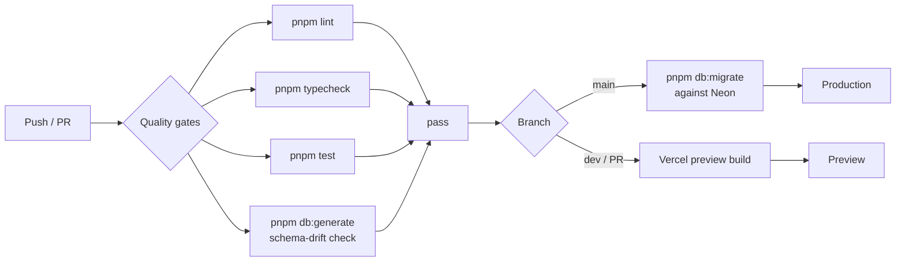

- `migrate` job added to `.github/workflows/ci.yml`: `needs: quality`, runs only on
  `main` push (`if: github.ref == 'refs/heads/main'`), serialized via a `db-migrate`
  concurrency group so concurrent pushes can't race. Applies `pnpm db:migrate` against
  Neon using the `DATABASE_URL` repo secret.
- Single shared Neon DB across Vercel `dev`/`main`, so main-only migration keeps both
  environments schema-synced. Pending `0000` + `0001` apply automatically on the next
  `main` push — no local migrate step needed.

## 1.7 Bootstrap & schema hardening (Phase 1.5)

- `settings` table now has a `settings_singleton` CHECK constraint (`id = 'singleton'`,
  `text` PK with default) — a second row is impossible. Migration `0001` generated.
- `drizzle/meta/` is now **committed** (was gitignored). CI schema-drift step is
  `pnpm db:generate && git diff --exit-code -- drizzle/` so drift actually fails the build.
- `src/lib/bootstrap.ts` `ensureSettingsRow()` lazily seeds the singleton settings row on
  first auth, hashing `ADMIN_INITIAL_PASSWORD` (env). Called at the top of `authorize` in
  `src/lib/auth.ts`. Race-safe via `onConflictDoNothing` + check constraint.
- `ADMIN_INITIAL_PASSWORD` added to `.env.example`.

## 1.8 Roster & Departments (Phase 2a)

- **`src/lib/roster/validate.ts`** — pure helpers: `normalizePhone` (exactly 8 digits after
  stripping), `validateUserForm`, `validateDepartmentForm`. Unit-tested (15 cases).
- **`src/lib/roster/queries.ts`** — `listUsers()` (join `user_departments` + `departments`,
  primary flag, sorted), `listDepartments()`.
- **`src/lib/roster/actions.ts`** — Server Actions guarded by `requireAdmin()`:
  `createUser`, `updateUser`, `setUserStatus` (deactivate-only; no hard delete),
  `createDepartment`, `updateDepartment`, `deleteDepartment`. Exactly-one-primary enforced;
  unique-violation errors mapped to form fields; `revalidatePath` after mutations.
- **`/roster`** — admin-only table (search name/phone, filter status + department, badges
  for role/status/departments with primary marked), create/edit modal, activate/deactivate.
- **`/departments`** — admin-only name + sortOrder CRUD, delete-with-cascade confirm.
- **`AppShellShell`** — Roster/Departments nav links only for admins (role passed from the
  protected layout).
- Verification: migrations applied to Neon (2/2), all 7 tables live, roster queries hit the
  live DB. `pnpm build/lint/typecheck/test` all pass.

## 1.9 Seeding (Phase 2b)

- **`src/db/seed.ts`** — `pnpm db:seed` (tsx). Idempotent, refuses to run with
  `NODE_ENV=production`. Reads `DATABASE_URL` from env or `.env.local`. Seeds 4
  departments, 4 users, 5 memberships; also sets `settings.userKeyword = 'leave'` when
  empty so seeded users can log in as `[phone]leave`. Verified: 4/4/5 created, re-run
  inserts 0.

## 1.10 Next.js 16 upgrade & auth fix (Phase 2c)

**Root cause of login crash (`useEffectEvent is not a function`):** Next.js 15.5.23
bundles its own React (`19.2.0-canary-0bdb9206-20250818`) and aliases all `react`
imports to it at runtime — the installed React version is bypassed. That bundled React
had no `useEffectEvent`, which Mantine v9.5.1 (peer `react ^19.2.0`, the whole v9 line
requires React 19.2 stable) calls inside `AppShell`. The protected shell crashed right
after login on both Vercel and local. This predated the roster work (latent since
Phase 1); it surfaced once login reached the protected layout.

**Fix:** upgraded Next.js `15.5.23` → `16.3.1` (the line that bundles React 19.2 stable;
installed bundle is `19.3.0-canary` with `useEffectEvent`). Also `eslint-config-next`
`15.5.23` → `16.3.1`.

- `eslint.config.mjs` rewritten: Next 16 ships flat configs directly, so
  `next/core-web-vitals` + `next/typescript` are imported as arrays instead of via
  `FlatCompat` (the legacy wrapper crashed with a circular-structure error).
- `next.config.ts` unchanged (`experimental.optimizePackageImports` still valid).
- tsconfig auto-updated by Next 16: `jsx: preserve` → `react-jsx`, added
  `.next/dev/types/**/*.ts`.
- Verified with `next start`: admin login → dashboard/roster/departments 200;
  non-admin (Bob `82345678leave`) → dashboard 200, `/roster` + `/departments` 307 →
  `/dashboard`. `pnpm build/lint/typecheck/test` (23) pass.

## 1.11 Departments as Google Calendars + sharing + audit (Phase 2d)

Departments are now Google Calendars: the `calendars` table is the department registry,
Google Calendar is the source of truth for existence/ACLs, and nothing sharing-related is
stored in the DB.

- **Schema** — migrations `0002`–`0004`: `users.department_id` (backfilled from
  `user_departments`, then `departments`/`user_departments` dropped), `calendars` no
  longer references `departments`, new `audit_logs` table. `src/db/schema.ts` rewritten
  to match `0004` exactly (verified: `pnpm db:generate` produces no diff).
- **Google layer** — `src/lib/google/config.ts` (env parsing, `getServiceAccountConfig`,
  `getAdminGoogleEmail`), `real.ts` (JWT service account, Calendar v3; event/Gmail methods
  still throw "not implemented yet"), `types.ts` (interface + `GoogleCalendarInfo`),
  `stub.ts` (no-op fallback), `index.ts` (`getGoogleIntegration()` real-when-configured,
  `googleCalendarConfigured()`). Env vars: `GOOGLE_SERVICE_ACCOUNT_BASE64` (or
  `GOOGLE_CLIENT_EMAIL`/`GOOGLE_PRIVATE_KEY`) + `GOOGLE_DELEGATE_EMAIL`.
- **Sharing** — `src/lib/roster/shares.ts` (`listDepartmentAccess` reconciles assigned
  users as readers, grants admin owner, returns `DepartmentAccess`); actions
  `get/grant/revokeDepartmentAccess`; UI modal `DepartmentShares.tsx` (copy calendar ID,
  add/remove manual shares, surfaces `syncWarning` when Google is unconfigured).
- **Audit** — `audit_logs` written best-effort via `src/lib/audit/log.ts` +
  `build.ts` (actions `user.create`/`calendar.create`/`access.grant`/…, field diffs via
  `diff.ts`). Hooked into roster + calendar + share server actions.
- **Roster (single-department)** — `users` has one `department_id`; `queries.ts`
  `listUsers()` left-joins `calendars`, `UserTable`/`UserForm` use a single clearable
  department select; `actions.ts` `createUser`/`updateUser`/`setUserStatus`.
- **Departments page** — `DepartmentTable` lists calendars (name + calendar ID) with
  Share/Rename/Delete; `DepartmentForm` creates/renames a Google Calendar; creation is
  blocked with a clear message when Google is unconfigured.
- **New dependency** — `@tabler/icons-react` added (used by `DepartmentShares`).
- Verification: `pnpm build/lint/typecheck/test` (53) pass; `db:generate` shows no schema
  drift.

## 1.12 Mobile-only UI refactor and Users rename (Phase 2e)

The app is **strictly mobile-only**: no desktop sidebar/hamburger layout exists anymore.

- **Bottom nav** — `src/components/AppShellShell.tsx` renders `AppShell.Footer` with
  icon + label links (Dashboard `IconLayoutDashboard`, Users `IconUsers`, Departments
  `IconBuilding`; non-admins see only Dashboard). Header is a slim centered "Cloudy" brand
  bar; footer adds `env(safe-area-inset-bottom)` padding. Active tab matched via
  `pathname.startsWith(href)`.
- **Card lists** — `UserTable` and `DepartmentTable` render each row as a stacked
  `Paper` card (badges + action buttons) instead of `<Table>`; the users filter bar stacks
  vertically. Modals (`UserForm`, `DepartmentForm`, `DepartmentShares`, delete confirm)
  are floating `centered` dialogs with a fixed `size`.
- **"Users" rename** — nav label + page title "Roster" → "Users"; route `/roster` moved
  to `/users` (`git mv src/app/(protected)/roster src/app/(protected)/users`,
  `RosterPage` → `UsersPage`). `src/lib/roster/actions.ts` `revalidatePath` calls and the
  `src/lib/audit/build.test.ts` route fixtures updated. The internal `src/lib/roster/*`
  module namespace is intentionally left as "roster".
- Verification: `pnpm lint`, `pnpm typecheck`, `pnpm test` (53), and `pnpm build` all
  pass; build route list shows `/users` and no `/roster`.

## 1.13 Admin Settings hub and login keyword (Phase 2f)

The Users and Departments sections now live under a single **Admin Settings** hub,
reachable only via the profile icon in the header. The bottom nav bar is gone.

- **Routing** — `src/app/(protected)/users` and `.../departments` moved to
  `src/app/(protected)/settings/users` and `.../settings/departments`. A new
  `settings/layout.tsx` calls `requireAdmin()` once (removed from the two pages) and
  renders a horizontal, scrollable `SettingsTabs` bar; `settings/page.tsx` redirects
  `/settings` → `/settings/users` (Users is the default tab). Tabs: **Users**
  (`/settings/users`), **Departments** (`/settings/departments`), **Event Types**
  (`/settings/event-types`), **Templates** (`/settings/templates`), **General**
  (`/settings/general`) — Event Types and Templates were added in phases 2g and 2p.
  `next.config.ts` adds permanent redirects from the old `/users` and `/departments`
  URLs.
- **Keyword setting (General tab)** — new `src/lib/settings/*` module mirroring the
  roster module: `validate.ts` (`normalizeKeyword` → trimmed, lowercased, `/^[a-z]{1,12}$/`,
  plus `validateKeywordForm`; unit-tested), `queries.ts` (`getSettings()` returns only
  `userKeyword`, never the admin password hash), `actions.ts` (`updateKeyword` server
  action: `requireAdmin`, validate, `UPDATE settings`, audit log `settings.update` with a
  field diff, `revalidatePath("/settings/general")`). `AUDIT_ACTIONS.settingsUpdate` added
  to `src/lib/audit/build.ts`.
- **Navigation** — `AppShellShell` drops the `AppShell.Footer`/bottom nav entirely; the
  "Cloudy" brand is now a link to `/dashboard`. `UserMenu` takes a `role` prop and shows an
  **Admin Settings** item (→ `/settings`) for admins only, above Log out.
  `FloatingToolbar` bottom offset changed from the old footer clearance (76px) to
  `calc(env(safe-area-inset-bottom) + 16px)`.
- **Revalidation** — `src/lib/roster/actions.ts` `revalidatePath` targets updated to
  `/settings/users` and `/settings/departments`.

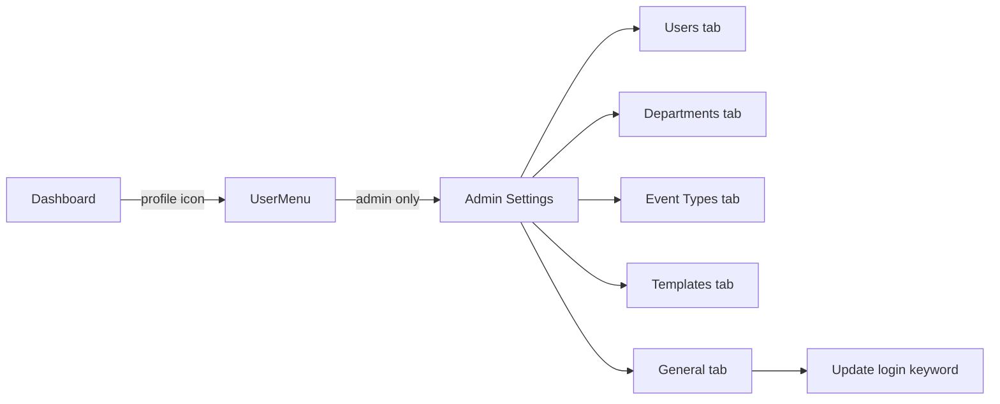

- Verification: `pnpm lint/typecheck/test/build` pass; no schema change so `db:generate`
  shows no drift.

## 1.14 Event Types (Phase 2g)

A new **Event Types** tab in Admin Settings lets admins define the list of event names that
can later be tagged onto calendar events. This phase ships only the lookup list (create /
rename / delete) — tagging onto events is a future phase.

- **Schema** — migration `0005` adds `event_types` (`id` uuid pk, `name` text not null,
  `created_at`/`updated_at`) with a unique index on `name` so the same tag can't be defined
  twice. `src/db/schema.ts` exports the `eventTypes` table + `EventType` type. Phase 2p adds
  an app-required, unique `shortname` acronym (migration `0009`, mirroring `users.shortname`).
- **Module** — `src/lib/eventTypes/*` mirrors the roster module:
  `validate.ts` (`validateEventTypeForm`, unit-tested), `queries.ts` (`listEventTypes()`
  ordered by name; `getEventTypesByNames()` for title rendering), `actions.ts`
  (`createEventType`/`renameEventType`/`deleteEventType` server actions — `requireAdmin`,
  validate, DB op, audit log, `revalidatePath`, unique violation → "already exists" error,
  routed by constraint for `name` vs `shortname`).
- **UI** — `src/app/(protected)/settings/event-types/` (`page.tsx`, `EventTypeTable.tsx`
  card list showing name + shortname, Rename/Delete + floating "Add event type" button,
  `EventTypeForm.tsx` centered modal with required Name + Shortname, `loading.tsx` skeleton).
  Added to `SettingsTabs` between Departments and General.
- **Audit** — `AUDIT_ACTIONS` gains `eventType.create`/`eventType.rename`/
  `eventType.delete`.
- Verification: `pnpm lint`, `pnpm typecheck`, `pnpm test` (68), `pnpm build`, and
  `pnpm db:generate` (no drift) all pass; build route list shows `/settings/event-types`.

## 1.15 Next steps (Phase 2+)

1. Wire the real Gmail method in `real.ts` (Gmail send-as, KAH visibility) — calendar
   event read/write is now implemented.
2. Core screens still pending: KAH constraint checks, parade states, acronyms on event
   titles, on-behalf/masquerade permissions, and VCF contacts export.
3. Gmail notifications for KAH percentage breaches.

## 1.16 Calendar events (Phase 2h)

The `/dashboard` placeholder is replaced by a real month calendar with full event
create/edit/delete/view. Events remain 100% in Google Calendar — no event table exists.

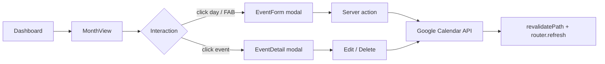

- **Dependency** — added `@mantine/schedule@9.5.1` (the `MonthView` component) and `dayjs`
  (its required peer). `@mantine/dates/styles.css` + `@mantine/schedule/styles.css` imported
  in `src/app/layout.tsx` (order: core → dates → schedule).
- **Google layer** (`src/lib/google/`) — implemented `createEvent`/`updateEvent`/
  `deleteEvent`/`listEvents` in `real.ts` (`events.insert/update/delete/list`,
  `singleEvents: true`, `orderBy: startTime`); `listEvents` added to the interface + stub.
  All-day events use Google's `date` field with an exclusive end date; timed events use
  `dateTime`. `GcalEventItem` added for read-back.
- **Events module** (`src/lib/events/*`, mirrors `roster`/`eventTypes`):
  - `notes.ts` — pure encode/parse of the machine-readable "notes" JSON block stored in the
    event `description` (currently `{ eventType }`, extensible for future fields).
  - `datetime.ts` — pure date/time helpers; wall-clock times are treated as fixed
    `Asia/Singapore` (UTC+8, no DST) so conversions are deterministic and testable.
  - `validate.ts` — pure form validation (title/start/end, end ≥ start).
  - `queries.ts` — `listCalendars`, `getUserDepartmentId`, and `fetchMonthEvents` which reads
    events across the selected calendars and maps them to `CalendarEvent` (schedule-ready
    data with a `payload` carrying calendar id, Google event id, all-day flag, and parsed
    event type).
  - `actions.ts` — `createEvent`/`updateEvent`/`deleteEvent` server actions (`requireSession`,
    audit-logged, `revalidatePath("/dashboard")`). Admins pick a target calendar; regular
    users always target their own department.
- **Dashboard** (`src/app/(protected)/dashboard/`) — `page.tsx` (server) reads `month`/`cal`/
  `types` search params and fetches events; `DashboardView.tsx` (client) renders a custom
  header + `MonthView` (`withHeader={false}`), `FilterButton` → `FilterModal` (Calendars +
  Event Types groups), `EventForm.tsx` (description, all-day toggle swapping
  `DateTimePicker` ↔ `DatePickerInput`, event-type `Select`, admin calendar `Select`),
  `EventDetail.tsx` (view + Edit/Delete), a `loading.tsx` skeleton, and a FAB.
- **Default view** — non-admin shows only their department calendar; admin shows all
  calendars. The filter always offers every calendar + every event type (regardless of
  access). Google unconfigured → empty calendar + a notice, and the FAB is disabled.
- **Audit** — `AUDIT_ACTIONS` gains `event.create`/`event.update`/`event.delete`.
- Verification: `pnpm lint`, `pnpm typecheck`, `pnpm test` (86), `pnpm build` (route list
  shows `/dashboard`), and `pnpm db:generate` (no drift — no schema change) all pass.

## 1.17 Dashboard mobile month view (Phase 2i)

`/dashboard` now supports two views, switched by an icon `SegmentedControl` in the header
row: the default `MonthView` grid, and `@mantine/schedule` `MobileMonthView` (month grid
with event-dot indicators). The choice persists in the URL as `?view=mobile` (omitted =
month), matching the existing `month`/`cal`/`types` URL-state pattern. No new dependency —
`MobileMonthView` and `AgendaView` ship in the already-installed `@mantine/schedule@9.5.1`.

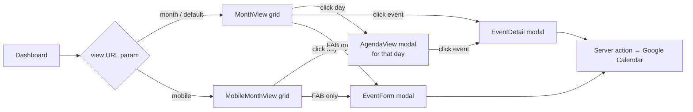

- **Toggle** — `SegmentedControl` (`size="xs"`, `aria-label="Calendar view"`) with
  `IconCalendarMonth` / `IconCalendarDot` segments, placed between "Today" and the filter
  button in `DashboardView.tsx`. `switchView()` writes/removes the `view` param via the
  existing `navigate()` URL helper (month is the default, so the param is omitted for it).
  `dashboard/page.tsx` reads `view` (`params.view === "mobile" ? "mobile" : "month"`) and
  passes it through; both views render the same fetched month events.
- **MobileMonthView** — rendered when `view === "mobile"`. A day tap (`onDayClick`) opens
  the day-agenda modal shared with MonthView (whose old tap-to-create was replaced by the
  same modal, so creation is strictly from the floating "New event" button in both views —
  its default date stays "today"; the form's date picker covers other days). The
  component's built-in header (year back-button + a month label duplicating our own) and
  bottom event list (duplicated by the agenda modal) are hidden via the `styles` prop:
  `mobileMonthViewHeader` and `mobileMonthViewEventsList` → `{ display: "none" }`. The app's
  own header row remains the only navigation chrome.
- **AgendaView modal** — a day tap in either view opens a floating `centered`
  `size="sm"` modal titled with the full day (e.g. "Saturday, August 16, 2026"), wrapping
  `AgendaView` with a single-day range (`rangeStart` = `rangeEnd` = tapped day) and the
  month's events. `agendaViewHeader` is hidden via `styles` because its label renders
  "X – X" even for a single day; the modal title carries the date instead. Clicking an
  event opens `EventDetail` on top — the agenda modal is rendered before `EventDetail` in
  the tree so its portal mounts first and the detail modal stacks above it. Deleting from
  the detail closes both the detail and the agenda modal before `router.refresh()`, so a
  deleted event doesn't linger in the open agenda list.
- **Mantine 9.5.1 gotchas (verified against the installed package source)** —
  `MobileMonthView` has **no `withHeader` prop** (unlike `MonthView`); the built-in
  header is the only leak and must be suppressed with `styles` overrides. `classNames`
  takes class-name **strings**, not `CSSProperties` — inline style overrides go in the
  `styles` prop, which is deep-merged over the component's own styles with user values
  winning. `EventDetail`'s detail/confirm portals mount only while open, which is what
  makes the agenda → detail stacking order work.
- **Verification** — `pnpm lint`, `pnpm typecheck`, `pnpm test` (86), `pnpm build` (route
  list still shows `/dashboard`), and `pnpm db:generate` (no drift — no schema change) all
  pass.

## 1.18 Agenda day swipe (Phase 2j)

The agenda modal's day can now be changed by swiping left/right across the agenda list
(touch) or dragging it horizontally (mouse), plus prev/next `ActionIcon` chevrons
flanking the date in the modal title for mouse/keyboard use. Swipe left = next day,
swipe right = previous day.

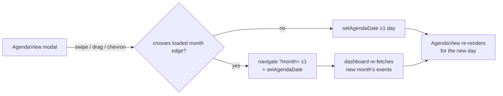

- **Implementation** — `DashboardView.tsx` only, using `useDrag` from the
  already-installed `@mantine/hooks` (no new dependency): options
  `{ axis: "lock", axisThreshold: 8, threshold: 10, filterTaps: true }`. The day changes
  on pointer release when horizontal displacement ≥ `DAY_SWIPE_THRESHOLD` (48px) after
  axis locking; canceled gestures (the browser taking over vertical scroll →
  `pointercancel`) and taps are ignored, so event-row taps still open `EventDetail`.
- **Scroll coexistence** — the wrapper `div` around `AgendaView` sets
  `style={{ touchAction: "pan-y" }}`: native vertical scrolling of a long agenda day is
  kept by the browser, and horizontal gestures are delivered as pointer events. A one-shot
  `onClickCapture` guard swallows the click that would otherwise fire when a mouse drag
  ends on an event row.
- **Month auto-navigation** — events are fetched per calendar month
  (`fetchMonthEvents`), so swiping past the first/last day of the loaded month updates
  `?month=` through the existing `navigate()` URL helper while setting `agendaDate`; the
  `agendaDate` client state survives the RSC navigation, so the modal stays open and the
  agenda repopulates from the new month's `events` prop. `shiftAgendaDay(±1)` is the
  shared helper behind both the chevrons and the swipe handler.
- **Verification** — `pnpm lint`, `pnpm typecheck`, `pnpm test` (86), and `pnpm build`
  all pass; dev-server smoke check shows `/dashboard` 307 → `/login` (auth redirect) and
  `/login` 200.

## 1.19 Schedule view & event invitees (Phase 2k)

`/dashboard` now has three views behind a full-viewport **tab strip** (replacing the old
icon-only `SegmentedControl`): **Month** (`IconCalendarMonth`), **Mobile**
(`IconCalendarDot`), **Schedule** (`IconCalendarUser`) — each tab shows its icon and
label, with the tabs stretched across the viewport above the date-navigation row. The
Schedule view is `@mantine/schedule` `ResourcesDayView`: one row per **user** of the
selected (filtered) departments, plus a **department row** at the top of each department
section. Group header columns appear only when more than one department is filtered.
The day navigates with `‹`/`›`/Today (`?date=YYYY-MM-DD`; `?month` is kept in sync and
derived from `date` by the page), and `?view=schedule` is the URL state.

Because events previously carried no link to a person, this phase adds the **invitee
system**. The notes JSON block on Google events gains three fields (no DB migration —
the notes block is the app's own extensible format):

- `createdBy` — the creating user's id; the creator's row **always** shows the event.
- `inviteeUsers` — ids of tagged users; the event also appears in each of their rows.
- `inviteeDepartments` — ids of tagged department calendars; the event appears in each
  department row.

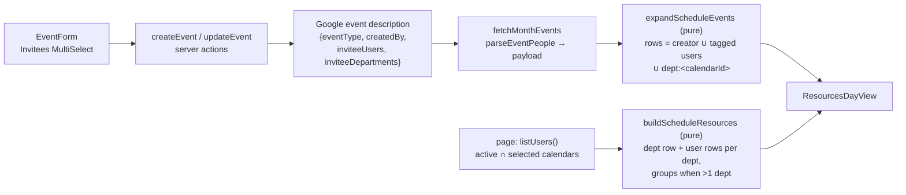

- **Notes** (`src/lib/events/notes.ts`) — `EventNotes` gains `createdBy?`,
  `inviteeUsers?`, `inviteeDepartments?`; `encodeEventNotes` now also strips empty
  arrays; new pure `parseEventPeople(description)` returns `{ creatorId, userIds,
departmentIds }` and tolerates absent/malformed values (unique, non-empty strings
  only). Unit-tested in `notes.test.ts` (12 cases now).
- **Schedule helpers** (new `src/lib/events/schedule.ts`, all pure, all unit-tested in
  `schedule.test.ts` — 12 cases):
  - `departmentRowId`/`isDepartmentRowId` — resource rows keyed `dept:<calendarId>` to
    keep them distinct from user-uuid rows.
  - `rowsForEvent(people)` — union of creator, tagged users, and tagged departments,
    deduped.
  - `expandScheduleEvents(events)` — one `ScheduleEvent` per row (`id` suffixed
    `::rowId`, `resourceId` set); events linked to no one expand to nothing.
  - `buildScheduleResources({ departments, users, events })` — per selected department:
    a department row then its active users (sorted by name); a userless department is
    kept only when an event tags it; `groups` emitted only for >1 department.
- **Queries** (`src/lib/events/queries.ts`) — `CalendarEventPayload` gains
  `creatorId`/`inviteeUserIds`/`inviteeDepartmentIds`, populated in
  `fetchMonthEvents` via `parseEventPeople`. Month/Mobile/Agenda views ignore the new
  fields.
- **Form & actions** — `EventFormValues` gains `creatorId` + the two invitee arrays
  (pass-through, no new validation). `EventForm` adds an "Invitees" `MultiSelect`
  (Mantine v9's dedicated multi-select component; v9 `Select` has no `multiple` prop)
  with grouped data (`user:<id>` / `dept:<id>` prefixed values disambiguate the two
  uuid namespaces; split on submit). Picker scope: non-admins → own department + its
  active users; admins → all departments + all active users. `creatorId` is the session
  user on create and is **preserved from the original payload on edit** (editing never
  reassigns the creator row). `actions.ts` writes the three notes fields and audit
  `details` record invitee counts.
- **Page** (`dashboard/page.tsx`) — `view` enum gains `"schedule"`; `date` param
  (validated `YYYY-MM-DD`, default today) drives the month when present. One
  `listUsers()` call derives: schedule rows (active users in the selected calendars),
  role-scoped invitee picker options, and the `peopleNames`/`calendarNames` maps for
  the detail modal.
- **DashboardView** — top `Tabs` strip (controlled, equal-width `flex: 1` tabs with
  icon + label; `Tabs` `onChange` is typed `string | null`) → `switchView` writes
  `?view=schedule&date=today` on entry (month left to be derived) and restores the
  viewed month on exit. Schedule render: `ResourcesDayView` with `withHeader={false}`,
  full-day range (`00:00:00`–`23:59:59`, 60-min intervals, `startScrollTime 07:00`),
  `withCurrentTimeIndicator`, current-time bubble, `onEventClick` → existing
  `EventDetail`, and `renderResourceLabel` styling department rows (building icon +
  bold). Empty state (no rows for the filter) shows a `Paper` notice instead of an
  empty grid. `ScheduleGridSkeleton` (label + lane rows) backs the `isPending` state.
  The date-nav row reuses its chevrons/Today in day mode (`ddd, MMM D, YYYY`).
- **EventDetail** — "People:" badges (creator + tagged users, deduped, resolved via
  `peopleNames`) and "Departments:" badges (tagged departments other than the event's
  own calendar, resolved via `calendarNames`); unknown ids are silently skipped.
- **Back-compat** — events created before this phase have no people fields, so they
  still render in Month/Mobile/Agenda but intentionally do **not** appear in any
  Schedule row (no row key to attach to). Tagging remains optional.
- **Verification** — `pnpm lint`, `pnpm typecheck`, `pnpm test` (103), `pnpm build`,
  and `pnpm db:generate` (no drift — no schema change) all pass. Dev-server smoke
  against the live dev Google Calendar: `/dashboard`, `?view=mobile`,
  `?view=schedule` all 200 with the three tabs rendered (`role="tab"`, correct
  `aria-selected`); a temporary event tagged with the active user + their department
  read back from Google rendered **in both** the department row and the user row of
  `ResourcesDayView`; pre-existing untagged events correctly stayed out of the
  schedule rows; the smoke event was deleted afterwards.

## 1.20 Cross-department event copies (Phase 2l)

The event form **no longer offers a calendar picker** (admins included). Where an event
lives is derived from its people: the **creator's department** plus every **tagged
user's department** plus every **tagged department** — one Google Calendar copy per
target calendar. When everyone is in one department this is exactly one event (the
pre-2l behavior, now automatic); a creator with no department can create an event only
by tagging at least one invitee, otherwise creation is blocked with
"Assign yourself to a department or tag an invitee".

All copies of a logical event share a new `eventId` (UUID) in the notes JSON — the
linking mechanism. No DB table is added (events stay 100% in Google Calendar), and
copies are rediscovered by listing each target calendar and matching the `eventId` in
the event description.

```mermaid
sequenceDiagram
    participant F as EventForm
    participant A as events/actions
    participant D as departments (db)
    participant G as Google Calendar
    F->>A: create / update(ref, values) — no calendarId
    A->>D: creator + invited users' departments
    A->>A: targets = union(creatorDept, inviteeDepts, taggedDepts)
    Note over A,G: create: insert one copy per target (same eventId in notes),<br/>rollback partial copies on failure
    Note over A,G: update: per calendar in old∪new targets, list over old∪new time
    range (±1 day), match notes.eventId →<br/>create missing / update existing / delete retired
    Note over A,G: delete: per target in notes-derived set, list + delete all matches
```

- **Targets module** (new `src/lib/events/targets.ts`, pure, unit-tested — 9 cases
  in `targets.test.ts`): `deriveTargetCalendarIds` (creator ∪ invited users' depts ∪
  tagged depts, deduped, nulls dropped), `diffEventTargets` (create/keep/remove plan),
  `dedupeEventsByGroupId` (first copy per group id wins; input order decides the
  representative), and `EventRef` + `eventRefFromCalendarEvent` (the representative
  copy's fields passed to edit/delete).
- **Notes** (`src/lib/events/notes.ts`) — `EventNotes.eventId?`;
  `parseEventPeople` now also returns `eventId: string | null`.
- **Datetime** (`src/lib/events/datetime.ts`) — new `absEventRange(naiveStart,
naiveEnd, allDay)`: timed events parse as UTC+8 instants, all-day events use Google's
  date / exclusive-end-date semantics. `buildGcalEventInput` refactored onto it; the
  reconcile search range is `unionRange(old, new)` grown ±1 day so copies whose times
  drifted (or are being moved) are still found.
- **Queries** (`src/lib/events/queries.ts`) — `CalendarEventPayload.eventId`; the
  calendars row fetch is ordered by name so the deduped representative is
  deterministic; `fetchMonthEvents` returns `dedupeEventsByGroupId(events)` — with
  several department calendars filtered (admin default) a logical event shows **once**
  in Month/Mobile/Agenda/Schedule. New batched `getUserDepartmentIds(userIds)`.
- **Actions** (`src/lib/events/actions.ts`) — rewritten around `EventRef`:
  - `createEvent`: derive targets (empty ⇒ block error), `eventId =
crypto.randomUUID()`, one copy per target; a mid-loop failure rolls back the copies
    already created; audit entry carries `eventId`, target calendar ids/names, and the
    Google event ids.
  - `updateEvent(ref, values)`: `oldTargets` from the ref's people fields, `newTargets`
    from the form; per calendar in the union, `findCopies` (notes `eventId` match; on a
    legacy first edit also the `googleEventId` in the representative calendar) drives
    create / full-contents update / delete. The plan is idempotent, so a half-failed
    attempt self-heals on retry; newly created copies roll back on failure.
  - `deleteEvent(ref)`: targets from the ref's people fields, then list + delete every
    matching copy.
  - **Legacy events** (no `eventId`): keep working as single events; the first edit
    generates the group id, backfills it into the existing copy, and — once invitees are
    spread across departments — converges by creating the missing copies. When nothing
    else derives, the target set falls back to the representative calendar so editing a
    legacy event never blocks.
  - Malformed client bodies (non-array invitee fields) are coerced instead of 500ing.
  - `EventFormValues` drops `calendarId` (and the form/admin picker with it);
    `EventActionResult` no longer targets that field.
- **UI** — `dashboard/page.tsx` drops `initialCalendarId`; `EventForm` drops the
  Calendar `Select` (invitees `MultiSelect` description now explains the per-department
  copies); `EventDetail`/`EventForm` build the `EventRef` via
  `eventRefFromCalendarEvent` for `updateEvent`/`deleteEvent`.
- **Verification** — `pnpm lint`, `pnpm typecheck`, `pnpm test` (114), `pnpm build`,
  and `pnpm db:generate` (no drift — no schema change) all pass. Live smoke against the
  dev Google Calendar (via a temporary authenticated route, removed afterwards):
  admin without a department + no invitees → blocked with the clear error; tagging an
  active dev-COU user + the dev-CIU department → exactly two copies sharing one
  `eventId`, one per calendar; all-calendars read deduped to a single event; renaming +
  time-shifting + dropping the dev-CIU tag in one edit → dev-CIU copy deleted, dev-COU
  copy updated in place with the new title/times; re-tagging dev-CIU → copy recreated
  under the same `eventId`; delete → both copies gone; editing a legacy event →
  `eventId` backfilled with the single copy preserved.

## 1.21 User shortname (Phase 2m)

Users now carry a **shortname** (acronym/initials), captured in the Users create/edit form and
stored for future phases (e.g. schedule/KAH displays) to leverage. Per product decisions: the
field is **required** in the form, **unique** across users, and stored **exactly as typed**
(no normalization).

- **Schema** — migration `0006` adds `users.shortname` (nullable `text`, so the auto-applied
  migration is safe on the populated Neon `users` table) plus a unique index
  `users_shortname_idx` (Postgres allows multiple NULLs under a unique index, so legacy rows
  are untouched). `src/db/schema.ts` updated to match; `drizzle/meta/` journal + snapshot
  committed.
- **Validation** (`src/lib/roster/validate.ts`) — `UserFormValues` gains required
  `shortname: string`, `UserFormErrors` gains `shortname?`; `validateUserForm` returns
  "Shortname is required" for blank/whitespace. Stored as typed — no uppercase/trimming.
- **Actions** (`src/lib/roster/actions.ts`) — `createUser`/`updateUser` write `shortname`,
  the audit snapshot (`userSnapshot`) and `diffFields` include it, and audit `details` carry
  it. `RosterActionResult.field` gains `"shortname"`; the `23505` catch now routes by the
  violated constraint (postgres-js `constraint_name`): `users_shortname_idx` → "A user with
  this shortname already exists" on the shortname field, otherwise the existing phone message.
- **Queries** (`src/lib/roster/queries.ts`) — `RosterUser.shortname: string | null` selected
  and mapped in `listUsers()`.
- **UI** (`UserForm.tsx`) — new required `Shortname` `TextInput` ("e.g. ALICE") between Name
  and Phone; `initialValues` maps `user.shortname ?? ""` on edit; the submit handler surfaces
  the shortname duplicate error on the field. No card-list display change (deferred).
- **Tests** — `validate.test.ts` base form gains `shortname`; new required-shortname cases.
- Verification: `pnpm lint`, `pnpm typecheck`, `pnpm test`, `pnpm build`, and
  `pnpm db:generate` (no drift — migration `0006` in sync) all pass.

## 1.22 Display name template (Phase 2n)

Admins can define a **display name template** that composes each user's fully qualified name
from their name and department. The template is a global setting with `{name}` / `{department}`
placeholders (case-insensitive), e.g. `{name}: DEPT-{department}` renders
`John Lai: DEPT-Engineering 1`. The section lives as a card on the General settings tab, with a
live preview against an example and real users; the reusable helper is wired into the Users
admin card list as proof. Missing values (e.g. a user with no department) render as an empty
string (no gap-collapsing).

- **Schema** — migration `0007` adds `settings.name_template` (`text`, `NOT NULL` default
  `'{name}'`), so existing rows and the bootstrap insert both pick up the plain-name fallback.
  `src/db/schema.ts` updated; `drizzle/meta/` journal + snapshot generated. `ensureSettingsRow`
  needs no change.
- **Formatter** — new pure `src/lib/settings/formatName.ts`: `formatFullName({ name,
departmentName }, template)` substitutes every `{...}` token case-insensitively, resolves
  missing values to `""`, leaves unknown tokens literal, and trims the result. Unit-tested
  (`formatName.test.ts`, 9 cases).
- **Validation** (`src/lib/settings/validate.ts`) — `NameTemplateFormValues`/Errors and
  `validateNameTemplate` (non-empty after trim, ≤ 200 chars); `NAME_TEMPLATE_PLACEHOLDERS`
  (`["{name}", "{department}"]`) drives the insert chips. `validate.test.ts` gains 4 cases.
- **Actions** (`src/lib/settings/actions.ts`) — `updateNameTemplate(template)` mirrors
  `updateKeyword`: `requireAdmin`, validate, `UPDATE settings`, audit-log `settings.update`
  with a `nameTemplate` diff, `revalidatePath("/settings/general")`. `SettingsActionResult.field`
  gains `"nameTemplate"`.
- **Queries** (`src/lib/settings/queries.ts`) — `getSettings()` returns `nameTemplate`
  (falls back to `"{name}"`).
- **UI** (`src/app/(protected)/settings/general/`) — `page.tsx` also fetches `listUsers()`
  (first 5 for preview); `SettingsForm.tsx` gains a second "Display name template" `Paper`
  card: a `TextInput` with `{name}` / `{department}` chips that insert at the cursor, plus a
  live preview (the John Lai / Engineering 1 example then 5 real users) that re-renders as the
  admin types. Save button → `updateNameTemplate`. `loading.tsx` skeleton covers two cards.
- **Proof in Users list** — `settings/users/page.tsx` fetches `getSettings()` and passes
  `nameTemplate` to `UserTable`, where each card renders `formatFullName(...)` as a muted
  secondary line under the user's name.
- Verification: `pnpm lint`, `pnpm typecheck`, `pnpm test` (128), `pnpm build`, and
  `pnpm db:generate` (no drift — migration `0007` in sync) all pass.

## 1.23 Event title template (Phase 2o)

Admins can define an **event title template** that composes the title written to Google
Calendar events — the same "global template setting + pure formatter + insert chips +
live preview" pattern as the display name template (1.22). The template is
`settings.event_title_template` (default `'{description}'`, i.e. today's raw-description
behavior) expanded by the pure `formatEventTitle()` in
`src/lib/settings/formatEventTitle.ts`. Tokens are case-insensitive:

- `{description}` — the text the user typed into the event form ("Event Description")
- `{type}` / `{type:acronym}` — the event type name, and its shortname acronym (falling back
  to the name when blank); empty when no type is set
- `{people}` / `{people:full}` / `{people:acronym}` / `{people:fqn}` — invited personnel
  joined with `", "`; bare `{people}` and `{people:fqn}` render the fully qualified name
  (via the saved display-name template), `{people:full}` the plain name, and
  `{people:acronym}` the shortname (falling back to the name when blank)
- `{departments}` — invited departments joined with `", "`

Unknown tokens and unknown styles stay literal; empty lists render as `""` (no
gap-collapsing, consistent with `formatFullName`).

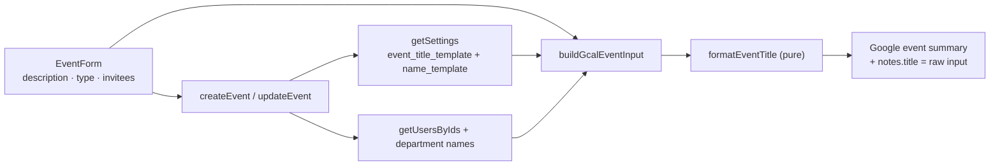

- **Schema** — migration `0008` adds `settings.event_title_template` (`text`, `NOT NULL`,
  default `'{description}'`), so existing rows and the bootstrap insert fall back to the
  plain description.
- **Formatter** — new pure `formatEventTitle(input, template)`: people arrive pre-resolved
  as `{ full, acronym, fqn }` per person, so the formatter is pure string substitution
  (token regex handles `{token}` and `{token:style}`). Unit-tested
  (`formatEventTitle.test.ts`, 12 cases).
- **Validation** (`src/lib/settings/validate.ts`) — `validateEventTitleTemplate`
  (non-empty after trim, ≤ 200 chars); `EVENT_TITLE_PLACEHOLDERS` drives the insert
  chips. 4 new cases in `validate.test.ts`.
- **Settings** — `getSettings()` returns `eventTitleTemplate`; new
  `updateEventTitleTemplate` server action (mirror of `updateNameTemplate`:
  `requireAdmin`, validate, `UPDATE settings`, audit `settings.update` with a diff,
  `revalidatePath("/settings/templates")`).
- **Round-trip fix** — the raw description is now stored in the notes JSON
  (`notes.title`; `parseEventTitle` in `src/lib/events/notes.ts`), so editing an event
  prefills the form with the _original_ text, not the rendered calendar title. Legacy
  events (no `notes.title`) fall back to the existing summary and are backfilled on
  first edit. `CalendarEventPayload.rawTitle` carries it to the client.
- **Events actions** (`src/lib/events/actions.ts`) — `createEvent`/`updateEvent` resolve
  the title context **once** per operation: invited people (name / shortname / FQN via
  the saved display-name template, using new `getUsersByIds()` in `src/lib/roster/queries.ts`),
  the event type's shortname (via `getEventTypesByNames()`), plus department names;
  `buildGcalEventInput` then renders the Google `summary` via the template. A template
  that renders to empty falls back to the raw description, so an event is never titled
  with an empty string. All department copies of one logical event share the same
  rendered title.
- **UI** (`src/app/(protected)/settings/templates/`, moved from General in Phase 2p) —
  "Event Title Template" card: input with insert-at-cursor chips for the eight tokens,
  hint lines explaining the type and people styles, and a live preview of a sample
  event (description "Team offsite" + first event type + up to two real users as
  invitees + their departments) that re-renders as the admin types.
- **Scoping** — only newly created/edited events re-render; existing Google summaries are
  untouched (legacy events lack the raw fields, so a bulk back-render isn't feasible).
  Changing the template does not rewrite past events.
- Verification: `pnpm lint`, `pnpm typecheck`, `pnpm test` (146), `pnpm build`, and
  `pnpm db:generate` (no drift — migration `0008` in sync) all pass.

## 1.24 Event type acronym + Templates tab (Phase 2p)

Two follow-ups to the template work: event types gain a required shortname acronym (like
users) that the event title template can render, and the two template cards move out of the
General tab into a dedicated **Templates** tab.

- **Event type shortname** — event types gain an app-required, unique `shortname` acronym,
  mirroring `users.shortname` (DB-nullable + unique index `event_types_shortname_idx`,
  migration `0009`; the app requires it). `validateEventTypeForm` flags a blank shortname;
  `createEventType`/`renameEventType` persist and audit it, and the unique-violation catch
  routes by constraint so a duplicate shortname errors on the shortname field. The
  `EventTypeForm` modal adds a required Shortname input; `EventTypeTable` cards show the
  shortname as a muted line under the name.
- **`{type:acronym}` token** — `formatEventTitle()` now takes the event type as
  `{ name, acronym } | null`: bare `{type}` renders the name and `{type:acronym}` the
  shortname (falling back to the name when blank), so `{type}` behaves as before.
  `EVENT_TITLE_PLACEHOLDERS` gains `"{type:acronym}"` (eight chips). `createEvent`/
  `updateEvent` resolve the shortname once per operation via new `getEventTypesByNames()`
  in `src/lib/eventTypes/queries.ts` (unknown names fall back to the name).
- **Templates tab** — the two template cards ("Display Name Template", "Event Title
  Template" — every word capitalized) move from `settings/general/` into a new
  `/settings/templates` route (`page.tsx` + `TemplatesForm.tsx` + `loading.tsx`) inserted
  into `SettingsTabs` before General. The General tab keeps only the login keyword card.
  `updateNameTemplate`/`updateEventTitleTemplate` now `revalidatePath("/settings/templates")`;
  `updateKeyword` still targets `/settings/general`. Preview data (first 5 users + event
  type names/shortnames) is fetched by the templates page.
- Verification: `pnpm lint`, `pnpm typecheck`, `pnpm test` (151), `pnpm build`, and
  `pnpm db:generate` (no drift — migration `0009` in sync) all pass; build route list shows
  `/settings/templates`.

## 1.25 Schedule view space optimization (Phase 2q)

The Schedule view (`ResourcesDayView`) reserved the most horizontal room of any dashboard
view: its two left columns — the group header (only when ≥2 departments are selected) and the
resource label — consumed 80px + 120px of a ~390px-wide phone before a single time slot
began. This phase compresses that gutter from 200px (multi-dept) / 120px (single-dept) down to
72px / 48px by showing acronyms instead of full names, dropping the department-row text, and
rotating the group header. No data is lost — full names remain available as tooltips.

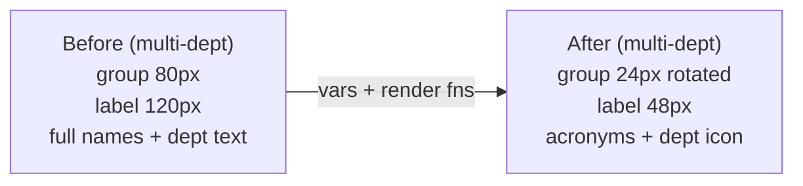

- **Data** (`src/lib/events/schedule.ts`) — `ScheduleUser` carries `shortname`;
  `ScheduleResource` gains `fullName` (the display name used for tooltips/aria).
  `buildScheduleResources` now labels user rows `shortname || name` (same fallback as the
  `{people:acronym}` title token) and sets `fullName` to the full name; department rows keep
  `label = fullName = dept.name`. `dashboard/page.tsx` passes `shortname` through from
  `listUsers()`.
- **Narrow columns** (`DashboardView.tsx`) — a `vars` resolver overrides the `ResourcesDayView`
  root CSS vars: `--resources-day-view-resource-label-width` `7.5rem → 3rem` (48px) and
  `--resources-day-view-group-label-width` `5rem → 1.5rem` (24px). A `styles` override zeroes
  the label cell's horizontal padding and adds ellipsis truncation so a long acronym can't
  push a row.
- **Department row = icon only** — `renderResourceLabel` renders a bare `IconBuilding`
  (size 16) for department rows, carrying the department name as `title` + `aria-label`.
- **User row = acronym** — user rows render `row.label` (the shortname, falling back to the
  full name when unset) in a `sm` `Text`, with a `title` tooltip showing `fullName` only when
  it differs from the label (no redundant tooltip for name-fallback rows).
- **Rotated group header** — `renderGroupLabel` renders the department name in a
  `writing-mode: vertical-rl` span so it reads top-to-bottom down the 24px column; Mantine's
  built-in `translateY` vertical centering within the group block is preserved.
- **Corner cleanup** — `labels={{ resources: "" }}` hides the "Resources" corner text, which
  no longer fits the narrowed corner.
- **Skeleton** — `ScheduleGridSkeleton`'s per-row label block goes 88px → 48px to track the new
  column width.
- **Mantine 9.5.1 gotcha (verified in the installed package)** — the `vars` prop is a
  **resolver function** (`(theme, props, ctx) => ({ styleName: { "--css-var": value } })`),
  not a static object (a static object fails typecheck: `'styleName' does not exist in type
'PartialVarsResolver<…>'`). Var values are the full kebab-case CSS variable names, applied as
  inline styles on the root element, overriding the component's own CSS-var defaults.
  `renderResourceLabel`/`renderGroupLabel` receive Mantine's `ScheduleResourceData`, so app
  fields are read via `resource as ScheduleResource` (a safe downcast — the source array is
  `ScheduleResource[]`).
- **Tests** — `schedule.test.ts` fixtures gain `shortname`; new cases assert acronym labels,
  the `shortname → name` fallback, `fullName` passthrough, and that sort order is by name (not
  shortname). 12 → 13 cases.
- Verification: `pnpm lint`, `pnpm typecheck`, `pnpm test` (152), and `pnpm build` all pass;
  `pnpm db:generate` shows no drift (no schema change).

## 1.26 Git history

```
c2e1a68 Document Vercel Corepack requirement and env setup
d914aca Fix pnpm build scripts and pin package manager/Node
e04140f Phase 1 scaffold
8e60883 Initial commit from Create Next App
```

## 1.27 Event time options + calendar preview (Phase 2r)

Admins now choose which datetime expressions are allowed per event type, the event
form is reordered to match, and the final Google Calendar title is previewed live
above the submit button.

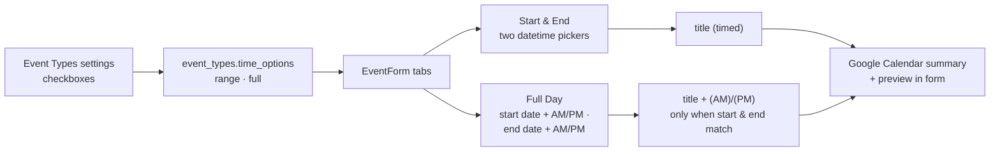

- **Time options** — each event type carries a `time_options` text-array column
  (migration `0010`) holding a subset of `["range", "full"]` (labels **Start &
  End**, **Full Day**). Empty/unrecorded types resolve to `["range"]` (the old
  behaviour). `src/lib/events/timeOptions.ts` is a pure module
  (`TimeOption`, `TIME_OPTION_LABELS`, `normalizeTimeOptions`,
  `resolveTimeOptions`, `resolveTimeOption`, `amPmSuffix`) unit-tested in
  `timeOptions.test.ts`.
- **Admin UI** — `EventTypeForm` gains a "Time options" `Checkbox.Group`
  (at least one required, validated in `validateEventTypeForm`);
  `createEventType`/`renameEventType` persist + audit it (field diff);
  `EventTypeTable` cards list the enabled option labels. `listEventTypes`
  returns normalized options; `getEventTypesByNames` also returns them so
  actions can enforce the restriction.
- **Event semantics** — `EventFormValues` drops the free `allDay` toggle and gains
  `timeOption`, `startAmPm` and `endAmPm`. `Start & End` is always timed (two
  `DateTimePicker`s). **Full Day** (the merged AM/PM + Full Day option) is a
  full-day event with **start date + AM/PM selector and end date + AM/PM
  selector**; the title gets `" (AM)"` or `" (PM)"` appended only when both
  indicators match (`amPmSuffix` — AM→AM or PM→PM), while mixed spans (AM→PM,
  PM→AM) render no suffix. `allDay` is derived server-side
  (`timeOption !== "range"`) in `buildGcalEventInput`, which also writes
  `timeOption`/`startAmPm`/`endAmPm` into the notes JSON (`notes.ts` parses them
  back via `parseEventTimeOption`/`parseEventStartAmPm`/`parseEventEndAmPm`;
  `CalendarEventPayload` gains `timeOption` + `startAmPm` + `endAmPm`). Legacy
  all-day events default to `"full"` on edit prefill with `AM`/`PM` indicators
  (rendering a plain full day). The server clamps the chosen option against the
  type's allowed set (`resolveEventTime`), defaulting untyped events to `range`.
  Chronological validation folds the indicator into the sort key
  (`YYYY-MM-DD AM` < `YYYY-MM-DD PM`), so a same-day PM→AM span is rejected.
- **Event form reorder** — order is now **Event Description → Event Type →
  time-option tabs → datetime component → Invitees → Calendar preview →
  Create/Save button**. When the selected type allows several options an inline
  `Tabs` strip switches the datetime component (switching to Full Day normalizes
  times to `00:00:00` and defaults the indicators to AM/PM — a plain full day);
  a single allowed option renders it directly; no type selected = Start & End.
- **Calendar preview** — a `Paper` above the submit button renders the exact
  summary the server will write: `formatEventTitle(...)` against the saved
  `event_title_template` using the live title/type shortname/selected people
  (fqn + acronym)/departments, plus the `(AM)`/`(PM)` suffix. `dashboard/page.tsx`
  passes the template, rich event-type info, and user `shortname` for the
  preview.
- Verification: `pnpm lint`, `pnpm typecheck`, `pnpm test` (175), `pnpm build`,
  and `pnpm db:generate` (no drift — migration `0010` in sync) all pass.

## 1.28 Calendar user filter (Phase 2s)

The `/dashboard` filter dialog gains a **Users** group for narrowing the calendar to specific
people, plus a one-tap **"Only me"** quick action beside the group label. The selection
persists in the URL as `?users=<id1,id2>` (same pattern as `cal`/`types`) and the filtering
runs server-side in `fetchMonthEvents`, so every view (Month, Mobile, Agenda, Day/Schedule)
renders the same filtered event set.

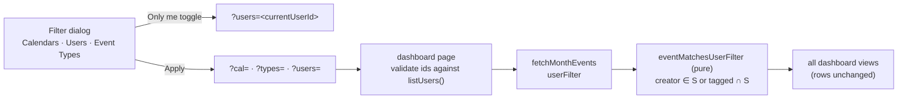

- **Matching (decision)** — an event applies to a selected user when that user **created** it or
  is **tagged** on it (`createdBy` / `inviteeUsers` in the notes JSON) — the same people scope
  as the schedule view's personal rows. Department-tagged events do **not** match; they remain
  reachable via the calendar filter.
- **Pure helper** (new `src/lib/events/userFilter.ts`) — `eventMatchesUserFilter({ creatorId,
inviteeUserIds }, selectedUserIds)`, I/O-free, unit-tested in `userFilter.test.ts`
  (7 cases).
- **Query** (`src/lib/events/queries.ts`) — `fetchMonthEvents` takes `userFilter: string[]`
  alongside `typeFilter` and skips non-matching copies in the per-calendar loop. All copies of
  a logical event share identical people notes, so per-copy filtering is equivalent to
  post-dedupe filtering.
- **Page** (`dashboard/page.tsx`) — parses the `users` param (comma list) and drops ids absent
  from `listUsers()` (same treatment as `cal`/`types`); absent param = no filter. Passes
  `selectedUserIds` to `DashboardView`.
- **FilterModal** (`src/components/FilterModal.tsx`) — `FilterGroup` gains an optional generic
  `action?: { label, icon?, isApplied, apply }`, rendered as a small toggle button beside the
  group label (`variant` flips `default` ↔ `light` in the accent color when applied). The
  action callback receives a draft-value setter plus the current/all option values. `UserTable`
  passes no actions, so its behavior is unchanged.
- **Users group** (`DashboardView.tsx`) — options come from the role-scoped `inviteeUsers`
  (admin → all active users; regular user → own department) with display-name labels; the group
  is hidden when empty. The **Only me** action (hidden when the current user is not among the
  options) toggles the group draft between `[currentUser]` and "all selected" (which the
  dialog normalizes to "no filter" on Apply, so `?users` clears on toggle-off).
  `activeFilterCount` — and hence the Filters badge — counts the Users group whenever a subset
  is applied.
- **Scope (decision)** — the filter selects which **events** render only; the schedule view's
  resource rows are unchanged. Existing URL behavior is untouched (params stay shareable; a
  user opening a shared `?users=` link can only see events they could already see).
- Verification: `pnpm lint`, `pnpm typecheck`, `pnpm test` (193), `pnpm build`, and
  `pnpm db:generate` (no drift — no schema change) all pass.

## 1.28 Admin events on behalf of another user (Phase 2s)

Admins can now **create and edit events on behalf of any user**: a user picked in a
new "On behalf of" selector becomes the event's creator (stored as `createdBy` in the
notes block). The acting user is locked as an invitee (her department becomes a target
calendar; she renders in the schedule row and in `{people}` title tokens). On edit the
selector prefills the current creator and the admin may reassign it; the previous
creator stays tagged unless manually removed.

- **UI** (`src/app/(protected)/dashboard/EventForm.tsx`) — new `isAdmin` prop. Admins
  see a required `Select` "On behalf of" (options = all active users, `displayName`
  via the name template) bound to `creatorId`; non-admins see nothing. On create the
  admin's `creatorId` starts empty; regular users still default to their own id. The
  locked creator invitee chip is derived from `form.values.creatorId`, so it tracks the
  acting user on every change. `validateEventForm` is called with
  `{ requireCreator: isAdmin }` so an unset creator blocks submission with a field
  error on the selector.
- **Validation** (`src/lib/events/validate.ts`) — `validateEventForm(values, opts?)`
  gains `opts.requireCreator`; when set, a blank `creatorId` returns
  `errors.creatorId`. `EventFormErrors` gains `creatorId?`. Unit-tested (2 new cases).
- **Actions** (`src/lib/events/actions.ts`) — `createEvent`/`updateEvent` pass
  `{ requireCreator: role === "admin" }` (server-side enforcement of the required
  creator) and a new `creatorGuard` authorizes the creator: admins may use any id;
  a non-admin may use only their own id, or (on update) the event's existing creator —
  so invited editors aren't blocked while forging is rejected. `EventResultField`
  (extracted from the union) now includes `"creatorId"` and the validate-failure return
  highlights the actual first field instead of hardcoding `title`.
- **Threading** — `isAdmin` flows `dashboard/page.tsx` → `DashboardView` → `EventForm`.
- **Verification** — `pnpm lint`, `pnpm typecheck`, `pnpm test` (186), `pnpm build`,
  and `pnpm db:generate` (no drift — no schema change) all pass. (Live smoke against a
  configured Google account still pending.)

## 1.29 Admin-id UUID guard fix

The virtual admin session id `"admin"` is not a `users` row (the admin authenticates via
the settings password hash) and is **not a UUID** — but its `users.id` column is a
Postgres `uuid`. Admin create/delete passed `"admin"` into the `inArray(users.id, [...])`
lookup behind target-calendar and title resolution, crashing with
`invalid input syntax for type uuid: "admin"` (a 500) before any Google call.

- **Root cause** — `src/lib/auth.ts` `authorize` returns `{ id: "admin" }` for the admin
  password login. `createEvent`/`deleteEvent` → `resolveTargetCalendars` →
  `getUserDepartmentIds(["admin", <uuid>, …])`; the same latent bug existed in
  `buildEventTitleContext` → `getUsersByIds`.
- **Fix** — new pure `src/lib/uuid.ts`: `isUuid(value)` (canonical regex) and
  `onlyUuidIds(ids)` (filter). Both `getUserDepartmentIds`
  (`src/lib/events/queries.ts`) and `getUsersByIds` (`src/lib/roster/queries.ts`) now
  filter to UUID ids before the query, so `"admin"` resolves to no department/no user
  rather than crashing. Unit-tested (`src/lib/uuid.test.ts`, 4 cases). Later phases
  build on this: the admin's virtual id is superseded by the "on behalf of" acting-user
  selection (Phase 2s).

## 1.30 Empty event title (Phase 2t)

The event form's **Event Description** is now **optional**: an event may be created or
edited with no description, in which case the Google Calendar summary is whatever the
event title template renders on its own (type/people/departments) — and if the template
also renders nothing, the event is genuinely untitled (shown as `"(no title)"` in the
dashboard, which `fetchMonthEvents` already handled).

- **Validation** (`src/lib/events/validate.ts`) — the "Description is required" check is
  gone; `EventFormErrors.title` removed. The form `TextInput` drops `required` and gains a
  hint: "Optional — the calendar title is rendered from the title template".
- **Suffix guard** (`src/lib/events/actions.ts` `buildGcalEventInput`, mirrored in the
  `EventForm` preview) — the `(AM)/(PM)` full-day suffix is appended only when the title
  base is non-empty, so a titleless event never becomes a bare `"(AM)"` summary. The
  preview now also trims the raw fallback, matching the server.
- **Notes round-trip** (`src/lib/events/notes.ts`) — an empty description must survive
  storage so the edit form doesn't prefill the _rendered_ template title as the
  description: `encodeEventNotes` keeps `title: ""` (an exception to its blank-stripping)
  and `parseEventTitle` returns `""` for it (null only for legacy events without the
  field). The form prefill (`rawTitle ?? …`) then correctly restores `""`.
- No schema/Google-transport changes (`events.update` is a full replace, so an empty
  summary clears the title on edit). Audit `entityName` is simply `""` for such events.
- Verification: `pnpm test` (195), `pnpm typecheck`, `pnpm lint` all pass; no schema
  change, `pnpm db:generate` drift-free.

## 1.31 Google Calendar "Edit in app" link (Phase 2u)

Google Calendar event notes now carry a clickable link that takes the user to the app and
opens the event's edit form. The machine JSON block is still stored in the notes
(`description`) — a short `Edit: <url>` line now sits **above** it, which Google
Calendar linkifies automatically. The URL encodes everything the app needs to find the
event again: `<origin>/dashboard?date=<start-date>&edit=<event group id>`.

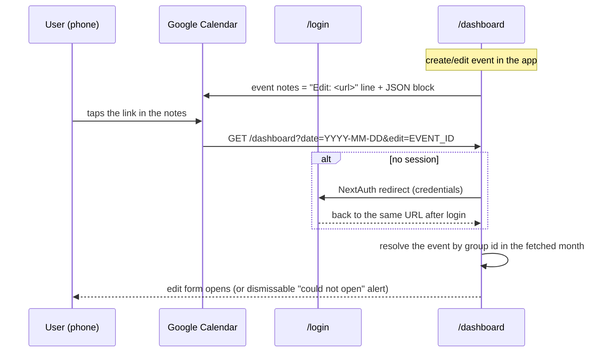

- **Notes format** (`src/lib/events/notes.ts`) — new `editLink` field; pure helpers
  `eventEditUrl(baseUrl, start, eventId)` (builds the dashboard link, date from the naive
  start) and `withEditLink(notesJson, url)` (places the `Edit:` line above the JSON
  block). `parseEventNotes` first tries the whole string (legacy events unaffected), then
  scans from the bottom for the last line that parses as a JSON object — the block is
  always a single line (`JSON.stringify`) and the line above it never contains braces, so
  every reader (queries, `findCopies`) keeps working through that one entry point.
- **Origin** (new `src/lib/appUrl.ts`) — `appBaseUrl()` derives `<proto>://<host>` from
  the incoming request headers (`x-forwarded-proto`, `http` fallback), the same pattern as
  the audit logger; no new env config.
- **Write path** (`src/lib/events/actions.ts`) — `buildGcalEventInput` is now async and
  writes `editLink` into the notes plus the `withEditLink` wrapping on **every**
  create/edit, so the in-notes link stays current when a date changes in the app.
- **Deep link** (`src/app/(protected)/dashboard/`) — the page validates `?edit=` with
  `isUuid` (anything else ignored) and passes `initialEditEventId`; `DashboardView`
  resolves the target synchronously at mount (the month is already fetched server-side)
  and initializes state directly — the edit form opens with the event, or a dismissable
  "Could not open that event" alert is shown when the event isn't in the current calendar
  selection/month. A one-shot effect strips `?edit=` from the URL (refresh won't reopen
  the form); `navigate` was stabilized with `useCallback` to satisfy the React-19-era
  `set-state-in-effect` and `exhaustive-deps` lint rules.
- **Edge cases** — rescheduling the event **in** Google Calendar (outside the app) leaves
  a stale date in the stored link → the "could not open" alert; an in-app edit rewrites
  it. Clicks without a session go through the normal NextAuth redirect and return to the
  same URL. No permission change: the dashboard fetch stays scoped to the user's normal
  calendar selection and `creatorGuard` still applies on save.
- **Tests** (`src/lib/events/notes.test.ts`) — 8 new cases: `withEditLink` placement/empty
  cases, `eventEditUrl` with/without a date, parsing the new format (round trip including
  `editLink`), braces inside `title`, and the field-level parsers on the new format.
- **Verification** — `pnpm lint`, `pnpm typecheck`, `pnpm test` (203), `pnpm build`, and
  `pnpm db:generate` (no drift — no schema change) all pass. Live confirmation that Google
  Calendar linkifies the stored URL remains pending until service-account credentials are
  configured (verify with a disposable test event).

## 1.32 Compressed opaque notes block (Phase 2v)

The machine notes block in Google notes no longer exposes raw JSON: below the
human-readable `Edit: <url>` line it is now **brotli-compressed and base64url-encoded
(no padding) on a single line**. Notes get short — the block itself measured ~585 → ~220
chars on a worst-case event (3 invitees, a department, a long title) — and calendar
viewers no longer see raw group/user uuids, event-type names, or the typed description.
The block's content is still a JSON object, so adding fields stays migration-free. The
redundant `editLink` field stored inside the JSON was dropped — the URL the top line
already shows no longer duplicates inside the block.

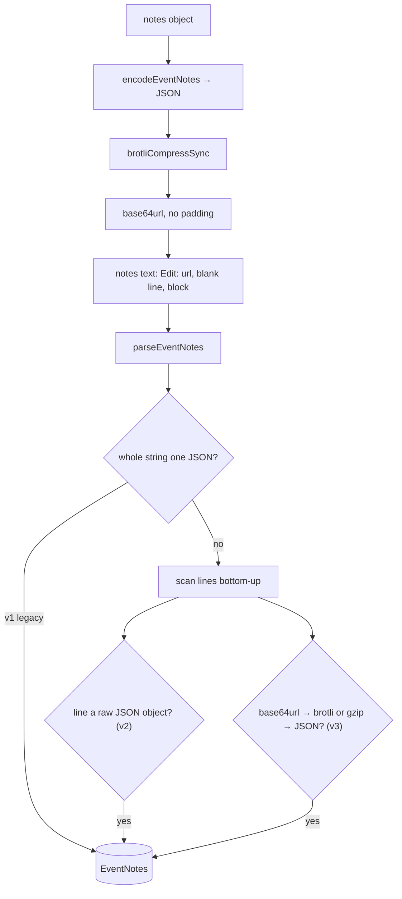

- **Writer** (`src/lib/events/notes.ts`) — new `encodeNotesBlock(json)`:
  `zlib.brotliCompressSync` → `toString("base64url")`. Deterministic (fixed compressor
  settings, no timestamp), so the same JSON always yields the same single line.
  `withEditLink` now just places the human line above an arbitrary block line.
- **Reader** (`src/lib/events/notes.ts`) — `parseEventNotes` keeps the whole-string JSON
  path (v1) and its bottom-up line scan now accepts each line as (a) a raw JSON line
  (v2) or (b) a base64url line that inflates to a JSON object — **brotli first** (the
  current writer) with a **gzip fallback** inflate, so a future codec switch can never
  strand stored events. Node's `base64url` decoder also accepts the standard `+/`
  alphabet and padding, so either spelling decodes. Every field parser
  (`parseEventPeople`, `parseEventTitle`, …) funnels through this one entry point — no
  changes needed anywhere else.
- **Write path** (`src/lib/events/actions.ts`) — `description =
  withEditLink(encodeNotesBlock(encodeEventNotes(…)), editLink)`; `editLink` is no
  longer a notes field (the v3 block stores it nowhere).
- **Debug one-liner** — decode a stored block (the last line of the notes) with
  `echo "<block>" | base64 -d | brotli -d` (or `| zcat` if it was ever gzip-compressed).
- **Tests** (`src/lib/events/notes.test.ts`) — v3 round trip (incl. braces in `title` and
  the field-level parsers), gzip fallback decode, v1/v2 legacy cases kept, single
  base64url line shorter than the raw JSON, determinism, and null for an undecodable
  line. Notes suite: 35 tests.
- **Verification** — `pnpm lint`, `pnpm typecheck`, `pnpm test` (208), `pnpm build`, and
  `pnpm db:generate` (no drift — no schema change) all pass.

## 1.33 Searchable user filter (Phase 2w)

The dashboard filter dialog's **Users** group no longer renders one checkbox card per user
(unusable as the roster grows toward 100). It now renders a **searchable dropdown** — the
same pattern as the event form's invitees `MultiSelect` — with the same role-scoped options
(admins: every active user; regular users: their own department).

- **`FilterModal` (`src/components/FilterModal.tsx`)** — `FilterGroup.variant` accepts
  `"grid"` (default, unchanged) or `"search"`. Search groups render a Mantine `MultiSelect`
  (`searchable` + `clearable`, placeholder `All <group>`) and use **empty = no filter**
  semantics (grid groups keep "all selected = no filter"), so narrowing 100 options down to
  a few never requires unticking the rest. Draft initialization, the no-clear-to-empty guard
  (grid only), `Clear`, `Apply` normalization (all selected → `[]`, plus empty for search),
  and the active-filter check all branch on the variant.
- **`DashboardView`** — the Users group sets `variant: "search"`; the "Only me" quick
  action now toggles between `[currentUser]` and `[]` (empty) instead of the full list.
  The `?users=` URL state, `fetchMonthEvents` user filtering, and the Filters button badge
  are unchanged (they already treat an empty list as "no filter").
- Settings' Users table filter (small Status/Department grid groups) is unaffected.
- **Verification** — `pnpm lint`, `pnpm typecheck`, `pnpm test` (208), `pnpm build`, and
  `pnpm db:generate` (no drift — no schema change) all pass.

## 1.34 PWA installability (Phase 3a)

Cloudy is now installable as a **Progressive Web App** (App Router + Serwist for Turbopack).
Scope is deliberately **installability + app shell only**: all data (events, users, filters)
is fetched live from the Google Calendar + Neon DB on every operation, and the service worker
**never serves cached data** — a `NetworkOnly` catch-all covers pages, RSC payloads, auth, and
any future `/api/*`. Only immutable static build assets (fonts, images) are cached for a fast
cold start. No push notifications (deferred — needs VAPID + a push backend).

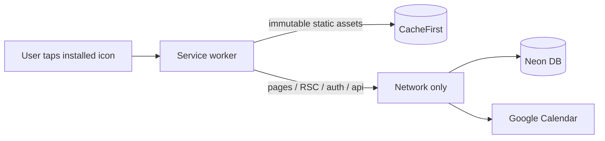

- **Manifest** (`src/app/manifest.ts`) — `display: standalone`, portrait, theme
  `#0D47A1` / background `#FBC02D`, icons 192/512 + maskable 512. Served at
  `/manifest.webmanifest`.
- **Layout metadata** (`src/app/layout.tsx`) — `metadata.manifest`,
  `appleWebApp` (capable, `black-translucent`, title), `formatDetection` off,
  `viewport.themeColor = #0D47A1`, and the `apple-touch-icon` link (180px). The root
  layout wraps children in `SerwistProvider` from `@serwist/turbopack/react`, which
  registers the SW with `updateViaCache: "none"` (critical on iOS).
- **Next config** (`next.config.ts`) — wrapped with `withSerwist` from
  `@serwist/turbopack`. The Turbopack setup serves the compiled SW via a **route
  handler** at `src/app/serwist/[path]/route.ts` (`createSerwistRoute`, `swSrc:
  src/app/sw.ts`) → `/serwist/sw.js`, instead of emitting `public/sw.js`.
- **Service worker** (`src/app/sw.ts`) — Serwist with `precacheEntries`,
  `skipWaiting`, `clientsClaim`, `navigationPreload`, and explicit `runtimeCaching`:
  `CacheFirst` for fonts/CSS, `StaleWhileRevalidate` for images, and **`NetworkOnly`
  for every same-origin request** (the app's default `defaultCache` would cache
  `/api` + RSC with NetworkFirst, which this app must not do).
- **Icons** (`public/`) — generated from `icon.svg`/`icon-maskable.svg` (brand
  calendar mark): `icon-192x192.png`, `icon-512x512.png`, `icon-maskable-512x512.png`,
  `apple-touch-icon.png`.
- **Dependencies** — `@serwist/turbopack`, `serwist`, `esbuild` (dev). Also fixed a
  leftover placeholder in `pnpm-workspace.yaml`: `@swc/core` build must be allowed
  (`true`) or install/typecheck fail.
- **Verification** — `pnpm build` bundles the SW ("50 precache entries"), and
  `pnpm lint` / `pnpm typecheck` / `pnpm test` (220) / `pnpm db:generate` (no drift —
  no schema change) all pass. Local smoke test: `/manifest.webmanifest` → 200
  `application/manifest+json`; `/serwist/sw.js` → 200 `application/javascript`; `/login`
  HTML contains the SW registration + manifest link. Manual device checks remaining:
  iOS "Add to Home Screen" standalone launch, Android install prompt.

## 1.35 Touch-friendly input heights (Phase 3b)

All single-line inputs (text boxes and dropdowns) are now **1.2× taller** so they are
comfortable to tap on a touchscreen. Mantine 9 no longer exposes the old
`theme.variants.input.inputHeight` option — input heights are driven by
`--input-height-{size}` CSS variables on the input's wrapper element. The scale is
therefore applied once in the theme: a `components.Input.vars` override that every
input-family component inherits, because they all render on the base `Input` and
resolve their styles under the name `["Input", <component>]`.

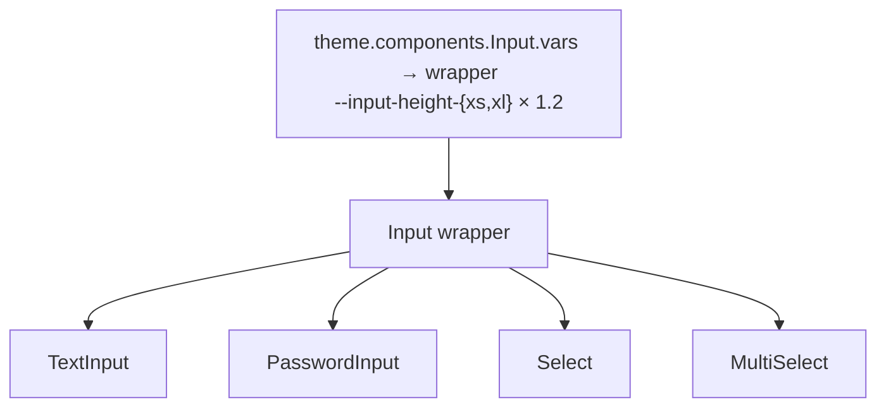

New heights (Mantine default → after 1.2×):

| size | before | after |
| --- | --- | --- |
| `xs` | 30px | 36px |
| `sm` (app default — every input uses it) | 36px | 43.2px |
| `md` | 42px | 50.4px |
| `lg` | 50px | 60px |
| `xl` | 60px | 72px |

- **Theme** (`src/lib/theme.ts`) — new `components.Input.vars` sets the wrapper's
  `--input-height-{xs,sm,md,lg,xl}` to `calc(<base> × 1.2 × var(--mantine-scale))`
  (2.25 / 2.7 / 3.15 / 3.75 / 4.5rem). The derived values adapt automatically: input
  `line-height`, inline padding (`height / 3`), and the left/right section size — the
  chevron box of `Select`/`MultiSelect` stays roughly square at the new height.
- **Provider move (required by the theme change)** — the theme now carries a function
  value, and React Server Components cannot pass functions to client components: keeping
  `MantineProvider theme={theme}` in the server root layout made every page 500 with
  `Functions cannot be passed directly to Client Components`. The provider now mounts on
  the client via a new `AppProviders` component (`src/components/AppProviders.tsx`,
  `"use client"`) that renders `MantineProvider` + `Notifications`; the server layout
  passes `children` into it (children stay server-rendered — only the provider's own
  props cross the boundary). `AGENTS.md` documents the constraint.
- **Login form** (`src/components/LoginForm.tsx`) — the local `1.5×` height hack on the
  login `PasswordInput` (`styles={{ input: { height: "calc(var(--input-height) * 1.5)" } }}`)
  was removed; the field now matches the global 1.2× scale (locked-in by request).
- **Scope** — covers `TextInput`, `PasswordInput`, `Select`, and `MultiSelect`; any
  future `@mantine/dates` input extends `Input` the same way and is covered too.
  Untouched: the heights of items inside an opened dropdown list, buttons, and
  `Textarea`s (auto height, rows-based).
- **Verification** — `pnpm lint`, `pnpm typecheck`, and `pnpm test` (220) pass. Dev
  server (Turbopack): `/login` returns 200 and its SSR HTML shows the wrapper inline
  style `--input-height: var(--input-height-sm); --input-height-sm: calc(2.7rem *
  var(--mantine-scale))` — i.e. 43.2px = 36px × 1.2 with `--mantine-scale: 1`; every
  other input consumes the same base-`Input` vars. `pnpm build` not run locally (a dev
  server held `.next`); CI's build job covers it. No schema change —
  `pnpm db:generate` shows no drift.

## 1.36 Global bottom nav + Overview page (Phase 3c)

The app now has a **global bottom navigation bar** on every protected page (the Phase 2e
bar was removed in 2f in favor of the profile-icon-only settings hub; this restores it as
the app's primary navigation) and a new **Overview** page that answers "how many events of
each type did each person have this month".

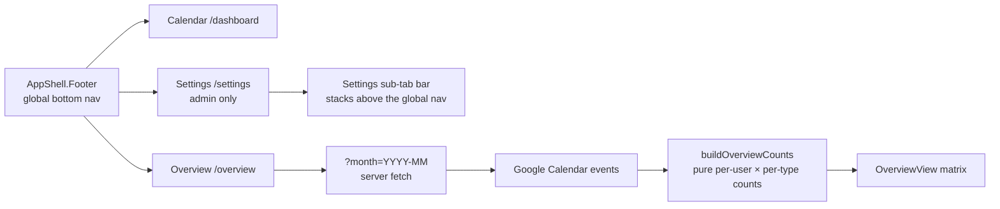

- **Bottom nav** (`src/components/AppShellShell.tsx`) — `AppShell.Footer` (height 56px +
  `env(safe-area-inset-bottom)`) with icon + label tabs: **Calendar** (`/dashboard`,
  `IconCalendarMonth`), **Overview** (`/overview`, `IconChartBar`), **Settings**
  (`/settings`, `IconSettings`, admins only — non-admins get just the first two). Active
  state via `pathname.startsWith(href)`, brand-colored icon/label, `aria-current="page"`.
- **Clearance constants** (`src/lib/bottomNav.ts`) — `BOTTOM_NAV_HEIGHT` (56),
  `BOTTOM_NAV_HEIGHT_CSS`, and `BOTTOM_NAV_FLOATING_OFFSET`. The `FloatingToolbar`
  default `bottomOffset` now clears the nav, so the dashboard "New event" FAB and the
  minimized-form pill are no longer hidden behind it; the Settings sub-tab bar
  (`SettingsTabs`) sits at `bottom: BOTTOM_NAV_HEIGHT_CSS` (its own safe-area padding
  removed — the nav below owns it) and `SETTINGS_TAB_BAR_OFFSET` grew to
  `calc(108px + env(safe-area-inset-bottom) + 16px)` (52px sub-tab bar + 56px nav) so the
  Settings floating buttons stay clear.
- **Overview page** (`src/app/(protected)/overview/`) — month header (‹ / `MMMM YYYY` /
  › / Today, navigating `?month=`), then a horizontally scrollable CSS-grid matrix inside
  a `Paper` (no `<Table>`): one column per configured event type (zeros included), one
  row per **active** user by display name, with a **sticky first column**. Role scoping
  mirrors the dashboard: admins see all departments/users, regular users only their own
  department's. Loading skeleton in `loading.tsx`; "Google not configured" and empty
  states included.
- **Counts** (`src/lib/overview/counts.ts` + `counts.test.ts`, pure + 9 unit tests) —
  `involvedUserIds` (creator ∪ tagged users, deduped) and `buildOverviewCounts` (per user
  per configured type). Input events are already deduped by logical group id
  (`fetchMonthEvents`), so a cross-department event counts once per involved user; events
  without a parseable type, or with a type no longer configured, are not represented
  anywhere (no total/aggregate column).
- **Verification** — `pnpm lint`, `pnpm typecheck`, `pnpm test` (238), and `pnpm build`
  all pass; build route list shows `/overview`. No schema change — `pnpm db:generate`
  shows no drift.

## 1.37 Overview cross-department filter fix (Phase 3d)

A non-admin who filtered Overview to a department **they are not in** while any users
filter was active (the "Only me" quick action, a picked user, or a stale `users=` param)
got the *"No users to show. Assign yourself to a department…"* card — the department
filter appeared not to apply.

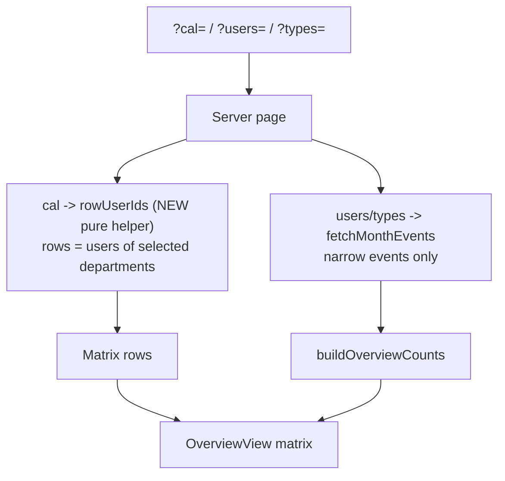

**Root cause** (`src/app/(protected)/overview/page.tsx`): matrix rows were computed as
`rowUsers ∩ selectedUsers`. A non-admin's users filter can only ever contain own-
department users (the dialog's Users options are role-scoped, and "Only me" always picks
the current user), so selecting another department intersected to `[]`. The dashboard
never had this because its schedule rows (`scheduleUsers`) follow the selected calendars
only — the `users` param filters **events** (`fetchMonthEvents` `userFilter`), never
rows.

**Fix** — match the dashboard semantics (user-confirmed):

- **New pure helper** `src/lib/overview/scope.ts` — `overviewRowUserIds(users,
  selectedCalendarIds, calendarCount, isAdmin, ownDepartmentId)`: active users only;
  narrowed calendar selection → users of the selected departments; otherwise the role
  default (admins: everyone incl. unassigned, non-admins: own department). No users
  input — the contract that `?users=` never narrows rows is enforced by the API shape.
  `scope.test.ts` adds 6 unit tests incl. the cross-department regression guard.
- **Overview page** — rows (count inputs + department grouping) come from the helper;
  the `rowUsers ∩ selectedUsers` intersection is gone. `fetchMonthEvents({ userFilter:
  selectedUsers })` and the `selectedUserIds` prop are unchanged, so the users filter
  still narrows the counted events and the filter dialog keeps its state/badge.
- No client changes — `OverviewView.tsx` and `FilterModal` untouched.

**Side effects (accepted):** admins who combined `cal` + `users` to hide rows now keep
the rows (counts of filtered-out events drop to 0); "Only me" on a foreign department
shows that department's rows with 0s (or real counts where the user is involved in
cross-department events).

**Repro that was wrong, now fixed** (live dev DB): Carol (dev-COU) with
`?cal=dev-CIU&users=<Carol>` rendered the empty-state card; now it renders the two
dev-CIU rows with 0 counts. Bob (dev-CIU) with `?cal=dev-COU` still shows the dev-COU
rows and events — the pure `cal` filter already worked and is unchanged.

**Verification** — `pnpm lint`, `pnpm typecheck`, `pnpm test` (244) pass; no schema
change. Live re-check of the full repro matrix (default / cross-dept / cross-dept +
users, both directions) against the dev server.

## 1.38 Cross-department user options in filter dialogs (Phase 3d)

After the §1.37 fix a non-admin could switch the **Calendars** filter to another
department and see that department's rows, but the filter dialog's **Users** group still
only listed **own-department** users — so "filter other departments and their users"
was impossible, on both the Overview and the Dashboard filter dialogs.

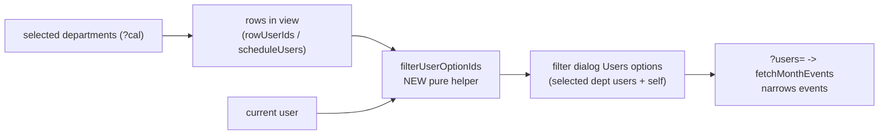

**Root cause:** both pages fed the filter dialog's Users group from a **role-scoped**
user list — `overview/page.tsx` `inviteeUsers` (`isAdmin ? all : ownDept`) and
`dashboard/page.tsx` `pickerUsers` (the same list that also feeds the EventForm invitee
picker). The server already accepted any roster user id in `?users=`, so the option
list was the only blocker.

**Fix** (user-confirmed: both pages; creation picker stays role-scoped):

- **New pure helper** `src/lib/filters/filterUserOptions.ts` —
  `filterUserOptionIds(users, rowUserIds, currentUserId)`: returns the users in view
  (rows of the selected departments) **plus the current user** when it is in the roster
  but not already included — so "Only me" works on foreign departments and its chip
  renders a real label (a selected value absent from the option data would otherwise
  show as a raw uuid). 6 unit tests in `filterUserOptions.test.ts`.
- **Overview** — dialog options come from the new helper (rows = `overviewRowUserIds`
  result); the view prop is renamed `inviteeUsers` → `filterUsers`.
- **Dashboard** — a new `filterUsers` prop (rows = `scheduleUsers`) drives the filter
  dialog; `inviteeUsers` stays as the EventForm invitee picker (own-department scope
  for non-admins, per creation permission semantics) and `peopleNames`/creation flows
  are untouched.
- `progress.md` status bullet added.

**Behavior notes (accepted):** non-admin defaults are unchanged in practice
(own-dept users + self == previous options); admins keep all active users; an inactive
or unassigned self still appears so "Only me" works for filtering their own past
events.

**Verification** — `pnpm lint`, `pnpm typecheck`, `pnpm test` (250) pass; no schema
change. Live re-check on the dev server: Bob (dev-CIU) viewing dev-COU sees the six
dev-COU users (plus himself) in the Overview and Dashboard filter dialogs; picking one
filters events while rows stay department-wide; the EventForm invitee picker still
lists only Bob's own department.

## 1.39 Overview full-selection row scoping fix (Phase 3d)

After §1.37/§1.38, a non-admin filtering the **Overview** to a single foreign
department saw the right rows — but selecting **all** departments collapsed the matrix
back to their **own** department.

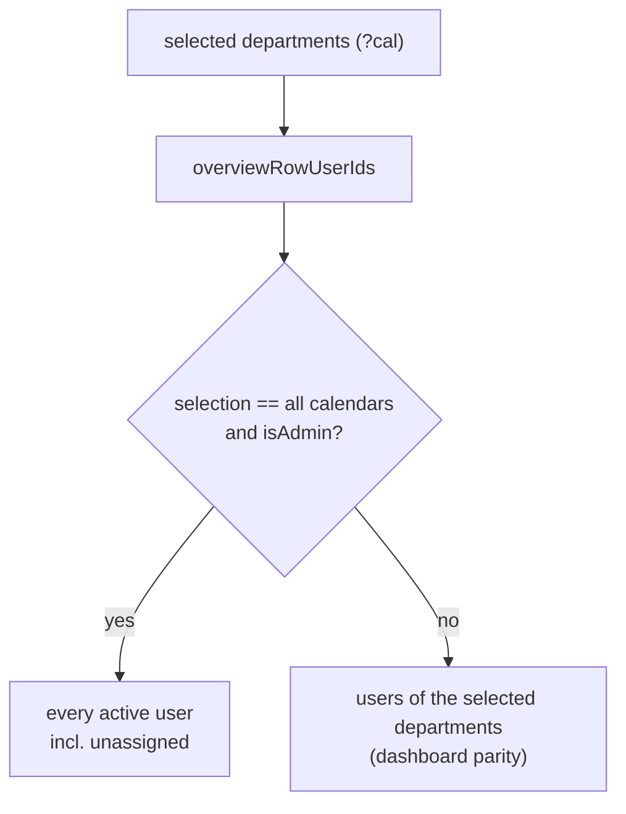

**Root cause** (`src/lib/overview/scope.ts`): the old `overviewRowUserIds` used a
`narrowed` heuristic — `0 < selected.length < calendarCount` — as a proxy for "an
explicit filter is applied". When a non-admin selected **every** calendar,
`length < calendarCount` was false, so the helper fell back to the **role default**
(own department only). This conflated "no filter" (the role default) with "filtered to
everything"; the dashboard never had this problem because its `scheduleUsers`
(`dashboard/page.tsx`) always filters by the selected calendars.

**Fix** (dashboard parity):

- `overviewRowUserIds` no longer uses the length heuristic and drops the
  `ownDepartmentId` parameter: **any** selection narrows rows to the selected
  departments; the sole special case is `isAdmin && selection == all calendars`,
  which keeps unassigned users visible (the admin default view and an explicit full
  selection share the same code path). The page's `ownDepartmentId` remains — it still
  drives `defaultCalendars`.
- `scope.test.ts` updated (7 tests) with the regression guard: a non-admin selecting
  all departments gets every department's users, not their own.

Behavior matrix (unchanged cases verified): non-admin default (own dept), non-admin
single foreign department, non-admin unassigned with no calendars, admin subset
selection, admin default/full selection incl. unassigned.

**Verification** — `pnpm lint`, `pnpm typecheck`, `pnpm test` (251) pass; no schema
change. Live re-check: Bob `/overview?cal=<CIU>,<COU>` now renders **both** departments
(dev-CIU 2 + dev-COU 6); `?cal=<COU>` and the default remain correct; the Dashboard
is unaffected.

## 1.40 Externally created events (Phase 3e)

Events can be created **outside** the app — directly in Google Calendar by a user with
calendar access. Those events have no app notes, so the app now tells them apart and
marks them as **external**.

```mermaid
flowchart TD
    A["Google event description"] --> B{"has 'Created in cloudy2' line?"}
    B -- yes --> C[internal]
    B -- no --> D{"has an app notes block?"}
    D -- yes --> C
    D -- no --> E["external (created in Google Calendar)"]
```

**Detection** (`src/lib/events/notes.ts`):

- `INTERNAL_EVENT_MARKER = "Created in cloudy2"` — a human-readable line the app writes
  at the **bottom** of every event description it creates or edits
  (`withInternalMarker`, called from `buildGcalEventInput` in `src/lib/events/actions.ts`
  after the `Edit:` link + compressed block). Idempotent, so re-edits never duplicate it.
- `isExternalEvent(description)` — external when the marker **and** a parseable notes
  block are both absent. The block clause keeps pre-existing in-app events (notes block,
  no marker yet) from showing as External until their next in-app edit.
- The marker sits below the opaque block, so `parseEventNotes`'s bottom-up scan still
  inflates the block correctly (no format change, no migration).

**Display**:

- `CalendarEventPayload` gains `external` (set in `fetchMonthEvents` from the
  description); titles are unchanged (no prefix).
- The event detail modal (`EventDetail.tsx`) shows a gray **External** badge next to the
  type/calendar badges. Edit/Delete remain available — editing an external event
  "adopts" it (rewrites notes + marker).
- **Day (schedule) view**: external events have no linked people, so `expandScheduleEvents`
  pins them to their own calendar's department row, and `buildScheduleResources` keeps a
  user-less department's row when it holds an external event.

**Out of scope:** external events have no event type, so the Overview matrix does not
count them (no column to put them in). No schema change — `db:generate` no drift.

**Verification** — `pnpm build/lint/typecheck/test` (262) pass; `db:generate` no drift.

## 1.41 Additional access levels (Phase 3f)

The **Additional access** section of a department's Share modal can now set the access
level (**Read only / Can edit / Owner** → Google ACL `reader` / `writer` / `owner`) when
granting a new share, and the level of an existing share can be changed later. Previously
every manual grant was hardcoded to `reader` and existing shares showed only the raw
Google role string.

```mermaid
flowchart LR
    A["Share modal<br/>email + access level Select"] --> B[grantDepartmentAccess]
    B --> C["setCalendarAccess(email, reader|writer|owner)"]
    A2["existing rule row<br/>level Select"] --> D[updateDepartmentAccess]
    D --> C
    C --> E["listDepartmentAccess (reconcile)"]
```

- **Domain** (`src/lib/roster/shares.ts`) — new `DepartmentAccessRole = "reader" |
  "writer" | "owner"` type and pure `isDepartmentAccessRole(value)` guard (rejects
  `freeBusyReader` and anything else). 2 unit tests added in `shares.test.ts`.
- **Actions** (`src/lib/roster/actions.ts`) — `grantDepartmentAccess(calendarId, email,
  role)` takes the role (validated server-side, replacing the hardcoded `"reader"`) and
  logs it in the audit `details`; new `updateDepartmentAccess(calendarId, email, role)`
  re-grants an existing rule's role via `setCalendarAccess` and logs it under a new
  `access.update` audit action (`AUDIT_ACTIONS.accessUpdate` in
  `src/lib/audit/build.ts`).
- **UI** (`src/app/(protected)/settings/departments/DepartmentShares.tsx`) — the add
  form gains an "Access level" `Select` (defaults to **Read only**) above the email
  row; each existing additional-access rule row now shows a human-readable role label
  (falling back to the raw role) plus a compact `size="xs"` `Select` to change the
  level, with a per-row loading state mirroring the Remove button.
- No schema change (`db:generate` no drift); the role is stored only in Google Calendar,
  matching the existing ACL-as-source-of-truth model. Assigned users and the admin owner
  stay auto-managed as `reader`/`owner` respectively.
- Verification: `pnpm lint`, `pnpm typecheck`, `pnpm test` (264), and `pnpm build` pass;
  `pnpm db:generate` shows no drift.

## 1.42 Calendar caching layer (Phase 3g)

The dashboard/overview pages rendered by re-hitting Google Calendar on **every** server
render — a serial `events.list` per selected department calendar per month, hidden behind
the loading skeleton. A server-side caching layer now sits between the frontend and the
Google Calendar API, backed by a Postgres table so it is shared across serverless instances
and survives restarts.

> **Why Postgres and not Next's `use cache` data cache?** The first implementation used
> `cacheComponents: true` + a `'use cache'` function, but Turbopack `next dev` crashed on
> **Node 26** with `TypeError: ArrayBuffer is not detachable and could not be cloned`
> (vercel/next.js#96165 — pooled `Buffer`s are non-detachable when enqueued into the dev
> RSC byte stream; unfixed, dev-only, production unaffected). It also forced PPR-style
> prerendering and an `export const instant = false` opt-out on protected routes. The DB
> table avoids the entire Next cache runtime and works identically in dev/CI/Vercel.

```mermaid
sequenceDiagram
    participant P as Page (RSC render)
    participant D as google_event_cache (Postgres)
    participant G as Google Calendar
    P->>D: getCachedMonthEvents(gcalId, month) per selected calendar
    alt fresh row (hit, <30s)
        D-->>P: decoded GcalEventItem[]
    else stale row (30s–30min)
        D-->>P: decoded GcalEventItem[]
        Note over P,D: after() → background refresh from Google + upsert
    else missing or expired
        D->>G: events.list (bounded concurrency, ≤4)
        G-->>D: items → upsert row
        D-->>P: items
    end
    Note over P: after() → warm M±1 cache rows post-response
    Note over P: create/update/delete → invalidateGcalCache() deletes touched rows
```

- **Schema** (`src/db/schema.ts`) — new `google_event_cache` table (migration `0011`):
  composite PK `(calendar_google_id, month)`, `events` jsonb (`GcalEventItem`s with dates as
  ISO strings), `fetched_at` timestamptz.
- **Cache layer** (`src/lib/google/eventsCache.ts`) — `getCachedMonthEventsForCalendars(ids,
  month)` is a **layered** cache: an in-process L1 map (keyed `googleCalendarId:month`) serves
  warm-instance repeat views with zero I/O; misses fall through to a **single batched** `SELECT`
  on `google_event_cache` for the whole month (~one round-trip regardless of calendar count,
  was N × ~50ms serialized reads); anything absent/expired blocks on a fresh `events.list` +
  upsert (`onConflictDoUpdate`, bounded concurrency ≤4, per-key in-flight dedup). Fresh rows
  serve directly (**60s**, `GCAL_CACHE_FRESH_MS`); stale rows serve while `after()` refreshes
  them in the background; hard expire **30min** (`GCAL_CACHE_EXPIRE_MS`). One entry serves every
  user/filter combo on both `/dashboard` and `/overview`. Google errors propagate — a failed
  refresh is never served as data.
- **Read path** (`src/lib/events/queries.ts`) — `fetchMonthEvents` calls the cache once for the
  whole selected calendar set, then flattens in calendar-name order (deterministic dedup
  preserved). After the response ships, `after()` warms the neighboring months only when the
  current month **missed** the cache (`PREFETCH_ADJACENT_MONTHS` gate), so fully-cached views
  don't churn extra background Google/DB work.
- **Invalidation** (`src/lib/google/eventsCache.ts`) — `invalidateGcalCache()` purges the L1 +
  in-flight entries **and** deletes the touched DB rows (affected calendars' Google ids
  collected during the write loops × every month in the old+new ranges via `monthsInRange`),
   so the mutating instance's own `router.refresh()` shows the change immediately. The L1 purge
   is per-instance (map lives only where the mutation ran) while the DB delete is shared, so
   other warm instances may serve the pre-change L1 copy for up to `GCAL_CACHE_FRESH_MS` (60s)
   before their background refresh corrects it. `findCopies` keeps reading
   the **uncached** integration during reconciles.
- **Helpers** — pure `cacheEntryState`, `encodeCachedEvents`, `decodeCachedEvents`
  (`src/lib/google/eventsCacheCodec.ts`), `monthsInRange`/`shiftMonth`
  (`src/lib/events/datetime.ts`), and `mapWithConcurrency` (`src/lib/async.ts`), each
  unit-tested. `cacheKeys.ts` (Next `cacheTag` helper) was removed.
- No Next cache config: `next.config.ts` and `(protected)/layout.tsx` were reverted to their
  pre-cache state.
- **Measured before/after** (authenticated `next dev`, Node 26, Neon pooler): warm dashboard
  `application-code` ~1.0–1.9s → **~0.35s**; overview 748ms → **~290ms**. Cold connection
  ~600ms + per-query ~50ms (serialized on `max: 1` postgres) remain the app's pre-existing
  floor; the events read itself is now one batched query on miss and zero I/O on L1 hit.
- Verification: `pnpm lint`, `pnpm typecheck`, `pnpm test` (280), and `pnpm build` pass;
  `pnpm db:generate` no drift. Manual: repeat month views are served from L1/DB with no Google
  calls; edits appear immediately after refresh; `next dev` runs on Node 26.
- **Full design reference:** [`docs/events-cache.md`](docs/events-cache.md) — the complete
  mechanism (architecture, data model, read/write flows, freshness, performance).
