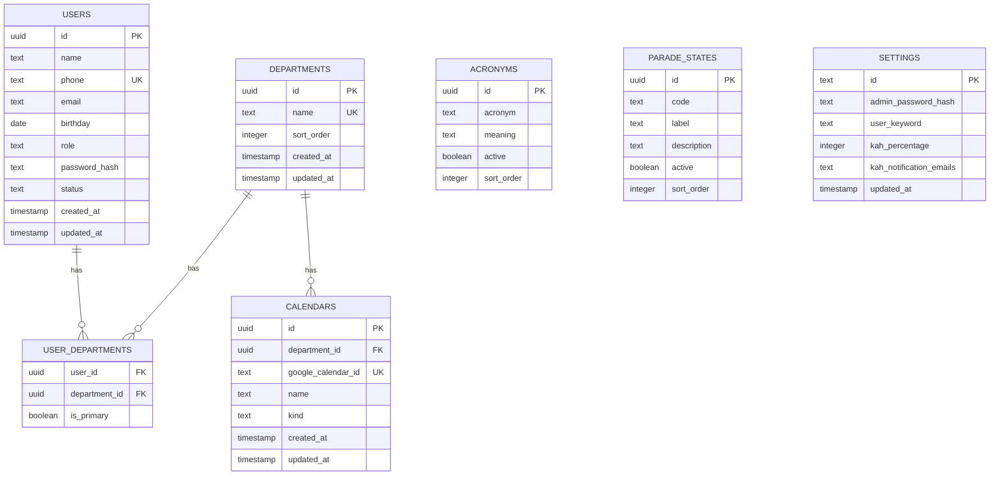
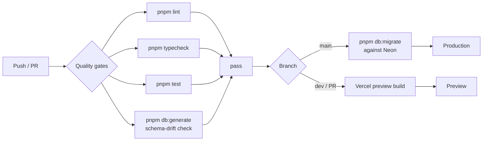

# 1. Cloudy2 — Progress

Internal tool for managing company personnel, leave/event records, and Key Appointment
Holder (KAH) constraints, with Google Calendar as the event/visibility layer.

## Table of contents

- [1.1 Status](#11-status)
- [1.2 Decisions locked in (Phase 0)](#12-decisions-locked-in-phase-0)
- [1.3 Implemented (Phase 1)](#13-implemented-phase-1)
  - [1.3.1 Tooling](#131-tooling)
  - [1.3.2 Database schema](#132-database-schema-srcdbschematics)
  - [1.3.3 Auth & routing](#133-auth-routing)
  - [1.3.4 Google integration (stub)](#134-google-integration-stub)
  - [1.3.5 Tests](#135-tests)
- [1.4 Verification status](#14-verification-status)
- [1.5 Deployment (Vercel) — current blocker & fix](#15-deployment-vercel-current-blocker-fix)
  - [1.5.1 Remaining manual steps (Vercel dashboard)](#151-remaining-manual-steps-vercel-dashboard)
- [1.6 CI migrations (Phase 1.5)](#16-ci-migrations-phase-15)
- [1.7 Bootstrap & schema hardening (Phase 1.5)](#17-bootstrap-schema-hardening-phase-15)
- [1.8 Roster & Departments (Phase 2a)](#18-roster-departments-phase-2a)
- [1.9 Next steps (Phase 2+)](#19-next-steps-phase-2)
- [1.10 Git history](#110-git-history)

## 1.1 Status

- **Phase 0 (spec & decisions):** complete
- **Phase 1 (scaffold):** complete — builds, lints, typechecks, and tests pass locally
- **Deployment (Vercel):** build passes on `main`/`dev` with no warnings (Corepack +
  `NEXTAUTH_URL` unset). Schema not yet applied to Neon — run `pnpm db:migrate` once
  (applies `0000` + `0001`).

## 1.2 Decisions locked in (Phase 0)

| Topic                    | Decision                                                                 |
| ------------------------ | ------------------------------------------------------------------------ |
| Architecture             | Single Next.js 15 (App Router) app — no monorepo                          |
| UI                       | Mantine v9                                                               |
| Database                 | Neon Postgres + Drizzle ORM                                              |
| Auth                     | NextAuth v4, Credentials provider, **JWT sessions**                       |
| Login UX                 | Single input field, auto-detect: admin password vs `[phone][keyword]`    |
| Google integration       | GCP service account (Calendar v3 + Gmail v1); domain-wide delegation     |
| GCal notes               | JSON block stored on events                                              |
| Calendars                | Department-level calendars                                               |
| Parade states            | `parade_states` lookup table (code/label/description)                    |
| Settings                 | Single-row `settings` table (admin password hash, keyword, KAH %)        |
| User→dept                | Many-to-many `user_departments` with `is_primary` flag                   |
| PWA / monorepo           | Deferred / not used                                                      |

## 1.3 Implemented (Phase 1)

### 1.3.1 Tooling
- Next.js `15.5.23` (Turbopack), React 19, TypeScript, pnpm `11.18.0`
- `packageManager` + `engines` pinned in `package.json`
- Mantine v9 wired via `postcss.config.cjs` + `MantineProvider` + `optimizePackageImports`
- Drizzle `0.45.2` + `postgres-js`; Vitest `4.1.10`; ESLint 9 + Prettier
- Native build scripts approved in `pnpm-workspace.yaml` (`allowBuilds`: esbuild, sharp,
  unrs-resolver)
- CI workflow (`.github/workflows/ci.yml`): lint, typecheck, test, schema-drift check

### 1.3.2 Database schema (`src/db/schema.ts`)
7 tables: `users`, `departments`, `user_departments`, `calendars`, `acronyms`,
`parade_states`, `settings`. Lazy DB client (`src/db/index.ts`) avoids requiring
`DATABASE_URL` at build time. Migration generated at `drizzle/0000_serious_ezekiel_stane.sql`.



### 1.3.3 Auth & routing
- `src/lib/auth.ts` — NextAuth config: Credentials + JWT, admin/user resolution, JWT/session
  callbacks that carry `id`, `role`, `phone`
- `src/lib/login.ts` — pure (I/O-free) login parsing: `parseUserLogin`, `classifyLogin`
- `src/lib/session.ts` — `requireSession`, `requireAdmin`, `getSession` guards
- `src/types/next-auth.d.ts` — session/JWT type augmentation
- `src/app/api/auth/[...nextauth]/route.ts` — auth handler
- `src/app/login/page.tsx` + `src/components/LoginForm.tsx` — login page + form
- `src/app/(protected)/layout.tsx` + `dashboard/page.tsx` + `AppShellShell` — protected
  dashboard shell
- `src/components/` — `AcronymBadge`, `CalendarSelect`

### 1.3.4 Google integration (stub)
- `src/lib/google/types.ts` — `GoogleIntegration` interface
- `src/lib/google/stub.ts` — no-op implementation
- `src/lib/google/index.ts` — `getGoogleIntegration()` returns the stub until credentials
  are provisioned

### 1.3.5 Tests
- `src/lib/login.test.ts` — 8 passing tests (login parsing)

## 1.4 Verification status

| Check              | Result |
| ------------------ | ------ |
| `pnpm build`       | pass   |
| `pnpm lint`        | pass   |
| `pnpm typecheck`   | pass   |
| `pnpm test`        | 8/8    |
| `pnpm db:generate` | 7 tables, 1 migration |

## 1.5 Deployment (Vercel) — current blocker & fix

Vercel auto-builds: `main` → production, `dev` → preview.

Two issues were diagnosed and fixed in-repo (committed and pushed to both `dev` and `main`):

1. **`TypeError: Invalid URL` during `/login` prerender.** Caused by an empty
   `NEXTAUTH_URL` env var (NextAuth's `parseUrl` does `new URL('')`). Fix: leave
   `NEXTAUTH_URL` **unset** on Vercel — it injects `VERCEL_URL` and NextAuth falls back
   automatically.
2. **"Ignored build scripts" warning** (esbuild, sharp, unrs-resolver). Root cause: Vercel
   detects pnpm **10** from `lockfileVersion: 9.0` and ignores the pnpm-11 `allowBuilds`
   config. Fix: enable Corepack so Vercel honors `packageManager: pnpm@11.18.0`.

### 1.5.1 Remaining manual steps (Vercel dashboard)
- [x] Add `ENABLE_EXPERIMENTAL_COREPACK` = `1` — done, build passes with no warnings
- [x] Add `NEXTAUTH_SECRET` (`openssl rand -base64 32`) — done per user
- [x] Add `DATABASE_URL` (Neon) — done per user
- [x] Remove any empty `NEXTAUTH_URL` — done per user
- [x] Redeploy and confirm build passes — done, no warnings
- [ ] Set `ADMIN_INITIAL_PASSWORD` on Vercel (seeds the admin password hash on first login)
- [x] Add `DATABASE_URL` as a GitHub Actions repo secret (feeds the CI migrate job)

## 1.6 CI migrations (Phase 1.5)



- `migrate` job added to `.github/workflows/ci.yml`: `needs: quality`, runs only on
  `main` push (`if: github.ref == 'refs/heads/main'`), serialized via a `db-migrate`
  concurrency group so concurrent pushes can't race. Applies `pnpm db:migrate` against
  Neon using the `DATABASE_URL` repo secret.
- Single shared Neon DB across Vercel `dev`/`main`, so main-only migration keeps both
  environments schema-synced. Pending `0000` + `0001` apply automatically on the next
  `main` push — no local migrate step needed.

## 1.7 Bootstrap & schema hardening (Phase 1.5)

- `settings` table now has a `settings_singleton` CHECK constraint (`id = 'singleton'`,
  `text` PK with default) — a second row is impossible. Migration `0001` generated.
- `drizzle/meta/` is now **committed** (was gitignored). CI schema-drift step is
  `pnpm db:generate && git diff --exit-code -- drizzle/` so drift actually fails the build.
- `src/lib/bootstrap.ts` `ensureSettingsRow()` lazily seeds the singleton settings row on
  first auth, hashing `ADMIN_INITIAL_PASSWORD` (env). Called at the top of `authorize` in
  `src/lib/auth.ts`. Race-safe via `onConflictDoNothing` + check constraint.
- `ADMIN_INITIAL_PASSWORD` added to `.env.example`.

## 1.8 Roster & Departments (Phase 2a)

- **`src/lib/roster/validate.ts`** — pure helpers: `normalizePhone` (exactly 8 digits after
  stripping), `validateUserForm`, `validateDepartmentForm`. Unit-tested (15 cases).
- **`src/lib/roster/queries.ts`** — `listUsers()` (join `user_departments` + `departments`,
  primary flag, sorted), `listDepartments()`.
- **`src/lib/roster/actions.ts`** — Server Actions guarded by `requireAdmin()`:
  `createUser`, `updateUser`, `setUserStatus` (deactivate-only; no hard delete),
  `createDepartment`, `updateDepartment`, `deleteDepartment`. Exactly-one-primary enforced;
  unique-violation errors mapped to form fields; `revalidatePath` after mutations.
- **`/roster`** — admin-only table (search name/phone, filter status + department, badges
  for role/status/departments with primary marked), create/edit modal, activate/deactivate.
- **`/departments`** — admin-only name + sortOrder CRUD, delete-with-cascade confirm.
- **`AppShellShell`** — Roster/Departments nav links only for admins (role passed from the
  protected layout).
- Verification: migrations applied to Neon (2/2), all 7 tables live, roster queries hit the
  live DB. `pnpm build/lint/typecheck/test` all pass.

## 1.9 Next steps (Phase 2+)

1. Add `db:seed` script (dev departments/users) now that roster exists.
2. Replace the Google stub with a real service-account implementation
   (calendar event read/write, Gmail send-as, KAH visibility).
3. Core screens: leave/event entry, KAH constraint checks, parade states, acronyms,
   calendar view.
4. Gmail notifications for KAH percentage breaches.

## 1.10 Git history

```
c2e1a68 Document Vercel Corepack requirement and env setup
d914aca Fix pnpm build scripts and pin package manager/Node
e04140f Phase 1 scaffold
8e60883 Initial commit from Create Next App
```
