# 1. Cloudy2 — Progress

Internal tool for managing company personnel, leave/event records, and Key Appointment
Holder (KAH) constraints, with Google Calendar as the event/visibility layer.

## Table of contents

- [1.1 Status](#11-status)
- [1.2 Decisions locked in (Phase 0)](#12-decisions-locked-in-phase-0)
- [1.3 Implemented (Phase 1)](#13-implemented-phase-1)
  - [1.3.1 Tooling](#131-tooling)
  - [1.3.2 Database schema](#132-database-schema-srcdbschematics)
  - [1.3.3 Auth & routing](#133-auth-routing)
  - [1.3.4 Google integration (stub)](#134-google-integration-stub)
  - [1.3.5 Tests](#135-tests)
- [1.4 Verification status](#14-verification-status)
- [1.5 Deployment (Vercel) — current blocker & fix](#15-deployment-vercel-current-blocker-fix)
  - [1.5.1 Remaining manual steps (Vercel dashboard)](#151-remaining-manual-steps-vercel-dashboard)
- [1.6 CI migrations (Phase 1.5)](#16-ci-migrations-phase-15)
- [1.7 Bootstrap & schema hardening (Phase 1.5)](#17-bootstrap-schema-hardening-phase-15)
- [1.8 Roster & Departments (Phase 2a)](#18-roster-departments-phase-2a)
- [1.9 Seeding (Phase 2b)](#19-seeding-phase-2b)
- [1.10 Next.js 16 upgrade & auth fix (Phase 2c)](#110-nextjs-16-upgrade-auth-fix-phase-2c)
- [1.11 Departments as Google Calendars + sharing + audit (Phase 2d)](#111-departments-as-google-calendars--sharing--audit-phase-2d)
- [1.12 Mobile-only UI refactor and Users rename (Phase 2e)](#112-mobile-only-ui-refactor-and-users-rename-phase-2e)
- [1.13 Admin Settings hub and login keyword (Phase 2f)](#113-admin-settings-hub-and-login-keyword-phase-2f)
- [1.14 Event Types (Phase 2g)](#114-event-types-phase-2g)
- [1.15 Next steps (Phase 2+)](#115-next-steps-phase-2)
- [1.16 Calendar events (Phase 2h)](#116-calendar-events-phase-2h)
- [1.17 Dashboard mobile month view (Phase 2i)](#117-dashboard-mobile-month-view-phase-2i)
- [1.18 Agenda day swipe (Phase 2j)](#118-agenda-day-swipe-phase-2j)
- [1.19 Schedule view & event invitees (Phase 2k)](#119-schedule-view--event-invitees-phase-2k)
- [1.20 Cross-department event copies (Phase 2l)](#120-cross-department-event-copies-phase-2l)
- [1.21 User shortname (Phase 2m)](#121-user-shortname-phase-2m)
- [1.22 Display name template (Phase 2n)](#122-display-name-template-phase-2n)
- [1.23 Event title template (Phase 2o)](#123-event-title-template-phase-2o)
- [1.24 Event type acronym + Templates tab (Phase 2p)](#124-event-type-acronym--templates-tab-phase-2p)
- [1.25 Schedule view space optimization (Phase 2q)](#125-schedule-view-space-optimization-phase-2q)
- [1.26 Git history](#126-git-history)
- [1.27 Event time options + calendar preview (Phase 2r)](#127-event-time-options--calendar-preview-phase-2r)
- [1.28 Calendar user filter (Phase 2s)](#128-calendar-user-filter-phase-2s)
- [1.28 Admin events on behalf of another user (Phase 2s)](#128-admin-events-on-behalf-of-another-user-phase-2s)
- [1.29 Admin-id UUID guard fix](#129-admin-id-uuid-guard-fix)
- [1.30 Empty event title (Phase 2t)](#130-empty-event-title-phase-2t)
- [1.31 Google Calendar "Edit in app" link (Phase 2u)](#131-google-calendar-edit-in-app-link-phase-2u)
- [1.32 Compressed opaque notes block (Phase 2v)](#132-compressed-opaque-notes-block-phase-2v)
- [1.33 Searchable user filter (Phase 2w)](#133-searchable-user-filter-phase-2w)
- [1.34 PWA installability (Phase 3a)](#134-pwa-installability-phase-3a)
- [1.35 Touch-friendly input heights (Phase 3b)](#135-touch-friendly-input-heights-phase-3b)
- [1.36 Global bottom nav + Overview page (Phase 3c)](#136-global-bottom-nav--overview-page-phase-3c)
- [1.37 Overview cross-department filter fix (Phase 3d)](#137-overview-cross-department-filter-fix-phase-3d)
- [1.38 Cross-department user options in filter dialogs (Phase 3d)](#138-cross-department-user-options-in-filter-dialogs-phase-3d)
- [1.39 Overview full-selection row scoping fix (Phase 3d)](#139-overview-full-selection-row-scoping-fix-phase-3d)
- [1.40 Externally created events (Phase 3e)](#140-externally-created-events-phase-3e)
- [1.41 Additional access levels (Phase 3f)](#141-additional-access-levels-phase-3f)
- [1.42 Calendar caching layer (Phase 3g)](#142-calendar-caching-layer-phase-3g)
- [1.43 Calendar force refresh (Phase 3h)](#143-calendar-force-refresh-phase-3h)
- [1.44 Schedule week view + S. Month removal (Phase 3i)](#144-schedule-week-view--s-month-removal-phase-3i)
- [1.45 Pinned Week-view day label (Phase 3j)](#145-pinned-week-view-day-label-phase-3j)
- [1.46 Out of Camp + location + location policy (Phase 3k)](#146-out-of-camp--location--location-policy-phase-3k)
- [1.47 Staged event form wizard (Phase 3l)](#147-staged-event-form-wizard-phase-3l)
- [1.48 Pinned "On behalf of" select for admins (Phase 3l)](#148-pinned-on-behalf-of-select-for-admins-phase-3l)
- [1.49 Dashboard toolbar kebab overflow menu (Phase 3m)](#149-dashboard-toolbar-kebab-overflow-menu-phase-3m)
- [1.50 Icon-only circular FABs (Phase 3n)](#150-icon-only-circular-fabs-phase-3n)
- [1.51 Bigger FABs + download icon optical centering (Phase 3o)](#151-bigger-fabs--download-icon-optical-centering-phase-3o)
- [1.52 Stale-while-navigating dashboard grid (Phase 3p)](#152-stale-while-navigating-dashboard-grid-phase-3p)
- [1.53 Dashboard grid cold-load reveal (Phase 3p)](#153-dashboard-grid-cold-load-reveal-phase-3p)
- [1.54 Day-view date picker: MobileMonthView replaces mini calendar (Phase 3q)](#154-day-view-date-picker-mobilemonthview-replaces-mini-calendar-phase-3q)
- [1.55 Parade State filter row scoping + Event Types removal (Phase 3r)](#155-parade-state-filter-row-scoping--event-types-removal-phase-3r)
- [1.56 No-keyboard dropdowns (Phase 3s)](#156-no-keyboard-dropdowns-phase-3s)
- [1.57 Audit log viewer + retention + export (Phase 3t)](#157-audit-log-viewer--retention--export-phase-3t)
- [1.58 Dashboard loading: skeleton only, fade-in on swap (Phase 3u)](#158-dashboard-loading-skeleton-only-fade-in-on-swap-phase-3u)
- [1.59 Standard loading appearance across the app (Phase 3u)](#159-standard-loading-appearance-across-the-app-phase-3u)
- [1.60 Event form: stop Enter submitting the draft (Phase 3v)](#160-event-form-stop-enter-submitting-the-draft-phase-3v)
- [1.61 Email change syncs Google Calendar access (bugfix)](#161-email-change-syncs-google-calendar-access-bugfix)
- [1.62 Department selects without type-to-filter search](#162-department-selects-without-type-to-filter-search)
- [1.63 Dashboard Agenda view (Phase 3w)](#163-dashboard-agenda-view-phase-3w)
- [1.64 Agenda day slide-in + create-event button (Phase 3x)](#164-agenda-day-slide-in--create-event-button-phase-3x)
- [1.65 Agenda-tab day swipe + slide (Phase 3y)](#165-agenda-tab-day-swipe--slide-phase-3y)
- [1.66 Week v2 matrix view (Phase 3z)](#166-week-v2-matrix-view-phase-3z)
- [1.67 Filter quick actions in the 3-dot menus (Phase 3aa)](#167-filter-quick-actions-in-the-3-dot-menus-phase-3aa)
- [1.68 Event location polarity fix (bugfix)](#168-event-location-polarity-fix-bugfix)
- [1.69 Remembered UI state across relaunch (Phase 3ab)](#169-remembered-ui-state-across-relaunch-phase-3ab)
- [1.71 User filter narrows the resource rows (bugfix)](#171-user-filter-narrows-the-resource-rows-bugfix)
- [1.72 Pinned dashboard view tabs (Phase 3ac)](#172-pinned-dashboard-view-tabs-phase-3ac)
- [1.73 Legible audit log details (Phase 3ad)](#173-legible-audit-log-details-phase-3ad)
- [1.74 Week v2 event chips + dark-mode tab indicator (Phase 3ae)](#174-week-v2-event-chips--dark-mode-tab-indicator-phase-3ae)

## 1.1 Status

- **Phase 0 (spec & decisions):** complete
- **Phase 1 (scaffold):** complete — builds, lints, typechecks, and tests pass locally
- **Phase 2 (roster/seeding/auth-fix):** roster + departments CRUD shipped; `db:seed`
  working; Next.js upgraded to 16.3.1 fixing the post-login `useEffectEvent` crash
- **Phase 2d (departments = Google Calendars):** departments are now `calendars` rows
  (kind = `department`), each user has a single `department_id` (dropped
  `departments`/`user_departments`), real Google Calendar ACL sharing + audit logging
  shipped. `pnpm build/lint/typecheck/test` (53) pass, `db:generate` shows no drift.
- **Phase 2e (mobile-only UI + rename):** shell switched from hamburger/sidebar to a fixed
  **bottom nav bar**; lists refactored to mobile **card layouts** with `fullScreen` modals;
  the "Roster" section renamed to **Users** (`/roster` → `/users`). No schema changes.
- **Phase 2g (event types):** new **Event Types** admin settings tab (`/settings/event-types`)
  for a lookup list of taggable event names (create/rename/delete). Migration `0005` adds the
  `event_types` table (unique `name`). `pnpm build/lint/typecheck/test` (68) pass; `db:generate`
  shows no drift.
- **Phase 2h (calendar events):** the `/dashboard` placeholder is now a real month calendar
  (`@mantine/schedule` `MonthView`) with create/edit/delete/view of Google Calendar events,
  calendar + event-type filters, and per-day event rendering. Event data stays 100% in Google
  Calendar (no DB table); the event type is stored in the event "notes" (`description`) as an
  extensible JSON block. `pnpm build/lint/typecheck/test` (86) pass; `db:generate` shows no
  drift.
- **Phase 2i (dashboard view toggle):** `/dashboard` gains a Month ⇄ MobileMonth view
  toggle (`?view=mobile` URL param); a day tap in either view opens an `AgendaView`
  modal. No schema changes; `pnpm lint/typecheck/test` (86) pass, `db:generate` no drift.
- **Phase 2j (agenda day swipe):** the agenda modal now changes day via left/right swipe
  (touch or mouse drag) and prev/next chevrons flanking the title; swiping across a
  month edge auto-navigates `?month=` so the new month's events load while the modal
  stays open. No schema changes; `pnpm lint/typecheck/test/build` pass.
- **Phase 2k (schedule view + event invitees):** `/dashboard` gains a third view —
  **Schedule** (`@mantine/schedule` `ResourcesDayView`), one row per user plus a
  department row per filtered department — and an **invitee system**: events store
  `createdBy`/`inviteeUsers`/`inviteeDepartments` in the notes JSON, and an "Invitees"
  multi-select in the event form tags people/departments whose rows show the event. The
  view switcher is now a full-viewport tab strip (Month / Mobile / Schedule). No schema
  changes; `pnpm lint/typecheck/test` (103) pass, `db:generate` no drift; verified in the
  dev environment against the live dev Google Calendar (invitee-tagged event rendered in
  both the department and user rows; smoke event deleted afterwards).
- **Phase 2l (cross-department event copies):** the event form no longer offers a
  calendar picker — the target calendars are derived (creator's department + each tagged
  person's department + tagged departments) and one linked copy of the event is created
  per target. Copies share an `eventId` in the notes JSON so the app treats them as one
  logical event: edits/deletes reconcile and cascade to every copy, and the month views
  dedupe by `eventId`. Legacy events get the group id backfilled on first edit. No
  schema changes; `pnpm lint/typecheck/test` (114) pass, `db:generate` no drift;
  verified live (2-copy cross-dept create, dedupe, edit reconcile with move, re-tag
  copy, delete cascade, legacy backfill).
- **Phase 2o (event title template):** admins define an **event title template**
  (`settings.event_title_template`, default `'{description}'`) that composes the title
  written to Google Calendar events — `{description}`, `{type}`/`{type:acronym}`,
  `{departments}`, and invited personnel as `{people}` / `{people:full}` / `{people:acronym}` /
  `{people:fqn}` (bare = FQN via the display-name template). The raw description round-trips
  through `notes.title` so editing never re-types the rendered title. Only newly created/edited
  events re-render. `pnpm lint/typecheck/test` (146) pass; `db:generate` no drift
  (migration `0008`).
- **Phase 2p (event type acronym + Templates tab):** event types gain an app-required, unique
  **shortname** acronym (migration `0009`) rendered by the new `{type:acronym}` event title
  token, and the two template cards move from the General tab into a dedicated **Templates**
  tab (`/settings/templates`). The General tab now holds only the login keyword.
  `pnpm lint/typecheck/test` (151) pass; `db:generate` no drift.
- **Phase 2q (schedule view space optimization):** the Schedule view's left columns are
  compressed for mobile — user rows show the shortname (full-name tooltip), department rows
  drop their text for an icon, and the group header rotates 90° in a narrow column.
  `pnpm lint/typecheck/test` (152) pass; `db:generate` no drift (no schema change).
- **Phase 2s (calendar user filter):** the `/dashboard` filter dialog gains a **Users** group
  (role-scoped active users, display-name labels) with a one-tap **"Only me"** quick action
  beside it; `?users=` is honored by `fetchMonthEvents`, showing events created by or tagged
  on the selected users in every dashboard view. `pnpm build/lint/typecheck/test` (193) pass,
  `db:generate` shows no drift.
- **Phase 2u (Google Calendar "Edit in app" link):** every event's Google notes now start
  with a human-readable `Edit: <url>` line (also stored as `notes.editLink`) that deep-links
  to `/dashboard?date=<start>&edit=<event group id>` and opens the event's edit form
  directly (dismissable "could not open" alert when the event isn't in the current view).
  The link origin is derived from the request headers (no new env config). No schema
  changes; `pnpm lint/typecheck/test` (203) + `pnpm build` pass, `db:generate` no drift.
- **Phase 2v (compressed opaque notes block):** the Google notes block is now opaque —
  brotli-compressed and base64url-encoded (no padding) on a single line below the
  `Edit: <url>` line (block shrinks ~585 → ~220 chars worst case; raw uuids/titles no
  longer leak to calendar viewers); the redundant in-JSON `editLink` field was dropped.
  `parseEventNotes` still reads v1 (raw JSON) and v2 (JSON line) events, so no migration.
  No schema changes; `pnpm lint/typecheck/test` + `pnpm build` pass, `db:generate` no
  drift.
- **Phase 2w (searchable user filter):** the dashboard's filter dialog now renders the
  **Users** group as a searchable dropdown (same pattern as the event form's invitees
  picker) instead of one checkbox card per user. The shared `FilterModal` gains a `search`
  group variant ("empty selection = no filter") for large option lists; grid groups are
  unchanged. `pnpm lint/typecheck/test` (208) + `pnpm build` pass, `db:generate` no drift.
- **Phase 3a (PWA installability):** Cloudy is installable as a PWA — web app manifest
  (`/manifest.webmanifest`, brand colors + 192/512/maskable icons), iOS metadata
  (`appleWebApp` + `apple-touch-icon`), and a Serwist service worker (Turbopack variant)
  served from `/serwist/sw.js`. **Network-first policy:** the SW caches only immutable
  static assets; pages, RSC, auth, and any `/api/*` are `NetworkOnly` so data is always
  fresh from the DB/Google Calendar and never served stale. No push notifications yet.
   `pnpm build` (SW bundled, 50 precache entries) + `lint/typecheck/test` (220) pass,
   `db:generate` no drift. Manual iOS/Android install checks pending.
- **Phase 3b (touch-friendly input heights):** every single-line input (text boxes +
   dropdowns) is 1.2× taller via one `components.Input.vars` override in the theme —
   Mantine 9 drives input heights with `--input-height-*` CSS variables, and the base-
   `Input` vars merge into all of `TextInput`/`PasswordInput`/`Select`/`MultiSelect`.
   The login field's local 1.5× height hack was removed, so it now matches the global
   scale. No schema changes; `pnpm lint/typecheck/test` (220) pass, `db:generate` no
   drift.
- **Bugfix (grid-group apply semantics):** `FilterModal` no longer collapses a fully
  selected **grid** group to "no filter" when the user edited it — the explicit selection
  (including "all") is applied. Previously a non-admin who ticked every calendar got the
  "no filter" value, which the server resolves to their department default, so they could
  never view all calendars. "Clear" still restores the consumer default (department for
  non-admins, all for admins) and untouched groups re-apply their current values. The
   apply resolution is a pure, unit-tested helper in `src/lib/filters/resolveFilterApply.ts`.
   `pnpm lint/typecheck/test` (220) + `pnpm build` pass, `db:generate` no drift.
- **Bugfix (overview cross-dept filter):** Overview matrix rows no longer intersect the
   `users` filter — a non-admin filtering to another department with a users filter (e.g.
   "Only me") active now sees that department's rows instead of the "No users to show"
   empty state. Row scoping moved to a pure helper (`src/lib/overview/scope.ts`, 6 unit
   tests) mirroring the dashboard, where `users`/`types` narrow events only.
   `pnpm lint/typecheck/test` (244) pass, no schema change.
- **Bugfix (cross-dept user options in filter dialogs):** the filter dialog's **Users**
   group now offers the users of the selected department(s) — plus the current user so
   "Only me" still works — instead of being pinned to a non-admin's own department. This
   applies to both the Overview and Dashboard filters (shared pure helper
   `src/lib/filters/filterUserOptions.ts`, 6 unit tests). The event-form **invitee
   picker** stays own-department-scoped (creation context). `pnpm lint/typecheck/test`
   (250) pass, no schema change.
- **Bugfix (overview full-selection rows):** the Overview matrix no longer collapses to a
   non-admin's own department when they select **all** departments — rows always follow
   the selected departments (dashboard parity). The `narrowed`-length heuristic in
   `overviewRowUserIds` was replaced with a rule where a full selection is a real
   selection; only the admin default/full-selection keeps unassigned users. 7 unit tests.
   `pnpm lint/typecheck/test` (251) pass, no schema change.
- **Tweak (overview shortname headers):** the Overview matrix column headers now render
   the event-type **shortname** acronym (e.g. "LL", "OL") with the full name as a
   tooltip; the filter dialog and `?types=`/counts still use full names. No schema
   change.
- **Deployment (Vercel):** build passes on `main`/`dev` with no warnings (Corepack +
  `NEXTAUTH_URL` unset). Migrations `0000` + `0001` applied to Neon (via CI migrate job);
  `0002`–`0005` pending (apply on next `main` push).
- **Phase 3e (externally created events):** events created directly in Google Calendar
  (no app notes) are now flagged as **external** — an "External" badge in the event
  detail modal, and a department-row pin in the Day (schedule) view so they stay visible.
  In-app events carry a new bottom note line `Created in cloudy2` written on every
  create/edit. `pnpm build/lint/typecheck/test` (262) pass, `db:generate` no drift.
- **Phase 3g (calendar caching layer):** the Google Calendar month read is now cached
  server-side in a Postgres `google_event_cache` table (see §1.42) — repeat month views skip
  Google, the per-calendar fan-out is parallelized, and adjacent months are prefetched.
  `pnpm build/lint/typecheck/test` pass, `db:generate` no drift beyond the new table.
- **Phase 3h (calendar force refresh):** the dashboard header gains a force-refresh button
  (see §1.43) — a one-shot `?refresh=` nonce makes the same RSC render bypass the cache
  freshness window and block on fresh Google fetches for the selected calendars × displayed
  month. No schema changes; `pnpm lint/typecheck/test/build` pass.
- **Phase 3q (day-view date picker):** the Day view's 7-day mini-calendar strip is removed;
  a **"Select date"** item in the ⋮ menu (Day view only) opens a `MobileMonthView`-based
  floating date picker (`DateSelectorModal`). Month navigation is driven by a custom header
  (‹ ›), and tapping a day navigates `?date=`/`?month=` and closes the picker. No schema
  changes; `pnpm lint/typecheck/test/build` pass.
- **Phase 3x (agenda day slide-in + create button):** the Month-view day-agenda modal now
  animates day changes — the incoming day's agenda slides in (220ms, from the
  swipe/chevron direction; reduced-motion aware) instead of hard-swapping — and gains a
  full-width "New event" button below the list that opens the event form prefilled with
  the viewed day. No schema changes; `pnpm build/lint/typecheck/test` pass.
- **Phase 3y (agenda-tab day swipe + slide):** the dashboard's Agenda tab now changes days
  by left/right swipe (touch or mouse drag) with the same directional slide-in as the
  day modal; in-month changes apply optimistically from local state (no skeleton) and
  sync `?date=` with a plain no-transition push, while cross-month changes run the usual
  data navigation (skeleton + fade). The ‹/› chevrons, Today, and the date picker use the
  same writer, and the New-event FAB prefills the viewed day on this tab. No schema
  changes; `pnpm build/lint/typecheck/test` pass.
- **Phase 3aa (filter quick actions in the 3-dot menus):** the dashboard and parade-state
  ⋮ menus now hold the one-tap filter actions directly (see §1.67) — a **"My Events"**
  toggle (Users filter = current user), a **Clear** item (restores the consumer's
  default), and **More Filters** (renamed from "Filters", opens the dialog). The
   dialog keeps its own **"My Events"** quick action (`FilterGroup.action` beside the
   Users group label, draft-scoped) and its draft-`Clear`. Audit log untouched (its ⋮
   menu is the filter panel itself). No schema changes; `pnpm lint/typecheck/test` pass.
- **Phase 3ad (legible audit log details):** every `audit_logs` `details` payload is now
   human-readable (see §1.73) — event rows carry a name-based snapshot with a
   pre-formatted datetime, event updates store a true before/after diff, and the
   Details modal renders flat payloads as label/value lines (legacy rows included).
   No schema changes; `pnpm lint/typecheck/test` (449) pass.

## 1.2 Decisions locked in (Phase 0)

| Topic              | Decision                                                                                       |
| ------------------ | ---------------------------------------------------------------------------------------------- |
| Architecture       | Single Next.js 16 (App Router) app — no monorepo                                               |
| UI                 | Mantine v9                                                                                     |
| Database           | Neon Postgres + Drizzle ORM                                                                    |
| Auth               | NextAuth v4, Credentials provider, **JWT sessions**                                            |
| Login UX           | Single input field, auto-detect: admin password vs `[phone][keyword]`                          |
| Google integration | GCP service account (Calendar v3 + Gmail v1); domain-wide delegation                           |
| GCal notes         | JSON block stored on events                                                                    |
| Calendars          | Department-level calendars; `calendars` table is the department registry (kind = `department`) |
| Parade states      | `parade_states` lookup table (code/label/description)                                          |
| Settings           | Single-row `settings` table (admin password hash, keyword, KAH %)                              |
| User→dept          | One department per user: `users.department_id` → `calendars.id` (nullable, ON DELETE SET NULL) |
| PWA / monorepo     | Deferred / not used                                                                            |

## 1.3 Implemented (Phase 1)

### 1.3.1 Tooling

- Next.js `16.3.1` (Turbopack), React `19.2.8`, TypeScript, pnpm `11.18.0`
- `packageManager` + `engines` pinned in `package.json`
- Mantine v9 wired via `postcss.config.cjs` + `MantineProvider` + `optimizePackageImports`
- Drizzle `0.45.2` + `postgres-js`; Vitest `4.1.10`; ESLint 9 + Prettier
- Native build scripts approved in `pnpm-workspace.yaml` (`allowBuilds`: esbuild, sharp,
  unrs-resolver)
- CI workflow (`.github/workflows/ci.yml`): lint, typecheck, test, schema-drift check

### 1.3.2 Database schema (`src/db/schema.ts`)

7 tables: `users`, `departments`, `user_departments`, `calendars`, `acronyms`,
`parade_states`, `settings`. Lazy DB client (`src/db/index.ts`) avoids requiring
`DATABASE_URL` at build time. Migration generated at `drizzle/0000_serious_ezekiel_stane.sql`.

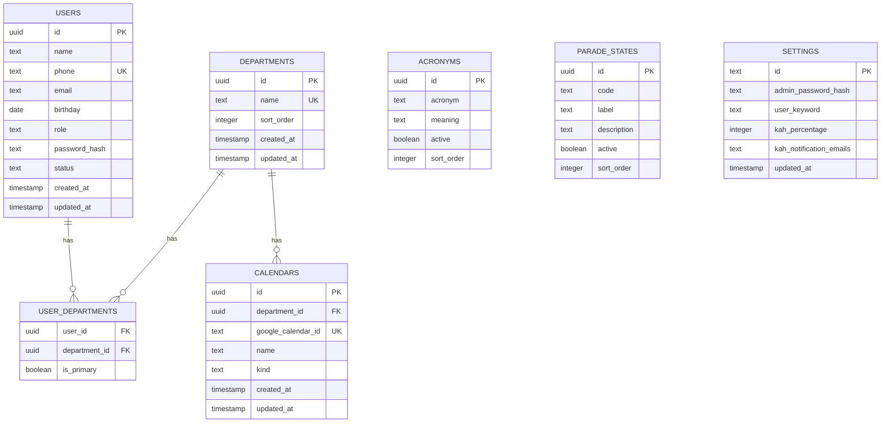

### 1.3.3 Auth & routing

- `src/lib/auth.ts` — NextAuth config: Credentials + JWT, admin/user resolution, JWT/session
  callbacks that carry `id`, `role`, `phone`
- `src/lib/login.ts` — pure (I/O-free) login parsing: `parseUserLogin`, `classifyLogin`
- `src/lib/session.ts` — `requireSession`, `requireAdmin`, `getSession` guards
- `src/types/next-auth.d.ts` — session/JWT type augmentation
- `src/app/api/auth/[...nextauth]/route.ts` — auth handler
- `src/app/login/page.tsx` + `src/components/LoginForm.tsx` — login page + form
- `src/app/(protected)/layout.tsx` + `dashboard/page.tsx` + `AppShellShell` — protected
  dashboard shell
- `src/components/` — `AcronymBadge`, `CalendarSelect`

### 1.3.4 Google integration (stub)

- `src/lib/google/types.ts` — `GoogleIntegration` interface
- `src/lib/google/stub.ts` — no-op implementation
- `src/lib/google/index.ts` — `getGoogleIntegration()` returns the stub until credentials
  are provisioned

### 1.3.5 Tests

- `src/lib/login.test.ts` — 8 passing tests (login parsing)

## 1.4 Verification status

| Check              | Result                |
| ------------------ | --------------------- |
| `pnpm build`       | pass                  |
| `pnpm lint`        | pass                  |
| `pnpm typecheck`   | pass                  |
| `pnpm test`        | 8/8                   |
| `pnpm db:generate` | 7 tables, 1 migration |

## 1.5 Deployment (Vercel) — current blocker & fix

Vercel auto-builds: `main` → production, `dev` → preview.

Two issues were diagnosed and fixed in-repo (committed and pushed to both `dev` and `main`):

1. **`TypeError: Invalid URL` during `/login` prerender.** Caused by an empty
   `NEXTAUTH_URL` env var (NextAuth's `parseUrl` does `new URL('')`). Fix: leave
   `NEXTAUTH_URL` **unset** on Vercel — it injects `VERCEL_URL` and NextAuth falls back
   automatically.
2. **"Ignored build scripts" warning** (esbuild, sharp, unrs-resolver). Root cause: Vercel
   detects pnpm **10** from `lockfileVersion: 9.0` and ignores the pnpm-11 `allowBuilds`
   config. Fix: enable Corepack so Vercel honors `packageManager: pnpm@11.18.0`.

### 1.5.1 Remaining manual steps (Vercel dashboard)

- [x] Add `ENABLE_EXPERIMENTAL_COREPACK` = `1` — done, build passes with no warnings
- [x] Add `NEXTAUTH_SECRET` (`openssl rand -base64 32`) — done per user
- [x] Add `DATABASE_URL` (Neon) — done per user
- [x] Remove any empty `NEXTAUTH_URL` — done per user
- [x] Redeploy and confirm build passes — done, no warnings
- [ ] Set `ADMIN_INITIAL_PASSWORD` on Vercel (seeds the admin password hash on first login)
- [x] Add `DATABASE_URL` as a GitHub Actions repo secret (feeds the CI migrate job)

## 1.6 CI migrations (Phase 1.5)

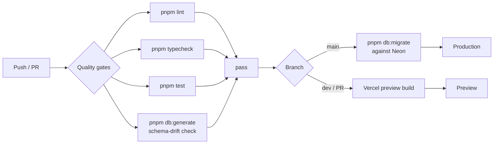

- `migrate` job added to `.github/workflows/ci.yml`: `needs: quality`, runs only on
  `main` push (`if: github.ref == 'refs/heads/main'`), serialized via a `db-migrate`
  concurrency group so concurrent pushes can't race. Applies `pnpm db:migrate` against
  Neon using the `DATABASE_URL` repo secret.
- Single shared Neon DB across Vercel `dev`/`main`, so main-only migration keeps both
  environments schema-synced. Pending `0000` + `0001` apply automatically on the next
  `main` push — no local migrate step needed.

## 1.7 Bootstrap & schema hardening (Phase 1.5)

- `settings` table now has a `settings_singleton` CHECK constraint (`id = 'singleton'`,
  `text` PK with default) — a second row is impossible. Migration `0001` generated.
- `drizzle/meta/` is now **committed** (was gitignored). CI schema-drift step is
  `pnpm db:generate && git diff --exit-code -- drizzle/` so drift actually fails the build.
- `src/lib/bootstrap.ts` `ensureSettingsRow()` lazily seeds the singleton settings row on
  first auth, hashing `ADMIN_INITIAL_PASSWORD` (env). Called at the top of `authorize` in
  `src/lib/auth.ts`. Race-safe via `onConflictDoNothing` + check constraint.
- `ADMIN_INITIAL_PASSWORD` added to `.env.example`.

## 1.8 Roster & Departments (Phase 2a)

- **`src/lib/roster/validate.ts`** — pure helpers: `normalizePhone` (exactly 8 digits after
  stripping), `validateUserForm`, `validateDepartmentForm`. Unit-tested (15 cases).
- **`src/lib/roster/queries.ts`** — `listUsers()` (join `user_departments` + `departments`,
  primary flag, sorted), `listDepartments()`.
- **`src/lib/roster/actions.ts`** — Server Actions guarded by `requireAdmin()`:
  `createUser`, `updateUser`, `setUserStatus` (deactivate-only; no hard delete),
  `createDepartment`, `updateDepartment`, `deleteDepartment`. Exactly-one-primary enforced;
  unique-violation errors mapped to form fields; `revalidatePath` after mutations.
- **`/roster`** — admin-only table (search name/phone, filter status + department, badges
  for role/status/departments with primary marked), create/edit modal, activate/deactivate.
- **`/departments`** — admin-only name + sortOrder CRUD, delete-with-cascade confirm.
- **`AppShellShell`** — Roster/Departments nav links only for admins (role passed from the
  protected layout).
- Verification: migrations applied to Neon (2/2), all 7 tables live, roster queries hit the
  live DB. `pnpm build/lint/typecheck/test` all pass.

## 1.9 Seeding (Phase 2b)

- **`src/db/seed.ts`** — `pnpm db:seed` (tsx). Idempotent, refuses to run with
  `NODE_ENV=production`. Reads `DATABASE_URL` from env or `.env.local`. Seeds 4
  departments, 4 users, 5 memberships; also sets `settings.userKeyword = 'leave'` when
  empty so seeded users can log in as `[phone]leave`. Verified: 4/4/5 created, re-run
  inserts 0.

## 1.10 Next.js 16 upgrade & auth fix (Phase 2c)

**Root cause of login crash (`useEffectEvent is not a function`):** Next.js 15.5.23
bundles its own React (`19.2.0-canary-0bdb9206-20250818`) and aliases all `react`
imports to it at runtime — the installed React version is bypassed. That bundled React
had no `useEffectEvent`, which Mantine v9.5.1 (peer `react ^19.2.0`, the whole v9 line
requires React 19.2 stable) calls inside `AppShell`. The protected shell crashed right
after login on both Vercel and local. This predated the roster work (latent since
Phase 1); it surfaced once login reached the protected layout.

**Fix:** upgraded Next.js `15.5.23` → `16.3.1` (the line that bundles React 19.2 stable;
installed bundle is `19.3.0-canary` with `useEffectEvent`). Also `eslint-config-next`
`15.5.23` → `16.3.1`.

- `eslint.config.mjs` rewritten: Next 16 ships flat configs directly, so
  `next/core-web-vitals` + `next/typescript` are imported as arrays instead of via
  `FlatCompat` (the legacy wrapper crashed with a circular-structure error).
- `next.config.ts` unchanged (`experimental.optimizePackageImports` still valid).
- tsconfig auto-updated by Next 16: `jsx: preserve` → `react-jsx`, added
  `.next/dev/types/**/*.ts`.
- Verified with `next start`: admin login → dashboard/roster/departments 200;
  non-admin (Bob `82345678leave`) → dashboard 200, `/roster` + `/departments` 307 →
  `/dashboard`. `pnpm build/lint/typecheck/test` (23) pass.

## 1.11 Departments as Google Calendars + sharing + audit (Phase 2d)

Departments are now Google Calendars: the `calendars` table is the department registry,
Google Calendar is the source of truth for existence/ACLs, and nothing sharing-related is
stored in the DB.

- **Schema** — migrations `0002`–`0004`: `users.department_id` (backfilled from
  `user_departments`, then `departments`/`user_departments` dropped), `calendars` no
  longer references `departments`, new `audit_logs` table. `src/db/schema.ts` rewritten
  to match `0004` exactly (verified: `pnpm db:generate` produces no diff).
- **Google layer** — `src/lib/google/config.ts` (env parsing, `getServiceAccountConfig`,
  `getAdminGoogleEmail`), `real.ts` (JWT service account, Calendar v3; event/Gmail methods
  still throw "not implemented yet"), `types.ts` (interface + `GoogleCalendarInfo`),
  `stub.ts` (no-op fallback), `index.ts` (`getGoogleIntegration()` real-when-configured,
  `googleCalendarConfigured()`). Env vars: `GOOGLE_SERVICE_ACCOUNT_BASE64` (or
  `GOOGLE_CLIENT_EMAIL`/`GOOGLE_PRIVATE_KEY`) + `GOOGLE_DELEGATE_EMAIL`.
- **Sharing** — `src/lib/roster/shares.ts` (`listDepartmentAccess` reconciles assigned
  users as readers, grants admin owner, returns `DepartmentAccess`); actions
  `get/grant/revokeDepartmentAccess`; UI modal `DepartmentShares.tsx` (copy calendar ID,
  add/remove manual shares, surfaces `syncWarning` when Google is unconfigured).
- **Audit** — `audit_logs` written best-effort via `src/lib/audit/log.ts` +
  `build.ts` (actions `user.create`/`calendar.create`/`access.grant`/…, field diffs via
  `diff.ts`). Hooked into roster + calendar + share server actions.
- **Roster (single-department)** — `users` has one `department_id`; `queries.ts`
  `listUsers()` left-joins `calendars`, `UserTable`/`UserForm` use a single clearable
  department select; `actions.ts` `createUser`/`updateUser`/`setUserStatus`.
- **Departments page** — `DepartmentTable` lists calendars (name + calendar ID) with
  Share/Rename/Delete; `DepartmentForm` creates/renames a Google Calendar; creation is
  blocked with a clear message when Google is unconfigured.
- **New dependency** — `@tabler/icons-react` added (used by `DepartmentShares`).
- Verification: `pnpm build/lint/typecheck/test` (53) pass; `db:generate` shows no schema
  drift.

## 1.12 Mobile-only UI refactor and Users rename (Phase 2e)

The app is **strictly mobile-only**: no desktop sidebar/hamburger layout exists anymore.

- **Bottom nav** — `src/components/AppShellShell.tsx` renders `AppShell.Footer` with
  icon + label links (Dashboard `IconLayoutDashboard`, Users `IconUsers`, Departments
  `IconBuilding`; non-admins see only Dashboard). Header is a slim centered "Cloudy" brand
  bar; footer adds `env(safe-area-inset-bottom)` padding. Active tab matched via
  `pathname.startsWith(href)`.
- **Card lists** — `UserTable` and `DepartmentTable` render each row as a stacked
  `Paper` card (badges + action buttons) instead of `<Table>`; the users filter bar stacks
  vertically. Modals (`UserForm`, `DepartmentForm`, `DepartmentShares`, delete confirm)
  are floating `centered` dialogs with a fixed `size`.
- **"Users" rename** — nav label + page title "Roster" → "Users"; route `/roster` moved
  to `/users` (`git mv src/app/(protected)/roster src/app/(protected)/users`,
  `RosterPage` → `UsersPage`). `src/lib/roster/actions.ts` `revalidatePath` calls and the
  `src/lib/audit/build.test.ts` route fixtures updated. The internal `src/lib/roster/*`
  module namespace is intentionally left as "roster".
- Verification: `pnpm lint`, `pnpm typecheck`, `pnpm test` (53), and `pnpm build` all
  pass; build route list shows `/users` and no `/roster`.

## 1.13 Admin Settings hub and login keyword (Phase 2f)

The Users and Departments sections now live under a single **Admin Settings** hub,
reachable only via the profile icon in the header. The bottom nav bar is gone.

- **Routing** — `src/app/(protected)/users` and `.../departments` moved to
  `src/app/(protected)/settings/users` and `.../settings/departments`. A new
  `settings/layout.tsx` calls `requireAdmin()` once (removed from the two pages) and
  renders a horizontal, scrollable `SettingsTabs` bar; `settings/page.tsx` redirects
  `/settings` → `/settings/users` (Users is the default tab). Tabs: **Users**
  (`/settings/users`), **Departments** (`/settings/departments`), **Event Types**
  (`/settings/event-types`), **Templates** (`/settings/templates`), **General**
  (`/settings/general`) — Event Types and Templates were added in phases 2g and 2p.
  `next.config.ts` adds permanent redirects from the old `/users` and `/departments`
  URLs.
- **Keyword setting (General tab)** — new `src/lib/settings/*` module mirroring the
  roster module: `validate.ts` (`normalizeKeyword` → trimmed, lowercased, `/^[a-z]{1,12}$/`,
  plus `validateKeywordForm`; unit-tested), `queries.ts` (`getSettings()` returns only
  `userKeyword`, never the admin password hash), `actions.ts` (`updateKeyword` server
  action: `requireAdmin`, validate, `UPDATE settings`, audit log `settings.update` with a
  field diff, `revalidatePath("/settings/general")`). `AUDIT_ACTIONS.settingsUpdate` added
  to `src/lib/audit/build.ts`.
- **Navigation** — `AppShellShell` drops the `AppShell.Footer`/bottom nav entirely; the
  "Cloudy" brand is now a link to `/dashboard`. `UserMenu` takes a `role` prop and shows an
  **Admin Settings** item (→ `/settings`) for admins only, above Log out.
  `FloatingToolbar` bottom offset changed from the old footer clearance (76px) to
  `calc(env(safe-area-inset-bottom) + 16px)`.
- **Revalidation** — `src/lib/roster/actions.ts` `revalidatePath` targets updated to
  `/settings/users` and `/settings/departments`.

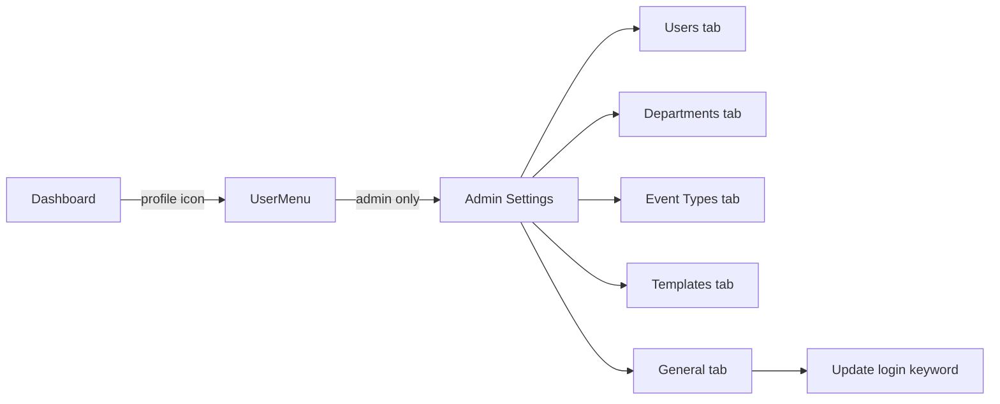

- Verification: `pnpm lint/typecheck/test/build` pass; no schema change so `db:generate`
  shows no drift.

## 1.14 Event Types (Phase 2g)

A new **Event Types** tab in Admin Settings lets admins define the list of event names that
can later be tagged onto calendar events. This phase ships only the lookup list (create /
rename / delete) — tagging onto events is a future phase.

- **Schema** — migration `0005` adds `event_types` (`id` uuid pk, `name` text not null,
  `created_at`/`updated_at`) with a unique index on `name` so the same tag can't be defined
  twice. `src/db/schema.ts` exports the `eventTypes` table + `EventType` type. Phase 2p adds
  an app-required, unique `shortname` acronym (migration `0009`, mirroring `users.shortname`).
- **Module** — `src/lib/eventTypes/*` mirrors the roster module:
  `validate.ts` (`validateEventTypeForm`, unit-tested), `queries.ts` (`listEventTypes()`
  ordered by name; `getEventTypesByNames()` for title rendering), `actions.ts`
  (`createEventType`/`renameEventType`/`deleteEventType` server actions — `requireAdmin`,
  validate, DB op, audit log, `revalidatePath`, unique violation → "already exists" error,
  routed by constraint for `name` vs `shortname`).
- **UI** — `src/app/(protected)/settings/event-types/` (`page.tsx`, `EventTypeTable.tsx`
  card list showing name + shortname, Rename/Delete + floating "Add event type" button,
  `EventTypeForm.tsx` centered modal with required Name + Shortname, `loading.tsx` skeleton).
  Added to `SettingsTabs` between Departments and General.
- **Audit** — `AUDIT_ACTIONS` gains `eventType.create`/`eventType.rename`/
  `eventType.delete`.
- Verification: `pnpm lint`, `pnpm typecheck`, `pnpm test` (68), `pnpm build`, and
  `pnpm db:generate` (no drift) all pass; build route list shows `/settings/event-types`.

## 1.15 Next steps (Phase 2+)

1. Wire the real Gmail method in `real.ts` (Gmail send-as, KAH visibility) — calendar
   event read/write is now implemented.
2. Core screens still pending: KAH constraint checks, parade states, acronyms on event
   titles, on-behalf/masquerade permissions, and VCF contacts export.
3. Gmail notifications for KAH percentage breaches.

## 1.16 Calendar events (Phase 2h)

The `/dashboard` placeholder is replaced by a real month calendar with full event
create/edit/delete/view. Events remain 100% in Google Calendar — no event table exists.

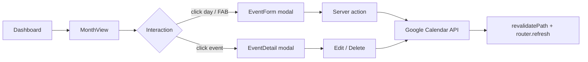

- **Dependency** — added `@mantine/schedule@9.5.1` (the `MonthView` component) and `dayjs`
  (its required peer). `@mantine/dates/styles.css` + `@mantine/schedule/styles.css` imported
  in `src/app/layout.tsx` (order: core → dates → schedule).
- **Google layer** (`src/lib/google/`) — implemented `createEvent`/`updateEvent`/
  `deleteEvent`/`listEvents` in `real.ts` (`events.insert/update/delete/list`,
  `singleEvents: true`, `orderBy: startTime`); `listEvents` added to the interface + stub.
  All-day events use Google's `date` field with an exclusive end date; timed events use
  `dateTime`. `GcalEventItem` added for read-back.
- **Events module** (`src/lib/events/*`, mirrors `roster`/`eventTypes`):
  - `notes.ts` — pure encode/parse of the machine-readable "notes" JSON block stored in the
    event `description` (currently `{ eventType }`, extensible for future fields).
  - `datetime.ts` — pure date/time helpers; wall-clock times are treated as fixed
    `Asia/Singapore` (UTC+8, no DST) so conversions are deterministic and testable.
  - `validate.ts` — pure form validation (title/start/end, end ≥ start).
  - `queries.ts` — `listCalendars`, `getUserDepartmentId`, and `fetchMonthEvents` which reads
    events across the selected calendars and maps them to `CalendarEvent` (schedule-ready
    data with a `payload` carrying calendar id, Google event id, all-day flag, and parsed
    event type).
  - `actions.ts` — `createEvent`/`updateEvent`/`deleteEvent` server actions (`requireSession`,
    audit-logged, `revalidatePath("/dashboard")`). Admins pick a target calendar; regular
    users always target their own department.
- **Dashboard** (`src/app/(protected)/dashboard/`) — `page.tsx` (server) reads `month`/`cal`/
  `types` search params and fetches events; `DashboardView.tsx` (client) renders a custom
  header + `MonthView` (`withHeader={false}`), `FilterButton` → `FilterModal` (Calendars +
  Event Types groups), `EventForm.tsx` (description, all-day toggle swapping
  `DateTimePicker` ↔ `DatePickerInput`, event-type `Select`, admin calendar `Select`),
  `EventDetail.tsx` (view + Edit/Delete), a `loading.tsx` skeleton, and a FAB.
- **Default view** — non-admin shows only their department calendar; admin shows all
  calendars. The filter always offers every calendar + every event type (regardless of
  access). Google unconfigured → empty calendar + a notice, and the FAB is disabled.
- **Audit** — `AUDIT_ACTIONS` gains `event.create`/`event.update`/`event.delete`.
- Verification: `pnpm lint`, `pnpm typecheck`, `pnpm test` (86), `pnpm build` (route list
  shows `/dashboard`), and `pnpm db:generate` (no drift — no schema change) all pass.

## 1.17 Dashboard mobile month view (Phase 2i)

`/dashboard` now supports two views, switched by an icon `SegmentedControl` in the header
row: the default `MonthView` grid, and `@mantine/schedule` `MobileMonthView` (month grid
with event-dot indicators). The choice persists in the URL as `?view=mobile` (omitted =
month), matching the existing `month`/`cal`/`types` URL-state pattern. No new dependency —
`MobileMonthView` and `AgendaView` ship in the already-installed `@mantine/schedule@9.5.1`.

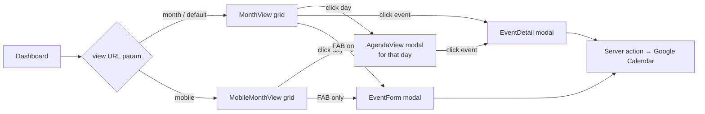

- **Toggle** — `SegmentedControl` (`size="xs"`, `aria-label="Calendar view"`) with
  `IconCalendarMonth` / `IconCalendarDot` segments, placed between "Today" and the filter
  button in `DashboardView.tsx`. `switchView()` writes/removes the `view` param via the
  existing `navigate()` URL helper (month is the default, so the param is omitted for it).
  `dashboard/page.tsx` reads `view` (`params.view === "mobile" ? "mobile" : "month"`) and
  passes it through; both views render the same fetched month events.
- **MobileMonthView** — rendered when `view === "mobile"`. A day tap (`onDayClick`) opens
  the day-agenda modal shared with MonthView (whose old tap-to-create was replaced by the
  same modal, so creation is strictly from the floating "New event" button in both views —
  its default date stays "today"; the form's date picker covers other days). The
  component's built-in header (year back-button + a month label duplicating our own) and
  bottom event list (duplicated by the agenda modal) are hidden via the `styles` prop:
  `mobileMonthViewHeader` and `mobileMonthViewEventsList` → `{ display: "none" }`. The app's
  own header row remains the only navigation chrome.
- **AgendaView modal** — a day tap in either view opens a floating `centered`
  `size="sm"` modal titled with the full day (e.g. "Saturday, August 16, 2026"), wrapping
  `AgendaView` with a single-day range (`rangeStart` = `rangeEnd` = tapped day) and the
  month's events. `agendaViewHeader` is hidden via `styles` because its label renders
  "X – X" even for a single day; the modal title carries the date instead. Clicking an
  event opens `EventDetail` on top — the agenda modal is rendered before `EventDetail` in
  the tree so its portal mounts first and the detail modal stacks above it. Deleting from
  the detail closes both the detail and the agenda modal before `router.refresh()`, so a
  deleted event doesn't linger in the open agenda list.
- **Mantine 9.5.1 gotchas (verified against the installed package source)** —
  `MobileMonthView` has **no `withHeader` prop** (unlike `MonthView`); the built-in
  header is the only leak and must be suppressed with `styles` overrides. `classNames`
  takes class-name **strings**, not `CSSProperties` — inline style overrides go in the
  `styles` prop, which is deep-merged over the component's own styles with user values
  winning. `EventDetail`'s detail/confirm portals mount only while open, which is what
  makes the agenda → detail stacking order work.
- **Verification** — `pnpm lint`, `pnpm typecheck`, `pnpm test` (86), `pnpm build` (route
  list still shows `/dashboard`), and `pnpm db:generate` (no drift — no schema change) all
  pass.

## 1.18 Agenda day swipe (Phase 2j)

The agenda modal's day can now be changed by swiping left/right across the agenda list
(touch) or dragging it horizontally (mouse), plus prev/next `ActionIcon` chevrons
flanking the date in the modal title for mouse/keyboard use. Swipe left = next day,
swipe right = previous day.

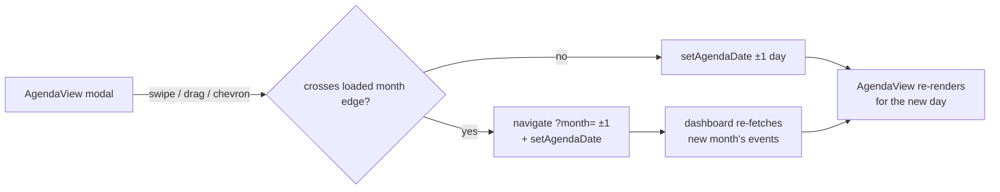

- **Implementation** — `DashboardView.tsx` only, using `useDrag` from the
  already-installed `@mantine/hooks` (no new dependency): options
  `{ axis: "lock", axisThreshold: 8, threshold: 10, filterTaps: true }`. The day changes
  on pointer release when horizontal displacement ≥ `DAY_SWIPE_THRESHOLD` (48px) after
  axis locking; canceled gestures (the browser taking over vertical scroll →
  `pointercancel`) and taps are ignored, so event-row taps still open `EventDetail`.
- **Scroll coexistence** — the wrapper `div` around `AgendaView` sets
  `style={{ touchAction: "pan-y" }}`: native vertical scrolling of a long agenda day is
  kept by the browser, and horizontal gestures are delivered as pointer events. A one-shot
  `onClickCapture` guard swallows the click that would otherwise fire when a mouse drag
  ends on an event row.
- **Month auto-navigation** — events are fetched per calendar month
  (`fetchMonthEvents`), so swiping past the first/last day of the loaded month updates
  `?month=` through the existing `navigate()` URL helper while setting `agendaDate`; the
  `agendaDate` client state survives the RSC navigation, so the modal stays open and the
  agenda repopulates from the new month's `events` prop. `shiftAgendaDay(±1)` is the
  shared helper behind both the chevrons and the swipe handler.
- **Verification** — `pnpm lint`, `pnpm typecheck`, `pnpm test` (86), and `pnpm build`
  all pass; dev-server smoke check shows `/dashboard` 307 → `/login` (auth redirect) and
  `/login` 200.

## 1.19 Schedule view & event invitees (Phase 2k)

`/dashboard` now has three views behind a full-viewport **tab strip** (replacing the old
icon-only `SegmentedControl`): **Month** (`IconCalendarMonth`), **Mobile**
(`IconCalendarDot`), **Schedule** (`IconCalendarUser`) — each tab shows its icon and
label, with the tabs stretched across the viewport above the date-navigation row. The
Schedule view is `@mantine/schedule` `ResourcesDayView`: one row per **user** of the
selected (filtered) departments, plus a **department row** at the top of each department
section. Group header columns appear only when more than one department is filtered.
The day navigates with `‹`/`›`/Today (`?date=YYYY-MM-DD`; `?month` is kept in sync and
derived from `date` by the page), and `?view=schedule` is the URL state.

Because events previously carried no link to a person, this phase adds the **invitee
system**. The notes JSON block on Google events gains three fields (no DB migration —
the notes block is the app's own extensible format):

- `createdBy` — the creating user's id; the creator's row **always** shows the event.
- `inviteeUsers` — ids of tagged users; the event also appears in each of their rows.
- `inviteeDepartments` — ids of tagged department calendars; the event appears in each
  department row.

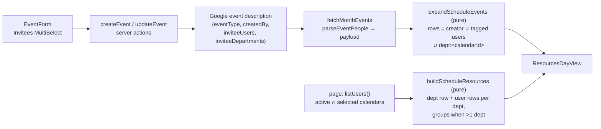

- **Notes** (`src/lib/events/notes.ts`) — `EventNotes` gains `createdBy?`,
  `inviteeUsers?`, `inviteeDepartments?`; `encodeEventNotes` now also strips empty
  arrays; new pure `parseEventPeople(description)` returns `{ creatorId, userIds,
departmentIds }` and tolerates absent/malformed values (unique, non-empty strings
  only). Unit-tested in `notes.test.ts` (12 cases now).
- **Schedule helpers** (new `src/lib/events/schedule.ts`, all pure, all unit-tested in
  `schedule.test.ts` — 12 cases):
  - `departmentRowId`/`isDepartmentRowId` — resource rows keyed `dept:<calendarId>` to
    keep them distinct from user-uuid rows.
  - `rowsForEvent(people)` — union of creator, tagged users, and tagged departments,
    deduped.
  - `expandScheduleEvents(events)` — one `ScheduleEvent` per row (`id` suffixed
    `::rowId`, `resourceId` set); events linked to no one expand to nothing.
  - `buildScheduleResources({ departments, users, events })` — per selected department:
    a department row then its active users (sorted by name); a userless department is
    kept only when an event tags it; `groups` emitted only for >1 department.
- **Queries** (`src/lib/events/queries.ts`) — `CalendarEventPayload` gains
  `creatorId`/`inviteeUserIds`/`inviteeDepartmentIds`, populated in
  `fetchMonthEvents` via `parseEventPeople`. Month/Mobile/Agenda views ignore the new
  fields.
- **Form & actions** — `EventFormValues` gains `creatorId` + the two invitee arrays
  (pass-through, no new validation). `EventForm` adds an "Invitees" `MultiSelect`
  (Mantine v9's dedicated multi-select component; v9 `Select` has no `multiple` prop)
  with grouped data (`user:<id>` / `dept:<id>` prefixed values disambiguate the two
  uuid namespaces; split on submit). Picker scope: non-admins → own department + its
  active users; admins → all departments + all active users. `creatorId` is the session
  user on create and is **preserved from the original payload on edit** (editing never
  reassigns the creator row). `actions.ts` writes the three notes fields and audit
  `details` record invitee counts.
- **Page** (`dashboard/page.tsx`) — `view` enum gains `"schedule"`; `date` param
  (validated `YYYY-MM-DD`, default today) drives the month when present. One
  `listUsers()` call derives: schedule rows (active users in the selected calendars),
  role-scoped invitee picker options, and the `peopleNames`/`calendarNames` maps for
  the detail modal.
- **DashboardView** — top `Tabs` strip (controlled, equal-width `flex: 1` tabs with
  icon + label; `Tabs` `onChange` is typed `string | null`) → `switchView` writes
  `?view=schedule&date=today` on entry (month left to be derived) and restores the
  viewed month on exit. Schedule render: `ResourcesDayView` with `withHeader={false}`,
  full-day range (`00:00:00`–`23:59:59`, 60-min intervals, `startScrollTime 07:00`),
  `withCurrentTimeIndicator`, current-time bubble, `onEventClick` → existing
  `EventDetail`, and `renderResourceLabel` styling department rows (building icon +
  bold). Empty state (no rows for the filter) shows a `Paper` notice instead of an
  empty grid. `ScheduleGridSkeleton` (label + lane rows) backs the `isPending` state.
  The date-nav row reuses its chevrons/Today in day mode (`ddd, MMM D, YYYY`).
- **EventDetail** — "People:" badges (creator + tagged users, deduped, resolved via
  `peopleNames`) and "Departments:" badges (tagged departments other than the event's
  own calendar, resolved via `calendarNames`); unknown ids are silently skipped.
- **Back-compat** — events created before this phase have no people fields, so they
  still render in Month/Mobile/Agenda but intentionally do **not** appear in any
  Schedule row (no row key to attach to). Tagging remains optional.
- **Verification** — `pnpm lint`, `pnpm typecheck`, `pnpm test` (103), `pnpm build`,
  and `pnpm db:generate` (no drift — no schema change) all pass. Dev-server smoke
  against the live dev Google Calendar: `/dashboard`, `?view=mobile`,
  `?view=schedule` all 200 with the three tabs rendered (`role="tab"`, correct
  `aria-selected`); a temporary event tagged with the active user + their department
  read back from Google rendered **in both** the department row and the user row of
  `ResourcesDayView`; pre-existing untagged events correctly stayed out of the
  schedule rows; the smoke event was deleted afterwards.

## 1.20 Cross-department event copies (Phase 2l)

The event form **no longer offers a calendar picker** (admins included). Where an event
lives is derived from its people: the **creator's department** plus every **tagged
user's department** plus every **tagged department** — one Google Calendar copy per
target calendar. When everyone is in one department this is exactly one event (the
pre-2l behavior, now automatic); a creator with no department can create an event only
by tagging at least one invitee, otherwise creation is blocked with
"Assign yourself to a department or tag an invitee".

All copies of a logical event share a new `eventId` (UUID) in the notes JSON — the
linking mechanism. No DB table is added (events stay 100% in Google Calendar), and
copies are rediscovered by listing each target calendar and matching the `eventId` in
the event description.

```mermaid
sequenceDiagram
    participant F as EventForm
    participant A as events/actions
    participant D as departments (db)
    participant G as Google Calendar
    F->>A: create / update(ref, values) — no calendarId
    A->>D: creator + invited users' departments
    A->>A: targets = union(creatorDept, inviteeDepts, taggedDepts)
    Note over A,G: create: insert one copy per target (same eventId in notes),<br/>rollback partial copies on failure
    Note over A,G: update: per calendar in old∪new targets, list over old∪new time
    range (±1 day), match notes.eventId →<br/>create missing / update existing / delete retired
    Note over A,G: delete: per target in notes-derived set, list + delete all matches
```

- **Targets module** (new `src/lib/events/targets.ts`, pure, unit-tested — 9 cases
  in `targets.test.ts`): `deriveTargetCalendarIds` (creator ∪ invited users' depts ∪
  tagged depts, deduped, nulls dropped), `diffEventTargets` (create/keep/remove plan),
  `dedupeEventsByGroupId` (first copy per group id wins; input order decides the
  representative), and `EventRef` + `eventRefFromCalendarEvent` (the representative
  copy's fields passed to edit/delete).
- **Notes** (`src/lib/events/notes.ts`) — `EventNotes.eventId?`;
  `parseEventPeople` now also returns `eventId: string | null`.
- **Datetime** (`src/lib/events/datetime.ts`) — new `absEventRange(naiveStart,
naiveEnd, allDay)`: timed events parse as UTC+8 instants, all-day events use Google's
  date / exclusive-end-date semantics. `buildGcalEventInput` refactored onto it; the
  reconcile search range is `unionRange(old, new)` grown ±1 day so copies whose times
  drifted (or are being moved) are still found.
- **Queries** (`src/lib/events/queries.ts`) — `CalendarEventPayload.eventId`; the
  calendars row fetch is ordered by name so the deduped representative is
  deterministic; `fetchMonthEvents` returns `dedupeEventsByGroupId(events)` — with
  several department calendars filtered (admin default) a logical event shows **once**
  in Month/Mobile/Agenda/Schedule. New batched `getUserDepartmentIds(userIds)`.
- **Actions** (`src/lib/events/actions.ts`) — rewritten around `EventRef`:
  - `createEvent`: derive targets (empty ⇒ block error), `eventId =
crypto.randomUUID()`, one copy per target; a mid-loop failure rolls back the copies
    already created; audit entry carries `eventId`, target calendar ids/names, and the
    Google event ids.
  - `updateEvent(ref, values)`: `oldTargets` from the ref's people fields, `newTargets`
    from the form; per calendar in the union, `findCopies` (notes `eventId` match; on a
    legacy first edit also the `googleEventId` in the representative calendar) drives
    create / full-contents update / delete. The plan is idempotent, so a half-failed
    attempt self-heals on retry; newly created copies roll back on failure.
  - `deleteEvent(ref)`: targets from the ref's people fields, then list + delete every
    matching copy.
  - **Legacy events** (no `eventId`): keep working as single events; the first edit
    generates the group id, backfills it into the existing copy, and — once invitees are
    spread across departments — converges by creating the missing copies. When nothing
    else derives, the target set falls back to the representative calendar so editing a
    legacy event never blocks.
  - Malformed client bodies (non-array invitee fields) are coerced instead of 500ing.
  - `EventFormValues` drops `calendarId` (and the form/admin picker with it);
    `EventActionResult` no longer targets that field.
- **UI** — `dashboard/page.tsx` drops `initialCalendarId`; `EventForm` drops the
  Calendar `Select` (invitees `MultiSelect` description now explains the per-department
  copies); `EventDetail`/`EventForm` build the `EventRef` via
  `eventRefFromCalendarEvent` for `updateEvent`/`deleteEvent`.
- **Verification** — `pnpm lint`, `pnpm typecheck`, `pnpm test` (114), `pnpm build`,
  and `pnpm db:generate` (no drift — no schema change) all pass. Live smoke against the
  dev Google Calendar (via a temporary authenticated route, removed afterwards):
  admin without a department + no invitees → blocked with the clear error; tagging an
  active dev-COU user + the dev-CIU department → exactly two copies sharing one
  `eventId`, one per calendar; all-calendars read deduped to a single event; renaming +
  time-shifting + dropping the dev-CIU tag in one edit → dev-CIU copy deleted, dev-COU
  copy updated in place with the new title/times; re-tagging dev-CIU → copy recreated
  under the same `eventId`; delete → both copies gone; editing a legacy event →
  `eventId` backfilled with the single copy preserved.

## 1.21 User shortname (Phase 2m)

Users now carry a **shortname** (acronym/initials), captured in the Users create/edit form and
stored for future phases (e.g. schedule/KAH displays) to leverage. Per product decisions: the
field is **required** in the form, **unique** across users, and stored **exactly as typed**
(no normalization).

- **Schema** — migration `0006` adds `users.shortname` (nullable `text`, so the auto-applied
  migration is safe on the populated Neon `users` table) plus a unique index
  `users_shortname_idx` (Postgres allows multiple NULLs under a unique index, so legacy rows
  are untouched). `src/db/schema.ts` updated to match; `drizzle/meta/` journal + snapshot
  committed.
- **Validation** (`src/lib/roster/validate.ts`) — `UserFormValues` gains required
  `shortname: string`, `UserFormErrors` gains `shortname?`; `validateUserForm` returns
  "Shortname is required" for blank/whitespace. Stored as typed — no uppercase/trimming.
- **Actions** (`src/lib/roster/actions.ts`) — `createUser`/`updateUser` write `shortname`,
  the audit snapshot (`userSnapshot`) and `diffFields` include it, and audit `details` carry
  it. `RosterActionResult.field` gains `"shortname"`; the `23505` catch now routes by the
  violated constraint (postgres-js `constraint_name`): `users_shortname_idx` → "A user with
  this shortname already exists" on the shortname field, otherwise the existing phone message.
- **Queries** (`src/lib/roster/queries.ts`) — `RosterUser.shortname: string | null` selected
  and mapped in `listUsers()`.
- **UI** (`UserForm.tsx`) — new required `Shortname` `TextInput` ("e.g. ALICE") between Name
  and Phone; `initialValues` maps `user.shortname ?? ""` on edit; the submit handler surfaces
  the shortname duplicate error on the field. No card-list display change (deferred).
- **Tests** — `validate.test.ts` base form gains `shortname`; new required-shortname cases.
- Verification: `pnpm lint`, `pnpm typecheck`, `pnpm test`, `pnpm build`, and
  `pnpm db:generate` (no drift — migration `0006` in sync) all pass.

## 1.22 Display name template (Phase 2n)

Admins can define a **display name template** that composes each user's fully qualified name
from their name and department. The template is a global setting with `{name}` / `{department}`
placeholders (case-insensitive), e.g. `{name}: DEPT-{department}` renders
`John Lai: DEPT-Engineering 1`. The section lives as a card on the General settings tab, with a
live preview against an example and real users; the reusable helper is wired into the Users
admin card list as proof. Missing values (e.g. a user with no department) render as an empty
string (no gap-collapsing).

- **Schema** — migration `0007` adds `settings.name_template` (`text`, `NOT NULL` default
  `'{name}'`), so existing rows and the bootstrap insert both pick up the plain-name fallback.
  `src/db/schema.ts` updated; `drizzle/meta/` journal + snapshot generated. `ensureSettingsRow`
  needs no change.
- **Formatter** — new pure `src/lib/settings/formatName.ts`: `formatFullName({ name,
departmentName }, template)` substitutes every `{...}` token case-insensitively, resolves
  missing values to `""`, leaves unknown tokens literal, and trims the result. Unit-tested
  (`formatName.test.ts`, 9 cases).
- **Validation** (`src/lib/settings/validate.ts`) — `NameTemplateFormValues`/Errors and
  `validateNameTemplate` (non-empty after trim, ≤ 200 chars); `NAME_TEMPLATE_PLACEHOLDERS`
  (`["{name}", "{department}"]`) drives the insert chips. `validate.test.ts` gains 4 cases.
- **Actions** (`src/lib/settings/actions.ts`) — `updateNameTemplate(template)` mirrors
  `updateKeyword`: `requireAdmin`, validate, `UPDATE settings`, audit-log `settings.update`
  with a `nameTemplate` diff, `revalidatePath("/settings/general")`. `SettingsActionResult.field`
  gains `"nameTemplate"`.
- **Queries** (`src/lib/settings/queries.ts`) — `getSettings()` returns `nameTemplate`
  (falls back to `"{name}"`).
- **UI** (`src/app/(protected)/settings/general/`) — `page.tsx` also fetches `listUsers()`
  (first 5 for preview); `SettingsForm.tsx` gains a second "Display name template" `Paper`
  card: a `TextInput` with `{name}` / `{department}` chips that insert at the cursor, plus a
  live preview (the John Lai / Engineering 1 example then 5 real users) that re-renders as the
  admin types. Save button → `updateNameTemplate`. `loading.tsx` skeleton covers two cards.
- **Proof in Users list** — `settings/users/page.tsx` fetches `getSettings()` and passes
  `nameTemplate` to `UserTable`, where each card renders `formatFullName(...)` as a muted
  secondary line under the user's name.
- Verification: `pnpm lint`, `pnpm typecheck`, `pnpm test` (128), `pnpm build`, and
  `pnpm db:generate` (no drift — migration `0007` in sync) all pass.

## 1.23 Event title template (Phase 2o)

Admins can define an **event title template** that composes the title written to Google
Calendar events — the same "global template setting + pure formatter + insert chips +
live preview" pattern as the display name template (1.22). The template is
`settings.event_title_template` (default `'{description}'`, i.e. today's raw-description
behavior) expanded by the pure `formatEventTitle()` in
`src/lib/settings/formatEventTitle.ts`. Tokens are case-insensitive:

- `{description}` — the text the user typed into the event form ("Event Description")
- `{type}` / `{type:acronym}` — the event type name, and its shortname acronym (falling back
  to the name when blank); empty when no type is set
- `{people}` / `{people:full}` / `{people:acronym}` / `{people:fqn}` — invited personnel
  joined with `", "`; bare `{people}` and `{people:fqn}` render the fully qualified name
  (via the saved display-name template), `{people:full}` the plain name, and
  `{people:acronym}` the shortname (falling back to the name when blank)
- `{departments}` — invited departments joined with `", "`

Unknown tokens and unknown styles stay literal; empty lists render as `""` (no
gap-collapsing, consistent with `formatFullName`).

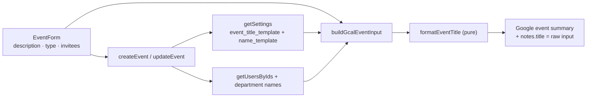

- **Schema** — migration `0008` adds `settings.event_title_template` (`text`, `NOT NULL`,
  default `'{description}'`), so existing rows and the bootstrap insert fall back to the
  plain description.
- **Formatter** — new pure `formatEventTitle(input, template)`: people arrive pre-resolved
  as `{ full, acronym, fqn }` per person, so the formatter is pure string substitution
  (token regex handles `{token}` and `{token:style}`). Unit-tested
  (`formatEventTitle.test.ts`, 12 cases).
- **Validation** (`src/lib/settings/validate.ts`) — `validateEventTitleTemplate`
  (non-empty after trim, ≤ 200 chars); `EVENT_TITLE_PLACEHOLDERS` drives the insert
  chips. 4 new cases in `validate.test.ts`.
- **Settings** — `getSettings()` returns `eventTitleTemplate`; new
  `updateEventTitleTemplate` server action (mirror of `updateNameTemplate`:
  `requireAdmin`, validate, `UPDATE settings`, audit `settings.update` with a diff,
  `revalidatePath("/settings/templates")`).
- **Round-trip fix** — the raw description is now stored in the notes JSON
  (`notes.title`; `parseEventTitle` in `src/lib/events/notes.ts`), so editing an event
  prefills the form with the _original_ text, not the rendered calendar title. Legacy
  events (no `notes.title`) fall back to the existing summary and are backfilled on
  first edit. `CalendarEventPayload.rawTitle` carries it to the client.
- **Events actions** (`src/lib/events/actions.ts`) — `createEvent`/`updateEvent` resolve
  the title context **once** per operation: invited people (name / shortname / FQN via
  the saved display-name template, using new `getUsersByIds()` in `src/lib/roster/queries.ts`),
  the event type's shortname (via `getEventTypesByNames()`), plus department names;
  `buildGcalEventInput` then renders the Google `summary` via the template. A template
  that renders to empty falls back to the raw description, so an event is never titled
  with an empty string. All department copies of one logical event share the same
  rendered title.
- **UI** (`src/app/(protected)/settings/templates/`, moved from General in Phase 2p) —
  "Event Title Template" card: input with insert-at-cursor chips for the eight tokens,
  hint lines explaining the type and people styles, and a live preview of a sample
  event (description "Team offsite" + first event type + up to two real users as
  invitees + their departments) that re-renders as the admin types.
- **Scoping** — only newly created/edited events re-render; existing Google summaries are
  untouched (legacy events lack the raw fields, so a bulk back-render isn't feasible).
  Changing the template does not rewrite past events.
- Verification: `pnpm lint`, `pnpm typecheck`, `pnpm test` (146), `pnpm build`, and
  `pnpm db:generate` (no drift — migration `0008` in sync) all pass.

## 1.24 Event type acronym + Templates tab (Phase 2p)

Two follow-ups to the template work: event types gain a required shortname acronym (like
users) that the event title template can render, and the two template cards move out of the
General tab into a dedicated **Templates** tab.

- **Event type shortname** — event types gain an app-required, unique `shortname` acronym,
  mirroring `users.shortname` (DB-nullable + unique index `event_types_shortname_idx`,
  migration `0009`; the app requires it). `validateEventTypeForm` flags a blank shortname;
  `createEventType`/`renameEventType` persist and audit it, and the unique-violation catch
  routes by constraint so a duplicate shortname errors on the shortname field. The
  `EventTypeForm` modal adds a required Shortname input; `EventTypeTable` cards show the
  shortname as a muted line under the name.
- **`{type:acronym}` token** — `formatEventTitle()` now takes the event type as
  `{ name, acronym } | null`: bare `{type}` renders the name and `{type:acronym}` the
  shortname (falling back to the name when blank), so `{type}` behaves as before.
  `EVENT_TITLE_PLACEHOLDERS` gains `"{type:acronym}"` (eight chips). `createEvent`/
  `updateEvent` resolve the shortname once per operation via new `getEventTypesByNames()`
  in `src/lib/eventTypes/queries.ts` (unknown names fall back to the name).
- **Templates tab** — the two template cards ("Display Name Template", "Event Title
  Template" — every word capitalized) move from `settings/general/` into a new
  `/settings/templates` route (`page.tsx` + `TemplatesForm.tsx` + `loading.tsx`) inserted
  into `SettingsTabs` before General. The General tab keeps only the login keyword card.
  `updateNameTemplate`/`updateEventTitleTemplate` now `revalidatePath("/settings/templates")`;
  `updateKeyword` still targets `/settings/general`. Preview data (first 5 users + event
  type names/shortnames) is fetched by the templates page.
- Verification: `pnpm lint`, `pnpm typecheck`, `pnpm test` (151), `pnpm build`, and
  `pnpm db:generate` (no drift — migration `0009` in sync) all pass; build route list shows
  `/settings/templates`.

## 1.25 Schedule view space optimization (Phase 2q)

The Schedule view (`ResourcesDayView`) reserved the most horizontal room of any dashboard
view: its two left columns — the group header (only when ≥2 departments are selected) and the
resource label — consumed 80px + 120px of a ~390px-wide phone before a single time slot
began. This phase compresses that gutter from 200px (multi-dept) / 120px (single-dept) down to
72px / 48px by showing acronyms instead of full names, dropping the department-row text, and
rotating the group header. No data is lost — full names remain available as tooltips.

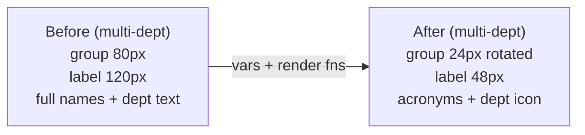

- **Data** (`src/lib/events/schedule.ts`) — `ScheduleUser` carries `shortname`;
  `ScheduleResource` gains `fullName` (the display name used for tooltips/aria).
  `buildScheduleResources` now labels user rows `shortname || name` (same fallback as the
  `{people:acronym}` title token) and sets `fullName` to the full name; department rows keep
  `label = fullName = dept.name`. `dashboard/page.tsx` passes `shortname` through from
  `listUsers()`.
- **Narrow columns** (`DashboardView.tsx`) — a `vars` resolver overrides the `ResourcesDayView`
  root CSS vars: `--resources-day-view-resource-label-width` `7.5rem → 3rem` (48px) and
  `--resources-day-view-group-label-width` `5rem → 1.5rem` (24px). A `styles` override zeroes
  the label cell's horizontal padding and adds ellipsis truncation so a long acronym can't
  push a row.
- **Department row = icon only** — `renderResourceLabel` renders a bare `IconBuilding`
  (size 16) for department rows, carrying the department name as `title` + `aria-label`.
- **User row = acronym** — user rows render `row.label` (the shortname, falling back to the
  full name when unset) in a `sm` `Text`, with a `title` tooltip showing `fullName` only when
  it differs from the label (no redundant tooltip for name-fallback rows).
- **Rotated group header** — `renderGroupLabel` renders the department name in a
  `writing-mode: vertical-rl` span so it reads top-to-bottom down the 24px column; Mantine's
  built-in `translateY` vertical centering within the group block is preserved.
- **Corner cleanup** — `labels={{ resources: "" }}` hides the "Resources" corner text, which
  no longer fits the narrowed corner.
- **Skeleton** — `ScheduleGridSkeleton`'s per-row label block goes 88px → 48px to track the new
  column width.
- **Mantine 9.5.1 gotcha (verified in the installed package)** — the `vars` prop is a
  **resolver function** (`(theme, props, ctx) => ({ styleName: { "--css-var": value } })`),
  not a static object (a static object fails typecheck: `'styleName' does not exist in type
'PartialVarsResolver<…>'`). Var values are the full kebab-case CSS variable names, applied as
  inline styles on the root element, overriding the component's own CSS-var defaults.
  `renderResourceLabel`/`renderGroupLabel` receive Mantine's `ScheduleResourceData`, so app
  fields are read via `resource as ScheduleResource` (a safe downcast — the source array is
  `ScheduleResource[]`).
- **Tests** — `schedule.test.ts` fixtures gain `shortname`; new cases assert acronym labels,
  the `shortname → name` fallback, `fullName` passthrough, and that sort order is by name (not
  shortname). 12 → 13 cases.
- Verification: `pnpm lint`, `pnpm typecheck`, `pnpm test` (152), and `pnpm build` all pass;
  `pnpm db:generate` shows no drift (no schema change).

## 1.26 Git history

```
c2e1a68 Document Vercel Corepack requirement and env setup
d914aca Fix pnpm build scripts and pin package manager/Node
e04140f Phase 1 scaffold
8e60883 Initial commit from Create Next App
```

## 1.27 Event time options + calendar preview (Phase 2r)

Admins now choose which datetime expressions are allowed per event type, the event
form is reordered to match, and the final Google Calendar title is previewed live
above the submit button.

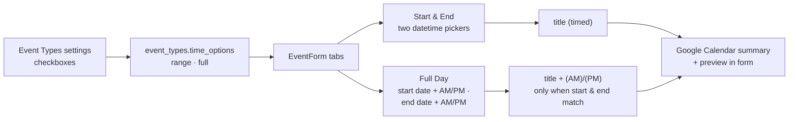

- **Time options** — each event type carries a `time_options` text-array column
  (migration `0010`) holding a subset of `["range", "full"]` (labels **Start &
  End**, **Full Day**). Empty/unrecorded types resolve to `["range"]` (the old
  behaviour). `src/lib/events/timeOptions.ts` is a pure module
  (`TimeOption`, `TIME_OPTION_LABELS`, `normalizeTimeOptions`,
  `resolveTimeOptions`, `resolveTimeOption`, `amPmSuffix`) unit-tested in
  `timeOptions.test.ts`.
- **Admin UI** — `EventTypeForm` gains a "Time options" `Checkbox.Group`
  (at least one required, validated in `validateEventTypeForm`);
  `createEventType`/`renameEventType` persist + audit it (field diff);
  `EventTypeTable` cards list the enabled option labels. `listEventTypes`
  returns normalized options; `getEventTypesByNames` also returns them so
  actions can enforce the restriction.
- **Event semantics** — `EventFormValues` drops the free `allDay` toggle and gains
  `timeOption`, `startAmPm` and `endAmPm`. `Start & End` is always timed (two
  `DateTimePicker`s). **Full Day** (the merged AM/PM + Full Day option) is a
  full-day event with **start date + AM/PM selector and end date + AM/PM
  selector**; the title gets `" (AM)"` or `" (PM)"` appended only when both
  indicators match (`amPmSuffix` — AM→AM or PM→PM), while mixed spans (AM→PM,
  PM→AM) render no suffix. `allDay` is derived server-side
  (`timeOption !== "range"`) in `buildGcalEventInput`, which also writes
  `timeOption`/`startAmPm`/`endAmPm` into the notes JSON (`notes.ts` parses them
  back via `parseEventTimeOption`/`parseEventStartAmPm`/`parseEventEndAmPm`;
  `CalendarEventPayload` gains `timeOption` + `startAmPm` + `endAmPm`). Legacy
  all-day events default to `"full"` on edit prefill with `AM`/`PM` indicators
  (rendering a plain full day). The server clamps the chosen option against the
  type's allowed set (`resolveEventTime`), defaulting untyped events to `range`.
  Chronological validation folds the indicator into the sort key
  (`YYYY-MM-DD AM` < `YYYY-MM-DD PM`), so a same-day PM→AM span is rejected.
- **Event form reorder** — order is now **Event Description → Event Type →
  time-option tabs → datetime component → Invitees → Calendar preview →
  Create/Save button**. When the selected type allows several options an inline
  `Tabs` strip switches the datetime component (switching to Full Day normalizes
  times to `00:00:00` and defaults the indicators to AM/PM — a plain full day);
  a single allowed option renders it directly; no type selected = Start & End.
- **Calendar preview** — a `Paper` above the submit button renders the exact
  summary the server will write: `formatEventTitle(...)` against the saved
  `event_title_template` using the live title/type shortname/selected people
  (fqn + acronym)/departments, plus the `(AM)`/`(PM)` suffix. `dashboard/page.tsx`
  passes the template, rich event-type info, and user `shortname` for the
  preview.
- Verification: `pnpm lint`, `pnpm typecheck`, `pnpm test` (175), `pnpm build`,
  and `pnpm db:generate` (no drift — migration `0010` in sync) all pass.

## 1.28 Calendar user filter (Phase 2s)

The `/dashboard` filter dialog gains a **Users** group for narrowing the calendar to specific
people, plus a one-tap **"Only me"** quick action beside the group label. The selection
persists in the URL as `?users=<id1,id2>` (same pattern as `cal`/`types`) and the filtering
runs server-side in `fetchMonthEvents`, so every view (Month, Mobile, Agenda, Day/Schedule)
renders the same filtered event set.

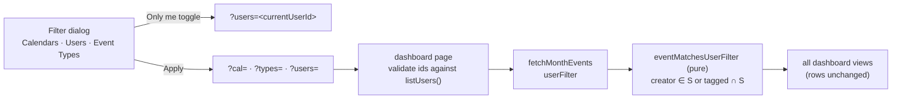

- **Matching (decision)** — an event applies to a selected user when that user **created** it or
  is **tagged** on it (`createdBy` / `inviteeUsers` in the notes JSON) — the same people scope
  as the schedule view's personal rows. Department-tagged events do **not** match; they remain
  reachable via the calendar filter.
- **Pure helper** (new `src/lib/events/userFilter.ts`) — `eventMatchesUserFilter({ creatorId,
inviteeUserIds }, selectedUserIds)`, I/O-free, unit-tested in `userFilter.test.ts`
  (7 cases).
- **Query** (`src/lib/events/queries.ts`) — `fetchMonthEvents` takes `userFilter: string[]`
  alongside `typeFilter` and skips non-matching copies in the per-calendar loop. All copies of
  a logical event share identical people notes, so per-copy filtering is equivalent to
  post-dedupe filtering.
- **Page** (`dashboard/page.tsx`) — parses the `users` param (comma list) and drops ids absent
  from `listUsers()` (same treatment as `cal`/`types`); absent param = no filter. Passes
  `selectedUserIds` to `DashboardView`.
- **FilterModal** (`src/components/FilterModal.tsx`) — `FilterGroup` gains an optional generic
  `action?: { label, icon?, isApplied, apply }`, rendered as a small toggle button beside the
  group label (`variant` flips `default` ↔ `light` in the accent color when applied). The
  action callback receives a draft-value setter plus the current/all option values. `UserTable`
  passes no actions, so its behavior is unchanged.
- **Users group** (`DashboardView.tsx`) — options come from the role-scoped `inviteeUsers`
  (admin → all active users; regular user → own department) with display-name labels; the group
  is hidden when empty. The **Only me** action (hidden when the current user is not among the
  options) toggles the group draft between `[currentUser]` and "all selected" (which the
  dialog normalizes to "no filter" on Apply, so `?users` clears on toggle-off).
  `activeFilterCount` — and hence the Filters badge — counts the Users group whenever a subset
  is applied.
- **Scope (decision)** — the filter selects which **events** render only; the schedule view's
  resource rows are unchanged. Existing URL behavior is untouched (params stay shareable; a
  user opening a shared `?users=` link can only see events they could already see).
- Verification: `pnpm lint`, `pnpm typecheck`, `pnpm test` (193), `pnpm build`, and
  `pnpm db:generate` (no drift — no schema change) all pass.

## 1.28 Admin events on behalf of another user (Phase 2s)

Admins can now **create and edit events on behalf of any user**: a user picked in a
new "On behalf of" selector becomes the event's creator (stored as `createdBy` in the
notes block). The acting user is locked as an invitee (her department becomes a target
calendar; she renders in the schedule row and in `{people}` title tokens). On edit the
selector prefills the current creator and the admin may reassign it; the previous
creator stays tagged unless manually removed.

- **UI** (`src/app/(protected)/dashboard/EventForm.tsx`) — new `isAdmin` prop. Admins
  see a required `Select` "On behalf of" (options = all active users, `displayName`
  via the name template) bound to `creatorId`; non-admins see nothing. On create the
  admin's `creatorId` starts empty; regular users still default to their own id. The
  locked creator invitee chip is derived from `form.values.creatorId`, so it tracks the
  acting user on every change. `validateEventForm` is called with
  `{ requireCreator: isAdmin }` so an unset creator blocks submission with a field
  error on the selector.
- **Validation** (`src/lib/events/validate.ts`) — `validateEventForm(values, opts?)`
  gains `opts.requireCreator`; when set, a blank `creatorId` returns
  `errors.creatorId`. `EventFormErrors` gains `creatorId?`. Unit-tested (2 new cases).
- **Actions** (`src/lib/events/actions.ts`) — `createEvent`/`updateEvent` pass
  `{ requireCreator: role === "admin" }` (server-side enforcement of the required
  creator) and a new `creatorGuard` authorizes the creator: admins may use any id;
  a non-admin may use only their own id, or (on update) the event's existing creator —
  so invited editors aren't blocked while forging is rejected. `EventResultField`
  (extracted from the union) now includes `"creatorId"` and the validate-failure return
  highlights the actual first field instead of hardcoding `title`.
- **Threading** — `isAdmin` flows `dashboard/page.tsx` → `DashboardView` → `EventForm`.
- **Verification** — `pnpm lint`, `pnpm typecheck`, `pnpm test` (186), `pnpm build`,
  and `pnpm db:generate` (no drift — no schema change) all pass. (Live smoke against a
  configured Google account still pending.)

## 1.29 Admin-id UUID guard fix

The virtual admin session id `"admin"` is not a `users` row (the admin authenticates via
the settings password hash) and is **not a UUID** — but its `users.id` column is a
Postgres `uuid`. Admin create/delete passed `"admin"` into the `inArray(users.id, [...])`
lookup behind target-calendar and title resolution, crashing with
`invalid input syntax for type uuid: "admin"` (a 500) before any Google call.

- **Root cause** — `src/lib/auth.ts` `authorize` returns `{ id: "admin" }` for the admin
  password login. `createEvent`/`deleteEvent` → `resolveTargetCalendars` →
  `getUserDepartmentIds(["admin", <uuid>, …])`; the same latent bug existed in
  `buildEventTitleContext` → `getUsersByIds`.
- **Fix** — new pure `src/lib/uuid.ts`: `isUuid(value)` (canonical regex) and
  `onlyUuidIds(ids)` (filter). Both `getUserDepartmentIds`
  (`src/lib/events/queries.ts`) and `getUsersByIds` (`src/lib/roster/queries.ts`) now
  filter to UUID ids before the query, so `"admin"` resolves to no department/no user
  rather than crashing. Unit-tested (`src/lib/uuid.test.ts`, 4 cases). Later phases
  build on this: the admin's virtual id is superseded by the "on behalf of" acting-user
  selection (Phase 2s).

## 1.30 Empty event title (Phase 2t)

The event form's **Event Description** is now **optional**: an event may be created or
edited with no description, in which case the Google Calendar summary is whatever the
event title template renders on its own (type/people/departments) — and if the template
also renders nothing, the event is genuinely untitled (shown as `"(no title)"` in the
dashboard, which `fetchMonthEvents` already handled).

- **Validation** (`src/lib/events/validate.ts`) — the "Description is required" check is
  gone; `EventFormErrors.title` removed. The form `TextInput` drops `required` and gains a
  hint: "Optional — the calendar title is rendered from the title template".
- **Suffix guard** (`src/lib/events/actions.ts` `buildGcalEventInput`, mirrored in the
  `EventForm` preview) — the `(AM)/(PM)` full-day suffix is appended only when the title
  base is non-empty, so a titleless event never becomes a bare `"(AM)"` summary. The
  preview now also trims the raw fallback, matching the server.
- **Notes round-trip** (`src/lib/events/notes.ts`) — an empty description must survive
  storage so the edit form doesn't prefill the _rendered_ template title as the
  description: `encodeEventNotes` keeps `title: ""` (an exception to its blank-stripping)
  and `parseEventTitle` returns `""` for it (null only for legacy events without the
  field). The form prefill (`rawTitle ?? …`) then correctly restores `""`.
- No schema/Google-transport changes (`events.update` is a full replace, so an empty
  summary clears the title on edit). Audit `entityName` is simply `""` for such events.
- Verification: `pnpm test` (195), `pnpm typecheck`, `pnpm lint` all pass; no schema
  change, `pnpm db:generate` drift-free.

## 1.31 Google Calendar "Edit in app" link (Phase 2u)

Google Calendar event notes now carry a clickable link that takes the user to the app and
opens the event's edit form. The machine JSON block is still stored in the notes
(`description`) — a short `Edit: <url>` line now sits **above** it, which Google
Calendar linkifies automatically. The URL encodes everything the app needs to find the
event again: `<origin>/dashboard?date=<start-date>&edit=<event group id>`.

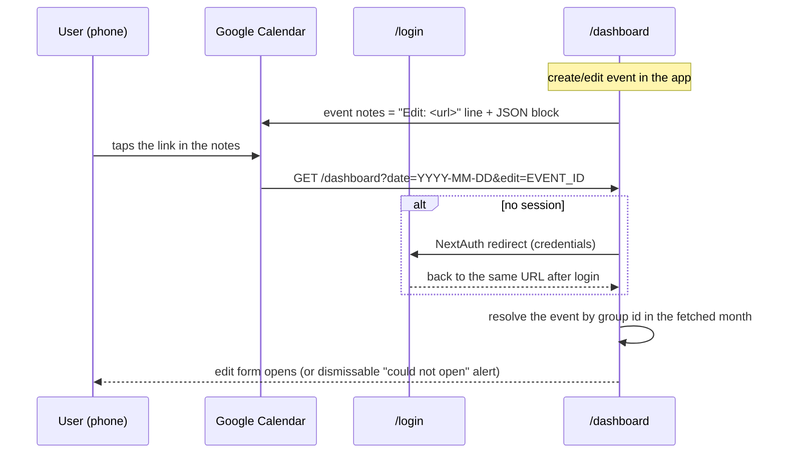

- **Notes format** (`src/lib/events/notes.ts`) — new `editLink` field; pure helpers
  `eventEditUrl(baseUrl, start, eventId)` (builds the dashboard link, date from the naive
  start) and `withEditLink(notesJson, url)` (places the `Edit:` line above the JSON
  block). `parseEventNotes` first tries the whole string (legacy events unaffected), then
  scans from the bottom for the last line that parses as a JSON object — the block is
  always a single line (`JSON.stringify`) and the line above it never contains braces, so
  every reader (queries, `findCopies`) keeps working through that one entry point.
- **Origin** (new `src/lib/appUrl.ts`) — `appBaseUrl()` derives `<proto>://<host>` from
  the incoming request headers (`x-forwarded-proto`, `http` fallback), the same pattern as
  the audit logger; no new env config.
- **Write path** (`src/lib/events/actions.ts`) — `buildGcalEventInput` is now async and
  writes `editLink` into the notes plus the `withEditLink` wrapping on **every**
  create/edit, so the in-notes link stays current when a date changes in the app.
- **Deep link** (`src/app/(protected)/dashboard/`) — the page validates `?edit=` with
  `isUuid` (anything else ignored) and passes `initialEditEventId`; `DashboardView`
  resolves the target synchronously at mount (the month is already fetched server-side)
  and initializes state directly — the edit form opens with the event, or a dismissable
  "Could not open that event" alert is shown when the event isn't in the current calendar
  selection/month. A one-shot effect strips `?edit=` from the URL (refresh won't reopen
  the form); `navigate` was stabilized with `useCallback` to satisfy the React-19-era
  `set-state-in-effect` and `exhaustive-deps` lint rules.
- **Edge cases** — rescheduling the event **in** Google Calendar (outside the app) leaves
  a stale date in the stored link → the "could not open" alert; an in-app edit rewrites
  it. Clicks without a session go through the normal NextAuth redirect and return to the
  same URL. No permission change: the dashboard fetch stays scoped to the user's normal
  calendar selection and `creatorGuard` still applies on save.
- **Tests** (`src/lib/events/notes.test.ts`) — 8 new cases: `withEditLink` placement/empty
  cases, `eventEditUrl` with/without a date, parsing the new format (round trip including
  `editLink`), braces inside `title`, and the field-level parsers on the new format.
- **Verification** — `pnpm lint`, `pnpm typecheck`, `pnpm test` (203), `pnpm build`, and
  `pnpm db:generate` (no drift — no schema change) all pass. Live confirmation that Google
  Calendar linkifies the stored URL remains pending until service-account credentials are
  configured (verify with a disposable test event).

## 1.32 Compressed opaque notes block (Phase 2v)

The machine notes block in Google notes no longer exposes raw JSON: below the
human-readable `Edit: <url>` line it is now **brotli-compressed and base64url-encoded
(no padding) on a single line**. Notes get short — the block itself measured ~585 → ~220
chars on a worst-case event (3 invitees, a department, a long title) — and calendar
viewers no longer see raw group/user uuids, event-type names, or the typed description.
The block's content is still a JSON object, so adding fields stays migration-free. The
redundant `editLink` field stored inside the JSON was dropped — the URL the top line
already shows no longer duplicates inside the block.

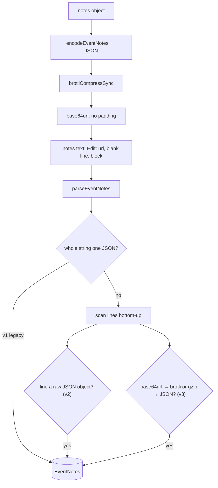

- **Writer** (`src/lib/events/notes.ts`) — new `encodeNotesBlock(json)`:
  `zlib.brotliCompressSync` → `toString("base64url")`. Deterministic (fixed compressor
  settings, no timestamp), so the same JSON always yields the same single line.
  `withEditLink` now just places the human line above an arbitrary block line.
- **Reader** (`src/lib/events/notes.ts`) — `parseEventNotes` keeps the whole-string JSON
  path (v1) and its bottom-up line scan now accepts each line as (a) a raw JSON line
  (v2) or (b) a base64url line that inflates to a JSON object — **brotli first** (the
  current writer) with a **gzip fallback** inflate, so a future codec switch can never
  strand stored events. Node's `base64url` decoder also accepts the standard `+/`
  alphabet and padding, so either spelling decodes. Every field parser
  (`parseEventPeople`, `parseEventTitle`, …) funnels through this one entry point — no
  changes needed anywhere else.
- **Write path** (`src/lib/events/actions.ts`) — `description =
  withEditLink(encodeNotesBlock(encodeEventNotes(…)), editLink)`; `editLink` is no
  longer a notes field (the v3 block stores it nowhere).
- **Debug one-liner** — decode a stored block (the last line of the notes) with
  `echo "<block>" | base64 -d | brotli -d` (or `| zcat` if it was ever gzip-compressed).
- **Tests** (`src/lib/events/notes.test.ts`) — v3 round trip (incl. braces in `title` and
  the field-level parsers), gzip fallback decode, v1/v2 legacy cases kept, single
  base64url line shorter than the raw JSON, determinism, and null for an undecodable
  line. Notes suite: 35 tests.
- **Verification** — `pnpm lint`, `pnpm typecheck`, `pnpm test` (208), `pnpm build`, and
  `pnpm db:generate` (no drift — no schema change) all pass.

## 1.33 Searchable user filter (Phase 2w)

The dashboard filter dialog's **Users** group no longer renders one checkbox card per user
(unusable as the roster grows toward 100). It now renders a **searchable dropdown** — the
same pattern as the event form's invitees `MultiSelect` — with the same role-scoped options
(admins: every active user; regular users: their own department).

- **`FilterModal` (`src/components/FilterModal.tsx`)** — `FilterGroup.variant` accepts
  `"grid"` (default, unchanged) or `"search"`. Search groups render a Mantine `MultiSelect`
  (`searchable` + `clearable`, placeholder `All <group>`) and use **empty = no filter**
  semantics (grid groups keep "all selected = no filter"), so narrowing 100 options down to
  a few never requires unticking the rest. Draft initialization, the no-clear-to-empty guard
  (grid only), `Clear`, `Apply` normalization (all selected → `[]`, plus empty for search),
  and the active-filter check all branch on the variant.
- **`DashboardView`** — the Users group sets `variant: "search"`; the "Only me" quick
  action now toggles between `[currentUser]` and `[]` (empty) instead of the full list.
  The `?users=` URL state, `fetchMonthEvents` user filtering, and the Filters button badge
  are unchanged (they already treat an empty list as "no filter").
- Settings' Users table filter (small Status/Department grid groups) is unaffected.
- **Verification** — `pnpm lint`, `pnpm typecheck`, `pnpm test` (208), `pnpm build`, and
  `pnpm db:generate` (no drift — no schema change) all pass.

## 1.34 PWA installability (Phase 3a)

Cloudy is now installable as a **Progressive Web App** (App Router + Serwist for Turbopack).
Scope is deliberately **installability + app shell only**: all data (events, users, filters)
is fetched live from the Google Calendar + Neon DB on every operation, and the service worker
**never serves cached data** — a `NetworkOnly` catch-all covers pages, RSC payloads, auth, and
any future `/api/*`. Only immutable static build assets (fonts, images) are cached for a fast
cold start. No push notifications (deferred — needs VAPID + a push backend).

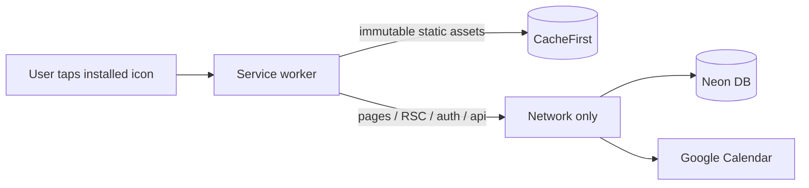

- **Manifest** (`src/app/manifest.ts`) — `display: standalone`, portrait, theme
  `#0D47A1` / background `#FBC02D`, icons 192/512 + maskable 512. Served at
  `/manifest.webmanifest`.
- **Layout metadata** (`src/app/layout.tsx`) — `metadata.manifest`,
  `appleWebApp` (capable, `black-translucent`, title), `formatDetection` off,
  `viewport.themeColor = #0D47A1`, and the `apple-touch-icon` link (180px). The root
  layout wraps children in `SerwistProvider` from `@serwist/turbopack/react`, which
  registers the SW with `updateViaCache: "none"` (critical on iOS).
- **Next config** (`next.config.ts`) — wrapped with `withSerwist` from
  `@serwist/turbopack`. The Turbopack setup serves the compiled SW via a **route
  handler** at `src/app/serwist/[path]/route.ts` (`createSerwistRoute`, `swSrc:
  src/app/sw.ts`) → `/serwist/sw.js`, instead of emitting `public/sw.js`.
- **Service worker** (`src/app/sw.ts`) — Serwist with `precacheEntries`,
  `skipWaiting`, `clientsClaim`, `navigationPreload`, and explicit `runtimeCaching`:
  `CacheFirst` for fonts/CSS, `StaleWhileRevalidate` for images, and **`NetworkOnly`
  for every same-origin request** (the app's default `defaultCache` would cache
  `/api` + RSC with NetworkFirst, which this app must not do).
- **Icons** (`public/`) — generated from `icon.svg`/`icon-maskable.svg` (brand
  calendar mark): `icon-192x192.png`, `icon-512x512.png`, `icon-maskable-512x512.png`,
  `apple-touch-icon.png`.
- **Dependencies** — `@serwist/turbopack`, `serwist`, `esbuild` (dev). Also fixed a
  leftover placeholder in `pnpm-workspace.yaml`: `@swc/core` build must be allowed
  (`true`) or install/typecheck fail.
- **Verification** — `pnpm build` bundles the SW ("50 precache entries"), and
  `pnpm lint` / `pnpm typecheck` / `pnpm test` (220) / `pnpm db:generate` (no drift —
  no schema change) all pass. Local smoke test: `/manifest.webmanifest` → 200
  `application/manifest+json`; `/serwist/sw.js` → 200 `application/javascript`; `/login`
  HTML contains the SW registration + manifest link. Manual device checks remaining:
  iOS "Add to Home Screen" standalone launch, Android install prompt.

## 1.35 Touch-friendly input heights (Phase 3b)

All single-line inputs (text boxes and dropdowns) are now **1.2× taller** so they are
comfortable to tap on a touchscreen. Mantine 9 no longer exposes the old
`theme.variants.input.inputHeight` option — input heights are driven by
`--input-height-{size}` CSS variables on the input's wrapper element. The scale is
therefore applied once in the theme: a `components.Input.vars` override that every
input-family component inherits, because they all render on the base `Input` and
resolve their styles under the name `["Input", <component>]`.

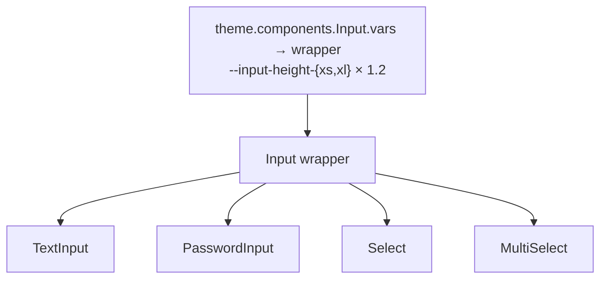

New heights (Mantine default → after 1.2×):

| size | before | after |
| --- | --- | --- |
| `xs` | 30px | 36px |
| `sm` (app default — every input uses it) | 36px | 43.2px |
| `md` | 42px | 50.4px |
| `lg` | 50px | 60px |
| `xl` | 60px | 72px |

- **Theme** (`src/lib/theme.ts`) — new `components.Input.vars` sets the wrapper's
  `--input-height-{xs,sm,md,lg,xl}` to `calc(<base> × 1.2 × var(--mantine-scale))`
  (2.25 / 2.7 / 3.15 / 3.75 / 4.5rem). The derived values adapt automatically: input
  `line-height`, inline padding (`height / 3`), and the left/right section size — the
  chevron box of `Select`/`MultiSelect` stays roughly square at the new height.
- **Provider move (required by the theme change)** — the theme now carries a function
  value, and React Server Components cannot pass functions to client components: keeping
  `MantineProvider theme={theme}` in the server root layout made every page 500 with
  `Functions cannot be passed directly to Client Components`. The provider now mounts on
  the client via a new `AppProviders` component (`src/components/AppProviders.tsx`,
  `"use client"`) that renders `MantineProvider` + `Notifications`; the server layout
  passes `children` into it (children stay server-rendered — only the provider's own
  props cross the boundary). `AGENTS.md` documents the constraint.
- **Login form** (`src/components/LoginForm.tsx`) — the local `1.5×` height hack on the
  login `PasswordInput` (`styles={{ input: { height: "calc(var(--input-height) * 1.5)" } }}`)
  was removed; the field now matches the global 1.2× scale (locked-in by request).
- **Scope** — covers `TextInput`, `PasswordInput`, `Select`, and `MultiSelect`; any
  future `@mantine/dates` input extends `Input` the same way and is covered too.
  Untouched: the heights of items inside an opened dropdown list, buttons, and
  `Textarea`s (auto height, rows-based).
- **Verification** — `pnpm lint`, `pnpm typecheck`, and `pnpm test` (220) pass. Dev
  server (Turbopack): `/login` returns 200 and its SSR HTML shows the wrapper inline
  style `--input-height: var(--input-height-sm); --input-height-sm: calc(2.7rem *
  var(--mantine-scale))` — i.e. 43.2px = 36px × 1.2 with `--mantine-scale: 1`; every
  other input consumes the same base-`Input` vars. `pnpm build` not run locally (a dev
  server held `.next`); CI's build job covers it. No schema change —
  `pnpm db:generate` shows no drift.

## 1.36 Global bottom nav + Overview page (Phase 3c)

The app now has a **global bottom navigation bar** on every protected page (the Phase 2e
bar was removed in 2f in favor of the profile-icon-only settings hub; this restores it as
the app's primary navigation) and a new **Overview** page that answers "how many events of
each type did each person have this month".

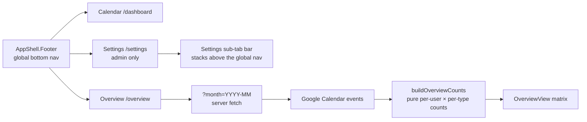

- **Bottom nav** (`src/components/AppShellShell.tsx`) — `AppShell.Footer` (height 56px +
  `env(safe-area-inset-bottom)`) with icon + label tabs: **Calendar** (`/dashboard`,
  `IconCalendarMonth`), **Overview** (`/overview`, `IconChartBar`), **Settings**
  (`/settings`, `IconSettings`, admins only — non-admins get just the first two). Active
  state via `pathname.startsWith(href)`, brand-colored icon/label, `aria-current="page"`.
- **Clearance constants** (`src/lib/bottomNav.ts`) — `BOTTOM_NAV_HEIGHT` (56),
  `BOTTOM_NAV_HEIGHT_CSS`, and `BOTTOM_NAV_FLOATING_OFFSET`. The `FloatingToolbar`
  default `bottomOffset` now clears the nav, so the dashboard "New event" FAB and the
  minimized-form pill are no longer hidden behind it; the Settings sub-tab bar
  (`SettingsTabs`) sits at `bottom: BOTTOM_NAV_HEIGHT_CSS` (its own safe-area padding
  removed — the nav below owns it) and `SETTINGS_TAB_BAR_OFFSET` grew to
  `calc(108px + env(safe-area-inset-bottom) + 16px)` (52px sub-tab bar + 56px nav) so the
  Settings floating buttons stay clear.
- **Overview page** (`src/app/(protected)/overview/`) — month header (‹ / `MMMM YYYY` /
  › / Today, navigating `?month=`), then a horizontally scrollable CSS-grid matrix inside
  a `Paper` (no `<Table>`): one column per configured event type (zeros included), one
  row per **active** user by display name, with a **sticky first column**. Role scoping
  mirrors the dashboard: admins see all departments/users, regular users only their own
  department's. Loading skeleton in `loading.tsx`; "Google not configured" and empty
  states included.
- **Counts** (`src/lib/overview/counts.ts` + `counts.test.ts`, pure + 9 unit tests) —
  `involvedUserIds` (creator ∪ tagged users, deduped) and `buildOverviewCounts` (per user
  per configured type). Input events are already deduped by logical group id
  (`fetchMonthEvents`), so a cross-department event counts once per involved user; events
  without a parseable type, or with a type no longer configured, are not represented
  anywhere (no total/aggregate column).
- **Verification** — `pnpm lint`, `pnpm typecheck`, `pnpm test` (238), and `pnpm build`
  all pass; build route list shows `/overview`. No schema change — `pnpm db:generate`
  shows no drift.

## 1.37 Overview cross-department filter fix (Phase 3d)

A non-admin who filtered Overview to a department **they are not in** while any users
filter was active (the "Only me" quick action, a picked user, or a stale `users=` param)
got the *"No users to show. Assign yourself to a department…"* card — the department
filter appeared not to apply.

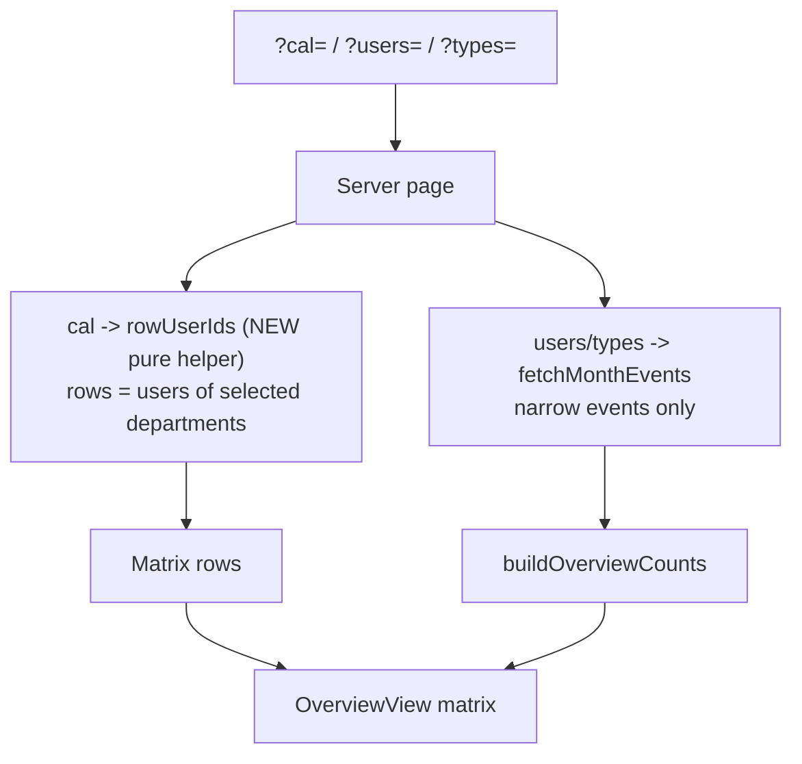

**Root cause** (`src/app/(protected)/overview/page.tsx`): matrix rows were computed as
`rowUsers ∩ selectedUsers`. A non-admin's users filter can only ever contain own-
department users (the dialog's Users options are role-scoped, and "Only me" always picks
the current user), so selecting another department intersected to `[]`. The dashboard
never had this because its schedule rows (`scheduleUsers`) follow the selected calendars
only — the `users` param filters **events** (`fetchMonthEvents` `userFilter`), never
rows.

**Fix** — match the dashboard semantics (user-confirmed):

- **New pure helper** `src/lib/overview/scope.ts` — `overviewRowUserIds(users,
  selectedCalendarIds, calendarCount, isAdmin, ownDepartmentId)`: active users only;
  narrowed calendar selection → users of the selected departments; otherwise the role
  default (admins: everyone incl. unassigned, non-admins: own department). No users
  input — the contract that `?users=` never narrows rows is enforced by the API shape.
  `scope.test.ts` adds 6 unit tests incl. the cross-department regression guard.
- **Overview page** — rows (count inputs + department grouping) come from the helper;
  the `rowUsers ∩ selectedUsers` intersection is gone. `fetchMonthEvents({ userFilter:
  selectedUsers })` and the `selectedUserIds` prop are unchanged, so the users filter
  still narrows the counted events and the filter dialog keeps its state/badge.
- No client changes — `OverviewView.tsx` and `FilterModal` untouched.

**Side effects (accepted):** admins who combined `cal` + `users` to hide rows now keep
the rows (counts of filtered-out events drop to 0); "Only me" on a foreign department
shows that department's rows with 0s (or real counts where the user is involved in
cross-department events).

**Repro that was wrong, now fixed** (live dev DB): Carol (dev-COU) with
`?cal=dev-CIU&users=<Carol>` rendered the empty-state card; now it renders the two
dev-CIU rows with 0 counts. Bob (dev-CIU) with `?cal=dev-COU` still shows the dev-COU
rows and events — the pure `cal` filter already worked and is unchanged.

**Verification** — `pnpm lint`, `pnpm typecheck`, `pnpm test` (244) pass; no schema
change. Live re-check of the full repro matrix (default / cross-dept / cross-dept +
users, both directions) against the dev server.

## 1.38 Cross-department user options in filter dialogs (Phase 3d)

After the §1.37 fix a non-admin could switch the **Calendars** filter to another
department and see that department's rows, but the filter dialog's **Users** group still
only listed **own-department** users — so "filter other departments and their users"
was impossible, on both the Overview and the Dashboard filter dialogs.

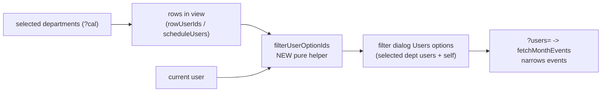

**Root cause:** both pages fed the filter dialog's Users group from a **role-scoped**
user list — `overview/page.tsx` `inviteeUsers` (`isAdmin ? all : ownDept`) and
`dashboard/page.tsx` `pickerUsers` (the same list that also feeds the EventForm invitee
picker). The server already accepted any roster user id in `?users=`, so the option
list was the only blocker.

**Fix** (user-confirmed: both pages; creation picker stays role-scoped):

- **New pure helper** `src/lib/filters/filterUserOptions.ts` —
  `filterUserOptionIds(users, rowUserIds, currentUserId)`: returns the users in view
  (rows of the selected departments) **plus the current user** when it is in the roster
  but not already included — so "Only me" works on foreign departments and its chip
  renders a real label (a selected value absent from the option data would otherwise
  show as a raw uuid). 6 unit tests in `filterUserOptions.test.ts`.
- **Overview** — dialog options come from the new helper (rows = `overviewRowUserIds`
  result); the view prop is renamed `inviteeUsers` → `filterUsers`.
- **Dashboard** — a new `filterUsers` prop (rows = `scheduleUsers`) drives the filter
  dialog; `inviteeUsers` stays as the EventForm invitee picker (own-department scope
  for non-admins, per creation permission semantics) and `peopleNames`/creation flows
  are untouched.
- `progress.md` status bullet added.

**Behavior notes (accepted):** non-admin defaults are unchanged in practice
(own-dept users + self == previous options); admins keep all active users; an inactive
or unassigned self still appears so "Only me" works for filtering their own past
events.

**Verification** — `pnpm lint`, `pnpm typecheck`, `pnpm test` (250) pass; no schema
change. Live re-check on the dev server: Bob (dev-CIU) viewing dev-COU sees the six
dev-COU users (plus himself) in the Overview and Dashboard filter dialogs; picking one
filters events while rows stay department-wide; the EventForm invitee picker still
lists only Bob's own department.

## 1.39 Overview full-selection row scoping fix (Phase 3d)

After §1.37/§1.38, a non-admin filtering the **Overview** to a single foreign
department saw the right rows — but selecting **all** departments collapsed the matrix
back to their **own** department.

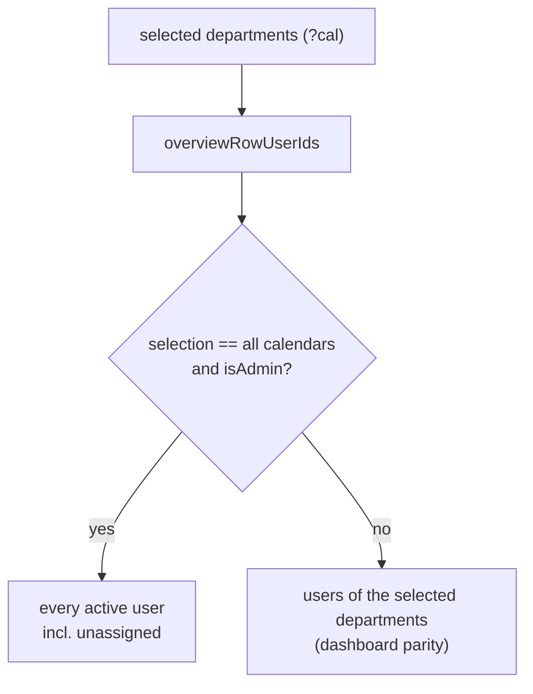

**Root cause** (`src/lib/overview/scope.ts`): the old `overviewRowUserIds` used a
`narrowed` heuristic — `0 < selected.length < calendarCount` — as a proxy for "an
explicit filter is applied". When a non-admin selected **every** calendar,
`length < calendarCount` was false, so the helper fell back to the **role default**
(own department only). This conflated "no filter" (the role default) with "filtered to
everything"; the dashboard never had this problem because its `scheduleUsers`
(`dashboard/page.tsx`) always filters by the selected calendars.

**Fix** (dashboard parity):

- `overviewRowUserIds` no longer uses the length heuristic and drops the
  `ownDepartmentId` parameter: **any** selection narrows rows to the selected
  departments; the sole special case is `isAdmin && selection == all calendars`,
  which keeps unassigned users visible (the admin default view and an explicit full
  selection share the same code path). The page's `ownDepartmentId` remains — it still
  drives `defaultCalendars`.
- `scope.test.ts` updated (7 tests) with the regression guard: a non-admin selecting
  all departments gets every department's users, not their own.

Behavior matrix (unchanged cases verified): non-admin default (own dept), non-admin
single foreign department, non-admin unassigned with no calendars, admin subset
selection, admin default/full selection incl. unassigned.

**Verification** — `pnpm lint`, `pnpm typecheck`, `pnpm test` (251) pass; no schema
change. Live re-check: Bob `/overview?cal=<CIU>,<COU>` now renders **both** departments
(dev-CIU 2 + dev-COU 6); `?cal=<COU>` and the default remain correct; the Dashboard
is unaffected.

## 1.40 Externally created events (Phase 3e)

Events can be created **outside** the app — directly in Google Calendar by a user with
calendar access. Those events have no app notes, so the app now tells them apart and
marks them as **external**.

```mermaid
flowchart TD
    A["Google event description"] --> B{"has 'Created in cloudy2' line?"}
    B -- yes --> C[internal]
    B -- no --> D{"has an app notes block?"}
    D -- yes --> C
    D -- no --> E["external (created in Google Calendar)"]
```

**Detection** (`src/lib/events/notes.ts`):

- `INTERNAL_EVENT_MARKER = "Created in cloudy2"` — a human-readable line the app writes
  at the **bottom** of every event description it creates or edits
  (`withInternalMarker`, called from `buildGcalEventInput` in `src/lib/events/actions.ts`
  after the `Edit:` link + compressed block). Idempotent, so re-edits never duplicate it.
- `isExternalEvent(description)` — external when the marker **and** a parseable notes
  block are both absent. The block clause keeps pre-existing in-app events (notes block,
  no marker yet) from showing as External until their next in-app edit.
- The marker sits below the opaque block, so `parseEventNotes`'s bottom-up scan still
  inflates the block correctly (no format change, no migration).

**Display**:

- `CalendarEventPayload` gains `external` (set in `fetchMonthEvents` from the
  description); titles are unchanged (no prefix).
- The event detail modal (`EventDetail.tsx`) shows a gray **External** badge next to the
  type/calendar badges. Edit/Delete remain available — editing an external event
  "adopts" it (rewrites notes + marker).
- **Day (schedule) view**: external events have no linked people, so `expandScheduleEvents`
  pins them to their own calendar's department row, and `buildScheduleResources` keeps a
  user-less department's row when it holds an external event.

**Out of scope:** external events have no event type, so the Overview matrix does not
count them (no column to put them in). No schema change — `db:generate` no drift.

**Verification** — `pnpm build/lint/typecheck/test` (262) pass; `db:generate` no drift.

## 1.41 Additional access levels (Phase 3f)

The **Additional access** section of a department's Share modal can now set the access
level (**Read only / Can edit / Owner** → Google ACL `reader` / `writer` / `owner`) when
granting a new share, and the level of an existing share can be changed later. Previously
every manual grant was hardcoded to `reader` and existing shares showed only the raw
Google role string.

```mermaid
flowchart LR
    A["Share modal<br/>email + access level Select"] --> B[grantDepartmentAccess]
    B --> C["setCalendarAccess(email, reader|writer|owner)"]
    A2["existing rule row<br/>level Select"] --> D[updateDepartmentAccess]
    D --> C
    C --> E["listDepartmentAccess (reconcile)"]
```

- **Domain** (`src/lib/roster/shares.ts`) — new `DepartmentAccessRole = "reader" |
  "writer" | "owner"` type and pure `isDepartmentAccessRole(value)` guard (rejects
  `freeBusyReader` and anything else). 2 unit tests added in `shares.test.ts`.
- **Actions** (`src/lib/roster/actions.ts`) — `grantDepartmentAccess(calendarId, email,
  role)` takes the role (validated server-side, replacing the hardcoded `"reader"`) and
  logs it in the audit `details`; new `updateDepartmentAccess(calendarId, email, role)`
  re-grants an existing rule's role via `setCalendarAccess` and logs it under a new
  `access.update` audit action (`AUDIT_ACTIONS.accessUpdate` in
  `src/lib/audit/build.ts`).
- **UI** (`src/app/(protected)/settings/departments/DepartmentShares.tsx`) — the add
  form gains an "Access level" `Select` (defaults to **Read only**) above the email
  row; each existing additional-access rule row now shows a human-readable role label
  (falling back to the raw role) plus a compact `size="xs"` `Select` to change the
  level, with a per-row loading state mirroring the Remove button.
- No schema change (`db:generate` no drift); the role is stored only in Google Calendar,
  matching the existing ACL-as-source-of-truth model. Assigned users and the admin owner
  stay auto-managed as `reader`/`owner` respectively.
- Verification: `pnpm lint`, `pnpm typecheck`, `pnpm test` (264), and `pnpm build` pass;
  `pnpm db:generate` shows no drift.

## 1.42 Calendar caching layer (Phase 3g)

The dashboard/overview pages rendered by re-hitting Google Calendar on **every** server
render — a serial `events.list` per selected department calendar per month, hidden behind
the loading skeleton. A server-side caching layer now sits between the frontend and the
Google Calendar API, backed by a Postgres table so it is shared across serverless instances
and survives restarts.

> **Why Postgres and not Next's `use cache` data cache?** The first implementation used
> `cacheComponents: true` + a `'use cache'` function, but Turbopack `next dev` crashed on
> **Node 26** with `TypeError: ArrayBuffer is not detachable and could not be cloned`
> (vercel/next.js#96165 — pooled `Buffer`s are non-detachable when enqueued into the dev
> RSC byte stream; unfixed, dev-only, production unaffected). It also forced PPR-style
> prerendering and an `export const instant = false` opt-out on protected routes. The DB
> table avoids the entire Next cache runtime and works identically in dev/CI/Vercel.

```mermaid
sequenceDiagram
    participant P as Page (RSC render)
    participant D as google_event_cache (Postgres)
    participant G as Google Calendar
    P->>D: getCachedMonthEvents(gcalId, month) per selected calendar
    alt fresh row (hit, <30s)
        D-->>P: decoded GcalEventItem[]
    else stale row (30s–30min)
        D-->>P: decoded GcalEventItem[]
        Note over P,D: after() → background refresh from Google + upsert
    else missing or expired
        D->>G: events.list (bounded concurrency, ≤4)
        G-->>D: items → upsert row
        D-->>P: items
    end
    Note over P: after() → warm M±1 cache rows post-response
    Note over P: create/update/delete → invalidateGcalCache() deletes touched rows
```

- **Schema** (`src/db/schema.ts`) — new `google_event_cache` table (migration `0011`):
  composite PK `(calendar_google_id, month)`, `events` jsonb (`GcalEventItem`s with dates as
  ISO strings), `fetched_at` timestamptz.
- **Cache layer** (`src/lib/google/eventsCache.ts`) — `getCachedMonthEventsForCalendars(ids,
  month)` is a **layered** cache: an in-process L1 map (keyed `googleCalendarId:month`) serves
  warm-instance repeat views with zero I/O; misses fall through to a **single batched** `SELECT`
  on `google_event_cache` for the whole month (~one round-trip regardless of calendar count,
  was N × ~50ms serialized reads); anything absent/expired blocks on a fresh `events.list` +
  upsert (`onConflictDoUpdate`, bounded concurrency ≤4, per-key in-flight dedup). Fresh rows
  serve directly (**60s**, `GCAL_CACHE_FRESH_MS`); stale rows serve while `after()` refreshes
  them in the background; hard expire **30min** (`GCAL_CACHE_EXPIRE_MS`). One entry serves every
  user/filter combo on both `/dashboard` and `/overview`. Google errors propagate — a failed
  refresh is never served as data.
- **Read path** (`src/lib/events/queries.ts`) — `fetchMonthEvents` calls the cache once for the
  whole selected calendar set, then flattens in calendar-name order (deterministic dedup
  preserved). After the response ships, `after()` warms the neighboring months only when the
  current month **missed** the cache (`PREFETCH_ADJACENT_MONTHS` gate), so fully-cached views
  don't churn extra background Google/DB work.
- **Invalidation** (`src/lib/google/eventsCache.ts`) — `invalidateGcalCache()` purges the L1 +
  in-flight entries **and** deletes the touched DB rows (affected calendars' Google ids
  collected during the write loops × every month in the old+new ranges via `monthsInRange`),
   so the mutating instance's own `router.refresh()` shows the change immediately. The L1 purge
   is per-instance (map lives only where the mutation ran) while the DB delete is shared, so
   other warm instances may serve the pre-change L1 copy for up to `GCAL_CACHE_FRESH_MS` (60s)
   before their background refresh corrects it. `findCopies` keeps reading
   the **uncached** integration during reconciles.
- **Helpers** — pure `cacheEntryState`, `encodeCachedEvents`, `decodeCachedEvents`
  (`src/lib/google/eventsCacheCodec.ts`), `monthsInRange`/`shiftMonth`
  (`src/lib/events/datetime.ts`), and `mapWithConcurrency` (`src/lib/async.ts`), each
  unit-tested. `cacheKeys.ts` (Next `cacheTag` helper) was removed.
- No Next cache config: `next.config.ts` and `(protected)/layout.tsx` were reverted to their
  pre-cache state.
- **Measured before/after** (authenticated `next dev`, Node 26, Neon pooler): warm dashboard
  `application-code` ~1.0–1.9s → **~0.35s**; overview 748ms → **~290ms**. Cold connection
  ~600ms + per-query ~50ms (serialized on `max: 1` postgres) remain the app's pre-existing
  floor; the events read itself is now one batched query on miss and zero I/O on L1 hit.
- Verification: `pnpm lint`, `pnpm typecheck`, `pnpm test` (280), and `pnpm build` pass;
  `pnpm db:generate` no drift. Manual: repeat month views are served from L1/DB with no Google
  calls; edits appear immediately after refresh; `next dev` runs on Node 26.
- **Full design reference:** [`docs/events-cache.md`](docs/events-cache.md) — the complete
  mechanism (architecture, data model, read/write flows, freshness, performance).

## 1.43 Calendar force refresh (Phase 3h)

The cache's freshness windows (60s fresh, then stale-while-revalidate to 30min) mean an
out-of-band Google edit can take ~60–90s to appear, with no way for the user to shorten it.
The dashboard header now carries a **force-refresh button** (an `ActionIcon` beside Today and
Filters) that re-fetches exactly the month the user is looking at and renders the new data
immediately.

```mermaid
sequenceDiagram
    participant U as User (dashboard)
    participant V as DashboardView (client)
    participant P as Page (RSC render)
    participant C as events cache (L1/L2)
    participant G as Google Calendar
    U->>V: tap force refresh
    V->>P: router.push(?refresh=<epoch-ms>) — one-shot nonce
    P->>C: getCachedMonthEventsForCalendars(ids, month, { force: true })
    C->>G: events.list per selected calendar (coalesced, ≤4 concurrent)
    G-->>C: items → upsert L2 (fetchedAt=now) + refill L1
    C-->>P: fresh items — same request
    P-->>V: render fresh events (skeleton shown while pending)
    V->>V: strip ?refresh= one-shot param
```

- **One-shot nonce** (`src/app/(protected)/dashboard/page.tsx`) — the button navigates with
  `refresh=<Date.now()>`. The server honors it only while it is a finite number younger than
  `REFRESH_NONCE_TTL_MS` (5min), so a stale history entry (back/forward) can't silently
  re-force a fetch.
- **Force in the same request** (`src/lib/google/eventsCache.ts`) —
  `getCachedMonthEventsForCalendars(..., { force: true })` bypasses L1 **and** L2 and blocks
  on fresh `events.list` calls for every requested calendar (`mapWithConcurrency`,
  coalesced, ≤4 in flight), then upserts the DB rows with `fetchedAt = now` (shared across
  instances) and refills L1 in the serving instance. The force deliberately runs **inside
  the same RSC render** rather than as an invalidation + `router.refresh()` round-trip: the
  follow-up render could be served by another instance whose warm L1 entry (≤60s old) would
  still shadow the fresh rows.
- **Scope** — selected calendars × displayed month only (what the user actually sees);
  hidden calendars and other months keep their normal freshness window. `force` returns
  `allServed: false`, so the `after()` adjacent-month prefetch fires like any miss. The
  button is `disabled` while Google is unconfigured (same guard as the New-event FAB), since
  the stub integration returns no events.
- **One-shot strip** (`DashboardView.tsx`) — a ref-guarded effect (mirroring the `?edit=`
  param pattern) removes `refresh` from the URL right after the forced render mounts, so
  later month/day navigation doesn't keep force-refreshing and burning Google quota. The
  button shows `loading` (oval `BUTTON_LOADER_PROPS`) via a dedicated `useTransition`
  wrapping the `router.push` directly (the same shape as the existing nav transitions);
  the page skeleton is `isPending || isRefreshing` so the load is always covered.
- No schema change and no new pure helpers (the `force` flag is pass-through glue:
  `page.tsx` → `fetchMonthEvents` → `eventsCache.ts`).
- Verification: `pnpm lint`, `pnpm typecheck`, `pnpm test`, and `pnpm build` pass.

## 1.44 Schedule week view + S. Month removal (Phase 3i)

The dashboard's resource schedule existed only as a single day ("Day" tab,
`ResourcesDayView`). A **Week** tab now sits between Month and Day, rendered with
`ResourcesWeekView` from `@mantine/schedule` and customized exactly like the Day tab
(same resource/group columns, icons, row height, event styling). At the same time the
legacy **"S. Month"** tab (`MobileMonthView`) and all of its contents were removed.

- **Tabs** (`DashboardView.tsx`) — order is now Month → **Week** (`IconCalendarWeek`)
  → Day. `ViewMode = "month" | "week" | "schedule"`; the `mobile` mode, its tab, its
  render branch, the `MobileMonthView` import, and the `MobileGridSkeleton` skeleton are
  gone. A stale `?view=mobile` URL silently falls back to the Month tab (the page's
  default branch).
- **Anchoring & navigation** — entering Week (like Day) always starts on **today's
  week** (`navigate({ view: "week", month: null, date: today })`). Prev/next step by
  **±7 days** (`shiftWeek`), the center label is the week range
  (`formatWeekLabel()` in `clientDateTime.ts`: `Aug 18 – 24, 2026`, month+year repeated
  only when the week crosses a month/year), and Today jumps to the current week. The
  MiniCalendar strip stays **Day-only** by decision — the Week view's built-in day-label
  row already shows all seven days.
- **Week start** — Monday, from the Mantine dates context default
  (`firstDayOfWeek: 1`) that the existing Month tab already uses; the app never overrides
  it, so all schedule views agree.
- **Cross-month data** — the displayed week can span two months, and Google month reads
  are month-keyed. `fetchRangeEvents({ months, … })` (new, in `queries.ts`) fetches each
  month through the existing layered cache, **dedupes items across months by
  `(calendar, google event id)`** (a multi-day event appears in both month listings),
  then applies the usual type/user filters, sort, and the single
  `dedupeEventsByGroupId` pass — preserving the deterministic representative-copy
  selection. The adjacent-month prefetch now warms the months outside the *range* (for a
  one-month range this is byte-for-byte the previous behavior). `fetchMonthEvents` is a
  thin wrapper over it, so Month/Day behavior is unchanged. A pure `weekDays()` helper
  (Monday-first, unit-tested) computes the seven days on both server and client.
- **Week view customization** (mirrors the Day tab): `rowHeight={56}`, 1.5rem vertical
  group (department) column (`--resources-week-view-group-label-width` var), 3rem
  resource column — set as a CSS variable on the root via `style` because the Week view's
  typed `vars` omits it (it cascades to the all-day sticky labels and time-indicator
  offset exactly like the Day view's typed var does) — `withHeader={false}`,
  `withCurrentTimeIndicator`, blank corner label, ellipsized resource labels,
  department rows as building icons, and initial vertical scroll of 07:00 via
  `scrollAreaProps.startScrollPosition` (the mount-only equivalent of the Day view's
  `startScrollTime`). No `renderEvent` override is needed: `ResourcesWeekView` already
  renders all-day bars with a built-in sticky label (the very thing the Day view's
  `renderEvent` hack exists for). Event taps open the same detail modal with the same
  origin rect; the empty "No users in the selected calendars" state is shared by Week
  and Day.
- **Skeleton** — new `WeekGridSkeleton` (weekday header row + resource rows over a
  7-column lane) for the Week tab; the day `ScheduleGridSkeleton` is untouched.

```mermaid
flowchart LR
    U["?view=week&date=YYYY-MM-DD"] --> W["weekDays(date) — Mon..Sun"]
    W --> MR["monthsInRange(weekStart, weekEnd) — 1 or 2 months"]
    MR --> FR["fetchRangeEvents(months)"]
    FR --> C1["month 1 → layered gcal cache"]
    FR --> C2["month 2 → layered gcal cache (boundary weeks)"]
    C1 --> D["dedupe (calendar, google id) across months"]
    C2 --> D
    D --> F["type/user filters + sort"]
    F --> G["dedupeEventsByGroupId"]
    G --> R["ResourcesWeekView (same resources/groups as Day)"]
```

- No schema change.
- Verification: `pnpm lint`, `pnpm typecheck`, `pnpm test` (incl. new `weekDays`
  cases: mid-week, Sunday wrap, year boundary, month boundary, `monthsInRange` feed),
  and `pnpm build` pass.

## 1.45 Pinned Week-view day label (Phase 3j)

In `ResourcesWeekView` each day-label box spans a full day column (24 × 60px = 1440px)
with `justify-content: center`, so on a phone the label text ("Wed 19", …) is only
visible when the viewport happens to sit over the *middle* of that day — in practice the
Week view had no visible day indicator for most of the horizontal scroll range.
`@mantine/schedule` 9.5.1 (latest) offers no `renderDayLabel`-style hook, so the built-in
row is replaced with a pinned strip.

- **Pinned strip** (`WeekDayLabelStrip` in `DashboardView.tsx`) — a 2rem band rendered
  directly above the Week grid (outside the scroll area, so it stays put during both
  horizontal and vertical scrolling, like Mantine's otherwise sticky header). It shows a
  single chip pinned to the grid's left edge with the **leftmost visible day**
  (`ddd D`): today in primary-filled/bold (mirroring Mantine's `[data-today]` label
  style), weekends in red (`[data-weekend]`), body background and a bottom border matching
  the original row. A left spacer of the sticky corner's width
  (`3rem` + `1.5rem` when department groups are shown) carries a right border that
  continues the corner's divider line across the band.
- **Scroll tracking** — `onScrollPositionChange` on the Week view's ScrollArea derives
  `dayIndex = clamp(floor(scrollX / 1440), 0, 6)` (`WEEK_DAY_WIDTH_PX` assumes Mantine's
  default 60px slot width; we don't override `slotWidth`). State stores the index, not
  raw px, and bails out on unchanged values, so a scroll frame only re-renders when the
  visible day actually changes. `scrollAreaProps` is memoized (stable object identity) so
  the ScrollArea isn't handed a fresh props object every frame; it still carries the
  07:00 `startScrollPosition`.
- **Built-in row hidden** — `styles: { resourcesWeekViewDayLabelsRow: { display: "none" } }`
  on the Week view; the grid's sticky corner cell then spans only the time-label row and
  the strip supplies the 2rem band above it (net layout identical). The corner stays
  visible (hiding it would shift the time-label row off the slot columns), which is why
  the spacer's border exists.
- **Behavior** — week-to-week navigation keeps the ScrollArea mounted, so the chip
  follows the current scroll position into the new week; remounting (tab switch / week
  first load) starts at the week's first day (default horizontal scroll 0). The chip is
  non-interactive, like Mantine's original labels.
- No schema change, no new pure helper (the clamp/floor is a one-liner in the scroll
  handler).
- Verification: `pnpm lint`, `pnpm typecheck`, `pnpm test`, and `pnpm build` pass.

## 1.46 Out of Camp + location + location policy (Phase 3k)

Events can now take place **out of camp**. The event form gains an "Out of Camp"
checkbox (above the new **Location** textbox); checking it clears and disables the
location box. Each event type carries a new admin-set **location policy** — **In camp
only** / **Out of camp only** / **Both** — that restricts what the user may set: in-camp
and out-of-camp-only types both clear and disable the Location box (only "Both" lets the
user type a location, and only while out of camp is unchecked). The
location is stored in Google's first-class event `location` field (visible in Google
Calendar, prefilled on edit); the out-of-camp flag lives in the notes JSON
(`outOfCamp`, written only when `true`). A new `{location}` event-title token renders
the location in the calendar summary (it vanishes for in-camp-only, out-of-camp, and
out-of-camp-only events, whose location is always blank).

```mermaid
flowchart LR
    T["event_types.location_policy<br/>in · out · both (default both)"] --> C["clampOutOfCamp (pure)<br/>in → flag off, clear location<br/>out → flag on, clear location<br/>both → passthrough"]
    F["EventForm<br/>Out of Camp checkbox + Location box<br/>locked per policy, re-clamped on type switch"] --> A["createEvent / updateEvent<br/>resolveEventLocation (silent clamp)"]
    C --> F
    C --> A
    A --> G["Google event<br/>location field + notes.outOfCamp"]
    G --> R["parseEventOutOfCamp + item.location<br/>→ payload (detail modal, edit prefill)"]
    A --> S["formatEventTitle {location} token"]
```

- **Location policy** (new `src/lib/events/locationPolicy.ts`, pure, unit-tested in
  `locationPolicy.test.ts`) — `LOCATION_POLICIES = ["in", "out", "both"]`,
  `LocationPolicy`, `LOCATION_POLICY_LABELS`/`DESCRIPTIONS`,
  `isLocationPolicy`, `normalizeLocationPolicy` (unknown → `"both"`), and
  `clampOutOfCamp(policy, outOfCamp, location)` — the **single enforcement point**
  used by the form (locking the checkbox + clearing/disabling the location box),
  the type switch in the form, the edit prefill, and the server actions, so no
  out-of-policy combination can be submitted. `"in"` clears the location and forces
  the flag off; `"out"` clears the location and forces the flag on; `"both"` passes
  values through.
- **Schema** — migration `0012` adds `event_types.location_policy` (`text`, `NOT
  NULL` default `'both'`), following the `time_options` precedent (plain column,
  code-level normalization, no check constraint). `drizzle/meta/` journal + snapshot
  committed.
- **Event type settings** — `EventTypeFormValues` gains `locationPolicy`
  (validated); `listEventTypes`/`getEventTypesByNames` normalize + expose it (the
  server reads the policy through `getEventTypesByNames`); `createEventType`/
  `renameEventType` persist it, field-diff it in the audit log, and
  `EventTypeActionResult.field` gains `"locationPolicy"`. `EventTypeForm` gains a
  "Location policy" `Radio.Group` (three radios with descriptions; default `both`
  on create); `EventTypeTable` cards show the policy as a badge.
- **Notes block** (`src/lib/events/notes.ts`) — `EventNotes.outOfCamp?`;
  `parseEventOutOfCamp(description)` → `true` only for an explicit `true`
  (legacy/absent = in camp). The writer passes `outOfCamp || undefined`, so
  in-camp events store no flag at all.
- **Google layer** — `GcalEventInput.location?`, `GcalEventItem.location`;
  `buildEventBody` always sends `location` (an in-app update is a full replace, so an
  empty string actively clears a previously set one); `mapGoogleEvent` reads
  `event.location`. The events cache codec stores/decodes `location`, treating
  pre-release cache rows (no key) as `""` until their normal refresh.
- **Read path** (`src/lib/events/queries.ts`) — `CalendarEventPayload` gains
  `outOfCamp` (from `parseEventOutOfCamp`) and `location` (from
  `item.location`). `EventDetail` shows a "Location:" line and an "Out of Camp"
  badge. `dashboard/page.tsx` passes `locationPolicy` through the
  `EventTypeOption` shapes (`DashboardView`, `EventForm`).
- **Event form** (`EventForm.tsx`) — inside the `hasType` block, after the time
  fields and before Invitees: the "Out of Camp" `Checkbox` (description varies per
  policy) above the `Location` `TextInput`. `checked`/`disabled` are derived from
  `clampOutOfCamp(policy, values.outOfCamp, values.location)`, so a locked policy
  renders checked/unchecked + disabled with no extra state; checking (only possible
  when `both`) clears the location. `handleEventTypeChange` re-clamps both fields
  for the newly selected type (mirroring the time-option re-clamp). Edit prefill
  clamps the stored values against the type's *current* policy. The live calendar
  preview renders `{location}` from the effective (clamped) value.
- **Server enforcement** (`events/validate.ts`, `events/actions.ts`) —
  `EventFormValues` gains `outOfCamp: boolean` + `location: string` (pass-through,
  no new form errors); `EventTitleContext` gains `locationPolicy` (from
  `getEventTypesByNames`, `"both"` for untyped events); a new
  `resolveEventLocation(input, context)` — trim + `clampOutOfCamp` — runs after
  `resolveEventTime` in **both** `createEvent` and `updateEvent` (silent clamp,
  same philosophy as the time option). `buildGcalEventInput` writes
  `outOfCamp` to the notes, `location` to the Google input, and `location` into
  the `formatEventTitle` input. Audit `details` record `outOfCamp` + `location`.
- **`{location}` title token** (`src/lib/settings/formatEventTitle.ts`) —
  `EventTitleInput.location`; `case "location"` renders it (no styles, like
  `{description}`/`{departments}`); empty renders `""` with the existing
  trim/no-gap-collapsing semantics. `EVENT_TITLE_PLACEHOLDERS` gains
  `"{location}"` (Templates insert chip); `TemplatesForm`'s sample input +
  sample-data line include a location.
- **Scope note** — external (Google-only) events' locations show in the detail
  modal too (read straight from the Google field); the out-of-camp badge only
  appears for in-app events that flipped the flag.
- **Tests** — new `locationPolicy.test.ts` (clamp matrix); notes, cache codec,
  `formatEventTitle`, `eventTypes/validate`, and `events/validate` suites extended;
  three payload fixtures (`schedule`/`targets`/`counts` tests) gain the new fields.
- Verification: `pnpm lint`, `pnpm typecheck`, `pnpm test` (310), `pnpm build`,
  and `pnpm db:generate` (no drift — migration `0012` in sync) all pass. Live
  smoke against the configured Google Calendar still pending (verify location
  write/clear and the note round-trip with a disposable test event).

## 1.47 Staged event form wizard (Phase 3l)

The create/edit event modal is now a **one-step-at-a-time wizard** so the user is
never shown the full field stack at once. Steps, in order: **1 Event type →
2 Timestamp → 3 Location** (the Out of Camp checkbox + Location box stay together
in this step) **→ 4 Invitees → 5 On behalf of (admins only) → 6 Remarks** — the
old "Event Description" input, now labeled **Remarks** (internal field is still
`title`, so the `{description}` title token and notes round-trip are untouched).
Regular users get 5 steps (no On behalf of). Only the current step's fields
render, with **Back**/**Next** buttons (the existing submit button — "Create
event"/"Save changes" — appears on the last step).

```mermaid
flowchart LR
    S1[1 · Event type<br/>required to advance] --> S2[2 · Timestamp<br/>start/end + AM/PM validated]
    S2 --> S3[3 · Location<br/>Out of Camp + location, no required fields]
    S3 --> S4[4 · Invitees<br/>optional]
    S4 --> S5{admin?}
    S5 -- yes --> S6[5 · On behalf of<br/>creatorId required]
    S5 -- no --> S7
    S6 --> S7[6 · Remarks<br/>optional]
    P["Calendar preview<br/>always visible below the step content"] -.-> S1
    P -.-> S2 & S3 & S4 & S6 & S7
```

Locked-in decisions (user-confirmed):
- **One step at a time** with Back/Next navigation (not a reordered single
  scroll).
- **`Next` validates the current step before advancing** (`goNext` runs
  `form.validateField` over the fields owned by the step; the type step is
  gated on a selected type via an inline `eventType` field error).
- **No auto-advance** when an event type is picked — the user stays on step 1
  and taps `Next` themselves (tapping the selected badge again still
  deselects, staying on step 1).

- **Indicator** — Mantine 9.5.1 has no compact `Steps` component (only the full
  row-per-step `Stepper`, too tall for the 380px `size="sm"` mobile modal), so
  the indicator is a small custom row: one dot per step (completed + current in
  `brand-6`, upcoming in `gray-3`, current ringed and slightly larger;
  completed dots are clickable `UnstyledButton`s that jump **back only**) plus a
  `n of N · Label` line. Label per step from the step's `label` (`"Event type"`,
  `"Timestamp"`, `"Location"`, `"Invitees"`, `"On behalf of"`, `"Remarks"`).
- **Always-visible preview** — the "Calendar preview" `Paper` moved out of the
  per-step content to sit below it (above the nav row) on **every** step; the
  live `previewTitle` + `onTitleChange` (minimized-bubble label) wiring is
  unchanged.
- **Step model** (`EventForm.tsx`) — local `StepId`/`StepDef` types and a
  memoized `steps` array built from `isAdmin` (`{ id, label, fields }`, where
  `fields` are the `EventFormState` keys that must validate cleanly:
  `time → [start, end, startAmPm, endAmPm]`, `creator → [creatorId]`, the rest
  `[]`). `step` is a `useState` index; `goBack` decrements, `goNext` gates +
  increments.
- **Submit-error → step jump** — `STEP_BY_FIELD` maps the server-reported
  `EventResultField` to its owning step (`start`/`end`/`startAmPm`/`endAmPm`
  → Timestamp, `creatorId` → On behalf of, `title` → Remarks); on a failed
  submit the form `setStep`s there so the user lands on the offending field
  (the red notification is unchanged). `STEP_BY_FIELD` is `Partial` and the
  lookup is guarded, so admin-only steps simply don't resolve for regular
  users.
- **Implicit-submit guard** — the submit handler bails out unless the last step
  is active (the submit button only renders there; Enter in a textbox on an
  earlier step must not send a half-filled payload).
- **Unchanged** — `src/lib/events/validate.ts` and its tests (a selected type is
  enforced by the wizard gate, not a new form-level rule), `DashboardView`
  (modal shell, minimize bubble, `?edit=` deep link), server actions, and the
  `hasType`-era behavior is otherwise preserved: time-option re-clamp and
  out-of-camp re-clamp still run in `handleEventTypeChange`, the
  creator-is-an-invitee sync still runs in the On behalf of change handler, and
  the edit prefill still starts the user on step 1 with all fields filled.
- **Empty invitees** — when `inviteeData` has no options the Invitees step
  shows a dimmed "No people or departments to tag — the event lands in your
  own department calendar." line instead of a (previously hidden) `MultiSelect`.
- Verification: `pnpm lint`, `pnpm typecheck`, `pnpm test` (310) and
  `pnpm build` all pass. No schema change. Manual smoke pass in `pnpm dev`
  recommended (admin + regular, create + edit, per-step blocking, dot jump-back,
  preview visible throughout).

## 1.48 Pinned "On behalf of" select for admins (Phase 3l)

The admin **"On behalf of"** `Select` is no longer its own wizard step — it's
now **pinned at the top of the modal body** (directly under the step-dot
indicator) and stays visible on **every** step, so an admin can switch the
acting user at any point without navigating. As a side effect, **all roles now
walk the same 5 steps** (Event type → Timestamp → Location → Invitees →
Remarks); the 6th "On behalf of" step is gone.

- **Step model** — `StepId` drops `"creator"`; the step list is a module-level
  `const STEPS` (no longer a `useMemo` on `isAdmin`) with the five shared
  entries, and `form.validateField`'s per-step field lists no longer include
  `creatorId`. The dot indicator + "n of N" label simply render 5 for everyone.
- **Pinned select** (`EventForm.tsx`) — the `Select` is hoisted out of the
  per-step conditionals into `{isAdmin && ( <Box …><Select …/></Box> )}`,
  rendered right after the indicator `Stack`. The `Box` is
  `position: sticky; top: 0` (zIndex 1, `paddingBottom: 8`,
  `backgroundColor: var(--mantine-color-body)` — the same Paper token the modal
  content uses, matched against `@mantine/core`'s compiled CSS), so it literally
  sticks to the top while the body scrolls (tallest step = full-day Timestamp).
  The `Select` props + onChange (creators always sync into the invitee chips,
  matching the server's `withCreatorInvited`) are moved verbatim.
- **Validation** — the admin-only *required* creator rule is unchanged but now
  enforced purely at **submit** (via `validateEventForm(values,
  { requireCreator: isAdmin })`), not as a step gate: `STEP_BY_FIELD` drops the
  `creatorId` entry (there's no step to jump to), so a missing-creator error
  renders inline on the always-visible pinned `Select` (`form.errors.creatorId`)
  plus the existing red notification. Non-admin flow is untouched (they never
  rendered the select or a creator step).
- Verification: `pnpm lint`, `pnpm typecheck`, `pnpm test` (310) and
  `pnpm build` all pass. No schema change. Manual smoke: admin create/edit —
  select visible on all 5 steps and sticky through the full-day Timestamp
  scroll; picking/deselecting a creator still syncs the invitee chips;
  non-admin sees 5 steps with no select.

## 1.49 Dashboard toolbar kebab overflow menu (Phase 3m)

On narrow phones the dashboard's date toolbar (date label beside
Today/Filter/Force-refresh) didn't fit the ~328px content width and wrapped
into two ragged left-aligned lines. The actions now live in a **three-dot
overflow menu** and the toolbar is a single, non-wrapping row.

- **Row layout** (`DashboardView.tsx`) — `‹` · centered date label · `›` ·
  `⋮`, all controls 43px (chevrons bumped from the default 28px),
  `wrap="nowrap"`. The label is the only flexible child
  (`flex: 1 / minWidth: 0 / textAlign: center` + `lineClamp={1}`) so it
  centers and ellipsizes instead of wrapping — month/day labels fit at a
  360px viewport; only the rare two-year-spanning week label truncates.
- **Kebab menu** — Mantine `Menu` (`position="bottom-end"`, `width={200}`,
  `shadow="md"`, `IconDotsVertical` target): **Today** (`IconCalendarCheck`,
  disabled when the view already shows today via a new `onToday` derivation —
  month === current month / date === today / week contains today),
  **Filters** (`IconFilter`, opens the unchanged `FilterModal`), divider,
  **Force refresh** (`IconRefresh`; disabled when Google is unconfigured, and
  its icon swaps to a `Loader` while refreshing). Plain items close the menu
  on click (Mantine default); outside-tap and `Escape` close it.
- **Animation** — `transitionProps={{ transition: "pop-top-right",
  duration: 150, timingFunction: "ease" }}` on the `Menu` (a premade Mantine
  Transition, verified against the installed `@mantine/core`): the dropdown
  fades/scales from its top-right corner — the button's corner — on open and
  close; Mantine handles the exit phase and honors reduced motion.
- **Active-filter badge** — the old standalone `FilterButton` badge moved onto
  the kebab itself (filled `Badge` at `top: -4 / right: -4`), so active
  filters stay visible while the menu is closed. `FilterButton` is unchanged
  and still used by `/overview`, `/parade-state`, `/settings/users`.
- **Imports** — added `Menu`/`Loader`/`Badge` and `IconDotsVertical`/
  `IconFilter`/`IconCalendarCheck`; dropped `Button`, `FilterButton`, and
  `BUTTON_LOADER_PROPS` from `DashboardView.tsx` (unused there — still used by
  `EventForm`/`EventDetail`).
- Verification: `pnpm lint`, `pnpm typecheck`, `pnpm test` (294) and
  `pnpm build` all pass. No schema change. Manual check at ~360px width:
  toolbar stays one line across Month/Week/Day, menu animates in/out from the
  button corner, "Today" disabled when already on today, refresh disabled
  while Google is unconfigured, kebab badge tracks the active filter groups.

## 1.50 Icon-only circular FABs (Phase 3n)

The floating action buttons were wide text pills ("New event", "Add
user", "Export", …) and took too much horizontal space on phones. They
are now 43×43 **icon-only circles**: `FloatingActionButton`
(`src/components/FloatingToolbar.tsx`) sets `radius="50%"` + `w={43}` +
`h={43}` (the md shadow is unchanged), each call site passes the tabler
icon as children plus an `aria-label`.

- **Converted FABs** — `/dashboard` "New event" (`IconPlus`,
  still disabled while Google is unconfigured) and the minimized-form
  restore bubble (`IconChevronUp`; was chevron + truncated draft
  title), `/contacts` "Export" (`IconDownload`), `/settings/users`
  "Add user", `/settings/departments` "Add department",
  `/settings/event-types` "Add event type" — the three add-FABs had no
  icon before and use `IconPlus`, matching the create convention.
- **Discard pairing** — the "Discard draft" `ActionIcon` beside the
  restore bubble became a matching 43px circle (`radius="50%"`, `IconX`
  20px) so the pair reads as one unit.
- **Dead code removed** — the bubble no longer shows the draft title,
  so `DashboardView`'s `draftTitle` state (and its 3 resets) and
  `EventForm`'s `onTitleChange` prop + its `useEffect` are gone; the
  in-form live preview title rendering is untouched.
- The `AGENTS.md` FAB convention line was updated to match (circle,
  icon-only with `aria-label`, don't override width/height inline).
- Verification: `pnpm lint`, `pnpm typecheck`, `pnpm test` (294)
  pass. No schema change.

## 1.51 Bigger FABs + download icon optical centering (Phase 3o)

The 43px FABs read too small once they were icon-only; they are now
1.2× the previous size. Sizes are centralized so every FAB matches by
construction.

- **Size constants** (`src/components/FloatingToolbar.tsx`) — new
  exports `FAB_SIZE = 52` (diameter, 1.2× 43) and `FAB_ICON_SIZE = 24`
  (1.2× 20). `FloatingActionButton` renders a 52px (`FAB_SIZE`) circle;
  all six FABs (`/dashboard` ×2, `/contacts`, `/settings/users`,
  `/settings/departments`, `/settings/event-types`) now pass their
  tabler icon at `FAB_ICON_SIZE`. The paired "Discard draft"
  `ActionIcon` beside the restore bubble also uses `FAB_SIZE` /
  `FAB_ICON_SIZE`, keeping the circle pair matched.
- **Download icon off-center fix** (`/contacts` FAB) — Tabler's
  `download` glyph is geometrically centered (bounding box off by
  ≤0.5px on the 24 grid) but optically the arrow (grid y 4–16,
  center y=10) sits above the grid center (y=12) while the tray is a
  thin baseline. The FAB icon carries a 2px downward nudge
  (`style={{ position: "relative", top: 2 }}` — relative, so flex
  centering is untouched; 2px matches the 24px render size). The
  modal's "Download" button icon is untouched (standard leftSection).
- Not touched: the global bottom nav, the dashboard toolbar
  (43px chevrons/kebab), `FilterButton`, modals and the form wizard.
- The `AGENTS.md` FAB convention line was updated (52×52 circle,
  `FAB_ICON_SIZE`/`FAB_SIZE` constants).
- Verification: `pnpm lint`, `pnpm typecheck`, `pnpm test` (294)
  pass. No schema change.

## 1.52 Stale-while-navigating dashboard grid (Phase 3p)

The dashboard's perceived load was driven less by data latency than by the
skeleton flashing on **every** in-place navigation — with one warm dev
instance (L1 cache) and the Google stub, month/week/day fetches are fast,
so the skeleton→grid→skeleton churn was pure perception. The grid now
**keeps the current view visible during transitions** and swaps it in
place when the new server data commits, dimmed to 60% opacity (150ms
transition) while pending. The skeleton is reserved for cold loads (route
`loading.tsx`) and the force-refresh nonce window.

```mermaid
stateDiagram-v2
    [*] --> Grid: cold load (loading.tsx skeleton)
    Grid --> Dimmed: month/week/day/filter navigate (router.push)
    Dimmed --> Grid: new RSC data commits, in-place swap
    Grid --> Skeleton: force-refresh nonce (blocks on fresh Google)
    Skeleton --> Grid: fresh data commits
```

- **Skeleton condition** (`DashboardView.tsx`) — the grid skeleton renders
  only while `isRefreshing` (force-refresh), keyed off the committed `view`
  prop; no longer while `isPending`, which previously blanked the grid to a
  skeleton on every transition.
- **Dim during pending** — the grid wrapper `Box` carries
  `opacity: isPending ? 0.6 : 1` with a 150ms opacity transition (covers
  the week-day label strip; opacity doesn't affect layout, so the week
  day-width DOM measurement is untouched).
- **`targetView` removed** — its only read was the skeleton shape; since the
  skeleton now only appears during force-refresh (where the committed `view`
  prop equals the target), the state and its six `setTargetView` calls
  (shiftMonth/shiftDay/shiftWeek/switchView/goToday/handleApplyFilters) are
  gone.
- **Unchanged** — route `loading.tsx`, force-refresh UX (skeleton + button
  spinner for the whole blocking window), `router.refresh()` mutation
  swaps, and the week-view measurement gate (`isPending || isRefreshing`).
- The `AGENTS.md` skeleton convention now encodes the
  stale-while-navigating pattern (stale grid dimmed while pending, skeleton
  for cold loads + force refresh).
- Verification: `pnpm lint`, `pnpm typecheck`, `pnpm test` (294) and
  `pnpm build` all pass. No schema change.

## 1.53 Dashboard grid cold-load reveal (Phase 3p)

The stale-while-navigating change reserved the grid skeleton for cold loads,
but the skeleton → grid swap was still a hard cut on first arrival. The grid
now **fades in from `opacity: 0.6`** on a fresh mount — a one-shot CSS
animation (no JS, so no hydration flash) that softens the arrival without
adding latency: the grid is fully readable and interactive even while
dimmed.

- **CSS** (new `src/app/globals.css`, the app's first project stylesheet,
  imported in `src/app/layout.tsx` after the Mantine styles) —
  `@keyframes dashboard-grid-reveal { from { opacity: 0.6 } }` (no `to`: it
  animates to the computed value and hands back to the inline
  opacity/transition) applied by `.dashboard-grid-reveal` inside
  `@media (prefers-reduced-motion: no-preference)`.
- **Scope** — `DashboardView.tsx` adds the class to the persistent grid
  `Box` (the same one carrying the `isPending` dim). Because the animation
  lives on the stable wrapper, it plays only when the route remounts — cold
  load, tab-away-and-back, deep link — and never on in-place month/week/day
  navigation or view-tab switches (same element, children swap) or
  force-refresh (the skeleton renders inside the same Box).
- The `AGENTS.md` skeleton convention bullet now encodes the reveal.
- Verification: `pnpm lint`, `pnpm typecheck`, `pnpm test` (294) and
  `pnpm build` all pass. No schema change.

## 1.54 Day-view date picker: MobileMonthView replaces mini calendar (Phase 3q)

The Day (schedule) view navigated days with a 7-day `MiniCalendar` strip pinned below the
header (prev/next arrows deliberately hidden) — useful for ±3 days, but there was no way
to jump to an arbitrary day. The strip is removed and replaced by a **"Select date"** item
in the header's ⋮ overflow menu (Day view only) that opens a floating month picker.

```mermaid
sequenceDiagram
    participant U as User
    participant M as ⋮ Menu
    participant P as DateSelectorModal (MobileMonthView)
    participant D as Dashboard (URL)
    U->>M: tap ⋮ → Select date
    M->>P: open (pickerDate = current ?date= month)
    U->>P: ‹ / › chevron or tap a day
    alt month chevron
        P->>P: pickerDate ±1 month (local state)
    else day tap
        P->>D: onPick(day) → ?date= + ?month=
        P->>M: close
    end
```

- **`DateSelectorModal`** (new `src/app/(protected)/dashboard/DateSelectorModal.tsx`) —
  a centered `size="sm"` floating `Modal` titled "Select date" wrapping
  `@mantine/schedule`'s `MobileMonthView` (the dashboard's existing package; its styles
  are already imported in the root layout). `selectedDate` highlights the current `?date=`,
  today is highlighted by the component's default, and the bottom events list is hidden
  (`styles.mobileMonthViewEventsList: display: none`) — a pure date navigator, no events.
- **Custom `renderHeader`** — required because standalone `MobileMonthView` (v9.5.x) never
  invokes `onDateChange`, and its default header's year button only fires `onYearClick`
  (useful only with a `Schedule` year view, which the app doesn't use). The header renders
  ‹ `MMMM YYYY` ›; month navigation drives the modal's local `pickerDate` state (re-seeded
  from `date` on each open), day taps navigate immediately.
- **Navigate + close** — `onDayClick` calls the parent's `pickDate(day)` →
  `navigate({ date, month: day.slice(0, 7) })` (the same param pair as `shiftDay`), then
  closes the picker. The in-place stale-while-navigating grid transition handles the swap.
- **`DashboardView.tsx`** — `MiniCalendar` import + strip block removed; new `pickerOpened`
  disclosure, a `Menu.Item` (`IconCalendarDot`, rendered only when `isSchedule`) between
  **Today** and **Filters**, and the modal mounted beside the other modals.
- Not touched: the header day chevrons (±1 day), Today, Filters, Force refresh, and the
  Month/Week views (no new menu item there). No schema change.
- Verification: `pnpm lint`, `pnpm typecheck`, `pnpm test` (294) and `pnpm build` all
  pass. Pending manual dev check: ‹ › month stepping, today/current-day highlights,
  day-tap navigation + close, item absent in Month/Week.

## 1.55 Parade State filter row scoping + Event Types removal (Phase 3r)

The Parade State page's filters (⋮ → Filters) appeared to do nothing: the
`?cal`/`?users`/`?types` params only narrowed the server-side
`fetchMonthEvents()` call, while the department/user card list rendered from an
unscoped user list — every user card stayed visible ("No events" when nothing
matched). On top of that, regular users defaulted to fetching only their own
department's calendar, so other users' cards were almost permanently "No
events". The Event Types filter was also removed from the page on request.

```mermaid
flowchart LR
    subgraph before [Before]
      B1[Filter params] --> B2["fetchMonthEvents (events only)"]
      B3[All active users] --> B4["Cards: always every user"]
    end
    subgraph after [After]
      A1[Filter params] --> A2["scopeParadeUsers()"]
      A2 --> A3["users prop = scoped rows"]
      A1 --> A4["fetchMonthEvents (cal/user scope)"]
      A3 --> A5["Cards follow the filters"]
    end
```

- **All-calendars default for every role** — `page.tsx` no longer role-scopes
  the default (the `getUserDepartmentId` lookup is gone): `selectedCalendars`
  defaults to all calendars for everyone, so the page opens on every
  department for all roles (matching the original requirement "all users
  across all calendars"), and "all chips selected" in the dialog means "no
  filter" with no badge. The default month fetch now spans all calendars, so
  other users' cards show their real out-of-camp events.
- **Row scoping** — new pure helper `scopeParadeUsers()` in
  `src/app/(protected)/parade-state/scopeUsers.ts` (unit-tested in
  `scopeUsers.test.ts`): a calendar selection that is empty or covers every
  calendar is "no narrowing" (everyone incl. the unassigned group); a proper
  subset keeps only users in the selected departments (unassigned hidden); an
  empty user selection is "no filter", otherwise membership. The view's
  `users` prop is now
  `scopeParadeUsers(activeUsers, …, selectedCalendars, selectedUsers)` (was: all
  active users), so the Calendars and Users filters narrow the visible rows;
  the dialog's Users options are the calendar-scoped set (no user narrowing, so
  the Users filter stays editable) plus the current user via
  `filterUserOptionIds`.
- **Event Types filter removed** — `page.tsx` no longer reads `?types=`
  (`typeFilter: []`) and no longer calls `listEventTypes()` on this route; the
  view drops the group, its local state and its badge term.
  `handleApplyFilters` writes only `cal`/`users` (plus `types: null`, which
  also scrubs the param from older URLs), and a one-shot ref-guarded effect
  (the dashboard `?edit=` strip pattern) removes `?types=` from deep links on
  mount.
 - Not touched: dashboard and Event Types settings (the dashboard keeps its own
   Event Types filter), event create/edit, the events cache. No schema change.
 - Verification: `pnpm lint`, `pnpm typecheck`, `pnpm test` (301) and
   `pnpm build` all pass.

## 1.56 No-keyboard dropdowns (Phase 3s)

Searchable Mantine `Select`/`MultiSelect` targets are editable `<input>`s, so on
a phone the virtual keyboard popped up every time a user tapped a dropdown —
even when they only wanted to pick from the list.

- **New shared wrappers** `NoKeyboardSelect` / `NoKeyboardMultiSelect` in
  `src/components/NoKeyboardSelect.tsx`. They keep a native `readOnly`
  attribute on the target input — set through Mantine v9's styles-API
  `attributes.input`, which lands on the DOM input without triggering
  Mantine's `readOnly` prop (that one disables the whole dropdown, so it was
  not an option) — while the dropdown is closed, and lift it when the dropdown
  opens (tracked via `onDropdownOpen`/`onDropdownClose`, chaining the
  consumer's handlers). Result: a tap opens the list without the keyboard;
  the user can tap the field once the list is open and type to filter.
- **Applied to every searchable dropdown** — `FilterModal`'s search-variant
  groups (dashboard + Parade State Users filters), the Event form's
  "On behalf of" select and "Invitees" multi-select, and the User form's
  Department select. `CalendarSelect` (currently unused) was rebased on
  `NoKeyboardMultiSelect` so it stays consistent if adopted later.
  Non-searchable selects (role, access level) and `Menu`-based dropdowns were
  already button targets and needed no change.
- **Trade-off** — desktop-only, typing into a *closed* focused select no
  longer opens+filters it; the list opens via click or Arrow-down first, then
  typing works. Mantine's own keyboard handling is untouched (it gates on the
  `readOnly` *prop*, which is never set).
- New convention recorded in `AGENTS.md`: searchable dropdowns must use the
  `NoKeyboard*` wrappers, never a raw `searchable` Select/MultiSelect and
  never Mantine's `readOnly` prop.
- Verification: `pnpm lint`, `pnpm typecheck`, `pnpm test` (301) and
  `pnpm build` all pass. Manual on-device check (tap → list without
  keyboard; tap field → keyboard + filter) is still owed.

## 1.57 Audit log viewer + retention + export (Phase 3t)

The audit write-side (table `audit_logs` + `logAction` in every server action) shipped in
Phase 2d. This phase adds the **read side**: a Settings tab to browse the log with filters,
configurable retention with on-read rotation, and CSV export.

```mermaid
flowchart LR
    A[Server action / login] -->|logAction| B[audit_logs table]
    B --> C[Audit Log tab /settings/audit-log]
    C --> D[URL-param filters<br/>actor / action / entity / dates / search]
    D --> E[Keyset-paginated card list<br/>load more via server action]
    C --> F[CSV export /api/audit/export]
    B --> G[Rotation: purge on read]
    G --> H[settings.audit_log_retention_days<br/>General tab, default 90]
```

- **Schema (migration `0013`)** — `settings.audit_log_retention_days` integer, default `90`,
  bounded 7–365 by the General tab. `src/lib/settings/validate.ts` adds
  `normalizeRetentionDays`/`validateRetentionForm` (clamps + rounds; non-finite → default).
- **General tab** — second card with a `NumberInput` + Save wired to a new
  `updateAuditLogRetention` server action (`requireAdmin`, field diff audit-logged as
  `settings.update`). `getSettings()` now returns the value.
- **Read module** `src/lib/audit/queries.ts` — pure, unit-tested helpers
  (`parseAuditFilters` with real-calendar-date validation, `encode/decodeAuditCursor`
  base64url `[createdAtMs, id]`, `dayBounds`) plus DB functions:
  `listAuditLogs` (keyset page ordered `created_at DESC, id DESC`, `and(...)` conditions for
  actor-name / action / entity-type / free-text `ilike` / from-to bounds, `pageSize` + cursor),
  `purgeExpiredAuditLogs(retentionDays)` (indexed delete on `created_at`, returns count),
  `listAuditActors`/`listAuditEntityTypes` (distinct, sorted). `listAuditActions` moved to
  `src/lib/audit/build.ts` so the client filter UI can import it without dragging in `db`.
- **Server actions** `src/lib/audit/actions.ts` — `loadMoreAuditLogs(filters, pageSize)`
  (admin-guarded, capped 50) and `purgeAuditLogs(days)` (admin-guarded, clamps days, logs an
  `audit.purge` entry with the deleted count — a new `AUDIT_ACTIONS` value).
- **Rotation** — on every render of the Audit Log page, `listAuditLogs` first purges rows
  older than the configured retention, so storage stays bounded without a cron job; the
  General tab controls the window and the Audit Log tab offers a manual "Delete older than N
  days" button (confirm modal → `purgeAuditLogs` → notification with count).
- **Audit Log tab** `/settings/audit-log` (admin-only, added to `SettingsTabs`) —
  server `page.tsx` parses `searchParams`, fetches filter options + page 1, passes to the
  client `AuditLogView`. Filter card uses `NoKeyboardSelect` for actor/action/entity, two
  `DatePickerInput`s (from/to), and a search box; each change navigates URL params
  (clearing the cursor) with the list dimmed during the RSC transition. Cards render the
  humanized action label (`actionLabel`), actor + role, entity name, route/method badges, and
  an Asia/Singapore timestamp; "Details" opens a modal rendering `diffFields` as
  before → after lines or pretty JSON (`formatAuditDetails`). "Load more" appends via the
  server action. Export FAB (floating, `SETTINGS_TAB_BAR_OFFSET`) opens a confirm modal that
  downloads the filtered CSV.
- **CSV export** `src/app/api/audit/export/route.ts` — admin-guarded GET, same filters as the
  page, streams up to 10k rows as `text/csv` with `Content-Disposition: attachment`
  (`audit-log-YYYY-MM-DD.csv`). Pure `src/lib/audit/export.ts` (`csvField` quoting/escaping,
  `buildAuditLogCsv` with `details` as stringified JSON) is unit-tested.
- **Login events wired** — `src/lib/auth.ts` now logs `auth.login.success` for admin and user
  logins (via `actorFromUser`, so the admin pseudo-account gets a null actor id) and
  `auth.login.failure` recording only the derived phone / reason — never the raw input, which
  could be the admin password.
- New unit tests: `src/lib/audit/queries.test.ts`, `export.test.ts`, `format.test.ts`, plus
  retention cases in `src/lib/settings/validate.test.ts`.
- Verification: `pnpm lint`, `pnpm typecheck`, `pnpm test` (335), `pnpm build` (routes show
  `/settings/audit-log` + `/api/audit/export`), `pnpm db:generate` no drift. Migration `0013`
  applies automatically on the next `main` push (CI migrate job).

## 1.58 Dashboard loading: skeleton only, fade-in on swap (Phase 3u)

The dashboard carried two opacity-based loading appearances on top of the
skeleton: in-place navigation dimmed the stale grid to 60% while pending,
and the grid faded in *from* 60% opacity on a fresh mount. Both are removed
— the Mantine skeleton is now the **only** loading indicator on the page
(no dimming/darkening ever), and the still-jarring skeleton → grid cut is
softened by a fast fade-in of the **new** grid.

```mermaid
stateDiagram-v2
    [*] --> RouteSkeleton: cold load (loading.tsx)
    RouteSkeleton --> Grid: data renders, fade-in
    Grid --> GridSkeleton: month/week/day/view/filter nav (transition push)
    GridSkeleton --> Grid: new RSC commits, in-place swap + fade-in
    Grid --> GridSkeleton: force-refresh nonce (blocks on fresh Google)
    GridSkeleton --> Grid: fresh data commits, fade-in
    Grid --> Grid: edit/refresh URL strips (plain push, no visual change)
```

- **Skeleton on every pending data navigation** (`DashboardView.tsx`) — the
  grid branch renders the view-matched skeleton
  (`MonthGridSkeleton`/`WeekGridSkeleton`/`ScheduleGridSkeleton`) while
  `gridLoading = useMinSkeletonHold(isPending || isRefreshing)`; the stale-grid
  dim (`opacity: isPending ? 0.6 : 1`, 150ms transition) is gone. During
  pending the skeleton is keyed off the still-committed `view`/`month` props,
  so e.g. a month → week switch briefly shows the month skeleton before the
  week grid commits.
- **Minimum ~350ms hold** — `useMinSkeletonHold` (`src/lib/loading/minHoldLoading.ts`)
  keeps the skeleton up until 350ms after the load *started*, so warm cached
  loads (sub-100ms round-trips in dev) read as a deliberate skeleton → reveal
  sequence instead of a flash. A new pending supersedes any outstanding hold,
  so holds never stack.
- **Fade-in on reveal, no remount, scroll preserved** — shared
  `CONTENT_ENTER_CLASS` (`src/lib/loading/contentEnter.ts`, declared in
  `src/app/globals.css` as `.content-enter`, 300ms ease-out inside
  `@media (prefers-reduced-motion: no-preference)`; content fades 0 → 1 — it
  is never visible dimmed, unlike the old 0.6 reveal). The class ships in the
  SSR HTML, so the cold load (route `loading.tsx` → grid) plays it on first
  paint with no hydration flash. The grid `Box` must stay mounted across
  commits (the week/schedule `ScrollArea` keeps its scroll position on
  week-to-week / day-to-day navigation), so `useContentEnter(weekBoxRef,
  !gridLoading)` restarts the animation on the skeleton → content flip via a
  classList remove/reflow/re-add in a `useLayoutEffect` — before paint, so the
  reveal frame already shows the fade at frame 0.
- **URL strips stay invisible** — the one-shot `edit`/`refresh` param strips
  navigate with a plain `router.push` (no `startTransition`), so they never
  set the pending flag: no skeleton, no fade replay (otherwise force refresh
  would fade twice — once for the new data, again when the nonce strips).
- **No-op guard in `navigate()`** — skips the push when the built href equals
  the current URL (e.g. tapping "Today" while already there), so no-op
  changes never flash the skeleton.
- Unchanged: route `loading.tsx` cold-load skeleton, force-refresh UX
  (skeleton + button spinner for the whole blocking window), the `router.refresh()`
  mutation swap, and the week-view slot-width measurement gate (now `gridLoading`).
- Superseded in detail by [1.59](#159-standard-loading-appearance-across-the-app-phase-3u), which
  generalizes the mechanism (`useMinSkeletonHold`/`useContentEnter`) and
  applies it to every loading surface.
- Verification: `pnpm lint`, `pnpm typecheck`, `pnpm test` (338) and
  `pnpm build` all pass. No schema change.

## 1.59 Standard loading appearance across the app (Phase 3u)

The 1.58 dashboard mechanism was generalized into two shared pieces and
applied to **every** loading surface, so the whole app now has one loading
language: **skeleton only, ~350ms minimum hold, 300ms fade-in on reveal** —
no dimming/darkening anywhere.

```mermaid
flowchart LR
    S["Skeleton<br/>(min ~350ms hold)"] -->|reveal| F["Content fades in<br/>(.content-enter, 300ms)"]
    subgraph "shared"
      M["useMinSkeletonHold(pending)"]
      C["useContentEnter(ref, shown)"]
      K[".content-enter keyframes<br/>(globals.css, reduced-motion guarded)"]
    end
    M --> S
    C --> F
    K --> F
```

- **`useMinSkeletonHold(pending)`** (new `src/lib/loading/minHoldLoading.ts`)
  — `MIN_SKELETON_HOLD_MS = 350`; true while `pending`, plus until 350ms after
  the load started. Implemented as a single state update on the end edge
  (bail-out on equal values — the React 19 `react-hooks/set-state-in-effect`
  rule forbids the naive per-branch reset) and a timeout that releases the
  hold; timers are cleared on re-entry, so consecutive fast navigations never
  stack holds.
- **`useContentEnter(ref, shown)` + `CONTENT_ENTER_CLASS`** (new
  `src/lib/loading/contentEnter.ts`) — the reveal fade restarts on the
  skeleton → content flip (ref-init skips the SSR cold mount, which plays the
  class from the HTML). `globals.css` now holds only the generic
  `.content-enter` keyframes (the dashboard-specific `dashboard-grid-enter`
  from 1.58 is gone).
- **Dashboard** — `gridLoading`/`useContentEnter` replace the 1.58
  identity-keyed retrigger (simpler: key off the actual reveal, not the URL
  identity); the week slot-width measurement gate uses `gridLoading`.
- **Audit log** (`AuditLogView.tsx`) — the last dimming pattern left
  (`opacity: isPending ? 0.6` on the row list) is replaced by a 5-card
  skeleton (`AuditLogRowSkeleton`, also reused by `audit-log/loading.tsx` so
  the shapes stay in sync) while `useMinSkeletonHold(isPending)`; the list
  `Stack` carries `CONTENT_ENTER_CLASS` + `useContentEnter`; `navigate()`
  gains the no-op-href guard.
- **Parade state** (`ParadeStateView.tsx`) — previously showed *nothing*
  while in-place navigating (and cross-month day switches briefly rendered
  the stale month's events — usually an empty list — until commit). Now:
  `contentLoading = useMinSkeletonHold(initialMonth !== month)` shows a
  department/user-card skeleton (shared `ParadeStateDepartmentSkeleton`, also
  reused by `parade-state/loading.tsx`) for cross-month switches only —
  in-month day switches and filter applies stay instant because their content
  is derived optimistically from local state (a skeleton there would hurt the
  snappy feel). The content `Box` carries `CONTENT_ENTER_CLASS` +
  `useContentEnter`.
- **Fade-in on all committed cold loads** — `CONTENT_ENTER_CLASS` added to
  the content root of the other surfaces: `ContactList`, `UserTable`,
  `DepartmentTable`, `EventTypeTable`, `SettingsForm` (General tab),
  `TemplatesForm`. No JS retrigger needed there: segment navigation remounts
  them (the class plays), and `router.refresh()` mutations don't remount
  (no replay).
- **Out of scope (by design)** — `router.refresh()` mutation swaps (button
  loader covers them), URL-param strips (plain pushes), and modals (no
  loading of their own).
- The `AGENTS.md` bullet "Standard loading appearance: skeleton only +
  fade-in on reveal" is now the canonical checklist to apply whenever a
  loading skeleton is implemented or updated.
- Verification: `pnpm lint`, `pnpm typecheck`, `pnpm test` (338) and
  `pnpm build` all pass. No schema change.

## 1.60 Event form: no accidental submit on reaching the Remarks step (Phase 3v)

The create/edit wizard **submitted the moment the Remarks step appeared** — the
event was saved before the user could type anything. The trigger was not Enter:
the **Next button and the Create/Save button are the same DOM `<button>` node**.
They are the two branches of one conditional rendering the same `<Button>` at the
same position, so React reuses the element and only swaps props. On the last
step, clicking "Next" → `goNext()` → `setStep(4)`, and React 18/19 flushes
discrete-event (click) state updates **synchronously** — so the button's `type`
attribute flips `"button"` → `"submit"` before the click event finishes. The
browser then runs the click's default action against a now-submit button,
firing the form's `submit` event; Mantine's `form.onSubmit` validates and calls
`createEvent`/`updateEvent`. Desktop and mobile alike (Chrome verified), and the
event really was saved.

```mermaid
flowchart TB
    N["Click 'Next' on the Invitees step<br/>type='button'"] --> R["goNext → setStep(4)<br/>React flushes synchronously"]
    R --> T["Same DOM node re-typed to type='submit'"]
    T -->|"before: browser runs the click default action"| S["form submit → createEvent / updateEvent<br/>modal closes before typing"]
    T -->|"after: click.preventDefault + distinct keys"| X["[blocked]<br/>advances to Remarks only"]
```

Changes in `src/app/(protected)/dashboard/EventForm.tsx`:
- **Cancel the step-advance click** — the Next `Button`'s `onClick` now calls
  `event.preventDefault()` before `goNext()`. A canceled click never runs the
  button's activation behavior, so the form cannot submit regardless of the
  `type` flip mid-handler.
- **Distinct button keys** — the Next button gets `key="next"` and the
  Create/Save button `key="submit"`, so React mounts a **fresh** DOM node per
  branch instead of re-typing the clicked one (belt-and-suspenders against the
  same hazard; a "Back then Next" round-trip just remounts, which is harmless).
- **Form-level Enter guard** — `<form onKeyDown={handleFormKeyDown}>`
  `preventDefault()`s `Enter` when the target is an `INPUT`/`SELECT`, so no
  single-line field (Location, the admin "On behalf of" select, the invitee
  input) can trigger implicit submission on any step. `TEXTAREA` is excluded —
  textareas have no implicit submit, and the guard would eat the newline. The
  bubbling handler runs **after** component key handlers (e.g. the datetime
  pickers' Enter-to-confirm), so only the native default — the submit — is
  cancelled. The existing `if (!isLastStep) return` guard stays as a safety net.
- **Remarks → multiline `Textarea`** — swapped the Remarks `TextInput` for a
  `Textarea` (`autosize`, `minRows={2}`, `maxRows={4}`, `resize: none`) so Enter
  inserts a newline and long notes wrap. It binds to the same `title` field, so
  the `{description}` title token and the `rawTitle` notes round-trip are
  untouched.
- **Not changed** — the wizard steps/navigation, the submit button (now the only
  real submit path), `validate.ts`, the server actions, and the notes/title
  round-trip.
- Verification: `pnpm lint`, `pnpm typecheck`, `pnpm test` (348) and
  `pnpm build` all pass. No schema change. Manual smoke owed: create + edit →
  walk all 5 steps; reaching Remarks must not submit; the event saves only on
  the Create/Save tap. Type multiline text, Enter inserts a newline (no submit).
## 1.61 Email change syncs Google Calendar access (bugfix)

Editing a user's email (or department) previously left Google Calendar ACLs stale:
the new email only got `reader` access the next time an admin opened the department's
Shares modal (reconcile-on-read), and the **old** email kept access forever unless an
admin manually revoked it. Now the user create/update server actions reconcile the
affected department calendars immediately.

```mermaid
flowchart LR
    A["updateUser / createUser"] --> B{email or department changed?}
    B -- no --> C["return ok"]
    B -- yes --> D["reconcileUserAccessChange"]
    D --> E["per affected calendar<br/>grant reader to missing assigned emails"]
    D --> F["revoke given-up email<br/>when no assigned user holds it"]
    E --> G["return ok + warnings (if any failed)"]
    F --> G
```

- **`src/lib/roster/shares.ts`** — new `reconcileUserAccessChange()` (async, Google/DB
  I/O): for each department calendar touched by the change it (a) grants `reader` to
  every assigned user's email missing an ACL rule — covering the new email and the
  user's unchanged email after a department move — and (b) revokes the ACL rule for the
  email the user gave up in the department they left, but only when no assigned user
  holds that email anymore and never for an inherent owner (calendar resource id,
  service account, admin account). Google unconfigured short-circuits to no warnings.
  Per-calendar failures are collected into human-readable warnings instead of failing
  the whole action (the roster DB update already committed). Two new pure, unit-tested
  helpers: `diffRevocable(candidates, assigned)` (the mirror of `diffAccess`) and
  `isInherentOwnerEmail(...)` — the latter now shared with `listDepartmentAccess`, whose
  inline owner check was refactored to use it.
- **`src/lib/roster/actions.ts`** — `updateUser` calls `reconcileUserAccessChange` after
  the DB write + audit log when `email` or `departmentId` changed; `createUser` does the
  same so a newly created user with an email+department gets `reader` immediately.
  `RosterActionResult`'s success variant gains optional `warnings?: string[]`.
- **`src/app/(protected)/settings/users/UserForm.tsx`** — a success with warnings shows a
  yellow "User updated/created" toast with the warning text instead of the green one, so
  partial Google-sync failures are visible without blocking the save.
- Verification: `pnpm lint`, `pnpm typecheck`, `pnpm test` (355), and `pnpm build` pass.
  No schema change — `db:generate` shows no drift.

## 1.62 Department selects without type-to-filter search

All department-selecting dropdowns should be plain lists — no type-to-filter. Department
lists are short and always visible, so `searchable` (and with it the editable input target
and the `NoKeyboard*` deferred-readOnly dance) adds nothing.

- **`src/app/(protected)/settings/users/UserForm.tsx`** — the Department select dropped
  `searchable` and the `NoKeyboardSelect` wrapper, now a plain `Select` (like the Role
  select). Non-searchable Mantine combobox targets are buttons, so tapping them on mobile
  never raises the virtual keyboard.
- **`src/components/CalendarSelect.tsx`** (currently unused, documented in README) —
  rebased from `NoKeyboardMultiSelect` to a plain non-searchable `MultiSelect` for the
  same reason, so it stays consistent if adopted later.
- **Unchanged** — the mixed users+departments "Invitees" multi-select in the Event form
  keeps `searchable`: with a large roster, typing is the only fast way to find someone
  (deliberate, per the user); the chip-grid "Calendars"/"Department" filter groups in the
  filter dialogs already have no search; all user-only dropdowns (On behalf of, Users
  filter groups, Audit Log Actor) keep search.
- Convention recorded in `AGENTS.md`: department-specific selects are never searchable —
  use plain (non-searchable) `Select`/`MultiSelect`, whose button targets can't raise
  the keyboard at all.
- Verification: `pnpm lint`, `pnpm typecheck`, `pnpm test` pass. No schema change.

## 1.63 Dashboard Agenda view (Phase 3w)

The dashboard gains a fourth view — **Agenda** (`?view=agenda`) — a day-anchored
vertical list of the selected day's events grouped by date, rendered with Mantine's
`AgendaView` (already installed for the day-tap modal). It reuses the shared day
navigator (‹ day ›) and the header ⋮ menu exactly like the Day view: **Today**,
**Select date** (month-calendar picker), **Filters**, and **Force refresh** — the
"Select date" item is now offered in every day-anchored view.

```mermaid
flowchart LR
    A["?view= param"] --> B{"anchor unit"}
    B -- "month (default)" --> C["?month=YYYY-MM"]
    B -- "week / schedule / agenda" --> D["?date=YYYY-MM-DD"]
    C --> E["fetchMonthEvents(month)"]
    D --> F["month derives from date<br/>week: 2-month range fetch"]
    E --> G{"view"}
    F --> G
    G -- month --> H["MonthView"]
    G -- week --> I["ResourcesWeekView"]
    G -- schedule --> J["ResourcesDayView"]
    G -- agenda --> K["AgendaView<br/>single-day range"]
```

- **`page.tsx`** — the view parse accepts `agenda`; everything downstream already
  handles day-anchored views (the page derives `?month=` from `?date=`), so there is
  no fetch or cache change.
- **`DashboardView.tsx`** — `ViewMode` gains `"agenda"`. A new `isAnchoredView` flag
  (`schedule` ∪ `agenda`) centralizes the day-level behavior: the ‹/› chevrons step
  days (`shiftDay`, which already syncs `?month=` across a month edge), the label
  shows the day, "Today"/`onToday` compare `date`, and `switchView` starts anchored
  views on today and restores the viewed month when leaving one. The ⋮ menu's
  "Select date" item (reusing `DateSelectorModal`) now shows for any day-anchored
  view. The grid area gains an `AgendaView` branch: single-day range
  (`rangeStart` = `rangeEnd` = `date`), the redundant range header hidden via
  `styles`, the shared boxed look supplied through `style` (the component root is an
  unstyled Box in v9.5.1), stock event rows (color stripe + title + time / "All
  day"), event tap → `EventDetail` via the shared origin-rect pattern, and the new
  `AgendaListSkeleton` in the `gridLoading` chain. The week/schedule "No users" empty
  state no longer guards the `view` checks — month and agenda settle the branches
  first, so the agenda renders whatever events the month fetch returned (it lists
  events with no invitees too).
- **`calendarSkeleton.tsx`** — new exported `AgendaListSkeleton` (bordered radius-md
  box: one date-header stub plus deterministic event-row stubs — color-stripe sliver
  + title/time bars) so the in-place swap and the shared grid pattern stay in sync.
- **`loading.tsx`** — the route-level tab-strip skeleton is now 4 columns.
- **Decisions** — the Month-view day-tap agenda modal is kept as-is (instant peek
  with swipe + scale animation); the Agenda tab is a separate full-screen mode.
  Rows use the stock Mantine rendering — `EventDetail` remains one tap away, and the
  other views also show title only.
- **Not touched** — data flow/events cache (same per-month cached fetch as the Day
  view), filters, force-refresh nonce, `DateSelectorModal`, `EventDetail`/`EventForm`.
  No schema change.
- Verification: `pnpm lint`, `pnpm typecheck`, `pnpm test` (355), and `pnpm build`
  all pass.

## 1.64 Agenda day slide-in + create-event button (Phase 3x)

The Month-view day-agenda modal (tap a day → that day's agenda in the floating dialog) had
two gaps: changing the day (swipe left/right or the ‹ › chevrons) was a hard content swap
with no motion, and — with the page-level "New event" FAB hidden behind the modal overlay —
there was no way to create an event **for the day being viewed** without closing the modal
first.

```mermaid
flowchart LR
    A[Day agenda modal] -- "swipe left/right" --> B{"release ≥ 48px?"}
    A -- "‹ › chevron" --> C["shiftAgendaDay ±1"]
    B -- yes --> C
    B -- no --> D[no day change]
    C -- "agendaSlideDir ±1<br/>+ setAgendaDate" --> E{crosses loaded<br/>month edge?}
    E -- no --> F["wrapper remounts (key = day)<br/>220ms directional slide-in"]
    E -- yes --> G["navigate ?month= ±1"]
    G --> H["new month events commit<br/>(modal stays open)"]
    H --> F
    I["New event button"] --> J["close agenda — EventForm grows from<br/>the button, prefilled 09:00–10:00 that day"]
```

- **Directional slide** (`DashboardView.tsx`) — a new `agendaSlideDir` state
  (`0 | 1 | -1`). `shiftAgendaDay()` — the single helper behind both the `useDrag` swipe
  handler and the header chevrons — sets it to `±1` before swapping the date; `MonthView`'s
  `onDayClick` resets it to `0` on a fresh open so the modal's own scale-in doesn't double
  up with a slide. The modal body wraps `AgendaView` in a div **keyed by the displayed
  day**, carrying `agenda-slide-next` (next day: in from the right) or `agenda-slide-prev`
  (previous day: in from the left) per direction. The day-keyed remount restarts the
  animation from frame 0 on every change; on close the key stays stable via the existing
  `displayAgendaDate` hold, so the shrink-out never replays the slide.
- **CSS** (`src/app/globals.css`) — `@keyframes agenda-slide-in-next/prev` (opacity
  0.3 → 1 with `translateX(±48px) → 0`), applied at 220ms
  `cubic-bezier(0.22, 1, 0.36, 1)` inside the existing
  `@media (prefers-reduced-motion: no-preference)` block — reduced-motion users get the
  instant swap (same gating convention as `.content-enter`).
- **Swipe behavior unchanged** — same `useDrag` options (`axis: "lock"`, 48px release
  threshold, tap/`pointercancel` guards, one-shot click suppression), so event-row taps
  still open `EventDetail` and a sub-threshold wiggle neither changes the day nor
  mis-opens an event. Cross-month swipes keep the modal open and re-navigate `?month=`
  (Phase 2j); a day in the not-yet-fetched month briefly shows "No events" until the
  re-fetch commits — the pre-existing limitation, unchanged.
- **Create-event button** — a full-width primary `Button` ("New event", `IconPlus` left
  section) below the agenda list, `disabled` while Google is unconfigured (same guard as
  the FAB; opening the form would only save into the stub integration). The swipe wrapper
  becomes the list's scroll area — `overflowY: auto`, `maxHeight: 56dvh`,
  `overscrollBehavior: contain`, with `touchAction: "pan-y"` and the capture-phase swipe
  click guard unchanged — so a long day scrolls internally and the header + button always
  fit inside the modal's `90dvh` content cap.
- **Button wiring** — on click: `setAgendaDate(null)` +
  `openCreate(agendaViewDate, buttonRect)` — the agenda shrinks away and the event form
  scales in from the button (the same origin-rect pattern as the FAB and the
  EventDetail → Edit flow), prefilled with the viewed day via `EventForm`'s existing
  `defaultDate` behavior (09:00–10:00). Saving runs `onDone` → `router.refresh()` and the
  new month event appears in the grid.
- **Decisions (user-confirmed)** — the simple directional slide was chosen over a
  finger-follow carousel (no live 1:1 pan; the day still commits on release), and the
  button lives below the list rather than as a header icon.
- **Not touched** — the Agenda *tab* view remained a separate full-screen mode without a
  swipe (it got the same treatment in [1.65](#165-agenda-tab-day-swipe--slide-phase-3y)),
  month grid, data flow/cache, `EventForm`, `EventDetail`. No schema change.
- Verification: `pnpm lint`, `pnpm typecheck`, `pnpm test` (355), and `pnpm build` all
  pass; no `db:generate` drift. Manual on-device checks owed: swipe + chevron slide
  directions, tap-vs-swipe disambiguation, cross-month swipe, and the button
  open → create → refresh path.

## 1.65 Agenda-tab day swipe + slide (Phase 3y)

The dashboard's **Agenda tab** (`?view=agenda`) changed days only through the header
‹/› chevrons (and Today / Select date), each a full data navigation — so every day
change flashed the grid skeleton and faded back in, and there was no swipe at all. It
now has the same day-swipe gesture + directional slide-in as the Month-view day modal
(§1.64), and in-month day changes are instant (optimistic local state) instead of
skeleton-backed.

```mermaid
flowchart LR
    A["Agenda tab (viewedDay state)"] -- "swipe left/right" --> B{"release ≥ 48px?"}
    A -- "‹ › / Today / Select date" --> C["applyAgendaDay(next)"]
    B -- yes --> C
    B -- no --> D[no day change]
    C -- in-month --> E["setViewedDay + slide dir ±1<br/>bare router.push(?date=)<br/>— no pending flag, no skeleton"]
    C -- cross-month --> F["slide dir 0, navigate(?date=, ?month=)<br/>data navigation"]
    E --> G["day-keyed div remounts →<br/>220ms directional slide-in"]
    F --> H["AgendaListSkeleton (≥350ms)<br/>then reveal fade"]
    E -. "URL re-render (same month,<br/>L1/cached read)" .-> G
```

- **Local day source of truth** (`DashboardView.tsx`) — new `viewedDay` state
  (`string | null`; null = follow the `?date=` prop) plus `agendaUrlBase` state (the `?date=`
  prop value before the tab's last write). A render-phase sync block (the same
  setState-during-render pattern as the modal's `displayAgendaDate` hold) keeps the two
  in agreement: null seeds `viewedDay` from the prop on entry; an external `?date=`
  change (back/forward, deep link, re-entry) wins and re-seeds it; while one of the tab's
  own writes is still in flight (the prop still holds the pre-write value) the local day
  is kept; when the prop catches up (`viewedDay === date`) the base ref clears.
  `switchView` resets `viewedDay`/base ref when entering or leaving the tab (entry also
  clears the slide dir so a fresh entry plays the reveal fade, not a stale slide).
- **Single URL writer** — `applyAgendaDay(next)` (no-op early return when `next` equals
  the viewed day, so "Today" while on today is silent): in-month it sets `viewedDay` +
  the slide direction (sign of the day move) and syncs `?date=` with a **plain
  `router.push` outside `startTransition`** — a no-transition push never sets this
  component's pending flag (the `?edit=`/`?refresh=` strips rely on the same behavior),
  and a same-month `?date=` change has no new fetch identity, so the page re-renders
  silently behind the instant slide. Cross-month it clears the slide dir and runs the
  usual `navigate({ date, month })` data navigation — skeleton + `useContentEnter`
  reveal fade, exactly like the parade-state cross-month exception (now noted alongside
  it in `AGENTS.md`'s loading checklist).
- **Swipe** — a second `useDrag` instance (same options as the modal: `axis: "lock"`,
  `axisThreshold: 8`, `threshold: 10`, `filterTaps: true`, same 48px release threshold,
  tap/`pointercancel` guards, and the shared `swipedRef` one-shot click suppression —
  the two drag refs never attach at once, so the flag is safe to share). The agenda grid
  branch now wraps `AgendaView` in a drag div (`touchAction: "pan-y"`, `overflow: hidden`
  to clip the ±48px slide, capture-phase click guard) containing a **day-keyed div**
  carrying `agenda-slide-next`/`agenda-slide-prev` — the shared §1.64 keyframes (reused
  verbatim; reduced-motion gated). `rangeStart`/`rangeEnd` now key off the viewed day.
- **All day navigation routes through the writer** — the header ‹/› chevrons, the
  kebab menu **Today** item, and the ⋮ **Select date** picker (seeded from the viewed
  day; its `onPick` now calls `applyAgendaDay` on this tab) all take it, so chevrons and
  swipes are visually identical (instant slide in-month — a side-benefit fix, since the
  old chevron path skeleton-flashed even in-month) and the picker/Today keep the
  same-month vs cross-month split. The header label, the "Today"/`onToday` compare, and
  the picker's `selectedDate` all read `headerDate` (`viewedDay` on the agenda tab, the
  prop otherwise) instead of the raw `?date=` prop.
- **FAB** (user-confirmed) — the page-level "New event" FAB prefills the event form with
  the **viewed day** while on the Agenda tab (`isAgenda ? headerDate : today`), matching
  the day modal's button; all other views keep "today".
- **Unchanged** — the Month-view day modal (its own `agendaDate`/`shiftAgendaDay` path
  is untouched; the shared `agendaSlideDir`/`swipedRef` are never driven by both
  surfaces at once), the Day/Week/Month views, the `?date=`-derived `?month=` page
  fetch, filters, force refresh, `?edit=` deep links, and the cache layer. A same-month
  push re-renders the page with a fresh `events` array, but the keyed div's key is
  unchanged so a running/finished slide never replays. No schema change.
- **Not touched** — no new pure helpers were extractable (the writer is client URL glue),
  so no new unit tests; the full existing suite must stay green.
- Verification: `pnpm lint`, `pnpm typecheck`, `pnpm test` (355), and `pnpm build` all
  pass; no `db:generate` drift. Manual on-device checks owed: Agenda-tab swipe both
  directions (instant slide, no skeleton in-month), cross-month swipe (skeleton → fade),
  chevron/Today/picker parity, refresh/back/tab-re-entry day resolution, event taps
  after a botched swipe, and the FAB prefilling the viewed day.
- **Bugfix (render-phase setState infinite loop):** switching to the Agenda tab crashed
  with *"Too many re-renders"* (React limits renders at 50). The reconcile's final
  branch called `setAgendaUrlBase(null)` on **every** agenda render (even when it was
  already `null`), and a render-phase `setState` never bails out on equal values — the
  eager-state `Object.is` bail-out in React's `dispatchSetState` only exists on the
  non-render-phase path, so every dispatch scheduled another render until the limit.
  Fixed by guarding the dispatch with `agendaUrlBase !== null` (the other reconcile
  branches and the modal's `prevAgendaDate` hold were already value-guarded). Verified
  against the installed `react-dom-client.development.js` (`renderWithHooksAgain` +
  `enqueueRenderPhaseUpdate`). `pnpm lint/typecheck/test (355)/build` pass.

## 1.66 Week v2 matrix view (Phase 3z)

The dashboard gains a fifth view — **Week v2** (`?view=weekv2`) — a week matrix: the X axis
is the week (7 columns, one day per column, Monday-first) and the Y axis is one row per
user plus a department row per selected department (same rows as the Day/Week resource
views). Each cell stacks up to two event-title chips (Mantine "light" variant colors, like
the schedule views) with a "+N more" overflow. **No Mantine Schedule component fits this
shape** — verified against the installed `@mantine/schedule@9.5.1` API: `WeekView` has no
user axis, `ResourcesWeekView`'s columns are 24-hour time lanes (1440px/day scroll), and
`ResourcesMonthView` is day-columns × user-rows but always spans the whole month (28–31
columns). The matrix is therefore a custom CSS-grid component.

```mermaid
flowchart LR
    A["?view=weekv2 + ?date="] --> B["page: weekDays(date)<br/>fetchRangeEvents (2-month span)<br/>— same cache path as Week"]
    B --> C["buildWeekLanes (pure, tested)<br/>rows = creator ∪ tagged users<br/>∪ dept:&lt;calendarId&gt;; multi-day<br/>events as WeekSpan, greedy lanes"]
    D["buildScheduleResources (pure)<br/>dept row + user rows, groups"] --> E["WeekMatrixView<br/>7 day columns × resource rows"]
    C --> E
    E -- "banner tap" --> F["EventDetail modal"]
    E -- "empty cell tap" --> G["EventForm<br/>prefilled that day"]
```

- **Data** (`page.tsx`) — one parse branch (`weekv2`) and one fetch condition
  (`view === "week" || view === "weekv2"` → `weekDays(date)` → the existing
  `fetchRangeEvents` 2-month range read). No new fetch, cache, filter, or force-refresh
  logic — Week v2 inherits all of it.
- **Pure helper** (`src/lib/events/weekMatrix.ts`, 16 unit tests) —
  `coveredDays(event, week)`: the week days an event occupies (all-day end dates are
  exclusive → `subOneDay`; timed events span start..end dates; clamped to the week) and
  `buildWeekLanes(events, week)`: maps `(rowId → WeekLane[])` using the schedule views'
  row semantics (`rowsForEvent`; external events pin to their calendar's department row),
  with each event placed as a `WeekSpan` (inclusive startDay/endDay indexes) and
  non-overlapping events within a row packed into lanes via greedy interval partitioning
  (sort by startDay → start time → title, then place each span in the first lane whose
  last span ends before it starts).
- **Component** (`WeekMatrixView.tsx`, client) — a **pinned 7-day header** (today filled
  primary/bold, weekends red, matching the Week view's day-label language) over
  per-department **flex blocks** sharing one day-column template
  (`repeat(7, minmax(112px, 1fr))`): the day columns have a
  minimum width of 112px so event banners are readable. The table is **full-height** — no
  vertical clamp (the page scrolls), only the horizontal scroll stays internal via the
  ScrollArea `content minWidth`; the day header is a **pinned strip outside the scroll
  area** that sticks to the viewport below the view tabs (`DashboardView` measures the
  `Tabs.List` height and passes `tabBarOffset`; the strip is `top: calc(var(--app-shell-header-offset)
  + tabBarOffset)`) and follows the table's horizontal scroll via a `translateX(-scrollLeft)`
  transform applied directly on `onScrollPositionChange` (no per-frame re-render). The **left
  labels are pinned during horizontal scroll** like the Day/Week schedule views: each
  department block is a flex row with a sticky-left group label (`left: 0`, vertical-rl,
  stretching the block's height) and each resource row is a flex row with a sticky-left
  shortname label (`left: 1.5rem` when a group column exists) beside the shared day grid
  (sticky labels paint above the banners at `z-index` 5/6 vs 1, but below the pinned header
  at 10). Each resource row's day grid is the 
  scrolling part; rows are ~36px-min lanes (compact but
  still comfortable touch targets) with spanning
  event banners (single title chip per event, occupying every covered day column), a
  banner tap opens `EventDetail` (shared origin-rect pattern), and an empty-cell tap opens
  the event form prefilled with that day (guarded by `googleConfigured` like the FAB).
- **Wiring** (`DashboardView.tsx`) — `ViewMode` + a fifth tab (`IconLayoutGrid`, compact
  nowrap label) after Week. `isWeek` now covers both week views (week label, ‹/› =
  `shiftWeek`, `onToday`), and Week v2 joins `isAnchoredView` (day-anchored: starts on
  today, "Select date" offered, month kept when leaving). The `WeekDayLabelStrip` and
  the slot-width measurement effect stay exclusive to the timeline Week view; the
  loading branch reuses `WeekGridSkeleton` (its label + 7-day-lane shape already matches);
  `loading.tsx`'s tab-strip skeleton goes 4 → 5.
- **Decisions (user-confirmed)** — new 5th top tab (not a sub-toggle in the Week tab, not
  a replacement); title chips with overflow (not availability dots); empty-cell tap
  creates the event for that day.
- **Out of scope** — swipe-to-shift-week (chevrons/Today/Select date suffice for v1),
  start times inside chips.
- **Unchanged** — the timeline Week view, Day/Month/Agenda views, events cache, filters,
  force refresh, `?edit=` deep links. No schema change — `db:generate` no drift.
- Verification: `pnpm lint`, `pnpm typecheck`, `pnpm test` (369), and `pnpm build` all
  pass. Dev-server smoke: `/login` 200, `/dashboard?view=weekv2` 307 → login (auth
  redirect, expected unauthenticated). Manual on-device checks owed: chip/overflow/
  empty-cell taps, today + weekend highlighting, multi-day events spanning cells,
  group-column alignment with ≥2 departments, and the 5-tab strip on a 360px viewport.

## 1.67 Filter quick actions in the 3-dot menus (Phase 3aa)

The one-tap filter actions are now available directly from the page-level ⋮ menus (the
dashboard and parade-state header kebabs — the two surfaces that open the filter dialog),
while the dialog keeps its own quick-action button. Both surfaces share the **"My
Events"** toggle: narrowing the Users filter to the current user.

- **Menu shape** — the three filter items sit under a `Filters` `Menu.Label` group:
  a **"My Events"** `Menu.CheckboxItem` (checked when the Users filter is exactly the
  current user; toggles it on/off immediately; hidden when the current user isn't a
  filter option), a **Clear** `Menu.Item` (disabled when no filter is active; nulls
  `cal`/`users`/`types` so the server default — a non-admin's own department — is
  restored), and **More Filters** (renamed from "Filters", keeps the active-count badge,
  opens the `FilterModal`).
- **`Menu.CheckboxItem` quirk** — checkbox items don't close the menu on click by
  default, so "My Events" sets `closeMenuOnClick`; plain `Menu.Item`s close by default.
  There is no `Menu.Group` in Mantine v9 (removed in v7) — grouping uses `Menu.Label` +
  `Menu.Divider`.
- **Dashboard** (`DashboardView.tsx`) — `onlyMeActive`/`onlyMeAvailable` derived from
  `selectedUserIds`; `toggleOnlyMe` → `navigate({ users: checked ? currentUser : null })`;
  `clearFilters` → `navigate({ cal: null, users: null, types: null })` (a server data
  navigation, skeleton + fade, like any filter change). The menu keeps its existing
  Today / Select date / divider / Force refresh structure.
- **Parade State** (`ParadeStateView.tsx`) — the view mirrors URL filter state locally
  for optimistic applies, so `toggleOnlyMe`/`clearFilters` update `selectedUsers`/
  `selectedCalendars` *then* navigate (no skeleton), mirroring `handleApplyFilters`.
- **`FilterModal`** — unchanged from before this phase: the **"My Events"** quick action
  still renders via the `FilterGroup.action` slot as a button beside the Users group
  label (draft-scoped — `isApplied`/`apply` read the draft, not the applied URL state),
  and the dialog keeps its own draft **Clear** (reset + Apply). `resolveFilterApply` and
  its tests are untouched.
- **Unchanged / out of scope** — the `/settings/audit-log` ⋮ menu (its dropdown *is* the
  filter panel — inline selects + dates + "Reset filters"; nothing to extract or rename),
  the icon-only `FilterButton` in the Users settings header (no ⋮ menu), the trigger
  badge / `activeFilterCount` logic, and the dialog title ("Filters"). No schema change —
  `db:generate` no drift.

```mermaid
flowchart LR
    A["⋮ menu<br/>Today / Select date"] --> B["Filters (Menu.Label)"]
    B --> C["My Events<br/>Menu.CheckboxItem<br/>?users=&lt;me&gt; / null"]
    B --> D["Clear<br/>cal/users/types = null"]
    B --> E["More Filters [n]<br/>opens FilterModal"]
    E --> F["FilterModal<br/>My Events quick action (draft)<br/>+ Clear + Apply"]
```

- Verification: `pnpm lint`, `pnpm typecheck`, `pnpm test` all pass. Manual dev-server
  smoke owed: dashboard + parade-state — toggle "My Events" on/off in the ⋮ menu (badge +
  checkmark, `?users=` in the URL), Clear (badge → 0, defaults restored), More Filters
   opens the dialog where the "My Events" quick-action button and the in-dialog Clear
   still work.

## 1.68 Event location polarity fix (bugfix)

The Location input in the edit event modal "did not work at all": on
`out`-policy event types the destination box looked editable, but whatever was
typed never appeared in the calendar preview and was silently discarded on
save. Root cause: §1.46 shipped `clampOutOfCamp` with the location polarity
inverted relative to the intended semantics. User-confirmed intent (this
phase): **the location is the out-of-camp destination — in-camp events always
have a blank location.** The form's visible behavior (input enabled only while
out of camp, cleared when switched back in) already matched that polarity; the
clamp — the single enforcement point — did not.

```mermaid
flowchart LR
    P["event_types.location_policy<br/>in · out · both"] --> C["clampOutOfCamp (fixed)<br/>in → flag off, location ''<br/>out → flag on, location kept<br/>both → location only while out of camp"]
    C --> F["EventForm<br/>checkbox + location box<br/>(unchanged — already correct)"]
    C --> A["createEvent / updateEvent<br/>resolveEventLocation (silent clamp)"]
    A --> G["Google event<br/>location field"]
```

- **`clampOutOfCamp`** (`src/lib/events/locationPolicy.ts`) — the `out` branch
  now **keeps** the location (`{ outOfCamp: true, location }`; previously
  wiped it — the cause of the silent data loss), and the `both` branch records
  the location **only while out of camp** (`outOfCamp ? location : ""`;
  previously a full passthrough that could leak an in-camp location). The `in`
  branch is unchanged (`{ false, "" }`). Because the clamp is the single
  enforcement point, the edit prefill, the type-switch re-clamp, and both
  server actions pick up the corrected rule with no changes of their own —
  the form's `disabled` condition, the checkbox change handler, and the live
  preview were already correct and are untouched.
- **Event form** (`EventForm.tsx`) — the `both`-policy checkbox description
  flips from "Out-of-camp events have no location" to "In-camp events have no
  location; out of camp takes place at a location" (it previously contradicted
  the field right below it).
- **Docs comment sync** — `LOCATION_POLICY_DESCRIPTIONS.out` ("the location
  records the destination"), the `locationPolicy.ts` module header + function
  doc, `actions.ts` (`resolveEventLocation`), `validate.ts` (`outOfCamp` /
  `location` field docs), `notes.ts` (`EventNotes.outOfCamp`), `AGENTS.md`
  (clamp matrix + `{location}` token note: "blank for in-camp events").
- **Tests** — `locationPolicy.test.ts`: the `out` case now expects the
  location kept; the `both` in-camp case now expects it cleared.
- **Consequences** — destinations previously silently erased for `out`-policy
  events are gone from Google (nothing to recover or migrate). External/legacy
  **in-camp** events with a Google `location` still display it, but the next
  in-app edit blanks it (consistent with in-camp = blank).
- **Unchanged / out of scope** — the location stays **optional** (the
  Location step has "no required fields" per §1.47); a required-destination
  validation for out-of-camp events is deferred. No schema change.
- Verification: `pnpm lint`, `pnpm typecheck`, and `pnpm test` (369) all pass.
  Manual dev-server smoke owed: edit an out-of-camp event (`out`-policy type)
  — destination box enabled + prefilled, typed value shows in the calendar
  preview, save persists it (detail modal + Google location); on a `both`-type
  event, checking Out of Camp enables the box and unchecking clears +
  disables it; in-camp events keep the box disabled.

## 1.69 Remembered UI state across relaunch (Phase 3ab)

The app "forgot" everything on relaunch: a PWA cold start lands on `/`,
redirected to `/dashboard` with the pure defaults (Month view, today, role-
default calendars) regardless of where the user last was. This phase persists
the last bottom-nav page, the dashboard's view tab + displayed day/month +
Cal/Users/Types filters, and the parade-state day + Cal/Users filters so a
relaunch (or F5) lands exactly where the user left off.

**Design decision (user-confirmed):** storage is **per-device** (a single
client-owned cookie, `cloudy2.ui`) — not a per-user DB row — so there is no
schema/migration work and it works offline; the remembered state does not
follow the user to another device. Scope: dashboard + parade state + last
page (settings sub-tabs included); audit-log filters are out of scope and can
join later with the same mechanism.

```mermaid
flowchart LR
    subgraph client ["Client (writes)"]
        AS["AppShellShell<br/>useRememberedPage(pathname)"]
        DV["DashboardView<br/>usePersistUiState('dashboard', resolved props)"]
        PV["ParadeStateView<br/>usePersistUiState('parade', resolved props)"]
        NM["navigate(): drops a remembered key?<br/>→ auto-inject one-shot ?_fresh=1"]
        AS --> W["writeUiState() — read-modify-write<br/>document.cookie 'cloudy2.ui' (base64url JSON)"]
        DV --> W
        PV --> W
        NM --> NAV["router.push(...)"]
    end
    subgraph server ["Server (reads, pre-paint)"]
        RT["/ (start_url)<br/>resolveLaunchTarget(lastPage, role)<br/>→ redirect to last page"]
        DP["/dashboard page.tsx<br/>view/date/month/cal/users/types:<br/>URL param → cookie → role default"]
        PP["/parade-state page.tsx<br/>date/cal/users:<br/>URL param → cookie → default"]
        COOK[("cookie 'cloudy2.ui'")]
        COOK --> RT
        COOK --> DP
        COOK --> PP
    end
    NAV -- "full load / RSC request" --> COOK
```

- **Core modules** — `src/lib/ui/uiState.ts` (pure, unit-tested): the
  `UiState` shape, `encodeUiState`/`decodeUiState` (base64url(JSON), padding-
  tolerant, safe `atob`/`btoa` + `TextEncoder` so the codec is shared by
  server, client, and node tests), `normalizeUiState` (drops mismatched
  shapes; empty id lists = "unfiltered" → role default), `mergeUiState`,
  `freshMarkerNeeded(updates, keys)`, and `resolveLaunchTarget(lastPage,
  role)` — a whitelist of `/dashboard`, `/parade-state`, `/contacts` plus the
  six `/settings/*` sub-tabs (admin-only; unknown/garbage → `/dashboard`).
  `src/lib/ui/uiStateClient.ts` ("use client"): `writeUiState` (RMW with a
  ~3.5 KB size guard that degrades by dropping id lists), `clearUiState`,
  `usePersistUiState(section, values)`, `useRememberedPage(pathname)`.
- **Server consumption** — `src/app/page.tsx` became async: `getSession()` +
  the cookie → `redirect(resolveLaunchTarget(...)`, so a cold open of
  `start_url /` bounces to the last page **before first paint** (no JS, no
  flash; unauthenticated falls through to the `/login` redirect as before).
  Dashboard/parade `page.tsx` apply the cookie as a **per-key fallback
  exactly like the URL params** (same pattern/validation, so stale calendar/
  user ids drop out the same way). Dashboard specifics: a remembered `date`
  only applies when the resolved view is day-anchored (Week/Week v2/Day/
  Agenda) — in Month view the remembered `month` drives the read; and the
  cookie is skipped entirely for `?edit=` deep links (explicit intent).
- **The `_fresh` one-shot marker** — the subtle case: "Clear" and the tab
  switch off an anchored view produce a *bare* URL, which the cookie fallback
  would immediately re-apply the just-deleted state on. Both views'
  `navigate()` auto-inject `?_fresh=1` whenever a remembered key maps to
  `null` in the updates (pure `freshMarkerNeeded`; the dashboard checks the
  no-op condition *before* injecting, so "re-removing" an absent key stays a
  no-op); the server treats `_fresh` as "render with pure defaults this
  once", and a self-terminating strip effect (same pattern as the
  `refresh`/`edit` strips) removes it from the URL. Because
  `usePersistUiState` writes the **server-resolved props** (not raw URL
  params) on every render, the cookie converges to exactly what was displayed
  right after the flagged render — no per-handler pre-writes needed.
- **Sign-out** — `UserMenu` calls `clearUiState()` before `signOut()`, so the
  remembered state never bleeds across accounts on a shared device.
- **Unit tests** — `src/lib/ui/uiState.test.ts` (20 tests): codec round-trips
  (incl. padded input, base64url alphabet), garbage → null, shape
  normalization, empty-list-to-absent, merge semantics,
  `freshMarkerNeeded`, and the `resolveLaunchTarget` matrix (roles, sub-tabs,
  junk).
- **Consequences / known edges** — state is per browser/origin (no cross-
  device sync by decision); a fresh account on a device that just signed out
  starts from defaults (cookie wiped); if a remembered calendar no longer
  exists it is silently dropped on read (self-healing, the next render
  re-persists the reduced set). The `?_fresh` strip is plain-push, no
  skeleton — consistent with the other one-shot strips.
- Verification: `pnpm lint`, `pnpm typecheck`, `pnpm build` (Turbopack, `/`
  correctly becomes dynamic), and `pnpm test` (391) all pass. Live dev-server
  smoke against the Neon dev DB (curl + hand-made cookie, logged in as
  admin): `/` with no cookie → 307 `/dashboard`; with
  `lastPage=/parade-state` → 307 `/parade-state`; admin
  `lastPage=/settings/audit-log` → 307 `/settings/audit-log`; junk
  `lastPage` → 307 `/dashboard`; bare `/dashboard` with remembered
  `{view:week, date:2026-08-17}` renders the week "Aug 17 – 23, 2026" (no
  client redirect); the same cookie with `?_fresh=1` renders the default
  Month view; bare `/parade-state` with remembered `date=2026-08-10` renders
  that day; `?view=agenda&date=2026-09-05` beats the cookie (URL always
   wins). Manual PWA relaunch on a phone (kill app → tap icon → last page with
   filters) remains the final user-facing confirmation.

## 1.71 User filter narrows the resource rows (bugfix)

**Symptom** — the dashboard's **Users** filter had no visible effect on the
**Day**, **Week**, and **Week v2** tabs: applying it left all user rows in
place and most events unchanged, so it "looked like no filter has been
applied". Month/Agenda were unaffected (no rows to mislead).

**Root cause** — the filter always narrowed the *event data* correctly
(server-side `eventMatchesUserFilter` in `fetchRangeEvents`), but the three
resource-row views ignored it for *rows*:

1. `buildScheduleResources` rendered every user of the selected departments
   plus the department rows — the Phase 2s scope decision ("the filter selects
   which **events** render only; the schedule view's resource rows are
   unchanged", §1.28).
2. `expandScheduleEvents` (Day/Week) and `buildWeekLanes` (Week v2) place each
   surviving event on **every** row it applies to — the creator's row, all
   co-tagged users' rows, and the tagged department rows. Filtering to "John"
   therefore still showed his events in his creators'/co-tagged rows and
   department rows, with every label still on screen → reads as unfiltered.

```mermaid
flowchart TD
    A["?users=&lt;ids&gt; active"] --> B["buildScheduleResources(userFilter) (NEW)"]
    B -->|"rows = selected users only<br/>grouped by their own dept, no dept rows"| C["Day / Week / Week v2 grid"]
    A --> D["fetchRangeEvents userFilter (unchanged)"]
    D --> E["events narrowed to creator/tagged matches"]
    E --> F["expandScheduleEvents / buildWeekLanes (unchanged)"]
    F --> G["placements for hidden rows are ignored<br/>(Mantine keys events on rendered resources;<br/>matrix reads lanes of rendered rows only)"]
    G --> C
```

**Fix (behavior user-confirmed)** — when the Users filter is active, the three
views render **only the selected users' rows** (no department rows, no other
users). Each surviving event then lands only on its selected users' rows, so
the grid visibly changes; "My Events" collapses to your single row. Month,
Agenda, and Overview are untouched (the Overview "`?users=` never narrows
rows" contract from its fix section stands).

- **`buildScheduleResources`** (`src/lib/events/schedule.ts`) — new
  `userFilter?: string[]` param. Non-empty → `buildFilteredScheduleResources`:
  one row per selected user present in the roster (shortname/name labels and
  name ordering unchanged), grouped under the user's **own** department — so a
  selected user gets a row even when that department is outside the `cal`
  selection (row source becomes the full active roster); department rows and
  the tagged-department pinning are skipped (events without people data are
  already excluded by the data filter); unassigned selected users land in a
  trailing `Unassigned` group; selected ids missing from the roster are
  skipped; groups are only emitted when more than one group has rows.
  Empty/absent filter → exactly the previous behavior (existing tests
  unchanged).
- **View wiring** — `dashboard/page.tsx` passes a new `allActiveUsers` prop
  (full active roster, `ScheduleUser` shape); `DashboardView` switches the
  row build to `{ departments: calendars, users: allActiveUsers, userFilter:
  selectedUserIds }` when the filter is active, keeping the previous
  `scheduleDepartments`/`scheduleUsers` build otherwise.
- **No expansion/lanes changes** — verified against `@mantine/schedule` 9.5.1
  (`get-resources-day-view-events`: events are keyed per rendered resource and
  `if (!(event.resourceId in eventsByResource)) continue;`), so Day/Week drop
  placements for hidden rows implicitly; `WeekMatrixView` only reads
  `laneMap.get(resource.id)` for rendered rows, so hidden rows' lanes are
  never used.
- **Empty state** — zero rows under an active filter show
  "No active users match the Users filter. Adjust the filter." (the no-filter
  message is unchanged).
- **Unit tests** — `src/lib/events/schedule.test.ts`: six new cases (single
  user → row only, no dept row; dept rows dropped even when events tag the
  department; multi-department grouping; unknown ids skipped; unassigned group;
  no selected user in roster → no rows).
- **Revises** the Phase 2s scope decision (§1.28, "rows unchanged") for the
  three resource views; the data-level matching semantics are untouched.
- Verification: `pnpm lint`, `pnpm typecheck`, `pnpm test` (418), and
  `pnpm build` all pass (no schema change). Manual phone smoke owed: apply a
  Users filter / "My Events" on each of Day/Week/Week v2 → only the selected
  users' rows remain and events appear only in them; Clear restores the full
  row set.

## 1.72 Pinned dashboard view tabs (Phase 3ac)

Users can pin their preferred calendar view tabs. A **"Pin Tab"** `Menu.Item`
in the dashboard's header 3-dot menu (the same menu on every dashboard view,
placed after "Select date" and before the Filters group; state-based — **"Pin
Tab"** with an outlined `IconStar` when unpinned, **"Unpin Tab"** with a filled
`IconStarFilled` when pinned) pins/unpins the *currently active* tab. Pinned
tabs render **first** in the tab bar in pin-recency order — the last pinned tab
is leftmost — with a filled star icon (`IconStarFilled`, 14px) prefixed to
their tab name; unpinned tabs keep the default order (Month → Week → Week v2 →
Day → Agenda).

**Design decision (user-confirmed):** storage is **per-device** in the existing
`cloudy2.ui` cookie (§1.69) as `dashboard.pinnedViews: string[]` — index 0 is
the most recently pinned tab. No schema work; pins clear on sign-out with the
rest of the UI state.

```mermaid
flowchart LR
    M["⋮ menu<br/>Pin Tab / Unpin Tab<br/>(Menu.Item, star icon leftSection)"] --> S["local state 'pinned'<br/>(render-phase sync follows prop)"]
    S --> O["orderDashboardViews(pinned)<br/>pinned first (recency) + defaults"]
    O --> T["Tabs.List<br/>ordered tabs, SSR-correct order"]
    S --> W["usePersistUiState('dashboard', …<br/>pinnedViews: pinned)"]
    W --> C[("cookie 'cloudy2.ui'<br/>dashboard.pinnedViews")]
    C --> P["dashboard/page.tsx<br/>normalizePinnedViews()<br/>— read even on _fresh/edit"]
    P --> S
```

- **Pure helpers** (`src/lib/ui/uiState.ts`, unit-tested) —
  `DASHBOARD_VIEW_VALUES` (the five tab values in default order),
  `normalizePinnedViews(value)` (only known views survive, de-duplicated,
  stored order preserved), and `orderDashboardViews(pinned)` (pinned first in
  stored/recency order, then the unpinned defaults). `normalizeUiState` keeps
  `dashboard.pinnedViews` when non-empty. `DASHBOARD_STATE_KEYS` deliberately
  **excludes** the key: pins are not URL-backed, so pinning never navigates and
  never triggers `_fresh`.
- **`_fresh` carve-out** (the subtle part) — every tab switch is a `_fresh`
  render, and `page.tsx` normally nulls the whole cookie for `_fresh`/`edit`
  renders. Reading pins through that path would wipe them on the next tab
  switch. The page now decodes the cookie once (`cookieState`) and resolves
  `pinnedViews` from it **in all render modes**; only the URL-backed keys
  honor the skip.
- **Server** (`dashboard/page.tsx`) — `pinnedViews` prop on `DashboardView`
  (validated = the tab order is correct in the SSR HTML, no reorder flash).
- **Client** (`DashboardView.tsx`) — the five hardcoded `Tabs.Tab` blocks
  became `orderDashboardViews(pinned).map(...)` over a `VIEW_TAB_META`
  `{label, icon}` map (Week v2 keeps its `nowrap` label). Pin state is local
  (`useState`, seeded from the prop) with a render-phase content-compare sync
  (the codebase's existing "adjust state on prop change" pattern) so
  back/forward re-resolves win over a stale local toggle while a fresh local
  toggle the cookie hasn't re-confirmed yet is never clobbered. Toggling runs
  `setPinned(pinned.includes(view) ? pinned.filter(…rest) : [view, …pinned])` —
  no navigation, so no skeleton and no `_fresh`; persistence rides the existing
  `usePersistUiState` write
  (the dashboard section now always includes `pinnedViews`, so the
  whole-section `mergeUiState` replacement stays lossless).
- **Overflow guard** (`uiStateClient.ts`) — the >3.5 KB degrade branch now
  keeps `pinnedViews` alongside view/date/month (it's ≤5 short strings).
- **Tests** — `uiState.test.ts`: round-trip incl. `pinnedViews`; normalize
  (non-arrays, unknown/junk, duplicates, empty); `orderDashboardViews`
  (default order, single pin first, multi-pin recency, unknowns ignored,
  all-pinned). Suite 426.
- **Unchanged** — parade-state (no tabs), the tab-switching navigation
  (`switchView`), the active-tab scroll-into-view effect (pinning never changes
  the active tab), the `?view=` URL param (pinning is display-only — a pinned
  tab is still addressed by `?view=` exactly as before). No schema change —
  `db:generate` no drift.
- Verification: `pnpm lint`, `pnpm typecheck`, and `pnpm test` (426) all pass.
  Manual on-device checks owed: pin a view → it jumps leftmost; pin a second
  → it goes first (first pinned drops to second); unpin → default order
  returns; F5 / PWA relaunch keeps the order on first paint; tab switches
  don't clear pins; the menu label/icon + tab star survive the menu
  close/reopen on the new tab; sign-out clears the pins.

## 1.73 Legible audit log details (Phase 3ad)

The audit log recorded *what happened* but often not *what it was about*.
Event creates had no date/time at all, event updates stored a flat "new
state" (impossible to tell what changed), deletes named the entity by its raw
Google event id, and every non-diff payload rendered as raw JSON in the
Details modal. Now every `details` payload is human-readable: display names
instead of UUIDs, pre-formatted datetimes, enum labels, and true before/after
diffs for updates.

**Design decisions (user-confirmed):** event updates render **diff + full
after-state** (changed fields as before→after, then a "Resulting state"
section); invitees/departments are stored as **names**, not counts.

```mermaid
flowchart TD
    A["updateEvent / deleteEvent"] --> B["reconcile loop over target calendars"]
    B --> C["findCopies (now returns full GcalEventItem[])"]
    C --> D["first existing copy<br/>= pre-change state"]
    D --> E["snapshotFromCopy<br/>(parse notes: title/type/<br/>timeOption/AM-PM/outOfCamp/location)"]
    F["form values + name lookups<br/>(calendarNames, getUsersByIds)"] --> G["buildEventSnapshot<br/>(names, pre-formatted time)"]
    E --> H["diffFields(before, after) + eventId"]
    G --> H
    H --> I[("audit_logs.details (jsonb)")]
    I --> J["formatAuditDetails<br/>changes / fields / json"]
    J --> K["Details modal:<br/>context values · before→after lines<br/>· Resulting state"]
```

- **Pure snapshot module** (`src/lib/events/eventAudit.ts`, new, unit-tested in
  `eventAudit.test.ts`) — `EventAuditSnapshot` type
  (`{ title, type, time, outOfCamp, location, departments, invitees, creator }`),
  `formatEventAuditTime(parts)` (range: `2026-08-21 14:00 – 15:30` /
  `2026-08-21 14:00 – 2026-08-23 09:30`; full: `2026-08-21 (AM)`,
  `2026-08-21 (AM–PM)`, `2026-08-21 (AM) – 2026-08-23 (PM)`; zero seconds
  dropped), `buildEventSnapshot(...)` (after-state from form values + id→name
  maps; blank title/type/location → null; unknown ids dropped), and
  `snapshotFromCopy(ref, copy, names, departmentIds)` (before-state from the
  edit/delete ref + the first Google copy found; times/people from the ref,
  everything else parsed from the copy's notes — null/false when the copy is
  missing or legacy, so the diff shows `∅ → value` for what couldn't be known).
- **Event actions** (`src/lib/events/actions.ts`) — `findCopies` now returns
  `GcalEventItem[]` (full items; callers use `item.id`) so update/delete can
  snapshot the pre-change state **without extra Google API calls** (the first
  copy found in the reconcile loop is captured before any mutation).
  `createEvent` details = snapshot + `eventId` + `googleEventIds`; `updateEvent`
  details = `diffFields(before, after)` + `eventId` (title/type/time/location/
  out-of-camp/departments/invitees/creator all diffed); `deleteEvent`
  `entityName` = event title (fallback "Untitled event", was the raw Google id)
  and details = the deleted event's snapshot + ids.
- **Display layer** (`src/lib/audit/format.ts`) — `formatAuditDetails` renders
  three shapes: `changes` (FieldDiff → before→after lines + other flat
  top-level keys as context value lines + the stored `after` record as a
  "Resulting state" section), `fields` (any flat object → label/value lines —
  covers creates, grants, purges, **and every legacy row already in the DB**),
  and a pretty-JSON fallback. New pure helpers: `fieldLabel` (key → label,
  incl. legacy keys like `targetCalendarIds`, `inviteeUserCount`) and
  `valueString(key, value)` (nulls → `∅`, booleans → Yes/No, string arrays
  joined, `timeOption`/`timeOptions`/`locationPolicy` → their display labels).
- **Details modal** (`AuditLogView.tsx`) — renders value lines
  (`DetailValueList`), change lines, and the "Resulting state" section inside
  one scroll area; an empty diff shows "No changes recorded."
- **Roster actions** (`src/lib/roster/actions.ts`) — `createUser` details gain
  phone/email/birthday and the `department` **name** (was `departmentId` UUID);
  `updateUser` diffs `department` by name (both sides resolved, one
  `calendars` query); `setUserStatus` stores a before/after `status` diff;
  `deleteDepartment` stores the `googleCalendarId`; access grant/update/revoke
  store `{ email } + role field-diff` (∅→role / old→new / old→∅) — the previous
  role is read via the read-only `listCalendarAccess` before the mutation
  (not `listDepartmentAccess`, which reconciles and would add side effects to
  the mutation path); revoke now trims the email before removing it.
- **Event-type actions** (`src/lib/eventTypes/actions.ts`) — create/rename
  store time options and location policy as display labels ("Start & End",
  "Full Day", "In camp only", …) instead of raw enums.
- **Unchanged** — settings/auth/purge payloads (their display labels improved
  via `FIELD_LABELS` only), CSV export (embeds the raw JSON, which is now more
  readable anyway), `diffFields`/`buildAuditLog`/query layer, the audit table
  (no schema change — `db:generate` no drift). Pre-existing rows cannot be
  backfilled; they render best-effort through the new label map (still missing
  times, which were never stored).
- **Tests** — new `src/lib/events/eventAudit.test.ts` (12 cases: time
  formatting matrix, snapshot building, copy parsing incl. v3-notes round-trip
  and legacy fallbacks); `format.test.ts` extended (labels, value rendering,
  flat/legacy rows, diff extras + after-state, empty diff). Suite 449.
- Verification: `pnpm lint`, `pnpm typecheck`, and `pnpm test` (449) all pass.
  Manual on-device checks owed: create/edit/delete an event and open each
  row's Details (time visible, only changed fields diffed, resulting state
  shown); check a legacy row and an old user-update row still render; access
  grant/update/revoke show the role transition.

## 1.74 Week v2 event chips + dark-mode tab indicator (Phase 3ae)

The Week v2 matrix's event banners looked off next to the Mantine-based
schedule views (sharp corners, flush against the cell edges), and in dark
mode the active-tab underline was nearly invisible.

- **Week v2 banners** (`src/app/(protected)/dashboard/WeekMatrixView.tsx`) —
  the single stretching `UnstyledButton` became the same two-layer structure
  the Mantine `ScheduleEvent` uses (and the Day view's all-day bars already
  mirror): the outer button keeps the grid placement/click and is now a
  transparent spacer with `padding: 2px` (a roomier version of the `.event`
  1px inset from the cell edge — bumped after the 1px looked too tight),
  and an inner `Box` is the visible chip — `borderRadius: 8` (radius `md`,
  doubled from the schedule views' 4px after the same feedback), the existing
  1px border/background/foreground from `variantColorResolver`
  (`variant: "light"` — already identical to the Mantine views), medium font
  weight (`.eventInner` is `--mantine-font-weight-medium`), the 1px 6px text
  padding (kept as-is — only the outer inset was doubled), and the same
  0.75rem ellipsized title. No hover state — the app is mobile-only and
  Mantine's event hover is `@media (hover: hover)`.
- **Dark-mode tab indicator** (`src/app/globals.css`) — the active tab's
  underline is a 2px border in `--tabs-color` (default
  `--mantine-primary-color-filled`), which in dark mode resolves to brand
  shade 8 (`#0a3a85`) — nearly invisible on the dark body (`#141414`). One
  rule re-declares the variable on the active tab itself
  (`[data-mantine-color-scheme="dark"] [role="tablist"] [role="tab"][data-active]
  { --tabs-color: var(--mantine-brand-color-4) }`): the variable is set inline
  on the Tabs root, so a declaration on the descendant tab wins over
  inheritance without `!important`, and the `data-mantine-color-scheme`
  attribute is set pre-paint by `ColorSchemeScript` (no flash). Fixes the
  dashboard view tabs, the settings sub-tabs, and the event form's
  time-option tabs at once; light mode (brand-6 underline) is untouched.
- Verification: `pnpm lint`, `pnpm typecheck`, and `pnpm test` (449) all pass.
  Manual check: Week v2 in both color schemes (rounded, inset chips) and the
  tab underline in dark mode on /dashboard and /settings.

